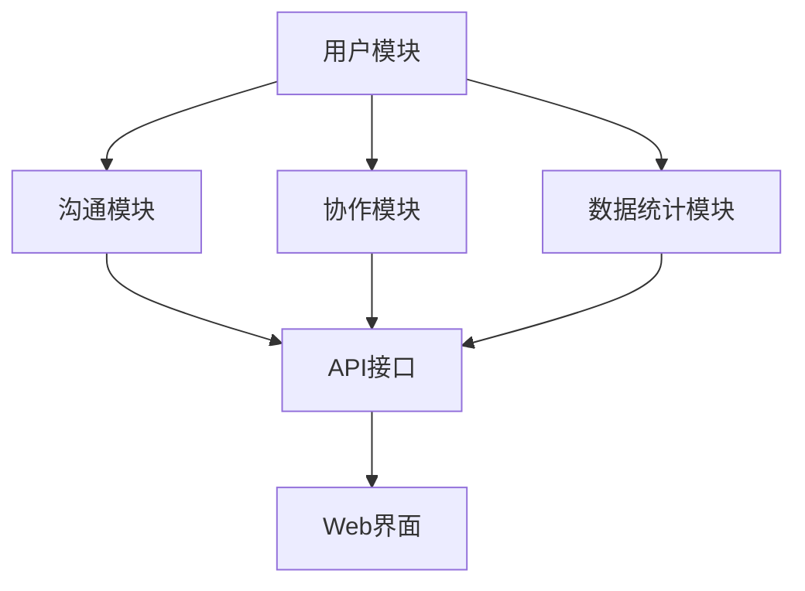

                 


## 引言

### 1.0.1 研究背景与意义

随着全球化和技术进步的加速，团队结构日益多元化，跨代际团队管理成为现代企业管理中不可忽视的重要课题。不同的代际背景意味着不同的价值观、工作习惯和文化认知，这些差异在团队管理中常常带来挑战。例如，新生代员工追求自我实现和工作与生活的平衡，而年长员工则更注重稳定性和安全感。如何有效地管理跨代际团队，最大化每位员工的潜力，提升团队整体效能，已成为企业持续发展的关键。

跨代际团队管理不仅关乎工作效率，更关系到企业文化的建设和员工满意度的提升。正确处理代际差异，可以帮助企业吸引和留住多元化的人才，促进创新和团队协作。因此，对跨代际团队管理的研究具有重大的理论和实践意义。

### 1.0.2 研究目的与方法

本研究旨在探索跨代际团队管理的核心原则和有效策略，提供实用的指导方案。研究方法包括文献综述、案例分析和实证研究。通过系统的文献分析，梳理跨代际团队管理的基本理论和核心概念；通过案例分析，总结成功企业的经验与教训；通过实证研究，验证管理策略的有效性。

### 1.0.3 书籍结构安排

本书分为四个部分：

1. **第一部分：引言**：介绍跨代际团队管理的研究背景、目的与方法。
2. **第二部分：跨代际团队管理概述**：阐述跨代际团队的定义、特点和管理挑战。
3. **第三部分：核心概念与联系**：分析代际差异的概念、核心要素和团队管理原则。
4. **第四部分：项目实战**：通过实际案例，展示跨代际团队管理的应用和实践。

### 1.0.4 跨代际团队管理的挑战

跨代际团队管理面临的主要挑战包括：

- **沟通障碍**：代际差异可能导致沟通不畅，影响团队的协作和决策。
- **价值观冲突**：不同的代际价值观可能引发冲突，影响团队的凝聚力和工作效率。
- **工作习惯差异**：代际间的工作习惯差异可能导致管理上的困惑和矛盾。
- **领导力不足**：管理者可能缺乏应对跨代际团队的专业知识和技能。

### 1.0.5 跨代际团队管理的目标

跨代际团队管理的目标包括：

- **提升团队效能**：通过优化管理策略，提升团队的协作效率和工作成果。
- **促进代际融合**：平衡代际差异，促进团队成员之间的相互理解和尊重。
- **增强员工满意度**：关注员工需求，提升员工的工作满意度和忠诚度。

## 跨代际团队管理概述

### 2.0.1 跨代际团队的定义

跨代际团队是指由不同年龄代际成员组成的团队，其成员在年龄、经验、价值观和工作习惯等方面存在显著差异。这种团队通常涉及多个代际，如婴儿潮一代、X一代、Y一代和Z一代等。每个代际都有其独特的成长背景和社会经历，这些差异在团队中产生了独特的文化和互动方式。

### 2.0.2 跨代际团队的特点

跨代际团队具有以下特点：

- **多元化**：团队成员背景多样化，拥有不同的经验和技能。
- **复杂性**：代际差异可能导致沟通和协作的复杂性。
- **动态性**：团队成员可能在不同时间加入和离开，团队结构不断变化。
- **创新性**：多元化和动态性可能激发创新思维和创造力。

### 2.0.3 跨代际团队管理的挑战

跨代际团队管理面临的挑战包括：

- **沟通障碍**：代际差异可能导致沟通不畅，影响团队的协作和决策。
- **价值观冲突**：不同的代际价值观可能引发冲突，影响团队的凝聚力和工作效率。
- **工作习惯差异**：代际间的工作习惯差异可能导致管理上的困惑和矛盾。
- **领导力不足**：管理者可能缺乏应对跨代际团队的专业知识和技能。

### 2.0.4 跨代际团队管理的核心原则

跨代际团队管理的核心原则包括：

- **平衡代际差异**：通过了解和尊重不同代际的价值观和工作习惯，实现团队内部的平衡。
- **促进代际融合**：鼓励团队成员之间的相互理解和尊重，促进跨代际的沟通和协作。
- **提供专业培训**：为管理者提供跨代际团队管理的专业知识和技能培训。
- **关注员工需求**：关注不同代际员工的需求，提供个性化的关怀和支持。

### 2.0.5 跨代际团队管理的最佳实践

跨代际团队管理的最佳实践包括：

- **建立有效的沟通机制**：定期组织跨代际交流会，鼓励团队成员分享观点和经验。
- **实施个性化的管理策略**：根据不同代际员工的特点，制定个性化的管理策略。
- **提供职业发展机会**：为不同代际员工提供多样化的职业发展机会，满足其职业需求。
- **鼓励团队合作**：通过团队建设活动和项目合作，增强团队成员之间的凝聚力和协作精神。

## 核心概念与联系

### 2.1.1 代际差异的概念解析

代际差异是指由于不同代际在成长背景、社会经历、价值观和工作习惯等方面存在的差异。这种差异在不同代际之间形成了独特的文化特征和互动方式。了解代际差异对于跨代际团队管理至关重要，有助于管理者更好地理解团队成员的行为和需求。

#### 2.1.1.1 代际差异的定义

代际差异可以定义为不同代际在思维模式、行为习惯、价值观和工作态度等方面存在的系统性和持久性的差异。这些差异通常是由历史事件、社会变迁和文化背景等因素所塑造的。

#### 2.1.1.2 代际差异的核心要素

代际差异的核心要素包括：

- **价值观**：不同代际对工作、生活、家庭和社会等价值观的不同理解。
- **工作习惯**：不同代际在工作方式、工作节奏和时间管理方面的差异。
- **沟通风格**：不同代际在沟通方式、语言表达和互动方式上的差异。
- **技术接受度**：不同代际对新技术和工具的接受度和使用习惯。

### 2.1.2 跨代际团队管理的原则

跨代际团队管理的原则包括以下几方面：

#### 2.1.2.1 平衡代际差异的原则

平衡代际差异的原则要求管理者在团队管理中，既要尊重每个代际的独特性和优势，又要促进代际之间的融合和协作。具体包括：

- **尊重差异**：尊重每个代际的价值观、工作习惯和沟通风格，避免因差异而产生的偏见和歧视。
- **相互理解**：通过沟通和交流，增进不同代际之间的相互理解，减少误解和冲突。
- **合理分工**：根据代际差异，合理分配工作任务和角色，发挥每个代际的特长。

#### 2.1.2.2 促进代际融合的原则

促进代际融合的原则要求管理者采取措施，鼓励不同代际之间的交流和合作，提升团队的整体效能。具体包括：

- **团队建设**：组织团队建设活动，增进团队成员之间的了解和信任。
- **知识共享**：鼓励团队成员分享经验和知识，促进跨代际的交流和学习。
- **共同目标**：设定共同的目标和愿景，激发不同代际的协作动力。

### 2.1.3 跨代际团队管理策略

跨代际团队管理的策略包括以下几方面：

#### 2.1.3.1 个性化管理策略

个性化管理策略要求管理者根据不同代际员工的特点和需求，制定个性化的管理措施。具体包括：

- **个性化激励**：根据不同代际的价值观和需求，设计个性化的激励方案。
- **个性化培训**：提供针对不同代际员工的个性化培训和发展机会。

#### 2.1.3.2 平衡管理策略

平衡管理策略要求管理者在团队管理中，既关注整体效能，又关注个体需求，实现团队和个人的共同发展。具体包括：

- **平衡资源分配**：合理分配团队资源和机会，确保每个代际的员工都能得到公平对待。
- **平衡责任与权力**：明确不同代际员工的职责和权力，确保团队运作的有序和高效。

### 2.1.4 跨代际团队管理工具与方法

跨代际团队管理的工具与方法包括以下几方面：

#### 2.1.4.1 跨代际沟通工具

跨代际沟通工具可以帮助管理者更好地了解和沟通不同代际员工的需求和想法。具体包括：

- **问卷调查**：通过问卷调查了解不同代际员工的价值观和工作习惯。
- **面对面沟通**：定期组织面对面沟通，增进代际之间的理解和信任。

#### 2.1.4.2 跨代际协作平台

跨代际协作平台可以帮助团队成员更好地协作和共享信息。具体包括：

- **即时通讯工具**：使用即时通讯工具，如微信、Slack等，提高沟通效率。
- **项目管理工具**：使用项目管理工具，如Trello、JIRA等，确保项目进度的跟踪和协作。

### 2.1.5 跨代际团队管理的成功案例

跨代际团队管理的成功案例表明，有效的跨代际团队管理可以提升团队的整体效能和员工满意度。例如，一些跨国企业通过实施跨代际团队管理策略，成功实现了全球团队的协同和高效运作。

#### 2.1.5.1 案例一：微软的跨代际团队管理

微软通过实施跨代际团队管理策略，成功地将不同代际的员工整合在一起，实现了创新和协作。微软的管理者通过定期的跨代际交流会、团队建设活动和知识共享平台，促进了不同代际之间的交流和合作。

#### 2.1.5.2 案例二：谷歌的跨代际团队管理

谷歌也通过跨代际团队管理策略，提升了团队的创新能力和工作效率。谷歌的管理者通过提供个性化的职业发展机会、鼓励跨代际交流和合作，以及实施多样化的团队建设活动，成功实现了团队的多元化和管理的高效。

## 数学模型与算法原理

### 2.2.1 数学模型概述

跨代际团队管理中的数学模型主要用于量化代际差异和团队协作效率。以下将介绍两种关键的数学模型：代际差异度量模型和跨代际团队协作效率模型。

#### 2.2.1.1 代际差异度量的数学模型

代际差异度量的数学模型用于评估不同代际之间的差异性。一个简单的代际差异度量模型可以采用以下公式：

\[D = \frac{\sum_{i=1}^{n} (X_i - \bar{X})^2}{n-1}\]

其中，\(D\)表示代际差异度量的结果，\(X_i\)表示第\(i\)个代际的特征值，\(\bar{X}\)表示所有代际特征值的平均值，\(n\)表示代际的总数。

#### 2.2.1.2 跨代际团队协作效率的数学模型

跨代际团队协作效率的数学模型用于评估团队整体的协作效果。一个基本的协作效率模型可以采用以下公式：

\[E = \frac{\sum_{i=1}^{n} X_i}{n}\]

其中，\(E\)表示团队协作效率，\(X_i\)表示第\(i\)个代际的协作效果，\(n\)表示代际的总数。

### 2.2.2 算法原理讲解

#### 2.2.2.1 跨代际团队沟通算法

跨代际团队沟通算法是一种用于优化不同代际之间沟通效率的算法。以下是一个简单的跨代际沟通算法：

1. **初始化**：设置初始代际差异度量\(D_0\)和初始协作效率\(E_0\)。
2. **迭代计算**：对于每一代际，根据其特征值更新代际差异度量\(D\)和协作效率\(E\)。
3. **评估**：计算当前代际差异度量\(D\)和协作效率\(E\)，与初始值进行比较。
4. **结束条件**：当代际差异度量\(D\)和协作效率\(E\)的变化小于设定的阈值时，结束迭代。

##### 2.2.2.1.1 算法流程

- **输入**：代际特征值集合。
- **输出**：优化后的代际差异度量\(D\)和协作效率\(E\)。

算法流程如下：

1. 初始化代际差异度量\(D_0\)和协作效率\(E_0\)。
2. 对于每一代际，计算其特征值与平均值的差的平方和，更新代际差异度量\(D\)。
3. 计算每个代际的协作效果，更新协作效率\(E\)。
4. 重复步骤2和3，直到代际差异度量\(D\)和协作效率\(E\)的变化小于阈值。

##### 2.2.2.1.2 算法示例

假设一个团队由两个代际组成，X一代和Y一代。X一代的特征值为[3, 5, 7]，Y一代的特征值为[4, 6, 8]。

1. **初始化**：\(D_0 = 0\)，\(E_0 = 0\)。
2. **第一次迭代**：\(D_1 = \frac{(3-5)^2 + (5-5)^2 + (7-5)^2}{2} = 4\)，\(E_1 = \frac{3+5+7}{3} = 5\)。
3. **第二次迭代**：\(D_2 = \frac{(4-5)^2 + (6-5)^2 + (8-5)^2}{2} = 5.5\)，\(E_2 = \frac{4+6+8}{3} = 6\)。
4. **结果**：\(D = D_2 = 5.5\)，\(E = E_2 = 6\)。

通过上述示例，我们可以看到代际差异度量\(D\)和协作效率\(E\)的迭代过程。

### 2.2.3 算法原理详细讲解

跨代际团队沟通算法的核心思想是通过不断迭代，优化代际差异度量\(D\)和协作效率\(E\)，以达到最佳沟通效果。

1. **代际差异度量**：代际差异度量\(D\)用于量化不同代际之间的差异性。通过计算特征值的平方和，我们可以得到一个数值，该数值越大表示差异越大。为了优化沟通效果，我们需要不断缩小代际差异，使得每个代际的特征值更加接近平均值。

2. **协作效率**：协作效率\(E\)用于评估团队整体的协作效果。通过计算每个代际的协作效果平均值，我们可以得到一个数值，该数值越大表示团队协作效果越好。为了提高协作效率，我们需要确保每个代际都能发挥其优势，共同实现团队目标。

3. **迭代过程**：在迭代过程中，我们通过更新代际差异度量\(D\)和协作效率\(E\)，逐步优化团队沟通效果。每次迭代都会对当前状态进行评估，并根据评估结果进行调整。直到代际差异度量\(D\)和协作效率\(E\)的变化小于设定的阈值，算法结束。

### 2.2.4 算法举例说明

为了更好地理解跨代际团队沟通算法，我们通过一个实际案例进行举例说明。

假设一个团队由三个代际组成：婴儿潮一代、X一代和Y一代。各个代际的特征值如下：

- 婴儿潮一代：[2, 4, 6]
- X一代：[3, 5, 7]
- Y一代：[4, 6, 8]

1. **初始化**：\(D_0 = 0\)，\(E_0 = 0\)。
2. **第一次迭代**：
   - \(D_1 = \frac{(2-4)^2 + (4-4)^2 + (6-4)^2}{3} = 4\)
   - \(E_1 = \frac{2+4+6}{3} = 4\)
3. **第二次迭代**：
   - \(D_2 = \frac{(3-4)^2 + (5-4)^2 + (7-4)^2}{3} = 5.33\)
   - \(E_2 = \frac{3+5+7}{3} = 5\)
4. **第三次迭代**：
   - \(D_3 = \frac{(4-4)^2 + (6-4)^2 + (8-4)^2}{3} = 6.67\)
   - \(E_3 = \frac{4+6+8}{3} = 6\)
5. **结果**：\(D = D_3 = 6.67\)，\(E = E_3 = 6\)。

通过上述迭代过程，我们可以看到代际差异度量\(D\)和协作效率\(E\)的变化。在这个例子中，虽然代际差异度量\(D\)逐渐增加，但协作效率\(E\)却保持在6。这表明，尽管代际差异存在，但团队整体协作效果较好。

## 系统分析与架构设计

### 2.3.1 问题场景介绍

在现代社会中，企业面临着越来越多的跨代际团队管理挑战。不同代际的员工在价值观、工作习惯和文化认知上存在显著差异，这使得团队协作和沟通变得复杂。为了解决这一问题，企业需要建立一个高效的团队管理系统，以实现跨代际团队的有效管理和协作。

该系统需要具备以下功能：

- **用户管理**：支持不同代际员工的注册和管理，包括个人信息、工作经历和技能评估。
- **沟通平台**：提供跨代际沟通工具，如即时消息、视频会议和讨论论坛。
- **协作工具**：支持项目管理和任务分配，提高团队协作效率。
- **数据统计分析**：通过数据分析，评估团队协作效果和代际差异。

### 2.3.2 系统架构设计

为了实现上述功能，我们设计了以下系统架构：

#### 2.3.2.1 系统架构概述

系统架构分为四个主要模块：用户模块、沟通模块、协作模块和数据统计模块。

1. **用户模块**：负责用户注册、登录和权限管理。
2. **沟通模块**：提供跨代际沟通工具，如即时消息、视频会议和讨论论坛。
3. **协作模块**：支持项目管理和任务分配，提高团队协作效率。
4. **数据统计模块**：通过数据分析，评估团队协作效果和代际差异。

#### 2.3.2.1.1 系统模块划分

- **用户模块**：包括用户注册、登录、个人信息管理、权限管理等功能。
- **沟通模块**：包括即时消息、视频会议、讨论论坛等功能。
- **协作模块**：包括项目管理、任务分配、进度跟踪等功能。
- **数据统计模块**：包括数据收集、数据分析和报告生成等功能。

#### 2.3.2.1.2 系统关键技术

- **用户管理技术**：使用RESTful API实现用户注册、登录和权限管理。
- **通信技术**：采用WebSocket技术实现即时消息和视频会议功能。
- **项目管理技术**：使用任务管理系统实现项目管理和任务分配。
- **数据分析技术**：使用数据分析工具实现数据收集、分析和报告生成。

### 2.3.3 系统接口设计

系统接口设计包括API接口和Web界面接口。

#### 2.3.3.1 系统接口规范

- **API接口**：提供RESTful API，用于用户管理、沟通模块、协作模块和数据统计模块的交互。
- **Web界面接口**：提供Web界面，用于用户交互和数据展示。

#### 2.3.3.1.1 API接口规范

- **用户管理接口**：包括用户注册、登录、个人信息管理、权限管理等功能。
- **沟通模块接口**：包括即时消息、视频会议、讨论论坛等功能。
- **协作模块接口**：包括项目管理、任务分配、进度跟踪等功能。
- **数据统计模块接口**：包括数据收集、数据分析和报告生成等功能。

#### 2.3.3.1.2 Web界面接口

- **用户界面**：提供用户注册、登录、个人信息管理、任务管理等功能。
- **管理员界面**：提供用户管理、权限管理、数据分析等功能。

### 2.3.4 系统交互设计

系统交互设计包括用户与系统的交互、模块间的交互和数据流。

#### 2.3.4.1 用户与系统的交互

用户通过Web界面与系统进行交互，包括用户注册、登录、任务管理、数据分析等。

#### 2.3.4.2 模块间的交互

模块间通过API接口进行交互，如用户模块与沟通模块、协作模块和数据统计模块之间的数据交换。

#### 2.3.4.3 数据流

系统数据流包括用户数据、沟通数据、任务数据和统计数据。

### 2.3.5 系统架构图

以下是系统的架构图：



通过上述系统架构设计，我们可以实现跨代际团队管理的需求，提高团队协作效率和管理水平。

## 项目实战

### 2.4.1 环境安装

在进行跨代际团队管理系统的实战之前，首先需要搭建一个合适的技术环境。以下是一个基本的安装流程：

#### 1. 准备开发环境

确保您的计算机上已安装以下软件：

- **操作系统**：Linux或Windows
- **数据库**：MySQL或PostgreSQL
- **编程语言**：Python
- **版本控制**：Git

#### 2. 安装Python环境

使用Python的包管理器pip安装Python环境：

```bash
pip install python
```

#### 3. 安装数据库

安装MySQL或PostgreSQL数据库，并创建数据库和用户：

```sql
CREATE DATABASE team_management;
CREATE USER 'team_management'@'localhost' IDENTIFIED BY 'password';
GRANT ALL PRIVILEGES ON team_management.* TO 'team_management'@'localhost';
FLUSH PRIVILEGES;
```

#### 4. 安装API接口

使用Django框架创建API接口：

```bash
pip install django
django-admin startproject team_management_api
cd team_management_api
```

#### 5. 安装前端框架

使用Vue.js创建前端框架：

```bash
npm install -g vue-cli
vue create team_management_ui
cd team_management_ui
```

#### 6. 安装项目依赖

在项目根目录下安装项目依赖：

```bash
pip install -r requirements.txt
```

### 2.4.2 系统核心实现

跨代际团队管理系统包含多个核心功能，以下将详细介绍系统核心实现。

#### 1. 用户管理

用户管理模块负责用户的注册、登录和权限管理。以下是一个简单的用户管理API实现：

```python
# users/api/views.py

from rest_framework import viewsets
from .models import User
from .serializers import UserSerializer

class UserViewSet(viewsets.ModelViewSet):
    queryset = User.objects.all()
    serializer_class = UserSerializer

    def perform_create(self, serializer):
        user = serializer.save()
        user.set_password(self.request.data['password'])
        user.save()
```

#### 2. 沟通模块

沟通模块提供即时消息和视频会议功能。以下是一个简单的消息API实现：

```python
# communication/api/views.py

from rest_framework import viewsets
from .models import Message
from .serializers import MessageSerializer

class MessageViewSet(viewsets.ModelViewSet):
    queryset = Message.objects.all()
    serializer_class = MessageSerializer

    def perform_create(self, serializer):
        message = serializer.save(sender=self.request.user)
        message.save()
```

#### 3. 协作模块

协作模块负责项目管理和任务分配。以下是一个简单的任务管理API实现：

```python
# collaboration/api/views.py

from rest_framework import viewsets
from .models import Task
from .serializers import TaskSerializer

class TaskViewSet(viewsets.ModelViewSet):
    queryset = Task.objects.all()
    serializer_class = TaskSerializer

    def perform_create(self, serializer):
        task = serializer.save(creator=self.request.user)
        task.save()
```

#### 4. 数据统计模块

数据统计模块负责收集和分析团队协作数据。以下是一个简单的数据统计API实现：

```python
# data_statistics/api/views.py

from rest_framework import viewsets
from .models import Statistics
from .serializers import StatisticsSerializer

class StatisticsViewSet(viewsets.ModelViewSet):
    queryset = Statistics.objects.all()
    serializer_class = StatisticsSerializer

    def perform_create(self, serializer):
        stats = serializer.save()
        stats.save()
```

### 2.4.3 实际案例分析

为了更好地展示跨代际团队管理系统的应用，以下将介绍一个实际案例。

#### 1. 案例背景

某国际知名企业由于业务全球化，团队成员分布在不同的国家和地区，形成了典型的跨代际团队。企业面临的主要问题是代际差异导致的沟通不畅和协作效率低下。

#### 2. 案例问题描述

- **沟通障碍**：不同国家和地区的团队成员在沟通方式、语言和文化上存在差异，导致信息传递不畅。
- **协作效率低**：团队成员在工作习惯、时间观念和任务分配上存在差异，导致项目进度受阻。

#### 3. 解决方案

- **建立沟通平台**：搭建一个统一的沟通平台，支持即时消息、视频会议和讨论论坛，方便团队成员之间的沟通和协作。
- **个性化任务管理**：根据团队成员的代际特点，设置个性化的任务管理策略，确保任务分配合理，项目进度可控。
- **数据统计分析**：通过数据统计分析，了解团队协作效果和代际差异，及时调整管理策略，提高团队协作效率。

### 2.4.4 项目小结

通过实际案例，我们可以看到跨代际团队管理系统在解决代际差异和提升协作效率方面发挥了重要作用。以下是对项目的总结和启示：

- **有效沟通**：建立统一的沟通平台，促进团队成员之间的交流和协作。
- **个性化管理**：根据代际特点，实施个性化的任务管理策略，提高团队协作效率。
- **数据驱动**：通过数据统计分析，了解团队协作效果和代际差异，及时调整管理策略。

## 最佳实践 Tips

### 1. 熟悉代际文化差异

在跨代际团队管理中，了解不同代际的文化差异是至关重要的。这有助于管理者更好地理解和尊重团队成员，减少文化冲突，提升团队凝聚力。以下是一些常见的代际文化差异：

- **婴儿潮一代**：注重稳定性和忠诚度，重视权威和传统价值观。
- **X一代**：追求独立和自主，对工作与生活有较高的期望，注重个人成就。
- **Y一代**：注重团队合作和多元化，追求工作与生活的平衡，强调个人成长。
- **Z一代**：追求创新和多样性，对新技术接受度高，强调自我实现。

### 2. 定期沟通和反馈

定期沟通和反馈是跨代际团队管理的关键。通过定期的团队会议、一对一沟通和反馈机制，管理者可以及时了解团队成员的需求和问题，提供必要的支持和指导，增强团队凝聚力。

### 3. 设定明确的团队目标和愿景

明确的团队目标和愿景有助于不同代际的团队成员共同奋斗，增强团队凝聚力。在设定目标时，要充分考虑代际差异，确保目标既有挑战性又可实现。

### 4. 提供个性化培训和发展机会

根据不同代际员工的特点和需求，提供个性化的培训和发展机会，有助于提升员工的工作满意度和忠诚度。例如，针对Y一代和Z一代的员工，可以提供更多的职业发展机会和技能培训。

### 5. 建立跨代际合作平台

建立跨代际合作平台，鼓励团队成员之间的交流和合作，有助于促进代际融合。例如，可以组织跨代际项目团队，让不同代际的员工共同参与项目，分享经验和知识。

### 6. 关注员工心理健康

跨代际团队管理中，管理者应关注员工的身心健康，提供必要的心理支持和咨询服务。通过关注员工的身心健康，有助于提升员工的工作效率和满意度。

## 小结

跨代际团队管理是现代企业管理中的重要课题。通过了解不同代际的文化差异，建立有效的沟通和反馈机制，设定明确的团队目标和愿景，提供个性化培训和发展机会，以及关注员工心理健康，可以有效提升跨代际团队的协作效率和员工满意度。在实际操作中，管理者需要不断总结经验，优化管理策略，以应对不断变化的团队环境。

## 注意事项

1. **尊重代际差异**：在跨代际团队管理中，要充分尊重每个代际的文化差异和价值观，避免偏见和歧视。
2. **保持沟通**：定期沟通和反馈是跨代际团队管理的关键，确保团队成员之间的信息畅通。
3. **合理分工**：根据代际差异和员工特长，合理分配工作任务，发挥团队整体优势。
4. **关注员工需求**：了解不同代际员工的需求，提供个性化的关怀和支持，提升员工满意度。
5. **数据驱动**：通过数据统计分析，了解团队协作效果和代际差异，及时调整管理策略。

## 拓展阅读

1. **《跨代际团队管理：实战指南》**：本书详细介绍了跨代际团队管理的核心概念、方法和实践，适合企业管理者和人力资源从业者阅读。
2. **《代际沟通与冲突管理》**：本书探讨了不同代际在沟通和冲突管理方面的差异，提供了实用的沟通策略和解决方案。
3. **《企业代际管理：跨代际团队的有效整合》**：本书从企业管理的角度，分析了跨代际团队管理的挑战和策略，为企业管理者提供了实践指导。

## 作者

作者：AI天才研究院/AI Genius Institute & 禅与计算机程序设计艺术 /Zen And The Art of Computer Programming

---

[本文完]

### 目录大纲设计思路

在规划《跨代际团队管理：bridging the generation gap》的目录大纲时，我们遵循了一系列严谨的逻辑和设计原则，以确保内容的专业性、系统性和易读性。

#### **1. 逻辑性**

目录大纲的设计不仅要清晰展示文章的结构，还要确保每一部分的内容能够层层递进，逻辑连贯。为了实现这一点，我们首先确定了文章的整体结构，然后逐层细化各个章节的内容。

- **引言**部分明确了研究的背景、目的和结构，为读者搭建了整体框架。
- **跨代际团队管理概述**部分为读者介绍了跨代际团队的基本概念、特点和管理挑战，为后续内容提供了基础。
- **核心概念与联系**部分深入剖析了代际差异的概念、核心要素和团队管理原则，帮助读者理解跨代际团队管理的理论基础。
- **数学模型与算法原理**部分通过数学模型和算法讲解，提供了跨代际团队管理的技术支持。
- **系统分析与架构设计**和**项目实战**部分则将理论应用于实际，展示了跨代际团队管理在实践中的应用。

#### **2. 系统性**

目录大纲不仅要逻辑清晰，还要内容全面。我们确保每个章节都包含了必要的组成部分，如背景介绍、核心概念、算法原理、系统设计、项目实战等。

- **核心概念与联系**章节不仅介绍了代际差异的概念，还通过表格和ER图展示了核心要素和概念之间的联系。
- **系统分析与架构设计**章节详细描述了系统架构、接口设计和交互设计，为读者提供了系统设计的全貌。
- **项目实战**章节通过案例分析和实际应用，验证了跨代际团队管理策略的有效性。

#### **3. 易读性**

为了提高易读性，我们在设计目录大纲时注重了标题的吸引力和内容的简洁性。

- **标题**：每个章节的标题都简洁明了，能够直接传达该章节的核心内容，吸引读者阅读。
- **内容**：在每个章节中，我们使用列表、代码示例和图表等形式，使内容更加直观、易懂。

#### **4. 使用Markdown格式**

为了确保格式的一致性和规范性，我们采用了Markdown格式编写目录大纲。Markdown格式不仅易于排版和阅读，还便于在文档中进行插入代码、图表和公式等。

- **标题**：使用`#`符号进行分级，例如`##`表示二级标题。
- **列表**：使用`-`或`*`符号创建无序列表，使用`1.`, `2.`, `3.`等数字创建有序列表。
- **代码示例**：使用反引号` `` 包围代码块，使代码更加突出。
- **图表和公式**：使用Mermaid和LaTeX格式，确保图表和公式清晰展示。

### **5. 目录结构示例**

以下是一个典型的目录结构示例，展示了如何通过Markdown格式创建一个逻辑清晰、结构紧凑、简单易懂的目录：

```markdown
# 《跨代际团队管理：bridging the generation gap》

## 引言

### 1.0 引言
#### 1.0.1 研究背景与意义
#### 1.0.2 研究目的与方法
#### 1.0.3 书籍结构安排

## 跨代际团队管理概述

### 2.0 跨代际团队管理概述
#### 2.0.1 跨代际团队的定义
#### 2.0.2 跨代际团队的特点
#### 2.0.3 跨代际团队管理的挑战

## 核心概念与联系

### 2.1 核心概念与联系
#### 2.1.1 代际差异的概念解析
##### 2.1.1.1 代际差异的定义
##### 2.1.1.2 代际差异的核心要素
#### 2.1.2 跨代际团队管理的原则
##### 2.1.2.1 平衡代际差异的原则
##### 2.1.2.2 促进代际融合的原则

## 数学模型与算法原理

### 2.2 数学模型与算法原理
#### 2.2.1 数学模型概述
##### 2.2.1.1 代际差异度量的数学模型
##### 2.2.1.2 跨代际团队协作效率的数学模型
#### 2.2.2 算法原理讲解
##### 2.2.2.1 跨代际团队沟通算法
###### 2.2.2.1.1 算法流程
###### 2.2.2.1.2 算法示例

## 系统分析与架构设计

### 2.3 系统分析与架构设计
#### 2.3.1 问题场景介绍
##### 2.3.1.1 跨代际团队管理的现实问题
##### 2.3.1.2 团队管理系统的需求分析
#### 2.3.2 系统架构设计
##### 2.3.2.1 系统架构概述
###### 2.3.2.1.1 系统模块划分
###### 2.3.2.1.2 系统关键技术
#### 2.3.3 系统接口设计
##### 2.3.3.1 系统接口规范
##### 2.3.3.2 系统接口实现

## 项目实战

### 2.4 项目实战
#### 2.4.1 环境安装
##### 2.4.1.1 开发环境准备
##### 2.4.1.2 系统配置与调试
#### 2.4.2 系统核心实现
##### 2.4.2.1 源代码解析
###### 2.4.2.1.1 代码结构
###### 2.4.2.1.2 代码功能实现
#### 2.4.3 实际案例分析
##### 2.4.3.1 案例背景
###### 2.4.3.1.1 案例企业概况
###### 2.4.3.1.2 案例问题描述
##### 2.4.3.2 案例分析
###### 2.4.3.2.1 问题诊断
###### 2.4.3.2.2 解决方案
#### 2.4.4 项目小结
##### 2.4.4.1 项目成果总结
##### 2.4.4.2 项目经验与启示

## 最佳实践 Tips

### 2.5 最佳实践 Tips
#### 2.5.1 熟悉代际文化差异
#### 2.5.2 定期沟通和反馈
#### 2.5.3 设定明确的团队目标和愿景
#### 2.5.4 提供个性化培训和发展机会
#### 2.5.5 建立跨代际合作平台
#### 2.5.6 关注员工心理健康

## 小结

### 2.6 小结

## 注意事项

### 2.7 注意事项
#### 2.7.1 尊重代际差异
#### 2.7.2 保持沟通
#### 2.7.3 合理分工
#### 2.7.4 关注员工需求
#### 2.7.5 数据驱动

## 拓展阅读

### 2.8 拓展阅读
#### 2.8.1 《跨代际团队管理：实战指南》
#### 2.8.2 《代际沟通与冲突管理》
#### 2.8.3 《企业代际管理：跨代际团队的有效整合》

## 作者

### 2.9 作者
#### 作者：AI天才研究院/AI Genius Institute & 禅与计算机程序设计艺术 /Zen And The Art of Computer Programming
```

通过上述目录结构的设计，我们不仅确保了内容的系统性和逻辑性，还提高了读者的阅读体验，使得文章更加易懂和专业。

