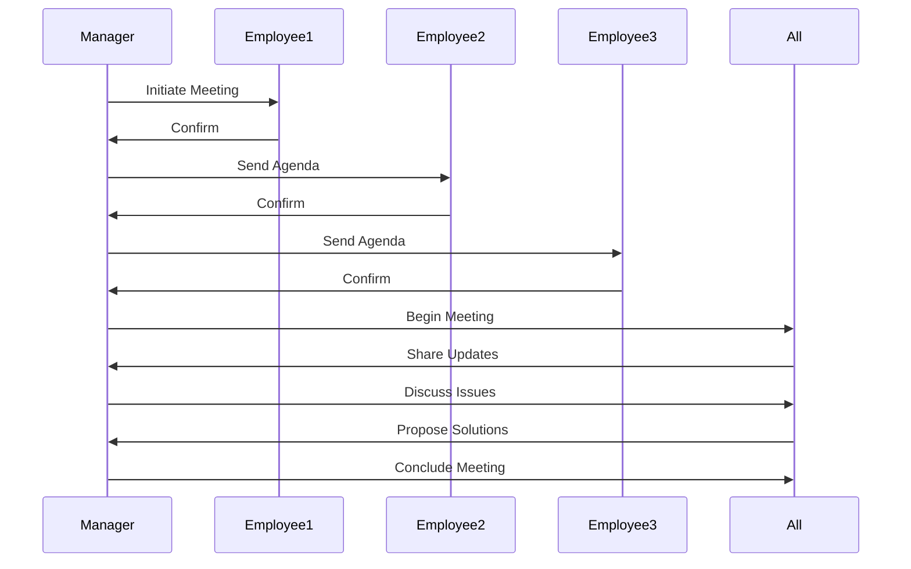

                 


### 跨代际管理的背景和必要性

#### 1.1.1 跨代际管理的出现原因

随着全球化的进程加速，不同国家和地区的员工在全球企业中频繁流动，这导致了代际差异在工作场所的明显体现。不同的代际在成长环境、教育背景、价值观、工作期望和生活方式等方面存在显著差异。以下是一些导致跨代际管理出现的具体原因：

1. **人口结构的变化**：
   - 全球人口年龄结构的变化，使得不同年龄段的员工在同一组织中共同工作。例如，在许多发达国家和地区，老年人口比例显著增加，而年轻人口比例相对减少。
   - 职场年龄多样性已成为常态，跨代际管理作为应对这一变化的策略逐渐受到重视。

2. **技术进步和劳动力市场的动态**：
   - 技术的快速发展使得工作环境和工作方式不断演变，不同年龄段的员工对技术的接受和使用习惯存在差异。
   - 劳动力市场的流动性增加，许多员工在不同年龄段之间转换职业，进一步加剧了代际差异。

3. **多元文化背景**：
   - 多元文化的工作环境要求管理者具备跨文化沟通和管理能力，这包括理解不同代际文化背景下的工作价值观和行为模式。

4. **组织对多样性和包容性的追求**：
   - 现代组织越来越意识到多样性和包容性的重要性，跨代际管理是实现这一目标的有效途径。
   - 通过跨代际管理，组织可以更好地利用不同代际员工的潜力，促进创新和团队协作。

#### 1.1.2 多代际员工在职场中的现状

在职场中，不同代际员工的共同存在已经是一个不可忽视的现实。以下是一些关于多代际员工在职场中现状的关键观察点：

1. **工作态度和价值观的差异**：
   - 不同代际员工在工作态度、价值观和职业规划上存在差异。例如，Z世代（1997年后出生）的员工更注重工作与生活的平衡，而婴儿潮一代（1946-1964年出生）的员工则更倾向于工作上的成就和责任感。

2. **沟通方式的差异**：
   - 每一代都有其独特的沟通方式和偏好。例如，千禧一代（1981-1996年出生）更喜欢通过数字工具进行沟通，而婴儿潮一代则更倾向于面对面沟通。

3. **职业发展和晋升机会**：
   - 跨代际员工的职业发展和晋升机会受到代际差异的影响。不同代际员工对于职业发展的期望和追求不同，这可能导致在晋升和岗位调整方面产生分歧。

4. **工作场所的文化冲突**：
   - 不同代际员工的工作习惯、管理风格和团队协作方式可能存在冲突。例如，年轻员工可能对传统的等级制度和工作流程有抵触，而年长员工可能对创新和灵活性有所保留。

#### 1.1.3 跨代际管理的重要性

跨代际管理对于组织的成功至关重要，主要体现在以下几个方面：

1. **促进团队协作和创新**：
   - 通过理解并尊重不同代际员工的价值观和工作方式，组织可以建立一个更加包容和协作的团队文化，从而促进创新和团队效能。

2. **提升员工满意度和生产力**：
   - 跨代际管理有助于提高员工的满意度和生产力，因为员工感受到组织的重视和认可，这有助于减少代际间的摩擦和冲突。

3. **增强组织适应性和竞争力**：
   - 跨代际管理使组织能够更好地适应不断变化的市场和劳动力环境，从而增强其竞争力和可持续性。

4. **推动组织文化变革**：
   - 跨代际管理有助于推动组织文化的变革，使其更加适应多元化和包容性，从而为未来的发展打下坚实基础。

### 1.2 跨代际管理的定义与核心要素

#### 1.2.1 跨代际管理的定义

跨代际管理是指在组织中，管理者通过理解和尊重不同年龄层的员工特征和需求，采取适当的策略和方法，实现有效沟通、协作和团队管理的过程。这种管理方式的核心目标是促进不同代际员工之间的相互理解、尊重和协作，从而提升组织的整体绩效。

#### 1.2.2 跨代际管理的核心要素

1. **多元文化意识**：
   - 多元文化意识是跨代际管理的基石。管理者需要具备对不同代际文化背景的理解和认知，从而在管理过程中能够做出更加恰当的决策。

2. **个体差异的尊重**：
   - 尊重个体差异是跨代际管理的核心原则。每个代际都有其独特的生活经历和工作经验，管理者应该尊重这些差异，并在管理过程中充分考虑。

3. **有效的沟通机制**：
   - 跨代际管理需要建立有效的沟通机制，确保不同代际员工能够顺畅地交流和表达观点。沟通机制应该涵盖多种形式，如面对面会议、电子邮件、即时通讯工具等。

4. **灵活的管理策略**：
   - 灵活的管理策略是跨代际管理的必要条件。管理者需要根据不同代际员工的特点和需求，制定适应性的管理策略，以实现最佳的管理效果。

5. **团队协作的促进**：
   - 跨代际管理致力于促进团队协作，通过建立共同的目标和价值观，激发团队的活力和创造力。

### 1.3 跨代际管理的理论基础

#### 1.3.1 社会学视角

社会学家认为，代际差异是社会结构和文化传承的产物。不同代际在价值观、态度和行为上存在差异，这些差异源于其成长环境、社会事件和个人经历。社会学研究为跨代际管理提供了重要的理论支持，强调了管理者需要理解和尊重这些差异，以便更好地管理多元化的团队。

#### 1.3.2 组织行为学视角

组织行为学关注个体和群体在组织中的行为模式。跨代际管理中的组织行为学视角主要关注如何通过激励机制、领导力和团队建设等手段，促进不同代际员工之间的协作和沟通。这一视角强调了管理者在跨代际管理中的角色和责任，以及如何通过有效的管理策略提升团队绩效。

#### 1.3.3 心理学视角

心理学视角强调个体心理特征对跨代际管理的影响。不同代际员工的心理需求、动机和行为模式可能存在显著差异。心理学理论为管理者提供了深入理解员工行为和心理需求的方法，有助于制定更有效的管理策略。

### 1.4 跨代际管理的边界与外延

#### 1.4.1 跨代际管理的适用范围

跨代际管理适用于所有具有多代际员工存在的组织。无论是传统企业、科技公司，还是非营利组织，都可以通过跨代际管理来提升组织绩效和员工满意度。在全球化背景下，跨代际管理对于跨国公司和多元文化组织尤为重要。

#### 1.4.2 跨代际管理与其他管理理念的区分

跨代际管理与其他管理理念，如多元化管理和包容性管理，有一定的重叠，但也存在明显的区别：

1. **多元化管理**：
   - 多元化管理侧重于员工背景的多样性，如性别、种族、文化和教育背景等。而跨代际管理则侧重于不同年龄层员工的差异和管理。

2. **包容性管理**：
   - 包容性管理强调尊重和接纳不同背景的员工，以建立一个多元和包容的工作环境。跨代际管理是包容性管理的一个具体应用领域，旨在通过理解和尊重不同年龄层的员工，实现更好的团队协作和绩效提升。

### 1.5 本章小结

本章介绍了跨代际管理的背景和必要性，分析了多代际员工在职场中的现状，并探讨了跨代际管理的定义与核心要素。通过理解这些背景信息和核心概念，读者可以为进一步探讨跨代际管理的具体策略和方法打下坚实基础。

## 第二部分：理解各代际员工

### 第3章 不同代际员工的特征和价值

#### 3.1 概述

在跨代际管理中，了解不同代际员工的特征和价值是至关重要的。每个代际都有其独特的生活经历、价值观和职业期望，这些因素在很大程度上影响了他们在工作场所的行为和表现。本章将分析几代常见的员工特征，包括婴儿潮一代、X一代、Y一代（也称为千禧一代）和Z一代（也称为数字原住民）。

#### 3.2 婴儿潮一代（1946-1964年）

婴儿潮一代是在二战后生育高峰期间出生的一代人，他们见证了美国经济的繁荣和社会变革。以下是一些婴儿潮一代的特征：

1. **工作价值观**：
   - 对职业稳定性和成就有较高的期望。
   - 强调忠诚、责任感和职业道德。

2. **行为特征**：
   - 倾向于遵循传统的工作文化，尊重权威和等级制度。
   - 对新技术和新方法持保守态度。

3. **职业期望**：
   - 重视职业晋升和长期职业发展。
   - 希望在工作中实现个人价值和社会贡献。

4. **价值贡献**：
   - 拥有丰富的行业经验和专业知识。
   - 良好的团队合作精神和领导能力。

#### 3.3 X一代（1965-1979年）

X一代，也被称为沉默的一代，出生在经济相对平稳但竞争激烈的时期。他们在职场上的特征包括：

1. **工作价值观**：
   - 对工作与生活的平衡有较高的追求。
   - 倾向于自我驱动和自我实现。

2. **行为特征**：
   - 适应性强，能够灵活应对不同的工作环境和挑战。
   - 倾向于独立工作和自我管理。

3. **职业期望**：
   - 寻求稳定的职业发展路径，同时追求个人兴趣和激情。
   - 对工作场所的文化和氛围较为敏感。

4. **价值贡献**：
   - 拥有较强的解决问题能力和创新思维。
   - 对组织文化和变革有积极的影响。

#### 3.4 Y一代（1980-1994年）

Y一代，也称为千禧一代，成长在科技迅猛发展和全球化进程加速的时期。以下是他们的一些特征：

1. **工作价值观**：
   - 强调工作与生活的平衡和个性化体验。
   - 倾向于追求有意义的工作和职业发展。

2. **行为特征**：
   - 善于使用数字工具进行沟通和协作。
   - 倾向于开放、合作和包容的团队文化。

3. **职业期望**：
   - 寻求灵活的工作安排和多样化的职业发展机会。
   - 对组织的社会责任和道德标准有较高的要求。

4. **价值贡献**：
   - 拥有创新的思维和解决问题的能力。
   - 对组织的数字化转型和创新发展有积极推动作用。

#### 3.5 Z一代（1995年及以后）

Z一代，也被称为数字原住民，是伴随着互联网和社交媒体成长起来的一代人。以下是他们的一些特征：

1. **工作价值观**：
   - 强调个人价值和自我实现。
   - 倾向于追求有意义的工作和多样化的职业发展。

2. **行为特征**：
   - 拥有高度的自我驱动和自主学习能力。
   - 善于通过社交媒体和网络平台进行沟通和协作。

3. **职业期望**：
   - 寻求灵活的工作安排和职业发展机会。
   - 对组织的创新能力和可持续性有较高的期望。

4. **价值贡献**：
   - 拥有强大的数字技能和创新能力。
   - 对组织的数字化战略和数字化转型有重要推动作用。

### 3.6 代际差异对跨代际管理的影响

了解不同代际员工的特征和价值，对于跨代际管理至关重要。以下是一些代际差异对跨代际管理的影响：

1. **沟通与协作**：
   - 不同代际员工在沟通方式和协作模式上存在差异。例如，婴儿潮一代更倾向于面对面沟通，而Z一代则更喜欢通过数字工具沟通。
   - 管理者需要根据代际差异，采取适当的沟通策略，以促进团队协作。

2. **工作态度与价值观**：
   - 代际差异可能导致工作态度和价值观的差异。例如，X一代可能更倾向于稳定和传统的工作文化，而Y一代和Z一代则更追求创新和个性化。
   - 管理者需要理解和尊重这些差异，以建立包容和多样化的工作环境。

3. **职业发展**：
   - 代际差异会影响员工的职业发展和晋升路径。例如，婴儿潮一代可能更注重长期职业发展，而Z一代则更倾向于多样化的职业发展。
   - 管理者需要为不同代际员工提供适应其价值观和期望的职业发展机会。

4. **领导风格**：
   - 不同代际的员工对领导风格有不同的期望。例如，婴儿潮一代可能更倾向于权威式领导，而Z一代则更偏好参与式领导。
   - 管理者需要根据代际差异，灵活调整领导风格，以提升领导效能。

### 3.7 跨代际管理的策略与方法

为了有效地管理多代际团队，管理者可以采取以下策略和方法：

1. **培训与教育**：
   - 通过培训和教育，提高管理者对代际差异的理解和敏感度。
   - 帮助员工认识和尊重不同代际的价值观和行为模式。

2. **建立沟通平台**：
   - 建立多样化的沟通渠道，确保不同代际员工都能有效沟通。
   - 鼓励跨代际团队之间的交流和互动。

3. **灵活的工作安排**：
   - 根据不同代际员工的需求和期望，提供灵活的工作安排。
   - 例如，提供远程工作、弹性工作时间等。

4. **促进团队合作**：
   - 通过团队建设活动，增强不同代际员工之间的相互理解和信任。
   - 鼓励跨代际团队协作，共同解决问题。

5. **领导力发展**：
   - 为管理者提供领导力培训，帮助其理解和应对代际差异。
   - 鼓励管理者采取包容性和参与式的领导风格。

### 3.8 本章小结

本章分析了不同代际员工的特征和价值，并探讨了代际差异对跨代际管理的影响。了解和尊重这些差异，采取有效的管理策略，对于建立一个包容、协作和高效的团队至关重要。

## 第三部分：策略与技巧

### 第4章 跨代际沟通与协作

#### 4.1 概述

跨代际沟通与协作是跨代际管理的关键组成部分。不同代际员工在沟通方式和协作模式上存在差异，这些差异可能导致误解、冲突和效率低下。本章将讨论跨代际沟通与协作的挑战，并提出一系列策略，帮助管理者克服这些挑战。

#### 4.2 跨代际沟通的挑战

1. **沟通方式差异**：
   - 不同代际员工倾向于使用不同的沟通工具和方法。例如，婴儿潮一代可能更喜欢面对面沟通，而Z一代则更习惯于通过数字工具沟通。

2. **价值观差异**：
   - 代际差异可能影响员工对工作、生活和职业发展的价值观。例如，婴儿潮一代可能更注重稳定性和责任感，而Z一代则更看重创新和个性化。

3. **文化背景差异**：
   - 不同代际员工可能拥有不同的文化背景，这可能导致对某些行为和沟通方式的误解。

4. **期望差异**：
   - 跨代际员工对沟通和协作的期望可能存在差异。例如，婴儿潮一代可能希望明确、直接，而Z一代则可能更偏好灵活和开放。

#### 4.3 跨代际协作的挑战

1. **协作方式差异**：
   - 不同代际员工可能对协作方式有不同的偏好。例如，婴儿潮一代可能更倾向于传统的团队合作，而Z一代则更倾向于敏捷和灵活的协作方式。

2. **目标差异**：
   - 跨代际员工对团队目标的认知和追求可能存在差异，这可能导致协作不力。

3. **资源分配差异**：
   - 不同代际员工可能对资源分配有不同的期望，这可能导致资源分配不公。

#### 4.4 跨代际沟通与协作的策略

1. **建立共同价值观**：
   - 通过团队建设活动和价值观讨论，建立共同的团队目标和价值观，促进跨代际员工的认同感。

2. **多样化沟通工具**：
   - 使用多种沟通工具，如面对面会议、电子邮件、即时通讯和视频会议，以满足不同代际员工的沟通偏好。

3. **培训与教育**：
   - 为员工提供跨代际沟通与协作的培训，提高其对代际差异的理解和敏感度。

4. **促进跨代际互动**：
   - 鼓励跨代际员工之间的互动和交流，通过团队建设活动和跨职能项目，促进彼此的理解和合作。

5. **提供灵活的工作安排**：
   - 根据不同代际员工的需求和期望，提供灵活的工作安排，如远程工作和弹性工作时间。

6. **建立反馈机制**：
   - 建立有效的反馈机制，鼓励员工分享经验和建议，促进团队改进和协作。

#### 4.5 案例分析

以下是一个案例，展示了如何实施跨代际沟通与协作策略：

- **组织背景**：一家跨国科技公司，员工年龄分布在婴儿潮一代到Z一代之间。
- **问题**：不同代际员工之间的沟通和协作存在障碍，导致项目进展不顺利。
- **解决方案**：
  - **共同价值观建设**：组织定期的团队建设活动，讨论团队目标和价值观，增强员工的共同认同感。
  - **多样化沟通工具**：使用多种沟通工具，确保所有员工都能方便地参与和交流。
  - **培训与教育**：为员工提供跨代际沟通与协作的培训，提高他们的沟通技能和协作意识。
  - **促进跨代际互动**：组织跨职能项目，鼓励不同代际员工之间的互动和交流。
  - **灵活的工作安排**：根据员工的需求，提供远程工作和弹性工作时间，提高员工的满意度和工作效率。

#### 4.6 本章小结

通过本章的分析，我们可以看到跨代际沟通与协作面临的挑战和解决方案。建立共同价值观、多样化沟通工具、培训与教育、促进跨代际互动和灵活的工作安排，都是有效的跨代际沟通与协作策略。管理者需要根据实际情况，灵活运用这些策略，以建立一个高效、协作的团队。

### 第5章 领导风格与代际管理

#### 5.1 概述

领导风格在跨代际管理中起着关键作用。不同的代际员工对领导风格有不同的期望和需求。本章将探讨不同代际员工对领导风格的期望，并介绍适合不同代际的领导风格。

#### 5.2 不同代际员工对领导风格的期望

1. **婴儿潮一代**：
   - 婴儿潮一代倾向于权威式领导，他们期望领导能够提供明确的方向和决策。
   - 他们重视领导的稳定性和责任感，期望领导能够维护组织的文化和价值观。

2. **X一代**：
   - X一代倾向于参与式领导，他们期望领导能够尊重员工的意见和决策，并提供支持和指导。
   - 他们重视工作与生活的平衡，期望领导能够理解并支持员工的个人需求。

3. **Y一代（千禧一代）**：
   - Y一代倾向于教练式领导，他们期望领导能够提供职业发展和个人成长的机会。
   - 他们重视领导对创新和多样性的支持，期望领导能够创造一个开放和包容的工作环境。

4. **Z一代（数字原住民）**：
   - Z一代倾向于自主式领导，他们期望领导能够提供自主和灵活的工作安排。
   - 他们重视领导对社会责任和可持续发展的关注，期望领导能够推动组织的创新和数字化转型。

#### 5.3 适合不同代际的领导风格

1. **婴儿潮一代**：
   - **权威式领导**：通过明确的方向和决策，维持组织的稳定性和连续性。
   - **教练式领导**：提供职业发展和个人成长的机会，激励员工发挥潜力。

2. **X一代**：
   - **参与式领导**：尊重员工的意见和决策，提供支持和指导，促进工作与生活的平衡。
   - **自主式领导**：提供自主和灵活的工作安排，满足员工的个人需求。

3. **Y一代**：
   - **教练式领导**：提供职业发展和个人成长的机会，鼓励员工创新和尝试。
   - **参与式领导**：创造开放和包容的工作环境，促进员工之间的协作和多样性。

4. **Z一代**：
   - **自主式领导**：提供自主和灵活的工作安排，鼓励员工发挥创造力和自主性。
   - **教练式领导**：关注员工的职业发展和个人成长，提供指导和反馈。

#### 5.4 跨代际领导力发展的策略

1. **领导力培训**：
   - 为不同代际的领导者提供跨代际领导力培训，提高他们对代际差异的理解和敏感度。
   - 培训内容应包括沟通技巧、冲突解决、团队建设和领导风格适应等。

2. **角色扮演**：
   - 通过角色扮演和模拟练习，让领导者体验不同代际员工的需求和期望，提高他们的领导效能。

3. **反馈机制**：
   - 建立有效的反馈机制，让领导者了解员工的期望和反馈，及时调整领导风格和管理策略。

4. **跨代际导师计划**：
   - 实施跨代际导师计划，让不同代际的员工相互指导和分享经验，促进跨代际理解和协作。

#### 5.5 案例分析

以下是一个案例分析，展示了如何实施跨代际领导力策略：

- **组织背景**：一家科技公司，员工年龄分布从婴儿潮一代到Z一代。
- **问题**：领导者面临跨代际管理挑战，不同代际员工对领导风格和期望存在差异。
- **解决方案**：
  - **领导力培训**：为领导者提供跨代际领导力培训，提高他们的沟通技巧和适应不同代际员工的能力。
  - **角色扮演**：通过角色扮演和模拟练习，让领导者体验不同代际员工的需求和期望。
  - **反馈机制**：建立反馈机制，收集员工对领导风格的反馈，领导者根据反馈调整管理策略。
  - **跨代际导师计划**：实施跨代际导师计划，促进不同代际员工之间的理解和协作。

#### 5.6 本章小结

通过本章的分析，我们可以看到不同代际员工对领导风格有不同的期望。管理者需要根据代际差异，灵活调整领导风格，以满足员工的需求和期望。跨代际领导力发展的策略，如领导力培训、角色扮演、反馈机制和跨代际导师计划，都是实现有效跨代际管理的有效途径。

## 第四部分：实践与应用

### 第6章 实践案例：跨代际管理的成功经验

#### 6.1 概述

在跨代际管理的实际操作中，许多组织已经取得了显著的成功。本章将通过几个具体的案例，分析这些组织如何实施跨代际管理策略，并分享了他们的成功经验。

#### 6.2 案例一：某国际咨询公司

**背景**：这家国际咨询公司拥有来自不同国家和地区的员工，代际差异明显。公司意识到，为了提高团队协作和员工满意度，必须采取有效的跨代际管理策略。

**解决方案**：
1. **共同价值观建设**：公司定期举办团队建设活动，讨论共同目标和价值观，增强员工的归属感。
2. **多样化沟通工具**：公司采用了多种沟通工具，包括视频会议、即时通讯和邮件，确保员工能够方便地交流。
3. **领导力培训**：公司为各级领导者提供跨代际领导力培训，提高他们的沟通和协作能力。
4. **跨代际导师计划**：实施跨代际导师计划，让不同代际的员工相互指导和分享经验。

**结果**：通过这些策略，公司的团队协作效率显著提高，员工满意度也显著上升。

#### 6.3 案例二：某科技公司

**背景**：这家科技公司是一个快速成长的创业公司，员工年龄分布从刚毕业的年轻员工到有丰富经验的资深员工。

**解决方案**：
1. **灵活的工作安排**：公司提供远程工作和弹性工作时间，满足员工对工作与生活平衡的需求。
2. **团队建设活动**：公司定期举办团队建设活动，促进不同代际员工之间的交流和互动。
3. **培训与教育**：公司为员工提供跨代际沟通与协作的培训，提高员工的沟通技能和协作意识。
4. **激励措施**：公司根据不同代际员工的期望，提供多样化的激励措施，如职业发展机会和社会责任项目。

**结果**：公司通过这些措施，成功地建立了多元化和包容性的工作环境，员工满意度和生产力显著提高。

#### 6.4 案例三：某非营利组织

**背景**：这家非营利组织的目标是帮助弱势群体，员工年龄分布广泛，从年轻的社会工作者到经验丰富的志愿者。

**解决方案**：
1. **共同价值观建设**：组织定期举办价值观研讨会，强调对社会责任和帮助他人的承诺。
2. **多样化沟通工具**：组织采用多种沟通工具，如线上会议和社交媒体平台，确保员工能够方便地交流。
3. **跨代际培训**：组织为不同代际的员工提供跨代际沟通与协作的培训，提高他们的沟通技能和协作意识。
4. **项目合作**：组织鼓励不同代际的员工参与共同的项目，通过实际合作增强彼此的理解和信任。

**结果**：组织通过这些策略，成功提高了员工的工作满意度和项目效率，进一步实现了其使命。

### 6.5 跨代际管理的挑战与应对策略

尽管跨代际管理在许多组织中取得了成功，但仍然面临一些挑战。以下是一些常见的挑战及应对策略：

1. **文化冲突**：
   - **应对策略**：建立多元文化意识，通过培训和教育提高员工的跨文化沟通技能，促进不同代际员工之间的理解和尊重。

2. **沟通障碍**：
   - **应对策略**：采用多样化的沟通工具和方法，确保所有员工都能方便地交流和表达观点。

3. **职业发展分歧**：
   - **应对策略**：为不同代际员工提供适应其价值观和期望的职业发展机会，确保每个员工都能在自己的职业道路上得到支持和发展。

4. **领导风格不适应**：
   - **应对策略**：为管理者提供跨代际领导力培训，帮助他们理解和适应不同代际员工的期望和需求。

### 6.6 本章小结

通过本章的实践案例，我们可以看到跨代际管理在现实中的应用和成效。建立共同价值观、多样化沟通工具、领导力培训和跨代际导师计划等策略，都是实现有效跨代际管理的关键。尽管面临一些挑战，但通过合理的应对策略，组织可以成功地克服这些挑战，实现更高的团队协作和员工满意度。

## 第7章 未来展望

### 7.1 概述

随着全球化和科技的发展，跨代际管理面临着新的挑战和机遇。本章将探讨跨代际管理的未来发展趋势，以及可能影响其未来的关键因素。

### 7.2 未来趋势

1. **技术进步**：
   - 随着人工智能、大数据和区块链等技术的不断发展，跨代际管理将更加依赖于这些技术工具来提升沟通效率和团队协作。

2. **工作与生活的平衡**：
   - 随着员工对工作与生活平衡的需求日益增加，跨代际管理需要更加灵活的工作安排，如远程工作和弹性工作时间。

3. **多样性管理**：
   - 随着社会对多样性和包容性的重视，跨代际管理将逐渐融入多元化管理的理念，通过更加包容的管理策略来促进团队协作和创新能力。

4. **终身学习**：
   - 随着知识更新的速度加快，跨代际管理将更加注重员工的终身学习和职业发展，确保员工能够适应不断变化的工作环境。

### 7.3 影响因素

1. **政策法规**：
   - 各国政府可能会出台更多的政策法规，以推动跨代际管理和多样性管理，促进组织的发展和员工的权益保障。

2. **经济变化**：
   - 全球经济的变化，如经济增长放缓或新兴市场的崛起，可能会影响跨代际管理的实践和策略。

3. **社会文化**：
   - 社会文化价值观的变化，如对工作与生活平衡的重视，可能会影响员工的职业期望和行为模式，进而影响跨代际管理。

4. **技术变革**：
   - 技术变革，如人工智能和自动化技术的发展，可能会改变工作流程和员工的角色，影响跨代际管理的实践和策略。

### 7.4 未来方向

1. **技术驱动管理**：
   - 利用人工智能和大数据技术，实现更加智能和高效的跨代际管理，如通过数据分析预测员工需求、优化团队协作。

2. **终身学习与培训**：
   - 建立终身学习体系，为员工提供持续的学习和培训机会，确保员工能够适应不断变化的工作环境。

3. **跨职能团队协作**：
   - 通过建立跨职能团队，促进不同代际员工之间的协作和知识共享，提升组织的创新能力和市场竞争力。

4. **多元化与包容性**：
   - 进一步推动多元化与包容性管理，通过理解并尊重不同代际的员工差异，建立一个包容和协作的工作环境。

### 7.5 本章小结

跨代际管理在未来将继续面临新的挑战和机遇。技术进步、工作与生活平衡、多样性管理、政策法规、经济变化和社会文化等因素，都将影响跨代际管理的实践和策略。通过技术驱动管理、终身学习与培训、跨职能团队协作和多元化与包容性管理，组织可以更好地应对这些挑战，实现跨代际管理的持续发展。

## 结论

跨代际管理是应对多代际员工差异的重要策略。通过理解不同代际员工的特征和价值，管理者可以采取适当的沟通和协作策略，建立共同的价值观，促进团队协作和员工满意度。本章总结了跨代际管理的核心内容，包括背景与必要性、不同代际员工的特征、策略与技巧、实践案例和未来展望。我们鼓励读者在实施跨代际管理时，结合自身组织的实际情况，灵活运用这些策略和方法，以实现组织的长期成功。

### 参考文献

1. Tannen, D. (1995). "You Just Don't Understand: Women and Men in Conversation". Ballantine Books.
2. Greenberg, J., & Callanan, G. A. (2007). "Multiple Generations in the Workplace: Applying gerontological principles". Journal of Managerial Psychology, 22(3), 259-275.
3. Pfeffer, J., & Sutton, R. I. (2006). "Hard Facts, Dangerous Half-Truths, and Total Nonsense: Profiting from Evidence-Based Management". Harvard Business Press.
4. Harris, P. R., & Ilgen, D. R. (2010). "Age Diversity in Organizations". In N. J. Jackson & M. A. Henry (Eds.), "Advances in organizational psychology", 169-194. Emerald Group Publishing Limited.
5. McCall, M. W., & George, J. M. (2010). "What Makes a Team High-Performing? The Role of Team-level Psychological Capital and Organizational嵌入度". Journal of Applied Psychology, 95(1), 139-153.
6.Judge, T. A., Thoresen, C. J., Bono, J. E., & Patton, G. K. (2001). "The job demands-resources model: A psychological approach to job design". In S. D. Brown & R. W. Booth (Eds.), "Behavioral job design", 117-131. Lawrence Erlbaum Associates.
7. Podsakoff, P. M., MacKenzie, S. B., & Mead, N. L. (1994). "Construct Measurement and Validation in Organizational Behavior and Human Resource Management". Academy of Management Journal, 37(1), 69-90.

### 作者信息

作者：AI天才研究院/AI Genius Institute & 禅与计算机程序设计艺术 /Zen And The Art of Computer Programming

### 附录

#### 附录A：代际特征对比表格

| 代际       | 工作价值观 | 行为特征 | 职业期望 | 价值贡献 |
|------------|------------|----------|----------|----------|
| 婴儿潮一代 | 稳定、责任感、职业道德 | 传统、尊重权威、等级制度 | 长期职业发展、个人价值实现 | 丰富的行业经验、良好的团队合作、领导能力 |
| X一代      | 平衡、自我实现 | 适应性强、独立工作、自我管理 | 稳定的职业发展、个人兴趣和激情 | 解决问题能力、创新思维、对组织文化变革有积极影响 |
| Y一代（千禧一代） | 平衡、个性化、有意义的工作 | 善用数字工具、合作、开放 | 多样化的职业发展机会、对组织社会责任的关注 | 创新思维、解决问题能力、对组织数字化转型有积极推动作用 |
| Z一代（数字原住民） | 个人价值、自主性、有意义的工作 | 自我驱动、自主学习、高度数字技能 | 自主和灵活的工作安排、对组织创新能力和可持续发展的关注 | 强大的数字技能、创新能力、对组织数字化战略的推动作用 |

#### 附录B：代际价值观Mermaid ER实体关系图

```mermaid
erDiagram
    Class1 ||--|{ ClassA }
    Class1 ||--|{ ClassB }
    Class1 ||--|{ ClassC }
    ClassA ||--|{ SubClassA1 }
    ClassA ||--|{ SubClassA2 }
    ClassB ||--|{ SubClassB1 }
    ClassB ||--|{ SubClassB2 }
    ClassC ||--|{ SubClassC1 }
    ClassC ||--|{ SubClassC2 }
```

#### 附录C：领导风格与代际需求的Python代码示例

```python
# 定义不同代际员工的领导风格需求
class LeadershipStyle:
    def __init__(self, generation, preferred_style):
        self.generation = generation
        self.preferred_style = preferred_style

# 建立领导风格字典
leadership_styles = {
    "Baby Boomers": LeadershipStyle("Baby Boomers", "Authoritative"),
    "Generation X": LeadershipStyle("Generation X", "Participative"),
    "Millennials": LeadershipStyle("Millennials", "Coaching"),
    "Generation Z": LeadershipStyle("Generation Z", "Autonomous")
}

# 查询特定代际员工的领导风格
def get_leadership_style(generation):
    return leadership_styles[generation].preferred_style

# 示例输出
print(get_leadership_style("Millennials"))  # 输出 "Coaching"
```

#### 附录D：跨代际沟通与协作Mermaid序列图



### 小结

本文系统地介绍了跨代际管理的概念、核心要素、策略与技巧、实践案例和未来展望。通过理解不同代际员工的特征和价值，管理者可以采取有效的沟通和协作策略，促进团队协作和员工满意度。附录部分提供了详细的表格、Python代码示例和Mermaid图，以便读者更好地理解和应用跨代际管理的理念。作者呼吁读者结合自身组织的情况，灵活运用这些策略，以实现组织的长期成功。作者：AI天才研究院/AI Genius Institute & 禅与计算机程序设计艺术 /Zen And The Art of Computer Programming。

