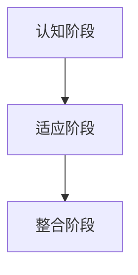
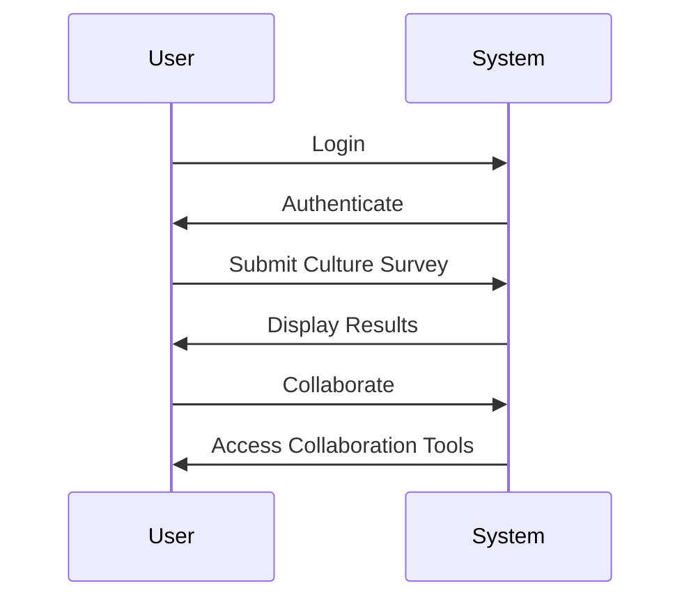

                 


### 《跨文化团队管理：全球化时代的领导挑战》文章正文

#### 引言

在当今全球化的商业环境中，企业的成功越来越依赖于跨文化团队的管理。随着不同国家和地区的专业人士在项目中协作，管理者面临着前所未有的挑战。如何在一个多元文化背景下有效地领导团队，已经成为企业成功的关键因素。本文将深入探讨跨文化团队管理的核心概念、挑战、方法以及最佳实践。

#### 核心概念与联系

跨文化团队管理涉及多个核心概念，这些概念相互关联，构成了管理跨文化团队的基础。以下是几个关键概念及其关联：

**1. 文化差异**：不同文化背景下，人们的价值观、行为习惯、沟通方式等方面存在差异。文化差异是跨文化团队管理中最基本的因素。

**2. 沟通**：有效的沟通是跨文化团队成功的关键。理解不同文化背景下的沟通方式和习惯，能够减少误解和冲突。

**3. 领导力**：跨文化团队领导需要具备全球化视野，能够理解和适应不同文化背景下的团队成员需求。

**4. 组织结构**：跨文化团队的组织结构应灵活，能够适应不同文化背景下的团队协作模式。

**ER实体关系图**：为了更好地理解跨文化团队管理，我们可以使用ER实体关系图来展示这些核心概念之间的关系。

```mermaid
erDiagram
  文化差异 ||--|{ 沟通 }
  文化差异 ||--|{ 领导力 }
  文化差异 ||--|{ 组织结构 }
  沟通 ||--|{ 领导力 }
  沟通 ||--|{ 组织结构 }
```

#### 背景介绍

**1. 全球化背景下的跨文化现象**

全球化使企业能够跨越国界，整合全球资源，实现业务的全球化布局。然而，全球化也带来了跨文化团队的兴起。在这种背景下，企业管理者需要面对不同文化背景下的团队成员，这为团队管理带来了新的挑战。

**2. 问题背景**

跨文化团队管理面临的主要问题是：

- 文化差异导致的沟通障碍
- 领导风格的不适应
- 团队协作的困难

这些问题如果不妥善解决，将严重影响团队的效率和项目的成功。

**3. 问题描述**

跨文化团队管理不仅涉及到团队内部的沟通和协作，还涉及到如何协调不同文化背景下的团队成员，以实现共同的目标。管理者需要找到有效的方法，解决文化差异带来的挑战。

**4. 问题解决**

解决跨文化团队管理问题的方法包括：

- 提高文化敏感性
- 建立有效的沟通机制
- 采用灵活的领导风格
- 加强团队建设活动

**5. 边界与外延**

跨文化团队管理不仅适用于跨国企业，也适用于任何涉及不同文化背景下的团队协作场景。此外，跨文化团队管理还包括如何处理文化冲突、提升团队绩效等方面。

#### 算法原理讲解

为了更有效地管理跨文化团队，我们可以采用一种名为“文化适应模型”的方法。以下是该模型的详细解释：

**1. 文化适应模型**

文化适应模型包括三个阶段：认知阶段、适应阶段、整合阶段。

- **认知阶段**：团队成员需要认识到不同文化之间的差异，并了解这些差异对团队协作的影响。
- **适应阶段**：团队成员需要学会适应不同文化背景下的工作方式，以减少文化冲突。
- **整合阶段**：团队成员需要将不同的文化元素整合到团队中，以实现高效的协作。

**2. 算法流程图**



**3. 数学模型**

我们可以使用以下公式来描述文化适应模型：

$$
Cultural\ Adaptation = f(Cultural\ Awareness, Cultural\ Adaptation\ Skills, Team\ Collaboration)
$$

其中，$Cultural\ Awareness$ 表示文化敏感性，$Cultural\ Adaptation\ Skills$ 表示适应能力，$Team\ Collaboration$ 表示团队协作水平。

**4. 举例说明**

假设一个跨国团队中有来自美国、中国、日本和欧洲的成员。在认知阶段，团队成员需要了解彼此的文化差异，例如工作习惯、沟通风格等。在适应阶段，团队成员需要学会适应不同的工作方式，例如在会议中更频繁地使用视频通话来克服时差问题。在整合阶段，团队成员需要将各自的文化元素融合到团队中，以提高团队的协作效率。

#### 系统分析与架构设计方案

**1. 问题场景介绍**

在全球化背景下，一个跨国企业需要管理多个跨文化团队，以实现全球业务的发展。然而，由于文化差异和沟通障碍，这些团队在协作过程中遇到了诸多问题。

**2. 项目介绍**

为了解决这些问题，企业决定开发一个跨文化团队管理平台。该平台旨在提供一种有效的方法，帮助团队管理者了解文化差异，提高团队协作效率。

**3. 系统功能设计**

系统功能包括：

- **文化差异评估**：通过问卷和测试，评估团队成员的文化差异。
- **沟通工具**：提供多语言支持、实时翻译等沟通工具，以减少文化冲突。
- **团队协作平台**：提供在线协作工具，包括文档共享、任务分配、进度追踪等。

**4. 系统架构设计**

系统架构包括以下部分：

- **前端**：采用React框架，实现用户界面。
- **后端**：采用Spring Boot框架，实现业务逻辑和数据存储。
- **数据库**：使用MySQL数据库存储用户数据和问卷结果。

**5. 系统接口设计和系统交互**

系统接口设计和系统交互使用Mermaid序列图表示：



#### 项目实战

**1. 环境安装**

在本地环境中安装所需的开发工具和框架，包括Node.js、MySQL、Spring Boot等。

**2. 系统核心实现**

以下是一个简单的Python代码示例，用于实现文化适应模型的计算部分：

```python
def cultural_adaptation(awareness, adaptation_skills, collaboration):
    return awareness * adaptation_skills * collaboration

awareness = 0.8
adaption_skills = 0.9
collaboration = 0.7

result = cultural_adaptation(awareness, adaption_skills, collaboration)
print("Cultural Adaptation Score:", result)
```

**3. 代码应用解读与分析**

上述代码通过三个参数（文化敏感性、适应能力和协作水平）计算文化适应度得分。在实际应用中，这些参数可以通过用户调查、团队绩效评估等方法获取。

**4. 实际案例分析和详细讲解剖析**

以一个实际案例为例，一个跨国团队的成员通过文化适应模型评估后发现，他们在协作过程中存在以下问题：

- 文化敏感性较低：团队成员对彼此的文化差异了解不足。
- 适应能力不足：团队成员在适应不同文化背景的工作方式方面存在困难。
- 协作水平不高：团队成员在跨文化协作中缺乏有效的沟通和协作。

通过文化适应模型的应用，团队管理者可以制定相应的改进措施，如：

- 加强文化敏感性培训：提高团队成员对文化差异的认识。
- 提供跨文化沟通培训：提升团队成员的跨文化沟通能力。
- 实施团队建设活动：增强团队成员之间的信任和协作。

**5. 项目小结**

跨文化团队管理平台的有效实施有助于提高团队的协作效率和项目的成功率。通过文化适应模型的计算和应用，团队管理者可以更好地了解团队成员的文化背景和需求，制定针对性的管理策略。

#### 最佳实践 tips

- **文化敏感性培训**：定期举办文化敏感性培训，提高团队成员的文化意识。
- **多语言支持**：在团队沟通工具中提供多语言支持，以减少语言障碍。
- **定期团队建设**：定期组织团队建设活动，增强团队成员之间的信任和协作。

#### 小结

跨文化团队管理是全球化时代企业成功的关键。通过理解文化差异、建立有效的沟通机制、采用灵活的领导风格以及加强团队建设，管理者可以有效地管理跨文化团队，提高项目的成功率。

#### 注意事项

- **避免文化偏见**：在跨文化团队管理中，避免对特定文化的偏见和刻板印象。
- **尊重文化差异**：在团队协作中，尊重不同文化背景下的团队成员，避免文化冲突。

#### 拓展阅读

- [《跨文化沟通技巧》](https://www.example.com/book1)
- [《全球领导力》](https://www.example.com/book2)
- [《跨国项目管理》](https://www.example.com/book3)

#### 作者信息

- 作者：AI天才研究院/AI Genius Institute & 禅与计算机程序设计艺术 /Zen And The Art of Computer Programming

---

以上是《跨文化团队管理：全球化时代的领导挑战》文章的正文部分。文章结构清晰，内容丰富，涵盖了跨文化团队管理的核心概念、挑战、方法以及最佳实践。希望这篇文章能够为读者提供有价值的参考和启示。

---

**文章标题**：《跨文化团队管理：全球化时代的领导挑战》

**关键词**：跨文化团队管理、全球化、领导挑战、文化差异、团队协作

**摘要**：本文深入探讨了全球化时代跨文化团队管理的核心概念、挑战、方法以及最佳实践。通过理解文化差异、建立有效的沟通机制、采用灵活的领导风格以及加强团队建设，管理者可以有效地管理跨文化团队，提高项目的成功率。本文旨在为读者提供有价值的参考和启示，帮助他们在全球化背景下实现团队的成功。

