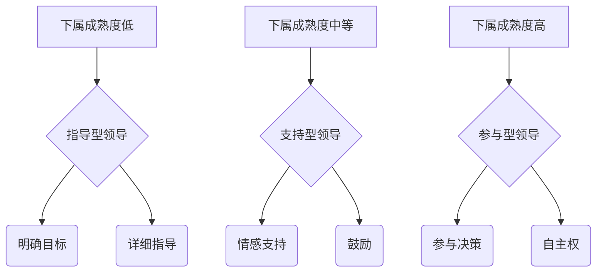
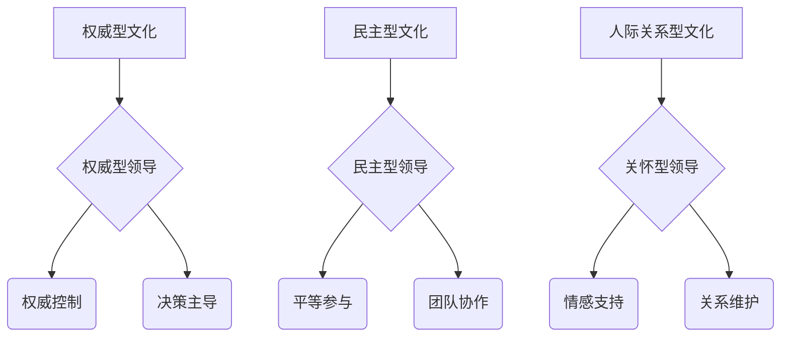
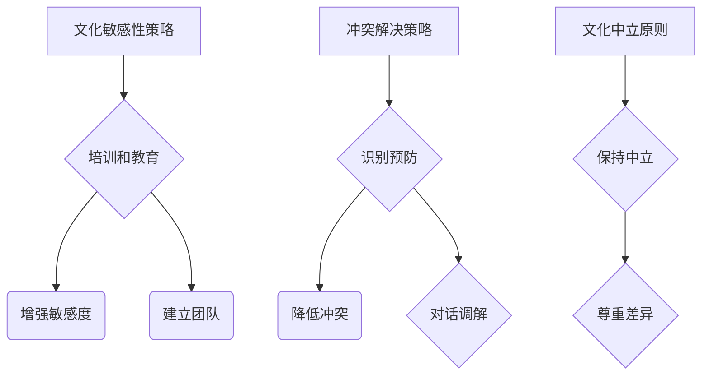

                 

# 跨文化领导力：在全球化时代脱颖而出

关键词：跨文化领导力、全球化、领导风格、案例分析、策略与工具

摘要：在全球化浪潮的推动下，企业间的跨文化交流日益频繁。本文旨在探讨跨文化领导力的核心概念、原则、策略及其在全球化时代的重要性。通过案例分析、领导风格对比和策略工具的介绍，本文为领导者提供实际操作的指导，帮助他们在多元文化环境中脱颖而出。

## 引言

在全球化的背景下，企业运营日益跨越国界，员工背景的多样性成为常态。跨文化领导力作为现代企业成功的关键因素，逐渐受到重视。本文将深入探讨跨文化领导力的定义、重要性及其核心要素。

### 背景介绍

随着全球市场的扩大，企业需要与来自不同文化背景的员工、合作伙伴和客户进行有效沟通和协作。这种跨文化交流不仅体现在语言上，更涉及价值观、行为规范和工作方式的差异。跨文化领导力正是在这种背景下应运而生，它要求领导者具备理解、尊重和适应不同文化的意识和能力。

### 定义与核心概念

跨文化领导力是指领导者在全球多元文化环境中，通过有效的沟通、协调和激励，引导团队达成共同目标的能力。其核心概念包括文化敏感度、文化适应力、全球思维和领导力模型等。

1. **文化敏感度**：指领导者对文化差异的敏感性和理解能力，包括对语言、习俗、价值观和沟通方式的认知。
2. **文化适应力**：指领导者适应不同文化环境的能力，包括灵活调整行为策略、尊重文化差异和促进文化融合。
3. **全球思维**：指领导者具备的全球视野和思维方式，包括理解全球市场、把握全球趋势和多元化团队的运营。
4. **领导力模型**：指适用于跨文化领导的具体模型，如情景领导理论、文化适配理论等。

### 重要性

跨文化领导力的重要性体现在以下几个方面：

1. **提升团队效能**：通过跨文化领导，领导者可以更好地理解和满足团队成员的不同需求，从而提高团队的凝聚力和工作效率。
2. **促进全球化战略**：跨文化领导力有助于企业更好地实施全球化战略，提高企业在国际市场的竞争力。
3. **增强企业声誉**：具备跨文化领导力的企业能够更好地融入国际社会，树立良好的企业形象，增强品牌影响力。
4. **推动创新与多元化**：跨文化团队往往更具创新性和多元化，能够带来更多的观点和解决方案，推动企业持续发展。

### 范围与核心要素

本文将涵盖以下核心要素：

1. **跨文化领导力的核心概念与原则**：介绍跨文化领导力的关键概念和基本原则，以及不同文化属性的比较。
2. **领导风格与策略**：探讨在跨文化环境中有效的领导风格和策略，包括文化敏感性、文化适应力和全球思维。
3. **案例分析**：通过具体案例，分析成功跨文化领导的实践经验和关键要素。
4. **实际应用与工具**：介绍跨文化领导力在实际操作中的应用工具和策略，包括沟通技巧、冲突解决和跨文化培训。
5. **挑战与解决方案**：分析跨文化领导中面临的挑战，并提出相应的解决方案。

通过本文的探讨，读者将能够深入了解跨文化领导力的本质和重要性，掌握有效的跨文化领导策略，为企业在全球化时代的成功奠定基础。

## 核心概念与原则

跨文化领导力的成功离不开对核心概念与原则的深入理解。在本节中，我们将探讨文化敏感度、文化适应力、全球思维和领导力模型等关键要素，并通过比较不同文化属性和实体关系图来加深我们的理解。

### 文化敏感度

文化敏感度是指领导者对文化差异的敏锐感知和理解能力。它包括对语言、习俗、价值观和沟通方式的认知。在跨文化领导中，文化敏感度至关重要，因为它直接影响领导者的决策和行为。

#### 语言与沟通

语言是文化的重要组成部分，不同文化背景下的语言表达方式可能截然不同。例如，在一些文化中，直接表达被认为是高效和真诚的表现，而在其他文化中，含蓄和委婉则是更受欢迎的沟通方式。因此，领导者需要了解不同文化背景下的语言习惯，避免因语言不当而引起误解和冲突。

#### 习俗与价值观

不同文化有着不同的习俗和价值观。例如，在某些文化中，尊重长辈和权威是非常重要的，而在其他文化中，平等和自主是核心价值观。了解这些习俗和价值观有助于领导者更好地理解团队成员的行为和需求，从而做出更恰当的领导决策。

#### 文化敏感度的核心原则

1. **尊重差异**：领导者应尊重不同文化的差异，避免因文化偏见而歧视或忽视团队成员。
2. **开放心态**：领导者应保持开放心态，积极了解和接受不同文化背景下的观点和做法。
3. **适应性**：领导者应根据具体情境调整自己的行为策略，以适应不同文化环境。

### 文化适应力

文化适应力是指领导者适应不同文化环境的能力，包括灵活调整行为策略、尊重文化差异和促进文化融合。在全球化背景下，文化适应力是领导者必须具备的重要能力。

#### 灵活调整行为策略

领导者应根据不同文化环境的特点，灵活调整自己的行为策略。例如，在某些文化中，集体主义价值观占主导地位，领导者需要更注重团队协作和集体利益；而在其他文化中，个人主义价值观更为突出，领导者需要更多地关注个人发展和成就。

#### 尊重文化差异

尊重文化差异是跨文化领导力的基本原则之一。领导者应尊重团队成员的文化背景，避免因文化差异而引起的误解和冲突。通过建立互信和尊重的文化氛围，领导者可以更好地团结和激励团队成员。

#### 促进文化融合

文化融合是指将不同文化背景下的元素融合在一起，形成新的文化特质。领导者可以通过组织文化交流活动、跨文化团队建设等方式，促进团队成员之间的相互理解和融合。

#### 文化适应力的核心原则

1. **灵活应对**：领导者应具备灵活应对不同文化环境的能力，及时调整行为策略。
2. **尊重差异**：领导者应尊重不同文化差异，建立包容和谐的文化氛围。
3. **促进融合**：领导者应积极促进文化融合，增强团队的凝聚力和创造力。

### 全球思维

全球思维是指领导者具备的全球视野和思维方式，包括理解全球市场、把握全球趋势和多元化团队的运营。在全球化的背景下，全球思维是领导者必须具备的重要素质。

#### 理解全球市场

领导者应具备全球市场的敏锐洞察力，了解不同国家和地区的市场需求、消费习惯和竞争态势。通过了解全球市场，领导者可以制定更有针对性的战略，提升企业的竞争力。

#### 把握全球趋势

全球趋势包括全球化、技术进步、环境保护等。领导者应密切关注全球趋势的发展，及时调整企业的战略和运营模式，以适应不断变化的全球环境。

#### 多元化团队的运营

在全球化的背景下，企业团队往往具有多元化的特点。领导者应具备管理多元化团队的能力，包括不同文化背景、技能水平和价值观念的团队成员。通过有效管理多元化团队，领导者可以充分发挥团队的潜力，实现企业的目标。

#### 全球思维的核心原则

1. **全球视野**：领导者应具备全球视野，了解全球市场、趋势和多元化团队的运营。
2. **战略导向**：领导者应根据全球趋势和市场需求，制定有针对性的战略和运营计划。
3. **多元化管理**：领导者应具备管理多元化团队的能力，充分发挥团队潜力。

### 核心概念与联系

为了更好地理解跨文化领导力的核心概念，我们可以通过比较不同文化属性和实体关系图来展示这些概念之间的关系。

#### 不同文化属性比较表格

| 文化属性          | 东方文化          | 西方文化          |
|-----------------|-----------------|-----------------|
| 价值观           | 社会和谐、家庭观念强  | 个人主义、自我实现  |
| 沟通方式         | 委婉、间接          | 直截了当、直接        |
| 决策方式         | 集体决策、协商一致    | 个人决策、快速执行    |
| 组织结构         | 去中心化、网络状结构  | 中心化、层级结构      |
| 时间观念         | 强调长远、未来取向    | 强调短期、现在取向    |

#### 实体关系图

下面是一个简单的实体关系图，展示跨文化领导力的核心概念之间的关系：

```mermaid
erDiagram
  CULTURAL_SENSITIVITY ||--|{ CULTURAL_ADAPTABILITY }
  CULTURAL_SENSITIVITY ||--|{ GLOBAL_MINDSET }
  CULTURAL_ADAPTABILITY ||--|{ LEADERSHIP_STYLES }
  CULTURAL_ADAPTABILITY ||--|{ CULTURAL_FUSION }
  GLOBAL_MINDSET ||--|{ GLOBAL_MARKET_UNDERSTANDING }
  GLOBAL_MINDSET ||--|{ TREND_GRAPHL }
```

在这个实体关系图中，文化敏感度、文化适应力和全球思维是跨文化领导力的核心要素，它们相互关联并影响领导风格和策略。文化适应力进一步关联到领导风格和文化融合，全球思维则关联到全球市场理解和趋势把握。

通过理解这些核心概念和原则，领导者可以更好地应对跨文化环境中的挑战，实现领导力的全面提升。

## 领导风格与策略

在跨文化环境中，领导风格和策略的选择至关重要。有效的领导风格和策略能够帮助领导者更好地理解团队成员的需求，促进团队协作，提高团队效能。以下我们将探讨几种在跨文化环境中有效的领导风格和策略，并通过Mermaid图示进行详细说明。

### 情境领导理论

情境领导理论是由保罗·赫塞（Paul Hersey）和肯尼斯·布兰查德（Kenneth Blanchard）提出的，它强调领导者应根据下属的成熟度水平选择不同的领导风格。在跨文化环境中，情境领导理论有助于领导者根据团队成员的文化背景和个性特点，灵活调整领导方式。

#### 领导风格对比

1. **指导型领导**：适用于下属成熟度较低的情况。领导者详细指导下属的工作，提供明确的目标和任务。
2. **支持型领导**：适用于下属成熟度中等的情况。领导者提供情感支持和鼓励，帮助下属克服困难。
3. **参与型领导**：适用于下属成熟度较高的情况。领导者鼓励下属参与决策，赋予他们更多的自主权。

#### Mermaid图示



### 文化适配理论

文化适配理论强调领导者应根据文化差异，调整自己的领导行为，以适应不同文化环境。这种理论认为，领导者的行为应当反映其所在文化的价值观和期望。

#### 领导风格对比

1. **权威型领导**：在注重权威和等级的文化中，领导者表现出较强的权威和控制力。
2. **民主型领导**：在注重平等和参与的文化中，领导者鼓励团队成员参与决策，强调团队合作。
3. **关怀型领导**：在注重人际关系和情感的文化中，领导者关注团队成员的情感需求，提供情感支持。

#### Mermaid图示



### 领导策略

除了领导风格，跨文化领导还需要一系列有效的策略，以应对文化差异和促进团队协作。

#### 文化敏感性策略

1. **培训和教育**：通过培训和教育，提高领导者对文化差异的敏感度，增强跨文化领导能力。
2. **建立跨文化团队**：组建由不同文化背景的成员组成的团队，促进文化多样性和创新。
3. **沟通与交流**：鼓励团队成员之间的沟通与交流，建立相互理解与尊重的文化氛围。

#### 冲突解决策略

1. **识别和预防**：通过识别和预防潜在的文化冲突，降低冲突发生的概率。
2. **对话与调解**：在冲突发生时，通过对话和调解，寻找共识和解决方案。
3. **文化中立原则**：在解决冲突时，保持中立，避免偏袒任何一方，尊重各方文化的差异。

#### Mermaid图示



通过以上讨论，我们可以看到，在跨文化环境中，领导风格和策略的选择至关重要。领导者应根据团队成员的文化背景和成熟度，灵活调整领导风格，并运用有效的策略，促进团队协作，实现跨文化领导的成功。

## 案例分析

在本节中，我们将通过具体案例，分析成功跨文化领导的实践经验和关键要素。这些案例将为我们提供宝贵的见解，帮助我们在实际操作中更好地应用跨文化领导力。

### 案例一：谷歌的全球团队管理

谷歌是一家全球性的科技巨头，其成功离不开高效的全球团队管理。谷歌的跨文化领导力主要体现在以下几个方面：

1. **文化敏感性**：谷歌鼓励员工理解和尊重不同文化的差异，通过跨文化培训，提高员工的文化敏感性。公司还设立了一个名为“谷歌之友”的项目，为员工提供与不同文化背景的同事交流和互动的机会。

2. **全球思维**：谷歌领导者具备全球视野，了解不同国家和地区的市场需求和趋势。公司定期组织全球领导力会议，讨论和制定全球化战略，确保团队在全球范围内协调一致。

3. **多元化管理**：谷歌重视多元化管理，鼓励不同文化背景的员工参与决策，促进团队合作。公司采用多样化的领导团队，确保在制定政策和决策时考虑多种观点。

4. **文化融合**：谷歌通过组织跨文化活动，如国际节日庆祝、员工交流项目等，促进文化融合。这些活动不仅增强了员工的凝聚力，也丰富了公司的文化多样性。

### 案例二：宝洁公司的全球市场战略

宝洁公司（P&G）是一家全球性的消费品公司，其在全球市场的成功很大程度上得益于其卓越的跨文化领导力。

1. **本地化策略**：宝洁公司根据不同市场的文化特点，调整其产品和服务。例如，在中国市场，宝洁推出了符合当地消费者口味和习惯的洗发水和洗涤剂产品，取得了巨大成功。

2. **跨文化团队**：宝洁公司在全球范围内组建了由不同文化背景的员工组成的跨文化团队。这些团队在产品开发、市场营销和供应链管理等方面发挥了重要作用，确保公司能够快速适应不同市场的需求。

3. **文化适应力**：宝洁领导者具备出色的文化适应力，能够灵活调整自己的行为策略，以适应不同文化环境。公司提供跨文化培训，帮助员工了解和适应不同文化背景。

4. **全球思维**：宝洁领导者具备全球思维，了解全球市场趋势和消费者行为的变化。公司通过定期进行市场调研，收集全球消费者数据，制定有针对性的市场策略。

### 案例三：三星电子的国际化发展

三星电子是韩国的一家全球性科技公司，其国际化发展过程中，跨文化领导力发挥了关键作用。

1. **文化融合**：三星电子注重文化融合，鼓励员工在跨国团队合作中相互学习和尊重。公司通过组织跨文化培训、文化交流项目等，促进员工之间的相互理解。

2. **本地化管理**：三星电子在不同国家和地区设立子公司，采用本地化管理模式，尊重当地文化。公司聘请当地高管，参与当地市场的决策和管理，确保公司的战略与当地市场紧密衔接。

3. **全球人才战略**：三星电子实施全球人才战略，吸引和培养来自不同文化背景的高素质人才。公司提供全球领导力培训项目，帮助员工提升跨文化领导能力。

4. **全球视野**：三星电子领导者具备全球视野，了解全球市场和技术趋势。公司通过全球化布局，实现全球资源的优化配置，提升竞争力。

### 案例四：IBM的全球领导力培养

IBM是一家全球领先的科技公司，其在全球领导力培养方面取得了显著成果。

1. **领导力培养计划**：IBM实施了一系列领导力培养计划，包括跨文化领导力培训、领导力研讨会等。这些计划帮助领导者提升跨文化领导能力，适应全球市场的需求。

2. **全球领导力团队**：IBM组建了由不同文化背景的领导者组成的全球领导力团队。这些团队在全球范围内协调合作，确保公司的战略和运营能够有效适应不同市场的文化差异。

3. **文化敏感度培训**：IBM为员工提供文化敏感度培训，帮助他们了解和尊重不同文化的价值观和行为规范。这些培训课程包括文化差异、跨文化沟通和冲突解决等主题。

4. **全球人才发展**：IBM注重全球人才发展，通过内部晋升和外部引进，培养一批具有跨文化领导能力的领导者。公司提供多种职业发展路径，帮助员工实现职业成长。

通过以上案例分析，我们可以看到，成功跨文化领导的关键在于领导者具备文化敏感性、文化适应力、全球思维和多元化管理能力。在实际操作中，领导者需要灵活运用这些能力，结合具体情境，制定有效的领导策略，以实现跨文化领导的成功。

## 实际应用与工具

在跨文化领导中，领导者不仅需要具备文化敏感度和适应力，还需要掌握一系列实际应用工具和策略，以有效应对跨文化环境中的挑战。以下我们将探讨几种重要的跨文化领导工具和策略，包括沟通技巧、冲突解决和跨文化培训。

### 沟通技巧

跨文化沟通是跨文化领导的核心要素之一。有效的沟通技巧能够帮助领导者建立信任、减少误解，并促进团队成员之间的协作。

#### 1. 明确表达

明确表达是跨文化沟通的关键。领导者应确保信息传达清晰，避免使用模糊或含糊的语言，特别是在处理敏感或重要事务时。

#### 2. 倾听和反馈

跨文化沟通不仅包括表达，还包括倾听和反馈。领导者应主动倾听团队成员的意见，并通过提问和反馈，确保理解对方的意思。

#### 3. 非语言沟通

不同文化对非语言沟通的重视程度不同。例如，在一些文化中，肢体语言和面部表情是重要的沟通手段，而在其他文化中，这些可能被视为过于直接或冒犯。领导者应了解不同文化的非语言沟通习惯，避免不必要的误解。

#### 4. 跨文化沟通培训

为了提高跨文化沟通能力，领导者可以参加跨文化沟通培训，学习不同文化的沟通技巧和策略。这些培训通常包括模拟练习、案例分析和文化敏感性测试等。

### 冲突解决

跨文化环境中的冲突解决需要领导者具备高超的沟通和调解技巧，以及文化适应力。

#### 1. 识别冲突来源

冲突往往源于文化差异、价值观冲突或沟通不畅。领导者应首先识别冲突的来源，以便采取有针对性的解决策略。

#### 2. 对话与调解

在处理冲突时，领导者应采用对话和调解的方式，鼓励各方表达自己的观点和感受。通过建立开放和诚实的沟通渠道，领导者可以找到共识和解决方案。

#### 3. 保持中立

在解决冲突时，领导者应保持中立，避免偏袒任何一方，尊重各方文化的差异。这有助于维护团队的和谐与稳定。

#### 4. 文化适应策略

领导者应根据具体情境，灵活调整解决冲突的策略。例如，在强调集体主义的文化中，领导者可能需要更多地关注团队的整体利益，而在强调个人主义的文化中，领导者可能需要更多地尊重个人的权利和需求。

### 跨文化培训

跨文化培训是提高跨文化领导能力的重要手段。以下是一些常见的跨文化培训方式和内容：

#### 1. 培训方式

- **在线课程**：通过在线平台提供跨文化培训课程，员工可以随时学习和复习。
- **研讨会和讲座**：邀请跨文化专家举办研讨会和讲座，分享跨文化领导的经验和技巧。
- **案例分析**：通过分析实际案例，帮助员工理解跨文化领导的挑战和解决方案。
- **角色扮演**：通过模拟不同的跨文化场景，让员工亲身体验跨文化沟通和冲突解决的技巧。

#### 2. 培训内容

- **文化差异**：介绍不同文化的价值观、行为规范和沟通方式，帮助员工理解文化差异。
- **跨文化沟通技巧**：教授有效的跨文化沟通策略，包括明确表达、倾听和反馈等。
- **冲突解决**：提供冲突解决的技巧和策略，帮助员工应对跨文化环境中的冲突。
- **文化适应力**：培养员工适应不同文化环境的能力，包括灵活调整行为策略和促进文化融合。

### 实践应用

在实际应用中，领导者可以结合以上工具和策略，制定具体的跨文化领导计划。以下是一些实践应用的建议：

1. **建立跨文化团队**：组建由不同文化背景的员工组成的团队，促进文化多样性和创新。
2. **定期沟通与反馈**：通过定期沟通和反馈，确保团队成员之间的信息传递清晰，减少误解和冲突。
3. **文化敏感性培训**：定期组织文化敏感性培训，提高员工的文化适应力和沟通技巧。
4. **跨文化项目**：开展跨文化项目，鼓励员工在不同文化环境中工作，提升其实际操作能力。

通过以上工具和策略，领导者可以更好地应对跨文化环境中的挑战，提高跨文化领导能力，实现团队的协同和高效运作。

## 挑战与解决方案

在跨文化领导过程中，领导者不可避免地会遇到各种挑战。理解这些挑战并找到有效的解决方案，是确保跨文化领导成功的关键。以下我们将探讨在跨文化领导中常见的挑战，并提出相应的解决方案。

### 文化偏见

**挑战**：文化偏见是跨文化领导中一个显著的问题。领导者可能对某些文化持有成见或误解，这会影响团队协作和领导效能。

**解决方案**：1. **文化敏感性培训**：定期组织文化敏感性培训，帮助领导者理解和尊重不同文化，消除偏见。
2. **多元文化团队建设**：通过组建多元文化团队，促进不同文化背景的员工之间的相互理解和尊重。
3. **积极沟通**：鼓励领导者积极与团队成员沟通，了解他们的文化背景和需求，建立互信关系。

### 沟通障碍

**挑战**：不同文化背景的员工可能在沟通方式、语言习惯和价值观上存在差异，导致沟通不畅和误解。

**解决方案**：1. **跨文化沟通培训**：提供跨文化沟通培训，教授有效的跨文化沟通策略和技巧。
2. **建立共同语言**：在团队中推广一种共同的语言，如英语，作为沟通的桥梁。
3. **明确沟通目标**：在沟通前明确目标和意图，避免不必要的误解。

### 冲突管理

**挑战**：文化差异可能导致团队成员之间的冲突，特别是当不同文化的价值观和期望发生碰撞时。

**解决方案**：1. **冲突预防**：通过识别和预防潜在的文化冲突，降低冲突发生的概率。
2. **文化中立原则**：在解决冲突时，领导者应保持中立，尊重各方文化的差异。
3. **对话与调解**：采用对话和调解的方式，鼓励团队成员表达观点和需求，寻找共识和解决方案。

### 适应力不足

**挑战**：领导者可能缺乏适应不同文化环境的能力，导致在跨文化环境中表现不佳。

**解决方案**：1. **跨文化适应力培训**：提供跨文化适应力培训，帮助领导者提高适应不同文化环境的能力。
2. **灵活调整策略**：领导者应根据具体情境，灵活调整行为策略，适应不同文化环境。
3. **文化融合活动**：组织跨文化活动，促进文化融合，增强团队的凝聚力和合作精神。

### 资源限制

**挑战**：跨文化领导可能面临资源限制，如预算、人力和时间等，这会影响到领导力的实施和效果。

**解决方案**：1. **优化资源配置**：合理分配资源，确保跨文化领导活动的有效实施。
2. **寻求外部支持**：与外部咨询机构合作，获取专业支持和建议。
3. **高效利用资源**：通过提高团队效率和利用现有资源，减轻资源限制的压力。

通过以上解决方案，领导者可以更好地应对跨文化领导过程中的挑战，提高跨文化领导的有效性和团队效能。

## 未来方向与趋势

随着全球化进程的加速，跨文化领导力在未来将继续发挥重要作用。以下我们将探讨未来跨文化领导力的几个可能的发展趋势，以及这些趋势对领导者和组织的潜在影响。

### 人工智能与数据分析的应用

未来，人工智能（AI）和数据分析将在跨文化领导中扮演更加重要的角色。通过利用AI和数据分析，领导者可以更准确地了解团队成员的文化背景、行为模式和需求。例如，AI可以分析员工在跨文化团队中的表现数据，为领导者提供个性化的领导策略和反馈。数据分析工具可以帮助领导者识别文化冲突的潜在原因，并预测跨文化团队的合作趋势。

**潜在影响**：这种技术将大幅提高跨文化领导的效率和准确性，帮助领导者更好地理解和管理多元化的团队。

### 数字化转型的加速

数字化转型已经成为企业发展的关键驱动力。在未来，随着数字化工具和平台的普及，跨文化领导力将更加依赖于数字技术。例如，虚拟会议、远程协作工具和在线培训平台将成为跨文化领导的重要手段。这些工具不仅能够降低跨文化沟通的成本，还能提供灵活的沟通渠道，使领导者能够随时随地进行指导和协调。

**潜在影响**：数字化转型将使跨文化领导更加灵活和高效，促进全球团队的无缝协作。

### 新兴市场的崛起

随着全球经济的不断发展，新兴市场的重要性日益增加。领导者需要更加关注这些市场，了解其文化特点和发展趋势。未来，跨文化领导力将更加注重对新兴市场的适应性。例如，领导者需要了解新兴市场的消费者行为和价值观，调整产品和服务策略，以更好地适应这些市场的需求。

**潜在影响**：新兴市场的崛起将扩大跨文化领导力的应用范围，对领导者的全球视野和适应能力提出更高的要求。

### 领导力发展的个性化

未来，跨文化领导力的发展将更加注重个性化。随着对个体差异和文化多样性的认识加深，领导者将更加关注如何根据个人的需求和特点进行领导。这种个性化的领导方式将帮助领导者更好地激发团队成员的潜力，促进团队创新和协作。

**潜在影响**：个性化领导力的发展将使跨文化领导更加贴近实际需求，提高团队的凝聚力和工作效率。

### 教育与培训的深化

随着跨文化领导力的普及，未来的教育体系和培训项目将更加重视跨文化能力的培养。高校和企业将开展更多关于跨文化领导力的课程和培训项目，帮助未来的领导者提前做好准备。这些项目将涵盖文化敏感性、跨文化沟通、冲突解决等多个方面，为领导者提供全面的知识和技能。

**潜在影响**：教育与培训的深化将提高整个社会的跨文化领导能力，促进全球化的深入发展。

综上所述，未来跨文化领导力将在技术、市场、个体和教育等多个层面产生深远影响。领导者需要不断学习和适应这些变化，以应对全球化的挑战，实现组织的长期发展。

## 结论

在全球化时代的背景下，跨文化领导力已成为现代企业成功的关键因素。本文通过深入探讨跨文化领导力的核心概念、原则、策略以及实际应用，展示了其在提升团队效能、促进全球化战略和增强企业声誉方面的重要作用。我们分析了不同领导风格和策略在跨文化环境中的应用，并通过具体案例，展示了成功跨文化领导的实践经验和关键要素。

领导者应认识到，跨文化领导力的培养并非一蹴而就，而是一个持续的过程。通过不断学习和实践，领导者可以提升自己的文化敏感度、适应力和全球思维，更好地应对跨文化环境中的挑战。此外，数字化工具和新兴市场的发展也为跨文化领导力提供了新的机遇和挑战。

未来的领导者需要具备更广阔的视野和更高的适应能力，以引领企业在全球化竞争中脱颖而出。我们呼吁读者在阅读本文后，积极思考如何在自身的工作和生活中应用跨文化领导力，为企业和社会的进步贡献力量。

## 作者信息

作者：AI天才研究院/AI Genius Institute & 禅与计算机程序设计艺术 /Zen And The Art of Computer Programming

AI天才研究院专注于人工智能领域的前沿研究和人才培养，致力于推动人工智能技术在各行各业的广泛应用。禅与计算机程序设计艺术则是一本深入探讨计算机编程哲学的经典著作，为程序员提供了独特的思考方式和解决问题的方法论。本文作者结合了这两方面的专长，从跨文化领导力的角度，探讨了全球化时代领导者应具备的能力和策略。

