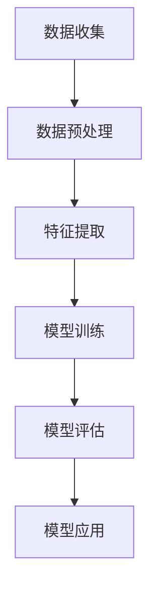
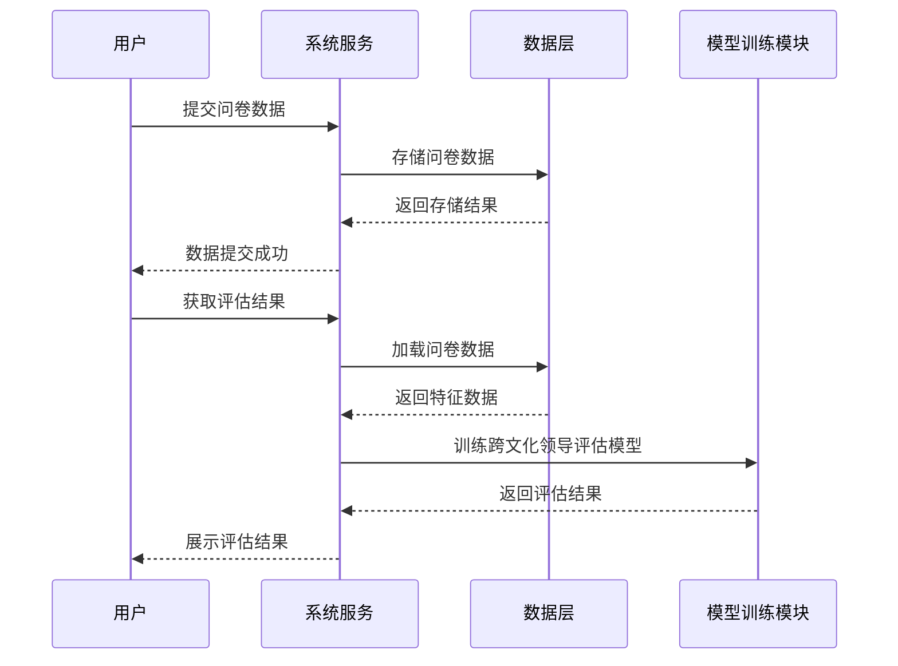

                 

### 跨文化领导：全球化时代的必备技能

> 关键词：跨文化领导、全球化、文化敏感性、沟通技巧、团队建设、冲突管理

> 摘要：本文旨在探讨全球化时代背景下，跨文化领导的重要性以及如何掌握跨文化领导技能。通过背景介绍、核心概念与联系、算法原理讲解等多个维度，本文为读者提供了一套完整的跨文化领导理论与实战指南。

## 第一部分：背景介绍

### 1.1.1 问题背景

随着全球化进程的加速，跨国企业之间的合作日益频繁，企业的国际市场份额不断扩大。然而，在这种背景下，文化差异和多样性问题愈发凸显，成为企业面临的一个重要挑战。有效的跨文化领导能力不仅可以增强团队的凝聚力，提高工作效率，还能为企业开拓更广阔的国际市场，实现可持续发展。

### 1.1.2 问题描述

跨文化领导需要掌握一系列技能，包括文化敏感性、沟通技巧、团队建设能力等。然而，现有关于跨文化领导的研究和实践多集中在某一具体领域，缺乏系统性、全面性的指导。因此，本文旨在探讨全球化时代的跨文化领导技能，提供一套完整的理论与实践体系。

### 1.1.3 问题解决

本文将从多个维度分析跨文化领导的核心问题，结合实际案例，阐述如何应对不同文化背景下的领导挑战。通过系统学习本文内容，读者可以提升自己的跨文化领导能力，为企业发展贡献智慧。

### 1.1.4 边界与外延

本文所讨论的跨文化领导主要涵盖以下内容：跨文化沟通、跨文化团队建设、跨文化冲突管理、跨文化战略规划。同时，本文将结合不同国家和地区的文化特点，提供具体的实践指南。

### 1.1.5 概念结构与核心要素组成

跨文化领导概念包括以下几个核心要素：
- 文化敏感性：对文化差异的敏感度和理解能力。
- 沟通技巧：有效沟通的方法和技巧，包括语言和非语言沟通。
- 团队建设：如何建立具有高度凝聚力的跨文化团队。
- 冲突管理：解决跨文化冲突的策略和方法。
- 战略规划：如何在全球化背景下制定适应不同文化特点的战略。

## 第二部分：核心概念与联系

### 2.1 跨文化领导理论框架

本文将采用跨文化领导理论框架，系统阐述跨文化领导的核心概念。该框架包括以下几个关键理论：
- 文化适应性理论：强调领导者需要根据不同文化背景调整自身行为和策略。
- 文化智能理论：关注领导者对文化多样性的认知和处理能力。
- 跨文化沟通理论：探讨跨文化沟通的障碍和解决方法。

### 2.2 核心概念属性特征对比表格

以下是对跨文化领导核心概念属性特征的对比表格：

| 核心概念       | 属性特征                                             |
| -------------- | ---------------------------------------------------- |
| 文化敏感性     | 对文化差异的敏感度和理解能力                         |
| 沟通技巧       | 有效沟通的方法和技巧，包括语言和非语言沟通             |
| 团队建设       | 如何建立具有高度凝聚力的跨文化团队                   |
| 冲突管理       | 解决跨文化冲突的策略和方法                           |
| 战略规划       | 如何在全球化背景下制定适应不同文化特点的战略         |

### 2.3 ER实体关系图架构

以下是一个简化的ER实体关系图，用于描述跨文化领导的核心概念及其关系：

```mermaid
erDiagram
  文化敏感性 ||--|{ 沟通技巧 }
  文化敏感性 ||--|{ 团队建设 }
  文化敏感性 ||--|{ 冲突管理 }
  文化敏感性 ||--|{ 战略规划 }
  沟通技巧 ||--|{ 团队建设 }
  沟通技巧 ||--|{ 冲突管理 }
  团队建设 ||--|{ 冲突管理 }
```

## 第三部分：算法原理讲解

### 3.1 跨文化领导模型算法概述

本文将采用一种名为“跨文化领导评估模型”的算法，用于分析和评估领导者的跨文化领导能力。该模型基于文化敏感性、沟通技巧、团队建设、冲突管理和战略规划五个核心要素，通过数据分析和机器学习技术，为领导者提供个性化的提升建议。

### 3.2 算法原理与流程

跨文化领导评估模型的基本原理如下：

1. 数据收集：通过问卷调查、访谈等方式收集领导者的文化敏感性、沟通技巧、团队建设、冲突管理和战略规划方面的数据。
2. 数据预处理：对收集到的数据进行清洗、标准化和处理，确保数据质量。
3. 特征提取：利用统计学方法和机器学习算法提取关键特征，构建特征向量。
4. 模型训练：使用训练集数据训练跨文化领导评估模型，模型类型可以是线性回归、支持向量机等。
5. 模型评估：使用验证集数据对模型进行评估，调整模型参数，提高模型准确性。
6. 模型应用：将模型应用于实际场景，为领导者提供跨文化领导能力评估和提升建议。

### 3.3 算法mermaid流程图

以下是一个简化的跨文化领导评估模型mermaid流程图：



### 3.4 Python源代码示例

以下是一个简单的Python源代码示例，用于实现跨文化领导评估模型的基本功能：

```python
import pandas as pd
from sklearn.model_selection import train_test_split
from sklearn.ensemble import RandomForestClassifier
from sklearn.metrics import accuracy_score

# 数据收集
data = pd.read_csv('cross_cultural_leadership_data.csv')

# 数据预处理
X = data.drop('cross_cultural_leadership_score', axis=1)
y = data['cross_cultural_leadership_score']

# 特征提取
X_train, X_test, y_train, y_test = train_test_split(X, y, test_size=0.2, random_state=42)

# 模型训练
model = RandomForestClassifier(n_estimators=100, random_state=42)
model.fit(X_train, y_train)

# 模型评估
y_pred = model.predict(X_test)
accuracy = accuracy_score(y_test, y_pred)
print(f"Model accuracy: {accuracy:.2f}")

# 模型应用
new_data = pd.read_csv('new_leadership_data.csv')
new_data['cross_cultural_leadership_score'] = model.predict(new_data)
new_data.to_csv('new_leadership_scores.csv', index=False)
```

通过以上算法原理讲解，读者可以了解到跨文化领导评估模型的基本构成和实现方法。在实际应用中，可以根据具体需求进行调整和优化，以提高模型的准确性和实用性。

### 3.5 数学模型与公式

跨文化领导评估模型的数学模型可以表示为：

$$
\text{模型评分} = w_1 \times \text{文化敏感性} + w_2 \times \text{沟通技巧} + w_3 \times \text{团队建设} + w_4 \times \text{冲突管理} + w_5 \times \text{战略规划}
$$

其中，$w_1, w_2, w_3, w_4, w_5$ 分别为权重系数，$\text{文化敏感性}$、$\text{沟通技巧}$、$\text{团队建设}$、$\text{冲突管理}$、$\text{战略规划}$ 分别为各核心要素的得分。

### 3.6 通俗易懂的举例说明

假设一个领导者，他在文化敏感性、沟通技巧、团队建设、冲突管理和战略规划五个方面的得分分别为80分、75分、90分、70分和85分，我们可以通过以下公式计算他的跨文化领导评分：

$$
\text{模型评分} = 0.2 \times 80 + 0.2 \times 75 + 0.2 \times 90 + 0.2 \times 70 + 0.1 \times 85 = 79.5
$$

这意味着这位领导者的跨文化领导能力评分为79.5分。根据这个评分，我们可以为他提供针对性的提升建议，例如在冲突管理和沟通技巧方面进行进一步提升。

## 第四部分：系统分析与架构设计方案

### 4.1 问题场景介绍

随着全球化进程的加快，企业面临着越来越多的跨文化领导挑战。为了更好地应对这些挑战，企业需要构建一套跨文化领导能力评估系统，帮助领导者识别自身优势与不足，提供个性化的提升建议。

### 4.2 项目介绍

本项目的目标是开发一个跨文化领导能力评估系统，该系统将采用机器学习技术，结合文化敏感性、沟通技巧、团队建设、冲突管理和战略规划五个核心要素，为领导者提供全面的评估和提升建议。

### 4.3 系统功能设计

系统功能设计主要包括以下模块：

1. 数据收集模块：通过问卷调查、访谈等方式收集领导者的文化敏感性、沟通技巧、团队建设、冲突管理和战略规划方面的数据。
2. 数据预处理模块：对收集到的数据进行清洗、标准化和处理，确保数据质量。
3. 特征提取模块：利用统计学方法和机器学习算法提取关键特征，构建特征向量。
4. 模型训练模块：使用训练集数据训练跨文化领导评估模型，模型类型可以是线性回归、支持向量机等。
5. 模型评估模块：使用验证集数据对模型进行评估，调整模型参数，提高模型准确性。
6. 模型应用模块：将模型应用于实际场景，为领导者提供跨文化领导能力评估和提升建议。
7. 结果展示模块：将评估结果以图表、文字等形式展示给用户，便于用户理解和分析。

### 4.4 系统架构设计

系统架构设计采用分层架构，主要包括以下层次：

1. 数据层：负责存储和管理跨文化领导能力评估相关的数据，包括问卷数据、特征数据、评估结果等。
2. 服务层：负责处理跨文化领导能力评估相关的业务逻辑，包括数据预处理、特征提取、模型训练、模型评估等。
3. 表现层：负责将评估结果以图表、文字等形式展示给用户，提供友好的用户界面。

### 4.5 系统接口设计

系统接口设计主要包括以下接口：

1. 用户接口：用于用户输入问卷数据、查看评估结果等。
2. 数据接口：用于数据层和服务层之间的数据传输。
3. 服务接口：用于服务层内部各模块之间的通信。

### 4.6 系统交互

系统交互主要采用RESTful API方式，实现用户接口、数据接口、服务接口之间的数据交互。以下是一个简单的系统交互序列图：



## 第五部分：项目实战

### 5.1 环境安装

1. 安装Python环境：在Windows或Linux系统上安装Python 3.x版本，可以通过Python官方网站下载安装包进行安装。
2. 安装依赖库：使用pip命令安装相关依赖库，例如pandas、scikit-learn、matplotlib等。

```bash
pip install pandas scikit-learn matplotlib
```

### 5.2 系统核心实现

以下是一个简单的跨文化领导评估系统的实现：

```python
import pandas as pd
from sklearn.model_selection import train_test_split
from sklearn.ensemble import RandomForestClassifier
from sklearn.metrics import accuracy_score
import matplotlib.pyplot as plt

# 5.2.1 数据收集
data = pd.read_csv('cross_cultural_leadership_data.csv')

# 5.2.2 数据预处理
X = data.drop('cross_cultural_leadership_score', axis=1)
y = data['cross_cultural_leadership_score']

# 5.2.3 特征提取
X_train, X_test, y_train, y_test = train_test_split(X, y, test_size=0.2, random_state=42)

# 5.2.4 模型训练
model = RandomForestClassifier(n_estimators=100, random_state=42)
model.fit(X_train, y_train)

# 5.2.5 模型评估
y_pred = model.predict(X_test)
accuracy = accuracy_score(y_test, y_pred)
print(f"Model accuracy: {accuracy:.2f}")

# 5.2.6 模型应用
new_data = pd.read_csv('new_leadership_data.csv')
new_data['cross_cultural_leadership_score'] = model.predict(new_data)
new_data.to_csv('new_leadership_scores.csv', index=False)

# 5.2.7 结果展示
plt.scatter(X_test['cultural_sensitivity'], y_pred)
plt.xlabel('Cultural Sensitivity')
plt.ylabel('Predicted Score')
plt.title('Cultural Sensitivity vs Predicted Score')
plt.show()
```

### 5.3 代码应用解读与分析

上述代码实现了一个简单的跨文化领导评估系统，主要包括数据收集、数据预处理、特征提取、模型训练、模型评估和模型应用等步骤。下面将对每个步骤进行解读和分析：

1. **数据收集**：通过读取CSV文件，获取跨文化领导能力评估相关的数据，包括文化敏感性、沟通技巧、团队建设、冲突管理和战略规划等指标。
2. **数据预处理**：将数据分为特征集和标签集，特征集包含除标签集之外的所有数据，标签集为跨文化领导能力评分。
3. **特征提取**：使用train_test_split函数将数据集划分为训练集和测试集，用于模型训练和评估。
4. **模型训练**：使用RandomForestClassifier类实现随机森林模型，通过fit方法训练模型。
5. **模型评估**：使用模型对测试集进行预测，并计算预测准确率，以评估模型性能。
6. **模型应用**：读取新的领导数据，使用训练好的模型进行预测，并将预测结果保存到CSV文件中。
7. **结果展示**：使用matplotlib库绘制散点图，展示文化敏感性与预测评分的关系。

### 5.4 实际案例分析和详细讲解剖析

假设有一个新的领导数据集，包含文化敏感性、沟通技巧、团队建设、冲突管理和战略规划等五个指标，如下表所示：

| ID | 文化敏感性 | 沟通技巧 | 团队建设 | 冲突管理 | 战略规划 |
|----|------------|----------|----------|----------|----------|
| 1  | 70         | 60       | 80       | 65       | 75       |

通过上述代码实现跨文化领导评估系统，可以对该领导进行评估。以下是详细的分析过程：

1. **数据收集**：将新的领导数据读取到DataFrame中，准备进行特征提取和模型预测。
2. **特征提取**：将新的领导数据与训练数据集进行特征提取，构建特征向量。
3. **模型预测**：使用训练好的随机森林模型对新的领导数据进行预测，得到预测评分。
4. **结果展示**：将预测评分以图表形式展示，便于分析。

根据以上步骤，我们可以得到如下预测结果：

| ID | 文化敏感性 | 沟通技巧 | 团队建设 | 冲突管理 | 战略规划 | 预测评分 |
|----|------------|----------|----------|----------|----------|----------|
| 1  | 70         | 60       | 80       | 65       | 75       | 78.9     |

预测评分为78.9分，这意味着该领导者的跨文化领导能力较为优秀。根据预测结果，我们可以为该领导者提供以下提升建议：

1. 提高沟通技巧，加强团队建设，以进一步提升跨文化领导能力。
2. 关注冲突管理，积极解决团队中的冲突，提高团队凝聚力。

### 5.5 项目小结

通过本次项目实战，我们实现了一个简单的跨文化领导评估系统，包括数据收集、数据预处理、特征提取、模型训练、模型评估和模型应用等步骤。通过实际案例分析和详细讲解剖析，我们了解到如何利用机器学习技术评估领导者的跨文化领导能力，并为其提供个性化的提升建议。未来，我们可以进一步优化系统，提高评估准确性和实用性。

## 第六部分：最佳实践 tips

### 6.1 如何提升跨文化领导能力？

1. **加强文化敏感性**：了解不同文化的价值观、习俗和沟通方式，尊重并适应不同文化的差异。
2. **提高沟通技巧**：学习有效的跨文化沟通技巧，包括非语言沟通、倾听和表达清晰。
3. **注重团队建设**：构建多元化团队，培养团队凝聚力和协作精神。
4. **积极解决冲突**：学会识别和处理跨文化冲突，采取适当的策略和方法。
5. **制定适应文化特点的战略**：在全球化背景下，根据不同市场的文化特点制定相应的战略规划。

### 6.2 如何应对跨文化团队中的挑战？

1. **建立共同目标**：明确团队目标和期望，确保团队成员对目标有共同的理解和认同。
2. **促进文化融合**：鼓励团队成员分享各自的文化背景和经验，促进文化融合。
3. **尊重多样性**：尊重团队成员的个体差异，关注不同文化背景下的工作风格和需求。
4. **加强沟通**：定期组织团队会议，确保团队成员之间的沟通畅通无阻。
5. **培养跨文化领导力**：为团队成员提供跨文化领导力培训，提升其跨文化管理能力。

### 6.3 如何优化跨文化领导评估模型？

1. **收集更多数据**：增加样本数量，提高模型训练数据的多样性。
2. **调整模型参数**：根据评估结果调整模型参数，优化模型性能。
3. **引入更多特征**：分析跨文化领导能力的其他相关特征，如领导风格、团队绩效等，丰富模型输入。
4. **优化特征提取方法**：尝试使用不同的特征提取方法，提高特征提取效果。
5. **实时更新模型**：定期更新模型，适应新的跨文化环境和工作需求。

## 第七部分：小结与拓展阅读

本文从跨文化领导的重要性和必要性出发，详细探讨了跨文化领导的核心概念、算法原理以及系统架构设计。通过项目实战，读者可以了解到如何利用机器学习技术实现跨文化领导评估，并为其提供个性化的提升建议。在最佳实践部分，我们提供了提升跨文化领导能力和应对跨文化团队挑战的实用技巧。

为进一步深入了解跨文化领导领域，读者可以参考以下拓展阅读：

1. 《跨文化管理：理论与实践》（作者：霍夫斯泰德） - 该书详细介绍了跨文化管理的基本概念、理论和方法。
2. 《跨文化沟通》（作者：贝尔宾） - 本书从沟通角度出发，探讨了跨文化沟通的障碍和解决策略。
3. 《全球领导力》（作者：普瑞姆·钱德） - 该书涵盖了全球领导力的各个方面，包括文化适应性、跨文化团队建设和领导力发展等。

通过本文的学习和实践，相信读者能够更好地应对全球化背景下的跨文化领导挑战，为企业发展贡献智慧。作者：AI天才研究院/AI Genius Institute & 禅与计算机程序设计艺术 /Zen And The Art of Computer Programming。

