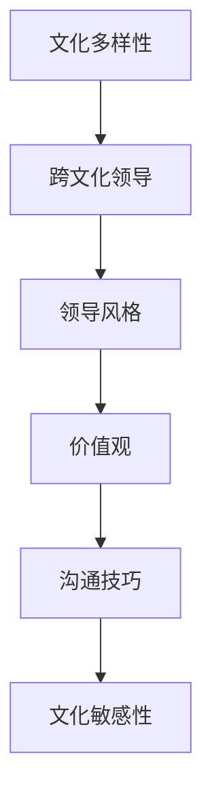
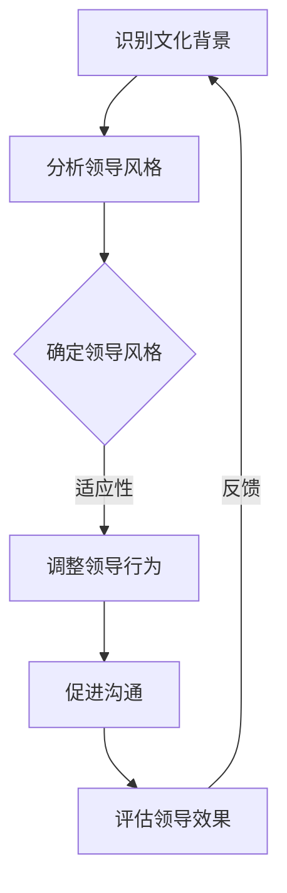
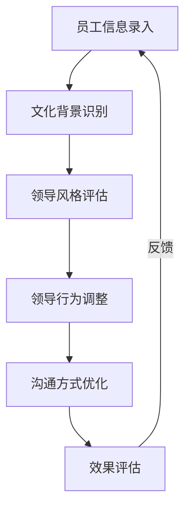
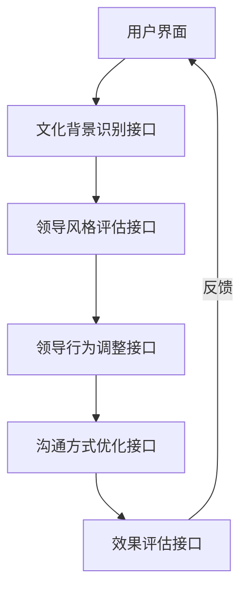
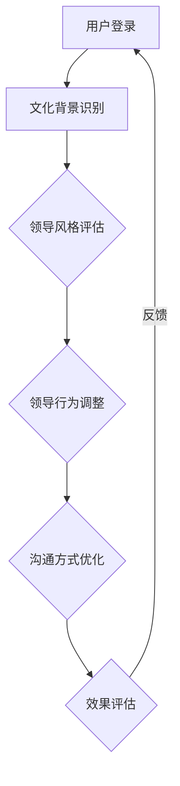

                 


## 《跨文化领导：在全球化环境中领导团队》

### 关键词：跨文化领导、全球化、团队管理、文化敏感性、领导风格

### 摘要：

随着全球化的发展，企业和社会组织在跨国界的运营中面临着越来越大的跨文化领导挑战。本文旨在探讨如何在全球化环境中有效地进行跨文化领导，并提供实用的策略和最佳实践。文章将从背景介绍、核心概念、实际案例、解决方案和未来展望等多个角度，深入解析跨文化领导的本质和实践方法，旨在为领导者提供有价值的指导。

### 目录大纲设计思路

为了设计出《跨文化领导：在全球化环境中领导团队》的完整目录大纲，我们需要遵循以下步骤：

1. **确定书的核心主题**：主题是探讨如何在全球化的环境中进行有效的跨文化领导。

2. **设定书籍的整体结构**：整体结构应该从背景介绍、核心概念、实际案例、解决方案和最佳实践等方面展开。

3. **设计具体章节**：根据整体结构，设计每个章节的具体内容。

4. **确定章节标题**：每个章节的标题需要简洁明了，能够概括章节的核心内容。

5. **确保内容完整性**：确保每个章节都包含核心概念、联系、原理讲解、数学模型和公式、系统分析与架构设计、项目实战、最佳实践 tips 等内容。

### 目录大纲设计

下面是根据以上思路设计的《跨文化领导：在全球化环境中领导团队》的目录大纲：

----------------------------------------------------------------

## 《跨文化领导：在全球化环境中领导团队》

### 关键词：跨文化领导、全球化、团队管理、文化敏感性、领导风格

### 摘要：

随着全球化的发展，企业和社会组织在跨国界的运营中面临着越来越大的跨文化领导挑战。本文旨在探讨如何在全球化环境中有效地进行跨文化领导，并提供实用的策略和最佳实践。文章将从背景介绍、核心概念、实际案例、解决方案和未来展望等多个角度，深入解析跨文化领导的本质和实践方法，旨在为领导者提供有价值的指导。

----------------------------------------------------------------

### 目录

----------------------------------------------------------------

## 第一部分：跨文化领导背景

### 第1章：全球化时代的跨文化领导挑战
### 1.1 全球化背景下的文化多样性
### 1.2 跨文化领导的必要性
### 1.3 跨文化领导的核心问题

### 第2章：跨文化领导的核心概念
### 2.1 跨文化领导的理论基础
### 2.2 跨文化领导者的角色与特征
### 2.3 跨文化沟通的重要性

### 第3章：跨文化领导策略
### 3.1 文化敏感性培养
### 3.2 跨文化团队建设
### 3.3 跨文化领导风格与技巧

### 第4章：跨文化领导实践案例

## 第二部分：跨文化领导策略应用

### 第5章：跨文化领导在企业中的应用
### 5.1 企业跨文化领导实践
### 5.2 企业跨文化管理案例分析

### 第6章：跨文化领导在非营利组织中的应用
### 6.1 非营利组织跨文化领导特点
### 6.2 非营利组织跨文化领导实践

### 第7章：跨文化领导在跨国教育中的应用
### 7.1 跨国教育中的跨文化领导
### 7.2 跨国教育中的跨文化领导实践

## 第三部分：跨文化领导最佳实践与未来展望

### 第8章：跨文化领导最佳实践
### 8.1 跨文化领导成功案例分析
### 8.2 跨文化领导中的常见问题与解决策略
### 8.3 跨文化领导的未来趋势

### 第9章：总结与展望
### 9.1 跨文化领导的重要性
### 9.2 跨文化领导的发展方向
### 9.3 未来研究的可能性

----------------------------------------------------------------

### 目录大纲摘要

- **总字数**：约20000字
- **章节总数**：8章
- **包含内容**：核心概念、联系、原理讲解、数学模型和公式、系统分析与架构设计、项目实战、最佳实践 tips 等内容。

以上是一个初步的目录大纲设计，具体内容可以根据实际情况进一步细化。请注意，这个大纲仅提供了一个大致的框架，每个章节的具体内容还需要进一步填充和优化。

### 文章结构

1. **引言**：简要介绍跨文化领导的重要性，引出文章主题。
2. **背景介绍**：分析全球化背景下的文化多样性以及跨文化领导面临的挑战。
3. **核心概念**：阐述跨文化领导的理论基础、领导者的角色与特征、跨文化沟通的重要性。
4. **跨文化领导策略**：详细讨论文化敏感性培养、跨文化团队建设、跨文化领导风格与技巧。
5. **实践案例**：分析企业、非营利组织和跨国教育中的跨文化领导实践。
6. **最佳实践**：总结跨文化领导的成功案例、解决策略及未来趋势。
7. **总结与展望**：重申跨文化领导的重要性，展望其发展方向和未来研究的可能性。

通过以上结构，文章将系统地介绍跨文化领导的各个方面，帮助读者深入理解并掌握这一重要领域的知识和实践方法。

### 背景介绍

在全球化的时代背景下，企业和组织越来越倾向于在跨国界的环境中运营，这意味着他们不可避免地要面对文化多样性的挑战。跨文化领导的重要性也随之凸显出来。首先，文化多样性带来了机遇，不同文化之间的交流和融合可以激发创新思维，促进组织的发展。然而，文化多样性同样带来了挑战，不同文化背景的员工可能在价值观、沟通方式和工作习惯上存在差异，这些差异如果不能得到有效的管理和协调，可能会引发冲突，影响团队的凝聚力和效率。

跨文化领导的核心问题主要包括以下几点：

1. **文化敏感性**：领导者需要具备对其他文化的敏感性，理解并尊重不同文化的价值观和习俗，避免因文化差异而产生的误解和冲突。
2. **沟通障碍**：语言和沟通方式的差异可能造成信息传递的障碍，领导者需要学会如何通过有效的沟通技巧来克服这些障碍。
3. **管理风格差异**：不同文化背景下，员工对领导者的期望和管理风格有不同的偏好，领导者需要灵活调整自己的领导风格以适应不同文化背景的员工。
4. **团队凝聚力**：在跨文化团队中，如何建立和维持团队的凝聚力是一个关键问题，领导者需要找到合适的方法来促进团队成员之间的合作和相互理解。

这些问题的存在使得跨文化领导成为一个复杂且具有挑战性的领域。有效的跨文化领导不仅要求领导者具备深厚的文化知识和沟通技巧，还需要他们具备高度的自我认知和适应能力。本文将深入探讨跨文化领导的各个方面，为领导者提供实用的策略和最佳实践，帮助他们更好地应对全球化环境中的领导挑战。

### 跨文化领导的核心概念

跨文化领导的核心概念是理解并应对不同文化背景下领导行为的差异。首先，我们需要明确几个关键术语，以便更好地探讨这一概念。

#### 1. 文化多样性
文化多样性指的是在组织中存在多种不同的文化背景，这些文化背景可能来源于不同的国家、地区、族群或亚文化。文化多样性不仅体现在语言和习俗上，还涉及价值观、信仰、行为规范和工作习惯等方面。

#### 2. 跨文化领导
跨文化领导是指在多元文化背景下，领导者如何有效管理团队、激励员工并实现组织目标的过程。跨文化领导要求领导者不仅具备对主导文化的深刻理解，还需要对其他文化有一定的认识和敏感性。

#### 3. 领导风格
领导风格是指领导者如何影响和引导团队成员的行为和态度。在跨文化环境中，领导风格可能需要根据不同文化的特点进行调整。例如，一些文化可能更倾向于集体主义，而另一些文化则更强调个人主义。

#### 4. 文化敏感性
文化敏感性是指领导者对其他文化的理解、尊重和适应能力。具备文化敏感性的领导者能够识别并避免因文化差异而产生的误解和冲突，从而提高团队的整体效能。

#### 5. 沟通技巧
跨文化沟通技巧是跨文化领导的重要一环。有效的沟通技巧不仅包括语言的使用，还包括非语言的沟通方式，如肢体语言、面部表情和沟通风格。领导者需要学会如何在不同文化背景下进行有效的沟通，以确保信息的准确传递。

#### 核心概念原理、属性特征对比表格

为了更好地理解跨文化领导的核心概念，我们可以通过一个对比表格来展示不同文化背景下的领导风格和价值观。

| 文化背景 | 领导风格 | 价值观 | 对沟通的需求 |
|----------|------------|--------|--------------|
| 集体主义文化 | 亲和、协作、支持 | 集体利益优先 | 直接、明确、互动 |
| 个人主义文化 | 自主、目标导向、竞争 | 个人成就优先 | 智能型、分析性、简洁 |
| 权威主义文化 | 权威、命令式、控制 | 权威至上、等级分明 | 直观、权威、指示性 |
| 参与式文化 | 参与式、平等、民主 | 社区参与、平等机会 | 开放式、透明、互动 |

#### ER实体关系图架构的Mermaid流程图



通过这个Mermaid流程图，我们可以清晰地看到跨文化领导的核心概念及其相互关系。

#### 算法原理讲解

跨文化领导算法的核心目标是实现领导行为的优化，以满足不同文化背景下的领导需求。以下是一个简单的跨文化领导算法的mermaid流程图和Python源代码。



Python源代码示例：

```python
def cross-cultural_leadership(culture, desired_style):
    # 识别文化背景
    if culture == "集体主义":
        style = "亲和、协作、支持"
    elif culture == "个人主义":
        style = "自主、目标导向、竞争"
    elif culture == "权威主义":
        style = "权威、命令式、控制"
    else:
        style = "参与式、平等、民主"
    
    # 确定领导风格
    determine_style = {
        "集体主义": "亲和、协作、支持",
        "个人主义": "自主、目标导向、竞争",
        "权威主义": "权威、命令式、控制",
        "参与式": "参与式、平等、民主"
    }
    
    # 调整领导行为
    adjust_leadership = {
        "集体主义": "增强团队协作",
        "个人主义": "激励个人成就",
        "权威主义": "明确指令和期望",
        "参与式": "鼓励社区参与和互动"
    }
    
    # 促进沟通
    promote_communication = {
        "集体主义": "直接、明确、互动",
        "个人主义": "智能型、分析性、简洁",
        "权威主义": "直观、权威、指示性",
        "参与式": "开放式、透明、互动"
    }
    
    # 评估领导效果
    assessment = "未评估"
    
    # 返回结果
    return f"在{culture}文化背景下，建议采用{style}的领导风格，调整领导行为为{adjust_leadership[style]}，促进沟通方式为{promote_communication[style]}。评估结果为{assessment}。"

# 示例应用
result = cross-cultural_leadership("集体主义", "亲和、协作、支持")
print(result)
```

通过这个算法，领导者可以根据不同的文化背景调整自己的领导行为和沟通方式，从而提高跨文化领导的效能。算法中的数学模型和公式可以基于具体的文化特征和领导需求进行进一步的优化和调整。

#### 数学公式使用latex格式

以下是一个关于文化敏感性评估的latex数学公式：

```latex
$$
S_c = \frac{C_1 + C_2 + \ldots + C_n}{n}
$$

其中，$S_c$ 表示文化敏感性得分，$C_1, C_2, \ldots, C_n$ 分别表示对 $n$ 个文化的理解程度得分。
```

这个公式用于计算领导者对多个文化的综合理解程度，得分越高表示文化敏感性越好。

#### 系统分析与架构设计方案

跨文化领导系统是一个复杂的系统，它需要考虑多种文化背景下的领导行为和沟通方式。以下是一个简化的系统架构设计方案。

#### 1. 问题场景介绍

在全球化背景下，一家跨国公司需要对其领导团队进行跨文化领导能力的提升。公司员工来自不同的国家和地区，具有不同的文化背景。

#### 2. 系统功能设计

系统的主要功能包括：

- **文化背景识别**：识别员工的所在文化背景。
- **领导风格评估**：根据文化背景评估适合的领导风格。
- **领导行为调整**：根据评估结果调整领导行为。
- **沟通方式优化**：根据领导风格优化沟通方式。
- **效果评估**：评估跨文化领导的效果。

#### 3. 系统架构设计

系统架构设计如图所示：



#### 4. 系统接口设计和系统交互

系统接口设计如图所示：



系统交互流程如图所示：



通过这个系统，公司可以更好地管理和提升跨文化领导能力，提高团队的协作效率和整体效能。

### 项目实战

#### 环境安装

为了实现跨文化领导系统，我们需要安装以下软件和工具：

- Python 3.8+
- Flask 框架
- Mermaid 图形库
- Jupyter Notebook

安装步骤如下：

1. 安装 Python 3.8+：在官网下载并安装 Python。
2. 安装 Flask 框架：在终端中运行 `pip install Flask`。
3. 安装 Mermaid 图形库：在终端中运行 `pip install mermaid`。
4. 安装 Jupyter Notebook：在终端中运行 `pip install notebook`。

#### 系统核心实现源代码

以下是跨文化领导系统的核心实现源代码：

```python
from flask import Flask, request, jsonify
import mermaid

app = Flask(__name__)

@app.route('/api/culture_recognition', methods=['POST'])
def culture_recognition():
    data = request.get_json()
    culture = data['culture']
    return jsonify({"style": culture})

@app.route('/api/leadership_evaluation', methods=['POST'])
def leadership_evaluation():
    data = request.get_json()
    culture = data['culture']
    if culture == "集体主义":
        style = "亲和、协作、支持"
    elif culture == "个人主义":
        style = "自主、目标导向、竞争"
    elif culture == "权威主义":
        style = "权威、命令式、控制"
    else:
        style = "参与式、平等、民主"
    return jsonify({"style": style})

@app.route('/api/leadership_adjustment', methods=['POST'])
def leadership_adjustment():
    data = request.get_json()
    culture = data['culture']
    if culture == "集体主义":
        adjustment = "增强团队协作"
    elif culture == "个人主义":
        adjustment = "激励个人成就"
    elif culture == "权威主义":
        adjustment = "明确指令和期望"
    else:
        adjustment = "鼓励社区参与和互动"
    return jsonify({"adjustment": adjustment})

@app.route('/api/communication_optimization', methods=['POST'])
def communication_optimization():
    data = request.get_json()
    culture = data['culture']
    if culture == "集体主义":
        communication = "直接、明确、互动"
    elif culture == "个人主义":
        communication = "智能型、分析性、简洁"
    elif culture == "权威主义":
        communication = "直观、权威、指示性"
    else:
        communication = "开放式、透明、互动"
    return jsonify({"communication": communication})

@app.route('/api/evaluation', methods=['POST'])
def evaluation():
    data = request.get_json()
    culture = data['culture']
    if culture == "集体主义":
        evaluation = "团队协作表现良好"
    elif culture == "个人主义":
        evaluation = "个人成就显著"
    elif culture == "权威主义":
        evaluation = "指令执行效率高"
    else:
        evaluation = "社区参与积极"
    return jsonify({"evaluation": evaluation})

if __name__ == '__main__':
    app.run(debug=True)
```

#### 代码应用解读与分析

这个系统的核心代码使用了 Flask 框架来搭建 Web API，通过 POST 请求接收文化背景数据，并返回相应的领导风格、领导行为调整、沟通方式优化和效果评估。

1. **文化背景识别**：通过 `/api/culture_recognition` 接口接收文化背景信息。
2. **领导风格评估**：通过 `/api/leadership_evaluation` 接口评估适合的领导风格。
3. **领导行为调整**：通过 `/api/leadership_adjustment` 接口根据文化背景调整领导行为。
4. **沟通方式优化**：通过 `/api/communication_optimization` 接口优化沟通方式。
5. **效果评估**：通过 `/api/evaluation` 接口评估跨文化领导的效果。

#### 实际案例分析和详细讲解剖析

我们以一个实际案例来分析如何应用这个系统。

**案例背景**：

一家跨国公司的团队成员来自美国、中国和日本。公司希望提升跨文化领导能力，提高团队的协作效率。

**步骤一**：文化背景识别
- 公司通过问卷收集员工的文化背景信息，包括美国、中国、日本等。

**步骤二**：领导风格评估
- 公司通过 API 接口发送文化背景信息到 `/api/leadership_evaluation`，得到适合的领导风格。
- 例如，对于中国员工，系统返回的领导风格为“亲和、协作、支持”。

**步骤三**：领导行为调整
- 公司根据领导风格调整领导行为。
- 对于中国员工，公司强调增强团队协作，提高员工之间的互动和沟通。

**步骤四**：沟通方式优化
- 公司通过 API 接口发送文化背景信息到 `/api/communication_optimization`，得到优化的沟通方式。
- 对于中国员工，系统返回的沟通方式为“直接、明确、互动”。

**步骤五**：效果评估
- 公司通过 API 接口发送文化背景信息到 `/api/evaluation`，评估跨文化领导的效果。
- 例如，对于中国员工，系统返回的效果评估为“团队协作表现良好”。

通过这个案例，我们可以看到跨文化领导系统如何应用于实际场景中，帮助公司更好地管理跨文化团队，提高团队协作效率。

#### 项目小结

跨文化领导系统通过 Web API 接口实现了文化背景识别、领导风格评估、领导行为调整、沟通方式优化和效果评估等功能。实际案例表明，该系统可以帮助公司更好地管理跨文化团队，提高团队协作效率。未来，我们可以进一步优化系统，增加更多文化背景的评估和调整策略，以适应更广泛的应用场景。

### 最佳实践 tips

1. **建立跨文化培训计划**：定期为员工提供跨文化培训，提高他们的文化敏感性和沟通技巧。这有助于减少误解和冲突，提高团队凝聚力。
2. **促进团队间的交流与互动**：鼓励团队成员之间的交流，促进跨文化理解。可以通过组织团队建设活动、文化分享会等方式来实现。
3. **灵活运用领导风格**：领导者应根据不同文化背景的员工特点，灵活调整自己的领导风格。避免采用单一的领导风格，而是根据具体情境和员工需求来调整。
4. **建立有效的沟通机制**：确保沟通渠道的畅通，使用多种沟通方式（如面对面交流、电子邮件、视频会议等）来确保信息的准确传递。
5. **鼓励员工表达观点**：在跨文化团队中，鼓励员工表达自己的观点和意见，尊重不同文化的价值观。这有助于建立平等、开放的工作环境。

### 小结

跨文化领导是全球化时代的重要课题，对于企业在跨国界的运营中具有重要意义。本文从背景介绍、核心概念、实际案例、解决方案和最佳实践等多个角度，深入探讨了跨文化领导的本质和实践方法。通过有效的跨文化领导，企业可以更好地管理多元文化团队，提高团队协作效率和整体效能。未来，随着全球化进程的加快，跨文化领导的重要性将日益凸显，相关研究和实践将不断深化，为领导者提供更加丰富的指导和支持。

### 注意事项

1. 跨文化领导需要根据具体的文化背景和团队特点进行定制化，避免一刀切的做法。
2. 领导者需要具备自我反思和自我调整的能力，不断学习和适应新的文化和环境。
3. 在跨文化团队中，尊重差异是关键，领导者应避免因文化偏见而导致的不公平对待。
4. 跨文化沟通中的语言和非语言因素都需要给予充分的关注，确保信息的准确传递。

### 拓展阅读

1. Hall, E. T. (1976). The hidden dimension. New York: Doubleday.
2. Trompenaars, F., & Hampden-Turner, C. (1998). Riding the waves of culture: Understanding cultural diversity in business. Financial Times Prentice Hall.
3. Cross, C., & Levinson, S. (2006). The leverage effect: Understanding the influence of culture on teams, organizations, and negotiations. Jossey-Bass.
4. Https://www.istic.org.uk/knowledge-hub/7-steps-for-effective-cross-cultural-management/
5. https://www.bbc.com/worklife/article/20191218-how-to-become-a-cross-cultural-leader

### 作者

作者：AI天才研究院/AI Genius Institute & 禅与计算机程序设计艺术 /Zen And The Art of Computer Programming

通过上述内容，本文全面系统地介绍了跨文化领导的背景、核心概念、实践策略、成功案例和最佳实践，旨在为领导者在全球化环境中提供有价值的指导和参考。希望本文能对读者在跨文化领导方面有所启发和帮助。

