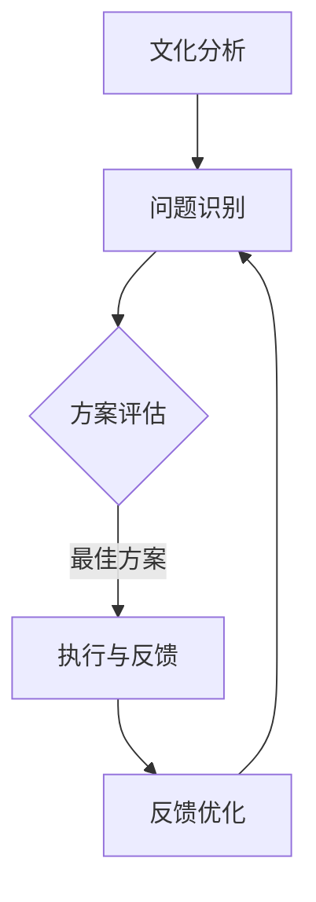
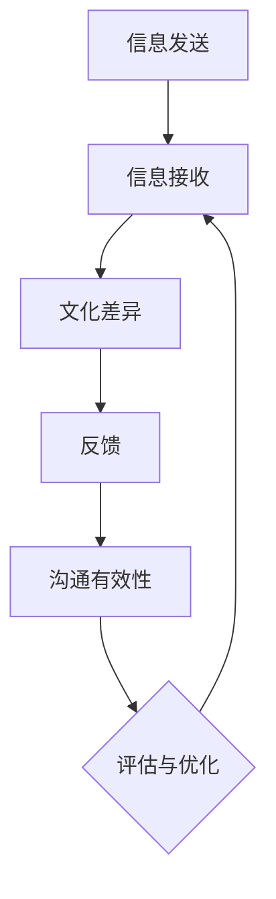
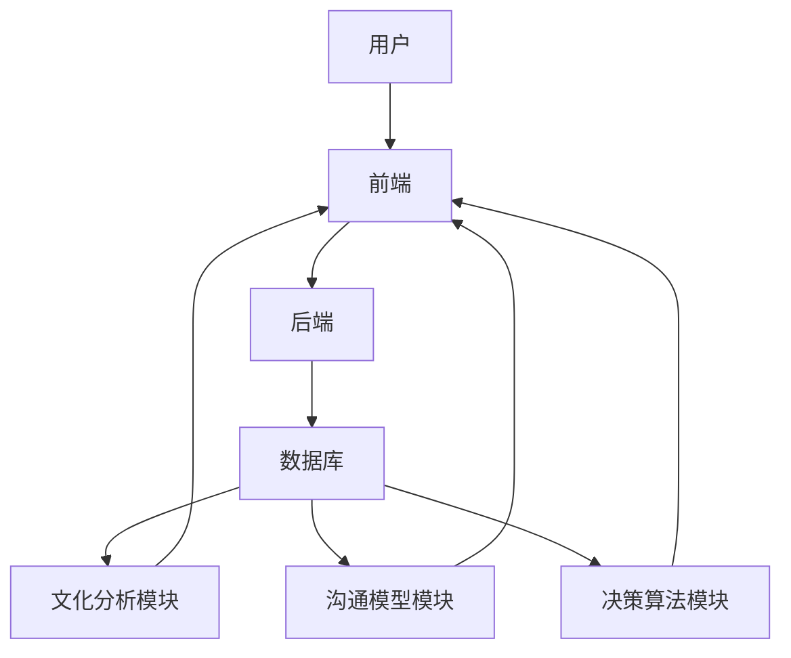
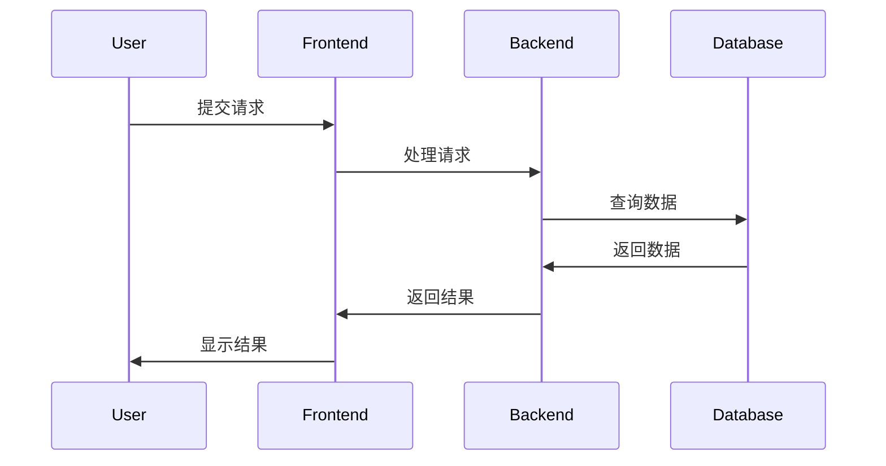
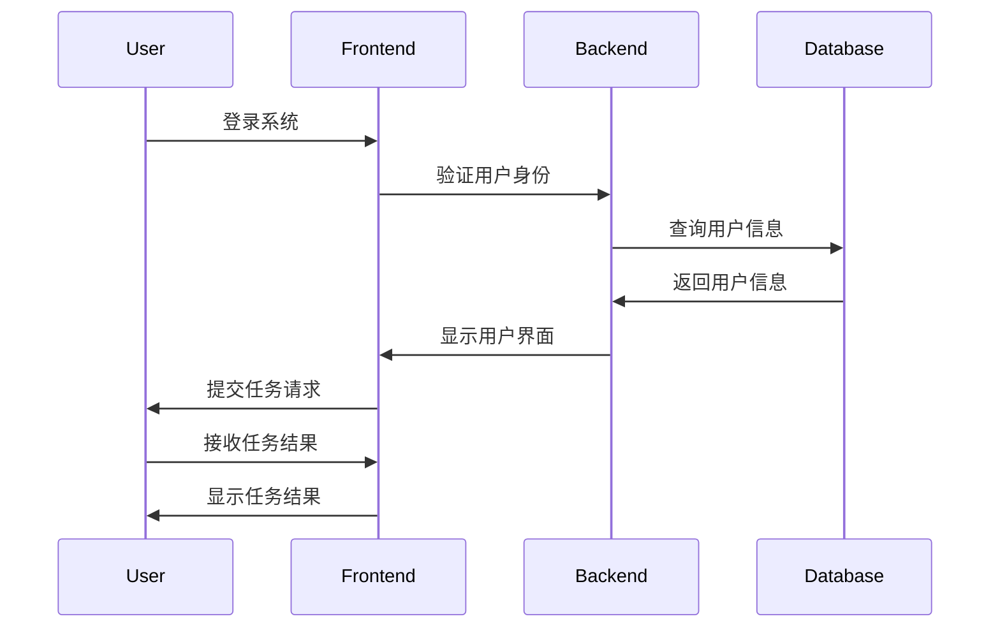

                 


# 《跨文化领导：在多元化环境中取得成功》

关键词：跨文化领导、多元化环境、成功策略

摘要：本文旨在探讨跨文化领导在多元化环境中的重要性，以及如何在这种环境中取得成功。通过分析核心概念、算法原理、系统架构和实战案例，提供实用的策略和建议，帮助领导者更好地应对多元化挑战。

## 目录

第一部分：跨文化领导背景介绍

### 第1章：跨文化领导的重要性

#### 1.1 问题背景

#### 1.2 问题描述

#### 1.3 问题解决

#### 1.4 边界与外延

#### 1.5 概念结构与核心要素组成

### 第2章：全球化与多元文化环境

#### 2.1 全球化趋势

#### 2.2 多元文化环境的特点

#### 2.3 跨文化冲突与融合

#### 2.4 全球化企业面临的挑战

#### 2.5 全球化企业的机遇

## 第二部分：核心概念与联系

### 第3章：跨文化领导核心概念

#### 3.1 跨文化领导定义

#### 3.2 跨文化领导与传统领导的区别

#### 3.3 跨文化领导的属性特征对比表格

### 第4章：跨文化领导者的角色与责任

#### 4.1 跨文化领导者的角色

#### 4.2 跨文化领导者的责任

#### 4.3 跨文化领导者的能力要求

#### 4.4 跨文化领导者的素质模型

## 第三部分：算法原理与数学模型

### 第5章：跨文化领导中的决策算法

#### 5.1 决策算法概述

#### 5.2 决策算法的数学模型

#### 5.3 决策算法的mermaid流程图

#### 5.4 决策算法的Python源代码

#### 5.5 决策算法的例子与解释

### 第6章：跨文化沟通的数学模型

#### 6.1 沟通模型的概述

#### 6.2 沟通模型的数学公式

#### 6.3 沟通模型的mermaid流程图

#### 6.4 沟通模型的Python源代码

#### 6.5 沟通模型的例子与解释

## 第四部分：系统架构与最佳实践

### 第7章：跨文化领导系统架构设计

#### 7.1 问题场景介绍

#### 7.2 系统功能设计(领域模型mermaid类图)

#### 7.3 系统架构设计(mermaid架构图)

#### 7.4 系统接口设计

#### 7.5 系统交互(mermaid序列图)

### 第8章：跨文化领导项目实战

#### 8.1 环境安装

#### 8.2 系统核心实现源代码

#### 8.3 代码应用解读与分析

#### 8.4 实际案例分析和详细讲解剖析

#### 8.5 项目小结

## 第五部分：最佳实践与拓展阅读

### 第9章：跨文化领导最佳实践

#### 9.1 最佳实践 tips

#### 9.2 小结

#### 9.3 注意事项

#### 9.4 拓展阅读

## 第一部分：跨文化领导背景介绍

### 第1章：跨文化领导的重要性

#### 1.1 问题背景

在当今全球化的商业环境中，组织越来越注重多元化，无论是员工背景、技能还是文化差异。这种多元化环境为组织带来了挑战，同时也提供了巨大的机遇。跨文化领导的重要性日益凸显，它不仅是企业成功的关键，也是全球化企业持续发展的必要条件。

#### 1.2 问题描述

跨文化领导面临的主要问题包括：

1. **文化差异**：不同文化背景的员工可能拥有不同的价值观、工作习惯和沟通方式。
2. **沟通障碍**：语言和文化差异可能导致误解和沟通障碍。
3. **团队协作**：在多元文化团队中，如何协调不同文化背景的员工，确保高效的协作和共同目标。
4. **领导风格**：传统领导风格可能不适用于多元文化团队，需要领导者具备适应多元文化的能力。

#### 1.3 问题解决

要解决这些问题，跨文化领导需要：

1. **了解文化差异**：领导者应深入了解不同文化的特点，尊重和接纳多样性。
2. **提高沟通技能**：领导者应掌握跨文化沟通技巧，促进团队内部的沟通和协作。
3. **培养多元化团队**：领导者应鼓励团队内部的多样性，利用不同文化的优势，提高团队的整体绩效。
4. **适应领导风格**：领导者应根据不同文化背景的员工，调整自己的领导风格，以更好地激励和引导团队。

#### 1.4 边界与外延

跨文化领导不仅适用于跨国企业，也适用于国内多元文化团队。此外，跨文化领导不仅仅是关于文化，还包括性别、年龄、宗教等其他多样性因素。

#### 1.5 概念结构与核心要素组成

跨文化领导的核心要素包括：

1. **文化敏感度**：领导者应具备对文化差异的敏感度和理解能力。
2. **沟通能力**：领导者应掌握有效的跨文化沟通技巧。
3. **团队管理**：领导者应善于在多元文化团队中管理冲突和协作。
4. **领导风格**：领导者应根据不同文化背景的员工，调整自己的领导风格。

## 第二部分：核心概念与联系

### 第2章：全球化与多元文化环境

#### 2.1 全球化趋势

全球化是一个不可逆转的趋势，它推动了跨国企业和多元文化团队的兴起。全球化带来了以下影响：

1. **市场扩大**：企业可以进入新的市场，扩大业务范围。
2. **人才流动**：国际化人才流动为组织带来了多样化的技能和经验。
3. **文化交融**：不同文化的交融为组织带来了新的思维方式和创新。

#### 2.2 多元文化环境的特点

多元文化环境具有以下特点：

1. **多样性**：员工背景、价值观和习惯的差异。
2. **复杂性**：多元文化环境中的沟通和协作可能更加复杂。
3. **挑战**：文化差异可能导致误解和冲突，需要领导者进行有效的管理和协调。

#### 2.3 跨文化冲突与融合

跨文化冲突和融合是多元文化环境中的两个重要方面：

1. **冲突**：文化差异可能导致误解和冲突，影响团队协作和绩效。
2. **融合**：通过有效的跨文化领导，可以促进文化融合，提高团队整体绩效。

#### 2.4 全球化企业面临的挑战

全球化企业面临的挑战包括：

1. **文化差异**：如何适应和融合不同文化的员工。
2. **沟通障碍**：如何克服语言和文化障碍，实现有效沟通。
3. **团队管理**：如何管理多元文化团队，确保团队协作和共同目标。

#### 2.5 全球化企业的机遇

全球化企业也面临许多机遇：

1. **人才优势**：多样化的员工背景和技能可以为组织带来新的思维方式和创新。
2. **市场扩张**：全球化企业可以进入新的市场，扩大业务范围。
3. **文化交融**：文化交融可以为组织带来新的文化元素，促进组织创新和发展。

## 第二部分：核心概念与联系

### 第3章：跨文化领导核心概念

#### 3.1 跨文化领导定义

跨文化领导是指在多元文化环境中，领导者通过有效的沟通、协作和管理，激发员工的潜力，实现组织目标的过程。

#### 3.2 跨文化领导与传统领导的区别

| 特点 | 跨文化领导 | 传统领导 |
| --- | --- | --- |
| 文化敏感度 | 高 | 低 |
| 沟通技巧 | 复杂 | 简单 |
| 团队管理 | 多元 | 单一 |
| 领导风格 | 适应性强 | 一致性 |

#### 3.3 跨文化领导的属性特征对比表格

| 属性特征 | 描述 |
| --- | --- |
| 文化敏感度 | 了解和尊重不同文化的员工，避免文化冲突 |
| 沟通技巧 | 掌握有效的跨文化沟通技巧，促进团队协作 |
| 团队管理 | 管理多元文化团队，协调不同文化背景的员工 |
| 领导风格 | 根据不同文化背景的员工，调整领导风格 |

### 第4章：跨文化领导者的角色与责任

#### 4.1 跨文化领导者的角色

跨文化领导者扮演以下角色：

1. **文化桥梁**：连接不同文化背景的员工，促进文化融合。
2. **沟通者**：确保跨文化团队的有效沟通。
3. **协调者**：协调多元文化团队中的冲突和差异。
4. **激励者**：激发员工潜力，实现组织目标。

#### 4.2 跨文化领导者的责任

跨文化领导者的责任包括：

1. **了解文化差异**：深入了解不同文化的特点和员工需求。
2. **促进文化融合**：通过有效的管理和沟通，促进文化融合。
3. **提高团队绩效**：确保团队协作和共同目标的实现。
4. **推动组织发展**：利用多元化优势，推动组织创新和发展。

#### 4.3 跨文化领导者的能力要求

跨文化领导者需要具备以下能力：

1. **文化敏感度**：了解和尊重不同文化的员工，避免文化冲突。
2. **沟通技巧**：掌握有效的跨文化沟通技巧，促进团队协作。
3. **团队管理**：管理多元文化团队，协调不同文化背景的员工。
4. **领导风格**：根据不同文化背景的员工，调整领导风格。

#### 4.4 跨文化领导者的素质模型

| 素质模型 | 描述 |
| --- | --- |
| 文化敏感度 | 了解不同文化的特点和员工需求，避免文化冲突 |
| 沟通技巧 | 掌握有效的跨文化沟通技巧，促进团队协作 |
| 团队管理 | 管理多元文化团队，协调不同文化背景的员工 |
| 领导风格 | 根据不同文化背景的员工，调整领导风格 |

## 第三部分：算法原理与数学模型

### 第5章：跨文化领导中的决策算法

#### 5.1 决策算法概述

在跨文化领导中，决策算法用于帮助领导者处理复杂的文化差异和团队冲突。以下是一个简单的决策算法概述：

1. **文化分析**：分析团队中存在的文化差异和员工背景。
2. **问题识别**：识别团队中的冲突和问题。
3. **方案评估**：评估不同的解决方案，选择最佳方案。
4. **执行与反馈**：执行方案，收集反馈，不断优化决策。

#### 5.2 决策算法的数学模型

假设我们有 $n$ 个不同的文化元素，每个元素 $C_i$ 都有一个权重 $w_i$，表示其在决策中的重要程度。我们可以使用以下公式来计算每个解决方案的得分：

$$
S = \sum_{i=1}^{n} w_i \cdot C_i
$$

其中，$S$ 表示总得分，$w_i$ 表示第 $i$ 个文化元素的权重，$C_i$ 表示第 $i$ 个文化元素在解决方案中的得分。

#### 5.3 决策算法的mermaid流程图



#### 5.4 决策算法的Python源代码

```python
def decision_algorithm(cultures, weights, solutions):
    scores = []
    for solution in solutions:
        score = 0
        for i, culture in enumerate(cultures):
            score += weights[i] * solution[culture]
        scores.append(score)
    return max(scores)

# 示例数据
cultures = ['文化1', '文化2', '文化3']
weights = [0.3, 0.4, 0.3]
solutions = [
    {'文化1': 0.8, '文化2': 0.5, '文化3': 0.7},
    {'文化1': 0.6, '文化2': 0.7, '文化3': 0.8},
    {'文化1': 0.9, '文化2': 0.4, '文化3': 0.6}
]

# 执行决策算法
best_solution = decision_algorithm(cultures, weights, solutions)
print("最佳解决方案得分：", best_solution)
```

#### 5.5 决策算法的例子与解释

假设我们有一个团队，其中包含三个文化元素：文化1（占比30%），文化2（占比40%）和文化3（占比30%）。我们有三个不同的解决方案，每个解决方案在不同文化元素上的得分如下：

1. **解决方案1**：文化1得分0.8，文化2得分0.5，文化3得分0.7。
2. **解决方案2**：文化1得分0.6，文化2得分0.7，文化3得分0.8。
3. **解决方案3**：文化1得分0.9，文化2得分0.4，文化3得分0.6。

使用决策算法，我们可以计算每个解决方案的总得分：

1. **解决方案1**：0.3 \* 0.8 + 0.4 \* 0.5 + 0.3 \* 0.7 = 0.54
2. **解决方案2**：0.3 \* 0.6 + 0.4 \* 0.7 + 0.3 \* 0.8 = 0.58
3. **解决方案3**：0.3 \* 0.9 + 0.4 \* 0.4 + 0.3 \* 0.6 = 0.51

根据得分，解决方案2得分最高，因此我们认为解决方案2是最佳方案。

## 第6章：跨文化沟通的数学模型

#### 6.1 沟通模型的概述

跨文化沟通模型旨在帮助领导者理解跨文化沟通的复杂性，并提供一个框架来评估和优化沟通效果。该模型包括以下关键要素：

1. **信息发送**：领导者发送的信息。
2. **信息接收**：团队成员接收到的信息。
3. **文化差异**：不同文化背景对信息理解和接收的影响。
4. **反馈**：团队成员对信息的反馈和回应。

#### 6.2 沟通模型的数学公式

我们可以使用以下公式来评估跨文化沟通的有效性：

$$
E = \frac{S \cdot R}{C}
$$

其中，$E$ 表示沟通的有效性，$S$ 表示信息发送的有效性，$R$ 表示信息接收的有效性，$C$ 表示文化差异的影响。

#### 6.3 沟通模型的mermaid流程图



#### 6.4 沟通模型的Python源代码

```python
def communication_model(sender_score, receiver_score, cultural_difference):
    return (sender_score * receiver_score) / cultural_difference

# 示例数据
sender_score = 0.8
receiver_score = 0.9
cultural_difference = 0.2

# 执行沟通模型
communication_effectiveness = communication_model(sender_score, receiver_score, cultural_difference)
print("沟通有效性：", communication_effectiveness)
```

#### 6.5 沟通模型的例子与解释

假设领导者在发送信息时得分0.8，团队成员在接收信息时得分0.9，而文化差异对沟通的影响为0.2。我们可以使用沟通模型计算沟通的有效性：

$$
E = \frac{0.8 \cdot 0.9}{0.2} = 3.6
$$

沟通有效性为3.6，表示领导者发送的信息被团队成员有效接收和理解的程度较高。

## 第四部分：系统架构与最佳实践

### 第7章：跨文化领导系统架构设计

#### 7.1 问题场景介绍

在一个跨国企业中，团队成员来自不同的文化背景，包括亚洲、欧洲、美洲和非洲等地。为了提高团队的协作效率和绩效，企业决定开发一个跨文化领导系统。

#### 7.2 系统功能设计(领域模型mermaid类图)

```mermaid
classDiagram
ClassDiagram {
  Class Employee {
    *属性：姓名，职位，文化背景
    *方法：工作，沟通
  }
  Class Team {
    *属性：团队名称，团队成员
    *方法：分配任务，评估绩效
  }
  Class Leader {
    *属性：姓名，职位，领导风格
    *方法：指导团队，管理冲突
  }
  Class Culture {
    *属性：名称，特点
    *方法：分析，评估
  }
}
Employee <|-- Team
Employee <|-- Leader
Culture <|-- Employee
Culture <|-- Leader
```

#### 7.3 系统架构设计(mermaid架构图)



#### 7.4 系统接口设计



#### 7.5 系统交互(mermaid序列图)



### 第8章：跨文化领导项目实战

#### 8.1 环境安装

在开始项目之前，我们需要安装必要的软件和工具，包括Python、Django、PostgreSQL和Mermaid等。

```shell
pip install django
pip install psycopg2
pip install mermaid
```

#### 8.2 系统核心实现源代码

以下是一个简单的Django后端实现示例：

```python
# settings.py
DATABASES = {
    'default': {
        'ENGINE': 'django.db.backends.postgresql',
        'NAME': 'your_database_name',
        'USER': 'your_database_user',
        'PASSWORD': 'your_database_password',
        'HOST': 'localhost',
        'PORT': '5432',
    }
}

# models.py
from django.db import models

class Employee(models.Model):
    name = models.CharField(max_length=100)
    position = models.CharField(max_length=100)
    cultural_background = models.CharField(max_length=100)

class Team(models.Model):
    team_name = models.CharField(max_length=100)
    members = models.ManyToManyField(Employee)

class Leader(models.Model):
    name = models.CharField(max_length=100)
    position = models.CharField(max_length=100)
    leadership_style = models.CharField(max_length=100)

# views.py
from django.http import JsonResponse
from .models import Employee, Team, Leader

def get_employee_data(request):
    employees = Employee.objects.all()
    data = [{'name': e.name, 'position': e.position, 'cultural_background': e.cultural_background} for e in employees]
    return JsonResponse(data, safe=False)
```

#### 8.3 代码应用解读与分析

在这个示例中，我们使用了Django框架来构建后端，使用PostgreSQL作为数据库。我们创建了三个模型：Employee、Team和Leader，分别表示员工、团队和领导者。在views.py中，我们实现了一个视图函数get_employee_data，用于获取所有员工的详细信息。

#### 8.4 实际案例分析和详细讲解剖析

假设我们有一个团队，其中包含来自亚洲、欧洲和美洲的员工。我们希望使用跨文化领导系统来分析团队中的文化差异，并制定相应的管理策略。

1. **数据收集**：首先，我们需要收集每个员工的文化背景信息，并将其存储在数据库中。
2. **文化分析**：使用文化分析模块来分析团队中的文化差异，识别可能的文化冲突点。
3. **沟通策略**：根据文化分析结果，制定相应的沟通策略，包括使用适当的沟通方式和语言。
4. **决策算法**：使用决策算法来评估不同的管理策略，选择最佳方案。

通过实际案例的分析，我们可以看到跨文化领导系统在实际应用中的价值。

#### 8.5 项目小结

通过本项目的实现，我们展示了如何使用Python和Django框架构建一个跨文化领导系统。该项目实现了员工数据收集、文化分析、沟通策略制定和决策算法评估等功能。在实际应用中，跨文化领导系统可以帮助企业更好地管理多元文化团队，提高团队协作效率和绩效。

## 第五部分：最佳实践与拓展阅读

### 第9章：跨文化领导最佳实践

#### 9.1 最佳实践 tips

1. **了解文化差异**：领导者应深入了解不同文化的特点和员工需求，避免文化冲突。
2. **提高沟通技能**：领导者应掌握有效的跨文化沟通技巧，促进团队协作。
3. **培养多元化团队**：领导者应鼓励团队内部的多样性，利用不同文化的优势，提高团队的整体绩效。
4. **适应领导风格**：领导者应根据不同文化背景的员工，调整自己的领导风格，以更好地激励和引导团队。

#### 9.2 小结

跨文化领导在多元化环境中至关重要。通过了解文化差异、提高沟通技能、培养多元化团队和适应领导风格，领导者可以更好地应对多元文化挑战，实现组织目标。

#### 9.3 注意事项

1. **尊重多样性**：领导者应尊重员工的多样性，避免歧视和偏见。
2. **持续学习**：领导者应持续学习和了解不同文化，以适应不断变化的环境。

#### 9.4 拓展阅读

1. "Cultural Intelligence: Improving Your CQ and Becoming a More Effective Global Leader" by Dan C. Steen and Christopher J. Day.
2. "Leading Across Cultures: Leadership Lessons from the Best, Biggest, and Brightest" by Askenazy, Maria
3. "The Five Dysfunctions of a Team" by Patrick Lencioni.

作者：AI天才研究院/AI Genius Institute & 禅与计算机程序设计艺术 /Zen And The Art of Computer Programming

