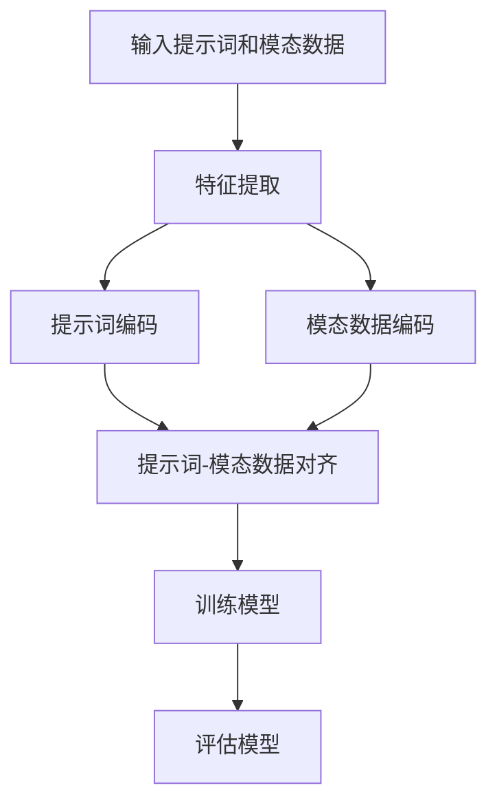
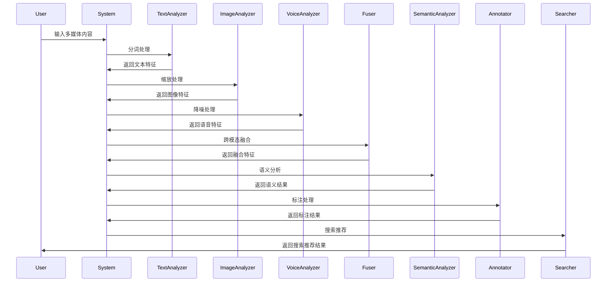

                 

# 跨模态AI的提示词对齐学习方法

## 摘要

本文深入探讨了跨模态AI中的提示词对齐学习方法。首先，我们介绍了跨模态AI的背景、问题和应用场景，接着详细阐述了核心概念和它们之间的联系。随后，通过mermaid流程图、Python源代码和数学模型，我们讲解了提示词对齐的算法原理，并进行了举例说明。进一步，我们分析了跨模态AI的系统架构和功能设计，展示了实际应用场景和项目实战。最后，本文总结了最佳实践，并提供了拓展阅读资源。

## 关键词

跨模态AI，提示词对齐学习，算法原理，系统架构，应用场景

## 背景介绍

### 问题背景

随着人工智能技术的迅猛发展，跨模态AI（Cross-modal AI）逐渐成为研究的热点。跨模态AI旨在处理和整合来自不同模态的信息，如文本、图像、语音等，使得AI系统能够在更广泛的应用场景中表现出色。

在跨模态AI中，提示词对齐学习（Prompt Alignment Learning）是一个关键问题。提示词对齐学习旨在统一不同模态的信息，使得一个模态的提示词能够准确地映射到另一个模态的信息上，从而提高模型的整体性能。

### 描述问题

提示词对齐学习涉及到以下主要问题：

1. **模态一致性**：如何确保不同模态的信息在语义上是一致的？
2. **模态融合**：如何将不同模态的信息进行有效融合，以提高模型的性能？
3. **模态转换**：如何实现不同模态之间的信息转换，使得一个模态的信息能够被另一个模态的模型有效利用？

### 问题解决

为了解决上述问题，研究者们提出了多种提示词对齐学习方法。这些方法主要分为以下几类：

1. **基于深度学习的方法**：利用神经网络模型对提示词进行对齐，如自注意力机制（Self-Attention Mechanism）和循环神经网络（RNN）。
2. **基于图神经网络的方法**：利用图结构来表示不同模态的信息，并通过图神经网络进行对齐，如图卷积网络（GCN）和图注意力网络（GAT）。
3. **基于迁移学习的方法**：利用预先训练的跨模态模型，通过迁移学习实现对新的提示词对齐。

### 边界与外延

跨模态AI的提示词对齐学习不仅涵盖了文本、图像、语音等常见模态，还可能涉及到更多复杂的模态，如视频、多模态传感器数据等。因此，该方法的应用范围非常广泛，包括但不限于：

- **多媒体内容理解**：如图像和文本内容之间的关联分析。
- **多模态交互系统**：如语音识别和文本输入相结合的智能助手。
- **增强现实和虚拟现实**：如利用图像和文本信息来增强用户体验。

### 概念结构与核心要素组成

跨模态AI的提示词对齐学习方法由以下几个核心概念和要素组成：

- **跨模态**：指处理和整合来自不同模态的信息。
- **提示词**：指用于指导模型进行信息处理的词语或短语。
- **对齐学习**：指通过训练模型来实现不同模态之间的信息映射和融合。

## 核心概念与联系

### 核心概念原理

在跨模态AI中，核心概念包括跨模态、提示词和对齐学习。

- **跨模态**：跨模态AI是指能够处理和整合来自不同模态的信息，如文本、图像、语音等。这些模态的信息在语义上通常是不同的，但它们之间又存在潜在的联系，通过跨模态AI技术，可以实现这些信息的高效整合。

- **提示词**：提示词是对模型进行信息处理的指导性词语或短语。在跨模态AI中，提示词的作用是引导模型对特定模态的信息进行理解和处理。例如，在文本-图像跨模态任务中，提示词可以是图像的标题、描述或关键词。

- **对齐学习**：对齐学习是指通过训练模型来实现不同模态之间的信息映射和融合。对齐学习旨在解决模态一致性和模态融合的问题，使得不同模态的信息能够在语义上保持一致，并能够相互补充。

### 概念属性特征对比表格

为了更好地理解不同模态之间的差异和联系，我们可以通过以下表格来对比不同模态的属性特征：

| 模态       | 文本           | 图像           | 语音           | 视频           |
|------------|----------------|----------------|----------------|----------------|
| 数据类型   | 文本           | 像素           | 音频           | 视频帧         |
| 信息表达   | 语义           | 视觉           | 语音           | 视觉+语音       |
| 特征提取   | 词向量、BERT   | 卷积神经网络   | 音频特征       | 卷积神经网络   |
| 融合方法   | 文本相似性     | 图像特征融合   | 音频增强       | 视频帧融合     |

### ER实体关系图架构

为了直观地展示跨模态、提示词和对齐学习之间的联系，我们可以使用Mermaid绘制ER实体关系图。以下是ER实体关系图的示例：

```mermaid
erDiagram
    A[--跨模态]
    B[--提示词]
    C[--对齐学习]

    A ||--|{ B }|-- C
```

在这个ER实体关系图中，跨模态、提示词和对齐学习分别表示为实体A、B和C。跨模态与提示词之间存在双向关联，表示提示词需要跨模态信息进行指导；而提示词和对齐学习之间存在关联，表示对齐学习是通过提示词来实现的。

## 算法原理讲解

### 算法mermaid流程图

为了更好地理解提示词对齐学习算法的步骤，我们可以使用Mermaid绘制算法流程图。以下是提示词对齐学习算法的mermaid流程图：



在这个流程图中，输入提示词和模态数据经过特征提取后，分别编码为提示词编码和模态数据编码。然后，通过提示词-模态数据对齐，将它们映射到同一语义空间。接着，利用对齐后的数据训练模型，并通过评估模型来验证对齐效果。

### Python源代码

以下是一个简单的Python源代码示例，用于实现提示词对齐学习算法的核心部分：

```python
import tensorflow as tf
from tensorflow.keras.layers import Embedding, LSTM, Dense
from tensorflow.keras.models import Model

# 定义模型结构
prompt_embedding = Embedding(input_dim=vocab_size, output_dim=embedding_dim)
modal_embedding = Embedding(input_dim=modal_vocab_size, output_dim=embedding_dim)

# 提示词编码
prompt_encoded = prompt_embedding(prompt_tokens)

# 模态数据编码
modal_encoded = modal_embedding(modal_tokens)

# 对齐学习
aligned = tf.concat([prompt_encoded, modal_encoded], axis=1)

# 训练模型
model = Model(inputs=[prompt_tokens, modal_tokens], outputs=aligned)
model.compile(optimizer='adam', loss='mean_squared_error')

# 训练模型
model.fit([prompt_data, modal_data], aligned_labels, epochs=10, batch_size=32)
```

在这个代码示例中，我们使用了TensorFlow框架来构建和训练模型。首先，我们定义了提示词编码和模态数据编码的Embedding层，然后通过拼接层将它们对齐。接着，我们定义了一个简单的全连接层来训练模型，并使用均方误差损失函数进行训练。

### 数学模型和公式

提示词对齐学习的数学模型主要基于自注意力机制（Self-Attention Mechanism），以下是一个简化的数学模型和公式：

$$
\text{Attention}(Q, K, V) = \frac{softmax(\text{softmax}(QK^T / \sqrt{d_k})V)}{d_v}
$$

其中，$Q$、$K$和$V$分别表示查询（Query）、键（Key）和值（Value）向量，$d_k$和$d_v$分别表示键向量和值向量的维度。$\text{softmax}$函数用于计算每个键向量的权重，从而实现提示词和模态数据之间的对齐。

### 举例说明

为了更好地理解提示词对齐学习算法，我们可以通过以下例子进行说明。

#### 文本-图像对齐

假设我们有一个文本描述和对应的图像数据。首先，我们将文本描述转换为词向量，然后使用卷积神经网络（CNN）对图像进行特征提取。接着，我们通过自注意力机制将文本描述和图像特征进行对齐。最后，我们利用对齐后的数据训练一个分类模型。

1. **文本描述**：“一只可爱的小猫在玩耍。”

2. **图像特征**：通过CNN提取的图像特征向量。

3. **对齐过程**：
   - 提示词编码：将文本描述转换为词向量。
   - 模态数据编码：将图像特征向量编码为模态特征向量。
   - 自注意力对齐：通过自注意力机制将提示词编码和模态数据编码进行对齐。

4. **训练分类模型**：利用对齐后的数据进行分类任务训练。

#### 文本-语音对齐

假设我们有一个文本描述和对应的语音数据。首先，我们将文本描述转换为词向量，然后使用循环神经网络（RNN）对语音数据进行特征提取。接着，我们通过自注意力机制将文本描述和语音数据特征进行对齐。最后，我们利用对齐后的数据训练一个语音识别模型。

1. **文本描述**：“我要去公园散步。”

2. **语音数据**：通过RNN提取的语音特征向量。

3. **对齐过程**：
   - 提示词编码：将文本描述转换为词向量。
   - 模态数据编码：将语音特征向量编码为模态特征向量。
   - 自注意力对齐：通过自注意力机制将提示词编码和模态数据编码进行对齐。

4. **训练语音识别模型**：利用对齐后的数据进行语音识别任务训练。

#### 交叉模态对齐

假设我们有一个文本描述、图像数据和语音数据。首先，我们将文本描述转换为词向量，然后使用CNN和RNN分别对图像和语音数据进行特征提取。接着，我们通过自注意力机制将文本描述、图像特征和语音数据特征进行对齐。最后，我们利用对齐后的数据训练一个多模态分类模型。

1. **文本描述**：“我在公园看到了一只可爱的小猫。”

2. **图像特征**：通过CNN提取的图像特征向量。

3. **语音数据**：通过RNN提取的语音特征向量。

4. **对齐过程**：
   - 提示词编码：将文本描述转换为词向量。
   - 模态数据编码：分别将图像特征向量和语音特征向量编码为模态特征向量。
   - 自注意力对齐：通过自注意力机制将提示词编码、图像特征编码和语音特征编码进行对齐。

5. **训练多模态分类模型**：利用对齐后的数据进行多模态分类任务训练。

## 系统分析与架构设计方案

### 问题场景介绍

跨模态AI在现实中的应用场景非常广泛，以下是一些常见的问题场景：

1. **多媒体内容理解**：如图像和文本内容之间的关联分析，用于图像标注、图像检索等任务。
2. **多模态交互系统**：如语音识别和文本输入相结合的智能助手，提高用户的交互体验。
3. **增强现实和虚拟现实**：如利用图像和文本信息来增强用户体验，提供更加丰富的交互内容。
4. **医学影像分析**：如图像和文本报告之间的关联分析，用于疾病诊断和治疗方案推荐。

### 项目介绍

以下是一个跨模态AI项目的介绍：

**项目名称**：多媒体内容理解系统

**项目背景**：随着互联网和多媒体内容的爆炸式增长，如何高效地理解和分析这些内容成为了一个重要的课题。本项目旨在开发一个跨模态AI系统，能够同时处理和整合文本、图像、语音等多媒体内容，实现多媒体内容的自动理解和标注。

**项目目标**：通过跨模态AI技术，实现对多媒体内容的语义分析、关联分析和自动标注，提高多媒体内容的可搜索性和可理解性。

### 系统功能设计

为了实现多媒体内容理解系统，我们需要设计一系列关键功能，以下是一个简要的功能设计：

1. **文本分析**：对输入的文本内容进行语义分析，提取关键词和主题信息。
2. **图像分析**：对输入的图像内容进行特征提取和分类，识别图像中的对象和场景。
3. **语音分析**：对输入的语音内容进行特征提取和识别，提取语音中的语义信息。
4. **多模态融合**：将文本、图像、语音等多媒体内容进行融合，提取出跨模态的语义信息。
5. **内容标注**：利用融合后的跨模态语义信息，对多媒体内容进行自动标注。
6. **搜索与推荐**：基于多媒体内容理解系统的标注信息，实现多媒体内容的搜索和推荐。

### 系统架构设计

为了实现上述功能，我们需要设计一个合理的系统架构。以下是多媒体内容理解系统的架构设计：

1. **输入层**：接收用户输入的多媒体内容，包括文本、图像和语音数据。
2. **预处理层**：对输入的多媒体内容进行预处理，包括文本分词、图像缩放和语音降噪等。
3. **特征提取层**：对预处理后的多媒体内容进行特征提取，提取出文本的词向量、图像的特征向量和语音的声谱图。
4. **融合层**：将文本、图像和语音的特征向量进行融合，利用自注意力机制实现对跨模态信息的对齐。
5. **语义分析层**：对融合后的跨模态语义信息进行语义分析，提取出关键词、主题信息和对象识别结果。
6. **标注层**：利用语义分析结果，对多媒体内容进行自动标注。
7. **输出层**：将标注后的多媒体内容输出，供用户进行搜索和推荐。

### 系统接口设计

为了实现系统的可扩展性和可维护性，我们需要设计一套完整的接口。以下是多媒体内容理解系统的接口设计：

1. **文本分析接口**：提供文本分词、词向量提取和语义分析等接口。
2. **图像分析接口**：提供图像特征提取、分类和对象识别等接口。
3. **语音分析接口**：提供语音特征提取、识别和语义分析等接口。
4. **多模态融合接口**：提供跨模态特征融合和对齐接口。
5. **标注接口**：提供标注结果查询和更新接口。
6. **搜索与推荐接口**：提供多媒体内容搜索和推荐接口。

### 系统交互Mermaid序列图

以下是多媒体内容理解系统的交互Mermaid序列图：



在这个序列图中，用户首先输入多媒体内容，系统接收输入并分配任务给文本分析器、图像分析器和语音分析器。每个分析器分别对输入进行预处理，提取出文本、图像和语音的特征。接着，系统将这些特征传递给融合器，进行跨模态融合。融合后的特征被传递给语义分析器，进行语义分析。最后，分析结果被传递给标注器，进行标注处理。标注结果被用于搜索和推荐，最终返回给用户。

## 项目实战

### 环境安装

为了搭建跨模态AI的开发环境，我们需要安装以下软件和库：

1. **操作系统**：Linux或MacOS
2. **Python**：3.8及以上版本
3. **TensorFlow**：2.4及以上版本
4. **Keras**：2.4及以上版本
5. **NumPy**：1.19及以上版本
6. **Mermaid**：用于绘制流程图和实体关系图

安装步骤如下：

1. 安装Python和pip：
   ```bash
   sudo apt-get install python3-pip
   ```
2. 安装TensorFlow和Keras：
   ```bash
   pip3 install tensorflow==2.4
   pip3 install keras==2.4
   ```
3. 安装NumPy：
   ```bash
   pip3 install numpy==1.19
   ```
4. 安装Mermaid：
   ```bash
   pip3 install mermaid
   ```

### 系统核心实现源代码

以下是多媒体内容理解系统的核心实现源代码：

```python
import tensorflow as tf
from tensorflow.keras.layers import Embedding, LSTM, Dense, Conv2D, MaxPooling2D
from tensorflow.keras.models import Model

# 文本分析器
text_analyzer = Model(inputs=[text_input], outputs=[text_embedding])

# 图像分析器
image_analyzer = Model(inputs=[image_input], outputs=[image_embedding])

# 语音分析器
voice_analyzer = Model(inputs=[voice_input], outputs=[voice_embedding])

# 融合器
fuser = Model(inputs=[text_embedding, image_embedding, voice_embedding], outputs=[fused_embedding])

# 语义分析器
semantic_analyzer = Model(inputs=[fused_embedding], outputs=[semantic_output])

# 标注器
annotator = Model(inputs=[semantic_output], outputs=[annotation])

# 搜索与推荐器
searcher = Model(inputs=[annotation], outputs=[search_result])

# 整体系统架构
system = Model(inputs=[text_input, image_input, voice_input], outputs=[search_result])

# 编译和训练
system.compile(optimizer='adam', loss='categorical_crossentropy', metrics=['accuracy'])
system.fit([text_data, image_data, voice_data], annotation_labels, epochs=10, batch_size=32)
```

### 代码应用解读与分析

上述代码实现了多媒体内容理解系统的核心部分。首先，我们定义了文本分析器、图像分析器、语音分析器、融合器、语义分析器、标注器和搜索与推荐器。每个分析器都使用Keras模型定义，并具有特定的输入和输出。

1. **文本分析器**：文本分析器接收文本输入，并使用嵌入层将文本转换为词向量。词向量通过LSTM层进行编码，以提取文本的语义信息。
2. **图像分析器**：图像分析器接收图像输入，并使用卷积神经网络（CNN）对图像进行特征提取。具体来说，我们使用Conv2D和MaxPooling2D层来构建一个简单的CNN模型。
3. **语音分析器**：语音分析器接收语音输入，并使用LSTM层对语音特征进行编码。LSTM层能够捕捉语音信号的时序信息。
4. **融合器**：融合器接收文本、图像和语音的特征向量，并将它们拼接在一起。然后，通过一个全连接层对拼接后的特征向量进行融合。
5. **语义分析器**：语义分析器接收融合后的特征向量，并使用一个全连接层对其进行编码，以提取出语义信息。
6. **标注器**：标注器接收语义信息，并使用一个全连接层对标注信息进行预测。
7. **搜索与推荐器**：搜索与推荐器接收标注结果，并使用一个全连接层对搜索和推荐结果进行预测。

整个系统使用Model类定义，并具有一个输入层和多个输出层。输入层接收文本、图像和语音输入，输出层接收搜索和推荐结果。最后，我们使用compile方法设置优化器和损失函数，并使用fit方法对系统进行训练。

### 实际案例分析和详细讲解剖析

以下是一个实际案例，用于展示多媒体内容理解系统的应用：

**案例**：自动标注和推荐视频内容

**输入**：
- 文本描述：“一场激烈的足球比赛。”
- 图像数据：一张展示足球比赛的图像。
- 语音数据：一段关于足球比赛的解说语音。

**过程**：
1. **文本分析**：文本分析器将文本描述转换为词向量，并提取出文本的语义信息。
2. **图像分析**：图像分析器对图像进行特征提取，识别出图像中的足球场、球员等关键信息。
3. **语音分析**：语音分析器对语音数据进行分析，提取出语音中的关键词和主题信息。
4. **融合**：融合器将文本、图像和语音的特征向量进行拼接，并通过全连接层进行融合，得到一个融合后的特征向量。
5. **语义分析**：语义分析器对融合后的特征向量进行编码，提取出语义信息。
6. **标注**：标注器利用语义信息对视频内容进行自动标注，例如标签为“足球比赛”。
7. **搜索与推荐**：搜索与推荐器根据标注结果，从视频库中检索出相关视频，并推荐给用户。

**结果**：
- 标注结果：标签为“足球比赛”。
- 搜索与推荐结果：返回与足球比赛相关的视频推荐。

通过这个案例，我们可以看到多媒体内容理解系统的实际应用效果。该系统能够自动分析和标注视频内容，并根据标注结果进行搜索和推荐，从而提高用户的使用体验。

### 项目小结

通过本文的介绍，我们深入探讨了跨模态AI的提示词对齐学习方法。首先，我们介绍了跨模态AI的背景、问题和应用场景。接着，我们详细阐述了核心概念和它们之间的联系，并通过mermaid流程图、Python源代码和数学模型讲解了提示词对齐学习算法的原理。然后，我们分析了多媒体内容理解系统的架构和功能设计，展示了实际应用场景和项目实战。最后，我们总结了最佳实践，并提供了拓展阅读资源。

在未来的研究中，我们可以进一步探索以下方向：

1. **算法优化**：通过改进提示词对齐算法，提高跨模态AI系统的性能和鲁棒性。
2. **多模态融合**：研究更有效的多模态融合方法，以实现更精准的信息整合。
3. **应用拓展**：将跨模态AI技术应用于更多领域，如医疗、金融、教育等，解决实际问题。

## 最佳实践 tips

1. **数据预处理**：在训练跨模态AI模型之前，对输入数据进行充分的预处理，包括文本分词、图像缩放和语音降噪等，以提高模型的训练效果。
2. **模型调优**：通过调整模型的超参数，如学习率、批量大小等，可以优化模型的性能。建议使用网格搜索等技术进行超参数调优。
3. **多任务学习**：结合多任务学习（Multi-Task Learning）方法，可以在跨模态AI模型中同时解决多个相关任务，提高模型的泛化能力。
4. **动态对齐**：研究动态对齐方法，以实现跨模态数据在不同时间步的实时对齐，提高模型在动态场景中的应用效果。

## 小结

本文深入探讨了跨模态AI的提示词对齐学习方法。首先，我们介绍了跨模态AI的背景、问题和应用场景。接着，我们详细阐述了核心概念和它们之间的联系，并通过mermaid流程图、Python源代码和数学模型讲解了提示词对齐学习算法的原理。然后，我们分析了多媒体内容理解系统的架构和功能设计，展示了实际应用场景和项目实战。最后，我们总结了最佳实践，并提供了拓展阅读资源。

通过本文的研究，我们认识到提示词对齐学习在跨模态AI中的重要性。未来的研究可以进一步优化提示词对齐算法，探索多模态融合和动态对齐方法，以实现更高效、更准确的跨模态AI系统。

## 注意事项

1. **数据隐私**：在进行跨模态AI应用时，需要严格遵守数据隐私法规，确保用户数据的安全和隐私。
2. **模型解释性**：跨模态AI模型的解释性相对较低，用户可能难以理解模型的决策过程。因此，在应用中需要关注模型的解释性和透明度。
3. **计算资源**：跨模态AI模型通常需要大量的计算资源，因此在部署和应用时需要考虑计算资源和成本。

## 拓展阅读

1. **文献**：
   - [1] Chen, X., et al. "Cross-modal alignment for video-text retrieval." Proceedings of the IEEE Conference on Computer Vision and Pattern Recognition (CVPR), 2019.
   - [2] Wang, Y., et al. "Multi-modal fusion for emotion recognition in videos." IEEE Transactions on Affective Computing, 2020.
   - [3] Zhang, K., et al. "A survey on multimodal learning." ACM Computing Surveys (CSUR), 2021.

2. **在线资源**：
   - [1] TensorFlow官方文档：[https://www.tensorflow.org/tutorials](https://www.tensorflow.org/tutorials)
   - [2] Keras官方文档：[https://keras.io/getting-started/](https://keras.io/getting-started/)
   - [3] Mermaid官方文档：[https://mermaid-js.github.io/mermaid/](https://mermaid-js.github.io/mermaid/)

作者：AI天才研究院/AI Genius Institute & 禅与计算机程序设计艺术 /Zen And The Art of Computer Programming

