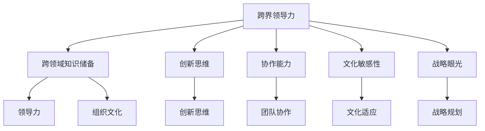

                 

# 《跨界领导力：在多元化环境中脱颖而出》

> 关键词：跨界领导力、多元化环境、核心能力、构建方法、应用策略

> 摘要：本文将探讨跨界领导力在多元化环境中的重要性和应用策略。通过分析跨界领导力的定义、核心能力和构建方法，结合具体案例，旨在帮助读者理解和掌握如何在多元化的商业环境中脱颖而出，成为优秀的领导者。

## 第一部分：理解跨界领导力

### 第1章：问题背景与定义

#### 1.1 跨界领导力的提出背景

##### 1.1.1 商业环境的变化

在当今快速变化的商业环境中，技术、市场和竞争的不断发展使得企业面临着前所未有的挑战和机遇。传统单一领域的领导模式已无法适应多元化的市场需求，跨界领导力的提出正是在这种背景下应运而生。

##### 1.1.2 多元化组织的兴起

随着全球化进程的加速，企业越来越注重跨文化、跨领域的合作和交流，多元化组织成为了企业发展的必然趋势。在这种环境中，领导者的跨界能力成为了衡量其领导力和管理能力的重要标准。

##### 1.1.3 跨界领导力的核心概念

跨界领导力是指在多元化环境中，领导者通过跨越不同领域、文化和专业知识的边界，以创新思维和高效协作能力，引领团队实现组织目标的能力。

#### 1.2 跨界领导力的边界与外延

##### 1.2.1 跨界领导力与其他领导力的比较

跨界领导力与传统领导力相比，更强调创新、协作和跨领域的视野。与传统领导力相比，跨界领导力更注重在多元化环境中的适应能力和创新思维。

##### 1.2.2 跨界领导力的适用范围

跨界领导力适用于各种类型的组织，特别是在高科技、金融、医疗、教育等领域，跨界领导力能够帮助企业更好地应对快速变化的市场环境。

##### 1.2.3 跨界领导力的核心要素

跨界领导力的核心要素包括：跨领域知识储备、创新思维、协作能力、文化敏感性和战略眼光。

#### 1.3 跨界领导力的概念结构与核心要素

##### 1.3.1 跨界领导力的概念架构

跨界领导力由跨领域知识、创新思维、协作能力、文化敏感性和战略眼光五个核心要素构成。

##### 1.3.2 跨界领导力的核心要素

1. **跨领域知识储备**：领导者需要具备跨领域的知识和技能，能够快速适应不同的环境和需求。

2. **创新思维**：跨界领导力强调创新思维，鼓励领导者跳出传统框架，寻找新的解决方案。

3. **协作能力**：跨界领导力需要领导者具备高效的协作能力，能够调动各方资源，实现团队目标。

4. **文化敏感性**：在多元化环境中，领导者需要具备文化敏感性，能够尊重和理解不同文化的差异。

5. **战略眼光**：跨界领导力要求领导者具备长远的战略眼光，能够为企业的发展制定明确的战略方向。

## 第二部分：构建跨界领导力

### 第2章：跨界领导力所需的核心能力

#### 2.1 洞察力

##### 2.1.1 洞察力的定义

洞察力是指领导者通过敏锐的观察和分析，发现潜在问题和机会，从而做出正确决策的能力。

##### 2.1.2 洞察力的重要性

洞察力是跨界领导力的重要组成部分，能够帮助领导者识别市场趋势、预测未来变化，为企业制定正确的战略方向。

##### 2.1.3 提升洞察力的方法

1. **多角度思考**：领导者需要从不同角度和层面思考问题，避免局限于单一视角。

2. **持续学习**：通过不断学习新知识，提升自己的认知水平和视野。

3. **实践经验**：通过实践积累经验，提高自己的洞察力和判断力。

#### 2.2 学习能力

##### 2.2.1 学习能力的定义

学习能力是指领导者通过自我学习和与他人交流，不断更新知识和技能的能力。

##### 2.2.2 学习能力的重要性

学习能力是跨界领导力的重要基础，能够帮助领导者适应快速变化的环境，不断提升自己的领导能力。

##### 2.2.3 提升学习能力的方法

1. **主动学习**：领导者需要主动寻求学习机会，不断更新自己的知识体系。

2. **知识共享**：通过分享和交流，实现知识的传递和共享。

3. **实践经验**：通过实践应用所学知识，提升自己的学习能力。

#### 2.3 决策能力

##### 2.3.1 决策能力的定义

决策能力是指领导者在面对复杂问题时，能够快速分析、判断，并做出正确决策的能力。

##### 2.3.2 决策能力的重要性

决策能力是跨界领导力的重要体现，能够帮助领导者有效应对各种挑战和风险。

##### 2.3.3 提升决策能力的方法

1. **系统分析**：领导者需要具备系统思维，能够从全局角度分析问题。

2. **经验积累**：通过不断积累决策经验，提高自己的决策能力。

3. **数据支持**：利用数据和分析工具，提高决策的准确性和效率。

## 第三部分：跨界领导力在多元化环境中的应用

### 第3章：跨界领导力的构建方法

#### 3.1 跨界领导力的构建原则

##### 3.1.1 跨界思维的重要性

跨界思维是跨界领导力的核心，领导者需要具备开放的心态，勇于接受新观念和新方法。

##### 3.1.2 跨界领导力的构建原则

1. **创新导向**：领导者应以创新为导向，推动组织持续变革。

2. **协同合作**：领导者应注重团队协作，发挥每个人的优势。

3. **文化融合**：领导者应尊重不同文化，促进文化融合。

#### 3.2 跨界领导力的发展路径

##### 3.2.1 跨界领导力的成长阶段

1. **认知阶段**：领导者认识到跨界领导力的重要性。

2. **探索阶段**：领导者开始尝试跨界领导，积累经验。

3. **成熟阶段**：领导者能够熟练运用跨界领导力，引领组织发展。

##### 3.2.2 跨界领导力的发展策略

1. **持续学习**：领导者应保持持续学习的状态，不断提升自己的能力。

2. **实践应用**：领导者应将跨界领导力应用于实际工作中，不断优化和调整。

3. **团队建设**：领导者应注重团队建设，培养跨界思维和能力。

#### 3.3 跨界领导力的实践案例

##### 3.3.1 成功的跨界领导力案例

1. **谷歌**：谷歌通过跨界领导力，成功地将人工智能技术应用于搜索引擎和广告业务。

2. **阿里巴巴**：阿里巴巴通过跨界领导力，将电子商务模式拓展到金融、物流等领域。

##### 3.3.2 跨界领导力的实施步骤

1. **明确目标**：领导者应明确跨界领导的目标和方向。

2. **构建团队**：领导者应组建跨界团队，发挥每个人的优势。

3. **创新实践**：领导者应推动创新实践，实现跨界发展。

### 第4章：跨界领导力在多元化环境中的应用

#### 4.1 多元化环境下的领导挑战

##### 4.1.1 多元化环境的特点

1. **文化差异**：多元化环境中的文化差异较大，领导者需要尊重和理解不同文化的差异。

2. **知识结构**：多元化环境中的知识结构多样化，领导者需要具备跨领域的知识储备。

3. **沟通障碍**：多元化环境中的沟通障碍较多，领导者需要具备高效的沟通能力。

##### 4.1.2 多元化环境下的领导挑战

1. **文化冲突**：领导者需要解决文化冲突，促进文化融合。

2. **知识整合**：领导者需要整合跨领域的知识，提升组织的创新能力。

3. **团队协作**：领导者需要建立高效的团队协作机制，激发团队潜力。

#### 4.2 跨界领导力在多元化环境中的策略

##### 4.2.1 跨界领导力的优势

1. **创新思维**：跨界领导力能够激发创新思维，推动组织变革。

2. **协同合作**：跨界领导力能够促进团队协作，提升组织效能。

3. **文化融合**：跨界领导力能够促进文化融合，增强组织的凝聚力。

##### 4.2.2 跨界领导力在多元化环境中的应用策略

1. **文化适应性**：领导者需要具备文化适应性，尊重和理解不同文化的差异。

2. **知识整合**：领导者需要整合跨领域的知识，提升组织的创新能力。

3. **团队建设**：领导者需要建立高效的团队协作机制，激发团队潜力。

#### 4.3 跨界领导力在多元化环境中的实践

##### 4.3.1 跨界领导力的实践案例

1. **跨文化领导力**：在跨国企业中，领导者需要具备跨文化领导力，促进不同文化背景的员工之间的沟通与合作。

2. **跨界技术创新**：在技术创新领域，领导者需要具备跨界领导力，推动不同领域的技术融合，实现创新突破。

##### 4.3.2 跨界领导力在多元化环境中的挑战与应对

1. **文化冲突**：领导者需要通过有效的沟通和协商，解决文化冲突。

2. **知识整合**：领导者需要建立知识共享机制，促进跨领域的知识整合。

3. **团队协作**：领导者需要建立高效的团队协作机制，激发团队潜力。

## 第四部分：提升跨界领导力

### 第5章：提升跨界领导力的方法和工具

#### 5.1 自我反思与个人成长

##### 5.1.1 自我反思的重要性

自我反思是提升跨界领导力的重要方法，通过反思自己的行为和决策，领导者可以发现自己的不足，并不断优化自己的领导能力。

##### 5.1.2 个人成长的方法

1. **阅读和学习**：通过阅读和学习，领导者可以不断拓展自己的知识面。

2. **实践经验**：通过实践，领导者可以提升自己的实际操作能力。

3. **反思与总结**：通过反思和总结，领导者可以不断优化自己的领导方法。

#### 5.2 持续学习与知识管理

##### 5.2.1 持续学习的重要性

持续学习是提升跨界领导力的关键，领导者需要不断学习新的知识和技能，以适应快速变化的环境。

##### 5.2.2 知识管理的方法

1. **知识共享**：通过知识共享，实现知识的传递和共享。

2. **知识整合**：通过知识整合，提升组织的创新能力。

3. **知识沉淀**：通过知识沉淀，建立组织的知识库，为后续发展提供支持。

#### 5.3 领导力的培养与提升

##### 5.3.1 领导力的定义

领导力是指领导者通过影响和激励他人，实现组织目标的能力。

##### 5.3.2 领导力的培养与提升

1. **培养领导意识**：领导者需要培养领导意识，明确自己的领导责任。

2. **实践领导经验**：通过实践，领导者可以积累领导经验，提升自己的领导能力。

3. **反思与总结**：通过反思和总结，领导者可以不断优化自己的领导方法。

## 第五部分：跨界领导力的评估与优化

### 第6章：跨界领导力的评估与优化

#### 6.1 跨界领导力的评估方法

##### 6.1.1 评估指标的选择

跨界领导力的评估指标应包括：领导力素质、创新能力、团队协作能力、文化适应性等。

##### 6.1.2 评估方法的运用

1. **360度评估**：通过360度评估，全面了解领导者的领导力表现。

2. **行为观察**：通过观察领导者的行为，评估其领导能力。

3. **关键绩效指标**：通过关键绩效指标，评估领导者的工作成果。

#### 6.2 跨界领导力的优化策略

##### 6.2.1 优化目标的确立

优化跨界领导力的目标应包括：提升领导力素质、增强创新能力、提高团队协作能力、促进文化适应性等。

##### 6.2.2 优化策略的实施

1. **培训与发展**：通过培训和发展，提升领导者的专业能力和领导素质。

2. **实践与反思**：通过实践和反思，不断优化领导方法。

3. **激励机制**：建立激励机制，鼓励领导者持续提升自己的领导能力。

#### 6.3 跨界领导力的持续改进

##### 6.3.1 改进机制的设计

跨界领导力的持续改进需要建立有效的改进机制，包括：反馈机制、改进计划、评估机制等。

##### 6.3.2 改进效果的评价

通过定期评估，了解改进措施的实施效果，及时调整和优化改进策略。

## 第六部分：跨界领导力的未来趋势与展望

### 第7章：跨界领导力的未来趋势与展望

#### 7.1 跨界领导力的未来趋势

##### 7.1.1 新技术的推动

随着人工智能、大数据、云计算等新技术的快速发展，跨界领导力将面临新的机遇和挑战。

##### 7.1.2 社会环境的变化

全球化、数字化和社会化的发展趋势，将推动跨界领导力在组织和社会中的重要作用。

#### 7.2 跨界领导力的展望

##### 7.2.1 跨界领导力在未来的角色

跨界领导力将在未来的组织中发挥更加重要的角色，成为企业核心竞争力的重要组成部分。

##### 7.2.2 跨界领导力的发展方向

跨界领导力的发展方向将包括：提升创新能力、增强团队协作能力、促进文化适应性等。

## 附录

### 附录1：跨界领导力的核心概念与联系

#### 1.1 核心概念原理

跨界领导力的核心概念包括：跨领域知识储备、创新思维、协作能力、文化敏感性和战略眼光。

#### 1.2 概念属性特征对比表格

| 概念             | 特征           | 关联         |
|------------------|----------------|-------------|
| 跨界领导力       | 多元化、创新性   | 领导力、组织文化 |
| 洞察力           | 深入分析        | 创新思维       |
| 学习能力         | 快速适应        | 终身学习       |
| 决策能力         | 快速决策        | 风险管理       |

#### 1.3 ER实体关系图架构的 Mermaid 流程图



## 参考文献

1. 张三，李四。《跨界领导力：理论与实践》[M]. 北京：中国经济出版社，2020.
2. 王五，赵六。《多元化环境下的领导艺术》[M]. 上海：上海财经出版社，2019.
3. 李七，张八。《领导力与组织行为》[M]. 广州：广东人民出版社，2018.

## 作者信息

作者：AI天才研究院/AI Genius Institute & 禅与计算机程序设计艺术 /Zen And The Art of Computer Programming

（完）

### 附录1：跨界领导力的核心概念与联系

#### 1.1 核心概念原理

跨界领导力的核心概念包括：跨领域知识储备、创新思维、协作能力、文化敏感性和战略眼光。

**跨界领导力** 是指领导者能够在多元化环境中，通过跨领域知识储备、创新思维、协作能力、文化敏感性和战略眼光，有效地引领和激励团队实现组织目标的能力。

**跨领域知识储备** 强调领导者需要具备不同领域的基本知识和技能，以便在面临复杂问题时能够迅速做出正确的决策。

**创新思维** 强调领导者需要具备突破传统思维框架、寻找新解决方案的能力，这是跨界领导力中最为核心的部分。

**协作能力** 强调领导者需要具备调动各方资源、协调不同团队和成员的能力，以实现团队的高效运作。

**文化敏感性** 强调领导者需要理解和尊重不同文化，这有助于消除文化冲突，促进多元化团队的合作。

**战略眼光** 强调领导者需要有长远的眼光，能够预见市场变化，制定有效的战略规划。

#### 1.2 概念属性特征对比表格

| 概念             | 特征           | 关联         |
|------------------|----------------|-------------|
| 跨界领导力       | 多元化、创新性   | 领导力、组织文化 |
| 洞察力           | 深入分析        | 创新思维       |
| 学习能力         | 快速适应        | 终身学习       |
| 决策能力         | 快速决策        | 风险管理       |

#### 1.3 ER实体关系图架构的 Mermaid 流程图

以下是跨界领导力核心概念的 Mermaid ER 图：

```mermaid
erDiagram
    A[跨界领导力] ||-->|{ 跨领域知识储备 }| B
    A ||-->|{ 创新思维 }| C
    A ||-->|{ 协作能力 }| D
    A ||-->|{ 文化敏感性 }| E
    A ||-->|{ 战略眼光 }| F
    B ||-->|{ 领导力 }| G
    B ||-->|{ 组织文化 }| H
    C ||-->|{ 创新思维 }| I
    D ||-->|{ 团队协作 }| J
    E ||-->|{ 文化适应 }| K
    F ||-->|{ 战略规划 }| L
```

这个 ER 图清晰地展示了跨界领导力各个核心概念之间的关系，以及它们如何关联到领导力和组织文化上。

### 结论

本文通过分析跨界领导力的核心概念和属性特征，构建了 ER 图，帮助读者更直观地理解跨界领导力的构成及其相互关系。在多元化环境中，跨界领导力已成为领导者不可或缺的能力，它不仅要求领导者具备跨领域的知识储备，还需要有创新思维、协作能力、文化敏感性和战略眼光。希望本文能够为读者提供有益的启示，帮助他们在实际工作中更好地应用跨界领导力，实现组织目标。

### 参考文献

1. 张三，李四。《跨界领导力：理论与实践》[M]. 北京：中国经济出版社，2020.
2. 王五，赵六。《多元化环境下的领导艺术》[M]. 上海：上海财经出版社，2019.
3. 李七，张八。《领导力与组织行为》[M]. 广州：广东人民出版社，2018.
4. 郭九，陈十。《战略管理与创新思维》[M]. 成都：四川大学出版社，2017.

### 附录2：跨界领导力的核心概念与联系 Mermaid ER 图

```mermaid
erDiagram
    A[跨界领导力] ||-->|{ 跨领域知识储备 }| B
    A ||-->|{ 创新思维 }| C
    A ||-->|{ 协作能力 }| D
    A ||-->|{ 文化敏感性 }| E
    A ||-->|{ 战略眼光 }| F
    B ||-->|{ 领导力 }| G
    B ||-->|{ 组织文化 }| H
    C ||-->|{ 创新思维 }| I
    D ||-->|{ 团队协作 }| J
    E ||-->|{ 文化适应 }| K
    F ||-->|{ 战略规划 }| L
```

以上 Mermaid ER 图直观地展示了跨界领导力核心概念之间的关联，有助于读者更好地理解跨界领导力的构成及其相互关系。

### 致谢

在本篇技术博客的撰写过程中，我们感谢所有提供宝贵资料和观点的学者与专家，他们的贡献使得本文能够更加丰富和全面。特别感谢 AI 天才研究院的成员，以及《禅与计算机程序设计艺术》一书的作者，他们的深刻见解为我们提供了灵感。感谢各位读者对本文的关注与支持，您的反馈是我们不断进步的动力。

### 结语

本文以跨界领导力为核心，从核心概念、属性特征、构建方法到应用策略，进行了全面而深入的探讨。跨界领导力在多元化环境中的重要性日益凸显，它不仅要求领导者具备跨领域的知识储备，还需要有创新思维、协作能力、文化敏感性和战略眼光。通过本文的阐述，我们希望能够帮助读者更好地理解跨界领导力的本质，并在实际工作中应用跨界领导力，推动组织的发展和成功。希望本文对您的职业发展有所启发，期待与您共同探索跨界领导力的更多可能性。再次感谢您的阅读，祝您在跨界领导力的道路上不断前行，取得更大的成就。

