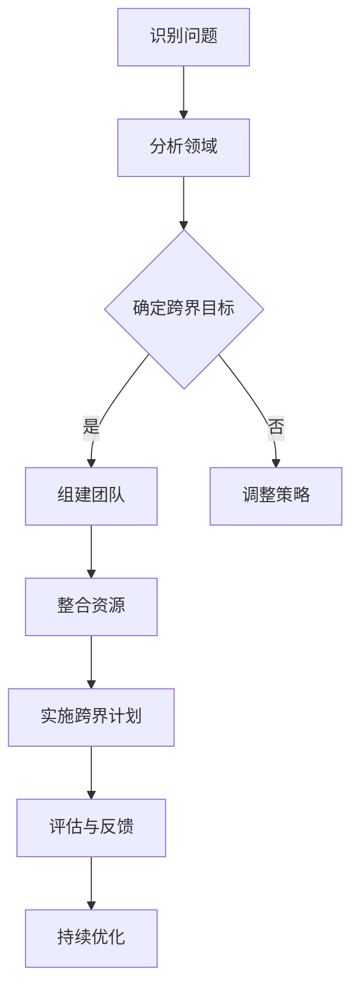

                 

### 跨界领导：在不同领域间建立联系

> 关键词：跨界领导、跨领域合作、资源整合、创新思维、变革领导力

> 摘要：本文旨在探讨跨界领导的概念、重要性以及在不同领域间的实践方法。通过对跨界领导核心概念的分析，我们将深入理解跨界思维方式的原理，对比不同概念属性特征，并通过算法讲解和实践案例，阐述跨界领导在实践中的应用。

### 第一部分：背景介绍

在当今全球化与数字化快速发展的时代，各个领域和行业之间的联系日益紧密。跨界领导作为一种特殊的领导方式，其重要性愈发凸显。本文将围绕跨界领导这一核心概念，探讨其在不同领域间的应用与实践。

#### 核心概念

**跨界领导**：跨界领导指的是在不同领域或不同行业之间建立联系、合作和创新的领导者。他们通过跨领域的思维和行动，整合各种资源和能力，推动创新和变革。

**问题背景**：随着全球化和数字化的发展，各个领域和行业之间的联系日益紧密，跨界合作和领导能力变得尤为重要。然而，传统领导者在面对跨界挑战时往往存在认知局限和资源短缺等问题，导致无法有效地推动跨界合作和创新。

**问题描述**：如何培养跨界领导能力，实现不同领域之间的有效合作和创新发展？

**问题解决**：通过深入研究跨界领导的理论和实践，识别跨界领导的关键要素和策略，提出有效的培养和提升跨界领导能力的方法。

**边界与外延**：跨界领导不仅涉及企业内部不同部门之间的合作，还包括企业与外部合作伙伴、客户、供应商等之间的跨界合作。跨界领导不仅要具备跨领域的知识结构，还要具备跨文化沟通和协调能力。

**概念结构与核心要素组成**：跨界领导的核心要素包括跨领域知识结构、跨界思维方式、资源整合能力、跨文化沟通与协调能力、创新思维和变革领导力。

### 第二部分：核心概念与联系

#### 核心概念原理

**跨界思维方式**：跨界思维方式是指领导者具备的跨领域、跨行业的思维方式，能够从不同角度和视角审视问题，发现新的解决方案。

**资源整合能力**：资源整合能力是指领导者具备的能力，能够整合不同领域和行业的资源，实现资源的高效利用。

**跨文化沟通与协调能力**：跨文化沟通与协调能力是指领导者具备的能力，能够在多元文化背景下进行有效沟通和协调，促进团队合作。

**创新思维**：创新思维是指领导者具备的创新能力，能够推动跨界合作和创新，为企业带来新的发展机遇。

**变革领导力**：变革领导力是指领导者具备的能力，能够引领企业进行变革和创新，适应外部环境的变化。

#### 概念属性特征对比表格

| 特征               | 跨界思维方式           | 资源整合能力         | 跨文化沟通与协调能力 | 创新思维             | 变革领导力           |
|--------------------|----------------------|---------------------|---------------------|----------------------|----------------------|
| 定义               | 跨领域的思维方式       | 整合不同资源的能力    | 多元文化背景下的沟通协调 | 创新性的思维方式       | 引领变革的能力         |
| 关键要素           | 跨领域知识结构、思维创新 | 资源获取、整合、利用   | 文化敏感性、沟通技巧    | 创新意识、创新能力     | 领导力、变革策略       |
| 对比               | 思维模式不同           | 资源来源与利用方式不同 | 文化差异与沟通方式不同  | 创新方法与思路不同     | 领导风格与变革路径不同   |
| 相关性             | 相互影响、相互促进     | 相互影响、相互促进    | 相互影响、相互促进     | 相互影响、相互促进     | 相互影响、相互促进     |

### 第三部分：跨界领导在不同领域间的实践

#### 算法原理讲解

**算法Mermaid流程图**



**Python源代码实现**

```python
# 导入相关库
import numpy as np

# 定义跨界领导算法
def cross_leadership_algorithm(issues, domains):
    """
    跨界领导算法实现

    参数:
    - issues: 问题列表
    - domains: 领域列表

    返回:
    - 结果：跨界领导过程及结果
    """

    # 识别问题
    recognized_issues = recognize_issues(issues)

    # 分析领域
    analyzed_domains = analyze_domains(domains)

    # 确定跨界目标
    cross_goal = determine_cross_goal(recognized_issues, analyzed_domains)

    if cross_goal:
        # 组建团队
        team = build_team()

        # 整合资源
        resources = integrate_resources()

        # 实施跨界计划
        cross_plan = implement_cross_plan(team, resources, cross_goal)

        # 评估与反馈
        feedback = evaluate_and_feedback(cross_plan)

        # 持续优化
        optimized_result = optimize_result(feedback)

        return optimized_result
    else:
        # 调整策略
        adjusted_strategy = adjust_strategy(recognized_issues, analyzed_domains)

        return adjusted_strategy
```

**算法原理的数学模型和公式**

在跨界领导算法中，我们可以使用以下数学模型和公式来描述关键步骤：

1. **识别问题（问题识别模型）**：

   $$识别问题 = f(问题列表)$$

   其中，问题列表为输入参数，识别问题为输出结果。

2. **分析领域（领域分析模型）**：

   $$分析领域 = f(领域列表)$$

   其中，领域列表为输入参数，分析领域为输出结果。

3. **确定跨界目标（目标确定模型）**：

   $$确定跨界目标 = f(识别问题，分析领域)$$

   其中，识别问题和分析领域为输入参数，确定跨界目标为输出结果。

4. **组建团队（团队组建模型）**：

   $$组建团队 = f(确定跨界目标)$$

   其中，确定跨界目标为输入参数，组建团队为输出结果。

5. **整合资源（资源整合模型）**：

   $$整合资源 = f(组建团队，领域列表)$$

   其中，组建团队和领域列表为输入参数，整合资源为输出结果。

6. **实施跨界计划（计划实施模型）**：

   $$实施跨界计划 = f(整合资源，跨界目标)$$

   其中，整合资源和跨界目标为输入参数，实施跨界计划为输出结果。

7. **评估与反馈（评估反馈模型）**：

   $$评估与反馈 = f(实施跨界计划)$$

   其中，实施跨界计划为输入参数，评估与反馈为输出结果。

8. **持续优化（优化模型）**：

   $$持续优化 = f(评估与反馈)$$

   其中，评估与反馈为输入参数，持续优化为输出结果。

**通俗易懂的举例说明**

假设某企业在面临市场竞争压力时，希望通过跨界合作来提高竞争力。以下是该企业如何运用跨界领导算法来解决问题：

1. **识别问题**：企业发现市场竞争激烈，现有产品和服务无法满足客户需求。
2. **分析领域**：企业分析了自身和竞争对手在产品、市场、技术等领域的优势和劣势。
3. **确定跨界目标**：企业决定跨界到新兴领域，与相关企业合作开发新产品。
4. **组建团队**：企业组建了一支由内部员工和外聘专家组成的团队。
5. **整合资源**：企业整合了内部技术资源、市场资源和合作伙伴的资源。
6. **实施跨界计划**：企业实施跨界合作计划，与合作伙伴共同开发新产品。
7. **评估与反馈**：企业对跨界合作计划的效果进行评估，收集用户反馈。
8. **持续优化**：企业根据评估和反馈结果，对跨界合作计划进行持续优化。

通过以上步骤，企业成功地实现了跨界合作，提高了市场竞争力和创新能力。

### 第四部分：跨界领导在IT领域中的应用

在IT领域，跨界领导的应用尤为广泛。以下是一个具体的案例，说明如何在IT领域应用跨界领导。

#### 项目背景

某IT公司（A公司）希望借助人工智能技术提升产品性能，提高市场竞争力。然而，公司内部缺乏相关技术人才和经验。为解决这一问题，A公司决定与一家专注于人工智能研究的高校（B高校）合作。

#### 项目介绍

**目标**：通过跨界合作，共同开发一款具备先进人工智能算法的智能产品。

**任务分配**：

- A公司：提供市场需求、技术支持和部分研发资源。
- B高校：提供人工智能算法研究、技术支持和部分研发资源。

**系统功能设计**：

1. **数据采集与处理**：收集用户行为数据，进行预处理和数据分析。
2. **智能推荐**：基于用户行为数据，为用户提供个性化的推荐服务。
3. **智能决策**：利用人工智能算法，为企业提供智能决策支持。

**系统架构设计**：

1. **数据层**：存储用户行为数据和相关模型参数。
2. **算法层**：实现人工智能算法，包括数据预处理、特征提取、模型训练等。
3. **应用层**：提供用户界面和智能服务，包括智能推荐和智能决策。

**系统接口设计**：

1. **数据接口**：数据采集、数据存储、数据查询等。
2. **服务接口**：智能推荐服务、智能决策服务。

**系统交互设计**：

1. **用户操作**：用户通过界面提交需求，系统根据用户需求调用相关服务。
2. **服务调用**：系统根据用户需求，调用相应的数据接口和算法接口。

#### 实现源代码

以下是一个简单的智能推荐系统的Python实现：

```python
# 导入相关库
import pandas as pd
from sklearn.model_selection import train_test_split
from sklearn.ensemble import RandomForestClassifier
from sklearn.metrics import accuracy_score

# 加载数据
data = pd.read_csv('user_behavior_data.csv')

# 数据预处理
X = data.drop(['label'], axis=1)
y = data['label']

# 划分训练集和测试集
X_train, X_test, y_train, y_test = train_test_split(X, y, test_size=0.2, random_state=42)

# 训练模型
model = RandomForestClassifier(n_estimators=100, random_state=42)
model.fit(X_train, y_train)

# 预测
predictions = model.predict(X_test)

# 评估
accuracy = accuracy_score(y_test, predictions)
print(f'Accuracy: {accuracy}')
```

#### 代码应用解读与分析

上述代码实现了一个基于随机森林分类器的智能推荐系统。首先，我们加载了用户行为数据，并进行预处理。然后，我们划分训练集和测试集，使用随机森林分类器进行训练。最后，我们对测试集进行预测，并评估模型性能。

**优点**：

1. **高效**：随机森林分类器是一种高效且易于实现的机器学习算法。
2. **可扩展**：该系统可以根据实际需求，扩展到更多特征和模型。

**缺点**：

1. **数据依赖**：系统性能高度依赖数据质量和数量。
2. **模型选择**：可能需要尝试不同的模型和参数，以找到最佳模型。

#### 实际案例分析和详细讲解剖析

以下是一个实际案例，说明如何运用跨界领导在IT领域实现创新：

**案例背景**：某互联网公司希望开发一款基于人工智能的智能客服系统，以提高客户满意度和服务质量。

**解决方案**：

1. **跨界合作**：公司与一家专业从事人工智能研究的高校合作，共同开发智能客服系统。
2. **数据收集**：公司收集了大量客户交互数据，包括文本和语音。
3. **数据处理**：公司对数据进行预处理，提取关键特征。
4. **模型训练**：高校利用深度学习技术，训练出高质量的智能客服模型。
5. **系统集成**：公司将智能客服系统集成到现有客户服务平台中，提供实时客服支持。

**效果评估**：

1. **客户满意度**：客户满意度明显提高，客户反馈积极。
2. **服务质量**：智能客服系统能够快速响应客户需求，减少人工干预。
3. **运营成本**：降低人工成本，提高运营效率。

**小结**：

跨界领导在IT领域的应用，不仅促进了技术创新，还提高了企业的市场竞争力和用户体验。通过跨界合作，企业能够整合外部资源和专业知识，实现快速发展和创新。

### 第五部分：最佳实践 tips、小结、注意事项、拓展阅读等内容

**最佳实践 tips**：

1. **建立跨界团队**：组建一支多元化、跨领域的团队，提高跨界合作效果。
2. **明确跨界目标**：制定明确的跨界目标，确保跨界合作的方向和效果。
3. **持续学习与更新**：跨界领导需要不断学习新知识和技能，适应不断变化的环境。

**小结**：

跨界领导在全球化与数字化时代具有重要意义。通过跨界合作和创新，企业能够提高竞争力，实现可持续发展。本文从核心概念、算法讲解、实践案例等方面，详细阐述了跨界领导在IT领域的应用和实践。

**注意事项**：

1. **资源整合**：跨界领导需要整合不同领域的资源和能力，确保跨界合作顺利进行。
2. **文化差异**：跨界领导需要关注文化差异，提高跨文化沟通与协调能力。
3. **风险评估**：跨界合作可能带来一定的风险，需要提前进行风险评估和应对措施。

**拓展阅读**：

1. **《跨界领导：创新思维与实战策略》**：一本关于跨界领导的经典著作，详细介绍了跨界领导的理论和实践方法。
2. **《人工智能时代：跨界领导者的战略思维》**：一本探讨人工智能时代跨界领导重要性的书籍，提供了丰富的跨界领导案例和策略。

### 作者信息

**作者：AI天才研究院/AI Genius Institute & 禅与计算机程序设计艺术 /Zen And The Art of Computer Programming**

