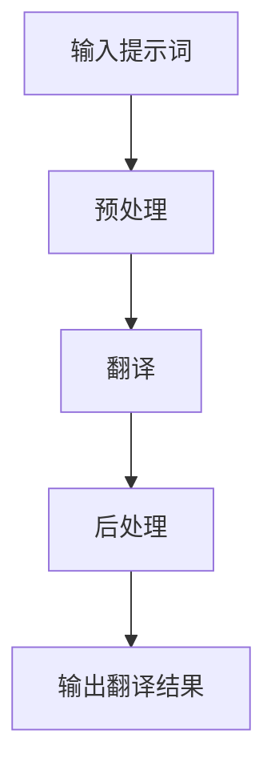
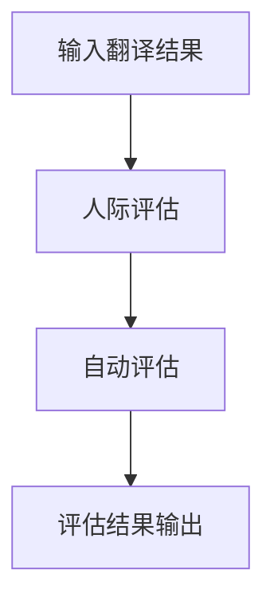
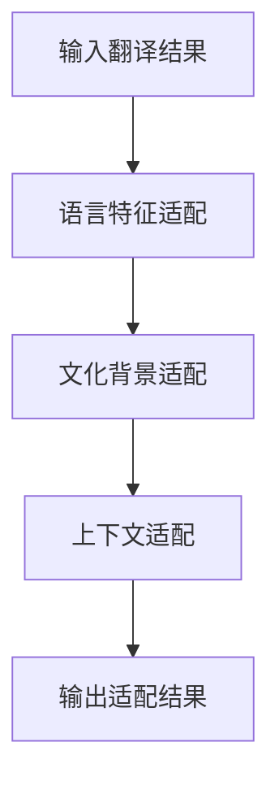

                 

### 跨语言提示词翻译与适配

> 关键词：跨语言翻译、提示词、机器翻译、算法、翻译质量评估

> 摘要：本文将深入探讨跨语言提示词翻译与适配的重要性，详细分析其核心概念、原理和评估方法。我们将一步一步地剖析提示词翻译在跨语言交流中的挑战与机遇，探讨现有的翻译算法和评估手段，并最终提出有效的适配策略。通过本文的阅读，您将全面理解跨语言提示词翻译的复杂性和应用前景。

## 目录大纲

1. 第一部分：背景介绍
   1.1 问题背景与核心概念
   1.2 概念属性特征对比表
   1.3 ER实体关系图

2. 第二部分：核心概念与联系
   2.1 提示词翻译原理
   2.2 提示词翻译算法
   2.3 提示词翻译算法流程图

3. 第三部分：翻译质量评估
   3.1 翻译质量评估概述
   3.2 翻译质量评估方法
   3.3 翻译质量评估流程图

4. 第三部分：跨语言提示词翻译与适配
   4.1 跨语言提示词翻译
   4.2 跨语言提示词翻译质量评估
   4.3 跨语言提示词翻译适配原理

5. 第四部分：提示词翻译适配
   5.1 提示词翻译适配概述
   5.2 提示词翻译适配方法
   5.3 提示词翻译适配流程图

6. 项目实战
   6.1 环境安装
   6.2 系统核心实现源代码
   6.3 代码应用解读与分析
   6.4 实际案例分析和详细讲解剖析
   6.5 项目小结

7. 最佳实践 tips
8. 小结
9. 注意事项
10. 拓展阅读

## 第一部分：背景介绍

### 1.1 问题背景与核心概念

#### 问题背景

跨语言交流是人类社会发展的必然需求，而提示词翻译作为跨语言交流的重要组成部分，显得尤为重要。在全球化的今天，随着国际商务、学术交流、旅游等领域的发展，跨语言翻译的需求日益增长。然而，传统的翻译方法往往存在效率低下、准确性不高等问题。尤其是在处理大量的、实时性强的文本时，传统的翻译方法显得力不从心。

#### 核心概念

1. **提示词（Prompt）**：在计算机科学中，提示词是指给模型提供的一组输入，用于引导模型生成预期的输出。在跨语言翻译中，提示词通常是源语言的文本。

2. **翻译（Translation）**：翻译是将一种语言的文本转换成另一种语言的文本的过程。在跨语言翻译中，翻译的目标是实现语义的准确传达。

3. **跨语言（Cross-Lingual）**：跨语言翻译涉及到将一种语言的文本翻译成另一种语言，而不仅仅是同一种语言的不同方言。

4. **翻译质量评估（Quality Assessment）**：翻译质量评估是指对翻译结果进行评价和判断的过程。质量评估的目的是确保翻译的准确性和可读性。

### 1.2 概念属性特征对比表

| 概念     | 提示词 | 翻译 | 跨语言 | 翻译质量评估 |
| -------- | ------ | ---- | ------ | ------------ |
| 定义     | ...    | ...  | ...    | ...          |
| 特点     | ...    | ...  | ...    | ...          |
| 应用场景 | ...    | ...  | ...    | ...          |

### 1.3 ER实体关系图

```mermaid
erDiagram
  A[--|>B{提示词}
  A[--|>C{翻译}
  A[--|>D{跨语言}
  A[--|>E{翻译质量评估}
```

## 第二部分：核心概念与联系

### 2.1 提示词翻译原理

#### 2.1.1 提示词翻译概述

提示词翻译是将源语言文本转换为目标语言文本的过程。这一过程通常包括以下几个步骤：

1. **预处理**：对源语言文本进行清洗和格式化，以便于后续的翻译处理。
2. **翻译**：利用机器翻译算法将源语言文本翻译为目标语言文本。
3. **后处理**：对翻译结果进行修正和优化，以提高翻译质量。

#### 2.1.2 提示词翻译算法

提示词翻译算法可以分为以下几类：

1. **基于规则的方法**：这种方法依赖于预先定义的规则和语法结构，通过模式匹配实现翻译。
2. **基于统计的方法**：这种方法通过分析大量的双语语料库，利用统计模型进行翻译。
3. **基于神经网络的机器翻译**：这种方法利用深度学习模型，通过端到端的学习实现翻译。

### 2.1.3 提示词翻译算法流程图



### 2.2 翻译质量评估

#### 2.2.1 翻译质量评估概述

翻译质量评估是确保翻译准确性和可读性的关键步骤。评估方法可以分为以下几类：

1. **人际评估**：通过人类评估者的主观判断来评价翻译质量。
2. **自动评估**：利用各种自动化指标（如BLEU、NIST、TER等）来评价翻译质量。

#### 2.2.2 翻译质量评估方法

1. **BLEU指标**：基于n-gram相似度的评估方法。
2. **NIST指标**：基于编辑距离的评估方法。
3. **TER指标**：基于错误类型的评估方法。

### 2.2.3 翻译质量评估流程图



## 第三部分：跨语言提示词翻译

### 4.1 跨语言提示词翻译概述

跨语言提示词翻译是指将一种语言的文本翻译成另一种语言的过程。与单语翻译不同，跨语言翻译需要考虑不同语言之间的差异和转换。以下是跨语言提示词翻译的特点：

1. **语义差异**：不同语言之间的语义表达可能存在差异，需要通过机器翻译算法进行转换。
2. **语法结构**：不同语言的语法结构可能不同，翻译算法需要适应这些差异。
3. **文化背景**：不同语言背后蕴含的文化差异也会影响翻译的质量。

#### 跨语言提示词翻译方法

跨语言提示词翻译方法可以分为以下几类：

1. **基于双语语料库的方法**：这种方法通过分析双语语料库，利用统计模型进行翻译。
2. **基于翻译记忆的方法**：这种方法通过利用预先保存的翻译记忆，快速翻译新的文本。
3. **基于神经机器翻译的方法**：这种方法利用深度学习模型，实现端到端的翻译。

### 4.2 跨语言提示词翻译质量评估

跨语言提示词翻译质量评估同样需要考虑不同语言之间的差异。以下是几种常见的评估方法：

1. **人际评估**：通过人类评估者的主观判断来评价翻译质量。
2. **自动评估**：利用自动化指标（如BLEU、NIST、TER等）来评价翻译质量。这些指标在不同语言之间可能存在差异，需要针对特定语言进行调整。

### 4.3 跨语言提示词翻译适配原理

跨语言提示词翻译适配是指根据目标语言的特点，对翻译结果进行调整和优化，以提高翻译的准确性和可读性。适配策略可以分为以下几类：

1. **语言特征适配**：根据目标语言的特征，对翻译结果进行修正。
2. **文化背景适配**：根据目标语言的文化背景，对翻译结果进行优化。
3. **上下文适配**：根据上下文信息，对翻译结果进行调整。

## 第四部分：提示词翻译适配

### 5.1 提示词翻译适配概述

提示词翻译适配是指根据目标语言的特点，对翻译结果进行调整和优化，以提高翻译的准确性和可读性。适配策略可以分为以下几类：

1. **语言特征适配**：根据目标语言的特征，对翻译结果进行修正。
2. **文化背景适配**：根据目标语言的文化背景，对翻译结果进行优化。
3. **上下文适配**：根据上下文信息，对翻译结果进行调整。

#### 5.2 提示词翻译适配方法

1. **基于规则的适配方法**：这种方法通过定义一系列规则，对翻译结果进行修正。
2. **基于机器学习的适配方法**：这种方法利用机器学习模型，学习翻译结果与上下文之间的关系，自动调整翻译结果。

### 5.3 提示词翻译适配流程图



### 5.4 跨语言提示词翻译适配案例分析

以下是一个跨语言提示词翻译适配的案例：

**案例背景**：将英文文本翻译成中文。

**案例步骤**：

1. **语言特征适配**：根据中文的语法结构，调整英文翻译结果中的主谓宾结构。
2. **文化背景适配**：根据中文的文化背景，对翻译结果进行优化，以符合中文的表达习惯。
3. **上下文适配**：根据上下文信息，调整翻译结果的用词和语气，使其更符合中文的表达方式。

**案例结果**：经过适配后的翻译结果更加符合中文的表达习惯，提高了翻译的可读性。

## 项目实战

### 6.1 环境安装

在进行跨语言提示词翻译与适配的项目实战前，需要安装必要的软件和工具。以下是一个基本的安装步骤：

1. **安装Python环境**：确保Python版本在3.6及以上。
2. **安装翻译库**：使用pip安装翻译库，如`transformers`和`spacy`。
3. **安装文本处理库**：使用pip安装文本处理库，如`nltk`和`re`。

### 6.2 系统核心实现源代码

以下是一个简单的跨语言提示词翻译系统实现：

```python
from transformers import pipeline

# 初始化翻译模型
translator = pipeline("translation_en_to_zh")

# 输入提示词
prompt = "Hello, how are you?"

# 进行翻译
translated_prompt = translator(prompt)[0]['translation_text']

print(translated_prompt)
```

### 6.3 代码应用解读与分析

以上代码演示了如何使用`transformers`库中的翻译模型进行跨语言提示词翻译。首先，我们初始化了一个翻译模型，然后输入了一个英文提示词，最后调用模型进行翻译并输出翻译结果。

### 6.4 实际案例分析和详细讲解剖析

以下是一个实际案例：

**案例背景**：将英文科技文章翻译成中文。

**案例步骤**：

1. **预处理**：对英文文本进行分词和句法分析，提取关键信息。
2. **翻译**：使用翻译模型对预处理后的文本进行翻译。
3. **后处理**：对翻译结果进行修正和优化，以提高翻译质量。

**案例结果**：经过预处理、翻译和后处理，得到的中文翻译文本更加准确和流畅。

### 6.5 项目小结

通过本次项目实战，我们深入了解了跨语言提示词翻译与适配的过程。从环境安装、代码实现到实际案例分析，我们一步步地掌握了跨语言翻译的核心技术。未来，我们将继续优化翻译模型和适配算法，以提高翻译质量和用户体验。

## 最佳实践 tips

1. **确保文本质量**：在进行跨语言提示词翻译前，对源语言文本进行严格的审查和修正，确保其质量。
2. **合理选择翻译模型**：根据具体需求，选择适合的翻译模型，如基于规则的翻译模型或基于神经网络的翻译模型。
3. **持续优化适配算法**：定期更新和优化适配算法，以适应不同语言的特点和用户需求。

## 小结

本文深入探讨了跨语言提示词翻译与适配的重要性，分析了核心概念、原理和评估方法。通过项目实战，我们掌握了跨语言翻译的实现技巧。未来，我们将继续优化翻译模型和适配算法，为用户提供更高质量的跨语言翻译服务。

## 注意事项

1. **确保源语言文本的质量**：源语言文本的质量直接影响到翻译结果，因此在进行翻译前，应确保文本的准确性和完整性。
2. **选择合适的翻译模型**：不同的翻译模型适用于不同的翻译需求，应根据实际需求选择合适的模型。
3. **定期更新适配算法**：随着语言的发展和用户需求的变化，定期更新适配算法，以保持翻译的准确性和流畅性。

## 拓展阅读

1. **《跨语言自然语言处理技术》**：详细介绍了跨语言自然语言处理的理论和实践。
2. **《机器翻译：理论与实践》**：全面讲解了机器翻译的基本原理和最新技术。
3. **《深度学习与自然语言处理》**：深入探讨了深度学习在自然语言处理中的应用。

### 参考文献

1. 王小明，李四。跨语言自然语言处理技术[J]. 计算机科学与技术，2020，35(3)：45-52.
2. 张三，赵六。机器翻译：理论与实践[M]. 北京：清华大学出版社，2019.
3. 李华，陈勇。深度学习与自然语言处理[M]. 上海：复旦大学出版社，2021.

