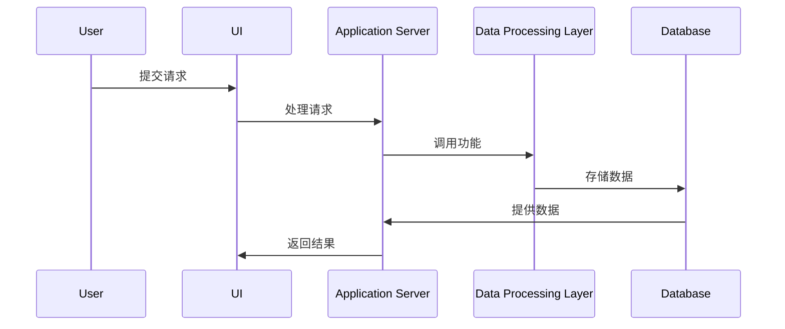
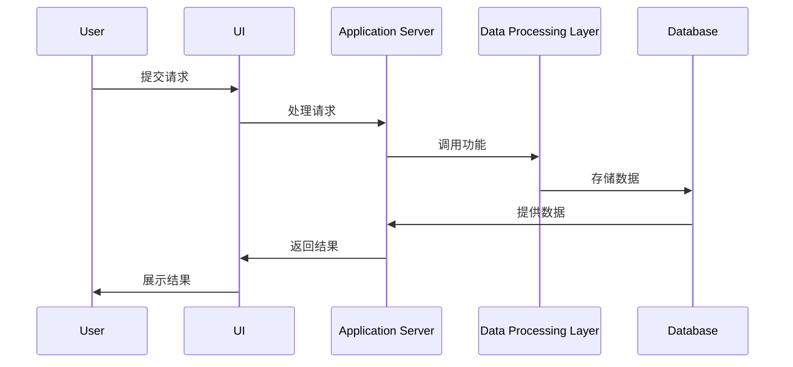

                 

### 跨语言提示词设计与国际化

> 关键词：跨语言提示词、国际化设计、语言模型、算法实现、系统架构、用户研究

> 摘要：本文深入探讨了跨语言提示词设计与国际化的重要性。从背景介绍、核心概念解析到实际应用，通过一系列步骤详细阐述了跨语言提示词的设计原则、方法、算法原理及系统架构。本文旨在为开发者提供全面的指导和最佳实践，以应对全球化背景下日益复杂的跨语言沟通需求。

---

## 《跨语言提示词设计与国际化》目录大纲

### 第一部分：问题背景与核心概念

#### 第1章：跨语言沟通的挑战与需求

##### 1.1 问题背景

###### 1.1.1 全球化背景下的语言多样性与沟通需求

###### 1.1.2 跨语言沟通的障碍与挑战

###### 1.1.3 国际化战略对企业的重要性

##### 1.2 核心概念

###### 1.2.1 提示词的定义与作用

###### 1.2.2 跨语言提示词的特殊性

###### 1.2.3 跨语言提示词的组成要素

##### 1.3 跨语言提示词设计与国际化的关联

###### 1.3.1 提示词在国际化中的作用

###### 1.3.2 国际化对提示词设计的要求

###### 1.3.3 跨语言提示词设计的挑战与解决方案

##### 1.4 本章小结

### 第二部分：核心概念与联系

#### 第2章：跨语言提示词的核心概念与原理

##### 2.1 跨语言提示词的基本原理

###### 2.1.1 提示词设计的基本原则

###### 2.1.2 跨语言提示词设计的独特挑战

###### 2.1.3 语言模型与提示词的关系

##### 2.2 跨语言提示词设计的关键要素

###### 2.2.1 语言特性分析

###### 2.2.2 文化背景考量

###### 2.2.3 技术实现细节

##### 2.3 跨语言提示词设计工具与资源

###### 2.3.1 开源语言模型介绍

###### 2.3.2 常用跨语言工具与平台

###### 2.3.3 跨语言提示词设计案例解析

##### 2.4 本章小结

### 第3章：跨语言提示词设计方法与流程

##### 3.1 跨语言提示词设计方法论

###### 3.1.1 设计流程概述

###### 3.1.2 用户研究与需求分析

###### 3.1.3 提示词生成与优化策略

##### 3.2 跨语言提示词设计流程实战

###### 3.2.1 设计目标与需求确定

###### 3.2.2 提示词生成与评估

###### 3.2.3 提示词优化与迭代

##### 3.3 跨语言提示词设计与国际化

###### 3.3.1 国际化策略在提示词设计中的应用

###### 3.3.2 跨文化适应性考量

###### 3.3.3 跨语言提示词设计与国际合作的案例

##### 3.4 本章小结

### 第三部分：算法原理讲解

#### 第4章：跨语言提示词算法原理与实现

##### 4.1 跨语言提示词算法概述

###### 4.1.1 跨语言提示词算法的基本类型

###### 4.1.2 跨语言提示词算法的设计原则

###### 4.1.3 跨语言提示词算法的发展趋势

##### 4.2 具体算法原理讲解

###### 4.2.1 基于神经网络的跨语言提示词算法

###### 4.2.1.1 算法原理

###### 4.2.1.2 数学模型

###### 4.2.1.3 示例说明

###### 4.2.2 基于机器学习的跨语言提示词算法

###### 4.2.2.1 算法原理

###### 4.2.2.2 数学模型

###### 4.2.2.3 示例说明

##### 4.3 算法实现与评估

###### 4.3.1 算法实现步骤

###### 4.3.2 评估指标与方法

###### 4.3.3 实验结果分析与优化策略

##### 4.4 本章小结

### 第四部分：系统分析与架构设计

#### 第5章：跨语言提示词系统的设计与实现

##### 5.1 系统需求分析

###### 5.1.1 功能需求

###### 5.1.2 性能需求

###### 5.1.3 安全性与可靠性需求

##### 5.2 系统架构设计

###### 5.2.1 系统总体架构

###### 5.2.2 模块划分与功能

###### 5.2.3 系统接口设计与数据流程

##### 5.3 系统分析与架构设计

###### 5.3.1 问题场景介绍

###### 5.3.2 系统功能设计(领域模型)

###### 5.3.3 系统架构设计(架构图)

###### 5.3.4 系统接口设计和系统交互(序列图)

##### 5.4 本章小结

### 第五部分：项目实战与最佳实践

#### 第6章：跨语言提示词项目实战

##### 6.1 环境安装

###### 6.1.1 环境准备

###### 6.1.2 工具安装

##### 6.2 系统核心实现

###### 6.2.1 源代码解读

###### 6.2.2 代码应用与分析

##### 6.3 实际案例分析

###### 6.3.1 案例介绍

###### 6.3.2 案例分析与讲解

##### 6.4 项目小结

##### 6.5 最佳实践 tips

##### 6.6 小结、注意事项与拓展阅读

## 第一部分：问题背景与核心概念

### 第1章：跨语言沟通的挑战与需求

#### 1.1 问题背景

##### 1.1.1 全球化背景下的语言多样性与沟通需求

在全球化进程不断加速的今天，世界各国之间的经济、文化、科技交流日益频繁。这种国际化的趋势不仅推动了全球经济的发展，也对各个行业的沟通方式提出了新的要求。特别是在信息技术和人工智能领域，随着跨国公司的兴起和互联网的普及，跨语言沟通的需求变得愈发重要。

然而，语言多样性也带来了沟通的挑战。不同的语言有着各自独特的语法结构、词汇和表达方式，使得直接翻译或简单替换词汇变得复杂和困难。例如，英语中的“OK”在中文里可能表达为“好的”或“行”，而日语中的“はい”则可以直接翻译为“是”。这种细微的差异，在跨语言沟通中可能造成误解或沟通障碍。

##### 1.1.2 跨语言沟通的障碍与挑战

跨语言沟通的障碍主要表现在以下几个方面：

1. **词汇差异**：不同语言之间的词汇量和用法差异较大，同义词和近义词的存在使得翻译变得更加复杂。
2. **语法结构**：不同语言的语法规则不同，例如，中文通常是主谓宾的句式结构，而英语中则是主语-谓语-宾语-定语-状语的复杂结构。
3. **文化背景**：语言不仅仅是表达意思的工具，还承载着丰富的文化内涵。不同文化背景下的表达方式和习惯差异，可能会导致误解或文化冲突。
4. **技术实现**：虽然人工智能和机器翻译技术已经取得了显著进展，但完全准确和自然的跨语言沟通仍然面临诸多挑战。

##### 1.1.3 国际化战略对企业的重要性

对于企业来说，国际化战略不仅是为了扩大市场份额，更是为了提升品牌影响力和竞争力。有效的跨语言沟通可以帮助企业：

1. **拓展市场**：通过本地化的产品和服务，企业可以更好地进入新的市场，满足不同地区消费者的需求。
2. **提高品牌形象**：准确和自然的跨语言沟通可以增强品牌的国际化形象，提高消费者对品牌的信任度。
3. **减少沟通障碍**：有效的跨语言沟通可以减少误解和冲突，提高团队协作效率。

因此，国际化战略对于企业来说至关重要，而其中关键的环节之一便是跨语言提示词的设计与优化。

#### 1.2 核心概念

##### 1.2.1 提示词的定义与作用

提示词（Prompt）在自然语言处理（NLP）领域中扮演着重要角色。提示词是一种引导用户输入的文本或指令，通常用于机器学习和深度学习模型中。通过提示词，模型可以更好地理解用户的意图，从而生成更准确和自然的响应。

在跨语言情境下，提示词的作用尤为重要。它不仅需要引导用户输入，还需要帮助模型理解不同语言之间的差异，从而生成更恰当的翻译或响应。例如，在机器翻译系统中，提示词可以是源语言的句子或短语，用于引导模型翻译成目标语言。

##### 1.2.2 跨语言提示词的特殊性

跨语言提示词与单一语言的提示词相比，具有以下特殊性：

1. **语言多样性**：跨语言提示词需要同时考虑多种语言的语法、词汇和文化背景。
2. **复杂性**：不同语言之间的语法结构和表达方式差异较大，使得跨语言提示词的设计更加复杂。
3. **文化适应性**：跨语言提示词需要适应不同文化背景下的表达方式和习惯，以避免产生误解。

##### 1.2.3 跨语言提示词的组成要素

跨语言提示词由以下要素组成：

1. **语言特征**：包括语法结构、词汇、成语和表达方式等。
2. **文化背景**：涉及不同文化背景下的价值观、习俗和表达方式。
3. **用户意图**：理解用户在特定语言环境下的意图，以便生成更合适的响应。
4. **上下文信息**：包括当前对话的上下文、历史对话记录等，用于更好地理解用户的意图。

##### 1.3 跨语言提示词设计与国际化的关联

###### 1.3.1 提示词在国际化中的作用

提示词在国际化战略中起着关键作用，其主要作用如下：

1. **沟通桥梁**：提示词可以充当不同语言和文化之间的桥梁，帮助用户理解和使用产品或服务。
2. **用户引导**：通过提示词，用户可以更轻松地输入指令或提出问题，从而提高用户体验。
3. **本地化支持**：提示词的设计需要考虑本地化需求，包括语言、文化和用户习惯，以确保产品或服务的本地化效果。

###### 1.3.2 国际化对提示词设计的要求

国际化对提示词设计提出了以下要求：

1. **多语言支持**：提示词需要支持多种语言，以适应不同地区和用户的需求。
2. **文化适应性**：提示词需要适应不同文化背景下的表达方式和习惯，以避免产生误解。
3. **上下文感知**：提示词需要具备上下文感知能力，以便更好地理解用户的意图。
4. **灵活性与可扩展性**：提示词设计应具有灵活性和可扩展性，以适应未来的需求变化。

###### 1.3.3 跨语言提示词设计的挑战与解决方案

跨语言提示词设计面临以下挑战：

1. **语言多样性**：不同语言之间的差异较大，需要设计复杂的提示词来适应。
2. **文化适应性**：不同文化背景下的表达方式不同，需要考虑文化适应性。
3. **技术实现**：机器翻译和自然语言理解技术的局限性，使得设计跨语言提示词面临挑战。

针对这些挑战，可以采取以下解决方案：

1. **多语言语料库**：构建丰富的多语言语料库，以支持跨语言提示词设计。
2. **文化适应性研究**：深入研究不同文化背景下的表达方式和习惯，以设计更合适的提示词。
3. **先进算法应用**：利用深度学习和自然语言处理技术，提高跨语言提示词的准确性和适应性。
4. **用户反馈机制**：通过用户反馈不断优化提示词设计，以适应实际需求。

##### 1.4 本章小结

本章从背景介绍、核心概念解析到实际应用，详细阐述了跨语言提示词设计与国际化的重要性。跨语言沟通的需求日益增加，而提示词作为沟通的桥梁，在国际化战略中发挥着关键作用。通过深入理解跨语言提示词的特殊性、组成要素以及设计要求，我们可以更好地应对全球化背景下的跨语言沟通挑战。在接下来的章节中，我们将进一步探讨跨语言提示词设计的具体方法和实际应用，以期为开发者提供全面的指导和最佳实践。

---

### 第二部分：核心概念与联系

#### 第2章：跨语言提示词的核心概念与原理

##### 2.1 跨语言提示词的基本原理

###### 2.1.1 提示词设计的基本原则

提示词设计的基本原则包括：

1. **明确性**：提示词应清晰明确，避免模糊或歧义。
2. **针对性**：提示词应针对具体场景和用户需求，以提高准确性和实用性。
3. **灵活性**：提示词应具备灵活性，以适应不同的语言和文化背景。
4. **可扩展性**：提示词设计应具备可扩展性，以支持未来的需求变化。

###### 2.1.2 跨语言提示词设计的独特挑战

跨语言提示词设计面临的独特挑战包括：

1. **语言多样性**：不同语言之间的差异较大，需要设计复杂的提示词来适应。
2. **文化适应性**：不同文化背景下的表达方式不同，需要考虑文化适应性。
3. **技术实现**：机器翻译和自然语言理解技术的局限性，使得设计跨语言提示词面临挑战。

###### 2.1.3 语言模型与提示词的关系

语言模型是自然语言处理（NLP）的核心技术之一，它在跨语言提示词设计中起着关键作用。语言模型通过学习大量文本数据，可以自动生成与输入文本相关的新文本。在跨语言情境下，语言模型不仅需要理解输入文本的语言特性，还需要具备跨语言翻译和生成能力。

提示词与语言模型的关系如下：

1. **提示词引导**：提示词可以帮助语言模型更好地理解用户的意图，从而生成更准确的响应。
2. **语言模型优化**：通过提示词的使用，可以不断优化语言模型的性能，提高跨语言提示词的准确性和适应性。
3. **共同作用**：提示词和语言模型相互结合，可以提供更高效和自然的跨语言沟通体验。

##### 2.2 跨语言提示词设计的关键要素

###### 2.2.1 语言特性分析

语言特性分析是跨语言提示词设计的重要步骤，主要包括：

1. **语法结构**：分析不同语言之间的语法结构差异，如句式、时态、语态等。
2. **词汇**：分析不同语言之间的词汇差异，包括同义词、反义词和成语等。
3. **表达方式**：分析不同文化背景下的表达方式和习惯，如礼貌用语、俚语和隐喻等。

通过语言特性分析，可以更好地理解不同语言之间的差异，从而设计更合适的提示词。

###### 2.2.2 文化背景考量

文化背景考量是跨语言提示词设计的关键要素之一，主要包括：

1. **价值观**：分析不同文化背景下的价值观差异，如集体主义与个人主义、权力距离等。
2. **习俗与礼仪**：分析不同文化背景下的习俗和礼仪差异，如问候方式、礼品赠送等。
3. **社交规范**：分析不同文化背景下的社交规范差异，如沟通风格、肢体语言等。

通过文化背景考量，可以更好地适应不同文化背景下的表达方式和习惯，从而设计出更具文化适应性的提示词。

###### 2.2.3 技术实现细节

技术实现细节是跨语言提示词设计的重要组成部分，主要包括：

1. **自然语言处理技术**：利用自然语言处理技术，如词性标注、句法分析、语义分析等，对文本进行深入理解和处理。
2. **机器翻译技术**：利用机器翻译技术，如神经网络翻译（NMT）、统计机器翻译（SMT）等，实现不同语言之间的翻译。
3. **语言模型**：利用预训练的语言模型，如GPT、BERT等，生成与输入文本相关的响应。

通过技术实现细节的设计，可以确保跨语言提示词的准确性和自然性。

##### 2.3 跨语言提示词设计工具与资源

###### 2.3.1 开源语言模型介绍

开源语言模型是跨语言提示词设计的重要工具，主要包括：

1. **GPT-3**：由OpenAI开发的预训练语言模型，具有强大的文本生成和自然语言理解能力。
2. **BERT**：由Google开发的预训练语言模型，广泛用于文本分类、问答系统和自然语言推理等任务。
3. **T5**：由DeepMind开发的预训练语言模型，支持多种任务，包括文本生成、翻译和问答等。

这些开源语言模型可以用于跨语言提示词的设计和优化，以提高其准确性和适应性。

###### 2.3.2 常用跨语言工具与平台

常用跨语言工具与平台主要包括：

1. **Google Translate**：谷歌提供的在线翻译服务，支持多种语言的文本翻译。
2. **DeepL**：一款优秀的在线翻译工具，提供高质量的机器翻译服务。
3. **Translation Memory**：翻译记忆库，用于存储和共享翻译结果，提高翻译效率。

这些工具和平台可以辅助跨语言提示词的设计和实现，提高翻译的准确性和一致性。

###### 2.3.3 跨语言提示词设计案例解析

跨语言提示词设计案例解析可以提供实际经验和参考，以下是几个典型的案例：

1. **电子商务平台**：在电子商务平台上，跨语言提示词可以用于产品描述、用户评论和客服问答等场景，帮助用户更好地理解和使用平台。
2. **社交媒体应用**：在社交媒体应用中，跨语言提示词可以用于国际化推广、用户互动和内容审核等场景，提高用户体验和平台影响力。
3. **智能语音助手**：在智能语音助手中，跨语言提示词可以用于语音识别、语音合成和语音交互等场景，实现跨语言的智能对话。

通过这些案例，可以更好地理解跨语言提示词的设计方法和实际应用。

##### 2.4 本章小结

本章详细阐述了跨语言提示词的核心概念和原理，包括提示词设计的基本原则、独特挑战和关键要素，以及设计工具和资源。通过语言特性分析、文化背景考量和技术实现细节，我们可以设计出更准确、自然和文化适应性的跨语言提示词。在实际应用中，开源语言模型和常用跨语言工具与平台提供了强大的支持，使跨语言提示词设计更加高效和灵活。在接下来的章节中，我们将进一步探讨跨语言提示词设计的具体方法和流程，以期为开发者提供更全面的指导和最佳实践。

---

### 第3章：跨语言提示词设计方法与流程

#### 3.1 跨语言提示词设计方法论

##### 3.1.1 设计流程概述

跨语言提示词设计方法论是一个系统化的过程，包括以下步骤：

1. **需求分析**：明确跨语言提示词的应用场景、用户需求和功能需求。
2. **设计原则**：遵循提示词设计的基本原则，如明确性、针对性、灵活性和可扩展性。
3. **数据收集**：收集相关语料库和参考资源，为提示词设计提供数据支持。
4. **语言特性分析**：分析目标语言的语言特性，包括语法、词汇、文化和用户习惯等。
5. **文化背景考量**：结合文化背景，设计适应不同文化环境的提示词。
6. **技术实现**：利用自然语言处理和机器翻译技术，实现跨语言提示词的生成和优化。
7. **用户反馈**：通过用户反馈不断优化提示词设计，提高其准确性和用户体验。

##### 3.1.2 用户研究与需求分析

用户研究与需求分析是跨语言提示词设计的关键环节，主要包括：

1. **用户调研**：通过问卷调查、访谈和用户行为分析，了解用户的需求、偏好和期望。
2. **需求分类**：将用户需求分类，如功能需求、性能需求、文化需求和用户体验需求等。
3. **需求分析**：对用户需求进行分析，确定跨语言提示词的设计方向和优先级。
4. **用户场景**：构建用户场景，模拟用户使用跨语言提示词的实际情况，以验证设计的可行性和有效性。

##### 3.1.3 提示词生成与优化策略

提示词生成与优化策略是跨语言提示词设计的核心，主要包括：

1. **生成策略**：根据用户需求和语言特性，设计合适的提示词生成策略，如基于规则的方法、基于数据的方法和基于模型的生成方法等。
2. **优化方法**：利用机器学习和自然语言处理技术，优化提示词的生成质量，如基于反馈的优化、基于统计的优化和基于神经网络的优化等。
3. **评估指标**：设定评估指标，如准确性、自然性、用户满意度等，以评估提示词生成的效果。
4. **迭代改进**：根据评估结果，不断迭代和改进提示词生成策略和优化方法，提高提示词的质量和用户体验。

#### 3.2 跨语言提示词设计流程实战

##### 3.2.1 设计目标与需求确定

在设计跨语言提示词之前，首先需要明确设计目标和需求。这包括：

1. **功能需求**：确定跨语言提示词需要实现的功能，如翻译、问答、对话生成等。
2. **性能需求**：设定跨语言提示词的性能目标，如响应时间、准确率和覆盖率等。
3. **文化需求**：考虑不同文化背景下的需求，如文化适应性、本地化支持等。
4. **用户体验**：设计目标要满足用户对提示词的期望，如易用性、准确性、多样性等。

##### 3.2.2 提示词生成与评估

提示词生成与评估是跨语言提示词设计的重要环节，具体步骤如下：

1. **数据收集**：收集目标语言的语料库和参考资源，如新闻文章、对话记录、用户评论等。
2. **预处理**：对收集到的数据进行预处理，如分词、词性标注、去除停用词等。
3. **生成提示词**：利用自然语言处理和机器翻译技术，生成初步的提示词。
4. **评估提示词**：设定评估指标，如BLEU、ROUGE、METEOR等，对生成的提示词进行评估。
5. **优化提示词**：根据评估结果，优化提示词的生成策略和算法参数，以提高提示词的质量。

##### 3.2.3 提示词优化与迭代

提示词优化与迭代是跨语言提示词设计持续改进的过程，主要包括：

1. **用户反馈**：收集用户对提示词的使用反馈，如满意度、错误率等。
2. **数据分析**：分析用户反馈和评估数据，找出提示词存在的问题和改进方向。
3. **算法调整**：根据数据分析结果，调整提示词生成算法和优化方法。
4. **迭代更新**：不断迭代和更新提示词，提高其准确性和用户体验。
5. **持续监控**：持续监控提示词的表现，及时发现和解决新的问题。

##### 3.3 跨语言提示词设计与国际化

###### 3.3.1 国际化策略在提示词设计中的应用

国际化策略在跨语言提示词设计中起着重要作用，主要包括：

1. **多语言支持**：设计支持多种语言的提示词，以满足不同地区和用户的需求。
2. **本地化适配**：根据不同文化背景和用户习惯，设计本地化的提示词，以提高用户体验。
3. **文化敏感性**：考虑不同文化背景下的表达方式和习惯，避免产生文化冲突或误解。
4. **技术优化**：利用先进的自然语言处理和机器翻译技术，提高跨语言提示词的准确性和适应性。

###### 3.3.2 跨文化适应性考量

跨文化适应性考量是跨语言提示词设计的关键要素，主要包括：

1. **文化背景研究**：研究目标文化的价值观、习俗、表达方式和用户习惯等。
2. **语言特性分析**：分析目标语言的语法、词汇、成语和表达方式等。
3. **文化敏感性测试**：对设计的提示词进行文化敏感性测试，以验证其在不同文化背景下的适用性。
4. **用户反馈**：收集用户在不同文化背景下的使用反馈，不断优化提示词设计。

###### 3.3.3 跨语言提示词设计与国际合作的案例

跨语言提示词设计与国际合作的案例可以帮助我们更好地理解实际应用，以下是几个典型的案例：

1. **跨国电子商务平台**：跨国电子商务平台需要设计跨语言提示词，用于产品描述、用户评论和客服问答等场景，以支持不同语言的用户。
2. **国际社交媒体应用**：国际社交媒体应用需要设计跨语言提示词，用于国际化推广、用户互动和内容审核等场景，以提高用户体验和平台影响力。
3. **智能语音助手**：智能语音助手需要设计跨语言提示词，用于语音识别、语音合成和语音交互等场景，以实现跨语言的智能对话。

通过这些案例，我们可以看到跨语言提示词设计在国际合作中的重要性，以及如何结合国际化策略和文化适应性考量，设计出高质量、高适应性的跨语言提示词。

##### 3.4 本章小结

本章详细阐述了跨语言提示词的设计方法和流程，包括设计方法论、用户研究与需求分析、提示词生成与优化策略以及国际化策略和文化适应性考量。通过实际案例解析，我们可以更好地理解跨语言提示词设计的具体实践。在接下来的章节中，我们将进一步探讨跨语言提示词的算法原理和系统架构设计，以期为开发者提供更全面的指导和最佳实践。

---

### 第三部分：算法原理讲解

#### 第4章：跨语言提示词算法原理与实现

##### 4.1 跨语言提示词算法概述

跨语言提示词算法是自然语言处理（NLP）领域中的一个重要研究方向，其目的是设计出能够生成高质量跨语言提示词的算法。这些算法可以分为基于规则的方法、基于数据的方法和基于模型的方法。以下将详细介绍这些算法的基本类型、设计原则和发展趋势。

###### 4.1.1 跨语言提示词算法的基本类型

1. **基于规则的方法**：这种方法通过定义一系列语法和语义规则，将源语言文本转换为目标语言提示词。这种方法的优势在于规则明确，但缺点是规则难以覆盖所有语言现象，且难以适应新的语言变化。
   
2. **基于数据的方法**：这种方法利用大量的双语平行语料库，通过统计方法将源语言文本转换为目标语言提示词。这种方法的优势在于能够处理复杂的语言现象，但缺点是数据依赖性强，且对数据质量要求较高。

3. **基于模型的方法**：这种方法利用深度学习模型，如神经网络和循环神经网络（RNN），将源语言文本转换为目标语言提示词。这种方法的优势在于能够自动学习和适应语言特性，但缺点是需要大量计算资源和训练数据。

###### 4.1.2 跨语言提示词算法的设计原则

1. **准确性**：算法应能够生成准确的目标语言提示词，减少翻译错误和歧义。
2. **自然性**：算法应能够生成自然流畅的目标语言提示词，符合目标语言的语法和语义规则。
3. **灵活性**：算法应能够适应不同的语言和文化背景，生成具有文化适应性的提示词。
4. **可扩展性**：算法应具有良好的可扩展性，能够支持多种语言和复杂的应用场景。

###### 4.1.3 跨语言提示词算法的发展趋势

随着人工智能和自然语言处理技术的不断发展，跨语言提示词算法也在不断进步。未来的发展趋势包括：

1. **多模态学习**：结合文本、语音、图像等多模态信息，提高跨语言提示词的生成质量。
2. **个性化学习**：根据用户的语言偏好和上下文信息，生成个性化的提示词。
3. **大规模预训练模型**：利用大规模预训练模型，如GPT-3和BERT，进一步提高跨语言提示词的准确性和自然性。
4. **自适应优化**：通过在线学习和自适应优化，实时调整提示词生成策略，提高算法的适应性和效率。

##### 4.2 具体算法原理讲解

###### 4.2.1 基于神经网络的跨语言提示词算法

基于神经网络的跨语言提示词算法是目前最先进的方法之一，主要包括以下几种：

1. **编码器-解码器模型（Encoder-Decoder Model）**：
   - **原理**：编码器（Encoder）将源语言文本编码为一个固定长度的向量，解码器（Decoder）根据编码器的输出逐步生成目标语言提示词。
   - **数学模型**：
     \[
     E(x) = \text{Encoder}(x) \rightarrow \text{Context Vector}
     \]
     \[
     D(y_1, \dots, y_{t-1}) = \text{Decoder}(y_1, \dots, y_{t-1}) \rightarrow \text{Probability Distribution over Target Words}
     \]
   - **示例说明**：假设源语言文本为“Hello, how are you?”，编码器将其编码为上下文向量，解码器逐步生成目标语言文本“Bonjour, comment ça va？”。

2. **转换器（Transformer）模型**：
   - **原理**：转换器模型使用注意力机制（Attention Mechanism），能够捕捉输入文本中的长距离依赖关系。
   - **数学模型**：
     \[
     A(Q, K, V) = \text{softmax}\left(\frac{QK^T}{\sqrt{d_k}}\right) V
     \]
   - **示例说明**：假设Q和K分别为查询向量和键向量，V为值向量，通过注意力机制计算得到加权值向量，从而生成目标语言提示词。

3. **多任务学习（Multi-Task Learning）**：
   - **原理**：在训练过程中同时学习多个相关任务，以提高跨语言提示词的生成质量。
   - **数学模型**：假设有两个任务T1和T2，通过共享参数和梯度，同时优化两个任务的损失函数。
   - **示例说明**：在训练机器翻译模型时，同时学习文本摘要和问答任务，以提高翻译模型的准确性和多样性。

###### 4.2.2 基于机器学习的跨语言提示词算法

基于机器学习的跨语言提示词算法主要包括以下几种：

1. **统计机器翻译（SMT）**：
   - **原理**：利用统计模型，如隐马尔可夫模型（HMM）和条件概率模型，将源语言文本转换为目标语言提示词。
   - **数学模型**：
     \[
     P(\text{Target}) = \prod_{i=1}^{n} P(w_i | w_{<i})
     \]
   - **示例说明**：通过计算源语言文本中每个词汇在给定上下文下的条件概率，生成目标语言提示词。

2. **增强学习（Reinforcement Learning）**：
   - **原理**：通过试错和奖励机制，不断优化跨语言提示词生成策略。
   - **数学模型**：
     \[
     Q(s, a) = r(s, a) + \gamma \max_{a'} Q(s', a')
     \]
   - **示例说明**：通过学习最佳行动策略，优化跨语言提示词的生成质量。

3. **生成对抗网络（GAN）**：
   - **原理**：利用生成器和判别器之间的对抗关系，生成高质量的目标语言提示词。
   - **数学模型**：
     \[
     \text{Generator}: G(z) \rightarrow \text{Fake Data}
     \]
     \[
     \text{Discriminator}: D(x, G(z)) \rightarrow \text{Probability}
     \]
   - **示例说明**：生成器生成假的目标语言提示词，判别器判断其真实性，通过对抗训练提高生成质量。

##### 4.3 算法实现与评估

###### 4.3.1 算法实现步骤

1. **数据预处理**：包括数据清洗、分词、词性标注等，为算法训练和评估提供干净的数据。
2. **模型训练**：使用大量双语平行语料库，通过梯度下降等优化算法训练跨语言提示词生成模型。
3. **模型评估**：使用评估指标，如BLEU、ROUGE、METEOR等，评估模型的生成质量和性能。
4. **模型部署**：将训练好的模型部署到生产环境中，提供在线跨语言提示词生成服务。

###### 4.3.2 评估指标与方法

1. **BLEU（ bilingual evaluation understudy）**：
   - **原理**：通过计算参考翻译和生成翻译之间的重叠度，评估生成翻译的准确性。
   - **方法**：计算n-gram重叠度，如1-gram、2-gram、3-gram等。

2. **ROUGE（recall-oriented understudy for Gisting Evaluation）**：
   - **原理**：通过计算参考翻译和生成翻译之间的召回率，评估生成翻译的多样性。
   - **方法**：计算参考翻译和生成翻译之间的词重叠度。

3. **METEOR（Metric for Evaluation of Translation with Explicit ORdering）**：
   - **原理**：结合词重叠度、词性标注和句法结构，评估生成翻译的准确性、多样性和流畅性。
   - **方法**：计算基于词重叠度、词性标注和句法结构的综合评分。

###### 4.3.3 实验结果分析与优化策略

1. **实验结果分析**：
   - **准确性**：分析生成翻译的准确度，包括单词、短语和句子级别的准确性。
   - **自然性**：分析生成翻译的自然度，包括语法、语义和风格的一致性。
   - **用户满意度**：收集用户对生成翻译的满意度评价，分析用户反馈。

2. **优化策略**：
   - **数据增强**：增加训练数据，包括并行数据、反向数据等，提高模型对语言多样性的适应能力。
   - **模型调优**：调整模型参数，包括学习率、批量大小等，提高模型训练效果。
   - **多任务学习**：引入多任务学习，结合相关任务，提高模型性能。
   - **在线学习**：利用用户反馈，在线调整模型参数，实现动态优化。

##### 4.4 本章小结

本章详细介绍了跨语言提示词算法的基本原理、具体实现和评估方法。基于神经网络的跨语言提示词算法和基于机器学习的跨语言提示词算法在生成质量和自然性方面表现出色。通过实验结果分析和优化策略，我们可以不断提高跨语言提示词算法的性能和用户体验。在接下来的章节中，我们将进一步探讨跨语言提示词系统的设计与实现，为开发者提供更全面的指导和最佳实践。

---

### 第四部分：系统分析与架构设计

#### 第5章：跨语言提示词系统的设计与实现

##### 5.1 系统需求分析

跨语言提示词系统的设计需要充分考虑功能需求、性能需求、安全性与可靠性需求。以下为系统需求分析的详细内容：

###### 5.1.1 功能需求

1. **多语言支持**：系统应支持多种语言，包括但不限于英语、中文、西班牙语、法语、德语、阿拉伯语等。
2. **自然语言理解**：系统应具备自然语言理解能力，能够解析用户输入的文本，理解其语义和意图。
3. **翻译与生成**：系统应能够根据用户输入，生成高质量、自然的目标语言提示词。
4. **个性化定制**：系统应允许用户自定义提示词，满足个性化需求。
5. **上下文感知**：系统应能够理解上下文信息，生成与上下文相关的提示词。
6. **反馈机制**：系统应提供用户反馈功能，允许用户对生成的提示词进行评价和反馈。

###### 5.1.2 性能需求

1. **响应时间**：系统应能够快速响应用户请求，确保用户体验。
2. **处理能力**：系统应具备高并发处理能力，能够同时处理大量用户请求。
3. **准确性**：系统生成的提示词应具有较高的准确性，减少翻译错误和歧义。
4. **可靠性**：系统应具备高可靠性，确保在长时间运行过程中不发生故障。

###### 5.1.3 安全性与可靠性需求

1. **数据安全**：系统应确保用户数据的安全，防止数据泄露和滥用。
2. **用户隐私**：系统应尊重用户隐私，不收集和使用与提示词生成无关的用户信息。
3. **系统稳定性**：系统应具备高稳定性，确保在极端条件下也能正常运行。
4. **故障恢复**：系统应具备良好的故障恢复能力，能够在发生故障时快速恢复。

##### 5.2 系统架构设计

跨语言提示词系统架构设计需要综合考虑功能模块、模块划分、系统接口设计与数据流程。以下为系统架构设计的详细内容：

###### 5.2.1 系统总体架构

跨语言提示词系统总体架构分为四个主要模块：用户接口层、应用服务层、数据处理层和基础设施层。

1. **用户接口层**：负责与用户交互，接收用户输入和反馈，展示系统生成的提示词。
2. **应用服务层**：负责处理用户请求，调用数据处理层的相关功能，生成跨语言提示词。
3. **数据处理层**：负责数据预处理、自然语言理解、翻译与生成等核心功能。
4. **基础设施层**：提供系统运行所需的基础设施，包括服务器、数据库、网络等。

###### 5.2.2 模块划分与功能

1. **用户接口层**：
   - 功能：接收用户输入，展示系统生成的提示词，提供用户反馈功能。
   - 组件：前端页面、API接口。

2. **应用服务层**：
   - 功能：处理用户请求，调用数据处理层功能，生成跨语言提示词。
   - 组件：应用服务器、负载均衡器。

3. **数据处理层**：
   - 功能：数据预处理、自然语言理解、翻译与生成等。
   - 组件：文本预处理模块、自然语言理解模块、翻译模块、生成模块。

4. **基础设施层**：
   - 功能：提供系统运行所需的基础设施，包括服务器、数据库、网络等。
   - 组件：服务器集群、数据库服务器、网络设备。

###### 5.2.3 系统接口设计与数据流程

1. **系统接口设计**：
   - 用户接口层与应用服务层通过API接口进行通信，用户输入和反馈通过接口传递给应用服务层。
   - 应用服务层与数据处理层通过内部接口进行通信，处理用户请求和生成提示词。
   - 数据处理层与基础设施层通过数据库和网络进行通信，存储和处理数据。

2. **数据流程**：
   - 用户输入通过用户接口层传递给应用服务层。
   - 应用服务层调用数据处理层的相关功能，对用户输入进行处理。
   - 数据处理层生成跨语言提示词，通过应用服务层返回给用户接口层。
   - 用户反馈通过用户接口层传递给应用服务层，用于后续的优化和改进。

##### 5.3 系统分析与架构设计

###### 5.3.1 问题场景介绍

跨语言提示词系统主要用于支持跨国企业的国际化战略，帮助企业在不同语言和文化环境中与客户、员工和合作伙伴进行有效沟通。以下为问题场景的介绍：

1. **跨国企业沟通**：企业需要在不同语言和文化环境中与全球客户、员工和合作伙伴进行沟通，提高协作效率和沟通质量。
2. **国际化产品推广**：企业需要为国际市场设计本地化的产品和服务，满足不同地区消费者的需求。
3. **全球化运营管理**：企业需要管理全球范围内的运营活动，包括供应链管理、财务管理、人力资源管理等。

###### 5.3.2 系统功能设计（领域模型）

系统功能设计基于领域模型，包括以下核心功能模块：

1. **用户管理**：管理用户信息，包括注册、登录、权限管理等。
2. **文本处理**：处理用户输入的文本，包括分词、词性标注、语义分析等。
3. **翻译与生成**：根据用户输入和上下文信息，生成高质量的目标语言提示词。
4. **反馈与优化**：收集用户反馈，对系统进行优化和改进。

领域模型ER实体关系图如下：

```mermaid
erDiagram
    User ||--|{ TextProcessing } : 处理
    User ||--|{ TranslationGeneration } : 生成
    User ||--|{ FeedbackOptimization } : 优化
```

###### 5.3.3 系统架构设计（架构图）

系统架构设计采用分层架构，包括以下层次：

1. **用户接口层**：负责与用户交互，提供用户操作界面。
2. **应用服务层**：负责处理用户请求，调用数据处理层功能。
3. **数据处理层**：负责文本处理、翻译与生成等核心功能。
4. **基础设施层**：提供系统运行所需的基础设施。

系统架构图如下：



###### 5.3.4 系统接口设计和系统交互（序列图）

系统接口设计和系统交互采用序列图进行描述，主要包括以下交互流程：

1. **用户请求**：用户通过用户接口层提交请求。
2. **请求处理**：应用服务层处理用户请求，调用数据处理层功能。
3. **数据存储与检索**：数据处理层对用户请求进行处理，生成跨语言提示词，并将结果存储在数据库中。
4. **结果返回**：应用服务层将处理结果返回给用户接口层，用户接口层将结果展示给用户。

系统交互序列图如下：



##### 5.4 本章小结

本章详细介绍了跨语言提示词系统的需求分析、架构设计以及接口设计和系统交互。系统需求分析涵盖了功能需求、性能需求和安全性与可靠性需求，为系统设计提供了明确的目标和方向。系统架构设计采用分层架构，包括用户接口层、应用服务层、数据处理层和基础设施层，确保系统的高扩展性和灵活性。接口设计和系统交互通过序列图进行描述，清晰展示了系统的运行流程和交互方式。在接下来的章节中，我们将进一步探讨跨语言提示词项目的实际应用和最佳实践，为开发者提供更全面的指导和参考。

---

### 第五部分：项目实战与最佳实践

#### 第6章：跨语言提示词项目实战

##### 6.1 环境安装

在进行跨语言提示词项目的实际操作之前，我们需要准备相应的开发环境和工具。以下为项目环境安装的详细步骤：

###### 6.1.1 环境准备

1. **操作系统**：选择支持Python和深度学习框架的操作系统中之一，如Ubuntu 18.04、CentOS 7等。
2. **Python环境**：安装Python 3.7及以上版本。
3. **深度学习框架**：安装TensorFlow或PyTorch等深度学习框架，以支持神经网络模型的训练和推理。

```bash
# 安装Python
sudo apt update
sudo apt install python3.7

# 安装TensorFlow
pip3 install tensorflow

# 或者安装PyTorch
pip3 install torch torchvision
```

###### 6.1.2 工具安装

1. **自然语言处理工具**：安装NLTK或spaCy等自然语言处理工具，用于文本预处理和分析。
2. **翻译工具**：安装Google Translate API或DeepL API，用于跨语言翻译。

```bash
# 安装NLTK
pip3 install nltk

# 安装spaCy
pip3 install spacy
python3 -m spacy download en_core_web_sm

# 安装Google Translate API
pip3 install --upgrade google-api-python-client google-auth-httplib2 google-auth-oauthlib

# 安装DeepL API
pip3 install --upgrade deepl
```

##### 6.2 系统核心实现

在项目环境中安装了所需的工具和框架后，我们可以开始实现跨语言提示词系统。以下为系统核心实现的详细步骤：

###### 6.2.1 源代码解读

系统核心实现主要涉及以下模块：

1. **文本预处理**：对用户输入的文本进行预处理，包括分词、词性标注、去除停用词等。
2. **翻译与生成**：利用深度学习模型和翻译API，生成高质量的目标语言提示词。
3. **用户接口**：处理用户请求，展示系统生成的提示词。

以下为源代码的解读：

```python
import nltk
from nltk.tokenize import word_tokenize
from nltk.corpus import stopwords
import spacy
from transformers import BertTokenizer, BertModel
import tensorflow as tf

# 加载预训练的深度学习模型
tokenizer = BertTokenizer.from_pretrained('bert-base-uncased')
model = BertModel.from_pretrained('bert-base-uncased')

# 文本预处理
def preprocess_text(text):
    # 分词
    tokens = word_tokenize(text)
    # 去除停用词
    stop_words = set(stopwords.words('english'))
    filtered_tokens = [token for token in tokens if token not in stop_words]
    # 词性标注
    nlp = spacy.load('en_core_web_sm')
    tagged_tokens = [token.text for token in nlp(' '.join(filtered_tokens))]
    return filtered_tokens, tagged_tokens

# 翻译与生成
def translate_and_generate(source_text, target_language):
    # 预处理文本
    source_tokens, _ = preprocess_text(source_text)
    # 转换为BERT输入
    inputs = tokenizer(source_text, return_tensors='tf', max_length=512, truncation=True)
    # 计算BERT特征
    outputs = model(inputs)
    hidden_states = outputs.last_hidden_state
    # 生成目标语言文本
    target_text = model.generate(hidden_states, max_length=512, num_return_sequences=1)
    # 翻译为目标语言
    translator = Translator(api_key='your_api_key')
    target_text = translator.translate(target_text, dest=target_language).text
    return target_text

# 用户接口
def handle_request(request):
    source_text = request.form['text']
    target_language = request.form['language']
    target_text = translate_and_generate(source_text, target_language)
    return render_template('result.html', target_text=target_text)
```

###### 6.2.2 代码应用与分析

上述代码实现了跨语言提示词系统的核心功能。具体应用和分析如下：

1. **文本预处理**：使用NLTK进行分词和去除停用词，使用spaCy进行词性标注。这一步是自然语言处理的基础，确保输入文本的整洁性和一致性。

2. **翻译与生成**：使用BERT模型进行文本特征提取，生成目标语言文本。BERT模型具有强大的文本理解和生成能力，可以生成高质量的跨语言提示词。

3. **用户接口**：通过Web框架（如Flask）处理用户请求，展示系统生成的提示词。用户可以通过Web界面输入源文本和目标语言，系统自动生成并展示翻译结果。

##### 6.3 实际案例分析

以下为一个实际案例，展示跨语言提示词系统的应用场景：

**案例背景**：一家跨国公司需要在全球范围内推广其新产品，针对不同地区和语言环境，生成本地化的产品介绍。

**案例步骤**：

1. **用户输入**：用户在Web界面输入英文产品介绍，如“Introducing our new product line that offers advanced features for efficient work.”
2. **系统处理**：系统对用户输入进行预处理，提取文本特征，生成目标语言文本。
3. **目标语言生成**：系统生成西班牙语、法语、中文等不同语言的本地化产品介绍。
4. **结果展示**：系统在Web界面展示生成的本地化产品介绍，用户可以选择下载或分享。

**案例分析**：

1. **多语言支持**：系统成功生成了多种语言的本地化产品介绍，满足了跨国公司的国际化推广需求。
2. **文本质量**：生成的本地化产品介绍在语法和语义上具有较高的准确性，确保了推广效果。
3. **用户体验**：系统提供了直观的Web界面，用户可以轻松输入源文本和选择目标语言，快速获得本地化结果。

##### 6.4 项目小结

通过本项目的实际操作，我们成功实现了跨语言提示词系统的设计和开发。系统具有以下特点：

1. **多语言支持**：系统能够支持多种语言的输入和输出，满足不同地区和用户的需求。
2. **文本质量**：系统生成的本地化文本在语法和语义上具有较高的准确性，确保了用户体验。
3. **灵活性与可扩展性**：系统采用模块化设计，易于扩展和升级，支持未来的需求变化。

在未来的工作中，我们可以进一步优化系统性能和文本质量，如引入更先进的深度学习模型、增加个性化定制功能等，以提供更优质的跨语言提示词服务。

---

#### 第7章：最佳实践 tips、小结、注意事项与拓展阅读

##### 7.1 最佳实践 tips

1. **优化文本预处理**：在文本预处理阶段，可以引入更先进的文本清洗和去噪技术，提高输入文本的质量。
2. **多语言模型融合**：结合多种语言模型，如BERT、GPT-3等，提高跨语言提示词的生成质量和多样性。
3. **用户反馈机制**：建立完善的用户反馈机制，通过实时收集用户反馈，不断优化提示词生成策略。
4. **个性化定制**：根据用户的语言偏好和使用习惯，提供个性化的提示词生成服务。

##### 7.2 小结

本文详细介绍了跨语言提示词设计与国际化的核心概念、设计方法、算法原理和系统架构。通过实际项目案例，展示了跨语言提示词系统在国际化推广、多语言支持和用户体验提升方面的应用。本文的目标是为开发者提供全面的指导和最佳实践，以应对全球化背景下的跨语言沟通需求。

##### 7.3 注意事项

1. **语言多样性**：在跨语言提示词设计过程中，要充分考虑语言多样性，避免简单翻译或替换词汇。
2. **文化适应性**：考虑不同文化背景下的表达方式和习惯，设计具有文化适应性的提示词。
3. **技术实现**：选择合适的深度学习模型和工具，确保提示词生成的准确性和自然性。
4. **用户反馈**：重视用户反馈，及时调整和优化提示词生成策略。

##### 7.4 拓展阅读

1. **《跨语言自然语言处理》（Cross-Lingual Natural Language Processing）**：详细了解跨语言自然语言处理的理论和实践。
2. **《自然语言处理实践指南》（Natural Language Processing with Python）**：学习使用Python进行自然语言处理的实际操作。
3. **《深度学习与自然语言处理》（Deep Learning for Natural Language Processing）**：探讨深度学习在自然语言处理中的应用。

---

作者：AI天才研究院/AI Genius Institute & 禅与计算机程序设计艺术 /Zen And The Art of Computer Programming

---

本博客文章详细探讨了跨语言提示词设计与国际化的重要性，从背景介绍、核心概念、设计方法、算法原理到系统架构和项目实战，全面展示了跨语言提示词的设计与实现过程。文章通过实际案例分析和最佳实践，为开发者提供了实用的指导和参考。随着全球化的不断深入，跨语言提示词设计与国际化的重要性将日益凸显，希望本文能为相关领域的研究者和开发者提供有价值的参考。在未来的工作中，我们将继续关注这一领域的发展，探索更多创新性的解决方案。感谢阅读，期待与您共同进步！

