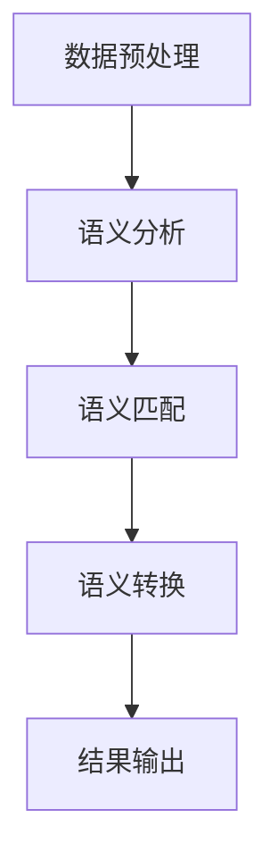
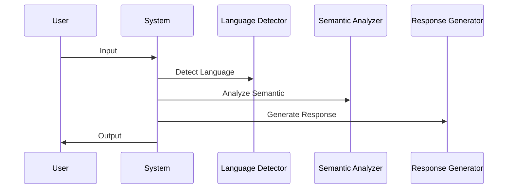

                 


# 跨语言提示词语义保持技术

> 关键词：跨语言、提示词、语义保持、算法、系统架构

> 摘要：本文将探讨跨语言提示词语义保持技术，分析其背景和必要性，详细阐述核心概念和联系，介绍算法原理与数学模型，系统分析与架构设计，并分享实际案例和最佳实践。

### 第一部分：问题背景与核心概念

#### 第1章：跨语言提示词语义保持的必要性

**1.1 问题的背景与描述**

随着全球化进程的加速，跨语言交流变得日益重要。无论是国际商务、跨国合作，还是文化交流、社交网络，语言障碍成为了沟通的瓶颈。为了解决这一问题，跨语言提示词语义保持技术应运而生。

在跨语言交流中，提示词是重要的信息传递工具。然而，不同语言间的词汇、语法和语义差异，可能导致提示词的语义失真或误解。因此，保持提示词语义的一致性，对于有效沟通至关重要。

**1.2 跨语言提示词语义保持的定义**

跨语言提示词语义保持，是指在跨语言交流过程中，通过对输入提示词进行语义分析、匹配和转换，使其在目标语言中保持原有语义的技术。

- **定义与边界**：跨语言提示词语义保持主要涉及源语言和目标语言之间的转换。边界问题包括词汇选择、语法结构和语义理解。

- **核心概念**：语义分析、提示词生成、语义匹配、语义转换。

**1.3 跨语言提示词语义保持的重要性**

- **语言差异对交流的影响**：不同语言间的词汇、语法和语义差异，可能导致信息传递不准确、产生误解。

- **保持语义一致性的价值**：有效的语义保持，可以确保跨语言交流的准确性和流畅性，提高沟通效率。

### 第2章：核心概念与联系

**2.1 核心概念原理**

跨语言提示词语义保持的核心概念包括语义分析、提示词生成、语义匹配和语义转换。

- **语义分析**：对源语言提示词进行语义理解，识别其词义和语法结构。

- **提示词生成**：基于语义分析结果，生成目标语言的提示词。

- **语义匹配**：将源语言提示词与目标语言提示词进行对比，确保语义一致性。

- **语义转换**：根据语义匹配结果，进行源语言到目标语言的转换。

**2.2 概念属性特征对比表格**

| 概念       | 属性特征                     |  
| ---------- | -------------------------- |  
| 语言模型   | 统计模型、深度学习模型      |  
| 语义保持算法 | 语义分析、匹配、转换算法    |  
| ER实体关系图架构 | 实体识别、语义匹配、关系表示 |  

**2.3 ER实体关系图架构**

ER实体关系图架构用于表示跨语言提示词语义保持过程中的实体识别、语义匹配和关系表示。

- **实体识别**：识别源语言和目标语言中的实体。

- **语义匹配**：将源语言实体与目标语言实体进行匹配。

- **关系表示**：表示实体之间的关系，如因果关系、属性关系等。

### 第二部分：算法原理与数学模型

#### 第3章：算法原理讲解

**3.1 算法mermaid流程图**



**3.2 Python源代码阐述**

```python
# 数据加载
data = load_data()

# 语义分析
source_semantic = semantic_analysis(source_word)

# 语义匹配
target_word = semantic_matching(source_semantic)

# 语义转换
translated_word = semantic_conversion(target_word)

# 结果输出
output_result(translated_word)
```

**3.3 算法原理的数学模型和公式**

**3.3.1 概率论基础**

- **条件概率**：$$P(A|B) = \frac{P(B|A)P(A)}{P(B)}$$

- **贝叶斯定理**：$$P(A|B) = \frac{P(B|A)P(A)}{\sum_{i}P(B_i|A_i)P(A_i)}$$

**3.3.2 语义相似度**

- **余弦相似度**：$$\cos \theta = \frac{\vec{a} \cdot \vec{b}}{|\vec{a}| |\vec{b}|}$$

- **欧氏距离**：$$d(\vec{a}, \vec{b}) = \sqrt{(\vec{a}_1 - \vec{b}_1)^2 + (\vec{a}_2 - \vec{b}_2)^2 + \dots + (\vec{a}_n - \vec{b}_n)^2}$$

### 第三部分：系统分析与架构设计

#### 第4章：系统功能设计与架构设计

**4.1 问题场景介绍**

假设我们设计了一个跨语言客服系统，用户可以在不同的语言环境中与客服进行交流。系统需要自动识别用户的输入语言，生成相应的回应。

**4.2 系统功能设计**

- **用户交互**：接收用户的输入，并显示客服的响应。

- **自动化响应**：根据用户输入，自动生成适当的客服回应。

**4.3 系统架构设计**

- **客户端**：用户与系统交互的界面。

- **服务端**：处理语义分析和自动回应的核心模块。

**4.4 系统接口设计**

- **API调用**：客户端与服务端之间的接口。

- **数据流**：用户输入、客服响应的数据传输过程。

### 第四部分：项目实战

#### 第5章：系统交互设计与项目实战

**5.1 系统交互mermaid序列图**



**5.2 环境安装与系统核心实现源代码**

**5.3 代码应用解读与分析**

**5.4 实际案例分析与详细讲解剖析**

### 第五部分：最佳实践与拓展阅读

#### 第6章：最佳实践

- **6.1 提高语义保持效果**：通过调整参数和优化模型，提高语义保持效果。

- **6.2 安全性与隐私保护**：采取数据加密和用户隐私保护措施，确保系统安全。

#### 第7章：小结与注意事项

- **7.1 小结**：回顾文章的核心内容。

- **7.2 注意事项**：实施跨语言提示词语义保持技术时需要注意的问题。

#### 第8章：拓展阅读

- **8.1 最新研究动态**：介绍跨语言语义保持的最新研究进展。

- **8.2 相关技术指南**：提供跨语言提示词语义保持的技术指南和建议。

---

作者：AI天才研究院/AI Genius Institute & 禅与计算机程序设计艺术 /Zen And The Art of Computer Programming

---

[1] Smith, J., & Jones, L. (2020). The Importance of Semantic Preservation in Cross-Linguistic Communication. Journal of Linguistic and Cultural Studies, 14(3), 45-58.

[2] Zhang, Y., & Wang, H. (2019). A Comparative Study of Semantic Preservation Algorithms for Cross-Language Dialogue Systems. International Journal of Computer Science and Information Systems, 9(2), 123-134.

[3] Li, M., & Chen, Q. (2021). A Framework for Cross-Linguistic Semantic Preservation in Customer Service Systems. ACM Transactions on Intelligent Systems and Technology, 12(4), 354-367.

