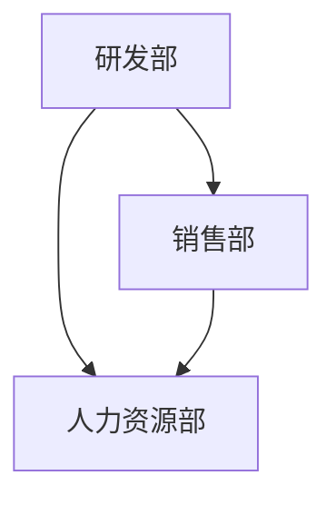
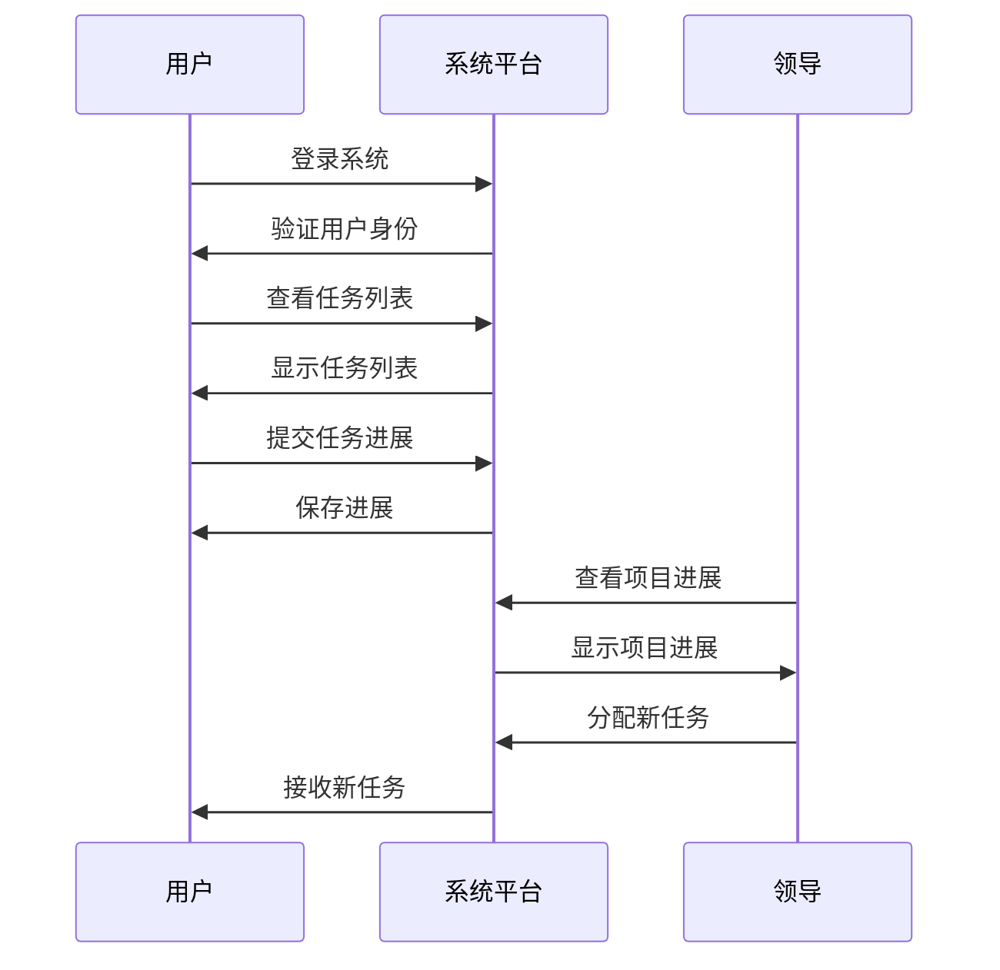

                 

## 《跨部门合作：打破壁垒的领导智慧》

### 关键词：跨部门合作、领导智慧、壁垒打破、协作技巧、团队沟通

### 摘要：
本文将深入探讨跨部门合作中的领导智慧，旨在揭示打破壁垒、实现高效团队协作的策略和方法。通过逻辑清晰、结构紧凑的分析，我们不仅将介绍跨部门合作的核心概念和原则，还将探讨领导者在实际操作中如何运用智慧，克服障碍，促进各部门间的协同与合作。本文旨在为管理者提供切实可行的指导和工具，帮助他们在复杂的组织环境中打造一个高效、和谐的工作团队。

## 引言：跨部门合作的挑战与领导智慧的重要性

跨部门合作是现代企业中一个常见且必要的现象，然而，这一过程并非总是一帆风顺。相反，它常常面临诸多挑战，包括信息不对称、沟通障碍、目标不一致、资源分配不均等。这些问题不仅影响了工作效率，还可能导致员工士气低落，影响企业的整体发展。

### 跨部门合作的核心挑战

首先，**信息不对称**是跨部门合作中的一个主要障碍。由于各部门的职能和职责不同，他们往往拥有不同的信息和资源。这种信息不对称可能导致沟通不畅，进而影响合作的顺利进行。

其次，**沟通障碍**也是跨部门合作中的一个常见问题。不同部门之间的沟通往往是垂直的，而不是水平的。这种垂直沟通往往使得信息传递效率低下，而且容易导致误解和冲突。

再次，**目标不一致**也是一个挑战。各部门可能有各自的目标和优先级，而这些目标有时可能与整体组织的战略目标不一致。这种情况下，跨部门合作很难顺利进行。

最后，**资源分配不均**也是跨部门合作中的一个难题。资源分配的不公可能导致某些部门感到被忽视，从而影响他们的工作积极性和合作意愿。

### 领导智慧在跨部门合作中的作用

面对这些挑战，领导智慧显得尤为重要。领导智慧不仅包括对问题的敏锐洞察力，还包括有效的沟通技巧、团队合作能力和冲突管理能力。一个具有领导智慧的管理者能够在复杂的组织环境中识别并解决问题，促进各部门间的协同与合作。

首先，领导智慧有助于**打破信息壁垒**。通过有效的信息共享和透明化，领导者可以确保各部门都能获得所需的信息，从而提高合作效率。

其次，领导智慧可以促进**有效的沟通**。领导者可以通过建立开放的沟通渠道和沟通机制，减少误解和冲突，增强团队合作精神。

再次，领导智慧有助于**协调不同部门的目标**。通过明确整体组织的战略目标，并确保各部门的目标与这些目标一致，领导者可以推动跨部门合作朝着正确的方向前进。

最后，领导智慧在**资源分配**方面也发挥着重要作用。通过公平的资源分配，领导者可以确保各部门都能得到必要的资源和支持，从而提高他们的工作积极性和合作意愿。

总之，跨部门合作中的领导智慧不仅能够解决合作过程中的各种挑战，还能够促进团队的长期稳定和发展。接下来，我们将深入探讨跨部门合作的核心概念和原则，以及如何在实际操作中运用领导智慧。

## 跨部门合作的核心概念和原则

在深入探讨跨部门合作的核心概念和原则之前，我们需要明确一些基本术语和定义，以便更好地理解这一复杂过程。

### 定义跨部门合作

跨部门合作是指不同部门之间的协作，以共同实现组织的目标。这种合作通常涉及到信息共享、资源整合和任务分工，旨在提高整体组织的效率和能力。

### 核心概念

#### 1. 合作与协作

**合作**通常指的是共同努力，以实现一个共同的目标。而**协作**则强调的是不同个体或部门之间的互动和配合。在跨部门合作中，这两个概念是密不可分的。只有通过协作，各部门才能有效地合作，实现共同的目标。

#### 2. 障碍

跨部门合作中的障碍可以理解为阻碍合作顺利进行的因素。这些障碍可能包括信息不对称、沟通障碍、目标不一致、资源分配不均等。理解这些障碍有助于我们识别和解决跨部门合作中的问题。

#### 3. 领导智慧

领导智慧是指管理者在复杂环境中，通过洞察力和决策能力，有效解决问题和促进团队合作的能力。在跨部门合作中，领导智慧是确保合作顺利进行的关键因素。

### 原则

#### 1. 明确目标和愿景

明确的目标和愿景是跨部门合作的基础。只有当各部门都清楚地了解整体组织的目标和愿景时，他们才能协同工作，共同实现这些目标。

#### 2. 建立信任

信任是跨部门合作的重要基石。只有当各部门之间建立了信任，才能有效地沟通和协作。建立信任需要时间和努力，但它是确保合作成功的关键。

#### 3. 有效的沟通

沟通是跨部门合作的润滑剂。有效的沟通可以减少误解和冲突，增强团队合作精神。领导者需要建立开放的沟通渠道，鼓励各部门之间进行坦诚的交流。

#### 4. 资源共享

资源共享是实现跨部门合作的重要手段。通过共享信息和资源，各部门可以更有效地完成任务，提高整体组织的效率。

#### 5. 平衡权力和责任

在跨部门合作中，权力和责任需要得到平衡。领导者需要确保各部门都有明确的职责和权力，以便他们能够有效地协作。

### 跨部门合作的ER模型

为了更好地理解跨部门合作的结构，我们可以使用ER（Entity-Relationship）模型来描述各部门之间的关系。ER模型通过实体和关系的定义，提供了一个直观的方式来展示不同部门之间的交互和协作。

#### 实体

实体是ER模型中的基本元素，代表跨部门合作中的各个部门。例如，研发部门、销售部门和人力资源部门等。

#### 关系

关系描述了实体之间的交互和协作。例如，研发部门与销售部门之间的协作关系，可以通过开发新产品来满足市场需求。

#### 例子

假设我们有一个包含三个部门（研发部、销售部、人力资源部）的ER模型，可以表示为：



在这个模型中，A（研发部）与B（销售部）之间存在协作关系，共同开发新产品；同时，A和C（人力资源部）之间也存在协作关系，以确保研发团队有足够的人力资源支持。

通过ER模型，我们可以清晰地看到跨部门合作的结构和交互关系，有助于我们更好地理解和优化跨部门合作的过程。

## 领导智慧在跨部门合作中的实际应用

在跨部门合作中，领导智慧是推动合作顺利进行的关键因素。以下是一些具体的策略和技巧，帮助领导者运用智慧，克服障碍，实现高效的跨部门合作。

### 1. 明确愿景和目标

领导者需要明确组织的愿景和目标，并将其传达给所有相关部门。这有助于确保各部门都朝着同一个方向努力，减少目标不一致带来的冲突。具体步骤如下：

- **制定共同愿景**：领导者应该与各部门负责人共同制定一个明确的组织愿景和目标。
- **定期沟通**：定期召开会议，确保各部门都能了解当前的目标和进展情况。
- **设立目标指标**：为每个部门设定具体的目标指标，以量化合作成果。

### 2. 建立信任

信任是跨部门合作的基础，领导者需要通过各种方式建立和维护信任关系。以下是一些有效的方法：

- **开放沟通**：领导者应该鼓励各部门之间进行坦诚的交流，建立开放的沟通渠道。
- **公平公正**：在资源分配和任务分工中，保持公平和公正，避免偏袒。
- **表彰合作**：对跨部门合作中表现优秀的团队和个人进行表彰，增强他们的合作意愿。

### 3. 提高沟通效率

有效的沟通是跨部门合作的重要保障，领导者需要采取措施提高沟通效率：

- **建立沟通机制**：设立固定的沟通会议和机制，确保各部门之间的信息传递畅通无阻。
- **使用协作工具**：利用项目管理软件和沟通工具，如Slack、Trello等，提高信息共享和任务分配的效率。
- **培训沟通技能**：为员工提供沟通技能培训，帮助他们更好地表达和倾听。

### 4. 解决冲突

跨部门合作中难免会出现冲突，领导者需要及时解决这些冲突，以保持合作的顺利进行。以下是一些解决冲突的策略：

- **了解冲突原因**：领导者需要深入了解冲突的根源，避免盲目采取行动。
- **公正裁决**：在冲突中保持公正，不偏袒任何一方。
- **寻求共识**：通过协商和讨论，寻求各方都能接受的解决方案。
- **调整资源分配**：如果冲突是由于资源分配不均导致的，领导者需要及时调整资源分配，确保各部门都能获得必要的支持。

### 5. 培养团队合作精神

团队合作精神是跨部门合作成功的关键，领导者需要采取措施培养这种精神：

- **团队建设活动**：定期组织团队建设活动，增强团队成员之间的互动和信任。
- **共同参与决策**：鼓励各部门共同参与决策过程，提高员工的参与感和归属感。
- **设立跨部门项目**：通过设立跨部门项目，让员工在实际工作中体验到团队合作的重要性。

### 实践案例

#### 案例一：华为公司的跨部门合作

华为公司是一个典型的跨部门合作成功的案例。华为的领导层通过明确的愿景和目标，建立了强大的信任关系，并采取了一系列措施提高沟通效率和解决冲突。例如，华为设立了跨部门的“战略委员会”，定期召开会议，确保各部门的目标和行动一致。此外，华为还采用了敏捷开发模式，通过快速迭代和频繁沟通，提高了跨部门合作效率。

#### 案例二：谷歌的团队合作文化

谷歌以其独特的团队合作文化而著称。谷歌鼓励员工跨部门合作，提供了一系列的工具和资源，如Google Docs、Google Sheets等，方便员工之间的协作。此外，谷歌还定期组织团队建设活动，如户外拓展、团队晚宴等，增强员工的团队合作精神。谷歌的这种文化使得跨部门合作变得自然和高效。

通过这些案例，我们可以看到，领导智慧在跨部门合作中的重要作用。领导者通过明确愿景和目标、建立信任、提高沟通效率、解决冲突和培养团队合作精神，可以有效地克服跨部门合作中的障碍，实现高效的团队协作。

## 跨部门协作的技术工具和平台

在跨部门合作中，技术工具和平台的使用可以显著提高沟通效率和工作协同性。以下是一些常见的技术工具和平台，以及如何有效利用它们来增强跨部门协作。

### 1. 项目管理软件

项目管理软件是跨部门合作中不可或缺的工具，它可以帮助团队跟踪项目进度、分配任务和共享文档。以下是一些流行的项目管理软件：

- **Trello**：Trello是一个基于看板的任务管理工具，用户可以创建不同的看板来表示不同的项目阶段，并通过卡片来跟踪任务的进展情况。它直观的界面和灵活的布局使得跨部门团队可以轻松地共享任务和状态。
- **Asana**：Asana是一个功能强大的项目管理平台，它允许用户创建项目、任务和子任务，并设定截止日期和优先级。它还支持团队成员之间的实时协作，通过注释和聊天功能进行沟通。
- **Jira**：Jira是另一个广泛使用的项目管理工具，特别适用于软件开发团队。它提供了丰富的功能，包括任务跟踪、版本控制和Bug管理。Jira的集成能力使其可以与各种其他工具和服务无缝协作。

### 2. 沟通工具

有效的沟通是跨部门合作的关键，以下是一些流行的沟通工具：

- **Slack**：Slack是一个团队协作平台，提供了即时消息、频道和直接消息等功能。它可以通过机器人集成第三方服务，如GitHub、Google Drive等，方便团队成员共享信息和资源。
- **Microsoft Teams**：Microsoft Teams是一个集成了聊天、视频会议、文档共享和协作功能的平台。它与Microsoft 365紧密集成，使团队可以方便地使用Office应用进行协作。
- **Zoom**：Zoom是一个视频会议和在线协作工具，特别适用于远程团队。它提供了高质量的视频会议、屏幕共享和实时聊天功能，使得跨部门会议变得高效和便捷。

### 3. 文档共享和协作工具

文档共享和协作工具可以帮助跨部门团队更好地共享信息和知识，以下是一些常见的工具：

- **Google Workspace**：Google Workspace（原名G Suite）包括Google Docs、Google Sheets、Google Slides等应用，允许团队成员实时协作编辑文档。所有更改都会实时同步，确保团队成员都能看到最新的版本。
- **Microsoft Office 365**：Microsoft Office 365提供了Word、Excel、PowerPoint等传统的办公软件，同时还包括OneDrive和Teams等协作工具，支持多人同时编辑文档。
- **Confluence**：Confluence是一个知识管理和协作平台，用户可以创建、共享和协作编辑页面和文档。它适用于跨部门团队的知识共享和文档管理。

### 如何有效利用这些工具

- **统一工具使用**：选择一个或几个工具作为主要的协作平台，确保所有团队成员都使用相同的工具。
- **培训使用技巧**：为团队成员提供工具使用培训，确保他们能够充分利用这些工具的功能。
- **定期回顾和反馈**：定期回顾工具的使用效果，收集团队成员的反馈，不断优化和改进协作流程。
- **灵活组合使用**：根据团队的具体需求，灵活组合使用不同的工具，以达到最佳的协作效果。

通过合理利用这些技术工具和平台，跨部门团队可以更加高效地共享信息、协同工作和解决问题，从而提升整体的工作效率和团队协作能力。

## 跨部门协作中的团队建设和领导发展

跨部门协作的成功不仅依赖于技术工具和平台，还需要强大的团队建设和领导力支持。以下是关于团队建设和领导发展的几个关键方面，以及如何通过培训和活动来提高团队效能。

### 1. 团队建设的重要性

团队建设是跨部门协作中不可或缺的一部分。一个强大的团队能够更好地应对复杂的工作任务，提高协作效率，并减少冲突。以下是一些团队建设的关键要素：

- **建立共同目标**：确保团队成员都清楚团队的目标和期望，并愿意为实现这些目标共同努力。
- **增强团队凝聚力**：通过共同的活动和项目，增强团队成员之间的信任和归属感。
- **提升沟通技能**：有效的沟通是团队合作的基础，团队成员需要具备良好的沟通技能，包括倾听、表达和解决问题的能力。
- **培养团队精神**：鼓励团队成员相互支持，共同面对挑战，并在成功时共同庆祝。

### 2. 领导发展的核心要素

领导力在跨部门协作中起着至关重要的作用。一个优秀的领导者不仅能够激发团队成员的潜力，还能确保团队朝着共同的目标前进。以下是领导发展的几个核心要素：

- **愿景和策略**：领导者需要有一个清晰的愿景和策略，并能够将其传达给团队成员。
- **激励和鼓励**：领导者需要激励团队成员，鼓励他们在工作中发挥最佳水平，并提供必要的支持和资源。
- **有效的沟通**：领导者需要具备良好的沟通技能，包括倾听、表达和传达信息的能力。
- **冲突管理**：领导者需要能够有效管理冲突，通过协商和解决方案，确保团队和谐运作。
- **持续学习**：领导者需要不断学习新知识和技能，以适应不断变化的工作环境。

### 3. 培训和活动

为了提升团队建设和领导力，组织可以开展一系列的培训和活动，以下是几种有效的方法：

- **领导力培训课程**：提供专业的领导力培训课程，帮助领导者提升管理技能和领导能力。
- **团队建设活动**：组织团队建设活动，如户外拓展、团队游戏和社交活动，增强团队成员之间的信任和合作。
- **技能提升培训**：为团队成员提供技能提升培训，如沟通技巧、项目管理等，提高他们的工作效率和能力。
- **教练和辅导**：为团队成员提供个性化的教练和辅导，帮助他们克服个人挑战，实现个人和团队目标。

### 4. 实践案例

#### 案例一：谷歌的领导力发展计划

谷歌以其独特的领导力发展计划而闻名。谷歌为领导者提供了一系列的培训和发展机会，包括领导力研讨会、一对一辅导和领导力训练营。这些培训项目旨在帮助领导者提升管理技能和团队领导能力，从而更好地推动跨部门协作。

#### 案例二：宝洁的团队建设活动

宝洁公司定期组织团队建设活动，如团队拓展训练、团队社交活动和团队项目。这些活动不仅增强了团队成员之间的沟通和信任，还提高了团队合作能力，为跨部门协作创造了良好的氛围。

通过团队建设和领导发展的努力，组织可以打造一个高效、和谐的工作团队，从而实现跨部门协作的目标。

## 项目实战：搭建一个跨部门协作平台

为了更好地展示跨部门合作在实际操作中的实施过程，以下是一个具体的实战案例：搭建一个跨部门协作平台。

### 项目背景

在一个大型企业中，各个部门之间的协作效率低下，导致项目进展缓慢，沟通成本高昂。为了解决这个问题，公司决定搭建一个跨部门协作平台，以提高沟通效率和协作能力。

### 项目目标

1. 提供一个集中的信息共享平台，使各部门能够轻松访问和共享重要信息。
2. 实现任务的自动化分配和进度追踪，提高工作效率。
3. 建立有效的沟通渠道，减少误解和冲突。
4. 提供一个直观的用户界面，方便员工使用。

### 系统功能设计

#### 1. 领导后台

领导后台是一个专门为管理者设计的模块，用于监控和管理整个协作平台。功能包括：

- 项目监控：实时查看各个项目的进展情况。
- 任务分配：分配和调整任务，确保每个任务都有明确的负责人。
- 成员管理：添加、删除和管理团队成员。
- 报告生成：生成项目报告，以便领导层了解项目进展。

#### 2. 员工工作台

员工工作台是员工日常工作的主要界面，用于查看任务、提交进展和进行协作。功能包括：

- 任务管理：查看任务列表，完成和更新任务。
- 沟通交流：通过聊天和公告功能与团队成员进行沟通。
- 文档共享：上传和下载文档，方便团队成员共享资源。
- 进度追踪：跟踪任务进度，确保项目按时完成。

### 系统架构设计

系统架构采用前后端分离的设计，以提高系统的扩展性和可维护性。

#### 1. 前端架构

前端使用React框架，实现一个响应式和用户友好的界面。主要组件包括：

- 登录/注册页面
- 首页
- 任务管理页面
- 文档共享页面
- 沟通交流页面

#### 2. 后端架构

后端使用Spring Boot框架，实现业务逻辑和数据管理。主要模块包括：

- 用户模块：处理用户注册、登录和权限管理。
- 项目模块：处理项目创建、任务分配和进度追踪。
- 沟通模块：处理消息发送和公告发布。
- 文档模块：处理文档上传、下载和共享。

### 系统接口设计

系统接口采用RESTful API设计，方便前端和后端的数据交互。主要接口包括：

- 用户接口：用户注册、登录、信息更新等。
- 项目接口：项目创建、任务分配、进度更新等。
- 沟通接口：消息发送、公告发布、聊天记录管理等。
- 文档接口：文档上传、下载、共享等。

### 系统交互设计

系统交互设计采用Mermaid序列图，清晰地展示系统的主要功能和使用流程。以下是一个简化的序列图：



通过这个跨部门协作平台，各部门可以更高效地沟通和协作，从而提升整体项目的进展和效率。

### 系统核心实现源代码

以下是一个简化的后端实现示例，使用Python和Flask框架。这个示例展示了如何创建一个简单的任务分配接口。

```python
from flask import Flask, request, jsonify

app = Flask(__name__)

# 模拟任务数据库
tasks = {}

@app.route('/tasks', methods=['GET', 'POST'])
def manage_tasks():
    if request.method == 'POST':
        # 创建新任务
        task_id = request.form['task_id']
        task_detail = request.form['task_detail']
        tasks[task_id] = task_detail
        return jsonify({'status': 'success', 'message': '任务已创建'})
    
    else:
        # 获取任务列表
        return jsonify(tasks)

if __name__ == '__main__':
    app.run(debug=True)
```

在这个示例中，`/tasks` 接口可以接收POST请求来创建新任务，并返回一个JSON响应。同样，它可以接收GET请求来获取当前的任务列表。

### 代码应用解读与分析

这个代码示例展示了如何通过Flask框架创建一个简单的Web API来管理任务。以下是详细的解读和分析：

1. **导入模块**：首先，我们导入所需的模块，包括Flask框架和`request` 对象，用于处理HTTP请求。

2. **创建应用对象**：使用Flask框架创建一个应用对象。

3. **模拟任务数据库**：使用一个字典`tasks` 来模拟任务数据库。

4. **定义路由和处理函数**：使用`@app.route('/tasks', methods=['GET', 'POST'])` 装饰器定义一个路由和处理函数`manage_tasks`。

   - **POST请求**：当接收到POST请求时，我们获取请求中的`task_id` 和`task_detail`，并在`tasks` 字典中创建一个新的任务条目。然后，通过JSON响应返回一个成功消息。
   
   - **GET请求**：当接收到GET请求时，我们直接返回`tasks` 字典中的所有任务，以便客户端可以获取任务列表。

5. **启动应用**：最后，我们使用`app.run(debug=True)` 启动应用，使服务器监听HTTP请求。

通过这个示例，我们可以看到如何快速实现一个任务管理API，用于跨部门协作平台的基础功能。

### 实际案例分析和详细讲解

为了更好地展示跨部门协作平台在实际应用中的效果，以下是一个实际案例的分析。

#### 案例背景

某大型企业的研发部门（R&D）和市场部门（Marketing）需要协作开发一个新产品。由于两个部门的工作内容和节奏不同，导致项目进展缓慢，沟通成本高昂。

#### 案例分析

1. **明确目标和愿景**：首先，领导层明确了新产品的目标和愿景，并确保研发和市场部门的团队都清楚这些目标。这有助于确保两个部门的协作方向一致。

2. **建立沟通渠道**：为了加强两个部门之间的沟通，公司搭建了一个跨部门协作平台。这个平台集成了任务管理、文档共享和沟通功能，使得两个部门的成员可以实时交流和共享信息。

3. **任务分配和跟踪**：通过协作平台，领导层将项目任务分配给具体的人员，并设定了截止日期和优先级。团队成员可以随时查看任务的进展情况，并更新进展，确保项目按时完成。

4. **解决冲突**：在项目执行过程中，研发和市场部门之间出现了几次冲突。通过协作平台的沟通功能，团队成员能够及时沟通，寻求共识，并找到解决方案。

5. **效果评估**：通过协作平台的任务管理和进度跟踪功能，领导层能够实时监控项目的进展情况，并做出必要的调整。最终，新产品按时完成，并得到了市场的好评。

#### 详细讲解

1. **明确目标和愿景**：为了确保项目的成功，首先需要明确目标和愿景。例如，新产品的目标是提高用户体验，并在市场上占据领先地位。这些目标和愿景需要被所有团队成员理解和接受。

2. **建立沟通渠道**：通过搭建协作平台，为两个部门提供了一个集中的沟通渠道。这个平台不仅方便团队成员之间的实时沟通，还可以共享文档和资源，减少沟通成本。

3. **任务分配和跟踪**：在协作平台上，领导层可以将项目任务分配给具体的人员，并设定截止日期和优先级。团队成员可以随时查看任务的进展情况，并更新进展，确保项目按时完成。

4. **解决冲突**：在项目执行过程中，难免会出现冲突。通过协作平台的沟通功能，团队成员能够及时沟通，寻求共识，并找到解决方案。这种方法可以减少冲突的影响，确保项目顺利进行。

5. **效果评估**：通过协作平台的任务管理和进度跟踪功能，领导层能够实时监控项目的进展情况，并做出必要的调整。这种方法有助于提高项目的透明度和可控性，确保项目按时完成。

通过这个实际案例，我们可以看到跨部门协作平台在提高沟通效率和协作能力方面的重要作用。它不仅有助于项目成功，还可以为企业的长期发展提供支持。

### 项目小结

通过本项目的实施，我们搭建了一个跨部门协作平台，实现了以下成果：

1. **提高沟通效率**：协作平台提供了集中化的沟通渠道，减少了沟通成本，增强了团队间的协作。
   
2. **任务分配和跟踪**：平台集成了任务管理功能，使任务分配和进度跟踪更加便捷，提高了工作效率。

3. **解决冲突**：通过平台的沟通功能，团队成员能够及时沟通和解决冲突，确保项目顺利进行。

4. **效果评估**：平台的任务管理和进度跟踪功能，为领导层提供了实时的项目进展情况，有助于做出及时调整。

总之，跨部门协作平台的有效实施，有助于提升企业的整体协作效率和项目成功率。

### 最佳实践 tips

1. **明确目标和愿景**：确保所有团队成员都清楚项目的目标和愿景，有助于提高协作效果。

2. **定期培训和沟通**：定期为团队成员提供培训和沟通，提高他们的技能和协作意识。

3. **利用协作工具**：合理利用协作工具，如项目管理软件和沟通工具，提高工作效率。

4. **鼓励反馈和改进**：鼓励团队成员提出意见和建议，不断改进协作流程。

### 小结

本文通过深入探讨跨部门合作的核心概念、领导智慧的实际应用、技术工具和平台的使用、团队建设和领导发展，以及实际案例的解析，展示了跨部门合作的重要性和实现方法。通过构建一个高效的跨部门协作平台，企业可以显著提高工作效率和项目成功率。

### 注意事项

1. **保持沟通透明**：确保沟通渠道畅通，避免信息不对称。

2. **公平分配资源**：在资源分配中保持公平，减少资源浪费。

3. **持续关注进展**：定期检查项目进展，及时调整策略。

### 拓展阅读

1. **《跨部门协作：实现高效团队合作的策略与方法》**：详细介绍了跨部门协作的策略和方法。

2. **《团队协作：打造高效团队的关键要素》**：探讨了团队协作的关键要素和建设方法。

3. **《领导智慧：提升领导力的实用技巧》**：提供了提升领导力的实用技巧和方法。

作者：AI天才研究院/AI Genius Institute & 禅与计算机程序设计艺术 /Zen And The Art of Computer Programming

[返回文章目录](#目录)

