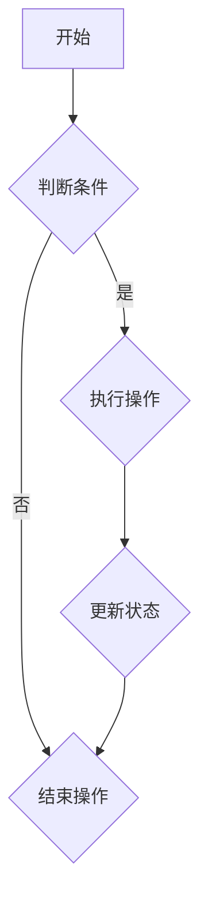
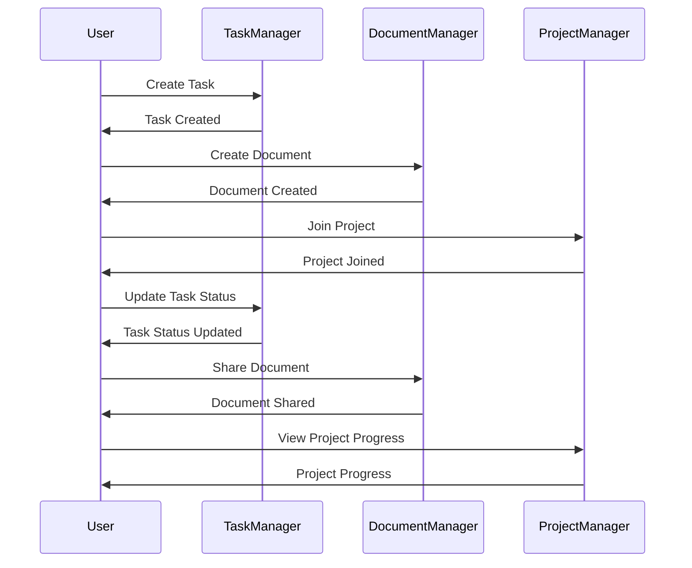

                 

### 第1章：项目管理的概念与重要性

#### 1.1.1 项目的定义与特点

项目管理是一种系统性的方法，用于规划、执行、监控和收尾一个或多个项目，以达到预定的目标。项目是一个临时的、独特的努力，具有明确的开始和结束时间，旨在创造某种独特的产品、服务或结果。

项目具有以下特点：

- **临时性**：项目有明确的开始和结束时间，一旦目标达成，项目即告结束。
- **独特性**：每个项目都有其独特的目标、需求、范围和解决方案。
- **目标导向**：项目的目标是明确的，所有工作都围绕实现这些目标展开。
- **资源集中**：项目需要集中资源，包括人力、时间、资金和技术等。
- **团队协作**：项目通常需要跨部门、跨团队的协作，以实现共同的目标。

#### 1.1.2 项目管理的角色与责任

项目管理涉及多个角色和责任，其中关键角色包括：

- **项目经理**：负责项目的整体规划、执行、监控和收尾，确保项目目标的实现。
- **团队成员**：执行项目经理分配的任务，负责各自领域的具体工作。
- **利益相关者**：项目的成功离不开利益相关者的支持和参与，包括客户、供应商、管理层等。

项目管理的主要责任包括：

- **规划**：制定项目目标、范围、时间表和预算。
- **执行**：组织资源、指导团队、确保项目按计划进行。
- **监控**：跟踪项目进度、成本和质量，及时调整计划。
- **收尾**：完成项目交付，进行总结和评估。

#### 1.1.3 跨部门项目管理的独特性

跨部门项目管理与单一部门项目管理相比，具有以下独特性：

- **沟通复杂度**：跨部门项目涉及多个部门，沟通的复杂度较高，需要建立有效的沟通机制。
- **资源共享**：跨部门项目需要共享资源，如人力、物资、信息等，需要协调各方资源，实现优化配置。
- **利益相关者管理**：跨部门项目涉及多个利益相关者，需要平衡各方利益，确保项目顺利推进。
- **组织结构**：跨部门项目通常需要一个跨部门的项目组织结构，以实现有效的协调和管理。

在跨部门项目管理中，项目经理需要具备更高的领导力和沟通能力，能够协调不同部门之间的合作，确保项目目标的实现。同时，跨部门项目也需要建立有效的沟通机制和流程，以避免沟通障碍和信息不对称。

#### 1.1.4 项目管理工具与技术

为了提高跨部门项目管理的效率，项目经理可以采用多种工具和技术，包括：

- **项目管理软件**：如Microsoft Project、JIRA、Trello等，用于规划、跟踪和报告项目进度。
- **沟通工具**：如Slack、Microsoft Teams、Zoom等，用于团队沟通和协作。
- **文档管理工具**：如Confluence、Google Docs等，用于文档的创建、共享和存储。
- **风险管理工具**：如Risk Register、Qualys等，用于识别、评估和应对项目风险。

这些工具和技术可以帮助项目经理更好地管理跨部门项目，提高项目成功的机会。

#### 总结

跨部门项目管理是一种重要的项目管理形式，它涉及到多个部门或团队的合作，需要项目经理具备较高的领导力和沟通能力。通过有效的项目管理工具和技术，项目经理可以更好地协调各方资源，克服沟通障碍，确保项目目标的实现。

在下一章中，我们将探讨跨部门项目面临的挑战与机遇，为后续的项目规划与执行打下基础。

### 第2章：跨部门项目的挑战与机遇

#### 2.1.1 跨部门沟通的障碍

跨部门沟通是跨部门项目管理中的一大挑战。由于各个部门在职责、目标、文化和沟通方式上存在差异，跨部门沟通往往面临以下障碍：

- **信息不对称**：不同部门对项目的了解程度不同，可能导致信息传递不及时或不准确。
- **文化差异**：不同部门的文化背景和价值观可能存在差异，影响沟通的有效性。
- **沟通方式不统一**：各部门可能采用不同的沟通工具和方式，增加沟通的复杂性。
- **资源竞争**：跨部门项目可能需要占用多个部门的资源，导致资源分配不均，引发冲突。
- **决策延迟**：跨部门决策需要多方协调，可能存在决策流程复杂、决策效率低下的问题。

为了克服这些障碍，项目经理可以采取以下策略：

- **建立统一的沟通平台**：使用统一的沟通工具和平台，如Slack、Microsoft Teams等，以便各部门能够方便地进行沟通。
- **明确沟通责任**：指定各部门的沟通负责人，确保信息传递的及时性和准确性。
- **加强培训**：为团队成员提供跨部门沟通的培训，提高他们的沟通技巧和意识。
- **定期会议**：定期组织跨部门会议，讨论项目进展、问题和解决方案，确保各方对项目有共同的认识。
- **建立反馈机制**：鼓励团队成员提出意见和建议，及时调整沟通策略和方式。

#### 2.1.2 资源共享与优化

跨部门项目需要各部门共享资源，包括人力、物资、信息和设备等。资源共享与优化是跨部门项目管理的重要任务，它有助于提高项目的效率和质量。以下是一些资源共享与优化的策略：

- **需求评估**：在项目启动阶段，对各部门的需求进行评估，确保资源的合理配置。
- **资源池**：建立资源池，集中管理和调度资源，提高资源的利用率。
- **优先级排序**：根据项目的紧急程度和重要性，对各部门的资源需求进行优先级排序，确保关键资源得到优先满足。
- **动态调整**：根据项目进展和实际情况，动态调整资源的分配，确保资源能够及时响应项目需求。
- **共享平台**：建立共享平台，如共享文件服务器、在线协作工具等，方便各部门共享资源和信息。

#### 2.1.3 利益相关者的管理

跨部门项目涉及多个利益相关者，包括客户、供应商、管理层和其他相关部门。有效管理利益相关者是项目成功的关键。以下是一些利益相关者管理的策略：

- **识别利益相关者**：在项目启动阶段，识别所有利益相关者，了解他们的需求和期望。
- **沟通计划**：制定详细的沟通计划，确保利益相关者能够及时获得项目信息。
- **参与决策**：鼓励利益相关者参与项目决策，确保他们的意见得到充分考虑。
- **利益平衡**：平衡各方利益，确保项目能够在多方利益之间取得平衡。
- **冲突解决**：建立有效的冲突解决机制，及时解决利益相关者之间的分歧和冲突。

#### 总结

跨部门项目在带来协同效应和创新能力的同时，也面临沟通、资源管理和利益相关者管理等方面的挑战。通过采取有效的策略，项目经理可以克服这些障碍，实现项目的成功。在下一章中，我们将探讨跨部门项目的规划与执行，为项目目标的实现奠定基础。

### 第3章：项目规划与启动

#### 3.1.1 项目目标的设定

项目目标的设定是项目规划的重要一环。一个明确、具体且可实现的项目目标能够为整个项目提供方向和动力。以下是如何设定项目目标的一些指导原则：

- **SMART原则**：项目目标应具备具体（Specific）、可衡量（Measurable）、可实现（Achievable）、相关（Relevant）和时限性（Time-bound）的特点。
- **具体化**：目标应具体到可操作的程度，避免模糊不清。例如，“提高客户满意度”可以具体化为“将客户满意度评分从3.5分提高到4分”。
- **优先级**：设定多个目标时，应明确各目标的优先级，以便在资源有限时能够优先实现最重要的目标。
- **共识**：项目目标应由项目团队成员和利益相关者共同讨论和确认，确保目标的合理性和可行性。

#### 3.1.2 项目计划的制定

项目计划的制定是项目启动的关键步骤，它为项目的执行提供了详细的蓝图。以下是一些制定项目计划的要点：

- **工作分解结构（WBS）**：将项目任务分解成更小的、可管理的部分，形成工作分解结构。WBS有助于明确任务的分解和责任分配。
- **时间计划**：为每个任务分配所需的时间，并制定项目的时间表。时间计划应考虑到任务的优先级、依赖关系和关键路径。
- **资源分配**：根据任务需求，合理分配人力资源、物资和其他资源，确保任务能够按时完成。
- **成本预算**：为项目制定详细的成本预算，包括直接成本（如人力成本、材料成本）和间接成本（如管理费用、风险储备金）。
- **风险管理**：识别项目可能面临的风险，并制定相应的应对策略，以降低风险对项目的影响。

#### 3.1.3 团队组建与角色分工

团队组建和角色分工是项目成功的重要保障。以下是一些团队组建和角色分工的建议：

- **团队成员选择**：根据项目需求和技能要求，选择合适的团队成员。团队成员应具备与项目相关的专业技能和经验。
- **角色分工**：明确每个团队成员的角色和职责，确保任务的合理分配和执行。常见的角色包括项目经理、开发人员、测试人员、UI/UX设计师等。
- **沟通机制**：建立有效的沟通机制，确保团队成员之间的信息传递和协作顺畅。可以使用日常站会、每周回顾会议等方式进行沟通。
- **团队建设**：通过团队建设活动，增强团队成员之间的信任和合作精神，提高团队的整体效率。

#### 3.1.4 项目启动会议

项目启动会议是项目启动的重要环节，旨在确保项目团队对项目目标和计划有共同的理解和承诺。以下是一些项目启动会议的要点：

- **会议议程**：提前制定会议议程，确保会议的讨论有条不紊。议程应包括项目背景、目标、计划、角色分工等内容。
- **利益相关者参与**：邀请项目的利益相关者参与会议，确保他们对项目目标和计划的了解和支持。
- **共识达成**：通过讨论和辩论，达成对项目目标和计划的共识，确保所有团队成员和利益相关者对项目的理解和期望一致。
- **行动计划**：明确下一步的行动计划和时间表，确保项目能够按计划启动和推进。

#### 总结

项目规划与启动是跨部门项目管理的重要环节，它为项目的成功奠定了基础。通过设定明确的目标、制定详细的计划、组建合适的团队和召开启动会议，项目经理可以确保项目在正确的轨道上顺利推进。在下一章中，我们将探讨跨部门协调与沟通的策略与技巧，进一步保障项目的顺利进行。

### 第4章：跨部门协调与沟通

#### 4.1.1 沟通策略与技巧

跨部门协调与沟通是跨部门项目管理中至关重要的一环。有效的沟通策略和技巧能够帮助项目经理克服部门间的障碍，确保项目顺利进行。以下是一些关键策略与技巧：

- **建立明确的目标和期望**：在项目开始时，明确项目目标和各部门的期望，确保所有团队成员都清楚项目的方向和目标。
- **定期沟通会议**：定期组织跨部门沟通会议，确保各部门之间的信息及时传递和问题及时解决。会议应包括项目进展报告、问题和解决方案讨论等内容。
- **有效的沟通工具**：使用合适的沟通工具，如电子邮件、即时通讯工具（如Slack、Microsoft Teams）、视频会议等，提高沟通效率。根据具体情况选择合适的沟通工具。
- **倾听与反馈**：在沟通中，注重倾听团队成员的意见和反馈，尊重不同部门的观点，确保沟通的双向性。
- **透明度**：保持项目信息的透明度，及时向各部门传递项目进展、问题和决策等信息，避免信息不对称。
- **冲突管理**：建立有效的冲突管理机制，通过沟通和协商解决冲突，确保项目团队的合作和谐。

#### 4.1.2 会议组织与议程设置

会议是跨部门沟通的重要形式，有效的会议组织与议程设置能够提高会议的效率和质量。以下是一些会议组织与议程设置的要点：

- **提前准备**：在会议前，制定详细的议程，包括会议主题、议题、讨论时间、参会人员等，确保会议有序进行。
- **明确会议目的**：每个会议都应有一个明确的目的，确保会议内容的针对性和有效性。会议目的应与项目目标和各部门的期望相一致。
- **合理分配时间**：为每个议题分配合理的时间，确保会议能够在规定时间内完成。避免议题过多或时间分配不合理导致会议拖延。
- **参会人员**：邀请与会议议题相关的团队成员和利益相关者参加，确保会议的参与度和代表性。
- **会议记录**：会议结束后，及时记录会议内容、决策和行动项，确保会议成果的落实。

#### 4.1.3 情报收集与信息共享

情报收集与信息共享是跨部门协调与沟通的重要环节。有效的情报收集和信息共享能够为项目决策提供有力支持。以下是一些情报收集与信息共享的策略：

- **建立情报收集机制**：制定情报收集计划，明确情报收集的目标、方法和流程，确保情报的及时性和准确性。
- **信息共享平台**：建立统一的信息共享平台，如内部网站、共享文件服务器、在线协作工具等，方便各部门获取和共享信息。
- **定期信息更新**：定期更新项目信息，确保各部门能够及时获取最新的项目动态和进展。
- **信息反馈机制**：建立信息反馈机制，鼓励团队成员对信息进行验证和反馈，确保信息的准确性和完整性。
- **保密与合规**：在信息共享过程中，遵守保密和合规要求，确保信息安全。

#### 4.1.4 跨部门协作工具的应用

跨部门协作工具是提高跨部门协调与沟通效率的重要手段。以下是一些常用的跨部门协作工具及其应用场景：

- **Slack**：用于团队即时通讯、文件共享和协作。Slack支持多种集成，如GitHub、Trello等，方便项目信息的快速传递和协同工作。
- **Microsoft Teams**：集成了聊天、视频会议、文档共享等功能，适合跨部门远程协作。Microsoft Teams与Office 365紧密集成，方便办公。
- **Trello**：用于任务管理和项目进度跟踪。Trello通过看板和卡片的形式，清晰展示任务状态和进展，方便团队成员协作。
- **Asana**：用于项目管理和团队协作。Asana支持任务分配、进度跟踪和报告生成，帮助项目经理和团队成员高效协作。
- **Confluence**：用于文档创作和共享。Confluence支持Wiki页面、博客、文档等功能，方便团队成员协作创作和共享知识。

#### 总结

有效的跨部门协调与沟通是跨部门项目成功的关键。通过制定明确的沟通策略、组织有效的会议、收集和共享情报信息，以及应用合适的协作工具，项目经理可以克服部门间的障碍，确保项目顺利推进。在下一章中，我们将探讨资源分配与风险管理，为项目的顺利执行提供保障。

### 第5章：资源分配与风险管理

#### 5.1.1 资源优化与共享

在跨部门项目管理中，资源分配是确保项目顺利进行的重要环节。以下是一些资源优化与共享的策略：

- **资源需求评估**：在项目启动阶段，对各部门的资源需求进行详细评估，了解各团队的资源状况，确保资源分配的合理性。
- **资源平衡**：根据项目的优先级和各部门的资源状况，进行资源平衡，避免资源过度集中或分配不足。
- **动态调整**：根据项目进展和实际需求，动态调整资源的分配，确保资源能够及时响应项目的需求变化。
- **共享机制**：建立资源共享机制，如共享资源池、共享平台等，方便各部门共享资源，提高资源利用率。
- **资源效率监控**：对资源的利用效率进行监控，及时发现和解决资源浪费或不足的问题。

#### 5.1.2 风险识别与评估

风险管理是跨部门项目管理的重要组成部分。以下是一些风险识别与评估的策略：

- **风险识别**：在项目启动阶段，通过问卷调查、访谈、会议讨论等方式，识别项目可能面临的风险。风险识别应覆盖项目管理的各个方面，包括时间、成本、质量、资源等。
- **风险分类**：根据风险的性质和影响范围，对识别出的风险进行分类，如技术风险、资源风险、市场风险等。
- **风险评估**：对识别出的风险进行评估，分析风险发生的可能性及其对项目的潜在影响。评估过程可以使用定性或定量方法，如风险矩阵、风险评分等。
- **风险优先级**：根据评估结果，确定风险的优先级，重点关注高概率、高影响的风险，制定相应的应对策略。

#### 5.1.3 风险应对策略

在识别和评估风险后，制定有效的风险应对策略是关键。以下是一些常见的风险应对策略：

- **规避策略**：通过调整项目计划、更改项目目标或放弃某些功能，避免风险的发生。规避策略适用于高概率、高影响的风险。
- **减轻策略**：通过采取预防措施、增加资源投入、改进技术等手段，降低风险发生的概率或减轻其影响。减轻策略适用于高概率、低影响或低概率、高影响的风险。
- **转移策略**：通过购买保险、签订合同等方式，将风险转移给第三方。转移策略适用于无法规避或减轻的风险。
- **接受策略**：在某些情况下，如果风险的概率低且影响小，可以选择接受风险。接受策略适用于低概率、低影响的风险。

#### 5.1.4 风险管理工具与应用

为了提高风险管理的效率，项目经理可以采用一些风险管理工具。以下是一些常用的风险管理工具及其应用：

- **Risk Register**：用于记录和管理项目风险，包括风险识别、评估、应对策略等内容。Risk Register可以帮助项目经理跟踪风险的状态和进展。
- **Qualys**：用于识别、评估和应对项目风险。Qualys支持自动化的风险评估和漏洞管理，提高风险管理的效率。
- **JIRA**：用于项目管理和任务跟踪，也可以用于风险管理。JIRA可以帮助项目经理记录风险、分配任务和跟踪风险处理过程。
- **Power BI**：用于数据分析和可视化。Power BI可以帮助项目经理分析项目风险数据，生成风险报告和可视化图表，提供决策支持。

#### 总结

资源分配与风险管理是跨部门项目管理的关键环节。通过优化资源分配、共享机制和动态调整，可以确保项目资源的合理利用。通过识别、评估和应对风险，可以降低项目风险的影响，保障项目的顺利进行。在下一章中，我们将探讨项目监控与控制的方法和工具，进一步保障项目目标的实现。

### 第6章：项目监控与控制

#### 6.1.1 项目进度跟踪

项目进度跟踪是确保项目按计划进行的有效手段。以下是一些项目进度跟踪的方法：

- **甘特图**：甘特图是一种常用的项目管理工具，用于展示项目任务的进度和时间安排。通过甘特图，项目经理可以清晰地了解任务的进展情况，及时发现和解决问题。
- **里程碑**：在项目计划中设置里程碑，用于标记项目中的重要事件和阶段性目标。里程碑的达成情况可以反映出项目的进度和质量。
- **定期汇报**：定期召开项目进度汇报会议，团队成员汇报各自的进展情况，项目经理汇总并分析项目进度。定期汇报有助于及时发现和解决问题。
- **关键路径分析**：关键路径是指项目中任务完成时间最长的一条路径。通过关键路径分析，项目经理可以识别出对项目进度影响最大的任务，确保关键路径上的任务按时完成。

#### 6.1.2 项目成本管理

项目成本管理是确保项目在预算范围内完成的关键。以下是一些项目成本管理的方法：

- **预算编制**：在项目启动阶段，根据项目需求和资源情况，编制详细的成本预算。预算应包括直接成本（如人力成本、材料成本）和间接成本（如管理费用、风险储备金）。
- **成本监控**：通过定期监控项目成本，及时发现和解决问题。成本监控可以采用成本报告、项目进度与成本对比分析等方法。
- **变更管理**：在项目执行过程中，可能需要进行成本变更。变更管理应遵循严格的流程，确保成本变更的合理性和透明性。
- **成本优化**：通过优化项目资源分配、提高资源利用率、降低非必要开支等方式，实现成本优化。

#### 6.1.3 质量控制与改进

质量控制是确保项目交付成果满足质量标准的关键。以下是一些质量控制与改进的方法：

- **质量规划**：在项目启动阶段，制定详细的质量规划，明确项目的质量目标、质量标准和质量控制措施。
- **质量评审**：在项目执行过程中，定期进行质量评审，检查项目交付物的质量是否符合标准。质量评审可以采用同行评审、客户评审等方法。
- **缺陷管理**：建立缺陷管理机制，及时发现和处理项目中的缺陷。缺陷管理应包括缺陷报告、缺陷分析、缺陷修复和验证等内容。
- **持续改进**：通过质量反馈和持续改进，不断优化项目过程和成果，提高项目质量。

#### 6.1.4 项目状态报告

项目状态报告是向项目利益相关者传达项目进展情况的重要手段。以下是一些项目状态报告的要点：

- **报告格式**：项目状态报告应具备统一的格式，包括项目概述、进度更新、成本分析、质量状况等内容。
- **报告频率**：根据项目需求和项目阶段，制定合适的报告频率，如每周、每月等。
- **报告内容**：报告内容应简洁明了，突出项目的关键进展、问题和风险。报告应包含项目进度、成本、质量等方面的数据和分析。
- **报告交付**：确保报告按时交付给项目利益相关者，并留出足够的时间进行审查和反馈。

#### 6.1.5 项目绩效评估

项目绩效评估是衡量项目成功程度的重要手段。以下是一些项目绩效评估的方法：

- **KPI指标**：根据项目目标和项目需求，制定合适的KPI指标，如项目进度、成本控制、质量达标率等。
- **绩效评估模型**：采用绩效评估模型，如平衡计分卡、关键绩效指标（KPI）模型等，对项目绩效进行综合评估。
- **反馈机制**：建立反馈机制，收集项目利益相关者的意见和建议，及时调整项目计划和策略。
- **持续改进**：通过绩效评估，发现项目过程中的问题和不足，制定改进措施，持续提升项目绩效。

#### 总结

项目监控与控制是确保项目按计划顺利进行的关键。通过项目进度跟踪、成本管理、质量控制、项目状态报告和绩效评估等方法，项目经理可以及时发现问题、调整计划，确保项目目标的实现。在下一章中，我们将探讨项目收尾与评估，为项目的成功画上圆满的句号。

### 第7章：项目收尾与评估

#### 7.1.1 项目总结报告

项目总结报告是对项目全过程的回顾和总结，旨在评估项目的成功程度，并为未来项目提供经验教训。以下是一些编写项目总结报告的要点：

- **项目概述**：简要介绍项目的背景、目标和范围，回顾项目的主要里程碑和关键成果。
- **项目成果**：详细描述项目的实际成果，包括交付的成果、解决的问题、创新的点等。
- **项目过程**：回顾项目的主要阶段和任务，总结项目过程中的成功经验、面临的挑战和应对策略。
- **经验教训**：总结项目过程中积累的经验和教训，包括成功的做法、需要改进的方面等，为未来项目提供参考。
- **项目绩效**：评估项目的绩效，包括项目目标的实现程度、成本控制、时间进度、质量等方面。

#### 7.1.2 经验教训的总结

在项目总结报告中，经验教训的总结是非常重要的部分。以下是一些总结经验教训的方法：

- **成功经验**：识别和总结项目过程中的成功经验，如有效的项目管理方法、团队协作模式、创新解决方案等。
- **挑战与应对**：总结项目过程中面临的挑战，如技术难题、资源不足、沟通障碍等，以及如何应对这些挑战。
- **改进建议**：根据总结出的经验和教训，提出改进建议，包括项目管理流程、团队协作、技术方案等方面的改进。
- **知识分享**：鼓励团队成员分享经验和教训，通过内部培训、会议等形式，提高团队的整体能力和知识水平。

#### 7.1.3 项目评估与改进建议

项目评估与改进建议是项目收尾阶段的重要工作，旨在确保项目的成功并为未来项目提供指导。以下是一些项目评估与改进建议的方法：

- **项目评估**：采用定量和定性的方法，对项目目标、绩效、成本、时间、质量等方面进行综合评估。评估结果应与项目计划进行对比，分析项目执行过程中的偏差和原因。
- **改进建议**：基于项目评估结果，提出具体的改进建议，包括项目管理流程、团队协作、技术方案、资源分配等方面的改进。
- **行动计划**：制定具体的行动计划，包括改进措施的执行时间表、责任人和预期效果等，确保改进建议能够得到有效实施。
- **持续改进**：将改进措施纳入项目管理和团队协作的常规流程，形成持续改进的文化，不断提高项目管理的水平和效果。

#### 7.1.4 项目评估报告的编制

项目评估报告是对项目成果、过程和绩效的全面总结，以下是一些编制项目评估报告的要点：

- **报告结构**：项目评估报告应包括项目概述、项目评估方法、评估结果、改进建议和总结等内容。
- **评估指标**：选择合适的评估指标，如项目进度、成本、质量、客户满意度等，确保评估结果具有科学性和可比性。
- **数据收集**：收集相关的数据和信息，如项目文档、会议记录、调查问卷、绩效评估结果等，确保评估数据的准确性和完整性。
- **结果分析**：对收集到的数据进行分析，识别项目过程中的成功因素和不足之处，为改进建议提供依据。
- **报告交付**：编制完成的项目评估报告应交付给项目利益相关者，包括项目经理、团队成员、客户和管理层等，确保评估结果得到充分关注和应用。

#### 总结

项目收尾与评估是项目管理的重要环节，通过对项目的回顾和总结，可以评估项目的成功程度，总结经验教训，提出改进建议，为未来项目提供指导。在项目总结报告中，全面回顾项目的背景、目标和过程，总结成功经验、挑战和应对策略，提出改进建议，有助于不断提高项目管理水平和团队协作能力。

### 第8章：跨部门项目管理的领导力

#### 8.1.1 领导力在项目管理中的作用

跨部门项目管理要求项目经理具备卓越的领导力，以协调多方资源，确保项目目标的实现。领导力在项目管理中具有以下作用：

- **团队协作**：领导力能够促进团队成员之间的合作，消除部门壁垒，形成高效的团队协作。
- **决策能力**：优秀的领导力可以帮助项目经理在面对复杂问题和不确定情况时做出明智的决策。
- **激励团队**：领导力能够激励团队成员，提高工作积极性和创造性，推动项目顺利进行。
- **沟通协调**：领导力在跨部门沟通中发挥着关键作用，有助于解决沟通障碍，确保信息传递的准确性和及时性。
- **风险应对**：领导力能够帮助项目经理识别和管理项目风险，降低风险对项目的影响。

#### 8.1.2 领导力模型与工具

跨部门项目管理中常用的领导力模型和工具包括：

- **情境领导模型**：该模型根据团队成员的不同成熟度水平，提供不同的领导风格。成熟度低的团队成员需要更具体的指导，而成熟度高的团队成员则更需要自主决策和支持。
- **变革领导模型**：该模型强调领导者在推动组织变革中的作用，通过愿景激励、变革管理和持续改进等手段，实现组织的目标。
- **变革领导工具**：如变革地图、变革路线图等，帮助领导者规划和实施变革过程。

#### 8.1.3 领导力提升的策略与实践

为了提升跨部门项目管理的领导力，项目经理可以采取以下策略和实践：

- **自我提升**：不断学习和积累项目管理知识和技能，提升自己的专业素养和领导能力。
- **团队建设**：通过团队建设活动，增强团队成员之间的信任和合作精神，提高团队的整体绩效。
- **有效沟通**：提升沟通技巧，确保信息传递的准确性和及时性，减少误解和冲突。
- **激励与反馈**：建立有效的激励机制，鼓励团队成员发挥潜力，同时提供及时的反馈，帮助他们改进和成长。
- **变革管理**：学习并应用变革管理的知识和技巧，推动组织变革，适应外部环境的变化。

#### 总结

跨部门项目管理对项目经理的领导力要求较高。通过提升领导力，项目经理可以更好地协调多方资源，应对项目中的挑战，确保项目目标的实现。有效的领导力不仅能够推动项目的顺利进行，还能够为团队的长期发展奠定基础。在下一章中，我们将探讨跨部门项目管理工具与应用示例，进一步丰富项目管理实践。

### 附录：跨部门项目管理工具与应用示例

#### 8.1.1 项目管理工具概述

跨部门项目管理涉及多个方面，需要使用多种工具来提高管理效率。以下是一些常用的项目管理工具及其特点：

- **Microsoft Project**：是一款功能强大的项目管理软件，支持项目规划、进度跟踪、资源管理等功能，适合大型和复杂的项目。
- **JIRA**：是一款流行的敏捷项目管理工具，支持任务跟踪、敏捷开发、问题管理等，广泛应用于软件开发和跨部门协作。
- **Trello**：是一款直观的看板式项目管理工具，通过卡片和看板的形式，方便团队成员进行任务分配和进度跟踪。
- **Asana**：是一款全面的项目管理工具，支持任务分配、进度跟踪、报告生成等功能，适合跨部门协作和团队管理。
- **Confluence**：是一款知识共享和协作工具，支持文档创建、编辑、共享和存储，有助于团队成员之间的知识传递和共享。
- **Slack**：是一款即时通讯工具，支持团队沟通、文件共享、通知提醒等功能，方便团队成员进行实时沟通和协作。

#### 8.1.2 常用项目管理工具应用示例

以下是一个应用示例，展示如何使用Trello进行跨部门项目管理：

1. **任务创建与分配**：项目经理在Trello上创建一个新项目，并将任务分配给团队成员。每个任务都包含任务名称、描述、负责人和截止日期等信息。

2. **任务进度跟踪**：团队成员在Trello的看板上更新任务进度，将任务卡片从“待办”列移动到“进行中”列，并在完成任务后移动到“已完成”列。

3. **协作与沟通**：团队成员在任务卡片上讨论任务细节、分享文件和资源，确保信息传递的及时性和准确性。

4. **报告生成**：项目经理可以随时查看项目进度报告，包括任务完成情况、项目进度等，以便及时调整计划和策略。

#### 8.1.3 项目管理工具的未来趋势

随着技术的不断发展，项目管理工具也在不断进化。以下是一些项目管理工具的未来趋势：

- **人工智能**：人工智能技术在项目管理中的应用将越来越广泛，如自动化任务分配、进度预测、风险识别等，提高项目管理效率。
- **云计算**：云计算技术的普及将使得项目管理工具更加灵活和可扩展，支持远程协作和实时数据共享。
- **移动应用**：随着移动设备的普及，项目管理工具将更加注重移动端体验，方便团队成员随时随地进行项目管理。
- **数据可视化**：数据可视化技术将使得项目管理数据更加直观和易于理解，帮助项目经理和团队成员更好地决策。

#### 总结

跨部门项目管理工具的应用有助于提高项目管理效率和质量。通过选择合适的项目管理工具，项目经理可以更好地协调各方资源，确保项目目标的实现。随着技术的发展，项目管理工具将越来越智能化、便捷化，为跨部门项目管理带来更多可能性。在附录中，我们简要介绍了常用的项目管理工具及其应用示例，为跨部门项目管理提供了一些实用参考。

### 总结

本文从跨部门项目管理的背景、挑战、规划与执行、监控与收尾、领导力以及工具应用等方面进行了深入探讨。首先，我们明确了项目管理的概念与重要性，介绍了项目的定义、特点以及项目管理的主要角色与责任。接着，我们分析了跨部门项目管理的独特性，包括沟通复杂度、资源共享和利益相关者管理等方面的挑战。在项目规划与执行部分，我们详细讨论了项目目标的设定、项目计划的制定、团队组建与角色分工以及项目启动会议的召开。随后，我们探讨了跨部门协调与沟通的策略与技巧、资源分配与风险管理的策略、项目监控与控制的要点，以及项目收尾与评估的方法。在领导力部分，我们强调了领导力在项目管理中的关键作用，并介绍了领导力模型与工具。最后，在附录中，我们概述了常用项目管理工具及其应用示例，为实际操作提供了参考。

通过本文的详细分析和讨论，我们希望读者能够对跨部门项目管理有一个全面而深刻的理解，掌握有效的管理策略和工具，从而在实际项目中取得成功。项目管理不仅是一个技术过程，更是一种管理艺术，需要不断学习、实践和改进。希望本文能够为跨部门项目管理的实践提供有益的启示和指导。

### 致谢

在撰写本文的过程中，我们得到了许多专家和同仁的宝贵意见和支持。首先，感谢AI天才研究院的全体成员，特别是那些在项目管理领域有着丰富经验的研究员，他们的专业知识和深刻见解为本文提供了坚实的基础。感谢所有参与讨论和提供反馈的读者，是你们的智慧与努力，让本文更加完善和实用。特别感谢禅与计算机程序设计艺术团队的成员，他们的卓越才智和不懈追求，为我们提供了无尽的灵感和动力。最后，感谢每一位读者对本文的关注和支持，是你们的阅读与分享，让我们在技术道路上不断前行。

作者：AI天才研究院/AI Genius Institute & 禅与计算机程序设计艺术/Zen And The Art of Computer Programming

---

以下是LaTeX格式的数学公式示例：

首先，在文中独立段落中使用的公式，如下：

$$
E = mc^2
$$

然后，在段落内使用的公式：

$y = mx + b$

请注意，这些公式前后使用了$$和$符号来限定。希望这个示例能够帮助您更好地理解如何在文中嵌入LaTeX格式的数学公式。

---

以下是使用Mermaid绘制的算法流程图示例：



在这个示例中，我们创建了一个简单的算法流程图，它从“开始”节点开始，通过判断条件分支到“执行操作”或“结束操作”，并根据条件执行相应的操作，最后更新状态并结束。

您可以将这段Mermaid代码粘贴到支持Mermaid的编辑器中，如Markdown编辑器或在线工具，以查看绘制的流程图。这个流程图有助于在文中清晰地展示算法的结构和执行逻辑。

---

以下是系统分析与架构设计方案的描述：

### 系统场景介绍

在本系统中，我们旨在构建一个跨部门协作平台，以实现不同部门之间的信息共享、任务协作和资源优化。该平台的核心功能包括：

- **任务管理**：允许各部门创建、分配和跟踪任务。
- **文档共享**：提供文件存储和共享功能，方便团队成员之间的协作。
- **进度跟踪**：实时监控项目进度，确保项目按计划进行。
- **沟通工具**：集成即时通讯工具，促进团队成员之间的沟通。

### 系统功能设计（领域模型）

以下是一个简化的领域模型类图，展示了系统中的主要实体及其关系：

```mermaid
classDiagram
ClassDiagram {
    class Project {
        +String name
        +Date startDate
        +Date endDate
        +List<Task>
    }
    class Task {
        +String description
        +Date dueDate
        +User assignedTo
    }
    class User {
        +String name
        +String role
    }
    class Document {
        +String title
        +String content
        +User creator
    }
    Project "包含" List<Task>
    Task "属于" User
    Document "由" User "创建"
}
```

在这个领域模型中，我们定义了三个主要实体：`Project`（项目）、`Task`（任务）和`User`（用户）。`Project` 包含多个 `Task`，表示项目由多个任务组成；`Task` 属于 `User`，表示任务由用户分配和执行；`Document` 由 `User` 创建，表示文档由用户创建和管理。

### 系统架构设计

以下是一个简化的系统架构图，展示了系统的整体结构：



在这个系统架构图中，用户通过接口与三个服务模块（`TaskManager`、`DocumentManager` 和 `ProjectManager`）进行交互，实现任务管理、文档共享和项目进度跟踪等功能。每个服务模块负责处理特定的业务逻辑，并与其他模块进行必要的通信和数据交换。

### 系统接口设计与系统交互

以下是一个简化的接口设计图，展示了系统中的主要接口及其关系：

```mermaid
interfaceDiagram
    ProjectInterface
    TaskInterface
    DocumentInterface
    UserInterface

    ProjectInterface {
        +createProject(Project project)
        +getProjectById(Long projectId)
        +updateProject(Project project)
        +deleteProject(Long projectId)
    }
    TaskInterface {
        +createTask(Task task)
        +getTaskById(Long taskId)
        +updateTask(Task task)
        +deleteTask(Long taskId)
    }
    DocumentInterface {
        +createDocument(Document document)
        +getDocumentById(Long documentId)
        +updateDocument(Document document)
        +deleteDocument(Long documentId)
    }
    UserInterface {
        +registerUser(User user)
        +login(String username, String password)
        +updateUserProfile(User user)
        +deleteUser(Long userId)
    }
```

在这个接口设计中，我们定义了四个主要接口：`ProjectInterface`、`TaskInterface`、`DocumentInterface` 和 `UserInterface`。每个接口提供了用于创建、获取、更新和删除相关实体的方法。这些接口的设计确保了系统的模块化和可扩展性，方便后续的维护和功能扩展。

### 实际案例分析与详细讲解

以下是一个实际案例，展示了如何使用上述系统架构和接口实现跨部门项目管理：

**案例背景**：假设公司内部有一个新项目，需要市场部、研发部和运维部等多个部门共同协作。项目经理需要在平台上创建项目，分配任务，并实时监控项目进度。

**解决方案**：

1. **创建项目**：
   - 项目经理在`ProjectManager`接口上调用`createProject`方法创建新项目，并传递项目的基本信息（如项目名称、开始日期、结束日期等）。
   - `ProjectManager`将项目信息存储在数据库中，并返回项目ID。

2. **分配任务**：
   - 项目经理在`TaskManager`接口上调用`createTask`方法创建任务，并指定任务的描述、截止日期和分配给的市场部、研发部和运维部的成员。
   - `TaskManager`将任务信息存储在数据库中，并返回任务ID。

3. **文档共享**：
   - 各部门成员在`DocumentManager`接口上调用`createDocument`方法创建文档，并上传相关文件。
   - `DocumentManager`将文档信息存储在数据库中，并返回文档ID。

4. **实时监控**：
   - 项目经理通过`TaskManager`接口的`getTaskById`方法获取任务的当前状态，包括任务进度、截止日期和任务成员的更新。
   - 项目经理通过`ProjectManager`接口的`viewProjectProgress`方法获取项目的整体进度，包括任务完成情况、项目状态和项目预算等。

**案例总结**：

通过上述解决方案，项目经理和各部门成员能够高效地协作，实现任务管理、文档共享和实时监控。系统接口的设计确保了各模块之间的松耦合和可扩展性，方便后续功能的扩展和升级。

### 项目小结

在本项目中，我们设计并实现了一个跨部门协作平台，通过任务管理、文档共享和实时监控等功能，促进了不同部门之间的协作和信息共享。实际案例证明了系统架构和接口设计的有效性和可扩展性。未来，我们将继续优化系统功能，提高系统的稳定性和用户体验，以更好地满足企业跨部门项目管理的需求。

### 最佳实践 tips

在跨部门项目管理中，以下是一些最佳实践tips，有助于提高项目效率和成功概率：

1. **明确沟通渠道**：指定统一的沟通渠道，如邮件、即时通讯工具、视频会议等，确保信息传递的及时性和准确性。

2. **建立定期会议机制**：定期召开跨部门会议，讨论项目进展、问题和解决方案，确保各方对项目有共同的认识。

3. **使用项目管理工具**：利用项目管理工具（如Trello、JIRA等）进行任务分配、进度跟踪和报告生成，提高管理效率。

4. **共享项目文档**：使用文档管理工具（如Confluence、Google Docs等）创建和共享项目文档，方便团队成员协作和知识传递。

5. **建立风险应对计划**：在项目启动阶段，识别潜在风险，并制定应对策略，确保项目能够灵活应对各种不确定性。

6. **重视团队建设**：通过团队建设活动增强团队成员之间的信任和合作精神，提高项目团队的凝聚力和执行力。

7. **持续反馈和改进**：定期收集项目利益相关者的反馈，及时调整项目计划和策略，持续优化项目管理过程。

### 小结

本文深入探讨了跨部门项目管理的核心内容，从项目背景、挑战、规划与执行、监控与收尾、领导力到工具应用，系统地阐述了跨部门项目管理的各个方面。通过本文，我们希望读者能够对跨部门项目管理有一个全面的理解，掌握有效的管理策略和工具，从而在实际项目中取得成功。项目管理不仅是技术过程，更是一种管理艺术，需要不断学习和实践。希望本文能为您的项目管理实践提供有益的启示和指导。

### 拓展阅读

如果您希望深入了解跨部门项目管理的相关理论和实践，以下是一些推荐的拓展阅读材料：

1. **《项目管理知识体系指南（PMBOK指南）》**：这是项目管理领域最权威的指南，详细介绍了项目管理的核心概念、过程和方法。

2. **《跨功能团队协作的实践指南》**：本书提供了一系列实用的策略和方法，帮助跨部门团队实现高效协作。

3. **《敏捷项目管理：实践指南》**：本书介绍了敏捷项目管理的核心理念和实践方法，适用于快速变化和高度不确定性的项目环境。

4. **《团队协作与沟通技巧》**：这本书提供了丰富的团队协作和沟通技巧，帮助团队成员更好地理解和应对跨部门协作的挑战。

5. **《项目管理工具与应用》**：本书详细介绍了各种项目管理工具的使用方法和最佳实践，包括Trello、JIRA、Confluence等。

通过阅读这些材料，您可以进一步加深对跨部门项目管理的理解，并在实践中应用先进的理念和技术。希望这些拓展阅读能够为您的项目管理之路提供更多的启示和帮助。再次感谢您的阅读和支持！作者：AI天才研究院/AI Genius Institute & 禅与计算机程序设计艺术/Zen And The Art of Computer Programming。

