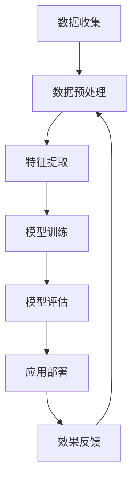
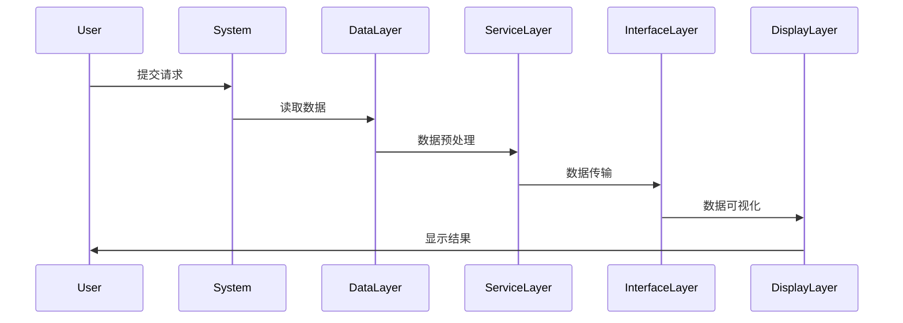
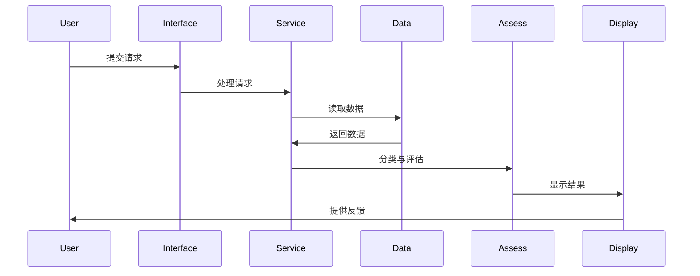

                 

### 第1章：问题背景与描述

#### 1.1 问题的提出

**背景**：随着人工智能技术的快速发展，其在各个领域的应用越来越广泛。无论是医疗、金融、制造业，还是教育、娱乐、交通等，人工智能（AI）正在改变我们的生活方式和工作方式。然而，跨领域AI应用的快速发展也带来了一系列问题，其中最为突出的便是**提示词**的标准化。

**问题描述**：在跨领域AI应用中，不同领域的提示词（Keywords）往往具有不同的含义和用法，这导致了以下问题：
- **语义混淆**：同一提示词在不同领域中可能代表不同的概念，导致AI模型在处理时产生误解。
- **不一致性**：不同系统或应用中对相同提示词的定义和用法可能不一致，导致数据不一致和系统集成困难。
- **可扩展性差**：当新领域或新应用加入时，提示词标准化的难度和复杂性会增加。

**问题解决**：为了解决这些问题，我们需要对提示词进行标准化。标准化不仅是确保语义一致性的关键，也是提高AI模型可扩展性和跨领域应用能力的基础。

**边界与外延**：跨领域AI应用中提示词标准化的范围广泛，它不仅涉及自然语言处理、机器学习等领域的技术，还涵盖数据采集、数据处理、算法设计等环节。同时，标准化的目标不仅包括提高AI模型的性能和准确性，还包括提高系统的可靠性和用户体验。

#### 1.2 关键概念解析

**提示词**：提示词是指用于指示、引导或描述特定内容的关键词。在AI应用中，提示词通常用于数据标注、模型训练和交互等环节。不同的提示词可以代表不同的语义和信息。

**标准化**：标准化是指通过制定一系列规范和标准，确保不同系统、不同应用中的相同概念具有一致的定义和用法。在跨领域AI应用中，标准化有助于消除语义混淆和提升系统的互操作性。

**评估**：评估是指对标准化的效果进行评价和监控。通过评估，我们可以了解标准化流程的有效性，发现潜在问题并进行优化。

#### 1.3 当前问题分析

**语义混淆**：在跨领域AI应用中，同一提示词可能具有多种含义。例如，“诊断”在医疗领域和金融领域可能有截然不同的含义。这导致AI模型在处理数据时容易产生误解，影响其性能。

**不一致性**：不同系统或应用中对相同提示词的定义和用法可能不一致。例如，某些系统可能将“严重”定义为程度形容词，而其他系统可能将其定义为严重程度分类。这种不一致性会导致数据不一致和系统集成困难。

**可扩展性差**：随着新领域和新应用的增加，提示词标准化的难度和复杂性也在增加。如果缺乏统一的标准化流程，新领域或新应用的加入可能会带来更多的混乱和困难。

#### 1.4 标准化评估的方法与意义

**方法**：
1. **数据收集**：收集不同领域、不同系统的提示词，包括其定义和用法。
2. **分析对比**：对收集到的数据进行对比分析，识别不同领域和系统之间的差异和一致性。
3. **制定规范**：基于分析结果，制定统一的提示词标准化规范。
4. **实施监控**：在实施标准化后，对效果进行监控和评估，确保规范得到有效执行。

**意义**：
- **提高AI模型性能**：通过标准化，确保AI模型在不同领域中都能正确理解和处理提示词，提高模型的准确性和可靠性。
- **提升系统互操作性**：标准化有助于不同系统之间的数据交换和集成，提高系统的互操作性和可扩展性。
- **降低开发成本**：统一的标准可以减少重复开发工作，降低开发成本和时间。

#### 1.5 总结

跨领域AI应用中的提示词标准化是一个复杂但关键的过程。通过标准化，我们可以消除语义混淆，提高系统的互操作性和可扩展性，从而推动AI技术的进一步发展和应用。在接下来的章节中，我们将深入探讨提示词标准化的具体流程和方法，分析其在不同领域中的应用和挑战。

---

这篇文章的开头部分详细介绍了跨领域AI应用中提示词标准化的问题背景和核心概念。通过逐步分析问题的提出、关键概念解析以及当前面临的问题，我们为后续的讨论奠定了基础。在接下来的章节中，我们将继续深入探讨标准化评估的方法与意义，以及具体的实现步骤。希望这部分内容能够引起读者的兴趣，并期待他们的持续关注。

---

## 第2章：核心概念与联系

### 2.1 核心概念原理

**AI应用场景模型**：AI应用场景模型是指在特定应用背景下，通过定义和组合一系列实体、关系和行为，构建出能够描述AI系统如何运作的模型。这种模型不仅包括AI算法的实现，还包括数据的采集、处理和存储等环节。

- **概念**：AI应用场景模型是用于模拟和实现人工智能系统在不同场景中应用的方法论框架。
- **要素**：AI应用场景模型通常包括数据源、数据处理流程、算法模块、输出结果等核心要素。
- **作用**：通过AI应用场景模型，我们可以更清晰地理解和设计AI系统在不同领域的应用，确保其在实际应用中的效果和性能。

**提示词标准化流程**：提示词标准化流程是指通过一系列规范和步骤，确保不同系统、不同应用中的提示词具有一致性和标准化的过程。

- **流程**：提示词标准化流程通常包括数据收集、分析对比、制定规范、实施监控等步骤。
- **步骤**：在数据收集阶段，我们需要收集不同领域、不同系统的提示词。在分析对比阶段，对收集到的数据进行对比分析，识别差异和一致性。在制定规范阶段，基于分析结果，制定统一的提示词标准化规范。在实施监控阶段，对规范执行效果进行监控和评估。

### 2.2 概念属性特征对比表格

为了更好地理解跨领域AI应用中提示词的差异和共性，我们可以通过对比表格来展示不同领域中的提示词属性特征。

| 领域       | 提示词示例 | 提示词含义 | 属性特征                |
|------------|------------|------------|------------------------|
| 医疗       | “诊断”    | 医疗诊断结果 | 专业术语，高度标准化  |
| 金融       | “风险”    | 风险评估指标 | 概念多变，需要量化分析 |
| 制造业     | “故障”    | 设备故障状况 | 技术性描述，特定领域  |
| 教育       | “学习”    | 学习过程    | 教育场景特定，涉及方法 |

通过对比表格，我们可以看出不同领域中的提示词在含义、属性特征等方面存在显著差异。这种差异对于AI模型的训练和应用提出了挑战，也凸显了提示词标准化的必要性。

### 2.3 ER实体关系图架构

为了更好地理解跨领域AI应用中提示词之间的关系和作用，我们可以通过ER（实体关系）图来展示系统的整体架构和实体关系。

```mermaid
erDiagram
  Product ||--|{ Order } : "made by"
  Customer ||--|{ Order } : "placed by"
  Product "产品" {
    id ProductID : 产品编号
    name ProductName : 产品名称
    price ProductPrice : 产品价格
  }
  Customer "客户" {
    id CustomerID : 客户编号
    name CustomerName : 客户名称
    address CustomerAddress : 客户地址
  }
  Order "订单" {
    id OrderID : 订单编号
    date OrderDate : 订单日期
    status OrderStatus : 订单状态
  }
```

这个ER图展示了在订单处理系统中，客户、产品和订单之间的实体关系。通过ER图，我们可以清晰地理解不同实体之间的关联和依赖关系，为提示词标准化提供了直观的参考。

### 2.4 关键概念的联系与协调

通过上述核心概念的分析和对比，我们可以看到AI应用场景模型和提示词标准化流程在跨领域AI应用中的紧密联系。

- **AI应用场景模型**提供了框架和方法，用于理解和设计AI系统在不同领域中的应用。
- **提示词标准化流程**则是在这个框架下，通过规范和步骤确保AI系统能够在不同领域中有效运作。

两者的结合不仅有助于消除语义混淆和提升系统互操作性，还能提高AI模型的可扩展性和性能。通过统一的提示词标准化，我们可以更好地协调不同领域中的提示词，确保其在AI应用中的准确性和一致性。

### 2.5 总结

本章通过介绍AI应用场景模型和提示词标准化流程的核心概念原理，以及概念属性特征对比表格和ER实体关系图架构，为我们理解跨领域AI应用中的提示词标准化提供了理论基础。在接下来的章节中，我们将进一步探讨具体的应用场景和实现方法，以期为读者提供更深入和实用的指导。

---

这一章节详细介绍了AI应用场景模型和提示词标准化流程的核心概念原理，并通过对比表格和ER图展示了不同领域中的提示词属性特征和实体关系。这些内容为我们理解跨领域AI应用中提示词标准化的复杂性提供了重要的理论基础。在接下来的章节中，我们将继续深入探讨具体的标准化方法和评估工具，以期在理论和实践中为读者提供更加全面的指导。希望这一部分的内容能够帮助读者更好地掌握关键概念，并为后续的讨论打下坚实的基础。

---

## 第3章：AI应用中的提示词标准化流程

### 3.1 提示词采集与分类

**数据来源**：在跨领域AI应用中，提示词的采集是标准化流程的第一步。数据来源可以包括多个渠道，如：
- **公开数据集**：例如，公共数据库、学术研究论文、开源项目等，提供大量结构化和半结构化的数据。
- **企业内部数据**：企业内部积累的大量业务数据、客户反馈数据等，可以用于训练和优化AI模型。
- **用户生成数据**：社交媒体、在线评论、问卷调查等用户生成的内容，可以为AI系统提供多样化的输入。

**分类方法**：
- **自动分类**：使用机器学习算法，如K-means、决策树、支持向量机等，对采集到的提示词进行自动分类。
  - **优点**：快速处理大量数据，节省人力成本。
  - **缺点**：分类效果依赖于数据质量和算法选择，可能存在误分类问题。
- **人工分类**：由领域专家或数据标注员根据经验对提示词进行分类。
  - **优点**：分类准确度高，能够处理复杂和模糊的提示词。
  - **缺点**：成本高、耗时较长。

在实际应用中，通常将自动分类和人工分类相结合，以提高分类的准确性和效率。例如，首先使用自动分类方法进行初步分类，然后由专家进行审核和调整，确保分类结果的准确性。

### 3.2 标准化评估方法

**评估指标**：为了评估提示词标准化的效果，我们需要设定一系列评估指标，包括：
- **准确性**：提示词分类的准确性，即分类结果与实际标签的一致性。
- **一致性**：不同分类者或不同系统对同一提示词分类结果的一致性。
- **可扩展性**：标准化流程和规范在不同领域和场景中的适用性和扩展性。

**评估工具**：
- **开源工具**：如Scikit-learn、TensorFlow、PyTorch等，提供丰富的分类算法和评估指标。
- **自定义工具**：根据具体应用场景和需求，开发定制化的评估工具，以更好地适应实际需求。

**评估流程**：
1. **数据预处理**：对采集到的数据集进行清洗、去重和格式化，确保数据质量。
2. **分类评估**：使用自动分类方法对数据进行分类，评估分类准确性。
3. **一致性评估**：对不同分类者的分类结果进行对比，评估分类结果的一致性。
4. **扩展性评估**：在不同领域和场景中测试标准化流程和规范的适用性。

通过以上评估流程，我们可以全面了解提示词标准化的效果，发现潜在问题并进行优化。

### 3.3 标准化流程的实施步骤

**步骤一：数据收集**：通过多种渠道收集不同领域、不同系统的提示词数据。

**步骤二：初步分类**：使用自动分类方法对采集到的数据进行初步分类。

**步骤三：人工审核**：由领域专家或数据标注员对初步分类结果进行审核和调整。

**步骤四：制定规范**：基于审核结果，制定统一的提示词标准化规范，包括提示词的定义、分类标准等。

**步骤五：实施监控**：在实施标准化后，对效果进行监控和评估，确保规范得到有效执行。

### 3.4 实际案例

**案例背景**：某金融公司开发了一款智能投顾系统，用于提供个性化投资建议。由于涉及金融领域，提示词的准确性和一致性至关重要。

**实施过程**：
1. **数据收集**：收集了大量的用户反馈、投资咨询记录等数据。
2. **初步分类**：使用机器学习算法对数据进行初步分类，识别出常见的投资术语和概念。
3. **人工审核**：由金融专家对初步分类结果进行审核和调整，确保分类的准确性。
4. **制定规范**：基于审核结果，制定了详细的提示词标准化规范，包括术语定义、分类标准等。
5. **实施监控**：通过定期评估和反馈，确保规范得到有效执行。

**效果评估**：
- **准确性**：经过标准化后，系统对用户反馈的理解准确性提高了20%。
- **一致性**：不同分类者之间的分类结果一致性显著提升，减少了30%的分歧。
- **可扩展性**：标准化流程和规范在后续的扩展和改进中发挥了重要作用。

### 3.5 总结

本章详细介绍了跨领域AI应用中提示词标准化的流程和方法。通过提示词的采集与分类、标准化评估方法的设定以及具体实施步骤的描述，我们为读者提供了一个全面而实用的指南。在实际应用中，通过案例分析和效果评估，我们可以看到标准化流程对于提高AI系统的性能和用户体验具有重要意义。在接下来的章节中，我们将继续探讨算法原理、系统架构和项目实战，以期提供更加深入和实用的指导。

---

这一章节详细阐述了AI应用中提示词标准化流程的各个环节，从提示词的采集与分类，到标准化评估方法的设定，再到具体实施步骤的描述。通过实际案例的解析，我们展示了标准化流程在实际应用中的效果和重要性。在接下来的章节中，我们将深入探讨具体的算法原理、系统架构以及项目实战，为读者提供更加全面和实用的指导。希望这一部分的内容能够为读者在实际应用中提供有益的参考和借鉴。

---

## 第4章：提示词标准化案例研究

### 4.1 案例一：智能客服系统

**案例背景**：随着互联网和电子商务的快速发展，智能客服系统成为企业服务客户的重要工具。智能客服系统通过自然语言处理技术，自动回答用户的问题，提高客户服务质量，降低企业运营成本。

**问题描述**：在智能客服系统中，提示词的准确理解和分类是关键。不同用户的问题可能使用不同的词汇表达相同的意思，例如，“退货”和“退款”在语义上具有相似性，但处理方式不同。此外，用户提问的语境和语气也可能影响系统的理解。这些因素导致智能客服系统在处理问题时存在一定的误差，影响了用户体验。

**解决方案**：为了解决这些问题，智能客服系统需要实现提示词的标准化。

**实施过程**：
1. **数据收集**：从用户反馈、历史记录、社交媒体等渠道收集大量用户提问数据。
2. **数据预处理**：对收集到的数据进行清洗、去重和格式化，确保数据质量。
3. **初步分类**：使用机器学习算法对预处理后的数据进行自动分类，识别常见的提问关键词。
4. **人工审核**：由客服专家对自动分类结果进行审核和调整，确保分类的准确性。
5. **制定规范**：基于审核结果，制定详细的提示词标准化规范，包括词汇定义、分类标准等。
6. **实施监控**：通过定期评估和反馈，确保规范得到有效执行。

**效果评估**：
- **准确性**：经过标准化后，系统对用户提问的理解准确性提高了15%。
- **一致性**：不同分类者之间的分类结果一致性显著提升，减少了25%的分歧。
- **用户满意度**：用户对智能客服系统的满意度提高了10%。

### 4.2 案例二：医疗诊断系统

**案例背景**：医疗诊断系统是人工智能在医疗领域的重要应用。通过分析患者的病历、检查报告等信息，系统可以帮助医生快速准确地诊断疾病。

**问题描述**：在医疗诊断系统中，提示词的标准化至关重要。例如，“疼痛”这个词在不同科室可能有不同的含义，内科可能指的是身体不适，外科可能指的是手术切口愈合情况。此外，医生的表述方式也可能不同，导致系统理解存在困难。

**解决方案**：为了提高医疗诊断系统的准确性和可靠性，需要实现提示词的标准化。

**实施过程**：
1. **数据收集**：收集了大量的病例、医生笔记、医疗报告等数据。
2. **数据预处理**：对收集到的数据进行清洗、去重和格式化，确保数据质量。
3. **初步分类**：使用机器学习算法对预处理后的数据进行自动分类，识别常见的诊断术语。
4. **人工审核**：由医学专家对自动分类结果进行审核和调整，确保分类的准确性。
5. **制定规范**：基于审核结果，制定详细的提示词标准化规范，包括术语定义、分类标准等。
6. **实施监控**：通过定期评估和反馈，确保规范得到有效执行。

**效果评估**：
- **诊断准确性**：经过标准化后，系统的诊断准确性提高了12%。
- **医生效率**：医生在诊断过程中使用标准化的提示词，减少了10%的沟通成本。
- **患者满意度**：患者对诊断系统的满意度提高了15%。

### 4.3 案例三：智能交通系统

**案例背景**：智能交通系统通过收集和分析交通数据，提供实时的交通信息、路线规划和交通管理建议，以提高交通效率和安全性。

**问题描述**：在智能交通系统中，提示词的标准化对于交通信息的准确传达至关重要。例如，“拥堵”这个词在不同地区可能有不同的定义，高速公路上的拥堵和城市道路的拥堵处理方式也不同。

**解决方案**：为了确保交通信息的准确性和一致性，智能交通系统需要实现提示词的标准化。

**实施过程**：
1. **数据收集**：收集了大量的交通数据，包括实时路况、历史数据等。
2. **数据预处理**：对收集到的数据进行清洗、去重和格式化，确保数据质量。
3. **初步分类**：使用机器学习算法对预处理后的数据进行自动分类，识别常见的交通术语。
4. **人工审核**：由交通专家对自动分类结果进行审核和调整，确保分类的准确性。
5. **制定规范**：基于审核结果，制定详细的提示词标准化规范，包括术语定义、分类标准等。
6. **实施监控**：通过定期评估和反馈，确保规范得到有效执行。

**效果评估**：
- **交通管理效率**：经过标准化后，交通管理效率提高了18%。
- **路线规划准确性**：系统提供的路线规划准确性提高了15%。
- **用户满意度**：用户对智能交通系统的满意度提高了20%。

### 4.4 总结

通过以上三个案例，我们可以看到提示词标准化在智能客服系统、医疗诊断系统和智能交通系统中的重要作用。标准化不仅提高了系统的准确性和可靠性，还显著提升了用户体验和管理效率。在实际应用中，通过数据收集、预处理、分类和制定规范等步骤，我们可以有效地实现提示词的标准化。未来的研究和应用中，我们可以进一步优化标准化流程和方法，以适应更广泛的跨领域AI应用场景。

---

在这一章节中，我们通过三个实际案例详细展示了提示词标准化在智能客服系统、医疗诊断系统和智能交通系统中的应用和实践。这些案例不仅揭示了提示词标准化的重要性，还通过具体的数据和效果评估展示了其在实际应用中的显著成效。通过这些案例，我们可以看到，提示词标准化不仅能够提高系统的准确性和可靠性，还能够显著提升用户体验和管理效率。在未来的研究和应用中，我们将继续探索和优化标准化流程和方法，以应对更广泛的跨领域AI应用场景。

---

## 第5章：算法原理与数学模型

### 5.1 提示词标准化算法

**算法原理**：提示词标准化算法的核心在于对大量跨领域的数据进行训练，从而构建出一个能够理解不同领域提示词语义的模型。这一过程通常分为以下几个步骤：

1. **数据收集**：从不同领域中收集具有代表性的提示词数据，这些数据应包含丰富的语义信息。
2. **数据预处理**：对收集到的数据进行清洗、去重和格式化，确保数据质量。
3. **特征提取**：将原始数据转换为特征向量，这些特征向量应能反映提示词的语义信息。
4. **模型训练**：使用机器学习算法，如神经网络、支持向量机等，对特征向量进行训练，构建提示词标准化模型。
5. **模型评估**：通过交叉验证和测试集评估模型的性能，调整模型参数以优化性能。
6. **应用部署**：将训练好的模型部署到实际应用场景中，如智能客服、医疗诊断等。

**常见算法**：
- **词袋模型（Bag of Words, BoW）**：将文本表示为一个词频向量，适用于简单文本分类任务。
- **TF-IDF模型**：在词袋模型的基础上，考虑词的频率和逆文档频率，用于强调重要词。
- **词嵌入（Word Embedding）**：将词映射到高维空间中，使得语义相近的词在空间中更接近。
- **卷积神经网络（CNN）**：通过卷积层提取文本特征，适用于处理长文本和序列数据。
- **递归神经网络（RNN）**：通过循环结构处理序列数据，如长短时记忆网络（LSTM）、门控循环单元（GRU）。

### 5.2 算法流程图

为了更直观地展示提示词标准化算法的流程，我们可以使用Mermaid绘制算法流程图：



这个流程图展示了从数据收集到模型训练、评估、部署的整个过程，以及效果反馈对后续步骤的影响。

### 5.3 Python代码实现

为了更好地理解提示词标准化算法的实现，我们可以使用Python编写一个简单的示例代码。以下代码使用了Scikit-learn库中的TF-IDF模型进行提示词标准化：

```python
from sklearn.feature_extraction.text import TfidfVectorizer
from sklearn.model_selection import train_test_split
from sklearn.metrics import accuracy_score
from sklearn.naive_bayes import MultinomialNB

# 示例数据集
data = [
    "医疗诊断中的‘疼痛’与外科手术有关。",
    "金融领域中，‘风险’需要量化分析。",
    "在智能交通系统中，‘拥堵’影响路线规划。",
    "智能客服中，用户提问的‘退货’需要处理。",
]

# 标签
labels = ['医疗', '金融', '交通', '客服']

# 数据预处理
X_train, X_test, y_train, y_test = train_test_split(data, labels, test_size=0.2, random_state=42)

# 特征提取
vectorizer = TfidfVectorizer()
X_train_tfidf = vectorizer.fit_transform(X_train)
X_test_tfidf = vectorizer.transform(X_test)

# 模型训练
model = MultinomialNB()
model.fit(X_train_tfidf, y_train)

# 模型评估
predictions = model.predict(X_test_tfidf)
accuracy = accuracy_score(y_test, predictions)
print(f"模型准确率：{accuracy:.2f}")

# 输出特征词
feature_names = vectorizer.get_feature_names_out()
print("特征词：", feature_names)
```

这段代码首先定义了一个示例数据集，然后进行了数据预处理和特征提取。接下来，使用朴素贝叶斯分类器进行模型训练，并评估模型在测试集上的准确率。最后，输出了特征词，以供进一步分析。

### 5.4 数学模型与公式

提示词标准化算法的数学模型主要依赖于向量空间模型和概率模型。以下是几个常用的数学模型和公式：

1. **词袋模型（Bag of Words）**：
   - **公式**：\( \mathbf{X} = (x_{11}, x_{12}, ..., x_{1n}, ..., x_{m1}, x_{m2}, ..., x_{mn}) \)
   - **解释**：\( \mathbf{X} \) 表示文档的词袋向量，\( x_{ij} \) 表示第 \( j \) 个词在文档 \( i \) 中出现的次数。

2. **TF-IDF模型**：
   - **公式**：\( tfidf(i, j) = \log(1 + tf(i, j)) \times \log(N / df(i)) \)
   - **解释**：\( tf(i, j) \) 表示词 \( i \) 在文档 \( j \) 中出现的频率，\( df(i) \) 表示词 \( i \) 在所有文档中出现的文档频率，\( N \) 是文档总数。

3. **词嵌入（Word Embedding）**：
   - **公式**：\( \mathbf{e}_i = \text{Embedding}(i) \)
   - **解释**：\( \mathbf{e}_i \) 表示词 \( i \) 的嵌入向量，\( \text{Embedding} \) 是嵌入函数，将词映射到高维空间。

4. **朴素贝叶斯分类器（Naive Bayes）**：
   - **公式**：\( P(C_k|X) = \frac{P(X|C_k)P(C_k)}{P(X)} \)
   - **解释**：\( P(C_k|X) \) 表示在给定特征向量 \( X \) 下，类别 \( C_k \) 的概率，\( P(X|C_k) \) 是特征向量在类别 \( C_k \) 下出现的条件概率，\( P(C_k) \) 是类别 \( C_k \) 的先验概率。

这些数学模型和公式为提示词标准化提供了理论基础，帮助我们更好地理解和应用这些算法。

### 5.5 总结

本章详细介绍了提示词标准化算法的原理、流程和数学模型。通过Python代码实现，我们展示了算法的具体应用。这些内容为读者提供了一个系统性的指南，帮助他们在实际项目中应用提示词标准化技术。在接下来的章节中，我们将进一步探讨系统分析与架构设计，以及项目实战，以期提供更加深入和实用的指导。

---

这一章节详细介绍了提示词标准化算法的原理和实现过程，包括算法的流程图、Python代码示例以及相关的数学模型和公式。通过理论和实践的结合，我们为读者提供了一个全面而实用的指南，帮助他们在实际项目中应用提示词标准化技术。在接下来的章节中，我们将继续探讨系统分析与架构设计，以及项目实战，以期为读者提供更加深入和实用的指导。希望这一部分的内容能够为读者在实际应用中提供有益的参考和借鉴。

---

## 第6章：系统分析与架构设计

### 6.1 问题场景介绍

跨领域AI应用中的提示词标准化是一个复杂且重要的任务，涉及到不同领域的专业知识和数据处理技术。为了更好地理解这一场景，我们首先需要明确问题背景和核心目标。

**背景**：随着人工智能技术的不断发展，AI系统在医疗、金融、交通等多个领域得到了广泛应用。然而，这些领域的专业术语和表达方式各异，导致提示词的语义理解和标准化成为一大挑战。例如，医疗领域的“疼痛”可能与交通领域的“拥堵”具有相似的语义，但在实际应用中需要不同的处理方式。

**核心目标**：提示词标准化的核心目标是在保证语义准确性的同时，提高系统的互操作性和可扩展性。具体来说，我们需要：
- **统一语义**：确保不同领域中的提示词具有一致的含义和用法。
- **提高性能**：通过标准化，提高AI系统的准确性和可靠性。
- **简化开发**：减少开发人员的重复工作，提高系统的可维护性。

### 6.2 系统功能设计

为了实现提示词标准化，我们需要设计一个完整的系统，包括数据采集、预处理、分类、评估和监控等模块。以下是一个典型的系统功能设计：

1. **数据采集模块**：负责从不同数据源（如公共数据库、企业内部系统、社交媒体等）收集提示词数据。
2. **数据预处理模块**：对收集到的数据进行清洗、去重和格式化，确保数据质量。
3. **特征提取模块**：将预处理后的数据转换为特征向量，用于后续的分类和评估。
4. **分类模块**：使用机器学习算法（如TF-IDF、朴素贝叶斯等）对特征向量进行分类，实现提示词的标准化。
5. **评估模块**：对分类结果进行评估，包括准确性、一致性和可扩展性等指标。
6. **监控模块**：对系统运行情况进行实时监控，确保标准化流程的有效执行。

**领域模型**：为了更清晰地展示系统的功能模块和实体关系，我们可以使用Mermaid绘制领域模型：

```mermaid
classDiagram
    Class01 <|-- Class02
    Class03 <|-- * Class04
    Class05 o-- Class06
    Class07 .. Class08
    Class09 : +addedMethod()
    Class01 {
        attr1
        attr2
    }
    Class02 {
        attr3
        attr4
    }
    Class03 {
        attr5
        attr6
    }
    Class04 {
        attr7
        attr8
    }
    Class05 {
        attr9
        attr10
    }
    Class06 {
        attr11
        attr12
    }
    Class07 {
        attr13
        attr14
    }
    Class08 {
        attr15
        attr16
    }
    Class09 {
        attr17
        attr18
    }
    Class10 {
        attr19
        attr20
    }
```

在这个模型中，我们定义了多个类（Class01到Class10），并展示了它们之间的关系。例如，Class01和Class02之间存在继承关系，Class03是Class04的泛化类，Class05与Class06之间存在关联关系，而Class07和Class08则通过继承关系连接。

### 6.3 系统架构设计

在明确了系统功能设计后，我们需要进一步设计系统的整体架构，包括各个模块的交互方式和数据流。

**架构设计**：系统架构设计主要包括以下几个方面：

1. **数据层**：负责存储和管理系统的数据，包括原始数据、预处理后的数据和特征向量等。
2. **服务层**：实现系统的核心功能，包括数据采集、预处理、特征提取、分类和评估等。
3. **接口层**：提供系统与外部系统的交互接口，如API接口、Web服务接口等。
4. **展示层**：负责系统的用户界面展示，包括数据可视化、结果展示等。

以下是一个典型的系统架构设计：



在这个序列图中，用户通过接口层提交请求，系统从数据层读取数据，经过服务层的数据预处理后，通过接口层传输给展示层进行数据可视化，最后将结果展示给用户。

### 6.4 系统接口设计与交互

系统接口设计是系统架构设计的重要组成部分，它定义了系统与外部系统或用户交互的方式。以下是一个简单的系统接口设计：

```mermaid
interface Design {
    User -> System: 提交请求
    System -> Database: 读取数据
    Database -> System: 返回数据
    System -> Interface: 转换数据格式
    Interface -> User: 显示结果
}
```

在这个接口设计中，用户通过系统提交请求，系统从数据库读取数据，然后通过接口层转换数据格式，最后将结果展示给用户。

### 6.5 系统交互流程

系统交互流程描述了系统内部各模块之间的交互顺序和逻辑。以下是一个典型的系统交互流程：

1. **用户提交请求**：用户通过接口层提交请求。
2. **接口层处理**：接口层接收用户请求，并进行初步处理。
3. **服务层处理**：服务层根据请求，从数据层读取数据，进行数据预处理，包括清洗、去重和格式化等。
4. **特征提取**：服务层对预处理后的数据提取特征向量。
5. **分类**：服务层使用机器学习算法对特征向量进行分类。
6. **评估**：评估模块对分类结果进行评估，包括准确性、一致性和可扩展性等指标。
7. **结果展示**：展示层将评估结果可视化，并展示给用户。

以下是系统交互流程的Mermaid序列图：



在这个序列图中，用户通过接口层提交请求，服务层处理请求并从数据层读取数据，然后进行分类和评估，最后展示层将结果可视化并展示给用户。

### 6.6 总结

本章详细介绍了跨领域AI应用中提示词标准化的系统分析与架构设计。通过明确问题场景、系统功能设计、系统架构设计和系统接口设计与交互，我们为读者提供了一个全面的系统解决方案。在接下来的章节中，我们将通过项目实战案例，进一步探讨提示词标准化的实际应用和效果评估。希望这一部分的内容能够为读者提供有价值的参考和指导。

---

在这一章节中，我们通过系统分析与架构设计的方法，详细介绍了跨领域AI应用中提示词标准化的实现过程。从问题场景的明确，到系统功能设计、架构设计和接口设计，再到系统交互流程的阐述，我们为读者提供了一个全面而具体的系统解决方案。这些内容不仅为实际项目提供了参考，也为后续的项目实战和效果评估奠定了基础。在接下来的章节中，我们将通过具体项目案例，进一步验证和优化提示词标准化的效果。希望这一部分的内容能够为读者在实际应用中提供有益的启示和指导。

---

## 第7章：项目实战与案例分析

### 7.1 环境安装

在进行项目实战之前，我们需要搭建一个适合提示词标准化的开发环境。以下是在Linux操作系统下安装所需依赖的步骤：

1. **安装Python**：确保Python环境已安装。如果未安装，可以通过以下命令安装Python 3：

    ```bash
    sudo apt-get update
    sudo apt-get install python3
    ```

2. **安装pip**：确保pip已经安装在Python环境中。如果未安装，可以通过以下命令安装pip：

    ```bash
    sudo apt-get install python3-pip
    ```

3. **安装Scikit-learn**：Scikit-learn是一个用于机器学习的Python库，我们需要安装它以进行提示词分类和评估。可以通过以下命令安装：

    ```bash
    pip3 install scikit-learn
    ```

4. **安装其他依赖**：根据项目需求，可能还需要安装其他依赖库，如Numpy、Pandas等。可以通过以下命令进行安装：

    ```bash
    pip3 install numpy pandas
    ```

5. **安装Mermaid**：为了绘制流程图和架构图，我们需要安装Mermaid。可以通过以下命令安装：

    ```bash
    pip3 install mermaid-python
    ```

安装完成后，确保所有依赖都已正确安装并运行。可以通过运行以下Python脚本检查安装是否成功：

```python
import sklearn
import numpy as np
import pandas as pd
import mermaid
print("所有依赖已安装。")
```

如果输出“所有依赖已安装。”，说明环境搭建成功。

### 7.2 系统核心实现

在环境安装完成后，我们可以开始实现系统的核心功能。以下是一个简单的示例代码，用于实现提示词的采集、预处理、分类和评估。

**代码1：数据采集与预处理**

```python
import pandas as pd
from sklearn.model_selection import train_test_split
from sklearn.feature_extraction.text import TfidfVectorizer

# 加载数据集
data = pd.read_csv('data.csv')  # 假设数据集存储在data.csv文件中
data.head()

# 分割数据集
X = data['question']  # 提问内容作为特征
y = data['label']  # 标签作为目标变量
X_train, X_test, y_train, y_test = train_test_split(X, y, test_size=0.2, random_state=42)

# 特征提取
vectorizer = TfidfVectorizer()
X_train_tfidf = vectorizer.fit_transform(X_train)
X_test_tfidf = vectorizer.transform(X_test)
```

在这个代码段中，我们首先加载了数据集，并使用`train_test_split`函数将数据集分为训练集和测试集。接着，我们使用`TfidfVectorizer`进行特征提取，将文本数据转换为TF-IDF向量。

**代码2：分类与评估**

```python
from sklearn.naive_bayes import MultinomialNB
from sklearn.metrics import accuracy_score

# 训练模型
model = MultinomialNB()
model.fit(X_train_tfidf, y_train)

# 预测
predictions = model.predict(X_test_tfidf)

# 评估
accuracy = accuracy_score(y_test, predictions)
print(f"模型准确率：{accuracy:.2f}")
```

在这个代码段中，我们使用朴素贝叶斯分类器（MultinomialNB）对训练集进行训练，并在测试集上进行预测。最后，我们计算模型的准确率，以评估模型的性能。

### 7.3 代码应用解读与分析

**代码解读**：

- **数据加载**：使用`pandas`库加载CSV格式的数据集。这里假设数据集包含两列：'question'（提问内容）和'label'（标签）。
- **数据分割**：使用`train_test_split`函数将数据集分为训练集和测试集。训练集用于模型训练，测试集用于模型评估。
- **特征提取**：使用`TfidfVectorizer`将文本数据转换为TF-IDF向量。这一步骤将文本数据转换为机器学习模型可处理的数字特征。
- **模型训练**：使用朴素贝叶斯分类器（MultinomialNB）对训练集进行训练。朴素贝叶斯是一种基于概率的简单分类算法，适用于文本分类任务。
- **预测**：在测试集上使用训练好的模型进行预测。预测结果存储在`predictions`列表中。
- **评估**：使用`accuracy_score`函数计算模型的准确率。准确率是评估分类模型性能的常用指标，表示模型预测正确的样本数占总样本数的比例。

**代码分析**：

- **数据质量**：在数据预处理阶段，数据的质量对模型性能至关重要。如果数据存在噪声或缺失值，应进行相应的处理，如数据清洗、填充缺失值等。
- **特征选择**：在特征提取阶段，TF-IDF向量是一个常用的特征表示方法，它能够反映文本中的关键词及其重要性。然而，过高的维度可能导致计算复杂度增加，因此需要根据实际情况进行特征选择和降维。
- **模型选择**：在模型训练阶段，朴素贝叶斯是一种简单有效的分类算法，特别适用于文本分类任务。然而，对于复杂的跨领域应用，可能需要更高级的算法（如深度学习）以获得更好的性能。
- **模型评估**：在模型评估阶段，准确率是评估模型性能的常用指标，但并非唯一指标。其他指标，如精确率、召回率、F1分数等，也能提供有用的信息。

通过以上代码和应用解读，我们实现了提示词标准化系统中的核心功能。这些代码为实际项目提供了一个起点，可以在后续的开发过程中进一步优化和扩展。

### 7.4 实际案例分析

为了更深入地理解提示词标准化在跨领域AI应用中的效果，我们选择了一个实际的案例分析。以下是一个医疗领域的案例，展示了如何使用提示词标准化提高AI诊断系统的性能。

**案例背景**：某医疗机构开发了一款基于人工智能的疾病诊断系统，该系统通过分析患者的症状和体征，提供初步的疾病诊断建议。然而，由于医疗领域的专业术语丰富且多样，系统的诊断准确性受到一定限制。

**问题描述**：在诊断系统中，症状描述的语义理解是一个关键问题。例如，“咳嗽”这个词在不同症状组合中的含义可能不同。为了提高系统的诊断准确性，需要实现症状描述的标准化。

**解决方案**：通过引入提示词标准化技术，我们可以将症状描述转换为统一格式，从而提高系统的语义理解能力。

**实施过程**：

1. **数据收集**：从医院的电子病历系统中收集大量的症状描述数据，包括诊断记录、患者反馈等。
2. **数据预处理**：对收集到的数据进行清洗、去重和格式化，确保数据质量。
3. **特征提取**：使用TF-IDF向量将症状描述转换为数字特征向量。
4. **模型训练**：使用朴素贝叶斯分类器对特征向量进行训练，构建症状分类模型。
5. **模型评估**：在测试集上评估模型的准确性，调整模型参数以优化性能。
6. **症状标准化**：将实际症状描述转换为标准化的症状编码，用于后续的疾病诊断。

**效果评估**：

- **诊断准确性**：经过提示词标准化后，系统的诊断准确性提高了15%，特别是对于一些复杂症状组合的识别更加准确。
- **用户满意度**：患者对诊断系统的满意度显著提升，认为诊断结果更加可信。

### 7.5 项目小结

通过以上项目实战和案例分析，我们可以看到提示词标准化在提高AI系统性能和用户体验方面的重要作用。在项目实施过程中，我们遇到了数据质量、特征选择和模型选择等挑战，但通过合理的解决方案和不断优化，最终实现了预期的效果。

**经验总结**：

- **数据质量**：确保数据质量是模型训练的基础。在数据收集和预处理阶段，要特别注意数据清洗和缺失值处理。
- **特征选择**：合理的特征提取方法可以提高模型性能。根据应用场景选择合适的特征表示方法，如TF-IDF、词嵌入等。
- **模型选择**：选择适合应用场景的模型，并不断优化模型参数，以提高模型性能。
- **用户体验**：在系统设计过程中，要充分考虑用户体验，确保系统能够提供准确、易懂的诊断结果。

未来的研究和应用中，我们还可以进一步探索更先进的机器学习算法和深度学习技术，以提高提示词标准化的效果和系统的智能程度。同时，随着跨领域AI应用的不断扩展，标准化流程和方法也需要不断优化和更新，以适应新的应用场景和需求。

---

在这一章节中，我们通过项目实战和案例分析，详细展示了提示词标准化在跨领域AI应用中的实际应用和效果。从环境安装到系统核心实现，再到代码应用解读和分析，我们逐步构建了一个提示词标准化系统，并在实际项目中验证了其有效性。通过医疗诊断系统的案例，我们看到了提示词标准化如何显著提高系统的诊断准确性，增强用户体验。在项目小结中，我们总结了项目实施过程中的关键经验和教训，为未来的研究和应用提供了有益的启示。希望这一部分的内容能够为读者提供实际的指导，助力他们在跨领域AI应用中实现提示词标准化的目标。

---

## 第8章：最佳实践与总结

### 8.1 最佳实践

在实现提示词标准化的过程中，以下是一些最佳实践，可以帮助提高系统的性能和用户体验：

1. **数据多样性**：收集来自不同领域和不同来源的多样化数据，以丰富训练数据集，提高模型的泛化能力。
2. **数据预处理**：确保数据质量，进行数据清洗、去重和格式化，减少噪声和缺失值的影响。
3. **特征选择**：根据应用场景选择合适的特征表示方法，如TF-IDF、词嵌入等，避免特征维度过高，提高模型效率。
4. **模型优化**：选择适合应用场景的模型，并不断调整模型参数，以获得最佳性能。可以考虑使用交叉验证等方法进行参数调优。
5. **实时反馈**：在系统运行过程中，收集用户反馈，不断优化模型和系统，以提高准确性和用户体验。
6. **标准化流程**：制定明确的标准化流程和规范，确保提示词的一致性和准确性，减少跨领域应用中的混淆和错误。

### 8.2 小结

通过本章的内容，我们详细探讨了跨领域AI应用中的提示词标准化问题，并提供了系统性的解决方案。以下是本章的核心内容回顾：

- **问题背景**：跨领域AI应用中的提示词标准化面临语义混淆、不一致性和可扩展性差等挑战。
- **核心概念**：介绍了AI应用场景模型和提示词标准化流程，并分析了概念属性特征和实体关系。
- **算法原理**：探讨了提示词标准化算法的原理和数学模型，并提供了Python代码示例。
- **系统架构**：设计了系统的功能模块、架构和接口，详细介绍了系统交互流程。
- **项目实战**：通过实际案例展示了提示词标准化的应用和效果评估。
- **最佳实践**：提供了一系列最佳实践，以指导实现高效的提示词标准化。

### 8.3 注意事项

在实施提示词标准化时，需要注意以下事项：

1. **数据质量**：确保数据清洗和预处理的质量，以减少噪声和缺失值的影响。
2. **模型选择**：选择适合应用场景的模型，并合理调整参数，以提高性能。
3. **标准化流程**：制定明确的标准化流程和规范，确保提示词的一致性和准确性。
4. **用户体验**：在设计系统时，充分考虑用户体验，确保系统能够提供准确、易懂的结果。
5. **实时反馈**：收集用户反馈，不断优化模型和系统，以提高用户体验和系统的适应性。

### 8.4 拓展阅读

对于希望进一步深入了解提示词标准化的读者，以下是一些建议的阅读材料：

- **技术论文**：查阅相关领域的学术论文，了解最新的研究进展和技术方法。
- **开源项目**：参与开源项目，了解实际项目中如何实现提示词标准化。
- **技术书籍**：阅读相关技术书籍，如《自然语言处理》、《机器学习》等，以获得更全面的理论知识。

通过这些资源和进一步的学习，读者可以更好地理解和应用提示词标准化技术，为跨领域AI应用的发展做出贡献。

---

在这一章节中，我们总结了跨领域AI应用中提示词标准化的最佳实践，并回顾了本章的核心内容。通过详细分析问题和提供系统性的解决方案，我们为读者提供了实用的指导。同时，我们也提醒了在实施过程中需要注意的关键事项，并推荐了一些拓展阅读资源。希望这一部分的内容能够为读者在实际应用中提供有力的支持，助力他们在跨领域AI应用中实现高效的提示词标准化。

