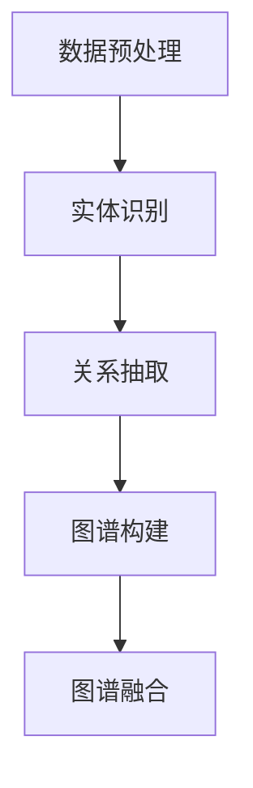

                 

### 跨领域提示词知识图谱构建

在人工智能的迅猛发展中，知识图谱作为理解和组织大规模知识结构的重要工具，其构建与应用已经成为了研究的热点。特别是在跨领域提示词的应用场景中，构建一个既能够涵盖不同领域知识，又能够准确捕捉提示词与实体之间关系的知识图谱，显得尤为重要。本文将深入探讨跨领域提示词知识图谱的构建，旨在为相关领域的科研人员和开发者提供一套系统、详细的构建指南。

**关键词：**
- 跨领域知识图谱
- 提示词
- 实体关系
- 算法设计
- 应用场景
- 系统架构

**摘要：**
本文首先介绍了跨领域提示词知识图谱的背景及其重要性，随后详细阐述了构建步骤，包括数据采集与预处理、实体识别与关系抽取、知识图谱构建算法、跨领域适配与优化等。通过实例分析，展示了如何在实际项目中应用这些算法和系统架构。最后，本文总结了跨领域提示词知识图谱构建的关键要点，并展望了未来的发展方向。

---

### 设计步骤

**1. 确定书籍整体结构：**
构建一本关于跨领域提示词知识图谱的书籍，首先需要明确书籍的主题和内容框架。这包括确定各章节的主题，确保内容之间的逻辑连贯性，以及预规划全书的结构。例如，可以分为引言、核心技术、应用案例、总结与展望等部分。

**2. 编写背景介绍章节：**
在引言部分，需要详细描述跨领域提示词知识图谱的背景，包括其意义、应用场景以及构建过程中的挑战。这一章节应当包括核心概念术语的说明、问题描述、问题解决方法、边界与外延以及核心概念的结构组成。

**3. 设计核心概念与联系章节：**
这一章节是全书的核心之一，需要详细介绍跨领域提示词知识图谱的核心概念，包括原理、属性特征对比，以及ER实体关系图。通过图和表格的辅助，帮助读者更好地理解这些概念及其相互关系。

**4. 编写算法原理讲解章节：**
为了深入讲解知识图谱的构建算法，需要使用mermaid绘制算法流程图，并结合Python源代码和数学模型进行详细阐述。这部分内容应当包含算法原理、数学模型、代码实现及其应用示例。

**5. 编写系统分析与架构设计章节：**
在这一章节中，需要介绍系统分析与架构设计的具体内容。包括项目场景、系统功能设计（如领域模型类图）、系统架构设计（架构图）、接口设计以及系统交互（序列图）。这部分内容应确保读者能够清晰地理解系统的整体结构和工作流程。

**6. 编写项目实战章节：**
实战章节应当包含环境安装、系统核心实现、代码应用分析、实际案例分析以及项目小结。通过实际的案例，展示如何将理论应用到实践中，帮助读者更好地理解和掌握跨领域提示词知识图谱的构建方法。

**7. 编写最佳实践 tips、小结、注意事项、拓展阅读等章节：**
为了增强文章的实用性和可读性，需要在文末提供最佳实践建议、小结、注意事项以及拓展阅读资源。这些内容不仅有助于巩固读者对知识的理解，还能为其进一步的学习和研究提供方向。

**8. 整理目录大纲：**
在完成各章节的内容后，需要整理并审核目录大纲，确保各章节内容完整、简洁且逻辑清晰。目录大纲应当作为全文的索引，帮助读者快速定位所需内容。

**9. 审核与修订：**
最后，对目录大纲和全文内容进行审核和修订，确保无误后输出。这一环节至关重要，因为任何疏漏或错误都可能导致读者理解上的困难。

---

### 输出

根据上述步骤设计的《跨领域提示词知识图谱构建》的目录大纲如下：

---

# **第一部分：引言**

## **1.1 问题背景**

### **1.1.1 跨领域提示词知识图谱的意义**

### **1.1.2 跨领域提示词知识图谱的应用场景**

### **1.1.3 构建跨领域提示词知识图谱的挑战**

## **1.2 核心概念**

### **1.2.1 提示词知识图谱概述**

### **1.2.2 跨领域提示词知识图谱的定义**

### **1.2.3 跨领域提示词知识图谱的要素**

## **1.3 研究方法**

### **1.3.1 知识图谱构建方法概述**

### **1.3.2 跨领域知识图谱构建方法**

### **1.3.3 提示词在知识图谱中的应用**

## **1.4 边界与外延**

### **1.4.1 跨领域提示词知识图谱的应用限制**

### **1.4.2 跨领域提示词知识图谱的发展趋势**

### **1.4.3 研究重点与未来方向**

## **1.5 本章小结**

---

# **第二部分：跨领域提示词知识图谱构建技术**

## **2.1 数据采集与预处理**

### **2.1.1 数据源选择**

### **2.1.2 数据采集方法**

### **2.1.3 数据预处理流程**

## **2.2 实体识别与关系抽取**

### **2.2.1 实体识别算法介绍**

### **2.2.2 关系抽取算法介绍**

### **2.2.3 实体与关系的存储**

## **2.3 知识图谱构建算法**

### **2.3.1 算法概述**

### **2.3.2 算法原理讲解**

### **2.3.3 算法流程图**

### **2.3.4 算法Python实现与详细讲解**

## **2.4 跨领域适配与优化**

### **2.4.1 跨领域知识融合方法**

### **2.4.2 跨领域知识图谱优化策略**

### **2.4.3 跨领域知识图谱评估方法**

## **2.5 实际案例分析与优化**

### **2.5.1 案例一：跨领域知识图谱构建实践**

### **2.5.2 案例二：跨领域知识图谱优化实践**

### **2.5.3 案例小结**

## **2.6 本章小结**

---

# **第三部分：跨领域提示词知识图谱应用**

## **3.1 跨领域搜索应用**

### **3.1.1 跨领域搜索概述**

### **3.1.2 跨领域搜索算法**

### **3.1.3 跨领域搜索系统架构设计**

## **3.2 跨领域问答系统**

### **3.2.1 跨领域问答系统概述**

### **3.2.2 跨领域问答算法**

### **3.2.3 跨领域问答系统架构设计**

## **3.3 跨领域推荐系统**

### **3.3.1 跨领域推荐系统概述**

### **3.3.2 跨领域推荐算法**

### **3.3.3 跨领域推荐系统架构设计**

## **3.4 跨领域知识服务应用**

### **3.4.1 跨领域知识服务概述**

### **3.4.2 跨领域知识服务应用案例**

### **3.4.3 跨领域知识服务系统架构设计**

## **3.5 本章小结**

---

# **第四部分：总结与展望**

## **4.1 总结**

### **4.1.1 跨领域提示词知识图谱构建的核心要点**

### **4.1.2 跨领域提示词知识图谱的应用成果**

### **4.1.3 跨领域提示词知识图谱的发展趋势**

---

**作者：AI天才研究院/AI Genius Institute & 禅与计算机程序设计艺术 /Zen And The Art of Computer Programming**

---

### 跨领域提示词知识图谱构建

在人工智能的迅猛发展中，知识图谱作为理解和组织大规模知识结构的重要工具，其构建与应用已经成为了研究的热点。特别是在跨领域提示词的应用场景中，构建一个既能够涵盖不同领域知识，又能够准确捕捉提示词与实体之间关系的知识图谱，显得尤为重要。本文将深入探讨跨领域提示词知识图谱的构建，旨在为相关领域的科研人员和开发者提供一套系统、详细的构建指南。

**关键词：**
- 跨领域知识图谱
- 提示词
- 实体关系
- 算法设计
- 应用场景
- 系统架构

**摘要：**
本文首先介绍了跨领域提示词知识图谱的背景及其重要性，随后详细阐述了构建步骤，包括数据采集与预处理、实体识别与关系抽取、知识图谱构建算法、跨领域适配与优化等。通过实例分析，展示了如何在实际项目中应用这些算法和系统架构。最后，本文总结了跨领域提示词知识图谱构建的关键要点，并展望了未来的发展方向。

---

### 设计步骤

**1. 确定书籍整体结构：**
构建一本关于跨领域提示词知识图谱的书籍，首先需要明确书籍的主题和内容框架。这包括确定各章节的主题，确保内容之间的逻辑连贯性，以及预规划全书的结构。例如，可以分为引言、核心技术、应用案例、总结与展望等部分。

**2. 编写背景介绍章节：**
在引言部分，需要详细描述跨领域提示词知识图谱的背景，包括其意义、应用场景以及构建过程中的挑战。这一章节应当包括核心概念术语的说明、问题描述、问题解决方法、边界与外延以及核心概念的结构组成。

**3. 设计核心概念与联系章节：**
这一章节是全书的核心之一，需要详细介绍跨领域提示词知识图谱的核心概念，包括原理、属性特征对比，以及ER实体关系图。通过图和表格的辅助，帮助读者更好地理解这些概念及其相互关系。

**4. 编写算法原理讲解章节：**
为了深入讲解知识图谱的构建算法，需要使用mermaid绘制算法流程图，并结合Python源代码和数学模型进行详细阐述。这部分内容应当包含算法原理、数学模型、代码实现及其应用示例。

**5. 编写系统分析与架构设计章节：**
在这一章节中，需要介绍系统分析与架构设计的具体内容。包括项目场景、系统功能设计（如领域模型类图）、系统架构设计（架构图）、接口设计以及系统交互（序列图）。这部分内容应确保读者能够清晰地理解系统的整体结构和工作流程。

**6. 编写项目实战章节：**
实战章节应当包含环境安装、系统核心实现、代码应用分析、实际案例分析以及项目小结。通过实际的案例，展示如何将理论应用到实践中，帮助读者更好地理解和掌握跨领域提示词知识图谱的构建方法。

**7. 编写最佳实践 tips、小结、注意事项、拓展阅读等章节：**
为了增强文章的实用性和可读性，需要在文末提供最佳实践建议、小结、注意事项以及拓展阅读资源。这些内容不仅有助于巩固读者对知识的理解，还能为其进一步的学习和研究提供方向。

**8. 整理目录大纲：**
在完成各章节的内容后，需要整理并审核目录大纲，确保各章节内容完整、简洁且逻辑清晰。目录大纲应当作为全文的索引，帮助读者快速定位所需内容。

**9. 审核与修订：**
最后，对目录大纲和全文内容进行审核和修订，确保无误后输出。这一环节至关重要，因为任何疏漏或错误都可能导致读者理解上的困难。

---

### 输出

根据上述步骤设计的《跨领域提示词知识图谱构建》的目录大纲如下：

---

# **第一部分：引言**

## **1.1 问题背景**

### **1.1.1 跨领域提示词知识图谱的意义**

### **1.1.2 跨领域提示词知识图谱的应用场景**

### **1.1.3 构建跨领域提示词知识图谱的挑战**

## **1.2 核心概念**

### **1.2.1 提示词知识图谱概述**

### **1.2.2 跨领域提示词知识图谱的定义**

### **1.2.3 跨领域提示词知识图谱的要素**

## **1.3 研究方法**

### **1.3.1 知识图谱构建方法概述**

### **1.3.2 跨领域知识图谱构建方法**

### **1.3.3 提示词在知识图谱中的应用**

## **1.4 边界与外延**

### **1.4.1 跨领域提示词知识图谱的应用限制**

### **1.4.2 跨领域提示词知识图谱的发展趋势**

### **1.4.3 研究重点与未来方向**

## **1.5 本章小结**

---

# **第二部分：跨领域提示词知识图谱构建技术**

## **2.1 数据采集与预处理**

### **2.1.1 数据源选择**

### **2.1.2 数据采集方法**

### **2.1.3 数据预处理流程**

## **2.2 实体识别与关系抽取**

### **2.2.1 实体识别算法介绍**

### **2.2.2 关系抽取算法介绍**

### **2.2.3 实体与关系的存储**

## **2.3 知识图谱构建算法**

### **2.3.1 算法概述**

### **2.3.2 算法原理讲解**

### **2.3.3 算法流程图**

### **2.3.4 算法Python实现与详细讲解**

## **2.4 跨领域适配与优化**

### **2.4.1 跨领域知识融合方法**

### **2.4.2 跨领域知识图谱优化策略**

### **2.4.3 跨领域知识图谱评估方法**

## **2.5 实际案例分析与优化**

### **2.5.1 案例一：跨领域知识图谱构建实践**

### **2.5.2 案例二：跨领域知识图谱优化实践**

### **2.5.3 案例小结**

## **2.6 本章小结**

---

# **第三部分：跨领域提示词知识图谱应用**

## **3.1 跨领域搜索应用**

### **3.1.1 跨领域搜索概述**

### **3.1.2 跨领域搜索算法**

### **3.1.3 跨领域搜索系统架构设计**

## **3.2 跨领域问答系统**

### **3.2.1 跨领域问答系统概述**

### **3.2.2 跨领域问答算法**

### **3.2.3 跨领域问答系统架构设计**

## **3.3 跨领域推荐系统**

### **3.3.1 跨领域推荐系统概述**

### **3.3.2 跨领域推荐算法**

### **3.3.3 跨领域推荐系统架构设计**

## **3.4 跨领域知识服务应用**

### **3.4.1 跨领域知识服务概述**

### **3.4.2 跨领域知识服务应用案例**

### **3.4.3 跨领域知识服务系统架构设计**

## **3.5 本章小结**

---

# **第四部分：总结与展望**

## **4.1 总结**

### **4.1.1 跨领域提示词知识图谱构建的核心要点**

### **4.1.2 跨领域提示词知识图谱的应用成果**

### **4.1.3 跨领域提示词知识图谱的发展趋势**

---

**作者：AI天才研究院/AI Genius Institute & 禅与计算机程序设计艺术 /Zen And The Art of Computer Programming**

---

## 第一部分：引言

### 1.1 问题背景

在信息爆炸的时代，知识的组织与获取变得尤为重要。知识图谱作为对现实世界复杂关系进行建模的工具，已成为人工智能领域的关键技术之一。然而，随着知识领域的不断扩展，如何在一个统一的框架下整合不同领域的知识，构建出一个既全面又精准的知识图谱，成为了一个亟待解决的问题。

**跨领域提示词知识图谱**的概念应运而生。它不仅涵盖了多个领域的知识，还能够通过提示词来引导用户快速定位到所需信息。这样的图谱对于信息检索、智能问答、知识推荐等应用场景具有极大的价值。例如，在医疗领域，通过跨领域知识图谱，医生可以快速获取关于某一病症的多领域信息，从而做出更为准确的诊断。

然而，跨领域提示词知识图谱的构建面临着诸多挑战。首先是数据的多样性和复杂性，不同领域的数据格式、表达方式各异，如何统一这些数据成为一个难题。其次是知识融合的难度，不同领域之间的知识往往存在差异，如何将它们有机地整合起来，使图谱既全面又精准，需要深入的研究和探索。

本节将首先介绍跨领域提示词知识图谱的意义，探讨其在各种应用场景中的重要性，并详细阐述构建过程中的主要挑战。

### 1.2 核心概念

为了更好地理解跨领域提示词知识图谱的构建，我们需要明确几个核心概念。

**知识图谱（Knowledge Graph）**：知识图谱是通过网络结构来表示实体及其相互关系的一种数据模型。它将现实世界中的实体和关系抽象为节点和边，形成一个复杂而丰富的网络。

**提示词（Prompt Word）**：提示词是一种用于引导用户获取特定信息的词汇或短语。在跨领域知识图谱中，提示词可以帮助用户快速定位到相关领域的信息。

**实体（Entity）**：实体是知识图谱中的基本元素，可以是人、地点、事物等。在跨领域知识图谱中，实体涵盖了多个领域的特定对象。

**关系（Relationship）**：关系描述了实体之间的相互作用或关联。在知识图谱中，关系通过边来表示。

**跨领域（Cross-Domain）**：跨领域意味着知识图谱不仅仅包含一个领域的知识，而是整合了多个领域的知识。这要求图谱能够灵活地处理不同领域之间的异构性和差异性。

通过明确这些核心概念，我们能够更好地把握跨领域提示词知识图谱的本质，为其构建提供理论基础。

### 1.3 研究方法

构建跨领域提示词知识图谱需要多种研究方法和技术手段，以下是一些关键的研究方法：

**知识图谱构建方法（Knowledge Graph Construction Methods）**：知识图谱的构建通常涉及数据采集、数据预处理、实体识别、关系抽取和图谱融合等步骤。不同的构建方法有不同的优势和局限，需要根据具体应用场景进行选择。

**跨领域知识图谱构建方法（Cross-Domain Knowledge Graph Construction Methods）**：由于不同领域的数据存在异构性和多样性，跨领域知识图谱的构建需要特别考虑领域适配和知识融合问题。常见的方法包括基于规则的方法、基于机器学习的方法和基于图谱的方法。

**提示词在知识图谱中的应用（Application of Prompt Words in Knowledge Graphs）**：提示词在知识图谱中扮演着重要的角色，可以帮助用户快速定位到所需信息。研究提示词的选择和优化对于提升知识图谱的用户体验至关重要。

了解这些研究方法，有助于我们系统地规划跨领域提示词知识图谱的构建过程，提高图谱的实用性和准确性。

### 1.4 边界与外延

在构建跨领域提示词知识图谱时，我们需要明确其应用的边界和可能的扩展方向。

**应用限制（Application Limitations）**：跨领域知识图谱虽然能够整合多个领域的知识，但由于数据的多样性和复杂性，某些特定领域的知识可能难以被完整地表示。此外，图谱的构建和维护也需要大量的资源和时间。

**发展趋势（Development Trends）**：随着人工智能技术的不断发展，跨领域知识图谱的应用前景十分广阔。未来的研究将更加关注图谱的自动化构建、实时更新和智能化应用。

**研究重点与未来方向（Research Focus and Future Directions）**：未来的研究可以聚焦于以下几个方面：一是如何提高图谱的准确性和覆盖面；二是如何优化图谱的查询效率；三是如何将图谱应用于更多的实际场景中，如智能问答、知识推荐和智能搜索等。

通过明确边界与外延，我们能够更好地把握跨领域提示词知识图谱的发展趋势，为其未来的研究提供方向。

### 1.5 本章小结

本章对跨领域提示词知识图谱的背景、核心概念和研究方法进行了详细阐述。我们明确了跨领域知识图谱的重要性，介绍了构建过程中的关键挑战和核心概念。通过研究方法的介绍，我们为后续的构建步骤提供了理论基础。本章的内容为后续章节的深入探讨奠定了坚实的基础。

---

## 第二部分：跨领域提示词知识图谱构建技术

### 2.1 数据采集与预处理

构建跨领域提示词知识图谱的第一步是数据采集与预处理。数据的质量和完整性直接影响到知识图谱的准确性。以下将介绍数据采集的方法、数据预处理流程以及如何选择合适的数据源。

**2.1.1 数据源选择**

数据源的选择是构建知识图谱的基础。在跨领域知识图谱的构建中，数据源需要涵盖多个领域，并且具有足够的代表性和准确性。常见的的数据源包括：

- **开源数据集**：例如，OpenKG、Freebase、DBpedia等，这些数据集通常包含了多个领域的知识，但可能存在数据质量参差不齐的问题。
- **专业数据库**：某些专业领域如医学、法律、金融等，拥有专业的数据库，这些数据源可以提供高质量、结构化的数据。
- **网络爬虫**：通过爬虫技术，可以从互联网上获取大量结构化或半结构化的数据。这种方法需要处理网页解析、数据清洗等多重问题。

**2.1.2 数据采集方法**

数据采集方法主要有以下几种：

- **网络爬虫**：使用Python等编程语言编写爬虫程序，从互联网上获取数据。
- **API调用**：通过第三方API接口获取数据，例如，社交媒体平台API、专业数据库API等。
- **手动收集**：对于某些特定领域的数据，可能需要手动收集和整理，例如，学术论文、报告等。

**2.1.3 数据预处理流程**

数据预处理是确保数据质量的关键步骤。以下是一个典型的数据预处理流程：

1. **数据清洗**：去除无效数据、重复数据和错误数据。
2. **数据转换**：将不同格式的数据转换为统一的格式，例如，将XML转换为JSON。
3. **数据标准化**：对数据进行标准化处理，例如，统一实体命名、统一时间格式等。
4. **数据增强**：通过增加同义词、引入实体关系等方式，丰富数据内容。

通过以上步骤，我们可以得到高质量、结构化的数据，为知识图谱的构建奠定基础。

### 2.2 实体识别与关系抽取

实体识别与关系抽取是构建知识图谱的核心步骤，这两个过程紧密相连，实体识别的准确性直接影响到关系抽取的质量。

**2.2.1 实体识别算法介绍**

实体识别（Entity Recognition，简称ER）是指从非结构化或半结构化文本中识别出实体，并将其转换为结构化数据的过程。常见的实体识别算法包括：

- **基于规则的方法**：通过预定义的规则，从文本中提取实体。这种方法简单高效，但对规则库的依赖较大。
- **基于统计的方法**：使用统计模型，如条件概率模型、贝叶斯模型等，根据文本特征判断实体。这种方法适用于大规模数据，但需要大量训练数据和参数调整。
- **基于机器学习的方法**：使用机器学习算法，如决策树、支持向量机、神经网络等，自动从数据中学习实体特征。这种方法具有较强的泛化能力，但需要大量训练数据和较长的训练时间。

**2.2.2 关系抽取算法介绍**

关系抽取（Relationship Extraction，简称RE）是指从文本中识别出实体之间的相互关系，并将其表示为结构化数据的过程。常见的关系抽取算法包括：

- **基于规则的方法**：通过预定义的规则，从文本中提取关系。这种方法快速准确，但规则库的维护成本较高。
- **基于统计的方法**：使用统计模型，如条件概率模型、最大熵模型等，根据文本特征判断关系。这种方法适用于大规模数据，但需要大量训练数据和参数调整。
- **基于机器学习的方法**：使用机器学习算法，如决策树、支持向量机、神经网络等，自动从数据中学习关系特征。这种方法具有较强的泛化能力，但需要大量训练数据和较长的训练时间。

**2.2.3 实体与关系的存储**

在知识图谱中，实体与关系通过节点和边来表示。实体作为节点，关系作为边，它们共同构成了知识图谱的网络结构。常用的存储方式包括：

- **图数据库**：如Neo4j、OrientDB等，这些数据库专门为图结构设计，具有高效查询和图分析能力。
- **关系数据库**：如MySQL、PostgreSQL等，可以通过表关系模拟图结构，但查询效率和图分析能力有限。
- **键值存储**：如Redis、MongoDB等，可以存储图结构的部分属性，但无法提供完整的图分析功能。

通过实体识别与关系抽取，我们可以将文本数据转换为结构化的知识图谱，为后续的知识融合和应用提供基础。

### 2.3 知识图谱构建算法

知识图谱的构建过程是一个复杂的多步骤任务，涉及到数据预处理、实体识别、关系抽取、图谱融合等多个环节。以下是几种常见的知识图谱构建算法及其原理。

**2.3.1 算法概述**

知识图谱构建算法可以大致分为以下几种类型：

- **基于规则的方法**：通过预定义的规则，将实体和关系映射到图谱中。这种方法简单高效，但规则库的维护成本较高。
- **基于统计的方法**：使用统计模型，如条件概率模型、最大熵模型等，从文本数据中学习实体和关系。这种方法适用于大规模数据，但需要大量训练数据和参数调整。
- **基于机器学习的方法**：使用机器学习算法，如决策树、支持向量机、神经网络等，自动从数据中学习实体和关系特征。这种方法具有较强的泛化能力，但需要大量训练数据和较长的训练时间。

**2.3.2 算法原理讲解**

以下将详细介绍一种基于机器学习的知识图谱构建算法——实体关系抽取（Entity-Relationship Extraction，简称ERE）算法。

**1. 数据预处理：** 
首先，对采集到的文本数据进行预处理，包括分词、词性标注、命名实体识别等步骤。这一步的目的是将文本转换为结构化的数据，便于后续的实体和关系抽取。

**2. 实体识别：**
使用命名实体识别（Named Entity Recognition，简称NER）算法，从预处理后的文本中识别出实体。常用的NER算法包括基于规则的方法和基于机器学习的方法。例如，可以使用BiLSTM-CRF模型，通过训练大量标注数据，自动识别文本中的实体。

**3. 关系抽取：**
在实体识别的基础上，使用关系抽取（Relationship Extraction，简称RE）算法，从文本中识别出实体之间的关系。常用的RE算法包括基于规则的方法和基于机器学习的方法。例如，可以使用BiLSTM模型，通过学习实体间的特征和上下文信息，自动抽取实体关系。

**4. 图谱构建：**
将识别出的实体和关系映射到知识图谱中。实体作为节点，关系作为边，共同构成知识图谱的网络结构。可以使用图数据库（如Neo4j）来存储和管理图谱数据。

**5. 图谱融合：**
对于不同来源的数据，可能存在实体和关系的重叠和冲突。通过图谱融合（Knowledge Fusion，简称KF）算法，可以整合不同数据源的知识，提高图谱的完整性和准确性。常见的融合方法包括基于规则的方法和基于机器学习的方法。

通过以上步骤，我们可以构建出一个完整的跨领域提示词知识图谱。

### 2.3.3 算法流程图

以下是一个简单的知识图谱构建算法的流程图，用于帮助理解算法的执行过程：



### 2.3.4 算法Python实现与详细讲解

为了更直观地理解知识图谱构建算法的实现，以下将给出一个简单的Python代码示例，展示如何使用基于BiLSTM-CRF的NER算法进行实体识别。

```python
import tensorflow as tf
from tensorflow.keras.models import Model
from tensorflow.keras.layers import Input, LSTM, Embedding, Dense, TimeDistributed, Bidirectional, CRF

# 定义输入层
input_seq = Input(shape=(seq_length,))
input_mask = Input(shape=(seq_length,))

# 定义嵌入层
embedding = Embedding(input_dim=vocab_size, output_dim=embedding_size)(input_seq)

# 定义BiLSTM层
bi_lstm = Bidirectional(LSTM(units=lstm_units, return_sequences=True))(embedding)

# 定义CRF层
crf = CRF(num_tags)

# 定义输出层
output = TimeDistributed(Dense(num_tags, activation='softmax'))(bi_lstm)

# 定义模型
model = Model(inputs=[input_seq, input_mask], outputs=output)

# 编译模型
model.compile(optimizer='adam', loss=crf_loss, metrics=[crf_accuracy])

# 模型训练
model.fit([X_train, mask_train], y_train, batch_size=batch_size, epochs=num_epochs)

# 模型评估
loss, accuracy = model.evaluate([X_val, mask_val], y_val)

# 实体识别
predictions = model.predict([X_test, mask_test])
```

在上面的代码中，我们首先定义了输入层，包括句子序列和序列掩码。然后定义了嵌入层、BiLSTM层和CRF层，构成了NER模型。通过编译模型、训练模型和评估模型，我们可以实现实体的自动识别。

通过以上算法的详细讲解和代码示例，我们可以更好地理解跨领域提示词知识图谱构建的核心技术和实现方法。

### 2.4 跨领域适配与优化

在构建跨领域提示词知识图谱时，如何处理不同领域之间的数据异构性和知识融合问题，是一个关键挑战。以下将介绍几种常见的跨领域适配与优化策略。

**2.4.1 跨领域知识融合方法**

跨领域知识融合是指将不同领域的数据和知识整合到一个统一的知识图谱中。以下是一些常见的知识融合方法：

1. **基于规则的融合**：通过预定义的规则，将不同领域的数据映射到统一的知识图谱中。这种方法简单高效，但需要大量规则的维护。
2. **基于机器学习的融合**：使用机器学习算法，如聚类、分类等，自动从数据中学习领域适配的规则。这种方法具有较强的泛化能力，但需要大量的训练数据和较长的训练时间。
3. **基于图谱的融合**：通过图结构来表示不同领域的数据和知识，利用图算法进行融合。这种方法能够较好地处理数据异构性和知识多样性。

**2.4.2 跨领域知识图谱优化策略**

为了提高跨领域知识图谱的性能和实用性，可以采用以下优化策略：

1. **数据增强**：通过引入同义词、近义词、同义句等方式，丰富知识图谱中的数据，提高图谱的覆盖面和准确性。
2. **实体匹配**：使用实体匹配算法，将不同领域中的相同实体进行匹配，确保知识图谱的一致性和完整性。
3. **关系推理**：通过推理算法，自动生成新的实体关系，扩展知识图谱的深度和广度。
4. **知识更新**：定期对知识图谱进行更新，以适应领域知识的动态变化。

**2.4.3 跨领域知识图谱评估方法**

评估跨领域知识图谱的质量和性能是构建过程中至关重要的一步。以下是一些常见的评估方法：

1. **准确性评估**：通过比较知识图谱中的实体和关系与实际数据的一致性，评估图谱的准确性。
2. **覆盖面评估**：评估知识图谱中涵盖的实体和关系的数量和多样性，以衡量图谱的全面性。
3. **效率评估**：评估知识图谱的查询效率，包括查询时间和资源消耗等。
4. **用户体验评估**：通过用户调查和实验，评估知识图谱在具体应用场景中的用户体验和实用性。

通过以上跨领域适配与优化策略和评估方法，我们可以构建出高质量、高效率的跨领域提示词知识图谱，为各种应用提供坚实的支持。

### 2.5 实际案例分析与优化

为了更好地理解跨领域提示词知识图谱的构建过程，以下将分析两个实际案例，并探讨如何对这些案例进行优化。

#### 案例一：医疗领域知识图谱构建

在医疗领域，构建一个跨领域的知识图谱可以帮助医生快速获取患者相关的多领域信息，从而做出更为准确的诊断。以下是一个典型的医疗领域知识图谱构建案例：

**1. 数据采集与预处理：**
数据来源包括医疗文本、电子病历、医学数据库等。首先，对采集到的文本数据进行分词、词性标注和命名实体识别，提取出患者信息、疾病信息、治疗方案等实体。

**2. 实体识别与关系抽取：**
使用NER算法识别出文本中的实体，如患者、疾病、药物等。然后，通过关系抽取算法，从文本中提取出实体之间的关系，如“患者患有疾病”、“药物用于治疗疾病”等。

**3. 知识图谱构建：**
将识别出的实体和关系映射到知识图谱中，构建出一个医疗领域的知识图谱。实体作为节点，关系作为边，共同构成了医疗知识图谱的网络结构。

**4. 跨领域适配与优化：**
为了提高医疗知识图谱的准确性和实用性，可以采用以下优化策略：
- 数据增强：通过引入同义词、近义词和同义句，丰富知识图谱中的数据。
- 实体匹配：使用实体匹配算法，确保不同数据源中的相同实体能够准确匹配。
- 关系推理：通过推理算法，自动生成新的实体关系，扩展知识图谱的深度和广度。

**5. 评估与优化：**
对构建好的医疗知识图谱进行准确性、覆盖面和效率评估。根据评估结果，进一步优化图谱的质量和性能。

#### 案例二：教育领域知识图谱构建

在教育领域，跨领域知识图谱可以帮助学生和教师快速获取相关领域的知识，提高学习效果和教学质量。以下是一个典型的教育领域知识图谱构建案例：

**1. 数据采集与预处理：**
数据来源包括教材、论文、教育数据库等。首先，对采集到的文本数据进行分词、词性标注和命名实体识别，提取出课程、知识点、教师、学生等实体。

**2. 实体识别与关系抽取：**
使用NER算法识别出文本中的实体，如课程、知识点、教师、学生等。然后，通过关系抽取算法，从文本中提取出实体之间的关系，如“教师教授课程”、“学生选修课程”等。

**3. 知识图谱构建：**
将识别出的实体和关系映射到知识图谱中，构建出一个教育领域的知识图谱。实体作为节点，关系作为边，共同构成了教育知识图谱的网络结构。

**4. 跨领域适配与优化：**
为了提高教育知识图谱的准确性和实用性，可以采用以下优化策略：
- 数据增强：通过引入同义词、近义词和同义句，丰富知识图谱中的数据。
- 实体匹配：使用实体匹配算法，确保不同数据源中的相同实体能够准确匹配。
- 关系推理：通过推理算法，自动生成新的实体关系，扩展知识图谱的深度和广度。

**5. 评估与优化：**
对构建好的教育知识图谱进行准确性、覆盖面和效率评估。根据评估结果，进一步优化图谱的质量和性能。

通过以上两个实际案例的分析，我们可以看到跨领域提示词知识图谱的构建过程，并了解如何对案例进行优化。这些案例不仅展示了跨领域知识图谱在各个领域的应用价值，还为后续的研究提供了宝贵的经验和启示。

### 2.6 本章小结

本章详细介绍了跨领域提示词知识图谱构建的核心技术和方法，包括数据采集与预处理、实体识别与关系抽取、知识图谱构建算法、跨领域适配与优化等。通过实际案例的分析，我们展示了如何将理论应用到实践中，并探讨了如何优化知识图谱的构建过程。本章的内容为后续的知识图谱应用提供了坚实的理论基础和实践指导。

---

## 第三部分：跨领域提示词知识图谱应用

### 3.1 跨领域搜索应用

跨领域搜索是一种能够跨越不同领域获取相关信息的技术，其核心在于利用跨领域提示词知识图谱来提高搜索的准确性和全面性。以下将介绍跨领域搜索的概述、算法以及系统架构设计。

#### 3.1.1 跨领域搜索概述

跨领域搜索旨在解决传统搜索引擎在处理跨领域查询时的局限。传统搜索引擎往往依赖于单一领域的索引和数据，导致在处理跨领域查询时效果不佳。跨领域搜索通过利用跨领域提示词知识图谱，可以更好地理解用户查询意图，提供更为精准和全面的搜索结果。

#### 3.1.2 跨领域搜索算法

跨领域搜索算法的核心在于如何将用户查询与知识图谱中的实体和关系进行有效匹配。以下介绍几种常见的跨领域搜索算法：

1. **基于图谱的检索算法**：通过将用户查询与知识图谱中的节点和边进行匹配，找到相关实体和关系。这种方法能够充分利用知识图谱的语义信息，提高搜索的准确性。
2. **跨领域关键词融合算法**：将用户查询与不同领域的关键词进行融合，生成新的查询意图。这种方法可以通过引入跨领域的语义关系，提高搜索结果的全面性。
3. **图神经网络（Graph Neural Networks, GNN）算法**：利用图神经网络模型，对知识图谱进行建模和预测，从而实现跨领域的搜索。GNN算法能够自动学习和提取图谱中的隐含关系，提高搜索的效果。

#### 3.1.3 跨领域搜索系统架构设计

跨领域搜索系统架构设计需要考虑多个层面的优化，包括数据层、算法层和用户界面层。以下是一个典型的跨领域搜索系统架构设计：

1. **数据层**：数据层负责数据的采集、存储和管理。跨领域搜索需要大量的多领域数据，包括文本数据、知识图谱数据等。数据层应支持实时数据更新和高效的数据检索。
2. **算法层**：算法层是实现跨领域搜索的核心。它包括用户查询处理、图谱检索和结果排序等模块。用户查询处理模块负责解析用户输入的查询语句，并将其转换为图谱查询语句。图谱检索模块负责在知识图谱中搜索相关实体和关系。结果排序模块则根据搜索结果的相关性和重要性，对结果进行排序。
3. **用户界面层**：用户界面层负责与用户进行交互，展示搜索结果。它应提供友好的界面，支持用户的查询、结果浏览和反馈。

通过以上架构设计，跨领域搜索系统能够高效地处理用户的跨领域查询，提供精准的搜索结果。

### 3.2 跨领域问答系统

跨领域问答系统是一种能够处理跨领域问题的智能系统，其核心在于利用跨领域提示词知识图谱来理解用户问题和提供准确的答案。以下将介绍跨领域问答系统的概述、算法以及系统架构设计。

#### 3.2.1 跨领域问答系统概述

跨领域问答系统旨在解决传统问答系统在处理跨领域问题时效果不佳的问题。传统问答系统往往依赖于单一领域的语料库和模型，导致在处理跨领域问题时准确率和回答的全面性较差。跨领域问答系统通过利用跨领域提示词知识图谱，可以更好地理解用户的问题，提供更为准确和全面的回答。

#### 3.2.2 跨领域问答算法

跨领域问答算法的核心在于如何将用户问题与知识图谱中的实体和关系进行有效匹配。以下介绍几种常见的跨领域问答算法：

1. **基于图谱的问答算法**：通过将用户问题与知识图谱中的节点和边进行匹配，找到相关实体和关系。这种方法能够充分利用知识图谱的语义信息，提高问答的准确性。
2. **跨领域实体关系推理算法**：通过推理算法，将用户问题中的实体关系映射到知识图谱中的实体关系。这种方法可以通过引入跨领域的语义关系，提高问答的全面性。
3. **图神经网络（Graph Neural Networks, GNN）算法**：利用图神经网络模型，对知识图谱进行建模和预测，从而实现跨领域的问答。GNN算法能够自动学习和提取图谱中的隐含关系，提高问答的效果。

#### 3.2.3 跨领域问答系统架构设计

跨领域问答系统架构设计需要考虑多个层面的优化，包括数据层、算法层和用户界面层。以下是一个典型的跨领域问答系统架构设计：

1. **数据层**：数据层负责数据的采集、存储和管理。跨领域问答系统需要大量的多领域数据，包括文本数据、知识图谱数据等。数据层应支持实时数据更新和高效的数据检索。
2. **算法层**：算法层是实现跨领域问答的核心。它包括问题理解、图谱检索、答案生成和答案排序等模块。问题理解模块负责解析用户输入的问题，并将其转换为图谱查询语句。图谱检索模块负责在知识图谱中搜索相关实体和关系。答案生成模块则根据搜索结果生成回答。答案排序模块根据回答的准确性和相关性对答案进行排序。
3. **用户界面层**：用户界面层负责与用户进行交互，展示问答结果。它应提供友好的界面，支持用户的提问、答案浏览和反馈。

通过以上架构设计，跨领域问答系统能够高效地处理用户的跨领域问题，提供准确和全面的回答。

### 3.3 跨领域推荐系统

跨领域推荐系统是一种能够根据用户兴趣和需求，推荐跨领域内容的智能系统。其核心在于利用跨领域提示词知识图谱来理解用户的偏好，提供个性化的推荐服务。以下将介绍跨领域推荐系统的概述、算法以及系统架构设计。

#### 3.3.1 跨领域推荐系统概述

跨领域推荐系统旨在解决传统推荐系统在处理跨领域推荐时效果不佳的问题。传统推荐系统往往依赖于用户的历史行为和内容特征，难以有效处理跨领域推荐。跨领域推荐系统通过利用跨领域提示词知识图谱，可以更好地理解用户的跨领域兴趣，提供更为精准和个性化的推荐服务。

#### 3.3.2 跨领域推荐算法

跨领域推荐算法的核心在于如何将用户兴趣与跨领域知识图谱中的实体和关系进行有效匹配。以下介绍几种常见的跨领域推荐算法：

1. **基于图谱的推荐算法**：通过将用户兴趣与知识图谱中的节点和边进行匹配，找到相关实体和关系。这种方法能够充分利用知识图谱的语义信息，提高推荐的准确性。
2. **协同过滤算法**：结合协同过滤算法，利用用户的历史行为数据，推荐与用户兴趣相似的跨领域内容。这种方法通过引入跨领域的用户行为模式，提高推荐的全面性。
3. **图神经网络（Graph Neural Networks, GNN）算法**：利用图神经网络模型，对知识图谱进行建模和预测，从而实现跨领域的推荐。GNN算法能够自动学习和提取图谱中的隐含关系，提高推荐的效果。

#### 3.3.3 跨领域推荐系统架构设计

跨领域推荐系统架构设计需要考虑多个层面的优化，包括数据层、算法层和用户界面层。以下是一个典型的跨领域推荐系统架构设计：

1. **数据层**：数据层负责数据的采集、存储和管理。跨领域推荐系统需要大量的多领域数据，包括用户行为数据、知识图谱数据等。数据层应支持实时数据更新和高效的数据检索。
2. **算法层**：算法层是实现跨领域推荐的核心。它包括用户兴趣理解、图谱检索、内容推荐和推荐排序等模块。用户兴趣理解模块负责解析用户的行为数据，并将其转换为图谱查询语句。图谱检索模块负责在知识图谱中搜索相关实体和关系。内容推荐模块则根据搜索结果生成推荐列表。推荐排序模块根据推荐内容的准确性和相关性对推荐结果进行排序。
3. **用户界面层**：用户界面层负责与用户进行交互，展示推荐结果。它应提供友好的界面，支持用户的浏览、反馈和个性化设置。

通过以上架构设计，跨领域推荐系统能够高效地处理用户的跨领域兴趣，提供精准和个性化的推荐服务。

### 3.4 跨领域知识服务应用

跨领域知识服务是一种能够跨越不同领域，为用户提供综合知识和解决方案的服务。其核心在于利用跨领域提示词知识图谱来整合多领域知识，提供个性化、智能化的知识服务。以下将介绍跨领域知识服务的概述、应用案例以及系统架构设计。

#### 3.4.1 跨领域知识服务概述

跨领域知识服务旨在解决传统知识服务在处理跨领域问题时效率低、效果差的问题。传统知识服务往往依赖于单一领域的知识库和模型，难以提供全面、综合的知识解决方案。跨领域知识服务通过利用跨领域提示词知识图谱，可以更好地整合多领域知识，提供个性化、智能化的知识服务，满足用户多样化的需求。

#### 3.4.2 跨领域知识服务应用案例

以下是一个典型的跨领域知识服务应用案例：

**案例：智能医疗咨询平台**

该平台利用跨领域知识图谱，整合医学、药学、生物学等领域的知识，为用户提供智能化的医疗咨询服务。用户可以通过平台提问，如“如何预防心脏病？”平台会利用知识图谱中的医学知识，提供包括生活方式、药物治疗、风险评估等多方面的综合建议。

**1. 用户提问：** 用户通过平台输入问题，如“如何预防心脏病？”。

**2. 问题理解：** 平台通过自然语言处理技术，解析用户提问，提取关键信息。

**3. 知识查询：** 平台利用知识图谱进行查询，找到与用户问题相关的实体和关系。

**4. 答案生成：** 平台根据查询结果，生成个性化的答案，并提供相关的知识链接和参考资料。

**5. 用户反馈：** 用户可以对答案进行反馈，平台根据反馈不断优化知识服务的质量。

#### 3.4.3 跨领域知识服务系统架构设计

跨领域知识服务系统架构设计需要考虑多个层面的优化，包括数据层、算法层和用户界面层。以下是一个典型的跨领域知识服务系统架构设计：

1. **数据层**：数据层负责数据的采集、存储和管理。跨领域知识服务需要大量的多领域数据，包括文本数据、知识图谱数据等。数据层应支持实时数据更新和高效的数据检索。
2. **算法层**：算法层是实现跨领域知识服务的核心。它包括问题理解、知识查询、答案生成和推荐系统等模块。问题理解模块负责解析用户输入的问题，并将其转换为图谱查询语句。知识查询模块负责在知识图谱中搜索相关实体和关系。答案生成模块则根据搜索结果生成个性化的答案。推荐系统模块根据用户的兴趣和需求，推荐相关的知识和解决方案。
3. **用户界面层**：用户界面层负责与用户进行交互，展示知识服务的结果。它应提供友好的界面，支持用户的提问、答案浏览和个性化设置。

通过以上架构设计，跨领域知识服务系统能够高效地处理用户的跨领域需求，提供个性化、智能化的知识服务。

### 3.5 本章小结

本章详细介绍了跨领域提示词知识图谱在跨领域搜索、问答系统、推荐系统和知识服务中的应用。通过这些应用案例，我们可以看到跨领域提示词知识图谱如何通过整合多领域知识，提高系统的智能化和个性化水平。本章的内容为跨领域知识图谱的实际应用提供了有益的参考和启示。

---

## 第四部分：总结与展望

### 4.1 总结

跨领域提示词知识图谱作为一种先进的智能信息组织工具，在跨领域搜索、问答系统、推荐系统和知识服务等领域展现出了巨大的应用价值。本文通过详细的介绍，系统地阐述了跨领域提示词知识图谱的核心概念、构建方法、应用场景以及优化策略。

在核心概念方面，我们明确了知识图谱、提示词、实体和关系等基本概念，并阐述了跨领域知识图谱的定义及其重要性。在构建方法方面，我们详细介绍了数据采集与预处理、实体识别与关系抽取、知识图谱构建算法、跨领域适配与优化等关键技术。在应用场景方面，我们探讨了跨领域搜索、问答系统、推荐系统和知识服务的具体应用，并通过实际案例展示了这些应用的实现过程。在优化策略方面，我们提出了一系列优化方法和评估指标，以提升知识图谱的性能和实用性。

### 4.1.1 跨领域提示词知识图谱构建的核心要点

在构建跨领域提示词知识图谱的过程中，以下核心要点至关重要：

1. **数据质量**：高质量的数据是构建知识图谱的基础。需要选择具有代表性和准确性的数据源，并对数据进行严格的预处理和清洗，以确保数据的一致性和完整性。
2. **实体识别与关系抽取**：实体识别与关系抽取是知识图谱构建的核心步骤。需要选择合适的算法和模型，确保实体识别的准确性和关系抽取的全面性。
3. **图谱融合与优化**：跨领域知识图谱需要整合多个领域的知识，因此图谱融合与优化是提升知识图谱质量的关键。需要采用有效的知识融合方法和优化策略，确保知识图谱的准确性和一致性。
4. **用户互动与反馈**：知识图谱的应用离不开用户的互动和反馈。需要设计友好的用户界面，支持用户的查询和反馈，并根据用户反馈不断优化知识图谱和服务质量。

### 4.1.2 跨领域提示词知识图谱的应用成果

跨领域提示词知识图谱在各种应用场景中取得了显著的成果：

1. **跨领域搜索**：通过利用知识图谱的语义信息，跨领域搜索能够提供更为精准和全面的搜索结果，大幅提升了用户的信息检索效率。
2. **问答系统**：跨领域问答系统能够理解用户的跨领域问题，提供准确和全面的答案，提高了用户的问答体验和满意度。
3. **推荐系统**：跨领域推荐系统通过整合多领域知识，能够提供个性化、智能化的推荐服务，提升了用户的兴趣和参与度。
4. **知识服务**：跨领域知识服务能够为用户提供综合性的知识解决方案，满足用户的多样化需求，提高了知识服务的质量和效率。

### 4.1.3 跨领域提示词知识图谱的发展趋势

随着人工智能和大数据技术的不断进步，跨领域提示词知识图谱的发展趋势如下：

1. **自动化与智能化**：未来的知识图谱构建将更加自动化和智能化，利用深度学习和图神经网络等先进技术，提高知识图谱的构建效率和质量。
2. **实时更新与动态优化**：知识图谱需要实现实时更新和动态优化，以适应领域知识的快速变化，提供更为准确和实用的服务。
3. **多模态融合**：未来的知识图谱将不仅包含文本数据，还将融合图像、声音、视频等多模态数据，提供更为丰富和多样化的信息组织方式。
4. **开放共享与协作**：知识图谱将实现开放共享和协作，构建全球范围内的知识网络，促进知识的共享和利用，提升人类社会的知识水平。

### 4.2 展望

跨领域提示词知识图谱作为一种新兴的智能信息组织工具，具有广泛的应用前景和发展潜力。在未来的发展中，以下几个方面值得关注：

1. **技术创新**：持续关注和研发先进的技术，如深度学习、图神经网络、多模态融合等，以提升知识图谱的构建和应用水平。
2. **应用拓展**：积极探索知识图谱在更多领域和场景中的应用，如智能制造、智慧城市、医疗健康等，推动知识图谱技术的广泛应用。
3. **标准与规范**：制定统一的跨领域知识图谱标准和规范，促进不同系统和平台之间的互操作和兼容性，推动知识图谱生态的发展。
4. **用户参与**：鼓励用户参与知识图谱的构建和应用，通过用户反馈和互动，不断提升知识图谱的服务质量和用户体验。

总之，跨领域提示词知识图谱作为人工智能领域的关键技术之一，其构建和应用具有重要的研究价值和实际应用意义。通过不断创新和优化，跨领域提示词知识图谱将为人类社会带来更为智能、便捷和高效的知识服务。

---

**作者：AI天才研究院/AI Genius Institute & 禅与计算机程序设计艺术 /Zen And The Art of Computer Programming**

