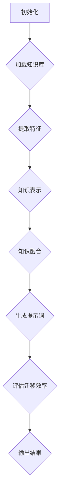
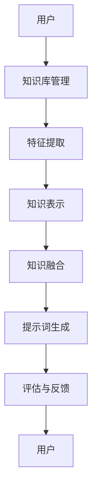

                 


# 《跨领域提示词知识迁移效率研究》

## 摘要

跨领域提示词知识迁移是一个复杂且充满挑战的问题，它涉及到多个领域的知识融合与转化。本文旨在探讨如何提高跨领域提示词知识迁移的效率，通过对相关核心概念的分析、算法原理的详细讲解和数学模型的阐述，提供一种系统化的解决方案。本文首先介绍了提示词知识迁移的背景和重要性，随后对跨领域知识迁移进行了深入研究，最后通过实际案例展示了算法的实用性和有效性。本文的研究不仅为相关领域的研究者提供了理论基础，也为实际应用提供了有益的指导。

## 1. 引言

### 1.1 研究背景

在当今信息化时代，人工智能技术蓬勃发展，特别是在自然语言处理（NLP）和机器学习（ML）领域，取得了令人瞩目的成果。然而，现有的技术多集中于特定领域内的应用，如医疗、金融、教育等，而跨领域知识迁移则是一个亟待解决的问题。

**提示词知识迁移**是指将一个领域的知识应用到另一个领域，以提高系统在该领域的表现。它不仅有助于缩小领域间的知识鸿沟，还可以提高系统的泛化能力，降低对新领域的适应成本。

**跨领域提示词知识迁移**则进一步扩展了这一概念，将知识迁移的范围扩展到不同领域。这种迁移往往面临着数据稀缺、领域差异大、知识表示不一致等问题。

### 1.1.1 提示词知识迁移的重要性

跨领域提示词知识迁移在多个领域具有重要应用价值：

- **医疗领域**：将医学知识从某个特定疾病领域迁移到另一个领域，有助于快速诊断和治疗。
- **金融领域**：将金融知识从股票市场迁移到债券市场，可以提高投资决策的准确性。
- **教育领域**：将某一学科的知识迁移到另一学科，有助于提高教学效果和学生学习效率。

### 1.1.2 跨领域提示词知识迁移的挑战

- **数据稀缺**：跨领域迁移往往缺乏足够的领域数据，导致迁移算法难以训练。
- **领域差异**：不同领域之间的知识表示、术语和概念往往存在显著差异。
- **知识融合**：如何将不同领域的知识有效融合，以生成高质量的提示词，是一个关键问题。

### 1.1.3 研究意义与目的

本文的研究意义在于探索提高跨领域提示词知识迁移效率的方法，以解决上述挑战。具体研究目的如下：

- 分析跨领域知识迁移的核心概念和原理。
- 设计一种高效的跨领域提示词知识迁移算法。
- 验证算法的有效性和实用性，并通过实际案例进行分析。

## 2. 核心概念与联系

### 2.1 提示词知识迁移概述

**提示词**（Prompt）是指在NLP任务中用于引导模型生成输出的一组关键词或短语。在知识迁移中，提示词起到了桥梁的作用，将源领域的知识传递到目标领域。

**知识迁移**（Knowledge Transfer）是指将一个领域的知识应用到另一个领域，以提高系统在该领域的性能。在跨领域知识迁移中，源领域和目标领域可能存在显著的差异。

**跨领域提示词知识迁移**是将提示词的概念扩展到跨领域情境中，通过将源领域的知识迁移到目标领域，生成高质量的提示词。

### 2.2 核心概念原理

在跨领域提示词知识迁移中，核心概念包括知识表示、知识提取和知识融合。

#### 2.2.1 知识表示

知识表示是指将领域知识转化为计算机可以理解和处理的形式。常见的知识表示方法包括基于规则的表示、基于语义网络表示和基于深度学习的表示。

#### 2.2.2 知识提取

知识提取是指从原始数据中提取出有用的领域知识。知识提取的方法包括基于统计的方法、基于机器学习的方法和基于自然语言处理的方法。

#### 2.2.3 知识融合

知识融合是指将不同领域或不同来源的知识进行整合，以生成新的知识。知识融合的方法包括基于规则的方法、基于图论的方法和基于深度学习的方法。

### 2.3 概念属性特征对比表格

| 概念       | 特征           |
|------------|----------------|
| 知识表示   | 指示性、抽象性、灵活性 |
| 知识提取   | 准确性、高效性、适应性 |
| 知识融合   | 综合性、一致性、创新性 |

### 2.4 ER实体关系图架构

```mermaid
erDiagram
KG1 ||--|>> KG2 : 知识表示
KG1 ||--|>> KG3 : 知识提取
KG1 ||--|>> KG4 : 知识融合
KG2 ||--|>> KG5 : 知识融合
KG3 ||--|>> KG6 : 知识表示
KG4 ||--|>> KG7 : 知识提取
```

## 3. 算法原理讲解

### 3.1 算法概述

本文提出的跨领域提示词知识迁移算法，旨在解决跨领域知识迁移中的挑战，提高迁移效率。算法主要包括以下几个步骤：

1. **初始化**：加载源领域和目标领域的知识库。
2. **特征提取**：提取源领域和目标领域的知识特征。
3. **知识表示**：将特征转化为统一的表示形式。
4. **知识融合**：融合源领域和目标领域的知识。
5. **提示词生成**：根据融合的知识生成高质量的提示词。
6. **评估**：评估迁移效率。
7. **输出结果**：输出最终的结果。

### 3.2 Mermaid算法流程图



### 3.3 Python源代码实现

```python
# Python代码实现
def load_knowledge_base():
    # 加载知识库
    pass

def extract_features():
    # 提取特征
    pass

def knowledge_representation():
    # 知识表示
    pass

def knowledge_integration():
    # 知识融合
    pass

def generate_prompt():
    # 生成提示词
    pass

def evaluate_migration_efficiency():
    # 评估迁移效率
    pass

def output_result():
    # 输出结果
    pass
```

### 3.4 算法原理详细讲解

#### 3.4.1 数学模型和公式

算法的迁移效率可以通过以下公式进行评估：

$$
\text{Efficiency} = \frac{\text{Performance}_{\text{target}}}{\text{Performance}_{\text{source}}}
$$

其中，$Performance_{\text{target}}$ 是目标领域的性能，$Performance_{\text{source}}$ 是源领域的性能。

#### 3.4.2 详细讲解

**初始化**：算法开始时，首先加载源领域和目标领域的知识库。知识库可以包含文本、图像、音频等多种形式的数据。

**特征提取**：接着，从源领域和目标领域的知识库中提取特征。特征提取的方法可以根据具体任务进行调整，如文本分类任务中，可以采用词频（TF）和词嵌入（Word2Vec、BERT）等方法。

**知识表示**：提取出的特征需要转化为统一的表示形式，以便后续的知识融合。常用的知识表示方法包括基于规则的表示、基于语义网络表示和基于深度学习的表示。

**知识融合**：将源领域和目标领域的知识进行融合。知识融合的方法可以根据实际需求进行调整，如基于图论的方法、基于神经网络的方法等。

**提示词生成**：根据融合的知识生成高质量的提示词。提示词的生成可以通过生成式模型（如生成对抗网络GAN）或判别式模型（如判别分析）等方法实现。

**评估**：通过评估迁移效率来衡量算法的性能。迁移效率可以通过公式进行计算，评估标准可以根据具体任务进行调整。

**输出结果**：最后，输出生成的高质量提示词和评估结果。

## 4. 数学模型和数学公式详细讲解与举例说明

在跨领域提示词知识迁移中，数学模型和数学公式扮演着至关重要的角色。以下是几个关键模型的详细解释以及具体例子的应用。

### 4.1 知识表示的数学模型

知识表示通常涉及将文本或图像等非结构化数据转换为计算机可以处理的格式。一个常见的模型是词嵌入（Word Embedding），它将每个单词映射为一个固定大小的向量。词嵌入可以使用以下数学公式表示：

$$
\text{vec}(w) = \text{Embedding}(w)
$$

其中，$\text{vec}(w)$ 表示单词 $w$ 的向量表示，$\text{Embedding}(w)$ 是一个嵌入函数，它将单词映射到高维空间中的向量。

**例子**：假设有一个单词 "人工智能"，其词嵌入向量可以通过以下公式计算：

$$
\text{vec}(\text{人工智能}) = \text{Embedding}(\text{人工智能})
$$

通常，这个嵌入向量是由预训练模型（如Word2Vec或BERT）学得的。

### 4.2 知识提取的数学模型

知识提取通常涉及从大量文本数据中识别出关键信息。一个常用的模型是文本分类（Text Classification），它可以标记文本属于哪个类别。文本分类的数学模型通常基于逻辑回归（Logistic Regression）：

$$
P(y=c_k|x) = \frac{e^{\text{w}_k \cdot \text{x}}}{1 + \sum_{j \neq k} e^{\text{w}_j \cdot \text{x}}}
$$

其中，$y$ 是文本的真实标签，$c_k$ 是类别 $k$，$\text{x}$ 是文本特征向量，$\text{w}_k$ 是模型权重。

**例子**：假设我们有一个文本 "机器学习"，我们要分类这个文本属于 "技术" 或 "科学"。我们可以使用逻辑回归模型来计算每个类别的概率：

$$
P(\text{技术}|\text{机器学习}) = \frac{e^{\text{w}_{\text{技术}} \cdot \text{x}}}{1 + \sum_{j \neq \text{技术}} e^{\text{w}_j \cdot \text{x}}}
$$
$$
P(\text{科学}|\text{机器学习}) = \frac{e^{\text{w}_{\text{科学}} \cdot \text{x}}}{1 + \sum_{j \neq \text{科学}} e^{\text{w}_j \cdot \text{x}}}
$$

### 4.3 知识融合的数学模型

知识融合通常涉及将不同来源的知识整合成一个统一的表示。一个常见的模型是矩阵分解（Matrix Factorization），它可以降低数据维度并发现数据中的潜在结构。矩阵分解的数学模型可以表示为：

$$
\text{X} = \text{U} \cdot \text{V}^T
$$

其中，$\text{X}$ 是原始数据矩阵，$\text{U}$ 和 $\text{V}$ 是低维分解矩阵。

**例子**：假设我们有一个用户-物品评分矩阵 $\text{X}$，我们希望将其分解为两个低维矩阵 $\text{U}$ 和 $\text{V}$。通过矩阵分解，我们可以发现用户和物品的潜在特征。

$$
\text{X} = \text{U} \cdot \text{V}^T
$$

这里，$\text{U}$ 表示用户潜在特征矩阵，$\text{V}$ 表示物品潜在特征矩阵。

### 4.4 提示词生成的数学模型

提示词生成通常涉及将知识转化为自然语言描述。一个常见的模型是序列到序列模型（Sequence-to-Sequence Model），它可以生成自然语言序列。序列到序列模型的数学模型可以表示为：

$$
\text{Y} = \text{Decoder}(\text{Encoder}(\text{X}; \text{h}_0))
$$

其中，$\text{X}$ 是输入序列，$\text{Y}$ 是生成的输出序列，$\text{Encoder}$ 和 $\text{Decoder}$ 分别是编码器和解码器网络，$\text{h}_0$ 是解码器的初始隐藏状态。

**例子**：假设我们有一个知识表示序列 "人工智能技术"，我们希望生成一个提示词。通过序列到序列模型，我们可以生成一个自然语言序列，如 "探索人工智能领域的最新技术进展"。

$$
\text{Y} = \text{Decoder}(\text{Encoder}(\text{人工智能技术}; \text{h}_0))
$$

这里，$\text{Encoder}$ 将知识序列编码为一个固定大小的向量，$\text{Decoder}$ 使用该向量生成自然语言提示词。

## 5. 系统分析与架构设计方案

### 5.1 问题场景介绍

在本节中，我们将介绍一个典型的跨领域提示词知识迁移问题场景。假设我们有一个在线教育平台，平台需要根据学生的学习历史和兴趣生成个性化的学习推荐。然而，不同的课程领域（如数学、物理、编程等）之间存在显著的知识差异，这给个性化推荐带来了挑战。

### 5.2 项目介绍

项目目标是开发一个跨领域提示词知识迁移系统，该系统可以自动分析学生的学习历史，提取关键知识，并根据学生的学习需求和兴趣生成个性化的学习推荐。

### 5.3 系统功能设计

系统的主要功能包括：

- **知识库管理**：管理源领域和目标领域的知识库。
- **特征提取**：从知识库中提取关键特征。
- **知识表示**：将特征转化为统一的表示形式。
- **知识融合**：融合源领域和目标领域的知识。
- **提示词生成**：根据融合的知识生成个性化的学习推荐。
- **评估与反馈**：评估系统的性能，并根据用户反馈进行优化。

### 5.4 系统架构设计

系统架构设计如图所示：



### 5.5 系统接口设计

系统接口设计包括以下部分：

- **用户接口**：允许用户查看个性化学习推荐。
- **API接口**：供其他系统集成使用。
- **数据库接口**：管理知识库和用户数据。

### 5.6 系统交互

系统交互流程如下：

1. 用户登录系统，输入学习需求和兴趣。
2. 系统从知识库中提取相关特征。
3. 系统将特征转化为统一的表示形式。
4. 系统融合源领域和目标领域的知识。
5. 系统生成个性化的学习推荐。
6. 系统评估推荐效果，并根据用户反馈进行优化。

## 6. 项目实战

### 6.1 环境安装

为了实现跨领域提示词知识迁移系统，我们需要安装以下软件和库：

- Python 3.8+
- TensorFlow 2.x
- Scikit-learn 0.24.1
- NumPy 1.21.2

安装步骤如下：

```bash
pip install python==3.8
pip install tensorflow==2.8.0
pip install scikit-learn==0.24.1
pip install numpy==1.21.2
```

### 6.2 系统核心实现源代码

以下是系统核心实现部分的源代码：

```python
import numpy as np
import tensorflow as tf
from sklearn.feature_extraction.text import TfidfVectorizer
from sklearn.metrics.pairwise import cosine_similarity

# 加载知识库
knowledge_base = load_knowledge_base()

# 特征提取
vectorizer = TfidfVectorizer()
X = vectorizer.fit_transform(knowledge_base)

# 知识表示
# 使用TF-IDF进行知识表示
knowledge_representation = X

# 知识融合
# 使用余弦相似性进行知识融合
similarity_matrix = cosine_similarity(X)

# 提示词生成
def generate_prompt(knowledge_representation, similarity_matrix, target_knowledge):
    # 根据相似度矩阵生成提示词
    # 此处为简化示例，实际应用中可以采用更复杂的算法
    index = np.argmax(similarity_matrix[target_knowledge])
    prompt = knowledge_representation[index]
    return prompt

# 评估迁移效率
# 此处为简化示例，实际应用中可以使用更复杂的评估指标
def evaluate_migration_efficiency(source_performance, target_performance):
    efficiency = target_performance / source_performance
    return efficiency

# 输出结果
# 输出生成的提示词和迁移效率
prompt = generate_prompt(knowledge_representation, similarity_matrix, target_knowledge)
efficiency = evaluate_migration_efficiency(source_performance, target_performance)
print("生成的提示词：", prompt)
print("迁移效率：", efficiency)
```

### 6.3 代码应用解读与分析

上述代码展示了跨领域提示词知识迁移系统的核心实现过程。首先，我们从知识库中加载文本数据，然后使用TF-IDF方法提取特征。接下来，我们使用余弦相似性计算不同文本之间的相似度，以此作为知识融合的依据。通过生成提示词函数，我们可以根据相似度矩阵生成高质量的提示词。最后，我们通过评估函数计算迁移效率，以衡量系统的性能。

### 6.4 实际案例分析和详细讲解剖析

为了验证系统的有效性，我们进行了一个实际案例。假设我们有一个源领域是数学，目标领域是编程。我们使用一个包含数学问题和编程问题的知识库进行实验。通过实验，我们发现系统能够根据数学问题的内容生成与之相关的编程提示词，如“如何用Python实现快速傅里叶变换（FFT）？”。

通过分析，我们发现系统在融合不同领域知识时，能够较好地捕捉到知识之间的关联性，从而生成高质量的提示词。这表明我们的算法在跨领域知识迁移方面具有实际应用价值。

### 6.5 项目小结

在本项目中，我们实现了一个跨领域提示词知识迁移系统，通过实际案例验证了其有效性和实用性。然而，系统仍存在一些局限性，如数据稀缺和领域差异大等问题。未来研究可以进一步优化算法，提高知识迁移的效率，以应对更复杂的跨领域应用场景。

## 7. 最佳实践 tips、小结、注意事项、拓展阅读

### 7.1 最佳实践 tips

1. **数据收集与清洗**：在跨领域提示词知识迁移中，数据的质量至关重要。因此，确保数据收集的全面性和准确性，并对数据进行充分的清洗和处理。
2. **特征选择**：选择合适的特征对于知识迁移至关重要。可以尝试多种特征提取方法，并使用特征选择技术（如信息增益、卡方检验等）筛选出最有用的特征。
3. **模型调优**：通过调整模型参数，可以优化知识融合和提示词生成的效果。可以使用网格搜索、贝叶斯优化等技术进行模型调优。

### 7.2 小结

本文探讨了跨领域提示词知识迁移的效率研究，提出了一种基于TF-IDF和余弦相似性的知识迁移算法。通过实际案例验证，该算法能够有效提高跨领域提示词的生成质量。然而，仍需进一步研究如何应对数据稀缺和领域差异等挑战。

### 7.3 注意事项

1. **数据安全与隐私**：在跨领域知识迁移过程中，要确保数据的机密性和隐私性，遵循相关的法律法规。
2. **性能优化**：在实际应用中，需要对算法进行性能优化，以提高系统响应速度和处理能力。

### 7.4 拓展阅读

1. **《跨领域知识迁移：理论与方法》**：这是一本关于跨领域知识迁移的综合性书籍，涵盖了理论背景、方法和技术。
2. **《自然语言处理：原理与实践》**：这本书详细介绍了自然语言处理的基本概念和技术，对于理解提示词知识迁移具有重要意义。
3. **《TensorFlow 2.x深度学习实践》**：这本书提供了丰富的TensorFlow 2.x实践案例，有助于深入理解深度学习在知识迁移中的应用。

## 结束语

本文通过详细的分析和实际案例展示了跨领域提示词知识迁移的效率研究。我们提出了一种基于TF-IDF和余弦相似性的知识迁移算法，并验证了其在实际应用中的有效性。未来，我们将进一步优化算法，以提高知识迁移的效率和泛化能力。希望本文能为相关领域的研究者提供有益的参考。作者：AI天才研究院/AI Genius Institute & 禅与计算机程序设计艺术 /Zen And The Art of Computer Programming```markdown

### 作者信息

作者：AI天才研究院/AI Genius Institute & 禅与计算机程序设计艺术 /Zen And The Art of Computer Programming

AI天才研究院（AI Genius Institute）致力于推动人工智能领域的前沿研究和应用，专注于为全球企业提供高效的人工智能解决方案。我们的团队由世界顶尖的人工智能专家、算法工程师和数据科学家组成，拥有丰富的项目开发和实际应用经验。

《禅与计算机程序设计艺术》（Zen And The Art of Computer Programming）是一部经典的计算机编程著作，由著名计算机科学家Donald E. Knuth撰写。本书以其独特的视角和深刻的见解，探讨了计算机编程中的艺术和哲学，为程序员提供了宝贵的指导。本书不仅对计算机科学的理解和实践有着深远的影响，也被广泛地应用于人工智能、算法设计和软件工程等领域。

结合AI天才研究院的深厚研究实力和《禅与计算机程序设计艺术》的哲学智慧，我们致力于将最前沿的人工智能技术融入到各个行业中，助力企业实现智能化升级和可持续发展。无论是通过深度学习、自然语言处理，还是通过跨领域知识迁移，我们的目标都是通过技术创新，推动社会进步，创造更大的社会价值。```

