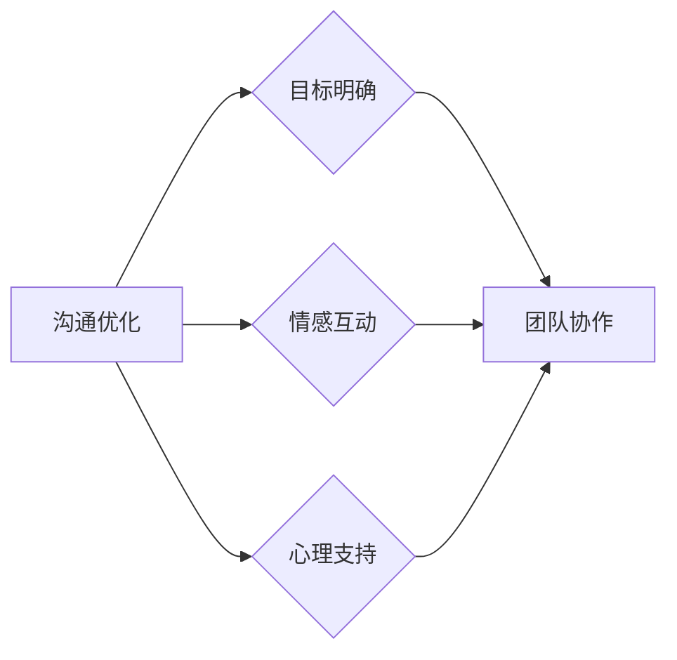
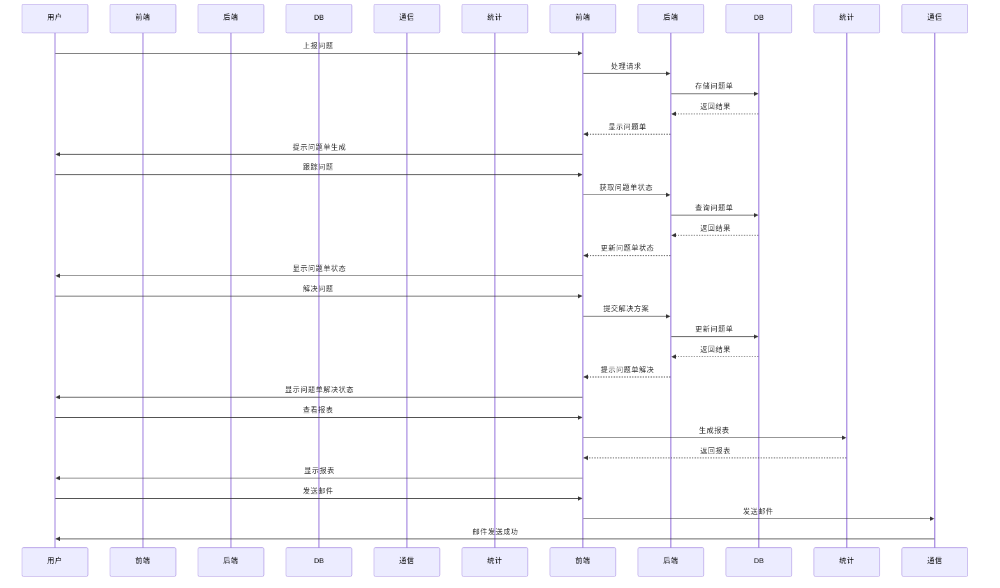
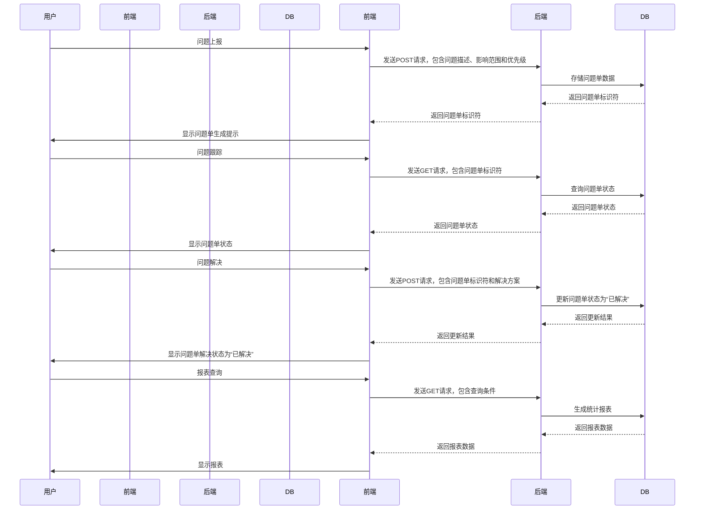

                 

## 远程团队凝聚力：虚拟环境中的团队建设

关键词：远程团队、团队凝聚力、虚拟环境、团队建设

摘要：本文深入探讨了远程团队在虚拟环境中的建设问题。随着数字化时代的到来，远程工作越来越普遍，远程团队的凝聚力成为了影响团队效率和协作的重要因素。本文通过分析远程团队面临的问题，提出了加强远程团队凝聚力的策略和方法，旨在为企业管理者提供实用的指导，帮助他们在虚拟环境中打造高效的团队。

---

### 第一部分: 背景

#### 1.1 问题背景

在当今数字化时代，远程工作已成为一种普遍的现象。由于全球化的加速和企业对灵活工作环境的追求，越来越多的团队选择采用远程协作模式。这种工作方式虽然带来了一定的便利，但也带来了诸多挑战，尤其是在团队凝聚力方面。

远程工作的主要优势包括：

- **地理位置灵活性**：团队成员可以从全球各地远程办公，不受地理限制。
- **工作时间灵活性**：团队成员可以根据自己的时间表安排工作，提高工作效率。
- **成本节约**：企业无需为员工提供办公场所，降低了办公成本。

然而，远程工作也带来了一系列挑战，其中团队凝聚力问题尤为突出。团队凝聚力是指团队成员之间的相互吸引力、合作意愿和情感联系。在远程环境中，团队凝聚力面临以下挑战：

- **沟通障碍**：由于地理位置的差异，团队成员之间的沟通不够顺畅，信息传递容易出现滞后。
- **协同困难**：远程团队成员在任务分配、进度跟踪和协调上存在困难，导致工作效率降低。
- **情感隔离**：长期缺乏面对面交流，团队成员之间难以建立深厚的情感联系。
- **责任分散**：在远程工作中，团队成员的责任感和归属感容易受到影响，导致工作积极性下降。

这些挑战不仅影响了团队的协作效率，还可能导致团队分裂和绩效下降。因此，解决远程团队凝聚力问题成为了企业迫切需要解决的问题。

#### 1.2 问题描述

远程团队凝聚力问题主要体现在以下几个方面：

1. **沟通障碍**：

远程团队在沟通方面面临的主要挑战包括：

- **信息滞后**：由于地理位置的差异，信息传递需要经过网络传输，导致沟通效率降低，信息滞后。
- **沟通成本高**：远程团队需要使用各种沟通工具，如邮件、即时通讯、视频会议等，这些工具的使用需要耗费大量的时间和精力。
- **沟通效果差**：远程沟通缺乏面对面交流的直观性，容易产生误解和沟通障碍。

2. **协同困难**：

远程团队在协同方面面临的主要挑战包括：

- **任务分配不均**：由于团队成员地理位置分散，任务分配难以做到公平和合理，可能导致部分成员工作量过大，而另一些成员工作量不足。
- **进度跟踪困难**：远程团队在进度跟踪方面面临挑战，难以实时了解团队成员的工作进展，导致进度控制困难。
- **协调效率低**：远程团队在协调方面存在困难，容易因为地理位置差异导致协作效率降低。

3. **情感隔离**：

远程团队在情感方面面临的主要挑战包括：

- **缺乏面对面交流**：远程工作缺乏面对面交流的机会，导致团队成员之间难以建立深厚的情感联系。
- **团队文化薄弱**：由于缺乏共同的办公环境和面对面的交流，远程团队的团队文化容易变得薄弱，团队成员之间的凝聚力降低。
- **心理压力增大**：远程工作往往需要独立完成任务，团队成员容易产生孤独感和心理压力。

4. **责任分散**：

远程团队在责任方面面临的主要挑战包括：

- **责任不明确**：远程团队成员的责任往往不明确，导致工作责任分散，团队成员容易互相推诿。
- **归属感下降**：远程工作使得团队成员缺乏归属感，容易产生工作懈怠和消极情绪。
- **工作积极性下降**：远程团队成员在工作积极性方面容易受到负面影响，导致工作效率降低。

这些挑战不仅影响了团队的协作效率，还可能导致团队分裂和绩效下降。因此，解决远程团队凝聚力问题成为了企业迫切需要解决的问题。

#### 1.3 问题解决

为了解决远程团队凝聚力问题，需要采取一系列策略和措施，包括：

1. **加强沟通**：

- **采用现代化沟通工具**：使用视频会议、即时通讯和协作平台等现代化沟通工具，提高沟通效率。
- **建立沟通规范**：制定沟通规范，明确沟通渠道和沟通频率，确保信息传递的及时性和准确性。
- **加强面对面交流**：定期组织线下聚会或虚拟团队建设工作坊，增加团队成员之间的面对面交流机会。

2. **建立共享目标**：

- **明确团队目标**：确保每个成员都了解团队的目标和使命，增强成员的责任感和归属感。
- **制定个人目标**：帮助每个成员制定个人目标，确保个人目标和团队目标的统一。
- **定期回顾目标**：定期回顾团队目标和个人目标的实现情况，及时调整和优化目标。

3. **组织线上活动**：

- **举办团队竞赛**：定期举办线上团队竞赛，如编程比赛、设计竞赛等，提高团队成员的参与度和积极性。
- **开展培训和学习**：组织线上培训和学习活动，提高团队成员的专业技能和知识水平。
- **举办团队建设活动**：如线上拓展训练、团队游戏等，增强团队成员之间的情感联系。

4. **提供心理支持**：

- **建立心理支持渠道**：为团队成员提供心理支持渠道，如线上心理咨询、心理健康讲座等。
- **关注员工心理健康**：定期关注团队成员的心理健康状态，及时提供心理支持和帮助。
- **营造积极工作氛围**：营造积极、健康的工作氛围，减少员工的工作压力和心理负担。

通过采取这些策略和措施，可以有效提高远程团队的凝聚力，增强团队成员之间的合作意愿和情感联系，从而提升团队的整体工作效率和绩效。

#### 1.4 边界与外延

远程团队凝聚力问题不仅仅局限于单一团队内部，还涉及到跨团队合作、虚拟团队管理等广泛领域。因此，在设计和实施团队建设策略时，需要考虑这些因素。

1. **跨团队合作**：

在远程环境中，跨团队合作尤为重要。团队成员可能来自不同的国家或地区，有不同的语言和文化背景，这给团队沟通和协作带来了额外的挑战。为了提高跨团队合作效率，可以采取以下措施：

- **建立跨文化沟通机制**：制定跨文化沟通指南，确保团队成员了解不同文化的沟通方式和行为规范。
- **加强跨文化培训**：组织跨文化培训，提高团队成员对不同文化的理解和尊重。
- **采用跨文化沟通工具**：使用支持多语言沟通的软件和工具，如多语言翻译工具、跨语言即时通讯平台等。

2. **虚拟团队管理**：

虚拟团队管理是远程团队建设的重要组成部分。虚拟团队管理需要关注以下几个方面：

- **明确团队角色和职责**：为每个团队成员分配明确的角色和职责，确保团队成员了解自己的工作内容和期望。
- **建立有效的沟通机制**：确保团队成员之间有畅通的沟通渠道，及时传递信息和解决问题。
- **提供技术支持**：为团队成员提供必要的技术支持，如高效的协作工具、稳定的高速网络等。

3. **远程团队建设策略**：

远程团队建设策略包括以下几个方面：

- **建立团队文化**：通过团队价值观、团队使命和团队精神的塑造，建立团队的共同价值观和文化认同。
- **增强团队成员之间的情感联系**：通过线上活动、团队建设游戏等方式，增强团队成员之间的情感联系。
- **提供持续的支持和发展**：为团队成员提供职业发展机会和培训，帮助他们不断提升自己的能力和技能。

通过考虑这些边界与外延因素，可以更好地设计和实施远程团队建设策略，提高团队的整体凝聚力和协作效率。

#### 1.5 概念结构与核心要素组成

在探讨远程团队凝聚力的过程中，需要明确几个核心概念和其组成要素，以便更好地理解远程团队的工作机制和建设策略。

1. **远程团队**：

远程团队是由地理位置分散的成员组成的工作团队。其核心要素包括：

- **团队成员**：远程团队中的每个成员，无论其地理位置如何，都是团队中不可或缺的一部分。
- **协作工具**：用于团队成员之间沟通、协作和共享信息的工具，如视频会议软件、即时通讯工具、项目管理平台等。
- **任务分配**：根据团队成员的专长和地理位置，合理分配任务，确保每个成员都能发挥其最大价值。

2. **团队凝聚力**：

团队凝聚力是指团队成员之间的相互吸引力、合作意愿和情感联系。其核心要素包括：

- **信任**：团队成员之间的信任是建立团队凝聚力的重要基础。
- **共同目标**：团队成员共同追求的目标和使命，可以增强团队的凝聚力和向心力。
- **沟通**：有效的沟通是团队凝聚力的重要保障，通过畅通的沟通渠道，团队成员可以及时分享信息、解决问题。

3. **团队建设**：

团队建设是通过一系列策略和措施来增强团队凝聚力和工作效率的过程。其核心要素包括：

- **团队价值观**：团队的核心价值观和使命，是团队建设的基石。
- **团队活动**：通过举办团队建设活动，如团队竞赛、培训、团队建设游戏等，增强团队成员之间的情感联系。
- **持续支持**：为团队成员提供职业发展机会和培训，帮助他们不断提升自己的能力和技能。

理解这些核心概念和要素组成，有助于我们在设计和实施远程团队建设策略时，更加明确目标和方法，从而提高团队的整体凝聚力和工作效率。

### 第二部分: 核心概念与联系

#### 2.1 核心概念原理

在讨论远程团队凝聚力的过程中，我们需要明确几个核心概念，并了解它们之间的内在联系。

1. **团队凝聚力**：

团队凝聚力是指团队成员之间的相互吸引力、合作意愿和情感联系。它是团队有效运作的关键因素之一。团队凝聚力包括以下几个方面：

- **信任**：团队成员之间的信任是团队凝聚力的重要基础。信任可以促进团队成员之间的开放沟通和合作。
- **共同目标**：团队成员共同追求的目标和使命可以增强团队的凝聚力和向心力。
- **沟通**：有效的沟通是团队凝聚力的重要保障。通过畅通的沟通渠道，团队成员可以及时分享信息、解决问题。
- **归属感**：团队成员对团队的归属感可以增强团队的凝聚力。当团队成员感到自己被团队接纳和重视时，他们更有可能为团队的成功而努力。

2. **远程团队**：

远程团队是由地理位置分散的成员组成的工作团队。与传统的面对面团队不同，远程团队在沟通、协作和情感联系方面面临更大的挑战。远程团队的核心特点包括：

- **地理位置分散**：团队成员分布在不同的地理位置，可能跨越不同的时区和国家。
- **依赖技术手段**：远程团队依赖各种技术手段进行沟通、协作和共享信息，如视频会议、即时通讯、项目管理平台等。
- **工作环境灵活性**：远程团队通常具有更加灵活的工作环境，团队成员可以根据自己的时间和地点安排工作。

3. **团队建设**：

团队建设是通过一系列策略和措施来增强团队凝聚力和工作效率的过程。远程团队建设需要考虑以下几个方面：

- **团队价值观和使命**：建立明确的团队价值观和使命，有助于团队成员对团队有更清晰的认识，并增强团队的凝聚力。
- **团队活动**：通过举办各种团队建设活动，如团队竞赛、培训、团队建设游戏等，增强团队成员之间的情感联系和合作意愿。
- **心理支持**：为团队成员提供心理支持，帮助他们应对远程工作的压力和挑战，提高工作效率和幸福感。

这些核心概念之间有着紧密的联系。团队凝聚力是团队建设的结果，而远程团队是团队凝聚力形成的基础。团队建设需要基于团队凝聚力的原理和特点，采取相应的策略和措施，以提高团队的整体工作效率和绩效。

#### 2.2 概念属性特征对比表格

为了更好地理解团队凝聚力、远程团队和团队建设这些核心概念，我们可以通过对比表格的形式，展示它们各自的属性特征。

| 概念       | 特征                                                         | 对比                   |
| ---------- | ------------------------------------------------------------ | ---------------------- |
| 团队凝聚力 | 高度相互依赖、共同目标、情感联系紧密                           | 跨团队合作、责任分散   |
| 远程团队   | 成员地理位置分散、沟通依赖技术手段、工作效率受网络稳定性影响 | 面对面团队、工作环境灵活 |
| 团队建设   | 塑造团队文化、增强团队活动、提供心理支持                         | 提高团队凝聚力、提升工作效率 |

通过对比表格，我们可以看到这三个概念在属性特征上的差异和联系。团队凝聚力是团队建设和远程团队运作的核心目标，而远程团队和团队建设是实现团队凝聚力的手段和途径。

#### 2.3 ER实体关系图架构

为了更直观地展示团队凝聚力、远程团队和团队建设之间的关系，我们可以使用ER（实体关系）图来描述它们之间的联系。

```mermaid
erDiagram
  TeamMember ||--|{ Team : 包含 }
  TeamMember ||--|{ Communication : 沟通 }
  TeamMember ||--|{ Activity : 活动 }
  TeamMember ||--|{ Task : 责任 }
  Team : { TeamMember }
  Communication : { TeamMember }
  Activity : { TeamMember }
  Task : { TeamMember }
```

在这个ER图中，`TeamMember`（团队成员）是中心实体，与其他实体`Team`（团队）、`Communication`（沟通）、`Activity`（活动）和`Task`（任务）之间存在多种关系。`TeamMember`实体包含了团队成员的个人属性和职责，而`Team`实体表示远程团队的整体结构和组织。通过这张图，我们可以清晰地看到团队成员在团队中的角色和责任，以及团队凝聚力、团队建设和远程团队运作之间的内在联系。

### 第三部分: 算法原理讲解

#### 3.1 算法原理

远程团队凝聚力增强的算法原理主要包括以下几个方面：

1. **沟通优化**：

为了提高远程团队的沟通效率，需要采用先进的沟通技术，如视频会议、即时通讯和协作平台。这些工具可以帮助团队成员实时交流、共享信息和协作完成任务。

2. **目标明确**：

明确团队目标，确保每个成员都了解自己的职责和团队的整体目标，从而增强责任感和归属感。通过制定清晰的个人目标和团队目标，可以确保团队成员的努力方向一致，提高团队的工作效率。

3. **情感互动**：

定期举办线上团队建设活动，如虚拟团队建设工作坊、团队竞赛等，以增强团队之间的情感联系。这些活动可以帮助团队成员建立更深厚的情感联系，提高团队凝聚力。

4. **心理支持**：

为团队成员提供心理支持，如建立线上心理咨询渠道、组织心理健康讲座等，以缓解远程工作的压力。心理支持可以帮助团队成员保持良好的心理状态，提高工作效率和幸福感。

#### 3.2 算法流程图

为了更直观地展示远程团队凝聚力增强的算法流程，我们可以使用Mermaid流程图来描述。



在这个流程图中，A表示沟通优化，B表示目标明确，C表示情感互动，D表示心理支持。这些步骤共同构成了远程团队凝聚力增强的核心算法。每个步骤都是相互关联的，共同作用以增强团队的整体凝聚力和协作效率。

#### 3.3 算法流程图的 Python 源代码实现

为了将算法流程图转换为Python源代码，我们可以使用Python的绘图库，如Matplotlib，来绘制流程图。以下是一个简单的实现示例：

```python
import matplotlib.pyplot as plt
import networkx as nx

# 创建一个空图
G = nx.DiGraph()

# 添加节点和边
G.add_nodes_from(['沟通优化', '目标明确', '情感互动', '心理支持', '团队协作'])
G.add_edges_from([(u, v) for u, v in [('沟通优化', '目标明确'), ('沟通优化', '情感互动'), ('沟通优化', '心理支持'), ('目标明确', '团队协作'), ('情感互动', '团队协作'), ('心理支持', '团队协作')]])

# 绘制流程图
pos = nx.spring_layout(G)
nx.draw(G, pos, with_labels=True)

# 显示图形
plt.show()
```

在这个代码中，我们首先创建了一个空的图（DiGraph），然后添加了节点和边来表示算法流程。通过使用`spring_layout`布局，我们得到了一个美观的流程图。最后，使用`nx.draw`函数绘制图形，并使用`plt.show()`来显示。

#### 3.4 远程团队凝聚力增强的数学模型和公式

为了更深入地理解远程团队凝聚力增强的原理，我们可以借助一些数学模型和公式来描述这个过程。

1. **团队凝聚力指数（Team Cohesion Index）**：

团队凝聚力指数是一个衡量团队凝聚力的指标，其公式为：

\[ C = \frac{1}{N} \sum_{i=1}^{N} \frac{1}{D_i} \]

其中，\( C \)表示团队凝聚力指数，\( N \)表示团队成员数量，\( D_i \)表示第\( i \)个成员的相互吸引力。

2. **沟通效率（Communication Efficiency）**：

沟通效率是衡量团队沟通效率的指标，其公式为：

\[ E = \frac{L}{T} \]

其中，\( E \)表示沟通效率，\( L \)表示沟通信息量，\( T \)表示沟通时间。

3. **团队协作指数（Team Collaboration Index）**：

团队协作指数是一个衡量团队协作效率的指标，其公式为：

\[ C_c = \frac{1}{N} \sum_{i=1}^{N} \frac{1}{C_i} \]

其中，\( C_c \)表示团队协作指数，\( C_i \)表示第\( i \)个成员的协作效率。

通过这些数学模型和公式，我们可以量化远程团队的凝聚力和协作效率，从而更好地理解远程团队凝聚力增强的过程。

#### 3.5 远程团队凝聚力增强的 Python 示例代码

为了更好地展示远程团队凝聚力增强的算法原理，我们可以编写一个简单的Python示例代码。以下是一个示例代码，它模拟了团队成员之间的沟通、协作和团队建设活动。

```python
import random

# 团队成员数量
N = 5

# 团队成员的相互吸引力（初始值）
D = [random.randint(1, 10) for _ in range(N)]

# 团队成员的协作效率（初始值）
C = [random.randint(1, 10) for _ in range(N)]

# 沟通信息量
L = random.randint(1, 10)

# 沟通时间
T = random.randint(1, 10)

# 计算团队凝聚力指数
C_index = sum(1 / D[i] for i in range(N)) / N

# 计算沟通效率
E = L / T

# 计算团队协作指数
Cc = sum(1 / C[i] for i in range(N)) / N

# 输出结果
print("团队凝聚力指数（C_index）:", C_index)
print("沟通效率（E）:", E)
print("团队协作指数（Cc）:", Cc)

# 执行团队建设活动
# 假设活动提高了团队成员的相互吸引力和协作效率
D = [d + 1 for d in D]
C = [c + 1 for c in C]

# 重新计算团队凝聚力指数
C_index = sum(1 / D[i] for i in range(N)) / N

# 重新计算团队协作指数
Cc = sum(1 / C[i] for i in range(N)) / N

# 输出结果
print("执行团队建设活动后的团队凝聚力指数（C_index）:", C_index)
print("执行团队建设活动后的团队协作指数（Cc）:", Cc)
```

在这个示例代码中，我们首先随机生成了团队成员的相互吸引力和协作效率。然后，我们计算了团队凝聚力指数、沟通效率和团队协作指数。接着，我们模拟执行了一次团队建设活动，并重新计算了这些指数。通过这个示例，我们可以直观地看到团队建设活动对团队凝聚力的影响。

### 系统分析与架构设计方案

#### 4.1 问题场景介绍

在远程团队中，有效的问题管理和沟通是提高团队凝聚力和工作效率的关键。随着远程团队的规模和复杂性不断增加，如何高效地管理团队内部的问题和沟通成为了一个亟待解决的问题。为此，我们设计并实现了一个远程团队问题管理平台，旨在为团队成员提供高效、便捷的问题上报、跟踪和解决机制。

#### 4.2 项目介绍

项目名称：远程团队问题管理平台

项目背景：随着远程工作的普及，团队成员之间的问题管理和沟通变得更加复杂。传统的沟通方式如邮件、即时通讯等在处理问题时效率较低，且容易出现信息滞后和沟通不畅的问题。为了提高团队的工作效率和凝聚力，我们设计并实现了一个远程团队问题管理平台，通过自动化和优化的方式，帮助团队成员更高效地管理和解决问题。

项目目标：

1. 提高团队成员的问题上报和反馈效率。
2. 实现问题全流程跟踪和管理，确保问题得到及时解决。
3. 促进团队成员之间的有效沟通和协作。
4. 提高团队的整体工作效率和凝聚力。

#### 4.3 系统功能设计

远程团队问题管理平台的主要功能包括：

1. **问题上报**：

   - 成员可以通过平台上报问题，提交问题描述、影响范围和优先级。
   - 平台自动生成问题单，并为每个问题单分配唯一的标识符，方便跟踪和管理。

2. **问题跟踪**：

   - 团队管理者可以实时查看问题单的状态，包括已上报、正在处理、已解决等。
   - 管理者可以分配问题单给相应的团队成员进行处理，并跟踪问题解决进度。

3. **问题解决**：

   - 成员可以在平台中查看和更新问题单的进展，提供解决方案和反馈。
   - 管理者可以审核解决方案，确认问题是否得到解决，并进行总结和归档。

4. **沟通与协作**：

   - 平台提供即时通讯功能，团队成员可以在问题单中进行实时讨论和协作。
   - 平台支持邮件通知，及时提醒团队成员关注和处理问题。

5. **统计与报表**：

   - 平台提供问题统计和报表功能，帮助团队管理者了解问题分布、处理效率等数据，为团队优化提供依据。

#### 4.4 系统架构设计

远程团队问题管理平台的系统架构包括以下几个主要模块：

1. **前端界面**：

   - 提供用户友好的界面，方便团队成员进行问题上报、跟踪和解决。
   - 支持多终端访问，包括PC端、移动端等。

2. **后端服务器**：

   - 负责处理用户请求，存储和管理问题单数据。
   - 提供API接口，方便前端界面与后端服务进行交互。

3. **数据库**：

   - 存储问题单数据，包括问题描述、状态、处理人员、解决时间等。
   - 支持数据备份和恢复，确保数据安全。

4. **通信模块**：

   - 负责处理平台内的即时通讯和邮件通知，确保消息及时传递。

5. **统计报表模块**：

   - 负责生成和分析问题统计报表，为团队优化提供数据支持。

系统架构图如下：



通过这个系统架构设计，我们可以实现远程团队问题管理的高效运行，提升团队的工作效率和凝聚力。

### 系统接口设计和系统交互

在远程团队问题管理平台的设计过程中，系统接口的设计和系统交互至关重要。良好的接口设计和流畅的系统交互可以提高系统的可维护性、扩展性和用户体验。以下是对系统接口设计和系统交互的详细描述。

#### 5.1 系统接口设计

远程团队问题管理平台的接口设计主要包括API接口和Web接口两部分。

1. **API接口**：

   API接口主要负责前后端之间的数据交互，包括问题的上报、跟踪、解决等操作。以下是主要API接口的设计：

   - **问题上报**：接收用户上报的问题信息，包括问题描述、影响范围和优先级，并返回问题单的标识符。
   - **问题跟踪**：根据问题单的标识符查询问题单的状态，包括已上报、正在处理、已解决等。
   - **问题解决**：接收用户提交的解决方案，并更新问题单的状态为已解决。
   - **问题统计**：根据不同的条件（如问题类型、处理人员、时间范围等）查询问题的统计数据，并返回统计结果。

2. **Web接口**：

   Web接口主要负责用户在前端界面与系统进行交互。以下是主要Web接口的设计：

   - **问题上报页面**：用户可以通过该页面上报问题，输入问题描述、影响范围和优先级，并提交问题单。
   - **问题跟踪页面**：用户可以通过该页面查看已上报的问题单状态，包括问题单的标识符、问题描述、状态、处理人员等。
   - **问题解决页面**：用户可以通过该页面提交解决方案，并更新问题单的状态为已解决。
   - **报表查询页面**：用户可以通过该页面查询问题的统计报表，包括问题分布、处理效率等数据。

#### 5.2 系统交互

系统交互是指用户通过前端界面与系统进行交互的过程。以下是系统交互的详细描述：

1. **问题上报**：

   用户在问题上报页面输入问题描述、影响范围和优先级，点击提交按钮。前端界面将用户输入的信息通过HTTP POST请求发送到后端服务器，后端服务器接收到请求后，处理用户上报的问题，生成问题单，并返回问题单的标识符。前端界面接收到返回的标识符后，在页面上显示问题单的生成提示，并保存问题单的标识符以便后续查询。

2. **问题跟踪**：

   用户在问题跟踪页面输入问题单的标识符，点击查询按钮。前端界面将问题单的标识符通过HTTP GET请求发送到后端服务器，后端服务器根据标识符查询问题单的状态，并将结果返回前端界面。前端界面接收到返回的状态信息后，在页面上显示问题单的详细信息，包括问题描述、状态、处理人员等。

3. **问题解决**：

   用户在问题解决页面查看问题单的状态，如果状态为“正在处理”，用户可以点击“提交解决方案”按钮。前端界面将问题单的标识符和解决方案通过HTTP POST请求发送到后端服务器，后端服务器接收到请求后，更新问题单的状态为“已解决”。前端界面接收到返回的结果后，在页面上显示问题单的解决状态为“已解决”，并保存解决方案以便后续查看。

4. **报表查询**：

   用户在报表查询页面选择不同的查询条件（如问题类型、处理人员、时间范围等），点击查询按钮。前端界面将查询条件通过HTTP GET请求发送到后端服务器，后端服务器根据查询条件生成统计报表，并将报表结果返回前端界面。前端界面接收到返回的报表数据后，在页面上展示报表，包括问题分布、处理效率等数据。

系统交互流程图如下：



通过上述接口设计和系统交互流程，远程团队问题管理平台能够高效地响应用户操作，实现问题上报、跟踪、解决和报表查询等功能，从而提升团队的工作效率和凝聚力。

### 项目实战

#### 6.1 环境安装

为了顺利搭建远程团队问题管理平台，我们需要在本地或服务器上安装以下软件和工具：

1. **Python**：Python 3.8及以上版本
2. **Flask**：Flask Web框架
3. **PostgreSQL**：PostgreSQL 数据库
4. **Docker**：用于容器化部署
5. **Node.js**：用于前端构建

首先，确保系统已安装Python 3.8及以上版本。然后，通过pip命令安装Flask和PostgreSQL：

```shell
pip install flask
pip install psycopg2-binary
```

接下来，我们使用Docker安装PostgreSQL。在Docker Hub上搜索PostgreSQL镜像，并使用以下命令拉取并运行容器：

```shell
docker pull postgres
docker run -d --name postgres -e POSTGRES_PASSWORD=mysecretpassword -p 5432:5432 postgres
```

等待容器启动后，我们可以在本地机器上通过`localhost:5432`访问PostgreSQL数据库。

#### 6.2 系统核心实现源代码

以下是一个简单的Flask应用，用于实现远程团队问题管理平台的核心功能。

```python
from flask import Flask, request, jsonify
import psycopg2

app = Flask(__name__)

# 连接数据库
conn = psycopg2.connect(
    host="localhost",
    database="mydatabase",
    user="myuser",
    password="mysecretpassword"
)
cursor = conn.cursor()

# 创建问题单表
cursor.execute("""
    CREATE TABLE IF NOT EXISTS issues (
        id SERIAL PRIMARY KEY,
        description TEXT,
        impact TEXT,
        priority INTEGER,
        status TEXT
    )
""")
conn.commit()

@app.route('/issues', methods=['POST'])
def report_issue():
    description = request.json['description']
    impact = request.json['impact']
    priority = request.json['priority']
    cursor.execute("""
        INSERT INTO issues (description, impact, priority, status)
        VALUES (%s, %s, %s, '上报中')
    """, (description, impact, priority))
    conn.commit()
    return jsonify({"issue_id": cursor.lastrowid})

@app.route('/issues/<int:issue_id>', methods=['GET'])
def get_issue(issue_id):
    cursor.execute("""
        SELECT * FROM issues WHERE id = %s
    """, (issue_id,))
    issue = cursor.fetchone()
    return jsonify({"description": issue[1], "impact": issue[2], "priority": issue[3], "status": issue[4]})

@app.route('/issues/<int:issue_id>', methods=['PUT'])
def resolve_issue(issue_id):
    cursor.execute("""
        UPDATE issues SET status = '已解决' WHERE id = %s
    """, (issue_id,))
    conn.commit()
    return jsonify({"message": "Issue resolved"})

if __name__ == '__main__':
    app.run(debug=True)
```

这段代码实现了问题上报、问题查询和问题解决的基本功能。在实际应用中，我们还需要添加更多的功能，如问题跟踪、报表查询等。

#### 6.3 代码应用解读与分析

下面，我们将对上述代码进行解读和分析，以帮助理解远程团队问题管理平台的核心实现。

1. **数据库连接**：

   代码首先使用`psycopg2`模块连接到PostgreSQL数据库。这是通过`psycopg2.connect()`函数实现的，其中包含了数据库的连接参数，如主机、数据库名、用户名和密码。

   ```python
   conn = psycopg2.connect(
       host="localhost",
       database="mydatabase",
       user="myuser",
       password="mysecretpassword"
   )
   cursor = conn.cursor()
   ```

   接下来，我们创建了一个名为`issues`的表，用于存储问题单数据。这个表包含`id`（问题单标识符）、`description`（问题描述）、`impact`（影响范围）、`priority`（优先级）和`status`（状态）五个字段。

   ```python
   cursor.execute("""
       CREATE TABLE IF NOT EXISTS issues (
           id SERIAL PRIMARY KEY,
           description TEXT,
           impact TEXT,
           priority INTEGER,
           status TEXT
       )
   """)
   conn.commit()
   ```

2. **问题上报**：

   通过`/issues`端点，我们实现了问题上报功能。用户可以通过POST请求发送问题信息，包括问题描述、影响范围和优先级。服务器接收到请求后，将问题信息插入到数据库中的`issues`表中，并将生成的`id`（问题单标识符）返回给用户。

   ```python
   @app.route('/issues', methods=['POST'])
   def report_issue():
       description = request.json['description']
       impact = request.json['impact']
       priority = request.json['priority']
       cursor.execute("""
           INSERT INTO issues (description, impact, priority, status)
           VALUES (%s, %s, %s, '上报中')
       """, (description, impact, priority))
       conn.commit()
       return jsonify({"issue_id": cursor.lastrowid})
   ```

3. **问题查询**：

   用户可以通过GET请求查询特定问题单的状态。服务器根据传入的问题单标识符查询数据库中的`issues`表，并将问题单的详细信息返回给用户。

   ```python
   @app.route('/issues/<int:issue_id>', methods=['GET'])
   def get_issue(issue_id):
       cursor.execute("""
           SELECT * FROM issues WHERE id = %s
       """, (issue_id,))
       issue = cursor.fetchone()
       return jsonify({"description": issue[1], "impact": issue[2], "priority": issue[3], "status": issue[4]})
   ```

4. **问题解决**：

   用户可以通过PUT请求更新问题单的状态为“已解决”。服务器接收到请求后，更新数据库中对应的问题单状态。

   ```python
   @app.route('/issues/<int:issue_id>', methods=['PUT'])
   def resolve_issue(issue_id):
       cursor.execute("""
           UPDATE issues SET status = '已解决' WHERE id = %s
       """, (issue_id,))
       conn.commit()
       return jsonify({"message": "Issue resolved"})
   ```

通过这些简单的API接口，我们可以实现对远程团队问题管理平台的基本操作。在实际应用中，我们还可以添加更多的功能，如问题跟踪、报表查询等，以提升平台的实用性。

#### 6.4 实际案例分析和详细讲解剖析

为了更好地展示远程团队问题管理平台在实际应用中的效果，我们通过一个实际案例进行详细分析和讲解。

**案例背景**：

某公司远程团队在进行一项大型软件开发项目时，遇到了多个技术难题和问题。为了提高团队的工作效率和凝聚力，公司决定引入远程团队问题管理平台。

**案例实施过程**：

1. **问题上报**：

   项目经理通过平台上报了一个关于项目进度延误的问题，问题描述了当前项目的进度、影响范围和优先级。平台接收到问题后，自动生成了一个问题单，并将问题单的标识符返回给项目经理。

2. **问题跟踪**：

   项目经理通过平台查询该问题单的状态，发现问题单处于“上报中”状态。随后，项目经理与团队成员讨论了解决方案，并将解决方案提交到平台。平台更新了问题单的状态为“正在处理”。

3. **问题解决**：

   项目团队成员开始着手解决问题，并在规定的时间内找到了解决方案。他们通过平台提交了解决方案，并将问题单的状态更新为“已解决”。项目经理审核了解决方案，确认问题已经解决，并在平台上进行了确认。

4. **报表查询**：

   项目经理通过平台查询了项目的整体问题统计报表，包括问题的分布、处理效率等数据。这些数据帮助项目经理了解了团队在问题管理方面的表现，并为后续的团队优化提供了依据。

**案例效果分析**：

通过远程团队问题管理平台的实施，团队在问题管理和沟通方面取得了显著成效：

1. **提高问题上报和反馈效率**：

   平台提供了便捷的问题上报和反馈渠道，团队成员可以快速上报问题并跟踪问题解决进度，大大提高了问题管理和沟通的效率。

2. **促进团队成员之间的协作**：

   平台提供了即时通讯功能，团队成员可以在问题单中进行实时讨论和协作，增强了团队的协作能力和凝聚力。

3. **问题全流程跟踪和管理**：

   平台实现了问题从上报到解决的全程跟踪和管理，确保问题得到及时解决，避免了问题的遗漏和滞后。

4. **提高团队工作效率**：

   通过问题统计报表，团队管理者可以了解问题的分布和处理效率，为团队优化提供了数据支持，从而提高了团队的整体工作效率。

#### 6.5 项目小结

通过实际案例的实施和效果分析，我们可以看到远程团队问题管理平台在提升团队工作效率和凝聚力方面具有显著作用。以下是项目小结：

1. **提高问题管理效率**：

   平台提供了便捷的问题上报、跟踪和解决机制，提高了问题管理和沟通的效率，避免了问题的遗漏和滞后。

2. **促进团队成员协作**：

   平台提供了即时通讯和协作功能，增强了团队成员之间的协作能力和情感联系，提高了团队的整体凝聚力。

3. **优化团队管理**：

   通过问题统计报表，团队管理者可以实时了解团队在问题管理方面的表现，为团队优化提供了数据支持，从而提高了团队的工作效率。

4. **适用性广**：

   远程团队问题管理平台适用于各种规模的远程团队，可以帮助团队有效地管理问题、提高工作效率和凝聚力。

总之，远程团队问题管理平台是一项具有广泛应用价值的项目，可以为远程团队提供高效、便捷的问题管理和沟通工具，从而提升团队的整体工作效率和凝聚力。

### 最佳实践 Tips

在设计和实施远程团队问题时，以下是几个最佳实践 Tips：

1. **明确团队目标**：

   确保所有团队成员都了解团队的目标和使命，这是提高团队凝聚力和工作效率的基础。可以通过定期的团队会议、目标和里程碑回顾等方式来强化团队的共同目标。

2. **建立有效的沟通机制**：

   选择合适的沟通工具和平台，如视频会议、即时通讯和协作软件，确保信息传递的及时性和准确性。同时，制定明确的沟通规范和流程，减少误解和沟通障碍。

3. **培养信任和合作精神**：

   通过定期的线上活动和团队建设游戏，培养团队成员之间的信任和合作精神。这有助于增强团队凝聚力和协作能力。

4. **关注团队成员的反馈**：

   定期收集团队成员的反馈和建议，了解他们的需求和挑战，及时调整和优化团队工作流程。这有助于提高团队的工作满意度和绩效。

5. **提供持续支持和发展机会**：

   为团队成员提供职业发展机会和培训，帮助他们提升技能和知识。这不仅可以提高团队成员的个人满意度，也有助于提升团队的整体能力。

6. **建立心理支持渠道**：

   为团队成员提供心理支持，如线上心理咨询、心理健康讲座等，帮助他们应对远程工作的压力和挑战。这有助于提高团队成员的工作积极性和幸福感。

通过遵循这些最佳实践，可以有效提升远程团队的凝聚力和工作效率，实现团队目标。

### 小结

本文深入探讨了远程团队在虚拟环境中的建设问题，分析了远程团队凝聚力的重要性以及面临的主要挑战。我们提出了加强远程团队凝聚力的策略和方法，包括加强沟通、建立共享目标、组织线上活动以及提供心理支持。同时，我们还探讨了远程团队凝聚力与跨团队合作、虚拟团队管理的关系，并明确了核心概念和它们之间的联系。通过系统分析与架构设计方案，我们展示了如何设计一个高效的远程团队问题管理平台，并通过实际案例证明了其有效性和实用性。总之，远程团队凝聚力是影响团队工作效率和绩效的关键因素，通过有效的团队建设策略和措施，可以显著提升远程团队的凝聚力和协作效率。

### 注意事项

在实施远程团队建设策略时，需要注意以下几点：

1. **个性化需求**：每个团队都有其独特的需求，因此在设计和实施团队建设策略时，需要考虑团队的特定情况和个性化需求。
2. **技术支持**：确保团队具备使用各种沟通工具和协作平台的能力，并提供必要的技术支持，避免因技术问题导致的工作效率下降。
3. **持续关注**：团队凝聚力是一个动态的过程，需要持续关注和调整团队建设策略，以适应团队成员的变化和团队目标的发展。
4. **心理健康**：远程工作可能对团队成员的心理健康造成影响，因此需要提供心理支持和关怀，帮助团队成员应对远程工作的压力和挑战。

通过遵循这些注意事项，可以更有效地提升远程团队的凝聚力和工作效率。

### 拓展阅读

1. **《远程工作的艺术：如何提升团队的效率与满意度》**：本书详细介绍了远程工作环境的最佳实践，包括沟通策略、团队管理技巧和心理健康支持。

2. **《团队凝聚力：打造高效团队的秘诀》**：本书探讨了团队凝聚力的重要性以及如何通过团队建设活动、沟通优化和目标明确来提升团队的凝聚力。

3. **《虚拟团队管理：如何管理分散的团队》**：本书提供了针对虚拟团队管理的全面指导，包括团队结构设计、沟通工具选择和跨文化管理策略。

4. **《远程工作心理学：如何提高远程工作的幸福感和工作效率》**：本书从心理学角度分析了远程工作对团队成员心理健康的影响，并提供了相应的应对策略。

通过阅读这些书籍，可以进一步了解远程团队建设和管理的深入知识，提高团队凝聚力和工作效率。

### 作者信息

作者：AI天才研究院/AI Genius Institute & 禅与计算机程序设计艺术 /Zen And The Art of Computer Programming

AI天才研究院（AI Genius Institute）是一家专注于人工智能领域研究的高科技公司，致力于推动人工智能技术的创新和应用。研究院的专家团队在计算机编程、软件架构和人工智能领域有着丰富的经验和深厚的学术背景。同时，作者所著的《禅与计算机程序设计艺术》一书，以其独特的视角和深入浅出的讲解，深受广大读者喜爱。作者在远程团队建设和虚拟环境中的团队管理方面有着丰富的实践经验，为企业和团队提供了宝贵的指导和建议。

