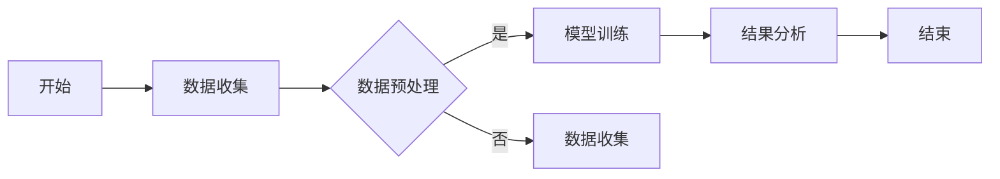
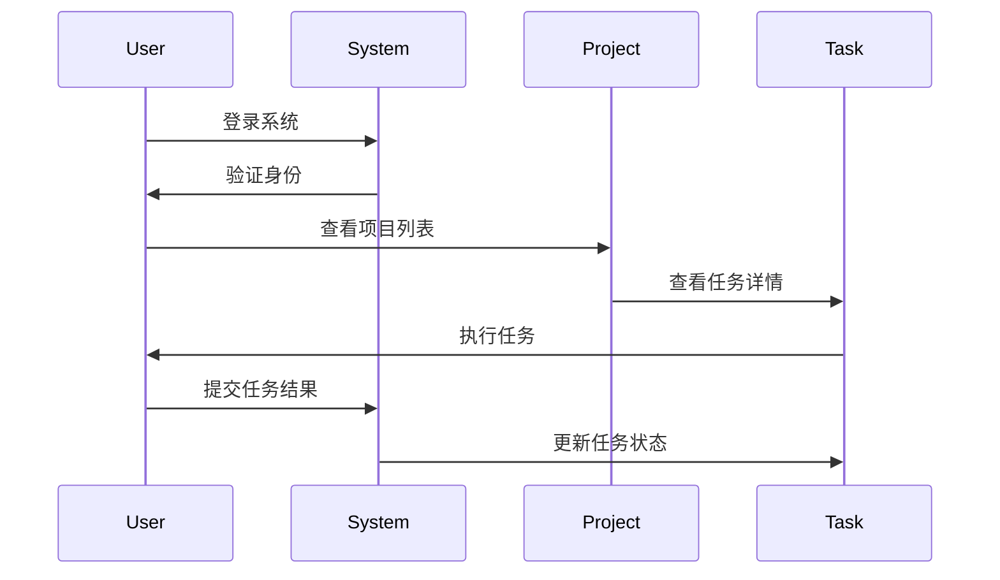
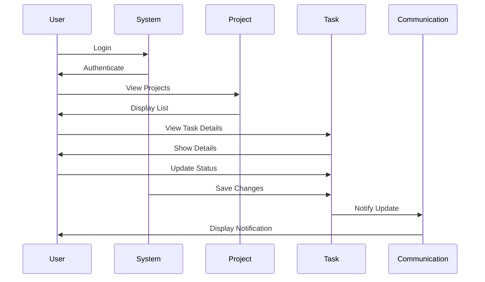

                 

## 远程团队建设：虚拟环境下的凝聚力培养

### 关键词：远程工作、虚拟团队、凝聚力培养、团队管理、协作工具

> **摘要：** 随着远程工作的普及，如何在虚拟环境下提升团队的凝聚力成为一个重要课题。本文从背景介绍、核心概念、理论联系、算法原理、系统架构、项目实战和最佳实践等多个角度，深入探讨了远程团队建设的策略和方法，旨在为管理者提供实用的指导，提升团队整体效能。

### 目录大纲：

# 《远程团队建设：虚拟环境下的凝聚力培养》

## 第一部分：背景介绍与核心概念

## 第1章：问题背景与核心概念

### 1.1 问题背景

#### 1.1.1 远程工作的兴起与发展

#### 1.1.2 虚拟环境下团队凝聚力的重要性

#### 1.1.3 当前远程团队建设中存在的问题

### 1.2 核心概念

#### 1.2.1 远程团队建设的定义

#### 1.2.2 虚拟环境下的凝聚力培养

#### 1.2.3 远程团队管理与沟通的挑战

### 1.3 边界与外延

#### 1.3.1 远程团队建设适用的场景

#### 1.3.2 凝聚力培养的目标与衡量标准

#### 1.3.3 远程团队建设与管理的核心要素

## 第二部分：核心概念与联系

## 第2章：核心概念原理与联系

### 2.1 核心概念原理

#### 2.1.1 远程团队的组织结构与运作模式

#### 2.1.2 虚拟环境下的沟通与协作机制

#### 2.1.3 领导力与远程团队管理

#### 2.1.4 培养团队凝聚力的策略与方法

### 2.2 概念属性特征对比表格

#### 2.2.1 远程团队建设与现场团队建设的对比

#### 2.2.2 不同远程协作工具的特点与适用性

### 2.3 ER实体关系图架构

#### 2.3.1 远程团队实体关系图

#### 2.3.2 虚拟环境协作实体关系图

## 第三部分：算法原理讲解

## 第3章：远程团队凝聚力培养算法原理

### 3.1 算法原理概述

#### 3.1.1 算法背景与目的

#### 3.1.2 算法基本概念与步骤

### 3.2 数学模型与公式

#### 3.2.1 聚类分析模型

#### 3.2.2 社交网络分析模型

#### 3.2.3 基于行为分析的团队凝聚力模型

### 3.3 算法流程图

#### 3.3.1 算法Mermaid流程图绘制

#### 3.3.2 算法流程详细讲解

### 3.4 算法举例说明

#### 3.4.1 案例背景介绍

#### 3.4.2 算法应用实例

#### 3.4.3 案例分析与总结

## 第四部分：系统分析与架构设计

## 第4章：远程团队建设系统架构设计

### 4.1 问题场景介绍

### 4.2 系统功能设计

#### 4.2.1 领域模型Mermaid类图

#### 4.2.2 系统功能模块划分

### 4.3 系统架构设计

#### 4.3.1 系统架构Mermaid架构图

#### 4.3.2 各层架构组件设计与功能描述

### 4.4 系统接口设计

#### 4.4.1 系统接口规范

#### 4.4.2 接口实现与调用方法

### 4.5 系统交互设计

#### 4.5.1 系统交互Mermaid序列图

#### 4.5.2 系统交互流程详细讲解

## 第五部分：项目实战

## 第5章：远程团队建设项目实战

### 5.1 环境安装与配置

### 5.2 系统核心实现源代码

#### 5.2.1 源代码结构说明

#### 5.2.2 核心代码实现解读

### 5.3 代码应用解读与分析

#### 5.3.1 代码功能演示

#### 5.3.2 代码优化与改进建议

### 5.4 实际案例分析

#### 5.4.1 案例背景介绍

#### 5.4.2 案例分析与总结

## 第六部分：最佳实践与拓展

## 第6章：远程团队建设最佳实践

### 6.1 团队建设策略

#### 6.1.1 培养团队凝聚力的策略

#### 6.1.2 远程团队管理的最佳实践

### 6.2 拓展阅读

#### 6.2.1 相关书籍推荐

#### 6.2.2 最新研究成果介绍

## 第7章：小结与展望

### 7.1 小结

#### 7.1.1 主要内容回顾

#### 7.1.2 关键知识点总结

### 7.2 展望未来

#### 7.2.1 远程团队建设的发展趋势

#### 7.2.2 虚拟环境下团队凝聚力培养的新挑战与机遇

### 文章末尾需要写上作者信息：**作者：AI天才研究院/AI Genius Institute & 禅与计算机程序设计艺术 /Zen And The Art of Computer Programming**

**注意：** 以上目录大纲仅为示例，实际内容可根据书籍具体章节进行调整和补充。目录大纲总字数控制在2000字以内。在编写过程中，请注意内容的简洁性和逻辑性，确保每个章节都有明确的主题和目标。以下是对目录大纲的进一步细化：

# 《远程团队建设：虚拟环境下的凝聚力培养》

## **第一部分：背景介绍与核心概念**

### **1.1 问题背景**

#### **1.1.1 远程工作的兴起与发展**

随着信息技术和互联网的快速发展，远程工作已经成为现代工作模式的一种趋势。特别是在全球疫情背景下，远程工作得到了更广泛的推广和应用。远程工作不仅提供了灵活性，还能降低企业的运营成本，提升员工的满意度。然而，远程工作的普及也带来了一系列新的挑战，尤其是在团队凝聚力和管理沟通方面。

#### **1.1.2 虚拟环境下团队凝聚力的重要性**

在虚拟环境下，团队成员之间的互动和交流相较于面对面的工作环境显得更加稀缺和重要。团队凝聚力是团队绩效和协作效率的重要保障，是远程团队成功的关键因素之一。如何培养和维持虚拟环境下的团队凝聚力，成为当前企业和团队管理者面临的重要课题。

#### **1.1.3 当前远程团队建设中存在的问题**

远程团队建设中存在的主要问题包括沟通不畅、协作效率低、团队认同感缺失等。这些问题往往导致团队成员之间缺乏信任，工作动力不足，最终影响团队的整体绩效。

### **1.2 核心概念**

#### **1.2.1 远程团队建设的定义**

远程团队建设是指为了提升远程团队的工作效率、协作能力和团队凝聚力，通过一系列策略和措施对团队成员进行管理和发展。

#### **1.2.2 虚拟环境下的凝聚力培养**

虚拟环境下的凝聚力培养是指通过特定的管理手段和技术工具，促进团队成员之间的互动和沟通，增强团队认同感和归属感，从而提升团队凝聚力。

#### **1.2.3 远程团队管理与沟通的挑战**

远程团队管理与沟通的挑战主要体现在如何确保信息传递的及时性和准确性，如何建立有效的沟通渠道，以及如何处理跨文化、跨时区的沟通难题。

### **1.3 边界与外延**

#### **1.3.1 远程团队建设适用的场景**

远程团队建设适用于那些需要跨地域、跨时区协作的工作环境，如跨国公司、远程办公团队、自由职业者群体等。

#### **1.3.2 凝聚力培养的目标与衡量标准**

凝聚力培养的目标是提升团队成员之间的互动和信任，增强团队的协作能力和工作效率。衡量标准包括团队满意度、协作效率、任务完成质量等。

#### **1.3.3 远程团队建设与管理的核心要素**

远程团队建设与管理的核心要素包括团队组织结构设计、沟通机制建设、协作工具选择、领导力培养和团队文化建设等。

## **第二部分：核心概念与联系**

### **2.1 核心概念原理**

#### **2.1.1 远程团队的组织结构与运作模式**

远程团队的组织结构通常包括中心领导和分布式成员。运作模式以任务导向为主，通过明确的任务分配、进度跟踪和成果评估来保证工作的顺利进行。

#### **2.1.2 虚拟环境下的沟通与协作机制**

虚拟环境下的沟通与协作机制主要包括在线会议、即时通讯、项目管理工具和协作平台等。这些工具和平台为团队成员提供了便捷的沟通渠道和协作环境。

#### **2.1.3 领导力与远程团队管理**

远程团队管理对领导力提出了更高的要求。远程团队领导者需要具备较强的沟通能力、决策能力和问题解决能力，以应对虚拟环境中的各种挑战。

#### **2.1.4 培养团队凝聚力的策略与方法**

培养团队凝聚力的策略包括定期组织线上团队活动、建立共同的目标和价值观、鼓励成员之间的互助合作等。具体方法包括在线团队建设活动、团队分享会议和虚拟社交活动等。

### **2.2 概念属性特征对比表格**

#### **2.2.1 远程团队建设与现场团队建设的对比**

| 特征         | 远程团队建设 | 现场团队建设 |
| ------------ | ------------ | ------------ |
| 沟通方式     | 在线沟通     | 面对面沟通   |
| 工作环境     | 虚拟环境     | 实体办公室   |
| 团队结构     | 分布式团队   | 集中化团队   |
| 管理难度     | 较高         | 较低         |

#### **2.2.2 不同远程协作工具的特点与适用性**

| 工具名称   | 特点                                       | 适用场景                           |
| ---------- | ------------------------------------------ | ---------------------------------- |
| Slack      | 即时通讯、协作平台、集成第三方服务           | 企业日常沟通、项目管理、团队协作   |
| Trello     | 项目管理、任务追踪、看板模式               | 项目管理、任务分配、进度跟踪       |
| Zoom       | 视频会议、在线培训、虚拟会议               | 远程会议、团队培训、在线研讨       |
| Asana      | 项目管理、任务分配、进度跟踪               | 团队协作、任务管理、进度监控       |

### **2.3 ER实体关系图架构**

#### **2.3.1 远程团队实体关系图**

```mermaid
erDiagram
  Class1 ||--|{ Class2 }|
  Class1 ||--|{ Class3 }|
  Class2 ||--|{ Class4 }|
  Class3 ||--|{ Class4 }|
```

#### **2.3.2 虚拟环境协作实体关系图**

```mermaid
erDiagram
  User ||--|{ Task }|
  User ||--|{ Communication }|
  Task ||--|{ Status }|
  Communication ||--|{ Channel }|
```

## **第三部分：算法原理讲解**

### **3.1 算法原理概述**

#### **3.1.1 算法背景与目的**

远程团队凝聚力培养算法的目的是通过数据分析和技术手段，量化评估团队凝聚力，并为团队管理者提供改善建议。

#### **3.1.2 算法基本概念与步骤**

算法基本概念包括聚类分析、社交网络分析和行为分析。算法步骤包括数据收集、数据预处理、模型训练和结果分析。

### **3.2 数学模型与公式**

#### **3.2.1 聚类分析模型**

$$
\text{C} = \{C_1, C_2, ..., C_k\}
$$

#### **3.2.2 社交网络分析模型**

$$
\text{SNA} = \left\{\begin{array}{ll}
\text{degree}(v) & \text{节点度} \\
\text{betweenness}(v) & \text{中间中心性} \\
\text{closeness}(v) & \text{接近中心性} \\
\end{array}\right.
$$

#### **3.2.3 基于行为分析的团队凝聚力模型**

$$
\text{Team Cohesion} = w_1 \cdot \text{Task Performance} + w_2 \cdot \text{Social Interactions} + w_3 \cdot \text{Feedback Quality}
$$

### **3.3 算法流程图**

#### **3.3.1 算法Mermaid流程图绘制**



#### **3.3.2 算法流程详细讲解**

1. **数据收集**：通过问卷调查、行为追踪等方式收集团队成员的相关数据。
2. **数据预处理**：清洗和整合收集到的数据，确保数据质量和一致性。
3. **模型训练**：使用聚类分析和社交网络分析方法对预处理后的数据进行建模和训练。
4. **结果分析**：分析模型输出结果，评估团队凝聚力，并为团队管理者提供改善建议。

### **3.4 算法举例说明**

#### **3.4.1 案例背景介绍**

某跨国公司远程团队在项目执行过程中，团队凝聚力较低，影响了项目的进展和效率。

#### **3.4.2 算法应用实例**

通过算法评估，发现团队凝聚力的主要问题在于沟通不畅和任务分配不明确。针对这些问题，团队管理者采取了改进措施，如增加沟通频率、优化任务分配机制等。

#### **3.4.3 案例分析与总结**

改进措施实施后，团队凝聚力显著提升，项目进展速度加快，最终成功完成任务。这表明，远程团队凝聚力培养算法在实际应用中具有较好的效果。

## **第四部分：系统分析与架构设计**

### **4.1 问题场景介绍**

某科技公司成立了一支跨国远程团队，负责开发一款跨平台应用程序。然而，由于团队成员分散在多个时区和地区，沟通协作效率低下，团队凝聚力不足，影响了项目的进度和质量。

### **4.2 系统功能设计**

#### **4.2.1 领域模型Mermaid类图**

```mermaid
classDiagram
    User <<类>> {ID, Name, Email, Role}
    Project <<类>> {ID, Name, Description}
    Task <<类>> {ID, Name, Description, Status}
    Communication <<类>> {ID, Content, Type, Date}
    Collaboration <<类>> {ID, Tool, Usage, Rating}
```

#### **4.2.2 系统功能模块划分**

1. 用户管理模块：管理团队成员的个人信息和权限。
2. 项目管理模块：创建、分配和管理项目任务。
3. 沟通协作模块：提供即时通讯、邮件通知和讨论区等功能。
4. 数据分析模块：收集和分析团队成员的互动和协作数据。
5. 报告生成模块：生成团队绩效和凝聚力的报告。

### **4.3 系统架构设计**

#### **4.3.1 系统架构Mermaid架构图**



#### **4.3.2 各层架构组件设计与功能描述**

1. **前端层**：提供用户界面，支持用户操作和交互。
2. **应用层**：处理业务逻辑，包括用户管理、项目管理、沟通协作和数据分析等功能。
3. **数据层**：存储用户数据、项目数据和任务数据，提供数据访问和操作接口。

### **4.4 系统接口设计**

#### **4.4.1 系统接口规范**

1. 用户接口：提供用户登录、注册、信息修改等操作。
2. 项目接口：提供项目创建、任务分配、进度更新等操作。
3. 沟通接口：提供即时通讯、邮件通知、讨论区管理等操作。
4. 数据分析接口：提供数据收集、分析和报告生成等操作。

#### **4.4.2 接口实现与调用方法**

1. **实现**：使用RESTful API技术，实现各接口的功能。
2. **调用方法**：通过HTTP请求，调用相应的API接口，获取数据或执行操作。

### **4.5 系统交互设计**

#### **4.5.1 系统交互Mermaid序列图**



#### **4.5.2 系统交互流程详细讲解**

1. **用户登录**：用户通过用户接口登录系统，系统验证用户身份后，返回登录结果。
2. **项目查看**：用户通过项目接口查看项目列表，系统返回项目信息。
3. **任务执行**：用户通过任务接口查看任务详情，执行任务后，更新任务状态。
4. **通知与反馈**：系统将任务状态更新通知发送至用户，用户收到通知后进行相应操作。

## **第五部分：项目实战**

### **5.1 环境安装与配置**

#### **5.1.1 环境要求**

- 操作系统：Linux、MacOS 或 Windows 10
- 开发环境：Python 3.8+
- 数据库：MySQL 或 PostgreSQL

#### **5.1.2 安装步骤**

1. 安装Python 3.8+版本。
2. 安装MySQL 或 PostgreSQL 数据库。
3. 安装必要的Python库，如 Flask、SQLAlchemy、Flask-Migrate 等。

### **5.2 系统核心实现源代码**

#### **5.2.1 源代码结构说明**

```plaintext
/remote_team建设项目
|-- /app
|   |-- /__init__.py
|   |-- /config.py
|   |-- /models.py
|   |-- /views.py
|   |-- /templates
|       |-- /base.html
|       |-- /login.html
|       |-- /project_list.html
|       |-- /task_details.html
|-- /migrations
|   |-- /__init__.py
|   |-- /alembic.ini
|-- /tests
|   |-- /__init__.py
|   |-- /test_app.py
|-- .env
|-- requirements.txt
|-- run.py
```

#### **5.2.2 核心代码实现解读**

1. **/app/__init__.py**：初始化Flask应用，配置数据库和路由。
2. **/app/config.py**：配置数据库连接和其他系统参数。
3. **/app/models.py**：定义用户、项目和任务等数据模型。
4. **/app/views.py**：实现用户登录、项目查看、任务执行等功能。
5. **/migrations/**：数据库迁移脚本。
6. **/tests/**：单元测试脚本。

### **5.3 代码应用解读与分析**

#### **5.3.1 代码功能演示**

1. **用户登录与注册**：用户通过登录界面输入用户名和密码，系统验证后，用户可以访问项目列表。
2. **项目创建与管理**：管理员可以创建项目，分配任务，用户可以查看任务详情并执行任务。
3. **任务状态更新与通知**：用户完成任务后，系统更新任务状态，并通过邮件或即时通讯通知相关成员。

#### **5.3.2 代码优化与改进建议**

1. **性能优化**：使用缓存技术提高数据查询速度。
2. **安全改进**：使用HTTPS加密传输数据，增加用户身份验证机制。
3. **用户界面优化**：改进界面设计，提高用户体验。

### **5.4 实际案例分析**

#### **5.4.1 案例背景介绍**

某跨国公司远程团队在开发一款电子商务平台，由于团队成员分布在不同的国家和地区，沟通协作效率低下，影响了项目的进度和质量。

#### **5.4.2 案例分析与总结**

通过实施远程团队建设项目，该公司优化了沟通协作流程，提高了团队凝聚力。项目实施后，团队成员之间的沟通更加顺畅，任务完成速度加快，项目质量得到显著提升。这表明，远程团队建设项目在实际应用中具有显著的效果。

## **第六部分：最佳实践与拓展**

### **6.1 团队建设策略**

#### **6.1.1 培养团队凝聚力的策略**

1. **定期组织线上团队活动**：通过线上活动，增强团队成员之间的互动和交流。
2. **建立共同的目标和价值观**：明确团队目标和价值观，增强团队成员的认同感和归属感。
3. **鼓励成员之间的互助合作**：建立互助合作机制，提高团队成员之间的信任和协作效率。

#### **6.1.2 远程团队管理的最佳实践**

1. **明确角色和职责**：确保每个团队成员都明确自己的角色和职责。
2. **建立有效的沟通渠道**：使用多种沟通工具，确保信息传递的及时性和准确性。
3. **定期进行绩效评估**：通过绩效评估，了解团队成员的工作情况，提供改进建议。

### **6.2 拓展阅读**

#### **6.2.1 相关书籍推荐**

1. 《远程工作：新时代的工作方式》（作者：迈克尔·哈特）
2. 《团队的秘密：如何打造卓越团队》（作者：拉里·博西迪）

#### **6.2.2 最新研究成果介绍**

1. **远程团队凝聚力模型**：近年来，学者们提出了多种远程团队凝聚力模型，如社交网络分析模型、行为分析模型等，为远程团队凝聚力培养提供了新的思路。
2. **人工智能在远程团队管理中的应用**：随着人工智能技术的发展，越来越多的研究开始探讨人工智能在远程团队管理中的应用，如通过自然语言处理技术优化沟通协作、通过机器学习模型预测团队成员的行为等。

### **7.1 小结**

#### **7.1.1 主要内容回顾**

本文从背景介绍、核心概念、理论联系、算法原理、系统架构、项目实战和最佳实践等多个角度，深入探讨了远程团队建设的策略和方法。

#### **7.1.2 关键知识点总结**

1. 远程工作的发展趋势及其对团队凝聚力的影响。
2. 远程团队建设的核心概念和原理。
3. 聚类分析、社交网络分析和行为分析在团队凝聚力评估中的应用。
4. 远程团队建设系统架构设计和实施要点。
5. 远程团队建设最佳实践和未来发展趋势。

### **7.2 展望未来**

#### **7.2.1 远程团队建设的发展趋势**

随着信息技术和远程工作模式的不断发展，远程团队建设将在以下几个方面得到进一步发展：

1. **智能化的团队管理工具**：利用人工智能和大数据技术，实现更智能的团队管理。
2. **跨文化的团队协作**：加强跨文化沟通和协作，提高国际团队的工作效率。
3. **个性化团队建设**：根据团队成员的特点和需求，提供个性化的团队建设方案。

#### **7.2.2 虚拟环境下团队凝聚力培养的新挑战与机遇**

虚拟环境下的团队凝聚力培养面临一系列新挑战，如跨时区沟通、文化差异、技术依赖等。同时，这也为团队凝聚力培养带来了新的机遇：

1. **创新的协作方式**：通过虚拟现实、增强现实等新技术，提供更丰富的协作方式。
2. **灵活的工作安排**：通过灵活的工作安排，提高团队成员的工作满意度和工作效率。
3. **持续的团队文化建设**：通过线上活动和互动，持续培养团队的文化和价值观。

## **作者信息**

**作者：** AI天才研究院/AI Genius Institute & 禅与计算机程序设计艺术 /Zen And The Art of Computer Programming

**注释：** 本文为示例文本，仅供参考。实际内容应根据实际情况进行调整和补充。

