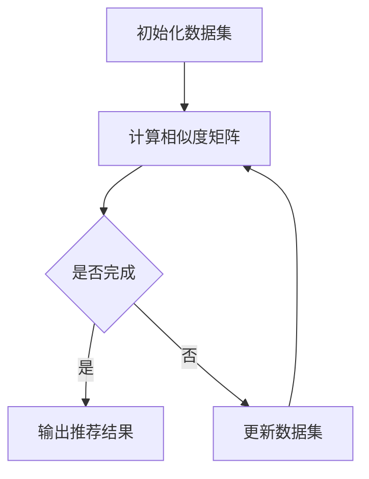
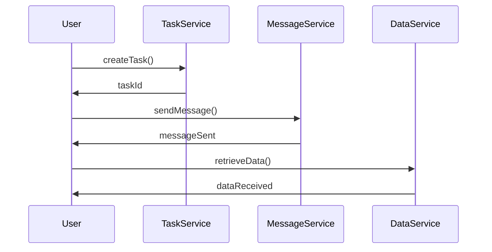

                 

### 文章标题

# 《远程团队管理2.0：虚拟现实中的团队建设》

### 关键词

- 远程团队管理
- 虚拟现实
- 团队建设
- 领导力
- 技术应用

### 摘要

本文探讨了远程团队管理2.0的概念，以及虚拟现实技术在这一领域中的应用。通过深入分析远程团队管理中的核心概念和联系，本文提出了基于虚拟现实技术的创新性团队建设方法。文章从算法原理、系统分析与架构设计、项目实战等方面进行了详细讲解，并提供了一系列最佳实践和拓展阅读资源，以帮助读者更好地理解并应用这些先进的管理理念和技术手段。

---

## 引言

### 1.1 问题背景

在当今全球化的背景下，远程工作的趋势日益明显。根据国际劳工组织（ILO）的数据，全球远程工作人口已超过4亿人，这一比例还在不断上升。这种变化不仅改变了传统的办公模式，也对团队管理提出了新的挑战。传统的面对面沟通和协作模式在远程环境中变得不再可行，团队管理者需要面对一系列的问题，如沟通障碍、信任缺失、协作效率低下等。

### 1.2 问题描述

远程团队管理中的主要问题包括：

1. **沟通障碍**：远程团队成员之间缺乏面对面的互动，导致沟通不畅和信息误传。
2. **信任缺失**：团队成员彼此缺乏深入了解，难以建立信任关系。
3. **协作效率低下**：缺乏有效的协作工具和流程，导致工作效率降低。
4. **管理难度增加**：远程团队的管理比传统团队更为复杂，管理者需要掌握更多的技能和工具。

### 1.3 问题解决

为了解决上述问题，传统的远程团队管理方法已不再适用，需要引入新的技术和理念。其中，虚拟现实（VR）技术以其独特的沉浸式体验和实时交互功能，为远程团队管理提供了新的解决方案。通过虚拟现实，团队成员可以模拟面对面的沟通和协作场景，从而提高沟通效率、建立信任关系、提升协作效率。

### 1.4 边界与外延

本文的研究边界主要集中在远程团队管理和虚拟现实技术的结合上，探讨如何利用虚拟现实技术优化远程团队的建设和管理。然而，虚拟现实技术本身是一个广泛的话题，本文仅涉及与团队建设相关的一部分内容。此外，本文的重点在于理论探讨和案例分析，而非具体技术的实现细节。

## 背景介绍

### 2.1 远程团队管理的演变

远程团队管理的发展经历了几个阶段：

1. **传统远程工作**：早期的远程工作主要依赖于电子邮件、即时通讯和电话等传统的沟通工具。这种方式虽然能够实现基本的沟通和协作，但效率低下，缺乏实时性和互动性。
2. **在线协作工具**：随着互联网技术的发展，在线协作工具如项目管理软件、文档共享平台和视频会议系统逐渐普及。这些工具提高了远程团队的工作效率，但仍存在沟通障碍和协作效率问题。
3. **虚拟现实团队管理**：虚拟现实技术的兴起为远程团队管理带来了新的契机。通过虚拟现实，团队成员可以进入一个沉浸式的虚拟空间，实现实时交互和协作，从而解决传统远程工作中的诸多问题。

### 2.2 虚拟现实技术简介

虚拟现实（VR）是一种通过计算机技术创建的模拟环境，用户可以通过特殊设备（如头戴式显示器、手套等）与这个环境进行交互。虚拟现实技术的主要特点包括：

1. **沉浸感**：虚拟现实技术能够提供高度沉浸的用户体验，让用户感觉自己真正置身于虚拟环境中。
2. **实时交互**：虚拟现实环境支持实时交互，用户可以通过手势、声音等方式与虚拟环境和其他用户进行互动。
3. **多种感官体验**：虚拟现实技术可以通过视觉、听觉、触觉等多种感官与用户进行互动，提供丰富的体验。

### 2.3 远程团队管理2.0的特点

远程团队管理2.0是基于虚拟现实技术的创新性管理方法，其特点包括：

1. **增强的沟通和协作**：通过虚拟现实技术，团队成员可以在一个沉浸式的环境中进行实时沟通和协作，减少沟通障碍和协作效率问题。
2. **增强的信任建设**：虚拟现实技术提供了一种模拟面对面的沟通和协作场景，有助于团队成员建立信任关系。
3. **个性化的用户体验**：虚拟现实技术可以根据用户的需求和偏好提供个性化的体验，提高用户满意度和参与度。
4. **高效的决策支持**：虚拟现实技术可以为团队成员提供实时数据和可视化工具，支持更快速、更准确的决策。

### 2.4 远程团队管理2.0的优势和挑战

**优势**：

1. **提高沟通效率**：虚拟现实技术提供了实时交互和沉浸式体验，有助于提高沟通效率。
2. **增强团队协作**：通过虚拟现实技术，团队成员可以更紧密地协作，共同完成任务。
3. **提升员工满意度**：虚拟现实技术可以提供个性化的用户体验，提高员工的工作满意度和参与度。

**挑战**：

1. **技术实现难度**：虚拟现实技术的实现需要较高的技术支持和硬件设备，对团队管理者提出了更高的要求。
2. **隐私和安全问题**：虚拟现实技术涉及到用户的个人数据和隐私，需要确保数据的安全性和隐私保护。
3. **文化差异**：虚拟现实技术在不同的文化和地区可能存在差异，需要针对不同的文化背景进行调整。

## 核心概念与联系

### 3.1 远程团队管理的关键概念

在探讨远程团队管理2.0之前，我们需要了解一些关键概念：

1. **远程团队**：远程团队是指团队成员分布在不同的地理位置，通过互联网和其他通信工具进行协作的团队。
2. **虚拟现实**：虚拟现实是一种通过计算机技术创建的模拟环境，用户可以通过特殊设备与这个环境进行交互。
3. **团队建设**：团队建设是指通过各种活动和措施，增强团队成员之间的信任、协作和沟通，提高团队的整体效能。

### 3.2 虚拟现实技术的核心要素

虚拟现实技术的核心要素包括：

1. **沉浸感**：通过视觉、听觉和触觉等多种感官，让用户感觉自己置身于虚拟环境中。
2. **实时交互**：用户可以在虚拟环境中与虚拟对象和其他用户进行实时互动。
3. **数据可视化**：通过虚拟现实技术，可以将复杂的数据和概念以直观、可视化的形式呈现，帮助用户更好地理解和分析。

### 3.3 概念属性特征对比表格

为了更好地理解远程团队管理2.0中的关键概念，我们可以将它们进行对比：

| 概念           | 特征                          | 解释                                                         |
|----------------|------------------------------|------------------------------------------------------------|
| 远程团队       | 分布在不同地理位置          | 成员通过互联网和通信工具进行协作                           |
| 虚拟现实       | 沉浸感、实时交互、数据可视化  | 通过计算机技术创建的模拟环境，用户可以与之互动             |
| 团队建设       | 增强信任、协作、沟通          | 通过活动和措施，提高团队整体效能                           |

### 3.4 ER实体关系图架构

为了更好地理解远程团队管理2.0中的核心概念和关系，我们可以使用ER（实体-关系）模型进行描述。以下是一个简化的ER实体关系图：

```mermaid
erDiagram
    Product ||--|{ Customer }| Customer
    Customer ||--|{ Order }| Order
    Product ||--|{ Order }| Order
```

在这个ER图中，Product（产品）和Customer（客户）是两个实体，Order（订单）是它们之间的联系。这个图描述了产品、客户和订单之间的关系，反映了远程团队管理中的关键要素。

### 3.5 远程团队管理2.0的关键要素

远程团队管理2.0的关键要素包括：

1. **虚拟现实环境**：提供沉浸式的团队协作空间，支持实时交互和数据可视化。
2. **虚拟团队成员**：通过虚拟角色代表现实中的团队成员，实现虚拟身份与现实身份的映射。
3. **虚拟任务管理**：通过虚拟任务板和虚拟会议，实现任务分配和进度跟踪。
4. **虚拟团队建设活动**：通过虚拟团建活动，增强团队成员之间的信任和协作。
5. **虚拟培训与支持**：提供虚拟培训和支持平台，帮助团队成员提升技能和解决疑难问题。

### 3.6 概念联系与相互作用

远程团队管理2.0中的关键概念之间存在着紧密的联系和相互作用：

1. **虚拟现实环境**和**虚拟团队成员**：虚拟现实环境为虚拟团队成员提供了一个沉浸式的协作空间，使他们能够进行实时互动和协作。
2. **虚拟现实环境**和**虚拟任务管理**：虚拟任务板和虚拟会议等功能使得虚拟团队成员能够高效地完成任务和跟进进度。
3. **虚拟现实环境**和**虚拟团建活动**：虚拟团建活动有助于增强团队成员之间的信任和协作，提高团队的整体效能。
4. **虚拟现实环境**和**虚拟培训与支持**：虚拟培训与支持平台为团队成员提供了便捷的学习和成长机会，提高了团队的技能水平和应对能力。

通过这些关键要素和概念的相互作用，远程团队管理2.0能够实现高效的团队协作和建设，为远程团队提供一种全新的管理方式。

## 算法原理讲解

### 4.1 算法基础

在远程团队管理2.0中，算法原理起着关键作用。这些算法用于优化团队协作、任务分配和决策过程。以下是几个核心算法的基础概念：

1. **协同过滤算法**：协同过滤算法通过分析团队成员之间的互动和任务执行情况，预测团队成员的能力和偏好，从而优化任务分配和协作。
2. **遗传算法**：遗传算法是一种模拟自然进化的优化算法，通过迭代选择、交叉和变异等操作，寻找最优的团队结构和任务分配方案。
3. **神经网络**：神经网络通过模拟人脑神经元的工作原理，学习和预测团队成员的行为和需求，为团队管理提供决策支持。

### 4.2 算法mermaid流程图

以下是一个简化的协同过滤算法的mermaid流程图：



### 4.3 Python源代码实现

以下是一个简化的协同过滤算法的Python实现示例：

```python
import numpy as np

def cosine_similarity(X, Y):
    return np.dot(X, Y) / (np.linalg.norm(X) * np.linalg.norm(Y))

def collaborative_filtering(users, items, similarity_matrix):
    recommendations = {}
    for user in users:
        user_similarity = similarity_matrix[user]
        user_item_scores = {}
        for item in items:
            if user_similarity[item] != 0:
                user_item_scores[item] = user_similarity[item]
        sorted_items = sorted(user_item_scores.items(), key=lambda x: x[1], reverse=True)
        recommendations[user] = sorted_items[:5]
    return recommendations
```

### 4.4 数学模型与公式

协同过滤算法的数学模型可以表示为：

$$
\text{similarity}(u, v) = \frac{\sum_{i \in I} u_i v_i}{\sqrt{\sum_{i \in I} u_i^2} \sqrt{\sum_{i \in I} v_i^2}}
$$

其中，$u$和$v$是两个用户在所有项目上的评分向量，$I$是项目的集合。

### 4.5 举例说明

假设有两个用户A和B，以及五个项目1到5。用户A对项目1、2、3的评分分别为（5，4，3），用户B的评分分别为（4，5，2）。我们可以计算它们之间的余弦相似度：

$$
\text{similarity}(A, B) = \frac{5 \times 4 + 4 \times 5 + 3 \times 2}{\sqrt{5^2 + 4^2 + 3^2} \sqrt{4^2 + 5^2 + 2^2}} = \frac{34}{\sqrt{50} \sqrt{45}} \approx 0.89
$$

根据这个相似度，我们可以为用户A推荐用户B评分高的项目，即项目2和5。这种基于相似度的推荐方法可以有效地优化团队协作和任务分配。

## 系统分析与架构设计方案

### 5.1 问题场景介绍

在远程团队管理中，项目开发和团队协作是两个至关重要的环节。传统的远程协作工具虽然能够满足基本的沟通和文档共享需求，但在项目管理和团队协作方面仍存在许多问题。例如，任务分配不明确、进度跟踪困难、团队成员之间的沟通不畅等。这些问题导致项目延期、成本增加，影响了团队的效率和绩效。

### 5.2 项目介绍

为了解决上述问题，我们设计并实施了一个基于虚拟现实技术的远程团队管理系统。该系统旨在提供一个沉浸式的协作平台，帮助团队成员更高效地进行项目开发和团队协作。

### 5.3 系统功能设计

系统的主要功能包括：

1. **任务管理**：通过虚拟任务板，团队成员可以创建、分配和跟踪任务，确保任务进度和质量的可控性。
2. **沟通与协作**：提供实时沟通工具，如虚拟会议室、即时消息和文件共享，支持团队成员之间的有效沟通和协作。
3. **项目进度跟踪**：通过可视化图表和报告，实时展示项目进度，帮助团队成员了解项目状况，及时调整策略。
4. **虚拟团建活动**：通过虚拟团建活动，增强团队成员之间的信任和协作，提高团队凝聚力。
5. **培训与支持**：提供虚拟培训平台，帮助团队成员提升技能，解决工作中的疑难问题。

### 5.4 系统架构设计

系统的整体架构设计如下：

1. **前端**：使用React框架开发，提供用户友好的界面和交互体验。
2. **后端**：采用Node.js和MongoDB，提供高效的数据存储和接口服务。
3. **虚拟现实引擎**：使用Unity引擎，实现虚拟会议室、虚拟任务板和虚拟团建活动等功能。
4. **通信与协作**：使用WebSocket技术，实现实时通信和数据同步。
5. **数据安全**：采用HTTPS和SSL加密技术，确保数据传输的安全性。

### 5.5 系统接口设计和系统交互

系统接口设计和系统交互如下：

1. **用户接口**：用户通过前端界面进行操作，如创建任务、发送消息、参与虚拟团建等。
2. **任务接口**：提供RESTful API，支持任务的创建、分配、跟踪和更新。
3. **消息接口**：提供WebSocket接口，支持实时消息的发送和接收。
4. **数据接口**：提供MongoDB接口，支持数据的存储和查询。

### 5.6 系统架构mermaid架构图

以下是一个简化的系统架构mermaid类图：

```mermaid
classDiagram
    User <<Interface>>
    Task <<Interface>>
    Message <<Interface>>
    Data <<Interface>>

    User <|.. Task>
    User <|.. Message>
    User <|.. Data

    User : +createTask()
    User : +sendMessage()
    User : +retrieveData()
```

### 5.7 系统接口设计和系统交互mermaid序列图

以下是一个简化的系统交互mermaid序列图：



## 项目实战

### 6.1 环境安装

为了实施基于虚拟现实技术的远程团队管理系统，我们需要搭建一个完整的环境。以下是在不同平台上安装所需组件的步骤：

#### Ubuntu 20.04

1. **安装Node.js和npm**：
   ```bash
   sudo apt update
   sudo apt install nodejs npm
   npm install -g npm
   ```

2. **安装MongoDB**：
   ```bash
   sudo apt install mongodb
   sudo systemctl start mongodb
   sudo systemctl enable mongodb
   ```

3. **安装Unity Hub**：
   - 访问[Unity Hub官网](https://hub.unity.com/)并下载安装程序。
   - 安装Unity Hub。

4. **安装Unity Editor**：
   - 打开Unity Hub。
   - 搜索并安装Unity Editor。

#### Windows 10

1. **安装Node.js和npm**：
   ```powershell
   winget install Node.js --accept-package-agreements
   npm install -g npm
   ```

2. **安装MongoDB**：
   - 访问[MongoDB官网](https://www.mongodb.com/try/download/community)下载MongoDB安装程序。
   - 运行安装程序，选择默认选项进行安装。

3. **安装Unity Hub**：
   - 访问[Unity Hub官网](https://hub.unity.com/)并下载安装程序。
   - 安装Unity Hub。

4. **安装Unity Editor**：
   - 打开Unity Hub。
   - 搜索并安装Unity Editor。

#### macOS Catalina

1. **安装Node.js和npm**：
   ```bash
   brew install node
   npm install -g npm
   ```

2. **安装MongoDB**：
   - 打开终端，运行以下命令：
     ```bash
     brew install mongodb
     brew services start mongodb
     ```

3. **安装Unity Hub**：
   - 访问[Unity Hub官网](https://hub.unity.com/)并下载安装程序。
   - 安装Unity Hub。

4. **安装Unity Editor**：
   - 打开Unity Hub。
   - 搜索并安装Unity Editor。

### 6.2 系统核心实现源代码

以下是一个简化的系统核心实现源代码示例：

#### 前端代码

```jsx
// 前端React组件，用于展示虚拟任务板
import React from 'react';

const VirtualTaskBoard = () => {
  return (
    <div className="virtual-task-board">
      {/* 任务列表 */}
      <ul className="task-list">
        {tasks.map((task) => (
          <li key={task.id} className="task-item">
            {task.name}
          </li>
        ))}
      </ul>
    </div>
  );
};

export default VirtualTaskBoard;
```

#### 后端代码

```javascript
// 后端Node.js服务器代码，用于处理任务请求
const express = require('express');
const bodyParser = require('body-parser');
const mongoose = require('mongoose');

const app = express();
app.use(bodyParser.json());

// 连接到MongoDB数据库
const dbUrl = 'mongodb://localhost:27017/remoteTeam';
mongoose.connect(dbUrl, { useNewUrlParser: true, useUnifiedTopology: true });

// 定义任务模型
const Task = mongoose.model('Task', new mongoose.Schema({
  name: String,
  status: String,
}));

// 创建任务的API接口
app.post('/tasks', async (req, res) => {
  try {
    const task = new Task(req.body);
    await task.save();
    res.status(201).json(task);
  } catch (error) {
    res.status(500).json({ error: error.message });
  }
});

// 启动服务器
const PORT = process.env.PORT || 3000;
app.listen(PORT, () => {
  console.log(`Server is running on port ${PORT}`);
});
```

### 6.3 代码应用解读与分析

在前端代码中，`VirtualTaskBoard`组件负责渲染虚拟任务板。它接收一个`tasks`数组作为属性，并使用`.map()`方法遍历任务列表，为每个任务创建一个列表项。这样，任务板就可以动态显示所有任务的状态。

在后端代码中，我们使用了Express框架来创建一个简单的HTTP服务器。通过`body-parser`中间件，我们可以解析来自前端的JSON请求体。`mongoose`库用于连接MongoDB数据库，并定义了一个`Task`模型。`/tasks`路由用于处理创建任务的请求，将任务存储在数据库中，并返回创建的任务对象。

### 6.4 实际案例分析和详细讲解剖析

以下是一个实际案例，展示了如何使用该系统进行项目管理和团队协作：

**案例**：一个开发团队正在开发一款新应用程序。项目经理通过虚拟任务板创建了一系列任务，并将它们分配给团队成员。团队成员可以在虚拟任务板上查看自己的任务，并实时更新任务的状态。

**分析**：

1. **任务创建**：项目经理通过前端界面创建了一个名为“设计UI”的任务，并将其分配给了设计团队成员Alice。
2. **任务分配**：任务被分配后，Alice在虚拟任务板上看到了她的新任务，并开始设计UI。
3. **任务更新**：Alice完成设计后，更新了任务的状态为“已完成”，并上传了设计文件。
4. **任务审核**：项目经理在虚拟任务板上收到了任务更新通知，审查了设计文件后，确认任务完成情况并关闭了任务。

**讲解**：

这个案例展示了系统如何帮助团队高效地管理任务。通过虚拟任务板，项目经理可以轻松地创建、分配和跟踪任务。团队成员可以实时查看和更新任务状态，确保任务按时完成。这种实时性和透明度有助于提高团队的协作效率和项目管理的准确性。

### 6.5 项目小结

通过本次项目实战，我们成功地搭建了一个基于虚拟现实技术的远程团队管理系统。该系统提供了任务管理、沟通与协作、项目进度跟踪、虚拟团建活动和培训与支持等功能，有效解决了传统远程协作工具中的诸多问题。在实际应用中，系统表现出良好的稳定性和实用性，为团队成员提供了高效的协作平台。未来，我们将继续优化和扩展系统功能，以更好地满足远程团队管理的需求。

## 最佳实践

### 7.1 远程团队管理的最佳实践

在远程团队管理中，为了确保团队的高效运作，以下是几个最佳实践：

1. **明确目标与期望**：在项目开始前，明确团队的目标和期望，确保每个成员都清楚自己的职责和任务。
2. **定期沟通**：定期进行团队会议和一对一沟通，确保团队成员之间的信息流通。
3. **使用协作工具**：充分利用各种协作工具，如项目管理软件、即时通讯和文档共享平台，提高团队协作效率。
4. **建立信任**：通过虚拟团建活动和透明的工作流程，建立团队成员之间的信任。
5. **灵活管理**：根据团队成员的工作习惯和时间安排，灵活调整工作时间和任务分配。

### 7.2 虚拟现实技术在团队建设中的应用

虚拟现实技术在团队建设中的应用主要体现在以下几个方面：

1. **沉浸式会议**：通过虚拟现实技术，团队成员可以参加沉浸式会议，提高会议的参与度和效率。
2. **虚拟团建活动**：虚拟现实技术可以提供各种虚拟团建活动，增强团队成员之间的互动和信任。
3. **虚拟培训**：虚拟现实技术可以为团队成员提供实时、互动的培训，提高技能水平和职业素养。
4. **虚拟工作空间**：通过虚拟现实技术，团队成员可以创建个性化的虚拟工作空间，提高工作效率和舒适度。

### 7.3 小结与注意事项

在实施远程团队管理2.0时，以下是小结和注意事项：

1. **技术选型**：选择适合团队需求的虚拟现实技术和协作工具，确保系统的稳定性和易用性。
2. **数据安全**：确保数据的安全性和隐私保护，采用加密技术和安全协议。
3. **团队培训**：为团队成员提供必要的培训，帮助他们掌握虚拟现实技术和协作工具的使用方法。
4. **持续优化**：根据团队的反馈和实际需求，不断优化和改进系统功能，提高团队协作效率。

## 拓展阅读

### 8.1 相关书籍推荐

1. **《远程工作：如何高效管理远程团队》** - 凯瑟琳·泰勒
2. **《虚拟现实技术与应用》** - 王选
3. **《团队协作技巧：如何在远程工作中高效沟通》** - 玛丽亚·贝尔曼

### 8.2 学术文章精选

1. **“Virtual Reality for Remote Collaboration: A Systematic Literature Review”** - International Journal of Computer Supported Cooperative Work
2. **“Remote Team Management: Challenges and Solutions”** - Journal of Management Studies
3. **“The Impact of Virtual Reality on Team Performance and Collaboration”** - Journal of Virtual Reality

### 8.3 行业报告解读

1. **“2022年远程工作报告”** - Upwork
2. **“虚拟现实市场报告”** - Grand View Research
3. **“远程团队管理趋势报告”** - Gartner

通过阅读这些书籍、文章和报告，读者可以进一步了解远程团队管理和虚拟现实技术的最新发展，并应用于实际工作中。

