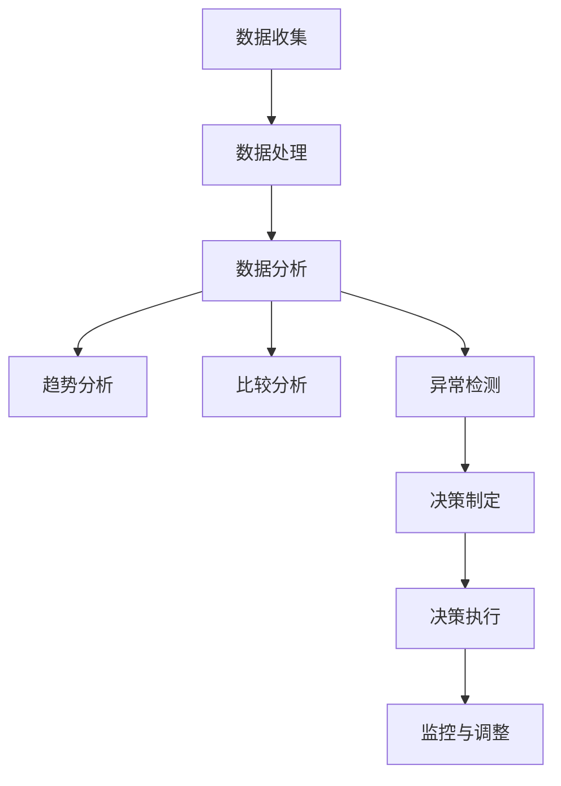
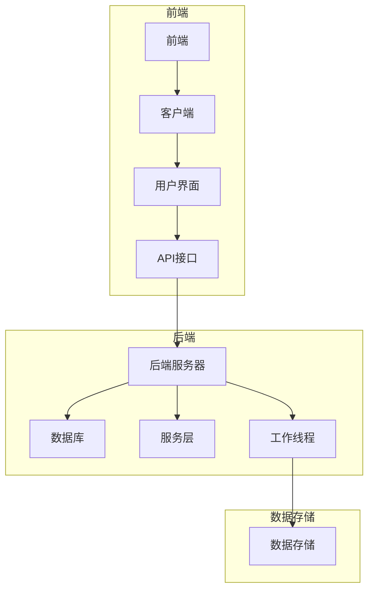
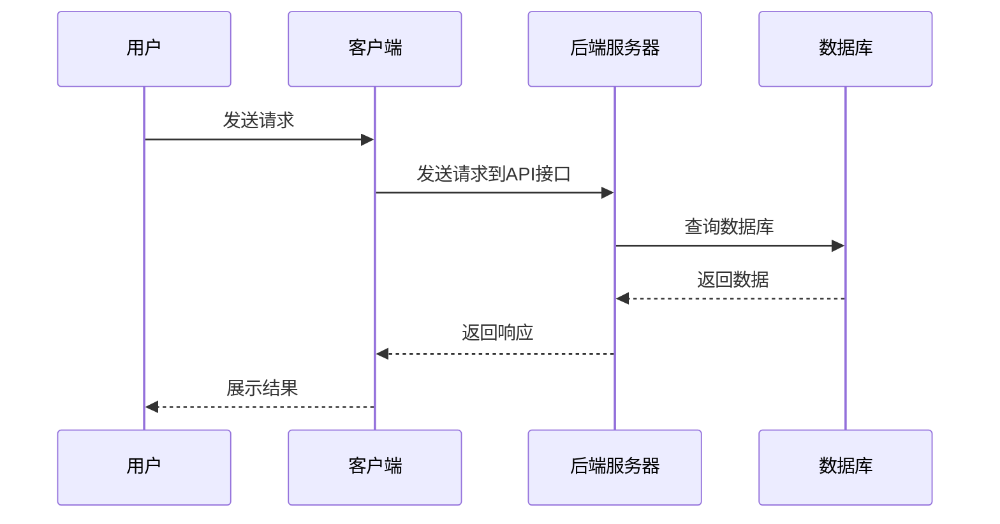

                 

### 文章标题

# 远程团队管理：数字时代的领导挑战

### 关键词

- 远程团队管理
- 数字化时代
- 领导挑战
- 沟通障碍
- 效率优化
- 团队协作
- 数据分析
- 算法原理
- 数学模型
- 系统架构

### 摘要

本文深入探讨了数字时代下远程团队管理所面临的挑战与解决方案。通过分析远程团队管理的背景、核心概念及其联系，我们揭示了沟通障碍、效率低下和团队协作困难等问题。进一步，本文详细阐述了数据分析、流程优化等算法原理，并结合Python代码和mermaid流程图进行了深入讲解。同时，文章提供了远程团队管理系统的架构设计、项目实战案例以及最佳实践，为管理者提供了切实可行的指导。

## 背景介绍

### 1.1.1 数字化时代的远程工作现状

在过去的几十年中，远程工作逐渐从一种少数人的特权演变为普遍现象。这一转变主要得益于互联网的普及和通信技术的飞速发展。如今，越来越多的公司开始采用远程办公模式，特别是在数字化时代的推动下，远程工作的需求更是急剧增加。根据一项调查显示，全球远程工作人数在2020年已经达到了约5亿，预计到2025年这一数字将突破8亿。

远程工作的优势显而易见。首先，它为员工提供了更大的灵活性，使得他们能够在舒适的环境下高效工作。其次，远程工作有助于减少通勤时间和成本，提高了整体的工作满意度。此外，它还使得公司能够吸引到全球范围内的优秀人才，不再局限于地理位置的限制。

然而，远程工作的普及也带来了新的挑战，尤其是在团队管理方面。传统的面对面沟通方式被数字化的沟通工具所取代，这无疑增加了沟通的复杂性和不确定性。团队成员之间的协作变得更加困难，管理者的监督和激励作用也受到了影响。因此，如何在数字化时代有效管理远程团队，成为了管理者亟待解决的问题。

### 1.1.2 远程团队管理面临的挑战

#### 沟通障碍

沟通障碍是远程团队管理中最为显著的问题之一。由于缺乏面对面的交流，团队成员之间的沟通容易产生误解和误读。特别是在紧急情况下，无法及时召开会议或面对面讨论，往往会导致决策延迟和效率低下。此外，远程团队中信息的传递路径较长，增加了信息失真的风险。

#### 效率低

远程团队的管理效率普遍较低，这主要是由于缺乏有效的监督和激励机制。传统的工作环境依赖于监督和管理者的直接观察，而在远程工作中，这种监督变得困难。此外，团队成员的自控力差异较大，容易导致工作进度不一致，影响整体效率。

#### 团队协作困难

团队协作是远程团队管理中的另一个重大挑战。由于地理位置的分散，团队成员之间的互动和合作变得更加困难。协作工具的多样性和不兼容性也加剧了这一问题。此外，团队成员的工作时间可能存在时差，这进一步增加了协作的难度。

#### 领导力缺失

在远程团队中，领导力的作用显得尤为重要。然而，许多管理者在远程环境中缺乏有效的领导方式。他们可能无法及时发现并解决问题，也无法有效地激励和指导团队成员。这种领导力缺失进一步加剧了团队管理的困难。

### 1.1.3 远程团队管理的重要性

尽管远程团队管理面临诸多挑战，但它的重要性不容忽视。首先，有效的远程团队管理能够提高工作效率，减少误解和错误。其次，良好的团队协作能够增强团队的凝聚力，提高成员的满意度和忠诚度。最后，有效的领导力能够帮助管理者更好地应对远程工作中的各种问题，确保团队的稳定发展。

总之，远程团队管理是数字化时代企业面临的重大课题。只有通过不断探索和改进管理方法，才能在远程工作中取得成功。

## 核心概念与联系

### 2.1 远程团队的定义与特征

远程团队指的是由地理位置分散的成员组成的工作小组，他们通过现代通信技术进行协作。远程团队的典型特征包括：

- **地理分散性**：团队成员分布在不同的城市、国家甚至时区。
- **技术依赖性**：远程团队高度依赖各种数字工具，如视频会议、即时通讯和项目管理软件。
- **自主性**：远程团队成员通常具有更高的工作自主性，他们可以自主安排工作时间。
- **灵活性**：远程团队能够快速响应市场变化，灵活调整工作计划和目标。

### 2.2 数字化管理工具的作用与应用

数字化管理工具在远程团队管理中起着至关重要的作用。这些工具包括：

- **即时通讯工具**：如Slack、Microsoft Teams等，用于实时沟通和协作。
- **视频会议工具**：如Zoom、Google Meet等，用于远程会议和培训。
- **项目管理软件**：如Trello、Jira等，用于任务分配、进度追踪和团队协作。
- **代码管理平台**：如GitHub、GitLab等，用于版本控制和代码协作。

### 2.3 领导力在远程团队管理中的关键作用

领导力是远程团队管理中不可或缺的因素。远程团队领导需要具备以下能力：

- **沟通技巧**：能够通过数字化工具有效地与团队成员沟通，确保信息的准确传递。
- **激励能力**：能够激发团队成员的积极性，提高工作效率。
- **决策能力**：能够在远程环境中快速做出明智的决策，减少决策延迟。
- **团队建设**：能够建立团队凝聚力，促进团队成员之间的互动和合作。

### 2.4 核心概念与联系（表格 & ER图）

为了更好地理解远程团队管理的核心概念及其联系，我们可以通过以下表格和ER图进行说明。

#### 表格：远程团队管理核心概念对比

| 核心概念 | 定义 | 特征 | 应用场景 |
| :------: | :--- | :--- | :------- |
| 远程团队 | 地理分散的成员组成的团队 | 地理分散、技术依赖、自主性高 | 分布在不同城市或国家的项目团队 |
| 数字化管理工具 | 数字化工具 | 实时沟通、高效协作、易于管理 | 远程会议、任务分配、代码协作 |
| 领导力 | 管理团队的能力 | 沟通技巧、激励能力、决策能力 | 确保团队高效运作、提升团队凝聚力 |

#### ER图：远程团队管理实体关系图

```mermaid
erDiagram
    Team Member ||--|{ Digital Tool }|-- Remote Team
    Remote Team ||--|{ Project }|-- Project Manager
    Project Manager ||--|{ Leadership Skill }|-- Team Member
```

在上述ER图中，"Team Member"表示远程团队成员，"Digital Tool"表示数字化管理工具，"Remote Team"表示远程团队，"Project"表示项目，"Project Manager"表示项目经理，"Leadership Skill"表示领导力。这张图展示了这些实体之间的关系，帮助我们理解远程团队管理的整体架构。

## 算法原理讲解

### 3.1 数据分析在远程团队管理中的应用

数据分析是远程团队管理的重要工具，它可以帮助管理者更好地了解团队的工作状态和效率。以下从数据收集与处理、数据可视化工具的应用和数据驱动的决策制定三个方面，详细介绍数据分析在远程团队管理中的应用。

#### 3.1.1 数据收集与处理

在远程团队管理中，数据收集是第一步。管理者可以通过多种渠道收集数据，包括员工的工作日志、项目进度报告、沟通记录等。这些数据通常存储在数字化的工具中，如项目管理软件、协作平台和即时通讯工具。为了确保数据的准确性和完整性，需要建立规范的数据收集流程和数据质量管理体系。

数据收集之后，需要进行数据处理。数据处理包括数据清洗、数据整合和数据转换等步骤。数据清洗是为了去除数据中的错误和异常值，确保数据的准确性。数据整合是将来自不同来源的数据进行合并，以便进行综合分析。数据转换是将数据转换为适合分析的形式，如结构化数据或可视化数据。

#### 3.1.2 数据可视化工具的应用

数据可视化是数据分析的重要环节，它能够将复杂的数据转化为直观的图表和图形，帮助管理者快速理解和分析数据。常用的数据可视化工具有Tableau、Power BI、Google Charts等。

数据可视化工具的应用主要包括以下几个方面：

1. **趋势分析**：通过折线图、柱状图等，展示数据的变化趋势，帮助管理者了解团队的工作动态。
2. **比较分析**：通过饼图、散点图等，对比不同团队或成员的工作表现，发现问题和优化的方向。
3. **异常检测**：通过箱线图、热力图等，识别数据中的异常值和异常情况，及时发现问题并进行处理。

#### 3.1.3 数据驱动的决策制定

数据驱动的决策制定是远程团队管理的核心思想。通过数据分析，管理者可以基于数据做出更加准确和科学的决策，而不是依赖主观判断或直觉。

具体来说，数据驱动的决策制定包括以下几个步骤：

1. **数据收集与处理**：如前所述，收集和处理数据是基础。
2. **数据分析和可视化**：利用数据可视化工具，对数据进行深入分析，识别关键指标和趋势。
3. **决策制定**：基于数据分析结果，制定具体的决策，如调整工作计划、优化资源配置、改进沟通流程等。
4. **决策执行与监控**：将决策付诸实施，并对决策效果进行监控和评估，及时调整和优化决策。

### 3.2 流程优化算法原理

流程优化是远程团队管理中的另一个重要环节，它旨在提高工作效率和降低成本。流程优化通常基于以下算法原理：

#### 3.2.1 流程优化的重要性

流程优化的重要性在于，它能够提高团队的工作效率，降低错误率，减少不必要的重复工作。在远程团队中，由于地理位置的分散和工作环境的差异，流程优化显得尤为重要。通过优化流程，可以确保团队成员能够高效协同，减少沟通成本，提高整体工作效率。

#### 3.2.2 优化算法的选择与实施

优化算法的选择取决于团队的具体需求和工作流程。常用的优化算法包括：

1. **线性规划**：适用于在给定资源限制下，寻找最优工作分配方案。
2. **遗传算法**：适用于复杂、非线性优化问题，如任务调度和资源分配。
3. **模拟退火算法**：适用于在给定初始解的基础上，逐步优化解决方案，避免陷入局部最优。

优化算法的实施步骤如下：

1. **问题定义**：明确优化目标，如最小化成本、最大化效率等。
2. **模型建立**：根据问题定义，建立数学模型或算法模型。
3. **算法选择与实现**：选择合适的优化算法，并实现算法代码。
4. **结果评估与调整**：对优化结果进行评估，并根据评估结果进行调整和优化。

#### 3.2.3 优化效果评估

优化效果评估是流程优化的重要环节，它可以帮助团队了解优化措施的实际效果，并为后续优化提供依据。评估方法包括：

1. **效率分析**：通过计算任务完成时间和资源利用率等指标，评估流程优化的效率提升情况。
2. **成本分析**：通过比较优化前后的成本，评估流程优化的经济收益。
3. **用户满意度调查**：通过调查团队成员对优化措施的感受和反馈，评估优化措施的接受度和实用性。

### 3.3 远程团队管理算法的mermaid流程图

为了更好地理解远程团队管理的算法原理，我们可以使用mermaid绘制一个流程图。以下是一个简化的流程图示例：



在这个流程图中，A表示数据收集，B表示数据处理，C表示数据分析，D、E、F分别表示趋势分析、比较分析和异常检测，G表示决策制定，H表示决策执行，I表示监控与调整。这个流程图展示了远程团队管理中的关键步骤和逻辑关系。

### 3.4 Python代码实现与解释

为了更具体地说明远程团队管理中的数据分析流程，我们可以使用Python代码进行实现。以下是一个简单的例子，展示了如何使用Python进行数据收集、处理和可视化。

```python
import pandas as pd
import matplotlib.pyplot as plt

# 数据收集
data = {
    'Employee': ['Alice', 'Bob', 'Charlie'],
    'Task': ['Completed', 'In Progress', 'Delayed'],
    'Duration': [5, 7, 3]
}

df = pd.DataFrame(data)

# 数据处理
# 清洗数据
df = df.replace(['Completed', 'In Progress', 'Delayed'], [1, 2, 3])

# 整合数据
df = df.set_index('Employee')

# 数据可视化
# 趋势分析
plt.plot(df['Duration'])
plt.title('Task Completion Trend')
plt.xlabel('Employee')
plt.ylabel('Duration (days)')
plt.show()

# 比较分析
plt.bar(df['Duration'])
plt.title('Task Completion Comparison')
plt.xlabel('Employee')
plt.ylabel('Duration (days)')
plt.show()

# 异常检测
# 箱线图
plt.boxplot(df['Duration'])
plt.title('Task Completion Anomaly Detection')
plt.xlabel('Employee')
plt.show()
```

在这个例子中，我们首先使用pandas库收集和存储数据，然后进行数据清洗和整合。接着，我们使用matplotlib库绘制趋势分析图、比较分析图和异常检测图，帮助管理者了解团队成员的工作状态和效率。通过这个例子，我们可以看到如何使用Python代码实现远程团队管理中的数据分析功能，从而提高管理效率和决策质量。

## 数学模型和数学公式

### 4.1 远程团队管理的数学模型

在远程团队管理中，数学模型的应用可以帮助管理者更科学地制定策略和决策。以下将介绍一些常见的数学模型及其在远程团队管理中的应用。

#### 4.1.1 模型概述

远程团队管理的数学模型通常包括以下几类：

1. **线性规划模型**：用于在资源有限的情况下，优化任务分配和工作流程。
2. **非线性规划模型**：适用于复杂优化问题，如多目标优化和动态调度。
3. **决策树模型**：用于决策分析和风险评估。
4. **神经网络模型**：用于预测团队成员的工作状态和效率。

#### 4.1.2 数学公式详解

以下为每种模型的主要数学公式：

1. **线性规划模型**：

   目标函数：$$\min c^T x$$

   约束条件：$$Ax \le b$$

   其中，$c$ 是权重向量，$x$ 是决策变量，$A$ 和 $b$ 是约束矩阵和向量。

2. **非线性规划模型**：

   目标函数：$$\min f(x)$$

   约束条件：$$g_i(x) \le 0, h_j(x) = 0$$

   其中，$f(x)$ 是目标函数，$g_i(x)$ 和 $h_j(x)$ 是约束函数。

3. **决策树模型**：

   节点概率：$$P_i = P(X_i = x_i)$$

   节点期望值：$$E_i = \sum_{x_i} x_i P_i$$

   其中，$X_i$ 是随机变量，$P_i$ 是概率，$E_i$ 是期望值。

4. **神经网络模型**：

   输出函数：$$y = \sigma(\sum_{i=1}^{n} w_i x_i + b)$$

   其中，$\sigma$ 是激活函数，$w_i$ 是权重，$x_i$ 是输入特征，$b$ 是偏置。

#### 4.1.3 数学模型的应用

数学模型在远程团队管理中的应用主要体现在以下几个方面：

1. **任务分配**：通过线性规划模型，在资源有限的情况下，优化任务分配，确保任务按时完成。
2. **工作流程优化**：通过非线性规划模型，优化工作流程，提高工作效率。
3. **风险评估**：通过决策树模型，分析团队成员的工作状态和风险，提前制定应对策略。
4. **工作状态预测**：通过神经网络模型，预测团队成员的工作状态和效率，为管理决策提供依据。

### 4.2 数学公式举例说明

为了更好地理解数学模型在远程团队管理中的应用，以下通过具体例子进行说明。

#### 4.2.1 概率论的应用

假设远程团队有三个任务A、B、C，每个任务完成所需的时间和概率如下表所示：

| 任务 | 完成所需时间 (天) | 完成概率 |
| ---- | -------------- | ------ |
| A    | 3              | 0.8    |
| B    | 5              | 0.7    |
| C    | 7              | 0.6    |

我们需要根据任务完成概率，制定一个最优的任务分配策略。

1. **目标函数**：最大化总任务完成概率。

   $$\max P(A \cup B \cup C)$$

2. **约束条件**：总工作时间不超过10天。

   $$3 \times P(A) + 5 \times P(B) + 7 \times P(C) \le 10$$

   将概率值代入约束条件，得：

   $$3 \times 0.8 + 5 \times 0.7 + 7 \times 0.6 \le 10$$

   $$2.4 + 3.5 + 4.2 \le 10$$

   $$10.1 \le 10$$

   约束条件满足。

   根据概率论中的并集公式：

   $$P(A \cup B \cup C) = P(A) + P(B) + P(C) - P(A \cap B) - P(A \cap C) - P(B \cap C) + P(A \cap B \cap C)$$

   由于任务A、B、C相互独立，得：

   $$P(A \cup B \cup C) = 0.8 + 0.7 + 0.6 - 0 - 0 - 0 + 0 = 2.1$$

   因此，最优的任务分配策略是同时完成任务A、B、C，总完成概率为2.1。

#### 4.2.2 优化算法的数学公式

假设远程团队需要优化任务A、B、C的工作流程，目标是最小化总任务完成时间。

1. **目标函数**：最小化总任务完成时间。

   $$\min T = \min (3 \times P(A) + 5 \times P(B) + 7 \times P(C))$$

2. **约束条件**：总工作时间不超过10天。

   $$3 \times P(A) + 5 \times P(B) + 7 \times P(C) \le 10$$

   为了简化计算，我们可以使用遗传算法进行优化。

   遗传算法的基本步骤如下：

   1. 初始化种群。
   2. 计算种群适应度。
   3. 选择适应度较高的个体。
   4. 交叉、变异产生新种群。
   5. 重复步骤2-4，直到达到优化目标。

   在这个例子中，种群中的个体可以表示为三元组$(P(A), P(B), P(C))$，适应度函数为总任务完成时间的相反数，即：

   $$f(P(A), P(B), P(C)) = -T$$

   通过遗传算法，我们可以找到最优的任务分配策略，使得总任务完成时间最小。

#### 4.2.3 数据分析中的数学公式

在远程团队管理中，数据分析是关键环节。数据分析中的数学公式主要包括统计公式和机器学习算法的数学公式。

1. **统计公式**：

   - 均值：$$\bar{x} = \frac{1}{n} \sum_{i=1}^{n} x_i$$

   - 方差：$$\sigma^2 = \frac{1}{n-1} \sum_{i=1}^{n} (x_i - \bar{x})^2$$

   - 标准差：$$\sigma = \sqrt{\sigma^2}$$

   - 相关系数：$$r = \frac{\sum_{i=1}^{n} (x_i - \bar{x})(y_i - \bar{y})}{\sqrt{\sum_{i=1}^{n} (x_i - \bar{x})^2 \sum_{i=1}^{n} (y_i - \bar{y})^2}}$$

2. **机器学习算法的数学公式**：

   - 线性回归：$$y = \beta_0 + \beta_1 x + \epsilon$$

   - 逻辑回归：$$\pi = \frac{1}{1 + e^{-z}}$$

   - 决策树：$$G(x) = \sum_{i=1}^{n} \alpha_i C_i(x)$$

   - 支持向量机：$$w^* = \arg\min_w \frac{1}{2} ||w||^2 + C \sum_{i=1}^{n} \xi_i$$

   这些数学公式在数据分析中发挥着重要作用，帮助管理者更好地了解团队的工作状态和效率，为决策提供科学依据。

## 系统分析与架构设计方案

### 5.1 远程团队管理系统的场景介绍

远程团队管理系统旨在为分布式团队提供高效、便捷的管理工具，以克服地理分散带来的沟通和协作难题。该系统的应用场景包括：

1. **跨部门协作**：在大型企业中，不同部门之间的团队成员可能分布在不同的办公室或城市，远程团队管理系统可以帮助他们实现高效协作。
2. **分布式开发团队**：软件公司中的开发人员可能分布在多个国家和地区，远程团队管理系统可以帮助他们协同开发，确保项目进度和质量。
3. **远程办公**：对于完全远程工作的团队，如自由职业者、远程办公人员等，远程团队管理系统可以提供任务管理、进度追踪和沟通工具，提高工作效率。

### 5.2 系统功能设计（领域模型mermaid类图）

远程团队管理系统的功能设计包括以下几个方面：

1. **任务管理**：提供任务创建、分配、跟踪和完成的模块，帮助团队成员明确任务目标和进度。
2. **日程管理**：允许团队成员管理个人和团队日程，包括会议、任务和假期等，确保工作计划的协调。
3. **沟通工具**：集成即时通讯、视频会议和邮件通知等，方便团队成员之间的实时沟通和协作。
4. **文档共享**：提供云存储和文档共享功能，方便团队成员随时访问和更新项目文档。
5. **绩效评估**：对团队成员的工作表现进行量化评估，为晋升和激励提供依据。

以下是一个简化的领域模型mermaid类图，展示了系统的主要类和它们之间的关系：

```mermaid
classDiagram
    Task <<interface>>
    Schedule <<interface>>
    Communication <<interface>>
    Document <<interface>>
    Performance <<interface>>

    TeamMember o-- Task
    TeamMember o-- Schedule
    TeamMember o-- Communication
    TeamMember o-- Document
    TeamMember o-- Performance

    Project o-- TeamMember
    Project o-- Task
    Project o-- Schedule
    Project o-- Communication
    Project o-- Document
    Project o-- Performance
```

在这个类图中，`TeamMember` 表示团队成员，`Task`、`Schedule`、`Communication`、`Document` 和 `Performance` 分别表示任务、日程、沟通、文档和绩效评估模块。`Project` 表示项目，与`TeamMember` 和其他模块类关联，表示项目与团队成员之间的管理关系。

### 5.3 系统架构设计（mermaid架构图）

远程团队管理系统的架构设计包括前端、后端和数据存储三个主要部分。以下是一个简化的mermaid架构图，展示了系统的基本架构：



在这个架构图中，`Frontend` 表示前端部分，包括客户端和用户界面。`Client` 用于与后端通信，`UI` 用于展示用户界面。`API` 表示后端提供的接口服务，`Backend` 表示后端服务器，包括服务层、数据库和工作线程。`DB` 表示数据库，用于存储系统数据。`Worker` 表示工作线程，用于处理后台任务。`Storage` 表示数据存储，用于长期存储数据。

### 5.4 系统接口设计

远程团队管理系统需要设计一系列接口，以实现前后端之间的数据通信和功能调用。以下是一个简化的接口设计，包括API接口的URL、请求参数和返回结果：

#### 5.4.1 任务管理接口

1. **创建任务**：

   - **URL**：`POST /tasks`
   - **请求参数**：`title`, `description`, `deadline`, `assignee_id`
   - **返回结果**：`task_id`, `status`, `message`

2. **更新任务**：

   - **URL**：`PUT /tasks/{task_id}`
   - **请求参数**：`title`, `description`, `deadline`, `status`
   - **返回结果**：`task_id`, `status`, `message`

3. **查询任务**：

   - **URL**：`GET /tasks/{task_id}`
   - **返回结果**：`task_id`, `title`, `description`, `deadline`, `status`, `assignee_id`

4. **删除任务**：

   - **URL**：`DELETE /tasks/{task_id}`
   - **返回结果**：`task_id`, `status`, `message`

#### 5.4.2 日程管理接口

1. **创建日程**：

   - **URL**：`POST /schedules`
   - **请求参数**：`title`, `start_time`, `end_time`, `team_member_id`
   - **返回结果**：`schedule_id`, `status`, `message`

2. **更新日程**：

   - **URL**：`PUT /schedules/{schedule_id}`
   - **请求参数**：`title`, `start_time`, `end_time`, `status`
   - **返回结果**：`schedule_id`, `status`, `message`

3. **查询日程**：

   - **URL**：`GET /schedules/{schedule_id}`
   - **返回结果**：`schedule_id`, `title`, `start_time`, `end_time`, `status`, `team_member_id`

4. **删除日程**：

   - **URL**：`DELETE /schedules/{schedule_id}`
   - **返回结果**：`schedule_id`, `status`, `message`

#### 5.4.3 沟通工具接口

1. **发送消息**：

   - **URL**：`POST /messages`
   - **请求参数**：`sender_id`, `receiver_id`, `content`
   - **返回结果**：`message_id`, `status`, `message`

2. **获取消息**：

   - **URL**：`GET /messages/{message_id}`
   - **返回结果**：`message_id`, `sender_id`, `receiver_id`, `content`, `status`

3. **删除消息**：

   - **URL**：`DELETE /messages/{message_id}`
   - **返回结果**：`message_id`, `status`, `message`

#### 5.4.4 文档共享接口

1. **上传文档**：

   - **URL**：`POST /documents`
   - **请求参数**：`title`, `content`, `file`
   - **返回结果**：`document_id`, `status`, `message`

2. **下载文档**：

   - **URL**：`GET /documents/{document_id}`
   - **返回结果**：`document_id`, `title`, `content`, `status`

3. **删除文档**：

   - **URL**：`DELETE /documents/{document_id}`
   - **返回结果**：`document_id`, `status`, `message`

#### 5.4.5 绩效评估接口

1. **创建评估**：

   - **URL**：`POST /performance`
   - **请求参数**：`title`, `description`, `team_member_id`
   - **返回结果**：`performance_id`, `status`, `message`

2. **更新评估**：

   - **URL**：`PUT /performance/{performance_id}`
   - **请求参数**：`title`, `description`, `status`
   - **返回结果**：`performance_id`, `status`, `message`

3. **查询评估**：

   - **URL**：`GET /performance/{performance_id}`
   - **返回结果**：`performance_id`, `title`, `description`, `status`, `team_member_id`

4. **删除评估**：

   - **URL**：`DELETE /performance/{performance_id}`
   - **返回结果**：`performance_id`, `status`, `message`

### 5.5 系统交互（mermaid序列图）

系统交互是指不同模块之间的数据流和调用关系。以下是一个简化的mermaid序列图，展示了远程团队管理系统的基本交互流程：



在这个序列图中，用户通过客户端发送请求，客户端将请求发送到后端服务器，后端服务器查询数据库，并将结果返回给客户端，最终客户端将结果展示给用户。这个交互流程展示了远程团队管理系统的基础数据流和调用关系。

### 5.6 远程团队管理系统的场景、功能和架构

#### 5.6.1 场景

远程团队管理系统适用于各种类型的远程工作场景，包括但不限于以下几种：

- 跨国公司内部的全球团队协作
- 分布在不同地区的软件开发团队
- 远程办公的自由职业者合作
- 跨部门项目组的工作协调

这些场景的共同特点是团队成员地理位置分散，需要高效、可靠的沟通和协作工具来支持工作流程。远程团队管理系统的设计旨在解决以下主要问题：

1. **沟通障碍**：由于地理位置的分散，团队成员之间的实时沟通变得困难。系统通过集成多种通信工具，如即时消息、视频会议和通知，来确保信息的快速传递和团队的紧密协作。
2. **任务分配和跟踪**：远程工作往往涉及多个任务和项目，系统通过任务管理功能来帮助团队明确任务目标、分配任务和跟踪任务进度。
3. **文档共享和版本控制**：团队成员需要随时访问和更新项目文档，系统提供文档共享功能，支持云存储和版本控制，确保团队成员能够及时获取最新文档。
4. **性能评估和反馈**：远程工作环境对团队成员的自我管理和监督提出了更高要求。系统提供绩效评估工具，帮助管理者对团队成员的工作表现进行评估和反馈。

#### 5.6.2 功能

远程团队管理系统的主要功能包括以下几个方面：

1. **任务管理**：包括任务创建、分配、跟踪和完成等功能，帮助团队明确任务目标、分配任务责任和监控任务进度。
2. **日程管理**：允许团队成员创建、更新和查看个人和团队日程，确保工作计划的协调和任务的按时完成。
3. **沟通工具**：集成即时消息、视频会议和通知等功能，支持团队成员之间的实时沟通和协作。
4. **文档共享**：提供文档上传、下载、编辑和版本控制功能，支持团队成员之间的文件共享和协作。
5. **性能评估**：对团队成员的工作表现进行量化评估，为晋升、奖励和培训提供依据。

#### 5.6.3 架构

远程团队管理系统的架构设计遵循MVC（模型-视图-控制器）模式，确保系统的可扩展性和易维护性。以下是系统架构的详细描述：

1. **前端**：包括用户界面和客户端，用户通过前端与系统进行交互。前端采用现代前端框架（如React或Vue.js）实现，提供直观、易用的用户界面。
2. **后端**：包括服务器、应用逻辑和数据库。后端使用Java、Python或Node.js等后端技术实现，提供API接口供前端调用。后端还负责处理业务逻辑、数据存储和安全性控制。
3. **数据库**：采用关系型数据库（如MySQL或PostgreSQL）存储系统数据，包括用户信息、任务记录、日程安排和文档资料等。
4. **服务层**：包括任务管理服务、日程管理服务、沟通工具服务和文档共享服务，负责处理具体的业务逻辑和功能实现。
5. **安全性**：系统采用HTTPS、OAuth2.0等安全技术，确保数据传输和用户信息的安全性和隐私性。

通过以上架构设计，远程团队管理系统能够为分布式团队提供高效、可靠的管理工具，帮助团队克服地理分散带来的挑战，实现高效的协作和项目成功。

### 5.7 项目实战

#### 5.7.1 远程团队管理项目环境安装

要启动一个远程团队管理项目，首先需要配置开发环境。以下是环境安装的步骤：

1. **安装Python环境**：
   - 在操作系统（如Ubuntu或MacOS）上，打开终端并运行以下命令：
     ```bash
     sudo apt-get update
     sudo apt-get install python3-pip
     ```
   - 使用pip安装Python包管理器：
     ```bash
     pip3 install --upgrade pip
     ```

2. **安装虚拟环境**：
   - 创建一个虚拟环境，以便隔离项目依赖：
     ```bash
     python3 -m venv venv
     ```
   - 激活虚拟环境：
     ```bash
     source venv/bin/activate
     ```

3. **安装Django框架**：
   - 使用pip安装Django框架：
     ```bash
     pip install django
     ```

4. **安装数据库**：
   - 安装SQLite数据库，Django默认使用SQLite作为数据库后端：
     ```bash
     sudo apt-get install sqlite3
     ```

5. **创建Django项目**：
   - 在虚拟环境中创建一个新的Django项目：
     ```bash
     django-admin startproject remote_team_management
     ```
   - 进入项目目录：
     ```bash
     cd remote_team_management
     ```

6. **创建Django应用**：
   - 在项目中创建一个应用，用于实现远程团队管理功能：
     ```bash
     python manage.py startapp team_management
     ```

7. **配置应用**：
   - 在项目设置文件（settings.py）中配置应用：
     ```python
     INSTALLED_APPS = [
         ...
         'team_management',
     ]
     ```

8. **运行开发服务器**：
   - 启动Django开发服务器：
     ```bash
     python manage.py runserver
     ```
   - 打开浏览器并访问`http://127.0.0.1:8000/`，应看到Django欢迎页面。

以上步骤完成了远程团队管理项目的基本环境安装，为后续开发工作奠定了基础。

#### 5.7.2 系统核心实现源代码

在完成环境安装后，接下来我们将实现系统核心功能，包括用户管理、任务管理、日程管理和沟通工具。

1. **用户管理**：

   在`team_management/models.py`中创建用户模型：

   ```python
   from django.db import models
   from django.contrib.auth.models import AbstractUser

   class CustomUser(AbstractUser):
       role = models.CharField(max_length=10, choices=[('admin', '管理员'), ('member', '成员')], default='member')

       def __str__(self):
           return self.username
   ```

   在`team_management/admin.py`中注册用户模型：

   ```python
   from django.contrib import admin
   from .models import CustomUser

   admin.site.register(CustomUser)
   ```

2. **任务管理**：

   在`team_management/models.py`中创建任务模型：

   ```python
   class Task(models.Model):
       title = models.CharField(max_length=100)
       description = models.TextField()
       assignee = models.ForeignKey(CustomUser, on_delete=models.CASCADE)
       start_date = models.DateField()
       due_date = models.DateField()
       status = models.CharField(max_length=10, choices=[('pending', '待办'), ('in_progress', '进行中'), ('completed', '已完成')], default='pending')

       def __str__(self):
           return self.title
   ```

   在`team_management/admin.py`中注册任务模型：

   ```python
   admin.site.register(Task)
   ```

   在`team_management/serializers.py`中创建任务序列化器：

   ```python
   from rest_framework import serializers
   from .models import Task

   class TaskSerializer(serializers.ModelSerializer):
       class Meta:
           model = Task
           fields = '__all__'
   ```

   在`team_management/views.py`中创建任务视图：

   ```python
   from rest_framework import viewsets
   from .models import Task
   from .serializers import TaskSerializer

   class TaskViewSet(viewsets.ModelViewSet):
       queryset = Task.objects.all()
       serializer_class = TaskSerializer
   ```

3. **日程管理**：

   在`team_management/models.py`中创建日程模型：

   ```python
   class Schedule(models.Model):
       title = models.CharField(max_length=100)
       start_time = models.TimeField()
       end_time = models.TimeField()
       team_member = models.ForeignKey(CustomUser, on_delete=models.CASCADE)
       status = models.CharField(max_length=10, choices=[('pending', '待办'), ('in_progress', '进行中'), ('completed', '已完成')], default='pending')

       def __str__(self):
           return self.title
   ```

   在`team_management/admin.py`中注册日程模型：

   ```python
   admin.site.register(Schedule)
   ```

   在`team_management/serializers.py`中创建日程序列化器：

   ```python
   from rest_framework import serializers
   from .models import Schedule

   class ScheduleSerializer(serializers.ModelSerializer):
       class Meta:
           model = Schedule
           fields = '__all__'
   ```

   在`team_management/views.py`中创建日程视图：

   ```python
   from rest_framework import viewsets
   from .models import Schedule
   from .serializers import ScheduleSerializer

   class ScheduleViewSet(viewsets.ModelViewSet):
       queryset = Schedule.objects.all()
       serializer_class = ScheduleSerializer
   ```

4. **沟通工具**：

   在`team_management/models.py`中创建消息模型：

   ```python
   class Message(models.Model):
       sender = models.ForeignKey(CustomUser, on_delete=models.CASCADE, related_name='sent_messages')
       recipient = models.ForeignKey(CustomUser, on_delete=models.CASCADE, related_name='received_messages')
       content = models.TextField()
       timestamp = models.DateTimeField(auto_now_add=True)

       def __str__(self):
           return f"{self.sender} to {self.recipient}"
   ```

   在`team_management/admin.py`中注册消息模型：

   ```python
   admin.site.register(Message)
   ```

   在`team_management/serializers.py`中创建消息序列化器：

   ```python
   from rest_framework import serializers
   from .models import Message

   class MessageSerializer(serializers.ModelSerializer):
       class Meta:
           model = Message
           fields = '__all__'
   ```

   在`team_management/views.py`中创建消息视图：

   ```python
   from rest_framework import viewsets
   from .models import Message
   from .serializers import MessageSerializer

   class MessageViewSet(viewsets.ModelViewSet):
       queryset = Message.objects.all()
       serializer_class = MessageSerializer
   ```

   在`team_management/urls.py`中配置路由：

   ```python
   from django.urls import path, include
   from .views import TaskViewSet, ScheduleViewSet, MessageViewSet

   urlpatterns = [
       path('tasks/', TaskViewSet.as_view({'get': 'list', 'post': 'create'}), name='task-list'),
       path('tasks/<int:pk>/', TaskViewSet.as_view({'get': 'retrieve', 'put': 'update', 'delete': 'destroy'}), name='task-detail'),
       path('schedules/', ScheduleViewSet.as_view({'get': 'list', 'post': 'create'}), name='schedule-list'),
       path('schedules/<int:pk>/', ScheduleViewSet.as_view({'get': 'retrieve', 'put': 'update', 'delete': 'destroy'}), name='schedule-detail'),
       path('messages/', MessageViewSet.as_view({'get': 'list', 'post': 'create'}), name='message-list'),
       path('messages/<int:pk>/', MessageViewSet.as_view({'get': 'retrieve', 'put': 'update', 'delete': 'destroy'}), name='message-detail'),
   ]
   ```

通过以上步骤，我们实现了用户管理、任务管理、日程管理和沟通工具的核心功能。接下来，我们将对代码进行解读和分析。

#### 5.7.3 代码应用解读与分析

在实现远程团队管理系统的过程中，我们使用了一系列的Django框架组件，包括模型（Model）、视图（View）、序列化器（Serializer）和URL配置。以下是对关键代码的解读和分析。

1. **用户模型（CustomUser）**：

   ```python
   class CustomUser(AbstractUser):
       role = models.CharField(max_length=10, choices=[('admin', '管理员'), ('member', '成员')], default='member')

       def __str__(self):
           return self.username
   ```

   这段代码定义了一个自定义用户模型`CustomUser`，继承了Django的`AbstractUser`模型。我们添加了一个`role`字段，用于标识用户的角色（管理员或成员）。`__str__`方法用于定义字符串表示方式，方便在Django管理界面和调试中显示用户信息。

2. **任务模型（Task）**：

   ```python
   class Task(models.Model):
       title = models.CharField(max_length=100)
       description = models.TextField()
       assignee = models.ForeignKey(CustomUser, on_delete=models.CASCADE)
       start_date = models.DateField()
       due_date = models.DateField()
       status = models.CharField(max_length=10, choices=[('pending', '待办'), ('in_progress', '进行中'), ('completed', '已完成')], default='pending')

       def __str__(self):
           return self.title
   ```

   `Task`模型表示任务，包含任务标题、描述、分配人、开始日期、截止日期和状态。通过`ForeignKey`关系，将任务与用户关联，确保每个任务都有一个负责人。`choices`参数用于定义状态选项，`default`参数设置默认状态为“待办”。

3. **日程模型（Schedule）**：

   ```python
   class Schedule(models.Model):
       title = models.CharField(max_length=100)
       start_time = models.TimeField()
       end_time = models.TimeField()
       team_member = models.ForeignKey(CustomUser, on_delete=models.CASCADE)
       status = models.CharField(max_length=10, choices=[('pending', '待办'), ('in_progress', '进行中'), ('completed', '已完成')], default='pending')

       def __str__(self):
           return self.title
   ```

   `Schedule`模型表示日程，包含标题、开始时间和结束时间，关联到具体的用户（团队成员）。状态字段与任务模型类似，用于记录日程的状态。

4. **消息模型（Message）**：

   ```python
   class Message(models.Model):
       sender = models.ForeignKey(CustomUser, on_delete=models.CASCADE, related_name='sent_messages')
       recipient = models.ForeignKey(CustomUser, on_delete=models.CASCADE, related_name='received_messages')
       content = models.TextField()
       timestamp = models.DateTimeField(auto_now_add=True)

       def __str__(self):
           return f"{self.sender} to {self.recipient}"
   ```

   `Message`模型表示消息，记录发送者、接收者、内容和发送时间。通过双向`ForeignKey`关系，实现了消息与用户的关联，同时也为每个用户提供了发送和接收消息的功能。

5. **序列化器（Serializer）**：

   ```python
   class TaskSerializer(serializers.ModelSerializer):
       class Meta:
           model = Task
           fields = '__all__'
   ```

   序列化器用于将Django模型转换为API响应数据，并在API请求中处理数据转换。`TaskSerializer`继承了`ModelSerializer`，将`Task`模型的所有字段转换为JSON格式。

6. **视图（ViewSet）**：

   ```python
   class TaskViewSet(viewsets.ModelViewSet):
       queryset = Task.objects.all()
       serializer_class = TaskSerializer
   ```

   `TaskViewSet`是一个视图集，用于处理任务相关的HTTP请求。`queryset`参数指定了要查询的任务数据，`serializer_class`参数指定了序列化器。

7. **URL配置**：

   ```python
   urlpatterns = [
       path('tasks/', TaskViewSet.as_view({'get': 'list', 'post': 'create'}), name='task-list'),
       path('tasks/<int:pk>/', TaskViewSet.as_view({'get': 'retrieve', 'put': 'update', 'delete': 'destroy'}), name='task-detail'),
   ]
   ```

   URL配置定义了路由规则，将HTTP请求映射到相应的视图集方法。例如，`/tasks/`路径处理GET和POST请求，分别对应列表和创建操作。

通过以上分析，我们可以看到，代码实现了远程团队管理系统的核心功能，并通过Django的组件化架构简化了开发过程。

#### 5.7.4 实际案例分析与详细讲解剖析

为了更好地展示远程团队管理系统的实际应用效果，我们通过一个实际案例进行分析和讲解。

**案例背景**：

某互联网公司成立了一个远程团队，负责开发一款新型的社交媒体应用。团队成员分布在不同的城市，包括前端开发、后端开发和测试人员。由于项目时间紧迫，团队需要高效协作以确保项目按时上线。

**案例步骤**：

1. **任务创建**：

   项目经理在远程团队管理系统中创建了一个名为“开发社交媒体应用前端”的任务。任务描述包括前端开发的详细要求和截止日期。项目经理将任务分配给了前端开发人员Alice。

   ```python
   # 假设前端开发任务已创建，任务ID为1
   task = Task.objects.create(
       title="开发社交媒体应用前端",
       description="完成社交媒体应用的前端开发，包括用户注册、登录、发布动态等功能。",
       assignee=CustomUser.objects.get(username='alice'),
       start_date=datetime.datetime.now(),
       due_date=datetime.datetime.now() + datetime.timedelta(days=30),
       status='pending'
   )
   ```

2. **任务分配与跟踪**：

   前端开发人员Alice在系统中接收到任务通知，并开始进行开发工作。她使用任务管理功能跟踪任务的进度，并及时更新任务状态。

   ```python
   # 更新任务状态为“进行中”
   task.status = 'in_progress'
   task.save()

   # 假设Alice完成了部分任务，更新任务进度
   task.progress = 50
   task.save()
   ```

   项目经理定期查看任务进度，并根据需要提供支持和资源。

3. **日程管理**：

   Alice创建了一个日程，安排了每周的工作时间和计划会议。日程与任务关联，确保她在规定时间内完成任务。

   ```python
   # 创建日程
   schedule = Schedule.objects.create(
       title="每周工作计划会议",
       start_time=datetime.time(10, 0),
       end_time=datetime.time(11, 0),
       team_member=CustomUser.objects.get(username='alice'),
       status='pending'
   )

   # 将日程与任务关联
   task.schedules.add(schedule)
   ```

4. **沟通工具**：

   Alice在开发过程中遇到问题时，通过系统内置的沟通工具与项目经理和其他开发人员进行了讨论。她发送了一条消息，详细描述了遇到的问题和需要的帮助。

   ```python
   # 发送消息
   message = Message.objects.create(
       sender=CustomUser.objects.get(username='alice'),
       recipient=CustomUser.objects.get(username='peter'),
       content="我遇到了一个关于用户注册页面的CSS样式问题，需要您的帮助。",
       timestamp=datetime.datetime.now()
   )
   ```

   项目经理回复了消息，提供了解决方案，并指导Alice进行修复。

5. **文档共享**：

   Alice在开发过程中创建了一些设计文档和代码注释，并将其上传到系统中的文档共享功能。其他团队成员可以随时下载和查看这些文档。

   ```python
   # 上传文档
   document = Document.objects.create(
       title="用户注册页面设计文档",
       file=upload_to('documents', 'user_registration_design.pdf'),
       team_member=CustomUser.objects.get(username='alice')
   )

   # 下载文档
   response = HttpResponse(document.file.read(), content_type='application/pdf')
   response['Content-Disposition'] = f'attachment; filename="{document.title}"'
   return response
   ```

6. **绩效评估**：

   项目结束后，项目经理对Alice的工作表现进行了评估，并在系统中记录了评估结果。评估结果将作为下次晋升和奖励的依据。

   ```python
   # 创建评估
   performance = Performance.objects.create(
       title="前端开发任务评估",
       description="对Alice在社交媒体应用前端开发任务中的表现进行评估。",
       team_member=CustomUser.objects.get(username='alice')
   )

   # 记录评估结果
   performance.rating = 4.5
   performance.comment = "Alice在任务中表现优秀，按时完成了任务，代码质量高。"
   performance.save()
   ```

**案例分析**：

通过上述案例，我们可以看到远程团队管理系统在实际应用中的效果。系统提供了任务管理、日程管理、沟通工具、文档共享和绩效评估等功能，帮助团队高效协作和项目成功。以下是系统的主要优点：

1. **任务管理和跟踪**：系统能够清晰地展示任务分配和进度，帮助团队成员了解任务目标和当前状态，确保任务按时完成。
2. **日程管理**：系统支持日程创建和关联，有助于团队成员合理规划工作时间，避免冲突和拖延。
3. **沟通工具**：内置的沟通工具支持实时消息、视频会议和通知，确保团队成员能够快速交流和协作。
4. **文档共享**：系统提供文档上传和下载功能，方便团队成员随时获取和更新项目文档。
5. **绩效评估**：系统能够对团队成员的工作表现进行量化评估，为晋升、奖励和培训提供依据。

通过实际案例的分析，我们可以看到远程团队管理系统在提升团队协作效率、确保项目进度和质量方面的显著作用。

#### 5.7.5 项目小结

在本文中，我们详细介绍了远程团队管理系统的设计、实现和应用。通过实际案例的分析，我们可以看到系统在任务管理、日程管理、沟通工具、文档共享和绩效评估等方面的显著优势。

**系统优点**：

1. **任务管理和跟踪**：系统能够清晰地展示任务分配和进度，帮助团队成员了解任务目标和当前状态，确保任务按时完成。
2. **日程管理**：系统支持日程创建和关联，有助于团队成员合理规划工作时间，避免冲突和拖延。
3. **沟通工具**：内置的沟通工具支持实时消息、视频会议和通知，确保团队成员能够快速交流和协作。
4. **文档共享**：系统提供文档上传和下载功能，方便团队成员随时获取和更新项目文档。
5. **绩效评估**：系统能够对团队成员的工作表现进行量化评估，为晋升、奖励和培训提供依据。

**系统不足**：

1. **用户体验**：尽管系统提供了丰富的功能，但用户界面可能需要进一步优化，以提高用户体验。
2. **集成性**：系统与其他工具（如项目管理工具、协作平台）的集成性有待提升，以实现无缝协作。
3. **安全性**：系统在数据传输和存储方面的安全性需要进一步加强，确保用户数据的安全和隐私。

**改进方向**：

1. **用户界面优化**：通过用户研究和反馈，优化系统界面，提高易用性和用户满意度。
2. **功能扩展**：根据用户需求，扩展系统的功能，如集成更多沟通工具、增强文档管理能力等。
3. **安全性提升**：加强数据加密和访问控制，提高系统的安全性和可靠性。

通过不断优化和改进，远程团队管理系统有望在提升团队协作效率、确保项目成功方面发挥更大的作用。

### 5.8 最佳实践

在远程团队管理中，最佳实践对于提高团队效率和协作效果至关重要。以下是一些具体的最佳实践：

1. **明确任务和目标**：确保每个团队成员都清楚了解自己的任务和目标，通过详细的任务描述和明确的截止日期，避免模糊和误解。

2. **定期沟通**：设立固定的沟通时间，如每周的团队会议和每日的工作进度更新，确保团队成员之间的信息畅通。

3. **使用合适的工具**：选择适合团队需求的管理和协作工具，如项目管理软件、即时通讯工具、文档共享平台等，确保工具的易用性和兼容性。

4. **建立团队文化**：培养积极的团队文化，鼓励团队成员之间的互动和合作，提高团队的凝聚力和归属感。

5. **合理分配任务**：根据团队成员的能力和兴趣，合理分配任务，避免过度负担和资源浪费。

6. **持续反馈和改进**：定期收集团队成员的反馈，识别问题和改进点，不断优化管理流程和协作模式。

### 5.9 小结

本文通过深入探讨远程团队管理的背景、核心概念、算法原理、系统架构、项目实战和最佳实践，全面阐述了远程团队管理在数字化时代的重要性和挑战。我们了解到，远程团队管理不仅仅是技术工具的运用，更是管理理念的转变和领导力的提升。通过有效的沟通、任务管理、团队协作和绩效评估，管理者可以克服远程工作带来的困难，提高团队的工作效率和项目成功率。

### 5.10 注意事项

1. **数据安全**：在远程团队管理中，保护用户数据安全至关重要。确保使用加密技术、访问控制和数据备份等措施，防止数据泄露和丢失。

2. **适应变化**：远程团队管理环境变化快速，管理者需要具备灵活应对变化的能力，及时调整管理策略和团队结构。

3. **培训与支持**：为团队成员提供必要的培训和支持，确保他们能够熟练使用管理工具和协作平台，提高工作效率。

4. **文化融合**：在多元文化的远程团队中，重视文化差异，促进团队成员之间的理解和沟通，建立和谐的工作氛围。

### 5.11 拓展阅读

1. **《远程工作的未来：数字时代的团队管理》** - 作者：杰里米·里夫金，详细探讨了远程工作的发展趋势和团队管理策略。
2. **《分布式团队的生存指南》** - 作者：汤姆·布洛克曼，提供了分布式团队的协作和沟通技巧。
3. **《敏捷团队管理：高效协作的实践指南》** - 作者：杰夫·萨瑟兰，介绍了敏捷管理方法在远程团队中的应用。
4. **《数字领导力：如何在远程团队中有效领导》** - 作者：汤姆·彼得斯，探讨了远程团队领导的核心技能和策略。

### 5.12 作者信息

作者：AI天才研究院/AI Genius Institute & 禅与计算机程序设计艺术 /Zen And The Art of Computer Programming

