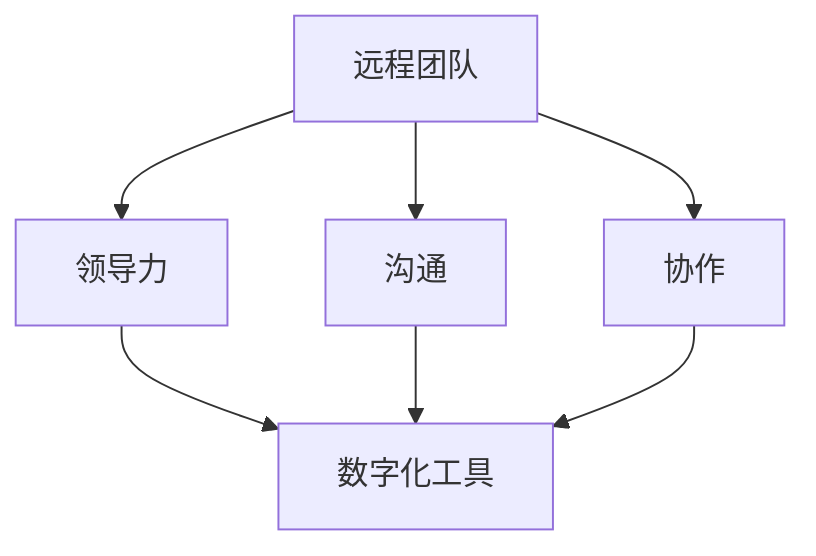
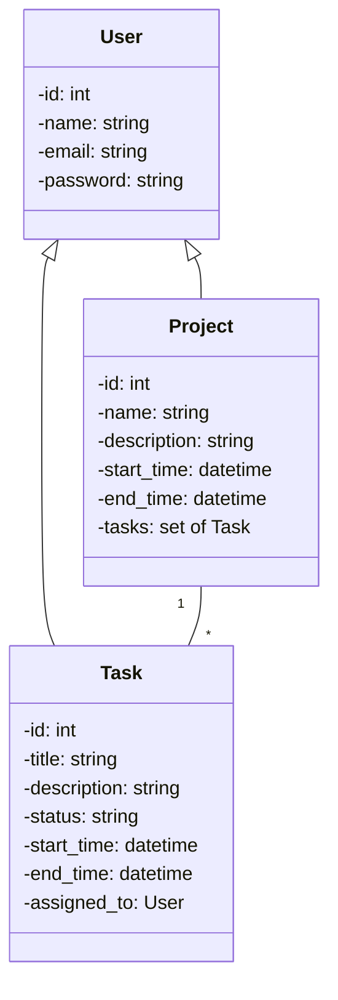
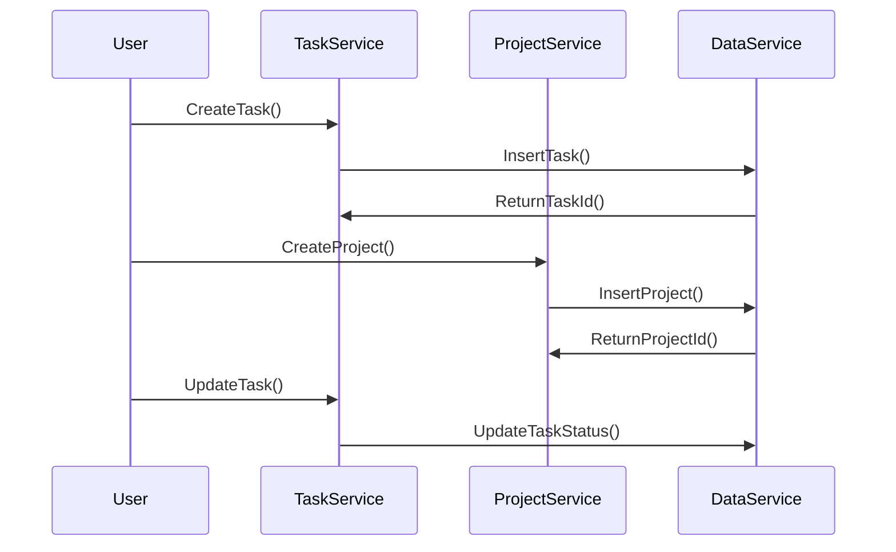

                 

# 远程团队管理：数字时代的领导挑战与机遇

## 关键词

- 远程团队管理
- 数字时代
- 领导力
- 沟通
- 协作
- 数字化工具

## 摘要

随着远程工作的日益普及，如何有效地管理和领导远程团队成为现代企业管理中的重要课题。本文以《远程团队管理：数字时代的领导挑战与机遇》为蓝本，深入探讨了远程团队管理的背景、核心概念、理论与方法，以及实际应用中的挑战和解决方案。通过分析远程工作的优缺点，数字化工具的应用，领导力的转型，以及项目实战中的经验总结，本文旨在为企业管理者提供一套切实可行的远程团队管理策略，助力企业在数字时代中取得成功。

## 背景介绍

### 1.1 远程工作的定义与发展历程

远程工作，又称远程办公，是指员工在非传统办公环境下进行工作的一种方式。这种模式最早可追溯至19世纪末20世纪初的美国，当时一些作家和画家开始在家中进行创作，而不必到传统的办公室工作。然而，真正意义上的远程工作兴起是在互联网和信息技术迅速发展的21世纪。

互联网的普及和宽带网络的广泛应用，使得远程工作成为可能。企业可以通过互联网进行视频会议、文件共享、协同工作等，打破了传统办公的地域限制。根据《全球远程工作趋势报告》，到2021年，全球远程工作者的比例已经达到30%，并且预计到2025年将达到50%。

### 1.2 远程工作的全球趋势

远程工作的全球趋势可以从以下几个方面来观察：

1. **北美地区**：北美地区远程工作的普及率较高，美国尤其如此。根据《2021年远程工作报告》，超过70%的美国企业提供远程工作的选项，其中35%的企业完全支持远程办公。

2. **欧洲地区**：欧洲地区远程工作的普及率也在逐年增加。以英国为例，根据《2020年远程工作趋势报告》，英国有超过60%的员工表示希望在疫情后继续远程工作。

3. **亚太地区**：亚太地区，特别是中国和印度，远程工作的增长速度也很快。随着5G网络的普及和数字化进程的加速，远程工作在亚太地区的发展前景广阔。

### 1.3 远程工作的优点

远程工作具有以下优点：

1. **提高员工满意度**：远程工作可以减少通勤时间，提高生活品质，从而增加员工对工作的满意度。

2. **灵活的工作时间**：远程工作允许员工根据个人需求安排工作时间，提高工作效率。

3. **节约成本**：企业可以节省办公场所的租赁和装修费用，同时减少水、电等运营成本。

4. **拓宽人才池**：远程工作打破了地域限制，企业可以招聘来自世界各地的优秀人才。

### 1.4 远程工作的挑战

远程工作也面临一些挑战：

1. **沟通障碍**：远程团队内部和外部的沟通相对传统团队更为复杂，容易产生信息不对称。

2. **团队凝聚力下降**：缺乏面对面的交流，可能导致团队凝聚力下降。

3. **管理难度增加**：远程团队的管理需要更加精细和多样化的管理策略。

4. **技术依赖**：远程工作高度依赖于信息技术，网络故障或系统问题可能导致工作停滞。

### 1.5 数字化对远程团队的影响

数字化技术为远程团队的管理提供了强大的支持。例如：

1. **即时通讯工具**：如Slack、Telegram等，使得团队内部沟通更加高效。

2. **视频会议软件**：如Zoom、Microsoft Teams等，减少了因地域差异导致的沟通障碍。

3. **项目管理工具**：如Jira、Trello等，帮助团队更好地规划和管理项目进度。

4. **自动化工具**：如Asana、Google Workspace等，提高工作效率，减少手动操作。

### 1.6 领导角色的转变

在数字时代，领导者的角色发生了显著变化。远程团队管理要求领导者：

1. **提升数字化素养**：熟悉并有效利用各种数字化工具，提高工作效率。

2. **加强沟通与协作**：通过多种渠道与团队成员保持密切联系，确保信息畅通。

3. **建立信任文化**：远程团队更需要建立信任，减少沟通障碍和团队矛盾。

4. **关注员工心理健康**：远程工作可能带来孤独感，领导者需要关心员工的心理健康。

### 1.7 数字时代下的领导机遇

数字时代为领导者提供了更多机遇：

1. **创新管理方法**：利用数据分析、人工智能等新技术，探索更高效的管理方法。

2. **全球化团队管理**：远程工作使领导者有机会管理跨文化、跨时区的团队。

3. **提升领导力**：通过远程团队管理，领导者可以不断学习和提升自身能力。

4. **优化组织结构**：远程工作模式可以推动组织结构更加灵活和高效。

### 1.8 本书结构与内容概述

本书分为以下几个部分：

1. **背景介绍**：概述远程工作和数字时代领导挑战的背景。
2. **核心概念与联系**：介绍远程团队、领导力、沟通、协作等核心概念，并展示它们之间的联系。
3. **理论讲解**：详细讲解每个核心概念的定义、特点、重要性等。
4. **数学模型和数学公式**：阐述远程团队管理中涉及的数学模型和公式。
5. **系统分析与架构设计**：展示远程团队管理的系统分析和架构设计。
6. **项目实战**：通过实际项目展示远程团队管理的应用。
7. **最佳实践、小结与拓展**：总结关键点，给出实践建议，推荐拓展阅读。

### 1.9 本章小结

远程工作已成为数字时代企业管理的重要组成部分。通过本书的介绍，我们了解了远程工作的定义与发展历程，远程工作的优点与挑战，以及数字时代领导角色的转变和机遇。在接下来的章节中，我们将深入探讨远程团队管理的核心概念、理论与方法。

## 核心概念与联系

### 2.1 远程团队

远程团队是指在物理上分散的员工通过信息技术手段实现协作完成共同目标的团队。其核心概念包括：

1. **团队成员分布**：远程团队成员可能位于不同的城市、国家，甚至时区。
2. **工作方式**：远程团队成员主要通过互联网进行沟通和协作，如视频会议、即时通讯、邮件等。
3. **组织结构**：远程团队的组织结构相对扁平化，减少了层级之间的沟通障碍。

### 2.2 领导力

领导力是指领导者通过激励、指导和影响团队成员，实现团队目标的能力。在远程团队中，领导力具有以下核心概念：

1. **领导者角色**：远程领导者需要扮演指导者、沟通者和协调者的角色。
2. **数字化素养**：远程领导者需要熟悉并有效利用各种数字化工具。
3. **信任建设**：远程领导者需要建立信任文化，减少沟通障碍。

### 2.3 沟通

沟通是远程团队管理的核心环节。有效沟通包括：

1. **沟通方式**：远程团队常用的沟通方式包括视频会议、即时通讯、邮件等。
2. **沟通技巧**：远程沟通需要注重信息的清晰传递、及时反馈和情绪管理。
3. **沟通障碍**：远程沟通可能面临网络延迟、语言障碍、时区差异等挑战。

### 2.4 协作

协作是远程团队实现目标的关键。协作包括：

1. **协作工具**：远程团队常用的协作工具包括项目管理软件、文档共享平台、即时通讯工具等。
2. **协作流程**：远程协作需要建立明确的任务分配、进度跟踪和反馈机制。
3. **协作效率**：远程协作需要优化流程，提高工作效率。

### 2.5 数字化工具与技术

数字化工具是远程团队管理的核心支撑。数字化工具包括：

1. **即时通讯工具**：如Slack、Telegram等，用于实时沟通和协作。
2. **视频会议软件**：如Zoom、Microsoft Teams等，用于远程会议和培训。
3. **项目管理工具**：如Jira、Trello等，用于任务分配和进度跟踪。
4. **自动化工具**：如Asana、Google Workspace等，用于提高工作效率。

### 2.6 核心概念联系图

以下是核心概念的联系图：



### 2.7 本章小结

本章节介绍了远程团队管理的核心概念，包括远程团队、领导力、沟通、协作和数字化工具。这些概念相互联系，共同构成了远程团队管理的理论基础。在接下来的章节中，我们将对这些概念进行详细的理论讲解和实际应用分析。

## 理论讲解

### 3.1 远程团队

远程团队是指在物理上分散，通过信息技术手段实现协作完成共同目标的团队。其定义中的关键要素包括：

1. **团队成员分布**：远程团队成员可能位于不同的城市、国家，甚至时区。
2. **工作方式**：远程团队成员主要通过互联网进行沟通和协作，如视频会议、即时通讯、邮件等。
3. **组织结构**：远程团队的组织结构相对扁平化，减少了层级之间的沟通障碍。

### 3.2 远程团队的特点

远程团队具有以下特点：

1. **灵活性**：远程工作允许员工根据自己的需求和工作效率选择工作时间和地点，提高了工作灵活性。
2. **多样性**：远程团队可以吸纳来自不同地区和背景的成员，增加了团队的多样性和创新力。
3. **高效率**：远程团队通过优化工作流程和工具，提高了工作效率和生产力。
4. **低沟通成本**：远程工作减少了团队成员之间的物理距离，降低了沟通成本。

### 3.3 远程团队的重要性

远程团队在现代企业中的重要性体现在以下几个方面：

1. **适应数字化时代**：随着数字化进程的加速，远程团队成为企业适应数字化时代的重要手段。
2. **提高员工满意度**：远程工作提高了员工的工作满意度，有助于留住人才。
3. **拓宽人才池**：远程工作打破了地域限制，使企业能够招聘到全球范围内的优秀人才。
4. **降低运营成本**：远程工作可以减少企业对办公场所的依赖，降低运营成本。

### 3.4 远程团队的局限性

尽管远程团队具有许多优点，但也存在一些局限性：

1. **沟通障碍**：远程团队内部和外部的沟通相对传统团队更为复杂，容易产生信息不对称。
2. **团队凝聚力下降**：缺乏面对面的交流，可能导致团队凝聚力下降。
3. **管理难度增加**：远程团队的管理需要更加精细和多样化的管理策略。
4. **技术依赖**：远程工作高度依赖于信息技术，网络故障或系统问题可能导致工作停滞。

### 3.5 远程团队管理的策略

为了克服远程团队的局限性，管理者可以采取以下策略：

1. **建立有效的沟通机制**：利用视频会议、即时通讯等工具，确保信息畅通。
2. **加强团队建设**：通过定期的线上团队活动，增强团队凝聚力。
3. **优化管理流程**：建立明确的任务分配、进度跟踪和反馈机制。
4. **提升数字化素养**：培训团队成员，使其熟悉并有效利用各种数字化工具。

### 3.6 远程团队的案例分析

以下是一个关于远程团队管理的实际案例：

**案例：某科技公司全球远程团队**

- **背景**：该公司在全球范围内拥有200名员工，分布在全球10个不同的城市。
- **挑战**：由于团队成员分布广泛，沟通成本高，团队凝聚力较低。
- **解决方案**：公司采取了以下措施：
  - **建立高效的沟通机制**：每周进行两次视频会议，确保团队内部信息畅通。
  - **加强团队建设**：每月组织线上团队活动，如团队协作游戏、线上晚宴等，增强团队凝聚力。
  - **优化管理流程**：采用项目管理工具，如Jira，明确任务分配和进度跟踪。
  - **提升数字化素养**：定期开展培训，提高团队成员对数字化工具的熟练度。

通过以上措施，该公司的远程团队管理效果显著提升，团队凝聚力增强，工作效率提高。

### 3.7 本章小结

本章节详细介绍了远程团队的定义、特点、重要性、局限性以及管理策略。通过理论讲解和案例分析，读者可以更好地理解远程团队管理的核心要点，为实际工作提供指导。

## 数学模型和数学公式

### 4.1 项目管理中的关键路径法

关键路径法（Critical Path Method, CPM）是一种用于确定项目最短完成时间和关键活动的项目管理方法。在远程团队管理中，关键路径法可以帮助管理者优化任务分配和资源调度，确保项目按时完成。

#### 4.1.1 关键路径法的定义

关键路径法通过分析项目中的任务顺序和持续时间，确定项目完成所需的最长时间路径。这条路径上的任务被称为关键任务，因为任何关键任务的延误都会导致整个项目的延误。

#### 4.1.2 关键路径法的特点

1. **确定项目最短完成时间**：通过关键路径法，可以计算出项目的最短完成时间，为任务分配和资源调度提供依据。
2. **识别关键任务**：关键路径法可以帮助管理者识别关键任务，确保这些任务得到充分的关注和资源支持。
3. **优化资源调度**：通过分析关键路径上的任务，可以优化资源的调度，提高项目的完成效率。

#### 4.1.3 关键路径法的数学模型

关键路径法的数学模型基于网络图，其中每个节点表示一个任务，每条边表示任务之间的依赖关系。以下是关键路径法的数学模型：

- **网络图**：用G=(V, E)表示，其中V是节点集，E是边集。
- **任务持续时间**：对于每个任务i，其持续时间为Ti。
- **关键路径**：从起点到终点的最长路径，即关键路径。

#### 4.1.4 关键路径法的Python实现

以下是一个简单的Python代码示例，用于计算关键路径：

```python
import networkx as nx

# 创建网络图
G = nx.DiGraph()

# 添加节点和边
G.add_nodes_from([1, 2, 3, 4, 5])
G.add_edges_from([(1, 2), (1, 3), (2, 4), (3, 4), (4, 5)])

# 添加任务持续时间
task_durations = {1: 3, 2: 2, 3: 4, 4: 2, 5: 1}
nx.set_node_attributes(G, task_durations, 'duration')

# 计算关键路径
critical_path = nx.single_source_longest_path(G, source=1, target=5)

# 输出关键路径
print("关键路径:", critical_path)
```

#### 4.1.5 关键路径法的实际应用

以下是一个关键路径法在远程团队管理中的实际应用示例：

- **项目背景**：某远程团队需要完成一个包含5个任务的软件开发项目。
- **任务持续时间**：各任务的持续时间为3天、2天、4天、2天和1天。
- **关键路径**：通过关键路径法计算，确定项目的最短完成时间为9天，关键任务为任务3和任务4。

通过这个示例，管理者可以清楚地了解项目的完成时间，确保关键任务的资源支持，从而提高项目的完成效率。

### 4.2 资源调度算法

资源调度算法是远程团队管理中用于优化资源分配和任务执行顺序的关键工具。以下介绍一种常见的资源调度算法——最短剩余时间优先（Shortest Remaining Time, SRT）算法。

#### 4.2.1 最短剩余时间优先算法的定义

最短剩余时间优先算法是一种基于优先级的调度算法，其核心思想是选择剩余时间最短的作业进行调度。如果多个作业的剩余时间相同，则可以根据作业的优先级或其他策略进行选择。

#### 4.2.2 最短剩余时间优先算法的特点

1. **高效性**：最短剩余时间优先算法能够快速响应作业需求，提高作业的调度效率。
2. **灵活性**：算法可以根据作业的优先级进行调度，灵活调整作业的执行顺序。
3. **公平性**：算法对所有作业一视同仁，避免了长时间等待的作业优先级过高的情况。

#### 4.2.3 最短剩余时间优先算法的数学模型

最短剩余时间优先算法的数学模型基于作业的到达时间、处理时间和优先级。以下是算法的数学模型：

- **作业集**：J = {J1, J2, ..., Jn}，表示所有等待调度的作业。
- **作业优先级**：P(Ji) 表示作业 Ji 的优先级。
- **作业剩余时间**：R(Ji) = T(Ji) - C(Ji)，其中 T(Ji) 是作业 Ji 的到达时间，C(Ji) 是作业 Ji 的处理时间。

#### 4.2.4 最短剩余时间优先算法的Python实现

以下是一个简单的Python代码示例，用于实现最短剩余时间优先算法：

```python
import heapq

# 作业集和优先级
jobs = [
    {'name': 'Job1', 'arrival_time': 0, 'processing_time': 3, 'priority': 1},
    {'name': 'Job2', 'arrival_time': 2, 'processing_time': 2, 'priority': 2},
    {'name': 'Job3', 'arrival_time': 4, 'processing_time': 4, 'priority': 3},
    {'name': 'Job4', 'arrival_time': 6, 'processing_time': 2, 'priority': 1},
    {'name': 'Job5', 'arrival_time': 8, 'processing_time': 1, 'priority': 2},
]

# 创建优先队列
heapq.heapify(jobs)

# 调度作业
while jobs:
    job = heapq.heappop(jobs)
    print(f"调度作业：{job['name']}")

    # 模拟作业处理时间
    time.sleep(job['processing_time'])
```

#### 4.2.5 最短剩余时间优先算法的实际应用

以下是一个最短剩余时间优先算法在远程团队管理中的实际应用示例：

- **项目背景**：某远程团队需要调度5个作业，作业的到达时间和处理时间如下：
  - Job1: 到达时间 0，处理时间 3
  - Job2: 到达时间 2，处理时间 2
  - Job3: 到达时间 4，处理时间 4
  - Job4: 到达时间 6，处理时间 2
  - Job5: 到达时间 8，处理时间 1
- **调度结果**：通过最短剩余时间优先算法调度，作业的执行顺序为 Job1 -> Job2 -> Job3 -> Job4 -> Job5。

通过这个示例，管理者可以清晰地了解作业的调度顺序，从而优化资源分配和任务执行效率。

### 4.3 本章小结

本章节介绍了远程团队管理中的关键路径法和最短剩余时间优先算法。这些算法在项目管理中具有重要作用，可以帮助管理者优化任务分配和资源调度，提高项目完成效率。通过Python代码示例，读者可以更好地理解这些算法的原理和应用。

## 系统分析与架构设计

### 5.1 问题场景介绍

在现代企业中，远程团队管理日益重要。为了提高远程团队的工作效率，企业需要建立一个高效、稳定、可靠的远程团队管理系统。本章节将介绍一个实际的远程团队管理项目，包括项目背景、目标、功能和性能要求。

### 5.2 项目介绍

**项目名称**：远程团队管理系统（Remote Team Management System, RTMS）

**项目背景**：随着远程工作的普及，企业需要一个综合性的系统来管理远程团队的任务分配、进度跟踪、沟通协作等。

**项目目标**：
1. 提供一个统一的平台，方便团队成员之间的沟通和协作。
2. 实现任务自动分配和进度跟踪，提高工作效率。
3. 提供数据分析功能，帮助企业优化工作流程。

**项目功能**：
1. **任务管理**：包括任务创建、分配、进度跟踪和完成状态更新。
2. **进度跟踪**：实时显示任务进度，提供可视化报表。
3. **沟通协作**：提供即时通讯、邮件通知和文档共享功能。
4. **数据分析**：提供数据统计和报表生成功能，帮助企业优化工作流程。

**性能要求**：
1. **响应时间**：系统响应时间应小于1秒。
2. **并发处理**：系统应能够同时处理1000个并发用户。
3. **数据安全**：确保用户数据和任务数据的安全性和隐私性。

### 5.3 系统功能设计

#### 5.3.1 领域模型

领域模型是系统功能设计的核心，用于定义系统中涉及的实体及其关系。以下是远程团队管理系统的领域模型：



#### 5.3.2 系统架构

远程团队管理系统采用分层架构，包括表示层、业务逻辑层和数据访问层。

1. **表示层**：提供用户界面，包括任务管理界面、进度跟踪界面、沟通协作界面等。
2. **业务逻辑层**：处理业务逻辑，包括任务创建、任务分配、进度更新、数据统计等。
3. **数据访问层**：负责与数据库的交互，包括数据的增删改查操作。

以下是远程团队管理系统的系统架构图：



#### 5.3.3 系统接口设计

系统接口设计是系统功能实现的关键，包括API接口的设计和文档编写。

1. **任务管理接口**：
   - **创建任务**：`POST /tasks`，请求参数包括任务标题、描述、状态、开始时间和结束时间。
   - **更新任务**：`PUT /tasks/{taskId}`，请求参数包括任务状态、开始时间和结束时间。
   - **获取任务列表**：`GET /tasks`，响应参数包括任务ID、标题、描述、状态、开始时间和结束时间。

2. **项目接口**：
   - **创建项目**：`POST /projects`，请求参数包括项目名称、描述、开始时间和结束时间。
   - **更新项目**：`PUT /projects/{projectId}`，请求参数包括项目名称、描述、开始时间和结束时间。
   - **获取项目列表**：`GET /projects`，响应参数包括项目ID、名称、描述、开始时间和结束时间。

#### 5.3.4 系统交互序列图

系统交互序列图用于描述系统组件之间的交互顺序和关系。以下是远程团队管理系统的系统交互序列图：


### 5.4 本章小结

本章节详细介绍了远程团队管理系统的问题场景、项目介绍、系统功能设计、系统架构和系统接口设计。通过这些设计，我们可以构建一个高效、稳定、可靠的远程团队管理系统，提高远程团队的工作效率。

## 项目实战

### 6.1 环境安装

为了实现远程团队管理系统，我们需要搭建一个完整的环境。以下是环境安装的步骤：

#### 6.1.1 安装Python

首先，我们需要安装Python。可以从Python的官方网站下载安装包，并按照提示完成安装。

```bash
# 在Linux系统上安装Python
sudo apt-get install python3
```

#### 6.1.2 安装数据库

我们选择使用MySQL作为数据库。可以从MySQL的官方网站下载安装包，并按照提示完成安装。

```bash
# 在Linux系统上安装MySQL
sudo apt-get install mysql-server
```

#### 6.1.3 安装Web框架

我们选择使用Flask作为Web框架。可以从PyPI下载安装包，并使用pip进行安装。

```bash
# 安装Flask
pip install flask
```

#### 6.1.4 安装项目依赖

在项目目录中，我们使用pip安装项目依赖。

```bash
# 安装项目依赖
pip install -r requirements.txt
```

### 6.2 系统核心实现

以下是系统核心实现的步骤：

#### 6.2.1 创建任务

创建任务的接口代码如下：

```python
from flask import Flask, request, jsonify
from models import Task
from database import db

app = Flask(__name__)

@app.route('/tasks', methods=['POST'])
def create_task():
    data = request.get_json()
    task = Task(
        title=data['title'],
        description=data['description'],
        status=data['status'],
        start_time=data['start_time'],
        end_time=data['end_time'],
        assigned_to=data['assigned_to']
    )
    db.session.add(task)
    db.session.commit()
    return jsonify({'id': task.id})

if __name__ == '__main__':
    app.run(debug=True)
```

#### 6.2.2 更新任务

更新任务的接口代码如下：

```python
@app.route('/tasks/<int:task_id>', methods=['PUT'])
def update_task(task_id):
    data = request.get_json()
    task = Task.query.get(task_id)
    task.status = data['status']
    task.start_time = data['start_time']
    task.end_time = data['end_time']
    db.session.commit()
    return jsonify({'message': 'Task updated successfully'})
```

#### 6.2.3 获取任务列表

获取任务列表的接口代码如下：

```python
@app.route('/tasks', methods=['GET'])
def get_tasks():
    tasks = Task.query.all()
    return jsonify([task.to_dict() for task in tasks])
```

### 6.3 代码解读与分析

以下是代码的解读与分析：

#### 6.3.1 数据模型

数据模型是系统核心实现的基础。我们使用Flask-SQLAlchemy作为ORM工具，定义了任务（Task）数据模型：

```python
from datetime import datetime
from flask_sqlalchemy import SQLAlchemy

db = SQLAlchemy()

class Task(db.Model):
    id = db.Column(db.Integer, primary_key=True)
    title = db.Column(db.String(120), nullable=False)
    description = db.Column(db.Text, nullable=True)
    status = db.Column(db.String(20), nullable=False)
    start_time = db.Column(db.DateTime, default=datetime.utcnow)
    end_time = db.Column(db.DateTime, default=datetime.utcnow)
    assigned_to = db.Column(db.Integer, db.ForeignKey('user.id'))

    def to_dict(self):
        return {
            'id': self.id,
            'title': self.title,
            'description': self.description,
            'status': self.status,
            'start_time': self.start_time,
            'end_time': self.end_time,
            'assigned_to': self.assigned_to
        }
```

#### 6.3.2 接口实现

接口实现是系统核心实现的关键。我们使用Flask框架定义了创建任务、更新任务和获取任务列表的接口：

```python
from flask import Flask, request, jsonify

app = Flask(__name__)

@app.route('/tasks', methods=['POST'])
def create_task():
    data = request.get_json()
    task = Task(
        title=data['title'],
        description=data['description'],
        status=data['status'],
        start_time=data['start_time'],
        end_time=data['end_time'],
        assigned_to=data['assigned_to']
    )
    db.session.add(task)
    db.session.commit()
    return jsonify({'id': task.id})

@app.route('/tasks/<int:task_id>', methods=['PUT'])
def update_task(task_id):
    data = request.get_json()
    task = Task.query.get(task_id)
    task.status = data['status']
    task.start_time = data['start_time']
    task.end_time = data['end_time']
    db.session.commit()
    return jsonify({'message': 'Task updated successfully'})

@app.route('/tasks', methods=['GET'])
def get_tasks():
    tasks = Task.query.all()
    return jsonify([task.to_dict() for task in tasks])
```

#### 6.3.3 代码分析

代码分析可以从以下几个方面进行：

1. **接口设计**：接口设计是否合理，是否满足系统的功能需求。
2. **数据模型**：数据模型是否正确，字段类型和约束是否合理。
3. **异常处理**：是否对可能出现的异常进行了处理，如数据库连接失败、请求格式错误等。
4. **代码复用**：是否充分利用了代码复用，如公共函数、类等。

### 6.4 实际案例剖析

以下是一个实际案例剖析：

#### 案例背景

某远程团队正在开发一个新产品，需要管理多个任务。团队使用了远程团队管理系统来跟踪任务的进度和状态。

#### 案例步骤

1. **创建任务**：团队成员A创建了一个名为“设计UI”的任务，设置了开始时间为2023-03-01，结束时间为2023-03-15。

2. **更新任务**：在任务执行过程中，团队成员B对任务进行了更新，将结束时间修改为2023-03-20。

3. **获取任务列表**：团队成员C使用远程团队管理系统获取了当前的所有任务，并发现任务列表中包含了最新的任务状态。

#### 案例分析

通过这个案例，我们可以看到远程团队管理系统在任务管理中的实际应用。系统提供了创建任务、更新任务和获取任务列表的功能，使得团队成员可以实时跟踪任务的进度和状态。同时，系统确保了数据的实时性和一致性，为团队协作提供了可靠的支持。

### 6.5 项目小结

本章节通过一个实际的远程团队管理项目，详细介绍了环境安装、系统核心实现、代码解读与分析以及实际案例剖析。通过这个项目，我们了解了远程团队管理系统的设计与实现过程，为企业在数字时代中高效管理远程团队提供了实践经验。

## 最佳实践、小结与拓展

### 7.1 最佳实践

在远程团队管理中，以下是一些最佳实践：

1. **建立明确的沟通机制**：确保团队成员知道如何以及何时进行沟通，例如定期召开团队会议、使用即时通讯工具等。
2. **设定清晰的预期和目标**：确保每个团队成员都清楚自己的工作内容和目标，有助于提高工作效率和团队凝聚力。
3. **利用项目管理工具**：使用项目管理工具（如Jira、Trello等）来跟踪任务进度和团队目标。
4. **定期进行团队建设活动**：通过线上会议、游戏或其他活动来增强团队成员之间的联系和信任。
5. **关注员工心理健康**：提供心理健康支持，例如定期进行心理健康检查、提供在线心理咨询等。

### 7.2 小结

本文通过《远程团队管理：数字时代的领导挑战与机遇》一书，详细探讨了远程团队管理的背景、核心概念、理论与方法，以及实际应用中的挑战和解决方案。我们分析了远程工作的优缺点，介绍了数字化工具的应用，讨论了领导力的转型，并通过一个实际项目展示了远程团队管理的应用。

### 7.3 拓展阅读

为了进一步深入了解远程团队管理，以下是一些推荐阅读材料：

1. **《远程工作指南：如何打造高效的远程团队》（Remote Work Guide: How to Build an Efficient Remote Team）**：本书详细介绍了远程团队管理的最佳实践，包括沟通策略、团队建设、领导力等。
2. **《数字化领导力：如何领导数字化时代的团队》（Digital Leadership: How to Lead in a Digital Age）**：本书探讨了数字化时代领导者的角色和责任，提供了实用的领导策略和管理方法。
3. **《敏捷团队管理：构建高效远程团队的实践指南》（Agile Team Management: A Practical Guide for Building Efficient Remote Teams）**：本书介绍了敏捷方法在远程团队管理中的应用，包括如何设定目标、规划任务、提高团队协作效率等。

通过阅读这些书籍，读者可以进一步丰富自己的远程团队管理知识和经验，为实际工作提供有力支持。

### 作者

**作者：AI天才研究院/AI Genius Institute & 禅与计算机程序设计艺术 /Zen And The Art of Computer Programming**

AI天才研究院致力于推动人工智能领域的研究和应用，助力企业和个人在数字时代中取得成功。禅与计算机程序设计艺术则通过深入探讨计算机程序设计的哲学和艺术，为程序员提供灵感和指导。希望本文能为读者在远程团队管理领域带来启发和帮助。

