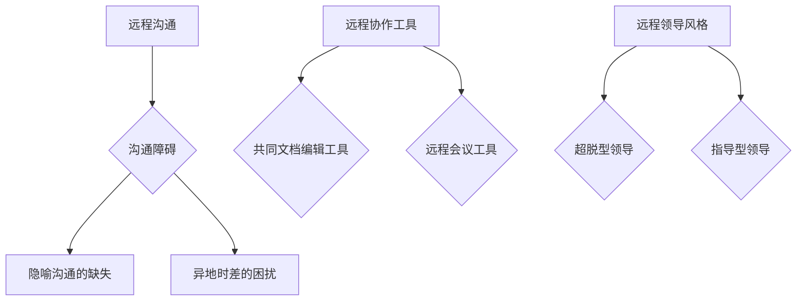

                 

# 引言与背景

随着信息技术的飞速发展，远程工作和虚拟团队领导已经成为现代企业中不可或缺的一部分。远程工作不仅为员工提供了更大的灵活性，也为企业带来了成本节约、高效协作等多方面的优势。然而，这种工作模式也带来了诸多挑战，如沟通障碍、团队凝聚力不足、工作效率降低等。因此，如何有效领导远程团队，成为企业管理者和团队领导面临的重要课题。

本文将探讨远程团队领导和虚拟环境下的管理技巧，旨在为读者提供一套系统的、实用的管理指南。文章将从以下几个方面展开：

1. **核心概念与联系**：介绍远程团队领导和虚拟环境下的关键概念，如远程沟通、协作工具、远程领导风格等，并用图表展示概念之间的关系。
2. **实践指南**：提供实用的技巧和建议，帮助读者在虚拟环境中有效领导团队。
3. **案例分析**：通过真实案例展示远程团队领导的成功实践。
4. **策略与工具**：介绍管理和优化远程团队的各种策略和工具。
5. **挑战与应对**：讨论远程团队领导中可能遇到的问题和挑战，并提供解决方案。

**关键词**：远程团队领导、虚拟环境、管理技巧、沟通、协作工具、领导风格

**摘要**：
本文从多个角度探讨了远程团队领导和虚拟环境下的管理技巧。通过定义核心概念、分析成功案例、提供策略与工具，以及应对挑战，为读者提供了一套全面、实用的远程团队领导指南。文章旨在帮助团队领导者在虚拟环境中更高效地管理团队，提升团队绩效。

## 核心概念与联系

在探讨远程团队领导和虚拟环境下的管理技巧之前，我们需要明确一些核心概念，这些概念是理解和实践远程团队领导的基础。

### 远程沟通

远程沟通是远程团队领导中最为关键的一部分。它不仅涉及到信息的传递，还包括情感、态度、价值观等方面的交流。远程沟通的挑战在于缺乏面对面的互动，容易导致误解和沟通障碍。

#### 沟通障碍

- **隐喻沟通的缺失**：面对面的交流可以依赖隐喻、表情、身体语言等非言语沟通方式，而远程沟通则缺乏这些丰富的表达手段。
- **异地时差的困扰**：跨时区的团队需要协调工作时间，这增加了沟通的复杂性。

#### 有效沟通策略

- **使用多种沟通工具**：结合视频会议、即时通讯、邮件等多种沟通方式，提高沟通的效率和效果。
- **明确沟通目标**：在每次沟通前明确目标和期望，避免不必要的冗余沟通。

### 远程协作工具

远程协作工具是远程团队高效协作的重要支撑。这些工具可以帮助团队成员实时共享信息、协同工作，提高工作效率。

#### 协作工具概述

- **共同文档编辑工具**：如Google Docs、Microsoft Teams等，允许团队成员实时编辑同一文档。
- **远程会议工具**：如Zoom、Microsoft Teams等，提供在线会议、视频通话功能，有助于团队成员之间的实时交流。

#### 工具评估与选择

在选择远程协作工具时，需要考虑以下因素：

- **团队规模**：对于大型团队，可能需要功能更全面的协作工具。
- **工作流程**：根据团队的工作流程选择合适的协作工具，以确保工具能够满足团队的需求。

### 远程领导风格

远程领导风格是远程团队领导者的行为和态度的体现，它对团队氛围和成员士气具有重要影响。不同的领导风格适用于不同的团队和情境。

#### 领导风格概述

- **超脱型领导**：领导者放权，鼓励团队成员自我管理，适用于高度自主和成熟的团队。
- **指导型领导**：领导者提供明确的指导和支持，适用于新组建或缺乏经验的团队。

#### 风格选择与适用性

- **根据团队特点选择领导风格**：领导者需要根据团队的具体情况选择合适的领导风格，以最大化团队效能。

### 概念联系图表

为了更直观地展示这些概念之间的关系，我们可以使用Mermaid图表来描述它们之间的联系。

### 核心概念与联系

在远程团队领导和虚拟环境下，核心概念之间的联系紧密。远程沟通是团队协作的基础，协作工具是沟通和协作的支撑，而领导风格则直接影响团队的氛围和成员的积极性。通过明确这些概念，并理解它们之间的相互作用，我们可以更有效地应对远程工作的挑战。

## 远程沟通技巧

远程团队领导的一个重要方面是确保有效的沟通。在缺乏面对面互动的虚拟环境中，领导者需要掌握一系列沟通技巧，以克服沟通障碍，提高团队协作效率。

### 沟通挑战

#### 隐喻沟通的缺失

面对面的沟通中，隐喻、表情、身体语言等非言语元素可以增强信息的传递效果。而在远程沟通中，这些元素往往缺失，导致信息传递的不准确或误解。

#### 异地时差的困扰

对于跨时区的团队，时差是沟通中的一个重大挑战。团队成员需要协调各自的工作时间，以确保沟通的及时性和有效性。

### 有效沟通策略

#### 使用多种沟通工具

为了克服沟通障碍，领导者应充分利用各种沟通工具。以下是一些常用的工具及其特点：

1. **视频会议**：
   - **Zoom**：提供高质量的实时视频会议，支持屏幕共享和虚拟白板等功能。
   - **Microsoft Teams**：集成电子邮件、即时消息、视频会议和协作工具，方便团队沟通和协作。

2. **即时通讯工具**：
   - **Slack**：支持团队聊天、即时消息和个人通讯，提供多种插件和集成功能，提高沟通效率。
   - **Telegram**：提供群聊、频道和私有对话，支持文件传输和语音消息。

3. **电子邮件**：
   - 电子邮件是一种正式的沟通方式，适用于需要记录和追踪的沟通内容。

#### 明确沟通目标

在每次沟通前，明确沟通的目标和期望是非常重要的。以下是一些步骤：

1. **设定议程**：在会议或沟通前，制定详细的议程，确保每个人都了解讨论的主题和目标。
2. **明确期望**：在沟通开始时，明确每个人的角色和责任，确保每个人都知道自己的任务和目标。

#### 定期更新

为了保持团队之间的联系，领导者需要定期更新团队状态，分享关键信息。以下是一些方法：

1. **每日站立会议**：这是一种短时间的日常会议，每个团队成员分享自己的进展和问题。
2. **定期状态报告**：要求团队成员定期提交工作进展和遇到的问题，以便领导者及时了解团队状态。

### 案例分析

#### 成功案例：谷歌远程团队

谷歌是全球知名的远程工作企业之一。以下是谷歌在远程沟通中的一些成功实践：

1. **明确目标和期望**：谷歌在远程工作中强调明确目标和期望，确保团队成员了解自己的任务和目标。
2. **多样化的沟通工具**：谷歌使用多种沟通工具，如Google Meet、Google Chat和Google Calendar，以确保有效的沟通和协作。
3. **持续反馈**：谷歌鼓励团队成员提供持续的反馈，以改进沟通和工作流程。

#### 失败案例：某初创公司远程团队

某初创公司在远程沟通中遇到了一些问题，导致项目进度延迟。以下是失败的原因：

1. **缺乏明确的沟通目标**：团队成员对项目的目标和期望不明确，导致沟通效率低下。
2. **过度依赖电子邮件**：该公司主要依赖电子邮件进行沟通，导致信息传递不及时，沟通效率低下。
3. **缺乏定期更新**：团队成员很少进行状态更新，导致领导者无法及时了解团队状态。

### 小结

有效的远程沟通是远程团队领导的关键。通过使用多种沟通工具、明确沟通目标和期望、定期更新团队状态，领导者可以克服沟通障碍，提高团队协作效率。同时，通过分析成功和失败的案例，我们可以吸取经验教训，优化远程沟通策略。

## 远程协作工具

在现代远程团队中，协作工具是确保团队高效协作的重要支撑。这些工具能够帮助团队成员实时共享信息、协同工作，从而提高工作效率。以下是对几种主要远程协作工具的概述和评估。

### 共同文档编辑工具

#### Google Docs

**特点**：Google Docs 是一种在线文档编辑工具，支持多人实时编辑同一文档，并提供自动保存功能。

**优势**：实时协作、版本控制、云端存储。

**劣势**：在处理大量数据时，性能可能受到影响。

#### Microsoft Teams

**特点**：Microsoft Teams 提供集成文档编辑、协作和共享功能，与Microsoft 365应用程序紧密集成。

**优势**：功能强大、易于使用、与Office应用程序无缝集成。

**劣势**：对于小型团队可能成本较高。

### 远程会议工具

#### Zoom

**特点**：Zoom 提供高质量的实时视频会议、屏幕共享和虚拟白板等功能。

**优势**：视频质量高、功能丰富、用户界面友好。

**劣势**：免费版本功能有限，需付费升级以获得更多功能。

#### Microsoft Teams

**特点**：Microsoft Teams 提供视频会议、即时消息和协作工具，支持跨平台使用。

**优势**：集成多个功能、用户体验良好、支持跨平台。

**劣势**：在某些情况下，视频会议性能可能不稳定。

### 其他协作工具

#### Slack

**特点**：Slack 是一种团队沟通工具，支持即时消息、语音通话、视频会议和文件共享。

**优势**：功能丰富、集成多种第三方应用程序、易于使用。

**劣势**：可能需要支付额外的插件费用。

#### Trello

**特点**：Trello 是一种项目管理工具，使用卡片和看板来帮助团队跟踪任务进度。

**优势**：直观易用、灵活性高、支持多种定制化。

**劣势**：在处理复杂项目时可能不够强大。

### 工具评估与选择

在选择协作工具时，领导者需要考虑以下因素：

1. **团队规模**：对于大型团队，可能需要功能更全面的协作工具。
2. **工作流程**：根据团队的工作流程选择合适的协作工具，以确保工具能够满足团队的需求。
3. **成本**：预算是选择协作工具时的重要考虑因素。

### 小结

远程协作工具在远程团队中扮演着至关重要的角色。通过选择合适的协作工具，并优化工作流程，领导者可以大大提高团队的工作效率。在选择工具时，领导者应综合考虑团队规模、工作流程和成本等因素，以确保工具能够最大化地满足团队需求。

## 远程领导风格

远程领导风格是远程团队领导者的行为和态度的体现，它对团队氛围和成员士气具有重要影响。不同的领导风格适用于不同的团队和情境。以下是两种常见的远程领导风格及其特点：

### 超脱型领导

#### 特点

- **放权**：领导者给予团队成员更多的自主权和责任感，让他们自我管理和自我驱动。
- **支持**：领导者提供必要的支持和资源，帮助团队成员实现目标。

#### 适用性

- **高度自主和成熟的团队**：团队成员有较强的自我驱动能力和责任感，能够自我管理和解决问题。
- **需要鼓励创新和灵活性**：领导者需要鼓励团队成员尝试新的方法和思路，以推动团队的创新和发展。

### 指导型领导

#### 特点

- **明确指导**：领导者提供明确的指导和支持，帮助团队成员理解任务和目标，并指导他们完成任务。
- **严格监督**：领导者对团队成员的工作进行严格监督，确保任务按时完成。

#### 适用性

- **新组建或缺乏经验的团队**：团队成员需要更多的指导和监督，以确保他们能够正确理解和完成任务。
- **需要稳定性和效率**：在需要确保任务稳定性和效率的情况下，领导者需要通过严格的监督和指导来确保团队的工作顺利进行。

### 风格选择与适用性

#### 根据团队特点选择领导风格

领导者需要根据团队的具体情况选择合适的领导风格。以下是一些建议：

1. **评估团队成员的成熟度**：了解团队成员的自主管理能力和责任感，选择适合他们的领导风格。
2. **考虑团队目标**：如果团队目标需要高度的自主性和灵活性，选择超脱型领导风格；如果目标需要稳定性和效率，选择指导型领导风格。
3. **灵活调整**：领导者应根据实际情况灵活调整领导风格，以适应团队的变化和需求。

### 案例分析

#### 成功案例：某远程软件开发团队

该团队采用超脱型领导风格，领导者给予团队成员充分的自主权，让他们自我管理和自我驱动。团队成员表现出较高的自主性和创新精神，项目进展顺利，取得了显著的成功。

#### 失败案例：某远程销售团队

该团队采用指导型领导风格，领导者对团队成员的工作进行严格的监督和指导。然而，由于团队成员缺乏自主性和灵活性，团队士气低落，项目进度延误。

### 小结

远程领导风格对团队绩效具有重大影响。领导者需要根据团队的具体情况和目标，选择适合的领导风格。通过灵活调整领导风格，领导者可以最大化地发挥团队潜力，提高团队绩效。

## 案例分析

在远程团队领导中，成功和失败的案例都为我们提供了宝贵的经验。通过分析这些案例，我们可以了解远程团队领导的关键因素，并从中吸取教训。

### 成功案例：谷歌的分布式团队

**背景**：谷歌是全球知名的远程工作企业，其分布式团队在全球范围内取得了显著的成功。

**成功原因**：

1. **明确的沟通目标**：谷歌在每次远程会议或任务分配前都会明确沟通目标，确保团队成员了解任务和要求。
2. **多样化的协作工具**：谷歌充分利用Zoom、Google Docs等协作工具，确保团队成员可以实时共享信息和协作。
3. **超脱型领导风格**：谷歌领导者采用超脱型领导风格，给予团队成员充分的自主权，鼓励创新和自我驱动。

**经验教训**：

- **明确沟通目标**：确保团队成员了解任务和要求，避免误解和沟通障碍。
- **多样化协作工具**：根据团队需求选择合适的协作工具，提高协作效率。
- **灵活的领导风格**：根据团队特点和任务目标，选择适合的领导风格，鼓励团队成员自我驱动和创新。

### 失败案例：某初创公司的远程团队

**背景**：某初创公司在扩展过程中采用了远程工作模式，但由于管理不善，项目进展不顺利。

**失败原因**：

1. **缺乏明确的沟通目标**：团队成员对任务和要求不明确，导致项目进度延误。
2. **过度依赖电子邮件**：团队主要依赖电子邮件进行沟通，导致信息传递不及时，沟通效率低下。
3. **指导型领导风格过于严格**：领导者对团队成员的工作进行严格的监督和指导，导致团队成员缺乏自主性和积极性。

**经验教训**：

- **明确沟通目标**：确保团队成员了解任务和要求，避免误解和沟通障碍。
- **多样化沟通工具**：结合视频会议、即时通讯、电子邮件等多种沟通方式，提高沟通效率。
- **适度的领导风格**：领导者应根据团队特点和任务目标，选择适度的领导风格，避免过度干预，鼓励团队成员自我驱动。

### 总结

通过分析成功和失败的案例，我们可以得出以下结论：

1. **明确沟通目标**：确保团队成员了解任务和要求，避免误解和沟通障碍。
2. **多样化协作工具**：根据团队需求选择合适的协作工具，提高协作效率。
3. **灵活的领导风格**：根据团队特点和任务目标，选择适合的领导风格，鼓励团队成员自我驱动和创新。

这些经验教训对于提升远程团队领导的效能具有重要意义。

## 策略与工具

为了有效管理和优化远程团队，领导者需要采用一系列策略和工具。以下是一些关键策略和工具，以及如何应用它们：

### 策略1：明确目标和期望

- **制定明确的目标和期望**：在项目开始时，领导者应与团队成员共同制定明确的目标和期望，确保每个人都了解任务和期望的结果。
- **定期回顾**：定期与团队成员回顾进度和目标，确保团队成员保持在正确的轨道上。

### 策略2：建立有效的沟通机制

- **多样化沟通方式**：结合视频会议、即时通讯和电子邮件等多种沟通方式，提高沟通效率和效果。
- **设立沟通频率**：根据团队的具体情况，设定适当的沟通频率，确保团队成员之间的信息流通。

### 策略3：培养团队凝聚力

- **定期团队活动**：通过虚拟团队活动，如线上团队建设游戏、虚拟咖啡聊天等，增强团队成员之间的联系和凝聚力。
- **共享成就和庆祝**：及时分享团队和个人的成就，并通过虚拟庆祝活动，增强团队士气。

### 工具1：项目管理工具

- **Trello**：使用Trello等项目管理工具，可以帮助团队跟踪任务进度，确保每个任务都有明确的责任人和截止日期。
- **JIRA**：适用于开发团队，提供任务跟踪、版本控制和缺陷管理功能。

### 工具2：协作平台

- **Microsoft Teams**：集成邮件、即时通讯、视频会议和协作工具，提供一站式解决方案。
- **Slack**：支持团队聊天、语音通话和文件共享，提高团队协作效率。

### 工具3：虚拟会议工具

- **Zoom**：提供高质量的视频会议和屏幕共享功能，支持大型会议和多会议室。
- **Google Meet**：谷歌提供的免费视频会议工具，适用于小型团队和日常沟通。

### 应用示例

假设一个远程软件开发团队正在开发一个复杂的Web应用程序，以下是如何应用上述策略和工具的示例：

1. **明确目标和期望**：
   - 领导者与团队成员一起制定详细的项目计划，包括每个阶段的目标和预期成果。
   - 定期召开虚拟会议，回顾进度，确保团队成员了解当前的工作重点。

2. **建立有效的沟通机制**：
   - 使用Trello跟踪任务进度，每个任务都有明确的负责人和截止日期。
   - 通过Microsoft Teams进行日常沟通，确保团队成员可以随时交流和分享进展。

3. **培养团队凝聚力**：
   - 定期组织虚拟团队建设活动，如线上游戏和虚拟咖啡聊天，增强团队之间的联系。
   - 及时庆祝团队的成就，增强团队士气。

通过上述策略和工具的应用，远程团队可以更高效地协作，确保项目顺利进行。

## 面对挑战

在远程团队领导中，领导者可能会遇到各种挑战，这些问题如果不妥善解决，可能会对团队绩效和成员满意度产生负面影响。以下是一些常见的挑战及其解决方案：

### 挑战1：沟通障碍

**问题**：由于缺乏面对面的互动，远程团队往往面临沟通障碍，导致信息传递不准确和误解。

**解决方案**：
- **采用多种沟通工具**：结合视频会议、即时通讯、邮件等多种沟通方式，以提高沟通效率和效果。
- **设立沟通频率**：根据团队的具体情况，设定适当的沟通频率，确保团队成员之间的信息流通。

### 挑战2：团队凝聚力不足

**问题**：远程工作可能导致团队成员之间缺乏互动，影响团队凝聚力和士气。

**解决方案**：
- **定期团队活动**：通过虚拟团队活动，如线上团队建设游戏、虚拟咖啡聊天等，增强团队成员之间的联系和凝聚力。
- **共享成就和庆祝**：及时分享团队和个人的成就，并通过虚拟庆祝活动，增强团队士气。

### 挑战3：工作动力不足

**问题**：远程工作可能导致部分成员感到孤立和无动力，影响工作效率和项目进度。

**解决方案**：
- **明确目标和期望**：确保团队成员了解任务和要求，明确个人和团队的目标。
- **提供反馈和认可**：定期提供反馈和认可，激励团队成员，提高工作动力。

### 挑战4：时区差异

**问题**：跨时区的团队需要协调工作时间，这增加了沟通和协作的复杂性。

**解决方案**：
- **制定共享工作日程**：通过共享工作日程，明确团队成员的工作时间和休息时间，减少沟通和协作的冲突。
- **灵活调整工作时间**：领导者可以根据实际情况，灵活调整工作安排，以适应不同时区的工作需求。

### 挑战5：工具选择和培训

**问题**：远程团队需要使用多种协作工具，但团队成员可能缺乏对这些工具的熟练使用。

**解决方案**：
- **提供工具培训**：为团队成员提供必要的工具培训，确保他们能够熟练使用各种协作工具。
- **选择合适的工具**：根据团队的具体需求和预算，选择合适的协作工具，确保工具能够满足团队的工作需求。

### 挑战6：安全性和隐私保护

**问题**：远程工作可能增加数据泄露和安全风险。

**解决方案**：
- **加强网络安全**：确保团队成员使用强密码和双重身份验证，加强网络安全。
- **数据加密**：对敏感数据进行加密处理，确保数据传输过程中的安全性。

通过以上解决方案，领导者可以有效地应对远程团队领导中遇到的各种挑战，提升团队绩效和成员满意度。

## 总结

在虚拟环境中领导远程团队是一项充满挑战但充满机遇的任务。通过本文的探讨，我们可以得出以下关键结论：

1. **明确沟通目标**：确保团队成员了解任务和要求，避免误解和沟通障碍。
2. **多样化沟通工具**：结合视频会议、即时通讯、电子邮件等多种沟通方式，提高沟通效率和效果。
3. **培养团队凝聚力**：定期团队活动和共享成就，增强团队成员之间的联系和凝聚力。
4. **灵活的领导风格**：根据团队特点和任务目标，选择适合的领导风格，鼓励团队成员自我驱动和创新。
5. **优化策略与工具**：采用有效的项目管理工具和协作平台，提高团队协作效率。

为了进一步巩固这些结论，以下是一些建议：

1. **实践与反思**：领导者应定期实践并反思远程团队管理技巧，根据实际情况进行调整和优化。
2. **持续学习**：远程团队领导领域不断发展，领导者应保持学习和更新知识，以应对新的挑战。
3. **团队成员参与**：鼓励团队成员参与管理决策，提高他们的参与感和责任感。

通过以上措施，领导者可以在虚拟环境中更高效地领导远程团队，提升团队绩效和成员满意度。

## 最佳实践 Tips

1. **制定明确的目标和期望**：确保团队成员了解任务和要求，避免误解和沟通障碍。
2. **多样化沟通工具**：结合视频会议、即时通讯、电子邮件等多种沟通方式，提高沟通效率和效果。
3. **定期团队活动**：通过虚拟团队活动，增强团队成员之间的联系和凝聚力。
4. **灵活调整领导风格**：根据团队特点和任务目标，选择适合的领导风格，鼓励团队成员自我驱动和创新。
5. **提供反馈和认可**：定期提供反馈和认可，激励团队成员，提高工作动力。

## 小结

远程团队领导在虚拟环境中是一项复杂且具有挑战性的任务。通过明确沟通目标、多样化沟通工具、培养团队凝聚力、灵活调整领导风格以及优化策略与工具，领导者可以有效地管理远程团队，提升团队绩效和成员满意度。我们鼓励读者在实践中不断探索和优化远程团队管理技巧，以应对不断变化的远程工作环境。

## 注意事项

1. **文化差异**：在不同国家和地区工作的远程团队需要考虑文化差异，尊重并适应不同文化背景的团队成员。
2. **技术稳定性**：确保团队成员具备必要的技术能力和网络稳定性，以支持远程工作的顺利进行。
3. **隐私保护**：加强网络安全和数据保护，防止信息泄露和安全风险。

## 拓展阅读

1. 《远程工作心理学：如何提高远程团队的绩效和幸福感》
2. 《虚拟团队的领导力：如何在远程环境中培养高效的团队》
3. 《远程工作策略：如何设计和管理高效的远程团队》

## 作者信息

作者：AI天才研究院/AI Genius Institute & 禅与计算机程序设计艺术 /Zen And The Art of Computer Programming

文章结束。|>

