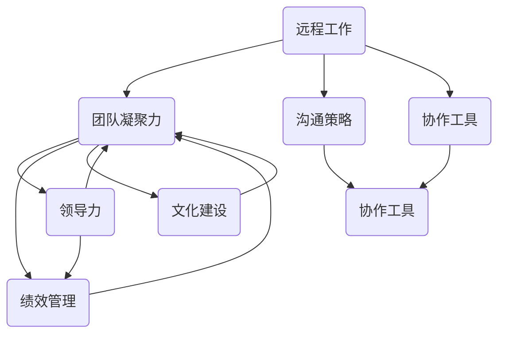
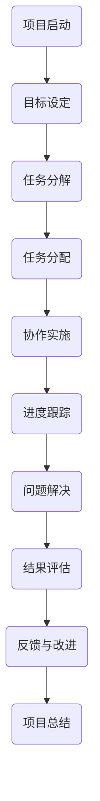

                 

### 引言

在当今这个快速发展的数字化时代，远程工作已经成为许多企业和团队的首选。随着互联网技术的不断进步，远程工作的模式越来越普及，这不仅带来了工作方式上的变革，也对团队的凝聚力和管理提出了新的挑战。远程工作团队的凝聚力建设成为了企业管理者和团队领导者需要认真思考和解决的问题。

远程工作团队的凝聚力，简单来说，就是团队成员之间的紧密协作和相互信任程度。它不仅影响到团队的工作效率和成果，还关系到团队成员的满意度和忠诚度。然而，由于地理位置的分散、时间差异以及沟通方式的限制，远程工作团队在凝聚力建设方面面临着诸多困难和挑战。

本书旨在深入探讨远程工作团队的凝聚力建设问题，帮助团队领导者和管理者找到有效的策略和方法，以提升团队的凝聚力，从而实现更高的工作效率和业务成果。本书分为十个章节，系统性地介绍了远程工作团队凝聚力建设的相关概念、策略、方法和成功案例。

接下来的章节中，我们将逐步分析远程工作团队凝聚力建设的关键要素，从远程工作概述、团队凝聚力、沟通策略、协作与协同、文化建设、领导力、绩效管理到团队的持续发展，全面探讨远程工作团队凝聚力建设的各个方面。每个章节都将结合实际案例和最佳实践，提供详细的指导和解决方案。

### 远程工作概述

#### 2.1 远程工作的定义与类型

远程工作，通常指的是在非传统办公环境（如家庭、咖啡店、公共图书馆等）中完成工作任务的一种工作模式。这种模式不同于传统的集中式办公，它允许员工在家或其他地方通过网络工具与同事和上级保持联系，完成日常的工作任务。远程工作的定义可以根据不同的标准和角度进行多种分类：

1. **按工作地点分类**：
   - **家庭办公**：员工在家完成工作任务，是最常见的远程工作形式。
   - **灵活办公**：员工可以在特定地点（如办公室、咖啡店等）进行工作，但在家办公仍然是主要形式。
   - **移动办公**：员工在多个地点之间移动，使用移动设备完成工作任务。

2. **按工作时间分类**：
   - **全职远程工作**：员工完全采用远程工作模式，所有工作任务都在远程完成。
   - **兼职远程工作**：员工部分时间在远程工作，部分时间在办公室工作。

3. **按工作内容分类**：
   - **独立远程工作者**：如自由职业者、顾问等，他们独立完成工作任务，与公司或团队无固定的办公地点和办公时间。
   - **团队远程工作**：团队成员分布在不同的地理位置，通过协作工具和沟通平台进行协作，共同完成项目任务。

#### 2.2 远程工作的发展历史

远程工作并不是一个新兴的概念，它的历史可以追溯到20世纪中期。以下是远程工作发展历程中的几个重要阶段：

1. **早期阶段（20世纪50年代-70年代）**：
   - **数据通信**：20世纪50年代，计算机和通信技术的发展使得数据传输成为可能，远程工作开始萌芽。
   - **远程终端**：20世纪60年代，远程终端设备（如电传打字机）的出现，使得员工可以在家中通过电话线访问公司的主机。

2. **互联网兴起阶段（20世纪90年代）**：
   - **电子邮件**：电子邮件的普及，使得远程沟通更加便捷。
   - **互联网应用**：随着互联网的普及，各种远程办公软件和平台（如远程桌面、即时通讯工具等）开始出现，远程工作进入一个全新的阶段。

3. **现代远程工作阶段（21世纪初至今）**：
   - **云计算**：云计算技术的应用，使得数据存储和处理更加高效和便捷，远程工作不再受限于硬件设备。
   - **移动办公**：智能手机和平板电脑的普及，使得员工可以随时随地进行工作。
   - **数字化办公**：数字化办公工具和平台的不断发展，进一步推动了远程工作的普及。

#### 2.3 远程工作的优势与挑战

远程工作带来了诸多优势，同时也伴随着一些挑战。以下是远程工作的主要优势和挑战：

**优势**：

1. **灵活的工作时间**：员工可以根据自己的日程安排工作，提高工作效率和生活质量。
2. **节省通勤时间**：减少了通勤时间，提高了员工的工作效率和满意度。
3. **降低办公成本**：减少了企业对办公空间的租赁成本，同时也降低了员工的交通费用。
4. **吸引和保留人才**：远程工作模式可以吸引更多的人才，提高员工的满意度和忠诚度。

**挑战**：

1. **沟通障碍**：由于地理位置的分散和时间差异，远程团队之间的沟通难度增加。
2. **团队凝聚力不足**：远程工作缺乏面对面的互动，容易导致团队凝聚力的下降。
3. **工作与生活的平衡**：员工需要自我管理时间，避免工作与生活之间的界限模糊。
4. **安全问题**：远程工作可能带来数据安全和隐私泄露的风险。

在接下来的章节中，我们将进一步探讨远程团队凝聚力的概念、影响因素以及评估方法，帮助团队领导者找到提升团队凝聚力的有效策略。

#### 第3章 远程团队的凝聚力

### 3.1 凝聚力的重要性

远程团队凝聚力是指团队成员之间相互信任、紧密协作和共同追求团队目标的一种状态。它是远程工作团队成功的关键因素之一，对于团队的整体效能和成员的工作满意度有着深远的影响。以下是远程团队凝聚力的重要性：

1. **提升工作效率**：高凝聚力的远程团队能够更好地协作，共同解决复杂问题，从而提高工作效率和产出质量。团队成员之间的信任和相互支持可以减少沟通障碍和误解，加速决策过程。

2. **增强团队协作**：凝聚力促使团队成员更愿意分享信息和资源，共同参与团队活动，从而提高团队的协作效果。远程团队通过建立共同的目标和价值观，可以更好地实现协作，减少冲突和摩擦。

3. **提高成员满意度**：高凝聚力的远程团队有助于提升成员的工作满意度和幸福感。团队成员感受到彼此的关心和支持，能够减少工作压力，提高工作动力和忠诚度。

4. **促进创新和创造力**：凝聚力强的团队鼓励成员之间的知识共享和创意碰撞，有助于激发创新思维和创造力。团队成员可以自由地提出新想法和建议，为团队带来新的机遇和突破。

5. **增强团队稳定性**：凝聚力可以降低团队成员的流失率，提高团队的稳定性。当团队成员感受到团队的支持和关怀时，他们更可能长期留在团队中，减少人员变动带来的负面影响。

### 3.2 影响凝聚力的因素

远程团队凝聚力的形成受多种因素的影响，以下是一些关键因素：

1. **沟通频率与质量**：频繁且高质量的沟通是提升团队凝聚力的重要手段。通过即时通讯工具、视频会议和其他沟通平台，团队成员可以保持密切的联系，及时交流信息和反馈，增强彼此的了解和信任。

2. **共同目标和价值观**：明确的共同目标和共享的价值观有助于团队成员朝着同一方向努力，形成共同使命感和归属感。团队领导者应确保每个成员都了解团队的愿景和目标，并鼓励他们为实现这些目标而努力。

3. **领导者角色**：领导者在团队凝聚力建设中起着至关重要的作用。他们需要通过积极的沟通和榜样作用，激励团队成员，建立信任和尊重，并解决团队内部的问题和冲突。

4. **团队成员之间的互动**：团队成员之间的互动和协作是团队凝聚力的重要来源。定期的团队建设活动和协作任务可以增强成员之间的联系，促进彼此的了解和信任。

5. **工作环境的支持**：一个支持性的工作环境，包括合适的工具和资源，可以提升团队的工作效率和成员的满意度，从而增强团队的凝聚力。

6. **情感支持**：情感支持是远程团队凝聚力的重要方面。团队成员在遇到困难或挑战时，需要得到同事和领导的支持和鼓励，这有助于增强团队的凝聚力和成员的归属感。

### 3.3 凝聚力的评估方法

评估远程团队的凝聚力对于了解团队现状和制定改进策略至关重要。以下是一些常用的评估方法：

1. **问卷调查**：通过设计针对团队成员的问卷，评估他们对团队凝聚力的感受和看法。问卷可以涵盖沟通频率、团队目标、领导力、团队互动等多个方面。

2. **关键绩效指标（KPI）**：通过分析团队的工作效率和产出质量，评估团队的凝聚力水平。高凝聚力的团队通常能够实现更高的绩效目标。

3. **团队访谈**：与团队成员进行一对一或小组访谈，深入了解他们对团队的感受和看法，获取更为详细的信息。

4. **行为观察**：通过观察团队成员的互动和协作行为，评估团队的凝聚力和合作效果。

通过以上方法，团队领导者可以全面了解团队凝聚力的情况，从而制定有针对性的改进措施，提升团队的整体效能。

### 第4章 远程团队的沟通策略

#### 4.1 有效沟通的重要性

在远程工作中，沟通是团队凝聚力和工作效率的关键。有效的沟通不仅能够确保信息的准确传递，还能促进团队成员之间的信任和理解，从而提升团队的整体效能。以下从几个方面阐述有效沟通的重要性：

1. **确保任务明确**：通过有效的沟通，确保每个团队成员都清楚了解自己的任务、职责以及预期的工作成果，减少因信息传递错误导致的工作重复和资源浪费。

2. **促进团队协作**：远程团队需要通过各种沟通工具和平台保持密切联系，通过有效的沟通，团队成员可以及时分享信息和资源，协同完成复杂任务，提高工作效率。

3. **增强团队凝聚力**：良好的沟通有助于建立团队成员之间的信任和尊重，促进情感交流，增强团队的凝聚力。团队成员感受到被关注和重视，有助于提升工作满意度和忠诚度。

4. **减少误解和冲突**：有效的沟通能够减少因信息不对称或误解导致的冲突。通过明确的表达和及时的反馈，团队成员可以避免因误解而引发的争执，维持团队的和谐氛围。

5. **提升决策质量**：在远程团队中，决策往往需要团队成员共同参与。有效的沟通能够确保各方意见得到充分表达，避免因信息不全或沟通不畅导致的决策失误。

#### 4.2 远程沟通的特点

与面对面的沟通相比，远程沟通具有一些独特的特点，这些特点对团队凝聚力和工作效率有着重要影响：

1. **非实时性**：远程沟通通常不是实时的，信息的传递可能存在时间延迟。这要求团队成员在沟通时要有耐心，等待对方的回应，同时也需要确保信息的完整性。

2. **依赖技术工具**：远程沟通高度依赖各种技术工具，如电子邮件、即时通讯软件、视频会议平台等。工具的稳定性和易用性对沟通效果至关重要。

3. **沟通形式多样化**：远程沟通可以通过文字、语音、视频等多种形式进行，不同形式的沟通适用于不同的场景和需求。多样化的沟通形式有助于提高沟通的灵活性和有效性。

4. **缺乏非言语信息**：面对面的沟通中，非言语信息（如肢体语言、面部表情等）对于理解对方意图和情感状态具有重要意义。远程沟通则缺乏这些非言语信息的传递，需要更加依赖于言语表达的准确性和清晰度。

5. **沟通成本高**：远程沟通虽然减少了物理距离，但需要较高的技术投入和维护成本，尤其是在使用高质量视频会议和协作工具时。

#### 4.3 提高远程沟通效率的策略

为了提高远程沟通的效率，团队需要采取一系列策略和措施，以下是一些有效的方法：

1. **制定沟通计划**：团队应制定明确的沟通计划，包括沟通频率、方式和内容等。通过预先规划，确保团队成员在关键时刻能够及时进行有效的沟通。

2. **选择合适的沟通工具**：根据不同的沟通需求和场景，选择合适的沟通工具。例如，对于需要实时互动的讨论，可以选择即时通讯软件或视频会议；对于需要详细记录和存档的信息，可以使用电子邮件。

3. **明确沟通目标**：每次沟通前，明确沟通的目标和预期结果。这有助于团队成员集中精力，避免无关话题的讨论，提高沟通效率。

4. **简化沟通语言**：使用简单明了的语言进行沟通，避免使用复杂的专业术语和冗长的句子。这有助于确保信息的准确传递，减少误解和歧义。

5. **定期回顾和反馈**：定期回顾沟通的效果和存在的问题，收集团队成员的反馈意见，不断优化和改进沟通策略。

6. **培训沟通技能**：为团队成员提供沟通技能的培训，提高他们的表达能力、倾听能力和冲突解决能力，从而提升整体的沟通效率。

通过以上策略，远程团队可以有效地提升沟通效率，增强团队凝聚力，从而实现更高的工作效率和业务成果。

### 第5章 远程团队的协作与协同

#### 5.1 协作与协同的区别

在远程团队的管理中，理解“协作”和“协同”这两个概念的区别是至关重要的。虽然这两个词在日常生活中经常被交替使用，但它们在实际应用中有着不同的含义和作用。

**协作（Collaboration）**：
协作指的是团队成员共同合作，共同完成任务的过程。它强调的是团队成员之间的互动和资源共享。协作的核心在于合作和共享，每个成员都可以贡献自己的想法和技能，共同努力实现团队的目标。协作通常涉及到以下方面：
- **共享目标**：团队成员共同设定目标，并为之努力。
- **分工合作**：根据成员的专长和资源分配任务，实现高效的分工。
- **沟通与反馈**：团队成员通过沟通和反馈不断调整工作方向和策略。
- **资源共享**：共享信息和资源，提高工作效率和成果。

**协同（Synergy）**：
协同则更侧重于团队的整体效能和协作效果，强调团队成员之间相互作用产生的整体效应大于各个部分单独作用的总和。协同不仅仅是简单的合作，它涉及到团队成员之间的互补、协调和整合，从而达到1+1>2的效果。协同通常包括以下方面：
- **互补性**：团队成员相互补充，发挥各自的优势，填补彼此的不足。
- **协调合作**：团队成员在合作中协调各自的行动，确保团队目标的实现。
- **创新与创造**：团队成员通过合作激发创新思维，共同创造新的价值和解决方案。
- **高效整合**：将各个成员的能力和资源整合起来，实现整体的最优效果。

**协作与协同的关系**：
协作是协同的基础，没有有效的协作，协同难以实现。而协同则是协作的终极目标，通过协作实现团队效能的最大化。在实际工作中，团队需要同时注重协作和协同，以达到最佳的工作效果。

#### 5.2 远程团队协作工具介绍

在远程工作中，选择合适的协作工具是提升团队协作效率和效果的关键。以下是一些常用的远程团队协作工具：

1. **即时通讯工具**：
   - **Slack**：Slack是一款流行的即时通讯工具，提供多种团队协作功能，如聊天室、直接消息、文件共享等。
   - **Microsoft Teams**：微软推出的即时通讯和协作平台，集成了聊天、会议、文档共享等功能。
   - **WhatsApp**：适用于个人和团队的即时通讯工具，特别适合跨国团队的沟通。

2. **项目管理工具**：
   - **Trello**：基于看板式的项目管理工具，简单易用，适合小团队的项目管理。
   - **Jira**：专业的敏捷项目管理工具，提供任务跟踪、缺陷管理、敏捷板等功能。
   - **Asana**：全面的项目管理工具，支持任务分配、进度跟踪、报告生成等。

3. **视频会议平台**：
   - **Zoom**：提供高清视频和音频会议，支持屏幕共享、聊天、记录等功能。
   - **Google Meet**：谷歌推出的视频会议工具，集成在G Suite中，适合团队内部沟通。
   - **Microsoft Teams**：提供在线会议、视频会议和聊天功能，适用于多种团队协作需求。

4. **文档协作工具**：
   - **Google Docs**：谷歌文档，支持多人实时编辑和协作，方便文档共享和更新。
   - **Microsoft Office 365**：微软的办公软件套件，提供在线协作功能，如Word、Excel、PowerPoint等。
   - **Notion**：功能丰富的文档和协作工具，适合创建笔记、数据库和任务管理。

#### 5.3 提高协作效率的方法

为了提高远程团队的协作效率，团队需要采取一系列策略和方法，以下是一些建议：

1. **明确职责和任务分配**：确保每个团队成员都清楚自己的职责和任务，避免重复工作和资源浪费。

2. **建立清晰的沟通渠道**：设定明确的沟通渠道和流程，确保信息传递的及时性和准确性。

3. **定期召开会议**：定期召开团队会议，回顾项目进展、讨论问题和制定下一步计划，确保团队协作的连贯性和目标一致性。

4. **利用协作工具**：合理利用各种协作工具，如项目管理工具、文档协作工具和即时通讯工具，提高团队协作的效率和效果。

5. **鼓励知识共享**：建立知识共享平台，鼓励团队成员分享经验和知识，提高团队整体的专业水平和创新能力。

6. **提供培训和支持**：为团队成员提供必要的协作工具和技能培训，确保他们能够高效地使用协作工具，提升协作效率。

7. **建立反馈机制**：建立有效的反馈机制，定期收集团队成员的反馈意见，及时调整和改进协作策略。

通过以上方法，远程团队可以有效地提高协作效率，实现更高的工作效率和业务成果。在接下来的章节中，我们将进一步探讨远程团队的文化建设、领导力、绩效管理和持续发展，为团队凝聚力建设提供全面的支持和策略。

### 第6章 远程团队的文化建设

#### 6.1 企业文化的远程适应

企业文化是企业的灵魂，它代表了企业的价值观、使命和愿景，对于团队凝聚力具有至关重要的作用。在远程工作环境中，企业文化的适应和传递成为了一项挑战，但也是提高团队凝聚力和工作效率的关键。

首先，企业需要明确其核心文化价值观，并确保这些价值观在远程环境中能够得到有效传递。以下是一些策略来帮助企业文化在远程工作中的适应：

1. **明确文化价值观**：企业应明确其核心文化价值观，如客户至上、创新精神、团队合作等，并将其内化到日常工作中。这些价值观应成为团队成员行为的指南，无论他们在何处工作。

2. **文化宣传和推广**：企业可以通过各种方式来宣传和推广其文化，如通过内部通讯、文化日、在线研讨会等，让团队成员了解和认同企业文化。特别是通过领导者的榜样作用，展示企业文化在实际工作中的体现。

3. **建立虚拟社区**：创建一个虚拟社区平台，让团队成员可以随时分享他们的想法、经验和感受。这有助于加强团队成员之间的联系，同时也能够传递企业文化。

4. **跨部门互动**：鼓励跨部门的交流和合作，通过虚拟团队活动和项目，增强团队成员之间的互动和理解，从而促进企业文化在不同部门之间的传递和认同。

5. **文化评估与反馈**：定期进行文化评估，了解团队成员对企业文化的认同度和实际影响。通过问卷调查、访谈等方式收集反馈，及时调整和优化文化传递策略。

#### 6.2 远程团队文化建设的策略

在远程工作中，文化建设不仅仅是企业领导者的责任，每个团队成员都应积极参与其中。以下是一些具体的远程团队文化建设策略：

1. **建立共同的团队价值观**：团队应共同制定并认同一套共同的价值观，这有助于增强团队成员的归属感和使命感。可以通过团队会议、讨论和投票等方式，让每个成员参与其中。

2. **定期团队建设活动**：虽然无法像传统办公环境中那样举行面对面的团队建设活动，但可以通过在线游戏、虚拟社交活动等方式，增强团队成员之间的情感联系。

3. **透明和开放的沟通**：鼓励团队成员之间开放和透明的沟通，这有助于建立信任和尊重，是团队文化建设的重要组成部分。企业可以提供培训，提高团队成员的沟通技巧。

4. **灵活的工作时间与地点**：在尊重企业文化价值观的前提下，提供灵活的工作时间和地点，让团队成员能够根据自己的需求进行工作安排。这有助于提升员工的工作满意度和忠诚度。

5. **鼓励创新和自主性**：远程团队应鼓励创新和自主性，让团队成员有更多的自由度和空间来发挥自己的才能和创意。这可以激发团队成员的积极性和创造力，增强团队凝聚力。

#### 6.3 成功案例分享

以下是一些成功进行远程团队文化建设的案例，供企业和团队参考：

1. **谷歌**：谷歌通过其内部的“谷歌+”平台，建立了全球虚拟社区，让员工可以随时分享想法、知识和经验。谷歌还定期组织虚拟团队建设活动，如在线派对、黑客马拉松等，增强员工之间的联系。

2. **GitHub**：GitHub通过其开放的文化和透明的沟通机制，鼓励员工在公共代码库中分享和讨论技术问题。这种开放的文化不仅增强了团队成员之间的合作，还吸引了全球优秀的技术人才。

3. **Buffer**：Buffer是一家远程工作公司，其成功的企业文化体现在其对员工的支持和关怀上。公司提供了多种福利，如灵活的工作时间、远程团队聚会、健康保险等，这些措施极大地提升了员工的工作满意度和忠诚度。

通过这些成功案例，可以看出，远程团队的文化建设不仅需要企业的支持和引导，还需要每个团队成员的积极参与和努力。只有通过共同努力，才能建立一个充满活力和凝聚力的远程工作团队。

### 第7章 远程团队的领导力

#### 7.1 领导力在远程团队中的作用

领导力在远程团队中的作用至关重要，它不仅影响着团队的工作效率，还决定了团队的凝聚力和成员的满意度。在远程工作环境中，领导者的角色更加复杂，需要具备独特的领导能力和策略。以下是领导力在远程团队中的几个关键作用：

1. **确立方向和目标**：远程团队的领导者需要明确团队的目标和愿景，并确保每个成员都理解并认同这些目标。通过制定清晰的规划和目标，领导者可以帮助团队成员保持方向感，避免迷失在远程工作中的复杂性。

2. **建立信任和沟通**：信任是远程团队凝聚力的基础。领导者需要通过开放和透明的沟通建立信任，确保团队成员之间的信息流通和意见交流。通过定期的视频会议、即时通讯和其他沟通工具，领导者可以及时了解团队成员的需求和反馈，解决潜在的问题和冲突。

3. **激励和鼓励**：远程工作的环境容易让人感到孤立和缺乏动力。领导者需要通过积极的激励和鼓励，激发团队成员的工作热情和创造力。这可以通过认可和奖励团队成员的成就、提供成长机会和职业发展路径来实现。

4. **提供支持**：在远程工作中，领导者需要提供必要的支持和资源，帮助团队成员克服工作中的障碍。这包括技术支持、时间管理培训和职业发展指导等。领导者应当成为团队成员的后盾，确保他们在工作中能够得到必要的帮助和支持。

5. **促进协作和知识共享**：远程团队需要高效的合作和知识共享来完成任务。领导者可以通过建立协作工具、组织团队活动和设定共享目标，促进团队成员之间的合作。此外，领导者还应鼓励成员分享知识和经验，从而提升团队的整体能力。

#### 7.2 远程领导力的挑战与对策

远程领导力面临许多独特的挑战，需要领导者具备适应这些挑战的特定技能和策略。以下是一些常见的挑战及其对策：

1. **沟通障碍**：由于地理位置的分散和时间差异，远程团队的沟通存在诸多障碍。对策包括：
   - **利用多样化的沟通工具**：使用视频会议、即时通讯、电子邮件等多种沟通方式，确保信息的及时传递和明确理解。
   - **建立沟通规范**：制定明确的沟通流程和规范，确保团队成员知道何时使用何种沟通方式，提高沟通效率。

2. **团队凝聚力不足**：远程工作缺乏面对面的互动，容易导致团队凝聚力下降。对策包括：
   - **定期组织虚拟团队活动**：通过在线游戏、虚拟社交活动和团队建设活动，增强团队成员之间的情感联系。
   - **建立虚拟社区**：创建一个虚拟社区平台，鼓励团队成员分享想法、经验和感受，增强团队的归属感。

3. **监控和管理**：远程工作环境下，领导者难以直接监控和管理团队成员的工作。对策包括：
   - **设定明确的绩效目标**：为团队成员设定明确的绩效目标，并通过定期的绩效评估来监控进展。
   - **利用绩效管理工具**：使用项目管理工具和协作工具来跟踪团队成员的工作进度和成果，确保工作目标的实现。

4. **时间管理**：远程工作需要团队成员自我管理时间，避免工作与生活的界限模糊。对策包括：
   - **提供时间管理培训**：为团队成员提供时间管理的培训，帮助他们制定合理的工作计划和时间安排。
   - **鼓励灵活的工作安排**：允许团队成员根据个人需求和工作情况，灵活安排工作时间，提高工作满意度。

5. **安全问题**：远程工作可能带来数据安全和隐私泄露的风险。对策包括：
   - **加强安全意识**：定期进行安全培训，提高团队成员的安全意识，防止数据泄露。
   - **使用安全的通信工具和平台**：选择安全可靠的通信工具和平台，确保数据传输的安全性。

通过应对这些挑战，远程领导者可以有效地提升团队的工作效率和凝聚力，实现团队的目标和愿景。

#### 7.3 领导者如何提高团队凝聚力

作为远程团队的领导者，提高团队凝聚力是确保团队高效运作和持续发展的关键。以下是一些具体的策略和方法，帮助领导者提高团队的凝聚力：

1. **建立清晰的团队愿景和目标**：领导者应明确团队的愿景和目标，并确保每个成员都理解并认同这些目标。通过共同设定愿景和目标，团队成员可以感受到自己在团队中的价值和使命，从而增强归属感和责任感。

2. **促进沟通和透明度**：领导者应鼓励团队成员之间的沟通和互动，确保信息的透明和畅通。通过定期的会议、团队讨论和反馈机制，领导者可以促进团队成员之间的信息共享和合作，减少误解和冲突。

3. **培养信任和尊重**：信任是团队凝聚力的重要基础。领导者应通过积极的沟通和榜样作用，建立团队成员之间的信任和尊重。领导者应鼓励团队成员分享自己的想法和意见，尊重每个人的贡献和努力。

4. **提供支持和激励**：领导者应关心团队成员的个人发展和需求，提供必要的支持和激励。通过认可和奖励团队成员的成就，领导者可以增强成员的积极性和创造力，提升团队的整体效能。

5. **组织团队建设活动**：领导者可以定期组织团队建设活动，增强团队成员之间的情感联系。这些活动可以是虚拟的，如在线游戏、虚拟聚会和团队挑战，也可以是面对面的，如远程团队会议和线下聚会。

6. **鼓励知识和经验共享**：领导者应鼓励团队成员分享知识和经验，促进团队的持续学习和成长。通过建立知识共享平台和定期培训，领导者可以提升团队的专业水平和创新能力。

7. **培养领导力**：领导者应关注团队成员的领导力培养，鼓励他们参与团队决策和项目领导。通过培养团队成员的领导能力，领导者可以增强团队的自组织能力和应变能力，提高团队的整体凝聚力。

通过以上策略，远程领导者可以有效地提高团队的凝聚力，促进团队的高效运作和持续发展。

### 第8章 远程团队的绩效管理

#### 8.1 远程绩效管理的特点

远程绩效管理与传统绩效管理相比，具有以下几大特点：

1. **结果导向**：远程绩效管理更注重成果和产出，而非工作过程。由于团队成员分布在不同的地理位置，领导者和团队成员更关注的是任务完成情况和目标的达成。

2. **自我管理**：远程工作环境要求团队成员具备较强的自我管理能力。他们需要自主设定工作计划、分配时间，并确保任务按时完成。这要求团队领导者对团队成员有更高的信任和期望。

3. **灵活性**：远程绩效管理更加灵活，允许团队成员根据自己的时间和生活节奏来安排工作。这有助于提高团队成员的工作满意度和生活质量。

4. **技术依赖**：远程绩效管理高度依赖各种技术工具和平台，如项目管理软件、协作工具和即时通讯工具。这些技术工具可以帮助领导者跟踪团队成员的工作进展和绩效表现。

5. **定量与定性相结合**：远程绩效管理不仅关注定量指标（如完成任务的数量和质量），也重视定性指标（如团队合作、沟通效率和个人成长）。通过定性与定量相结合，可以更全面地评估团队成员的绩效。

6. **定期反馈与评估**：远程绩效管理强调定期反馈和评估，确保团队成员能够及时了解自己的工作表现，并获得改进建议。这有助于团队成员持续优化自己的工作方式，提高绩效水平。

#### 8.2 设定远程工作目标

设定明确的远程工作目标是远程绩效管理的核心。以下是一些步骤和策略，帮助团队领导者设定有效的远程工作目标：

1. **明确团队愿景和目标**：首先，领导者需要明确团队的愿景和目标，确保这些目标与企业的整体战略相一致。通过明确的愿景和目标，团队成员可以更好地理解自己的工作方向和重要性。

2. **分解目标**：将大目标分解为具体、可衡量的任务和子目标。每个任务和子目标都应具有明确的完成标准和时间表，以便团队成员能够清晰地了解自己的任务和责任。

3. **与团队成员协商**：与团队成员共同讨论和设定工作目标，确保每个成员都理解并认同这些目标。这有助于提高团队成员的参与感和责任感，增强目标的实现概率。

4. **设定可量化指标**：为每个目标设定可量化的指标，如任务完成的数量、质量、时间等。这些指标应具体、明确，便于跟踪和评估。

5. **定期调整目标**：根据团队和项目的进展情况，定期调整和优化工作目标。这有助于团队成员适应变化，保持工作动力和方向。

6. **提供资源和支持**：确保团队成员在实现目标的过程中，能够获得必要的资源和支持。这包括技术工具、培训机会和指导等，有助于提高团队成员的绩效表现。

#### 8.3 提高远程工作效率的技巧

为了提高远程工作效率，团队领导者需要采取一系列策略和措施，以下是一些建议：

1. **明确工作计划和优先级**：制定详细的工作计划和任务清单，明确每个任务的优先级和完成时间。这有助于团队成员集中精力，避免因任务繁多而导致的分心和拖延。

2. **设定工作时间和休息时间**：为团队成员设定合理的工作时间和休息时间，确保他们能够高效地工作，并保持良好的工作与生活平衡。

3. **利用时间管理工具**：使用时间管理工具，如番茄工作法、待办事项列表和时间跟踪工具，帮助团队成员更好地管理时间和提高工作效率。

4. **定期召开团队会议**：定期召开团队会议，回顾工作进展、讨论问题和制定下一步计划。这有助于团队成员保持协同和目标一致，提高整体工作效率。

5. **鼓励沟通和反馈**：建立畅通的沟通渠道，鼓励团队成员之间的沟通和反馈。通过即时通讯工具、邮件和视频会议等方式，及时传达信息和反馈意见，确保团队成员了解项目的最新进展。

6. **提供培训和支持**：为团队成员提供必要的培训和资源支持，帮助他们提升技能和知识水平。这包括在线培训课程、技术手册和辅导等，有助于提高团队成员的绩效表现。

7. **建立激励机制**：设立激励机制，鼓励团队成员积极完成任务和达成目标。通过奖励和认可，增强团队成员的工作动力和积极性。

通过以上技巧和策略，远程团队可以有效地提高工作效率，实现更高的绩效和业务成果。

### 第9章 远程团队的持续发展

#### 9.1 培养团队成员的成长意识

在远程团队中，培养团队成员的成长意识是提升团队整体能力、保持团队活力和竞争力的重要途径。以下是具体的方法和策略：

1. **提供持续学习机会**：为团队成员提供丰富的在线学习资源和培训机会，如在线课程、研讨会、技术博客和论坛等。通过不断学习，团队成员可以不断提升自己的技能和知识，适应不断变化的工作环境。

2. **鼓励自主学习和创新**：鼓励团队成员自主学习，探索新的技术和方法。领导者可以设立创新奖励机制，对提出创新想法和解决方案的成员给予认可和奖励，激发团队成员的创新意识。

3. **设立个人发展计划**：为每个团队成员制定个人发展计划，明确他们的职业目标和成长路径。通过定期的职业发展和绩效评估，帮助团队成员了解自己的成长情况，并制定相应的改进措施。

4. **提供导师和辅导**：为团队成员配备经验丰富的导师或导师团队，为他们提供指导和支持。通过导师的辅导，团队成员可以更快地掌握新技能，提升职业素养。

5. **建立知识共享平台**：建立内部知识共享平台，鼓励团队成员分享自己的经验和知识。这不仅有助于提升团队的整体知识水平，还可以促进团队成员之间的互动和交流。

6. **组织内部培训和研讨会**：定期组织内部培训和研讨会，邀请专业讲师和行业专家分享知识和经验。通过这些活动，团队成员可以了解到行业最新的发展趋势和最佳实践，提升自身的能力。

#### 9.2 远程团队的发展策略

为了实现远程团队的持续发展，团队需要制定一系列具体的策略和计划。以下是几个关键的发展策略：

1. **战略规划**：制定明确的战略规划，确保团队的发展与企业的整体战略相一致。通过战略规划，团队可以明确未来的发展方向和目标，为团队的发展提供清晰的指引。

2. **人才引进和培养**：持续引进和培养高素质的人才，是团队持续发展的重要保障。团队领导者应关注行业动态，吸引优秀的人才加入团队，并通过内部培训和职业发展计划，提升现有成员的能力和潜力。

3. **技术创新**：保持技术创新，不断提升团队的技术水平和竞争力。团队可以通过引入新技术、优化现有技术或开发新的产品和服务，实现持续的技术创新。

4. **团队文化建设**：建立积极向上的团队文化，是团队持续发展的重要基础。团队领导者应通过定期的文化建设活动、团队目标和价值观的传达，培养团队成员的归属感和责任感。

5. **绩效管理**：建立科学的绩效管理体系，确保团队成员的工作表现和贡献得到公正的评价和激励。通过定期的绩效评估和反馈，帮助团队成员找到自己的优势和不足，不断提升自己的工作能力。

6. **灵活适应变化**：远程团队需要具备快速适应变化的能力，以应对外部环境和内部需求的变化。团队领导者应鼓励团队成员保持开放的心态，积极应对变化，并制定灵活的应对策略。

7. **持续改进**：通过持续改进，不断提升团队的工作效率和质量。团队可以定期进行工作流程的优化和改进，减少浪费，提高工作效率。

通过以上策略，远程团队可以实现持续发展，不断提升团队的竞争力，为企业的长期成功提供有力支持。

#### 9.3 成功案例分析

在远程团队的发展过程中，许多成功的案例为其他团队提供了宝贵的经验和启示。以下是一些成功的案例分析：

1. **案例：远程软件开发团队**：
   - **背景**：一家全球知名的软件开发公司，其大部分开发团队分布在不同的国家和地区。由于团队成员地理位置分散，该公司面临沟通和协作的挑战。
   - **策略**：公司采用了以下策略来提升团队凝聚力：
     - **明确的沟通计划**：制定了详细的沟通计划，包括每周的团队会议、定期的项目进展汇报和即时沟通渠道的设置。
     - **使用协作工具**：采用了多种协作工具，如Slack、Trello和Jira，确保团队成员能够高效地沟通和协作。
     - **团队建设活动**：定期组织虚拟团队建设活动，如在线聚会、团队游戏和虚拟社交活动，增强团队成员之间的情感联系。
   - **结果**：通过这些策略，该公司的远程开发团队不仅提高了工作效率，还增强了团队的凝聚力，成功完成了多个复杂项目。

2. **案例：远程市场团队**：
   - **背景**：一家全球性的市场推广公司，其市场团队分布在不同的城市和国家。由于时间差异和文化差异，团队在协作和沟通上存在障碍。
   - **策略**：公司采取了以下措施：
     - **灵活的工作安排**：为团队成员提供了灵活的工作时间安排，允许他们在不同的时区工作，确保项目的连续性。
     - **全球协作平台**：建立了全球协作平台，通过视频会议和即时通讯工具，确保团队成员能够实时沟通和协作。
     - **文化敏感性培训**：为团队成员提供了文化敏感性培训，帮助他们更好地理解和适应不同文化背景的同事。
   - **结果**：通过这些措施，公司的市场团队克服了地理和文化差异，提高了协作效率和项目成功率，成功实现了全球市场的覆盖。

3. **案例：远程销售团队**：
   - **背景**：一家远程销售公司，其销售人员分布在各地。由于缺乏面对面的互动，团队成员之间的联系和信任度较低。
   - **策略**：公司采取了以下策略：
     - **定期团队会议**：定期召开全球团队会议，回顾销售业绩、讨论问题和制定销售策略。
     - **虚拟团队建设活动**：组织在线团队建设活动，如虚拟培训、在线游戏和社交聚会，增强团队成员之间的情感联系。
     - **奖励机制**：设立了销售奖励机制，对表现优秀的销售人员给予奖励，激励团队成员的积极性和竞争力。
   - **结果**：通过这些策略，公司的销售团队增强了凝聚力，销售业绩显著提升，客户满意度也大幅提高。

这些成功案例表明，通过合理的策略和措施，远程团队可以克服各种挑战，实现持续发展和高效运作。其他团队可以借鉴这些经验，结合自身实际情况，制定适合自己团队的发展策略。

### 第10章 总结与展望

#### 10.1 主要观点回顾

在本书中，我们深入探讨了远程工作团队的凝聚力建设问题。通过系统的分析和详尽的案例研究，我们得出了以下主要观点：

1. **远程工作团队的凝聚力至关重要**：凝聚力是远程团队高效运作和持续发展的基础，它直接影响团队的工作效率和成员的工作满意度。

2. **远程工作的优势与挑战**：远程工作带来了灵活的工作时间和降低办公成本等优势，同时也面临沟通障碍、团队凝聚力不足等挑战。

3. **沟通策略和协作工具**：有效的沟通和合适的协作工具是提升远程团队凝聚力的重要手段，通过多样化的沟通工具和协作平台，可以增强团队之间的联系和协作效果。

4. **文化建设与领导力**：建立积极的团队文化和高效的领导力对于远程团队的建设具有重要意义，领导者需要通过明确的目标、有效的沟通和激励措施来提升团队的凝聚力。

5. **绩效管理和持续发展**：科学的绩效管理和持续发展的策略有助于提升团队的整体能力，为远程团队的长期成功提供保障。

#### 10.2 未来发展趋势

随着技术的发展和远程工作模式的普及，未来远程工作团队的凝聚力建设将呈现出以下趋势：

1. **技术工具的进一步成熟**：随着人工智能、大数据和物联网等技术的发展，远程工作工具将更加智能化和自动化，提高团队协作和沟通的效率。

2. **虚拟现实与增强现实的广泛应用**：虚拟现实和增强现实技术将在远程团队建设中发挥重要作用，通过沉浸式体验，增强团队成员之间的情感联系和互动。

3. **个性化和定制化的管理**：未来远程团队的管理将更加注重个性化和定制化，根据团队成员的不同需求和特点，提供个性化的支持和培养方案。

4. **全球化与本地化的融合**：随着全球化进程的加速，远程团队将更加注重跨文化沟通和管理，同时保持对本地市场的敏感性和适应性。

5. **持续学习和创新**：远程团队将更加重视持续学习和创新，通过不断的学习和探索，提升团队的整体能力和竞争力。

#### 10.3 结论与建议

基于本书的研究和探讨，我们得出以下结论和建议：

1. **重视团队凝聚力建设**：企业应将团队凝聚力建设作为一项重要任务，通过多种策略和措施，提升团队的整体效能和成员的满意度。

2. **合理利用技术工具**：企业应选择适合自身团队的协作工具和沟通平台，提高团队协作和沟通的效率。

3. **培养高效领导力**：领导者应具备高效的领导能力，通过有效的沟通、激励和支持，提升团队的凝聚力和战斗力。

4. **关注团队成员的成长**：企业应关注团队成员的个人发展和成长，提供持续的学习和培训机会，提升团队的整体能力。

5. **建立积极的企业文化**：企业应建立积极向上的企业文化，增强团队成员的归属感和使命感，促进团队的长期发展。

通过以上措施，远程工作团队可以不断提升凝聚力，实现更高的工作效率和业务成果，为企业的长期成功提供有力支持。

### 总结

在快速发展的数字化时代，远程工作已成为许多企业和团队的首选模式。然而，远程工作的特殊性质也带来了团队凝聚力建设的挑战。本书系统地探讨了远程工作团队的凝聚力建设，从定义、远程工作的优势与挑战、团队凝聚力的重要性、沟通策略、协作与协同、文化建设、领导力、绩效管理到持续发展，全面覆盖了远程团队凝聚力建设的各个方面。

通过深入分析远程工作团队的凝聚力建设，我们提出了一系列有效的策略和方法，旨在帮助团队领导者提升团队的凝聚力和工作效率。有效的沟通、合适的协作工具、积极的团队文化和高效的领导力，都是提升团队凝聚力的重要因素。

未来的远程工作将更加依赖智能技术，团队协作和沟通工具将更加智能化和自动化。虚拟现实和增强现实技术也将为远程团队带来新的互动体验。同时，个性化和定制化的管理、全球化和本地化的融合、持续学习和创新，将成为远程团队发展的重要趋势。

我们鼓励读者根据本书的探讨和建议，结合自身团队的实际情况，制定和实施合适的凝聚力建设策略。通过不断提升团队的凝聚力和工作效率，远程工作团队将能够更好地应对未来的挑战，实现企业的长期成功。

最后，感谢您对本书的关注，希望本书能为您在远程工作团队的凝聚力建设方面提供有价值的参考和指导。我们相信，通过共同努力，远程工作团队将能够实现更高的工作效率和业务成果，为企业和个人带来更大的价值。

### 附录

#### 附录1：核心概念术语说明

为了便于读者更好地理解本书的内容，以下是书中出现的一些核心概念和术语的详细解释：

1. **远程工作**：指在非传统办公环境中（如家庭、咖啡店等）通过网络工具完成工作任务的一种工作模式。
2. **团队凝聚力**：指团队成员之间的紧密协作和相互信任程度，是团队高效运作和成员工作满意度的重要保障。
3. **协作**：指团队成员共同合作，共同完成任务的过程，强调资源共享和分工合作。
4. **协同**：指团队成员之间的互补、协调和整合，达到整体效能大于各个部分单独作用的总和。
5. **领导力**：指领导者通过沟通、激励、支持等手段，引导和推动团队达成目标的能力。
6. **绩效管理**：指通过设定目标、评估绩效、提供反馈和支持，提升团队成员工作效能的过程。

#### 附录2：核心概念属性特征对比表格

以下是一个核心概念属性特征对比表格，用于展示远程工作、团队凝聚力和领导力的主要特征：

| 核心概念 | 特征 |
| --- | --- |
| 远程工作 | - 灵活的工作地点和时间 - 高度依赖技术工具 - 缺乏面对面的互动 |
| 团队凝聚力 | - 成员之间的信任和协作 - 明确的共同目标 - 提高工作效率和满意度 |
| 领导力 | - 沟通与激励能力 - 目标设定与实现 - 解决冲突与问题 |

#### 附录3：远程团队凝聚力建设ER实体关系图

以下是一个用于描述远程团队凝聚力建设核心实体及其关系的ER实体关系图：

#### 附录4：远程团队协作流程图

以下是一个远程团队协作流程的mermaid流程图，展示了团队成员在项目中的协作过程：

通过这些附录内容，读者可以更好地理解和应用书中所讨论的核心概念和策略，进一步提升远程工作团队的凝聚力。

### 附录5：拓展阅读

为了帮助读者进一步深入了解远程工作团队的凝聚力建设，以下是一些建议的拓展阅读资源：

1. **书籍**：
   - 《远程工作：如何打造高效、信任和快乐的团队》（作者：布莱恩·罗伯森）
   - 《远程团队管理：如何管理全球团队》（作者：克里斯·哈钦斯）
   - 《虚拟团队：如何高效协作》（作者：约翰·弗里斯比）

2. **文章**：
   - “远程工作与团队凝聚力：研究综述”（来源：国际远程工作协会）
   - “如何提升远程团队的沟通效率”（来源：哈佛商业评论）
   - “远程领导力：挑战与对策”（来源：领导力杂志）

3. **网站**：
   - 全球远程工作协会（网站：https://remotework.org/）
   - 远程工作研究网络（网站：https://www.rwhn.org/）
   - 远程工作最佳实践指南（网站：https://www.remote.co/practice/）

通过这些拓展阅读资源，读者可以更全面地了解远程工作团队凝聚力建设的理论、实践和最新趋势。

### 附录6：作者信息

**作者：AI天才研究院/AI Genius Institute & 禅与计算机程序设计艺术 /Zen And The Art of Computer Programming**

AI天才研究院（AI Genius Institute）是一家专注于人工智能领域的研究与教育机构，致力于推动人工智能技术的发展和应用。研究院的研究成果在多个领域取得了显著的成就，并在全球范围内享有盛誉。

“禅与计算机程序设计艺术”（Zen And The Art of Computer Programming）是作者Donald E. Knuth的代表作之一，它以深入浅出的方式探讨了计算机科学和程序设计的基本原理和方法，被广泛认为是程序设计的经典之作。

本文由AI天才研究院和禅与计算机程序设计艺术共同撰写，旨在为远程工作团队的凝聚力建设提供全面的理论指导和实践建议。希望通过本文，能够帮助更多团队实现高效协作和持续发展。作者对远程工作团队的凝聚力建设有着深刻的见解和丰富的实践经验，愿为读者提供有价值的内容。

