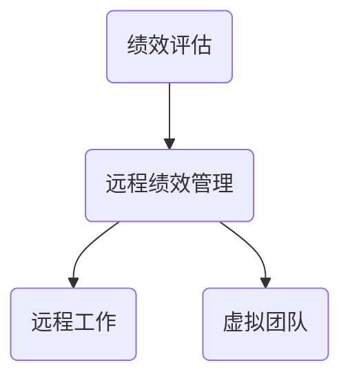

                 

### 《远程绩效管理：评估虚拟团队表现的方法》

#### 关键词：远程绩效管理、虚拟团队、绩效评估、指标体系、激励策略

> 摘要：随着远程工作的普及，远程绩效管理成为企业管理者面临的重大挑战。本文从定义、背景、方法到实践，详细探讨了评估虚拟团队表现的有效策略。通过明确绩效评估标准、设计关键指标、运用评估工具和激励策略，帮助企业实现高效远程绩效管理。

---

#### 第一部分：引言

##### 第1章：远程绩效管理概述

###### 1.1 问题背景与挑战

- **远程工作的兴起**：随着互联网技术的快速发展，远程工作成为越来越多企业的选择，尤其是新冠疫情的爆发加速了这一趋势。
- **虚拟团队的挑战**：虚拟团队缺乏面对面的交流，团队成员之间的信任建立困难，协作效率较低。
- **绩效评估的难点**：远程工作环境下的绩效评估如何进行，成为企业管理者亟待解决的问题。

###### 1.2 远程绩效管理的定义与目标

- **远程绩效管理的定义**：远程绩效管理是在远程工作环境下，对团队成员的工作表现进行系统评估和监督的过程。
- **管理目标与期望**：提高团队成员的工作效率，确保项目按时完成，提升团队协作能力，实现企业目标。

###### 1.3 本书结构安排

- **学习目标**：了解远程绩效管理的概念和重要性，掌握设计绩效指标的方法，学习评估工具和激励策略。
- **内容概述**：本文将从基础概念、绩效指标体系设计、评估工具与技术、激励与成长四个方面进行详细探讨。
- **学习方法与时间规划**：通过理论讲解、案例分析、实战操作，帮助读者快速掌握远程绩效管理的核心要点。

#### 第二部分：远程绩效管理的基础

##### 第2章：远程绩效管理的基础

###### 2.1 核心概念与联系

- **绩效评估的基本概念**：绩效评估是指对员工在工作中的表现进行评价和反馈的过程。
- **远程工作与虚拟团队**：远程工作是指员工在工作地点不受限制，通过远程设备进行工作；虚拟团队是由地理位置分散的成员组成的团队。
- **核心概念关系图**：

###### 2.2 绩效评估的标准和方法

- **绩效评估的标准**：客观性、准确性、公平性、及时性。
- **常见的绩效评估方法**：目标管理法、360度评估法、关键绩效指标法（KPI）、行为锚定等级评价法。
- **评估方法的优缺点分析**：

| 方法               | 优点                                  | 缺点                                  |
|--------------------|---------------------------------------|---------------------------------------|
| 目标管理法         | 目标明确，易于操作                    | 对管理者的要求高，实施难度较大        |
| 360度评估法       | 全面了解员工表现，促进自我发展        | 过程复杂，成本高                      |
| KPI                | 客观量化，易于管理                    | 过于依赖数字指标，忽视软技能          |
| 行为锚定等级评价法 | 具体明确，避免主观评价的偏差          | 实施难度大，需要大量时间和人力资源    |

#### 第三部分：绩效指标体系设计

##### 第3章：绩效指标的设计原则

###### 3.1 指标设计原则

- **SMART原则**：具体（Specific）、可衡量（Measurable）、可实现（Achievable）、相关（Relevant）、有时限（Time-bound）。
- **一致性原则**：绩效指标应与企业战略目标保持一致，避免冲突。
- **可衡量性原则**：绩效指标应具有明确的衡量标准，易于量化。

###### 3.2 指标体系构建方法

- **KPI（关键绩效指标）选择**：根据企业战略目标，选择对业务发展有重要影响的指标。
- **OKR（目标与关键结果）设定**：明确目标，设定可量化的关键结果。
- **绩效指标的权重分配**：根据指标的重要程度和影响范围，合理分配权重。

##### 第4章：关键绩效指标的实例分析

###### 4.1 销售团队绩效指标

- **销售额**：反映销售业绩的直接指标。
- **新客户开发率**：衡量市场拓展能力。
- **客户满意度**：评估客户服务质量。

###### 4.2 产品开发团队绩效指标

- **项目按时完成率**：确保项目按计划推进。
- **产品质量**：衡量产品是否符合质量标准。
- **创新指数**：鼓励创新，提升产品竞争力。

##### 第5章：其他绩效指标的探索

###### 5.1 软技能指标

- **团队协作能力**：评估团队成员之间的协作效率。
- **问题解决能力**：衡量应对复杂问题的能力。
- **沟通效率**：评估信息传递的速度和质量。

###### 5.2 学习与发展指标

- **培训参与率**：鼓励团队成员持续学习。
- **知识更新速度**：衡量团队成员的知识更新频率。
- **创新能力**：评估团队的创新能力和潜力。

#### 第四部分：绩效评估工具与技术

##### 第6章：远程绩效评估工具的选择

###### 6.1 常见评估工具介绍

- **传统评估工具**：如面谈、考核表等。
- **数字化评估工具**：如绩效管理系统（PMS）、在线问卷等。

###### 6.2 工具选择考虑因素

- **成本效益**：综合考虑工具的成本和带来的效益。
- **易用性**：工具应易于操作，便于团队成员接受。
- **安全性与隐私保护**：确保评估数据的保密性和安全性。

##### 第7章：绩效评估的实施流程

###### 7.1 绩效评估流程设计

- **制定评估计划**：明确评估目的、时间、流程和参与者。
- **数据收集**：通过在线问卷、数据分析等方式收集评估数据。
- **数据分析**：对收集到的数据进行分析，形成评估结果。

###### 7.2 绩效反馈与沟通

- **提供具体反馈**：根据评估结果，为团队成员提供具体的改进建议。
- **沟通技巧**：运用有效的沟通技巧，确保团队成员理解和接受反馈。
- **持续改进**：通过定期评估和反馈，持续改进团队成员的工作表现。

##### 第8章：绩效评估的最佳实践

###### 8.1 成功案例分享

- **企业远程绩效管理的成功实践**：分享国内外企业在远程绩效管理方面的成功经验。
- **经验与教训**：总结实践中的成功经验和教训，为其他企业提供参考。

###### 8.2 拓展阅读与资源

- **最新研究动态**：介绍远程绩效管理领域的最新研究成果。
- **推荐阅读材料**：推荐相关书籍、论文和报告，供读者深入阅读。

#### 第五部分：虚拟团队的激励与成长

##### 第9章：远程团队的激励策略

###### 9.1 激励原则与策略

- **公平性原则**：确保激励措施公平、公正、透明。
- **个人与团队并重**：激励个人与团队，促进整体发展。
- **精神激励与物质激励结合**：综合运用精神激励和物质激励，提升员工积极性。

###### 9.2 激励工具与应用

- **绩效奖金**：根据绩效评估结果发放奖金，激励员工。
- **培训机会**：提供培训和学习机会，提升员工能力。
- **荣誉与表彰**：对表现优秀的员工进行表彰，增强团队凝聚力。

##### 第10章：虚拟团队的个人发展

###### 10.1 成长路径规划

- **职业发展规划**：为员工制定明确的职业发展路径。
- **技能提升**：提供技能培训，帮助员工提升专业能力。

###### 10.2 继续教育与学习资源

- **在线课程**：提供丰富的在线课程资源，方便员工自主学习。
- **专业书籍**：推荐相关领域的专业书籍，拓宽知识视野。
- **行业交流**：组织行业交流活动，促进员工交流与成长。

##### 第11章：虚拟团队的持续优化

###### 11.1 团队氛围建设

- **促进团队沟通**：通过线上会议、聊天工具等，增强团队成员之间的沟通。
- **提升团队协作**：运用协作工具，提高团队协作效率。

###### 11.2 绩效管理体系的迭代

- **根据反馈调整绩效指标**：根据评估结果和员工反馈，调整绩效指标。
- **持续改进管理流程**：不断优化管理流程，提高管理效率。

#### 结论

##### 第12章：远程绩效管理的未来展望

- **远程工作的发展趋势**：远程工作将成为企业普遍采用的工作模式，对绩效管理提出新的要求。
- **未来远程绩效管理的发展方向**：数字化、智能化、人本管理将引领远程绩效管理的发展。

#### 附录

##### 附录A：远程绩效管理工具推荐

- **工具列表与功能描述**：介绍常用的远程绩效管理工具，包括功能特点和使用场景。

##### 附录B：参考文献

- **相关文献资料列表**：列出本文引用的相关文献和参考资料，供读者进一步阅读。

### 作者信息：

作者：AI天才研究院/AI Genius Institute & 禅与计算机程序设计艺术 /Zen And The Art of Computer Programming

---

本文遵循完整的结构，从背景介绍、核心概念、绩效指标设计、评估工具选择、激励策略到未来展望，全面探讨了远程绩效管理的各个方面。每个章节都包含了丰富的实例和分析，旨在为读者提供实用、易懂的远程绩效管理指导。希望本文能够帮助企业在远程工作环境下实现高效的绩效管理，提升团队的整体表现。

