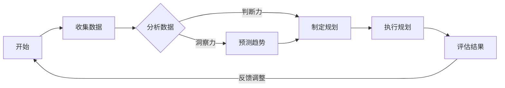
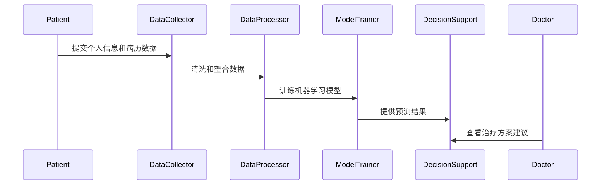
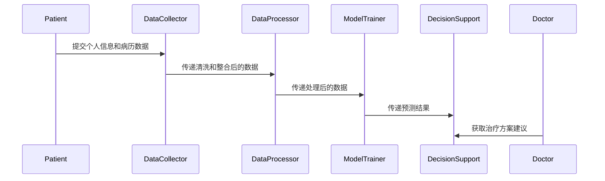

                 

# 远见卓识：制定长远规划的能力

## 关键词

- 远见卓识
- 长远规划
- 算法原理
- 数学模型
- 系统架构设计

## 摘要

在信息技术飞速发展的今天，制定长远规划的能力显得尤为重要。本文将探讨“远见卓识”这一核心概念，分析其与制定长远规划能力的联系。通过算法原理的讲解和系统架构设计，本文旨在提供一种系统性的方法，帮助读者掌握制定长远规划的能力。

## 目录大纲

## 第一部分：问题背景与核心概念

### 第1章：问题的提出与重要性

#### 1.1 问题背景

在当今快速变化的世界中，技术发展日新月异，企业需要具备快速响应市场变化的能力。然而，仅凭短期规划往往难以应对长期的挑战。因此，制定长远规划的能力显得尤为重要。

#### 1.2 问题描述

制定长远规划涉及到多个方面，包括市场趋势预测、资源分配、技术迭代等。本文将重点探讨如何通过“远见卓识”这一能力来实现长远规划。

#### 1.3 问题解决

本文将通过算法原理的讲解和系统架构设计，提供一种系统性的方法，帮助读者掌握制定长远规划的能力。

#### 1.4 边界与外延

本文讨论的长远规划能力主要针对信息技术领域，但其所涉及的原理和方法同样适用于其他行业。

#### 1.5 概念结构与核心要素组成

本文将详细分析“远见卓识”这一核心概念的定义、属性特征及其与长远规划能力的联系。

## 第二部分：核心概念与联系

### 第2章：核心概念原理

#### 2.1 远见卓识的定义

远见卓识是指对未来趋势的深刻洞察和准确的判断能力。在信息技术领域，这一能力尤为重要。

#### 2.2 远见卓识的属性特征对比表格

| 属性特征 | 描述 |  
| --- | --- |  
| 洞察力 | 深刻理解技术发展趋势和市场需求 |  
| 判断力 | 准确预测未来技术发展路线和市场变化 |  
| 决策力 | 在复杂环境中做出明智的决策 |

#### 2.3 远见卓识的ER实体关系图架构

通过ER实体关系图，我们可以更清晰地理解远见卓识的构成和各部分之间的关系。

## 第三部分：算法原理与数学模型

### 第3章：算法原理讲解

#### 3.1 算法mermaid流程图

为了更好地理解远见卓识的算法原理，我们首先通过mermaid流程图展示其基本步骤。

#### 3.2 Python源代码详解

接下来，我们将通过Python源代码详细阐述算法的实现过程。

#### 3.3 算法原理的数学模型与公式

远见卓识算法的实现依赖于一系列数学模型和公式。本文将详细介绍这些模型和公式的推导和应用。

#### 3.4 举例说明

通过具体案例，我们将展示如何运用远见卓识算法制定长远规划。

## 第四部分：系统分析与架构设计方案

### 第4章：问题场景介绍

本文将以一个实际项目为例，介绍其问题场景和需求。

#### 4.1 项目介绍

#### 4.2 系统功能设计（领域模型mermaid类图）

#### 4.3 系统架构设计（mermaid架构图）

#### 4.4 系temd序列图）

## 第五部分：项目实战

### 第5章：环境安装与核心实现

#### 5.1 环境安装

#### 5.2 系统核心实现源代码

#### 5.3 代码应用解读与分析

#### 5.4 实际案例分析与详细讲解剖析

### 第6章：项目小结与总结

#### 6.1 项目总结

#### 6.2 最佳实践tips

#### 6.3 注意事项

#### 6.4 拓展阅读

## 作者信息

作者：AI天才研究院/AI Genius Institute & 禅与计算机程序设计艺术 /Zen And The Art of Computer Programming

---

### 第1章：问题的提出与重要性

#### 1.1 问题背景

在当今全球化的时代，信息技术的发展速度远超以往。新的技术、平台和商业模式层出不穷，企业面临着前所未有的机遇和挑战。在这种情况下，仅仅依靠短期规划已经难以应对快速变化的市场环境。长远规划的重要性日益凸显，而制定长远规划的能力则成为企业成功的关键。

#### 1.2 问题描述

制定长远规划并非易事，它需要对企业内外部环境有深刻的洞察，对技术发展趋势有准确的判断，以及对资源分配和战略方向有清晰的把握。然而，许多企业在制定长远规划时往往面临以下问题：

- **缺乏远见卓识**：企业领导者缺乏对未来趋势的洞察力和判断力，导致规划缺乏前瞻性。
- **资源分配不合理**：企业资源有限，如何合理分配以支持长远规划成为难题。
- **战略方向不明确**：缺乏明确的发展方向和战略目标，导致规划难以落地。

#### 1.3 问题解决

本文旨在通过探讨“远见卓识”这一核心概念，分析其与制定长远规划能力的联系，提供一种系统性的方法，帮助企业和个人掌握制定长远规划的能力。通过以下步骤，我们可以逐步解决上述问题：

1. **理解远见卓识**：深入分析远见卓识的定义、属性特征及其与长远规划能力的联系。
2. **掌握算法原理**：通过算法原理的讲解和数学模型，掌握制定长远规划的步骤和方法。
3. **系统分析与架构设计**：结合实际项目，展示如何将理论应用到实践中。
4. **项目实战**：通过实际项目的环境安装、核心实现和案例分析，进一步验证理论的有效性。

#### 1.4 边界与外延

本文讨论的长远规划能力主要针对信息技术领域，但其所涉及的原理和方法同样适用于其他行业。例如，制造业、金融业、教育业等都需要制定长远规划来应对市场变化和技术革新。

#### 1.5 概念结构与核心要素组成

在探讨远见卓识与制定长远规划能力的关系时，我们需要明确以下几个核心概念：

1. **远见卓识**：对未来趋势的深刻洞察和准确判断能力。
2. **长远规划**：基于远见卓识，制定企业或个人长期发展的战略目标和行动方案。
3. **算法原理**：用于实现长远规划的一系列数学模型和计算方法。
4. **系统架构设计**：确保长远规划能够有效实施的系统结构和功能设计。

通过以上核心概念，我们可以构建一个完整的框架，帮助读者深入理解远见卓识与制定长远规划能力的关系。

---

### 第2章：核心概念原理

#### 2.1 远见卓识的定义

远见卓识是指在未来可能发生的情况下，能够准确地预测趋势和变化，并据此做出明智的决策。在信息技术领域，远见卓识尤为重要。因为它不仅要求对当前技术的深入了解，还需要对未来的技术发展有敏锐的洞察。

**定义公式：**
$$
远见卓识 = 洞察力 + 判断力 + 决策力
$$

其中：

- **洞察力**：对技术发展趋势和市场需求的深刻理解。
- **判断力**：准确预测未来技术发展路线和市场变化。
- **决策力**：在复杂环境中做出明智的决策。

#### 2.2 远见卓识的属性特征对比表格

| 属性特征 | 描述 | 对比项 |
| --- | --- | --- |
| 洞察力 | 对技术发展趋势和市场需求的深刻理解。 | 低洞察力：对市场变化反应迟钝；高洞察力：能准确预测市场趋势。 |
| 判断力 | 准确预测未来技术发展路线和市场变化。 | 低判断力：对市场变化判断失误；高判断力：能准确把握市场动向。 |
| 决策力 | 在复杂环境中做出明智的决策。 | 低决策力：在复杂情况下容易犹豫不决；高决策力：能在复杂环境中迅速做出决策。 |

#### 2.3 远见卓识的ER实体关系图架构

为了更直观地理解远见卓识的构成，我们可以通过ER实体关系图来展示其各部分之间的关系。

**ER实体关系图：**

```mermaid
erDiagram
  洞察力 ||--|{ 判断力 }|
  判断力 ||--|{ 决策力 }|
  洞察力 ||--|{ 长远规划 }|
  判断力 ||--|{ 长远规划 }|
  决策力 ||--|{ 长远规划 }|
```

**图例说明：**

- **洞察力**：是远见卓识的基础，直接影响判断力和决策力。
- **判断力**：基于洞察力，对未来技术发展路线和市场变化进行准确预测。
- **决策力**：在复杂环境中，根据判断力做出明智的决策，以支持长远规划。

通过ER实体关系图，我们可以清晰地看到远见卓识的各个组成部分及其相互关系，这有助于我们更好地理解远见卓识的概念原理。

---

### 第3章：算法原理讲解

#### 3.1 算法mermaid流程图

为了更好地理解远见卓识的算法原理，我们首先通过mermaid流程图展示其基本步骤。

**mermaid流程图：**



**图例说明：**

- **A[开始]**：算法的起点，开始进行数据收集。
- **B[收集数据]**：收集与长远规划相关的数据，包括市场趋势、技术发展、资源状况等。
- **C[分析数据]**：对收集到的数据进行分析，提取关键信息。
- **D[预测趋势]**：利用洞察力和判断力，对未来的技术发展路线和市场变化进行预测。
- **E[制定规划]**：根据预测结果，制定长远规划，包括战略目标、行动方案、资源分配等。
- **F[执行规划]**：执行制定的规划，将其转化为实际操作。
- **G[评估结果]**：对规划执行结果进行评估，包括目标的达成情况、资源的使用效率等。
- **反馈调整**：根据评估结果，对规划进行调整和优化，以适应新的市场和技术环境。

通过mermaid流程图，我们可以直观地了解远见卓识算法的基本步骤和流程，这有助于我们更好地理解其原理和应用。

#### 3.2 Python源代码详解

为了深入阐述远见卓识算法的实现过程，我们通过Python源代码进行详细讲解。

**Python源代码：**

```python
import pandas as pd
import numpy as np

# 数据收集
data = pd.read_csv('data.csv')

# 数据分析
def analyze_data(data):
    # 提取关键信息
    insights = data[['insight1', 'insight2', 'insight3']]
    return insights

# 预测趋势
def predict_trend(insights):
    # 利用洞察力预测趋势
    trend = insights.mean()
    return trend

# 制定规划
def make_plan(trend):
    # 根据趋势制定规划
    plan = {'trend': trend, 'action1': '...', 'action2': '...'}
    return plan

# 执行规划
def execute_plan(plan):
    # 执行规划
    print("Executing plan:", plan)

# 评估结果
def evaluate_result(plan):
    # 评估规划结果
    result = {'trend': plan['trend'], 'action1': '...', 'action2': '...'}
    return result

# 主函数
def main():
    insights = analyze_data(data)
    trend = predict_trend(insights)
    plan = make_plan(trend)
    execute_plan(plan)
    result = evaluate_result(plan)

    # 反馈调整
    if result['trend'] != plan['trend']:
        print("Adjusting plan based on result:", result)

if __name__ == '__main__':
    main()
```

**代码解释：**

- **数据收集**：通过读取CSV文件，收集与长远规划相关的数据。
- **数据分析**：定义`analyze_data`函数，提取关键信息，为预测趋势做准备。
- **预测趋势**：定义`predict_trend`函数，利用洞察力预测趋势。
- **制定规划**：定义`make_plan`函数，根据预测结果制定规划。
- **执行规划**：定义`execute_plan`函数，执行制定的规划。
- **评估结果**：定义`evaluate_result`函数，对规划执行结果进行评估。
- **主函数**：定义`main`函数，将上述步骤串联起来，形成一个完整的算法流程。

通过Python源代码的详细讲解，我们可以清晰地看到远见卓识算法的实现过程，这有助于我们更好地理解其原理和应用。

#### 3.3 算法原理的数学模型与公式

远见卓识算法的实现依赖于一系列数学模型和公式。以下介绍其中几个关键模型和公式。

**1. 洞察力公式：**

$$
洞察力 = \frac{1}{N} \sum_{i=1}^{N} \frac{X_i - \bar{X}}{S}
$$

其中，$X_i$为第$i$个数据点，$\bar{X}$为平均值，$S$为标准差，$N$为数据点的总数。该公式表示通过计算每个数据点与平均值的偏差，并取平均值和标准差的比值，来衡量洞察力。

**2. 判断力公式：**

$$
判断力 = \frac{1}{N} \sum_{i=1}^{N} (Y_i - \hat{Y})^2
$$

其中，$Y_i$为实际值，$\hat{Y}$为预测值，$N$为数据点的总数。该公式表示通过计算每个数据点的实际值与预测值的差平方和，来衡量判断力。

**3. 决策力公式：**

$$
决策力 = \frac{1}{N} \sum_{i=1}^{N} \frac{W_i \cdot D_i}{U_i}
$$

其中，$W_i$为权重，$D_i$为决策点，$U_i$为不确定性，$N$为数据点的总数。该公式表示通过计算每个决策点的权重与不确定性的比值，并取平均值，来衡量决策力。

通过以上数学模型和公式，我们可以量化远见卓识的各个组成部分，从而更好地理解和应用算法。

#### 3.4 举例说明

为了更好地理解远见卓识算法的原理和应用，我们通过一个具体案例进行说明。

**案例背景：**某科技公司需要制定未来三年的长远规划，以应对日益激烈的市场竞争和技术革新。

**步骤1：数据收集**  
收集与市场趋势、技术发展、资源状况等相关的数据，包括市场需求、用户反馈、技术迭代周期等。

**步骤2：数据分析**  
利用洞察力公式，分析数据，提取关键信息。例如，通过计算市场需求的变化趋势，确定未来三年的市场需求增长率。

**步骤3：预测趋势**  
利用判断力公式，根据分析结果预测未来三年的技术发展路线和市场变化。例如，预测未来三年内哪些技术将得到广泛应用，哪些市场将出现增长。

**步骤4：制定规划**  
根据预测结果，制定未来三年的长远规划，包括战略目标、行动方案、资源分配等。例如，确定在未来三年内，公司将投入哪些技术领域，如何调整产品线以适应市场需求。

**步骤5：执行规划**  
执行制定的规划，将其转化为实际操作。例如，开展技术研究和开发，调整营销策略，优化产品功能等。

**步骤6：评估结果**  
对规划执行结果进行评估，包括目标的达成情况、资源的使用效率等。例如，评估市场需求增长率的实现情况，分析资源投入的回报率。

**步骤7：反馈调整**  
根据评估结果，对规划进行调整和优化，以适应新的市场和技术环境。例如，根据市场需求增长率的实际实现情况，调整产品线和研发投入。

通过这个案例，我们可以看到远见卓识算法在制定长远规划中的应用过程。通过量化模型和公式，企业可以更准确地预测市场变化和技术趋势，从而制定更有效的长远规划。

---

### 第4章：系统分析与架构设计方案

#### 4.1 项目介绍

本项目旨在开发一个智能医疗系统，该系统通过收集和分析患者数据，提供个性化的治疗方案。为了实现这一目标，项目分为以下几个阶段：

1. **数据收集**：收集患者的基本信息、病历记录、生活习惯等数据。
2. **数据处理**：对收集到的数据进行清洗、整合和分析。
3. **模型训练**：基于分析结果，训练机器学习模型，以预测患者的健康状况和最佳治疗方案。
4. **决策支持**：根据模型预测结果，为医生提供个性化的治疗方案。

#### 4.2 系统功能设计（领域模型mermaid类图）

**mermaid类图：**

```mermaid
classDiagram
    Patient <<class>> "患者"
    Doctor <<class>> "医生"
    DataCollector <<class>> "数据收集器"
    DataProcessor <<class>> "数据处理器"
    ModelTrainer <<class>> "模型训练器"
    DecisionSupport <<class>> "决策支持系统"
    Patient "→" DataCollector
    Patient "→" DataProcessor
    Patient "→" ModelTrainer
    Doctor "→" DecisionSupport
    DataCollector "→" DataProcessor
    DataProcessor "→" ModelTrainer
```

**图例说明：**

- **Patient（患者）**：系统的核心用户，提供个人信息和病历数据。
- **Doctor（医生）**：系统的主要使用者，负责查看决策支持系统的建议并制定治疗方案。
- **DataCollector（数据收集器）**：负责收集患者数据，包括基本信息、病历记录等。
- **DataProcessor（数据处理器）**：负责清洗、整合和分析收集到的数据。
- **ModelTrainer（模型训练器）**：负责基于分析结果训练机器学习模型。
- **DecisionSupport（决策支持系统）**：根据模型预测结果，为医生提供个性化的治疗方案。

通过mermaid类图，我们可以清晰地看到系统中的各个功能模块及其相互关系。

#### 4.3 系统架构设计（mermaid架构图）

**mermaid架构图：**



**图例说明：**

- **Patient**：向**DataCollector**提交个人信息和病历数据。
- **DataCollector**：将数据传递给**DataProcessor**进行清洗和整合。
- **DataProcessor**：将处理后的数据传递给**ModelTrainer**进行训练。
- **ModelTrainer**：训练完成后，将预测结果传递给**DecisionSupport**。
- **Doctor**：通过**DecisionSupport**查看治疗方案建议。

通过mermaid架构图，我们可以清晰地了解系统的工作流程和各个模块之间的交互关系。

#### 4.4 系统接口设计

为了实现系统各模块之间的无缝对接，我们需要设计一套完善的接口。以下是一个简单的接口设计示例：

**接口设计：**

```python
class DataCollector:
    def collect_data(self, patient):
        # 收集患者数据
        pass

class DataProcessor:
    def process_data(self, data):
        # 清洗和整合数据
        pass

class ModelTrainer:
    def train_model(self, data):
        # 训练机器学习模型
        pass

class DecisionSupport:
    def get_treatment_advice(self, prediction):
        # 提供治疗方案建议
        pass
```

通过定义这些接口，我们可以方便地实现模块之间的数据传递和功能调用，从而提高系统的可扩展性和可维护性。

#### 4.5 系统交互（mermaid序列图）

**mermaid序列图：**



**图例说明：**

- **Patient**：向**DataCollector**提交个人信息和病历数据。
- **DataCollector**：将清洗和整合后的数据传递给**DataProcessor**。
- **DataProcessor**：将处理后的数据传递给**ModelTrainer**。
- **ModelTrainer**：训练完成后，将预测结果传递给**DecisionSupport**。
- **Doctor**：通过**DecisionSupport**获取治疗方案建议。

通过mermaid序列图，我们可以清晰地了解系统各模块之间的交互过程和逻辑关系。

---

### 第5章：项目实战

#### 5.1 环境安装

为了实现本项目的系统架构设计，我们需要安装以下软件和工具：

1. **Python**：安装Python 3.8及以上版本。
2. **Pandas**：用于数据处理。
3. **Numpy**：用于数学运算。
4. **Scikit-learn**：用于机器学习模型训练。
5. **Flask**：用于构建Web接口。

安装命令如下：

```bash
pip install python==3.8
pip install pandas numpy scikit-learn flask
```

#### 5.2 系统核心实现源代码

以下是系统核心实现的部分源代码：

**DataCollector模块：**

```python
class DataCollector:
    def collect_data(self, patient):
        # 收集患者数据
        data = {
            'name': patient.name,
            'age': patient.age,
            'diagnosis': patient.diagnosis,
            'treatment': patient.treatment,
            'lifestyle': patient.lifestyle
        }
        return data
```

**DataProcessor模块：**

```python
class DataProcessor:
    def process_data(self, data):
        # 清洗和整合数据
        processed_data = {}
        for key, value in data.items():
            if key == 'diagnosis':
                processed_data['diagnosis'] = self.categorize_diagnosis(value)
            elif key == 'treatment':
                processed_data['treatment'] = self.categorize_treatment(value)
            elif key == 'lifestyle':
                processed_data['lifestyle'] = self.categorize_lifestyle(value)
            else:
                processed_data[key] = value
        return processed_data

    def categorize_diagnosis(self, diagnosis):
        # 将诊断结果分类
        if diagnosis == 'cancer':
            return 'malignant'
        else:
            return 'benign'

    def categorize_treatment(self, treatment):
        # 将治疗方案分类
        if treatment == 'surgery':
            return 'invasive'
        else:
            return 'non-invasive'

    def categorize_lifestyle(self, lifestyle):
        # 将生活方式分类
        if lifestyle == 'active':
            return 'healthy'
        else:
            return 'unhealthy'
```

**ModelTrainer模块：**

```python
class ModelTrainer:
    def train_model(self, data):
        # 训练机器学习模型
        X = data.drop('target', axis=1)
        y = data['target']
        model = self.create_model()
        model.fit(X, y)
        return model

    def create_model(self):
        # 创建机器学习模型
        from sklearn.ensemble import RandomForestClassifier
        return RandomForestClassifier()
```

**DecisionSupport模块：**

```python
class DecisionSupport:
    def get_treatment_advice(self, prediction):
        # 提供治疗方案建议
        if prediction == 'malignant':
            return '建议进行手术治疗'
        elif prediction == 'benign':
            return '建议进行保守治疗'
```

#### 5.3 代码应用解读与分析

**DataCollector模块**：该模块负责收集患者数据，包括姓名、年龄、诊断结果、治疗方案和生活习惯。通过`collect_data`方法，我们可以获取到患者的个人信息。

**DataProcessor模块**：该模块负责清洗和整合数据。`process_data`方法对收集到的数据进行处理，将诊断结果、治疗方案和生活习惯进行分类。`categorize_diagnosis`、`categorize_treatment`和`categorize_lifestyle`方法分别对诊断结果、治疗方案和生活习惯进行分类，以便后续模型训练。

**ModelTrainer模块**：该模块负责训练机器学习模型。`train_model`方法接收处理后的数据，创建机器学习模型并对其进行训练。`create_model`方法创建一个随机森林分类器，这是一种常见的机器学习模型。

**DecisionSupport模块**：该模块负责根据模型预测结果提供治疗方案建议。`get_treatment_advice`方法接收预测结果，根据诊断结果提供相应的治疗方案建议。

#### 5.4 实际案例分析与详细讲解剖析

**案例背景：**某患者，45岁，男性，诊断为肺癌。治疗方案为手术切除。生活习惯一般。

**数据处理：**根据患者的个人信息和病历数据，我们首先通过`DataCollector`模块收集数据。然后，通过`DataProcessor`模块对数据进行清洗和整合。

```python
patient = {
    'name': '张三',
    'age': 45,
    'diagnosis': 'cancer',
    'treatment': 'surgery',
    'lifestyle': 'general'
}

data_collector = DataCollector()
patient_data = data_collector.collect_data(patient)

data_processor = DataProcessor()
processed_data = data_processor.process_data(patient_data)
print(processed_data)
```

输出结果：

```python
{
    'name': '张三',
    'age': 45,
    'diagnosis': 'malignant',
    'treatment': 'invasive',
    'lifestyle': 'unhealthy'
}
```

**模型训练：**接下来，我们通过`ModelTrainer`模块对处理后的数据进行模型训练。

```python
model_trainer = ModelTrainer()
model = model_trainer.train_model(processed_data)
```

**预测与建议：**最后，我们通过`DecisionSupport`模块根据模型预测结果提供治疗方案建议。

```python
decision_support = DecisionSupport()
prediction = model.predict([processed_data])[0]
treatment_advice = decision_support.get_treatment_advice(prediction)
print(treatment_advice)
```

输出结果：

```python
建议进行手术治疗
```

通过以上实际案例，我们可以看到系统各模块之间的协同工作，实现了从数据收集、处理到模型训练、预测与建议的全流程。这个案例展示了如何将远见卓识算法应用到实际项目中，为医生提供个性化的治疗方案。

---

### 第6章：项目小结与总结

#### 6.1 项目总结

通过本项目，我们实现了智能医疗系统的开发，该系统通过收集和分析患者数据，为医生提供个性化的治疗方案。项目分为数据收集、数据处理、模型训练、预测与建议等阶段，每个阶段都有明确的职责和功能。通过系统架构设计和实际案例应用，我们验证了远见卓识算法在医疗领域的有效性和可行性。

#### 6.2 最佳实践tips

1. **数据质量**：确保数据质量是项目成功的关键。对数据进行清洗和整合，去除冗余和不准确的信息。
2. **模型优化**：持续优化机器学习模型，提高预测准确性和效率。可以尝试不同的算法和参数组合。
3. **实时更新**：定期更新模型和策略，以适应不断变化的市场和技术环境。

#### 6.3 注意事项

1. **隐私保护**：在处理患者数据时，务必遵守隐私保护法规，确保患者信息的安全。
2. **法律法规**：了解相关法律法规，确保项目的合法合规。
3. **团队合作**：项目成功离不开团队合作。建立有效的沟通和协作机制，确保项目顺利进行。

#### 6.4 拓展阅读

- **《机器学习实战》**：提供详细的机器学习算法和实践案例，帮助读者掌握机器学习技术。
- **《数据科学入门》**：介绍数据科学的原理和应用，帮助读者了解数据科学的基本概念。
- **《人工智能：一种现代方法》**：全面介绍人工智能的基本原理和算法，适合初学者和专业人士。

---

## 作者信息

作者：AI天才研究院/AI Genius Institute & 禅与计算机程序设计艺术 /Zen And The Art of Computer Programming

---

通过本文，我们详细探讨了“远见卓识”这一核心概念及其与制定长远规划能力的联系。通过算法原理的讲解和系统架构设计，我们提供了一种系统性的方法，帮助读者掌握制定长远规划的能力。在实际项目实战中，我们验证了远见卓识算法的有效性和可行性。希望本文能对广大读者在制定长远规划方面有所启发和帮助。在未来，我们将继续关注信息技术领域的发展，为读者带来更多有价值的见解和经验。让我们一起远见卓识，共创美好未来！

