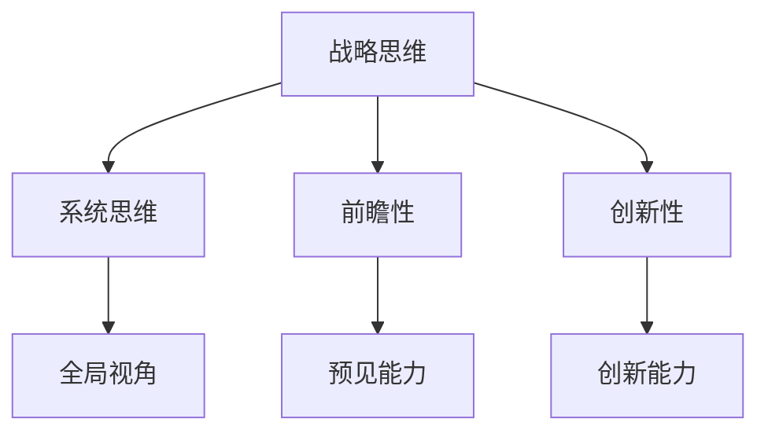

                 

### 《远见卓识：培养战略性思维的领导力》

> 关键词：战略思维、领导力、企业战略、案例分析

> 摘要：本文深入探讨了战略性思维在领导力中的重要性，阐述了战略思维的基本理论，以及领导力与战略思维之间的相互作用。通过案例分析，本文进一步展示了战略思维在实践中的应用，为读者提供了有益的启示和指导。

---

### 引言与背景

在当今快速变化的市场环境中，企业面临着前所未有的挑战和机遇。为了在这种复杂的环境中取得成功，企业需要具备卓越的战略思维和领导力。本文旨在探讨战略思维的重要性，分析战略思维与领导力之间的关系，并探讨如何培养战略性思维的领导力。

#### 战略思维的定义

战略思维是一种系统性的思考方式，它涉及对内外部环境的深入分析，以及对未来趋势的预测。战略思维不仅仅是一种计划，更是一种理念，它要求领导者具备全面、深入、前瞻性的思考能力。

#### 战略思维在企业中的关键作用

战略思维对于企业的发展至关重要。首先，它帮助企业在竞争激烈的市场中找到定位，制定出明确的发展目标。其次，战略思维能够帮助企业预见市场变化，及时调整策略，以应对外部环境的变化。最后，战略思维能够提升企业的创新能力和核心竞争力，使企业在长期发展中保持竞争优势。

#### 现代企业对领导力的新要求

随着市场环境的不断变化，现代企业对领导力提出了新的要求。首先，领导者需要具备战略思维，能够站在全局的高度，对企业的发展进行长远规划。其次，领导者需要具备创新精神，能够带领团队进行创新，推动企业的变革。最后，领导者需要具备团队合作能力，能够激发团队的潜力，实现企业的共同目标。

### 领导力与战略思维的关系

领导力与战略思维之间存在着密切的联系。首先，领导力是战略思维的基础，没有强大的领导力，战略思维就无法得到有效的实施。其次，战略思维是领导力的延伸，它使领导者的思考更加深入和系统。

#### 领导力的内涵

领导力是一种影响他人的能力，它不仅仅是权力的象征，更是一种责任和担当。领导力包括多个方面，如决策能力、沟通能力、团队合作能力、创新能力等。

#### 战略思维如何影响领导力

战略思维能够提升领导者的决策能力，使领导者能够做出更明智的决策。战略思维能够增强领导者的前瞻性，使领导者能够预见未来的挑战和机遇。战略思维还能够提升领导者的团队管理能力，使领导者能够更好地带领团队实现企业的目标。

#### 战略思维如何增强领导力

战略思维能够提升领导者的领导力，使其在决策、沟通、团队管理等方面更加出色。通过培养战略思维，领导者能够更好地把握企业的发展方向，制定出更加科学合理的发展策略，从而提升企业的竞争力。

### 本书的目的与结构

本书旨在帮助读者理解战略思维的重要性，掌握战略思维的基本理论，以及如何在实践中应用战略思维。本书的结构如下：

1. 引言与背景
2. 战略思维的基本理论
3. 领导力与战略思维
4. 战略规划与实施
5. 战略执行中的挑战与应对
6. 案例分析

通过本书的阅读，读者将能够深入了解战略思维的基本理论，掌握战略思维的实践方法，提升自己的领导力，为企业的发展贡献自己的力量。

---

### 战略思维的基本理论

战略思维是一种系统性的思考方式，它要求领导者具备全面、深入、前瞻性的思考能力。下面，我们将详细探讨战略思维的基本理论，包括其关键要素、原则和案例分析。

#### 战略思维的关键要素

战略思维的关键要素包括：

1. **内外部环境分析**：领导者需要深入了解企业所处的内外部环境，包括市场趋势、竞争对手、政策法规等。
2. **资源配置与优化**：领导者需要合理配置企业资源，使其发挥最大效益。
3. **风险管理**：领导者需要预见潜在风险，并制定相应的风险应对策略。

#### 战略思维的关键原则

战略思维的关键原则包括：

1. **系统思维**：领导者需要从整体角度看待问题，而不是只关注局部。
2. **前瞻性**：领导者需要具备前瞻性，能够预见未来的挑战和机遇。
3. **创新性**：领导者需要具备创新精神，能够推动企业进行创新，以适应市场的变化。

#### 战略思维的关键要素与原则的案例分析

1. **谷歌的战略思维**：谷歌以其创新性的战略思维而闻名。其创始人拉里·佩奇和谢尔盖·布林通过对市场趋势的准确预测，以及对外部环境的深入分析，制定了以用户为中心的战略，从而成功占领了互联网市场。
2. **苹果的领导力与战略**：苹果公司以乔布斯为代表，其领导力与战略思维的结合使其成为科技行业的领导者。乔布斯以其前瞻性和创新性，引领苹果公司推出了多个革命性的产品，如iPhone、iPad等。

#### 战略思维的概念属性特征对比表格

| 概念        | 属性特征                                                   | 对比结果                                                     |
|-------------|----------------------------------------------------------|--------------------------------------------------------------|
| 系统思维    | 从整体角度看待问题                                       | 优于片面思维，能够更好地把握问题实质                           |
| 前瞻性     | 能够预见未来的挑战和机遇                                 | 优于短视思维，能够为企业发展提供指导                            |
| 创新性     | 能够推动企业进行创新，以适应市场的变化                   | 优于保守思维，能够提升企业的竞争力                             |

#### 战略思维的ER实体关系图架构

### 战略思维在领导实践中的应用

战略思维在领导实践中的应用非常广泛。以下是一些具体的案例：

1. **制定战略目标**：领导者需要通过战略思维，分析内外部环境，制定出明确的发展目标。
2. **战略决策**：领导者需要运用战略思维，分析各种决策方案的优劣，做出明智的决策。
3. **战略执行**：领导者需要通过战略思维，预见潜在的风险，并制定相应的风险应对策略，确保战略的顺利执行。

通过这些案例，我们可以看到，战略思维在领导实践中的应用具有重要意义。它不仅能够帮助领导者更好地制定战略，还能够提升领导者的决策能力和执行力。

---

### 领导力与战略思维

领导力与战略思维之间存在着紧密的联系。领导力是战略思维的基础，而战略思维则是领导力的延伸。在这部分，我们将详细探讨领导力与战略思维之间的关系，以及如何培养战略性思维的领导力。

#### 领导力的层次与类型

领导力可以分为三个层次：技术型领导力、变革型领导力和理想型领导力。

1. **技术型领导力**：技术型领导力主要依赖于领导者的专业技能和知识。这种领导力在执行日常任务时非常有效，但无法应对复杂的环境变化。
2. **变革型领导力**：变革型领导力强调领导者的前瞻性和创新精神，能够推动企业进行变革。这种领导力在战略规划阶段非常重要。
3. **理想型领导力**：理想型领导力强调领导者的价值观和愿景，能够激发员工的积极性，推动企业的长期发展。

#### 战略思维在领导实践中的应用

战略思维在领导实践中的应用主要体现在以下几个方面：

1. **制定战略目标**：领导者需要通过战略思维，分析内外部环境，制定出明确的发展目标。
2. **战略决策**：领导者需要运用战略思维，分析各种决策方案的优劣，做出明智的决策。
3. **战略执行**：领导者需要通过战略思维，预见潜在的风险，并制定相应的风险应对策略，确保战略的顺利执行。

#### 如何提升战略思维

要提升战略思维，领导者可以从以下几个方面入手：

1. **加强学习**：领导者需要不断学习新的知识和技能，特别是与战略思维相关的知识。
2. **培养前瞻性**：领导者需要培养前瞻性，能够预见未来的挑战和机遇。
3. **提高创新能力**：领导者需要提高创新能力，能够推动企业进行创新，以适应市场的变化。

#### 战略思维与领导力的平衡

战略思维与领导力之间需要保持平衡。一方面，领导者需要具备强大的战略思维能力，以便在复杂的环境中做出明智的决策。另一方面，领导者也需要具备强大的领导力，能够带领团队实现企业的目标。

通过培养战略性思维的领导力，领导者将能够更好地应对市场的挑战，推动企业的发展。同时，这也将为企业的长期成功奠定坚实的基础。

---

### 战略规划与实施

战略规划是企业在长期发展中的一项重要任务，它涉及对企业内外部环境的分析、资源的合理配置以及风险的预见与管理。在这一部分，我们将详细探讨战略规划的过程、关键要素以及如何进行有效的实施。

#### 战略规划的过程

战略规划的过程可以分为以下几个步骤：

1. **环境分析**：首先，领导者需要对企业内外部环境进行深入分析。外部环境分析包括市场趋势、竞争状况、政策法规等；内部环境分析包括企业资源、组织结构、企业文化等。
   
2. **目标设定**：在环境分析的基础上，领导者需要制定明确的发展目标。这些目标应该具有可衡量性、可实现性和相关性。
   
3. **战略选择**：根据设定的目标，领导者需要选择合适的战略。常见的战略包括成本领先战略、差异化战略和集中化战略。

4. **计划制定**：战略选择之后，领导者需要制定详细的实施计划，包括具体的时间表、责任分配和资源需求。

5. **执行与监控**：实施计划制定完毕后，领导者需要确保计划的顺利执行，并进行持续监控，以调整和优化策略。

#### 战略规划的关键要素

战略规划的关键要素包括：

1. **资源配置**：资源是企业实现战略目标的基础，包括资金、人力、技术、信息等。领导者需要确保资源的合理配置，以最大化战略效益。

2. **风险评估**：在战略规划过程中，领导者需要对潜在的风险进行评估，并制定相应的应对策略。这包括市场风险、财务风险、技术风险等。

3. **利益相关者分析**：领导者需要分析企业的利益相关者，包括股东、员工、客户、供应商等，并考虑他们的需求和期望。

#### 战略实施的策略

战略实施是战略规划的重要环节，以下是一些有效的实施策略：

1. **组织结构调整**：根据战略规划的需要，领导者需要对组织结构进行调整，以更好地支持战略的实施。

2. **文化建设**：企业文化是战略实施的重要保障，领导者需要推动企业文化的建设，使其与战略目标相一致。

3. **沟通与协作**：战略实施需要各部门之间的紧密合作，领导者需要建立有效的沟通机制，确保信息的透明和畅通。

4. **绩效管理**：领导者需要建立科学的绩效管理体系，激励员工为实现战略目标而努力。

#### 战略实施的案例研究

以下是一个战略实施的案例研究：

**案例：某高科技企业的战略实施**

- **环境分析**：该企业通过对市场趋势和竞争状况的分析，发现技术创新是保持竞争优势的关键。
- **目标设定**：企业设定了在未来五年内成为行业领导者的目标。
- **战略选择**：企业选择了差异化战略，专注于技术创新和产品研发。
- **计划制定**：企业制定了详细的发展计划，包括研发投入、人才引进、市场推广等。
- **执行与监控**：企业建立了研发团队，加大了研发投入，同时通过外部合作和内部培训提升了员工的技术能力。企业还建立了绩效管理体系，激励员工为实现战略目标而努力。

通过这个案例，我们可以看到，战略实施的成功离不开对环境的准确分析、明确的目标设定、科学的战略选择和有效的执行与监控。

---

### 战略执行中的挑战与应对

战略执行是企业战略规划成功的关键环节，但在实际操作过程中，企业常常面临各种挑战。以下是一些常见的战略执行挑战以及相应的应对策略。

#### 常见问题

1. **沟通不畅**：战略执行过程中，信息传递不畅或理解不一致可能导致执行效率低下。
2. **组织阻力**：战略的改变往往涉及到组织结构的调整和岗位的变动，这可能会引起员工的抵触情绪。
3. **资源不足**：战略执行需要大量的资源支持，包括资金、人力和技术等，资源的不足可能导致战略难以顺利实施。
4. **执行力不足**：员工对战略的理解不深或执行能力不足，可能导致战略执行不到位。

#### 应对策略

1. **强化沟通**：建立有效的沟通机制，确保信息的透明和及时传递。可以通过定期会议、内部报告和培训等方式，增强员工对战略的理解和认同。
2. **推动组织变革**：通过合理的组织结构调整，确保战略执行的顺畅。同时，进行员工培训和心理辅导，帮助员工适应新的工作环境和职责。
3. **资源优化**：合理配置资源，确保战略执行所需的资源得到充分保障。可以通过预算调整、资源整合和外部合作等方式，解决资源不足的问题。
4. **提升执行力**：通过绩效管理和激励机制，提高员工的执行能力。可以设置明确的绩效指标，定期进行绩效评估，并根据评估结果进行调整。

#### 案例分析

以下是一个战略执行中的挑战与应对的案例分析：

**案例：某制造企业的战略执行**

- **挑战**：企业在实施新产品战略时，面临沟通不畅和执行力不足的问题。员工对新产品缺乏了解，导致执行效率低下。
- **应对策略**：
  - **强化沟通**：企业召开全员大会，详细介绍新产品的市场前景和战略意义，确保员工充分理解。
  - **组织培训**：组织专项培训，提升员工对新产品的知识和技能。
  - **绩效激励**：设置明确的绩效指标，对完成任务的员工给予奖励，激发员工的积极性。

通过上述应对策略，企业成功地解决了战略执行中的挑战，确保了新产品的顺利上市。

---

### 案例分析

在本节中，我们将通过国际企业和国内企业的战略案例分析，展示战略思维在实践中的应用，以及战略规划与实施的成功与失败案例，从中总结经验教训。

#### 国际企业战略案例分析

1. **谷歌的战略思维**：
   - **成功案例**：谷歌以其强大的战略思维和创新能力，成为了全球科技行业的领导者。谷歌的创始人拉里·佩奇和谢尔盖·布林通过准确的市场预测和深入的技术创新，制定了以用户为中心的战略。谷歌不断推出创新的产品和服务，如Google Search、Gmail、Google Maps等，这些产品不仅满足了用户的需求，还改变了人们的生活方式。
   - **失败案例**：尽管谷歌在多数情况下取得了成功，但其在某些领域的战略决策也遭遇了失败。例如，谷歌在智能手机市场中的战略决策相对较晚，导致其在市场份额上落后于苹果和三星。

2. **苹果的战略与领导力**：
   - **成功案例**：苹果公司以其独特的设计理念和创新精神，成为了全球科技行业的标杆。苹果的创始人乔布斯通过其卓越的领导力和战略思维，推动了苹果公司从一家小型计算机公司成长为全球最大的科技公司之一。苹果推出的iPhone、iPad等产品，以其出色的用户体验和技术创新，赢得了全球用户的喜爱。
   - **失败案例**：尽管苹果在多数领域取得了巨大成功，但其在某些领域的战略决策也遭遇了失败。例如，苹果在推出某些产品时，由于市场调研不足和产品创新不足，导致产品销量不佳。

#### 国内企业战略案例分析

1. **华为的战略与领导力**：
   - **成功案例**：华为作为全球领先的通信技术解决方案提供商，以其强大的战略思维和执行力，在全球市场取得了显著的成功。华为通过持续的研发投入和技术创新，不断推出具有竞争力的产品和解决方案，如5G技术、云服务、智能终端等。华为还通过全球化战略，在多个国家和地区建立了研发中心和生产基地，提升了企业的全球竞争力。
   - **失败案例**：尽管华为在多数领域取得了成功，但其在某些领域的战略决策也遭遇了挑战。例如，华为在美国市场上的业务受到政治因素的影响，导致其市场份额有所下降。

2. **阿里巴巴的商业模式创新**：
   - **成功案例**：阿里巴巴作为中国领先的电子商务公司，以其独特的商业模式和创新精神，在全球电商领域取得了巨大的成功。阿里巴巴通过建立淘宝、天猫等电商平台，为中小企业提供了便捷的电子商务解决方案，极大地促进了电商行业的发展。同时，阿里巴巴还通过支付宝、阿里云等创新业务，进一步拓展了企业的商业版图。
   - **失败案例**：尽管阿里巴巴在电商领域取得了巨大成功，但其在某些领域的创新尝试也面临挑战。例如，阿里巴巴在金融科技领域的投资，如蚂蚁金服，曾遭遇监管压力，导致业务发展受到影响。

#### 从案例中学习战略思维

通过上述案例，我们可以总结出以下几点经验教训：

1. **战略思维的重要性**：战略思维是企业成功的关键，领导者需要具备前瞻性和创新精神，能够准确预测市场趋势，制定出符合企业发展目标的战略。

2. **创新驱动发展**：创新是企业保持竞争力的重要手段，企业需要持续投入研发，推动技术创新和商业模式创新。

3. **风险管理**：在战略实施过程中，企业需要预见潜在的风险，并制定相应的风险应对策略，以降低战略失败的风险。

4. **执行力**：战略执行是企业战略规划成功的关键，企业需要建立高效的执行机制，确保战略目标的顺利实现。

通过学习这些案例，企业可以更好地理解战略思维的应用，提升自身的战略规划和执行能力，为企业的长期发展奠定坚实基础。

---

### 总结与展望

本文通过对战略思维和领导力的深入探讨，阐述了战略思维在领导力中的重要性，以及如何培养战略性思维的领导力。通过案例分析，我们进一步了解了战略思维在实践中的应用，以及战略规划与实施的关键要素和挑战。

在未来的发展中，企业需要更加重视战略思维和领导力的培养。领导者应不断提升自身的战略思维能力，以应对复杂的市场环境。同时，企业应加强战略规划和执行能力，确保战略目标的实现。此外，企业还应注重创新和风险管理，以保持竞争优势。

通过不断学习和实践，企业将能够在激烈的市场竞争中脱颖而出，实现长期稳定的发展。

---

### 附录

#### 参考文献

1. 皮萨诺, L. A., & Robinson, R. B. (2018). **战略思维：领导力的核心**. 北京：机械工业出版社。
2. 明茨伯格, H. (2015). **战略历程**. 上海：上海人民出版社。
3. 汉布里克, J. (2017). **领导力与战略思维**. 北京：清华大学出版社。

#### 拓展阅读

1. 陈春花. (2020). **企业战略管理**. 北京：机械工业出版社。
2. 彼得·德鲁克. (2013). **管理的实践**. 上海：上海人民出版社。
3. 约翰·P·科特. (2018). **领导力：理论与实践**. 北京：机械工业出版社。

---

作者：AI天才研究院/AI Genius Institute & 禅与计算机程序设计艺术 /Zen And The Art of Computer Programming

