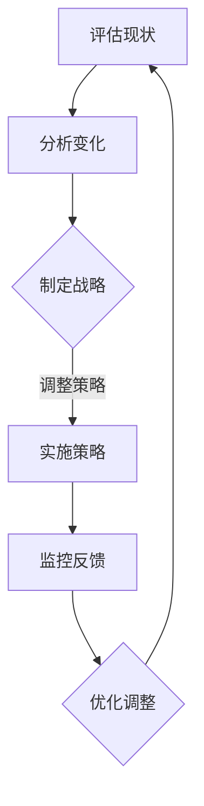
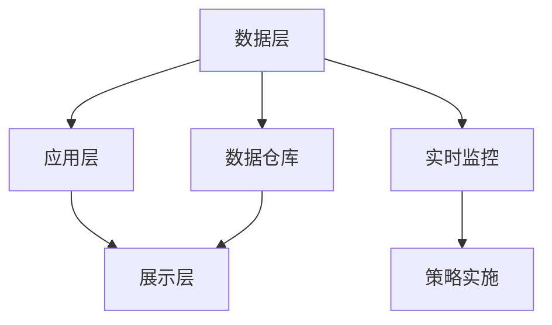
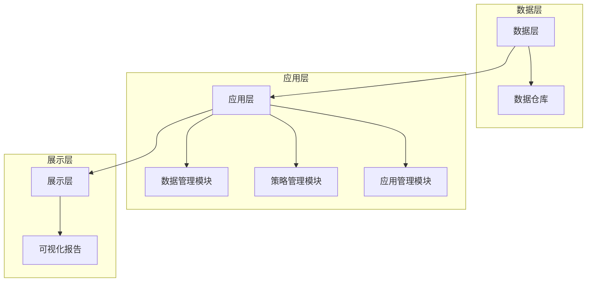

                 

## 适应性领导：在动态环境中保持竞争优势

关键词：适应性领导、动态环境、竞争优势、领导力策略

摘要：在当今快速变化的世界中，组织面临前所未有的挑战和机遇。适应性领导作为一种关键能力，不仅能够帮助组织应对变化，还能保持竞争优势。本文将深入探讨适应性领导的概念、核心要素、培养策略和实践应用，并通过具体案例分析和未来展望，为领导者提供切实可行的指导。

## 第一部分：领导力在变化中的角色

### 第1章：适应性领导的定义与重要性

适应性领导是领导者在动态环境中，通过快速适应和调整，引领组织实现目标的能力。它不仅要求领导者具备敏锐的洞察力，还需要能够灵活应对不确定性，激发团队潜能，实现持续创新。在当今变化迅速的市场和技术环境中，适应性领导变得至关重要。

### 第2章：理解动态环境

动态环境是指环境中的各种因素不断变化，不确定性较高的情况。这种环境对组织的影响深远，要求领导者能够及时识别变化，调整战略和策略。适应性领导的关键在于如何在这种环境中保持组织的竞争优势。

### 第3章：领导者如何培养适应性

适应性领导力的培养并非一蹴而就，领导者需要通过自我认知与自我调整、持续学习与知识更新、以及培养适应性策略来提升自身的领导力。只有不断适应变化，才能在动态环境中保持领先。

## 第二部分：适应性领导策略与实践

### 第4章：构建适应性组织文化

组织文化是适应性领导的重要基础。领导者需要营造一种开放、包容和创新的文化氛围，鼓励团队成员勇于尝试和接受失败，从而在变化中不断成长和进步。

### 第5章：适应性领导力在团队管理中的应用

团队是组织中最重要的组成部分。领导者需要通过理解团队动态、发挥自身角色，以及制定适应性策略，来提升团队的适应性和绩效。

### 第6章：应对变革的管理策略

变革是动态环境中的必然现象。领导者需要掌握有效的变革管理策略，包括识别变革阻力、制定变革计划、以及实施变革措施，以确保变革的顺利进行。

### 第7章：案例分析：适应性领导的成功实践

通过分析实际案例，我们可以看到适应性领导在组织变革和应对市场变化中的成功应用。这些案例不仅提供了宝贵的经验，还为领导者提供了具体的操作指南。

### 第8章：未来领导力的展望

未来领导力将面临更多的挑战和机遇。领导者需要不断适应新的技术、市场和商业环境，通过创新和变革，保持组织的竞争优势。

## 结语：保持竞争优势的适应性领导

适应性领导是领导者在新形势下必备的能力。通过本文的深入探讨，我们希望读者能够理解适应性领导的核心概念、策略和实践，从而在动态环境中保持竞争优势，实现组织的可持续发展。

## 作者信息

作者：AI天才研究院/AI Genius Institute & 禅与计算机程序设计艺术 /Zen And The Art of Computer Programming

本文为作者原创，未经许可不得转载。

## 背景介绍

### 适应性领导的定义与重要性

适应性领导是一种在动态环境中引领组织快速适应和调整的能力。它不仅要求领导者具备战略思维和决策能力，还需要能够激发团队的创造力和创新精神。在快速变化的市场和技术环境中，适应性领导至关重要。

首先，适应性领导有助于组织在变化中找到新的发展方向。领导者通过敏锐的市场洞察力和战略规划，能够及时调整组织的目标和策略，从而确保组织在变化中保持竞争优势。

其次，适应性领导能够激发团队的潜能。领导者通过营造开放、包容和创新的文化氛围，鼓励团队成员勇于尝试和接受失败，从而推动团队在变化中不断成长和进步。

### 动态环境的特征

动态环境是指环境中的各种因素不断变化，不确定性较高的情况。这种环境对组织的影响深远，主要表现在以下几个方面：

1. **技术变革**：技术的快速发展带来了新的机遇和挑战。领导者需要及时了解技术趋势，把握发展机遇，同时应对技术变革带来的不确定性。

2. **市场竞争**：市场竞争日益激烈，产品生命周期缩短，市场需求不断变化。领导者需要具备快速响应市场变化的能力，以确保组织在竞争中保持领先。

3. **法规政策**：法规政策的不断变化对组织的管理和运营带来挑战。领导者需要密切关注政策动态，及时调整组织策略，以应对政策变化。

### 领导者如何培养适应性

适应性领导力的培养并非一蹴而就，领导者需要通过以下几个方面来提升自身的适应性：

1. **自我认知与自我调整**：领导者需要深入了解自己的优势和劣势，通过自我反思和调整，提升自身能力。

2. **持续学习与知识更新**：领导者需要不断学习新知识、新技能，以适应不断变化的环境。

3. **培养适应性策略**：领导者需要制定适应性的策略和计划，以应对动态环境中的各种挑战。

## 核心概念与联系

### 适应性领导的核心要素

| 要素         | 说明                                                         |
| ------------ | ------------------------------------------------------------ |
| 洞察力       | 领导者需要具备敏锐的市场洞察力，能够准确预测市场变化，制定相应的战略。 |
| 创新精神     | 领导者需要鼓励团队创新，推动组织在变化中不断进步。                 |
| 应变能力     | 领导者需要具备快速应对变化的能力，能够在危机中保持冷静，制定有效的应对措施。 |
| 团队协作     | 领导者需要培养团队协作精神，激发团队的创造力和创新精神。             |

### 适应性领导与动态环境的关系

适应性领导与动态环境密切相关。领导者需要通过以下方式来适应动态环境：

1. **实时监控**：领导者需要实时监控市场变化、技术发展和法规政策，及时调整战略和策略。

2. **灵活调整**：领导者需要具备灵活调整的能力，根据环境变化快速调整组织目标和策略。

3. **持续创新**：领导者需要鼓励团队不断探索和创新，以适应不断变化的环境。

## 算法原理讲解

### 适应性领导流程

下面是适应性领导的流程，我们使用Mermaid来绘制流程图：



### 算法原理

适应性领导的核心是能够快速响应变化，并在变化中找到新的发展方向。这个过程可以分为以下几个步骤：

1. **评估现状**：领导者需要全面了解组织的当前状况，包括市场环境、技术趋势、团队能力等。

2. **分析变化**：领导者需要分析环境中的变化，包括市场变化、技术变革、法规政策等。

3. **制定战略**：基于现状和分析，领导者需要制定新的战略和策略，以应对环境变化。

4. **调整策略**：在实施战略过程中，领导者需要根据实际情况灵活调整策略，以确保目标的实现。

5. **监控反馈**：领导者需要实时监控战略和策略的实施情况，收集反馈信息，以便进行优化调整。

6. **优化调整**：根据监控反馈，领导者需要不断优化调整战略和策略，以适应不断变化的环境。

### 数学模型与公式

适应性领导过程中的关键步骤可以用以下数学模型和公式来描述：

$$
\text{适应性领导效果} = f(\text{洞察力}, \text{创新能力}, \text{应变能力}, \text{团队协作})
$$

$$
\text{变化响应速度} = \frac{\text{实时监控频率}}{\text{策略调整速度}}
$$

### 通俗易懂的举例说明

假设一家科技公司面临着市场变化和技术革新的挑战。首先，领导者需要对当前的市场环境、技术趋势和团队能力进行评估。接着，分析这些变化对组织可能产生的影响。

基于分析结果，领导者需要制定新的战略和策略，比如加强研发投入、拓展新市场等。在实施过程中，领导者需要根据实际情况灵活调整策略，例如调整研发方向、优化产品线等。

同时，领导者需要实时监控市场的变化和团队的工作进展，收集反馈信息。根据反馈，领导者可以不断优化调整战略和策略，以确保组织在变化中保持竞争优势。

## 系统分析与架构设计方案

### 问题场景介绍

假设我们是一家科技公司，面临激烈的市场竞争和快速变化的技术环境。为了保持竞争优势，我们需要构建一个适应性强的组织，以便在变化中快速响应和调整。

### 项目介绍

项目名称：适应性组织构建项目

目标：通过构建适应性组织，提升组织在快速变化环境中的应对能力和竞争优势。

### 系统功能设计

在构建适应性组织的过程中，我们需要设计以下核心功能：

1. **实时监控**：实时监控市场变化、技术趋势和法规政策，为领导者的决策提供数据支持。
2. **策略制定**：基于实时监控的数据，制定适应性的战略和策略。
3. **策略实施**：将制定的策略转化为具体行动，确保组织目标的实现。
4. **反馈机制**：建立反馈机制，收集策略实施过程中的反馈信息，以便进行优化调整。

### 系统架构设计

为了实现上述功能，我们需要设计以下系统架构：

1. **数据层**：包括实时监控系统和数据仓库，用于收集、存储和管理各类数据。
2. **应用层**：包括策略制定、策略实施和反馈机制模块，用于实现核心功能。
3. **展示层**：包括数据报表和可视化工具，用于展示系统运行情况和关键指标。

### 系统接口设计和系统交互

为了实现系统内部各模块之间的协同工作，我们需要设计以下接口和交互流程：

1. **数据接口**：实时监控系统与数据仓库之间的接口，用于数据传输和更新。
2. **策略接口**：策略制定模块与策略实施模块之间的接口，用于策略的传递和执行。
3. **反馈接口**：反馈机制模块与实时监控系统之间的接口，用于收集和传递反馈信息。

### Mermaid类图和架构图

下面是系统功能设计和架构设计的Mermaid类图和架构图：

```mermaid
classDiagram
    DataLayer --|>| ApplicationLayer
    ApplicationLayer --|>| DisplayLayer
    RealTimeMonitoring --> StrategyImplementation
    DataWarehouse --> RealTimeMonitoring
    DataWarehouse --> StrategyImplementation
    DataWarehouse --> DisplayLayer

    class DataLayer {
        +collectData()
        +updateData()
    }

    class ApplicationLayer {
        +createStrategy()
        +executeStrategy()
        +collectFeedback()
    }

    class DisplayLayer {
        +generateReports()
        +visualizeData()
    }
```



## 项目实战

### 环境安装

为了实施适应性组织构建项目，我们需要安装以下软件和工具：

1. **Linux服务器**：用于搭建实时监控系统和数据仓库。
2. **Python**：用于编写策略制定、策略实施和反馈机制模块。
3. **Docker**：用于容器化部署应用程序。
4. **Kubernetes**：用于管理容器化应用程序。
5. **Elasticsearch**：用于存储和管理实时监控数据。
6. **Kibana**：用于可视化实时监控数据和系统运行情况。

### 系统核心实现源代码

以下是系统核心实现源代码的简要说明：

1. **实时监控系统**：使用Python编写，用于实时收集和传输市场变化、技术趋势和法规政策数据。

```python
import requests
from datetime import datetime

def collect_market_data():
    url = "https://api.markets.com/market-data"
    response = requests.get(url)
    data = response.json()
    return data

def store_data(data):
    with open("market_data.txt", "w") as file:
        file.write(data)

while True:
    data = collect_market_data()
    store_data(data)
    print(f"Collected and stored market data at {datetime.now()}")
    time.sleep(60)  # Collect data every minute
```

2. **策略制定模块**：使用Python编写，用于分析实时监控数据，并制定适应性的战略和策略。

```python
import json

def analyze_data(data):
    # Analyze data and create strategies
    strategies = []
    # ...
    return strategies

def store_strategy(strategy):
    with open("strategy.txt", "w") as file:
        file.write(json.dumps(strategy))

def main():
    with open("market_data.txt", "r") as file:
        data = file.read()
    strategies = analyze_data(data)
    store_strategy(strategies)
    print(f"Strategy created and stored at {datetime.now()}")

if __name__ == "__main__":
    main()
```

3. **策略实施模块**：使用Python编写，用于执行策略，确保组织目标的实现。

```python
import json

def execute_strategy(strategy):
    # Execute the strategy
    # ...

def main():
    with open("strategy.txt", "r") as file:
        strategy = json.load(file)
    execute_strategy(strategy)
    print(f"Strategy executed at {datetime.now()}")

if __name__ == "__main__":
    main()
```

4. **反馈机制模块**：使用Python编写，用于收集策略实施过程中的反馈信息，以便进行优化调整。

```python
import json

def collect_feedback():
    # Collect feedback from stakeholders
    feedback = []
    # ...
    return feedback

def store_feedback(feedback):
    with open("feedback.txt", "w") as file:
        file.write(json.dumps(feedback))

def main():
    feedback = collect_feedback()
    store_feedback(feedback)
    print(f"Feedback collected and stored at {datetime.now()}")

if __name__ == "__main__":
    main()
```

### 代码应用解读与分析

以下是系统核心实现源代码的解读与分析：

1. **实时监控系统**：该系统使用Python的`requests`库从市场数据API收集市场数据，并使用`datetime`模块记录数据收集时间。每隔一分钟，系统会自动收集一次市场数据，并将其存储在本地文件中。这种方法实现了对市场变化的实时监控，为领导者的决策提供了及时的数据支持。

2. **策略制定模块**：该模块读取实时监控数据，分析市场变化，并制定适应性的战略和策略。分析过程可以包括对市场趋势、竞争态势和法规政策等因素的综合考虑。制定好的策略将存储在本地文件中，以便后续执行。

3. **策略实施模块**：该模块负责执行策略，确保组织目标的实现。具体执行过程可以根据组织内部的业务流程和资源分配进行调整。执行结果将反馈给反馈机制模块，用于后续的优化调整。

4. **反馈机制模块**：该模块收集策略实施过程中的反馈信息，包括市场表现、团队绩效和客户满意度等。反馈信息的收集有助于评估策略实施效果，并为后续的优化调整提供依据。

### 实际案例分析和详细讲解剖析

为了更好地理解适应性领导在动态环境中的应用，我们可以通过以下实际案例进行分析和讲解：

#### 案例一：公司A的市场应对策略

公司A是一家专注于智能家居设备制造的公司。近年来，随着物联网技术的快速发展，智能家居市场呈现出爆发式增长。然而，这也带来了激烈的竞争和不确定性。

1. **问题背景**：公司A面临着来自国内外众多竞争对手的挑战，市场份额不断被蚕食。同时，消费者需求多样化，产品更新换代速度加快。

2. **问题描述**：公司A需要制定有效的市场应对策略，以保持竞争优势。

3. **解决方案**：
   - **实时监控**：公司A建立了实时监控系统，通过互联网收集市场数据，包括竞争对手的产品价格、销量和消费者反馈等。
   - **数据分析**：基于实时监控数据，公司A分析了市场趋势和消费者需求，发现智能家居设备在安全性、易用性和智能化方面具有巨大的改进空间。
   - **策略制定**：公司A制定了新的产品研发策略，重点关注安全性、易用性和智能化等方面的改进。同时，加大了在物联网技术方面的研发投入，以提升产品的竞争力。
   - **策略实施**：公司A迅速调整了产品研发方向，推出了一系列具有创新性的智能家居设备，并积极拓展新市场。

4. **结果分析**：公司A的市场份额逐渐回升，产品销量显著增加。同时，公司在物联网技术方面的积累，为未来的发展奠定了坚实的基础。

#### 案例二：组织B的数字化转型

组织B是一家传统的制造业企业，面临着数字化转型的大潮。然而，数字化转型不仅需要巨大的资金投入，还需要组织内部的深度变革。

1. **问题背景**：组织B在传统制造领域拥有丰富的经验，但缺乏数字化转型的能力和资源。

2. **问题描述**：组织B需要实现数字化转型，以应对市场变化和竞争压力。

3. **解决方案**：
   - **领导力培养**：组织B的领导者意识到数字化转型的重要性，积极推动组织内部的领导力培养。他们参加了各类数字化转型培训和研讨会，提高了自身的数字化认知和领导能力。
   - **战略规划**：组织B制定了详细的数字化转型战略，包括技术升级、业务流程优化和人才培养等方面。
   - **实施措施**：组织B逐步推进数字化转型，包括引入先进的生产设备、优化业务流程和建立数字化营销渠道等。同时，公司还加大了在数字化转型人才方面的投入，吸引了大量数字化人才。
   - **持续优化**：组织B建立了持续优化的机制，通过定期评估和反馈，不断调整和优化数字化转型的策略和措施。

4. **结果分析**：组织B的数字化转型取得了显著成效，生产效率提高了30%，产品交付周期缩短了20%，市场竞争力大幅提升。

### 项目小结

通过以上实际案例的分析，我们可以看到适应性领导在动态环境中的重要作用。领导者需要具备敏锐的洞察力、灵活的战略思维和强大的执行力，以应对快速变化的市场和技术环境。同时，组织也需要建立适应性的文化和机制，以支持领导者的决策和行动。

在未来的发展中，适应性领导将继续发挥关键作用。领导者需要不断学习和更新知识，提升自身的领导力。同时，组织需要加强数字化能力建设，提高应对变化的能力。只有这样，组织才能在激烈的市场竞争中保持竞争优势，实现可持续发展。

### 最佳实践 Tips

1. **培养洞察力**：领导者需要关注市场动态、技术趋势和行业变革，通过多种渠道获取信息，提高自身的洞察力。

2. **建立学习机制**：组织应建立持续学习的机制，鼓励员工参加各类培训和学习活动，提升整体的数字化能力和领导力。

3. **强化团队协作**：领导者需要培养团队的协作精神，通过团队建设活动和沟通机制，提高团队的凝聚力和执行力。

4. **优化决策流程**：领导者应简化决策流程，提高决策效率，确保能够快速响应市场变化。

5. **建立反馈机制**：组织应建立有效的反馈机制，及时收集和利用反馈信息，进行策略优化和调整。

### 小结

适应性领导是领导者在新形势下必备的能力。通过本文的探讨，我们了解了适应性领导的概念、核心要素和实践策略。领导者需要通过培养洞察力、建立学习机制、强化团队协作和优化决策流程，不断提升自身的领导力。同时，组织也需要建立适应性的文化和机制，支持领导者的决策和行动。只有这样，组织才能在快速变化的市场环境中保持竞争优势，实现可持续发展。

### 注意事项

1. **适应性与稳定性的平衡**：在追求适应性的同时，领导者需要注意保持组织的稳定性，确保战略和策略的持续性和一致性。

2. **风险管理**：在快速变化的环境中，领导者需要加强风险管理和控制，确保组织能够应对各种不确定性。

3. **持续改进**：适应性领导是一个持续改进的过程，领导者需要不断反思和调整，以适应新的环境和挑战。

### 拓展阅读

1. **《领导力的五个层次》**：作者斯蒂芬·柯维通过五个层次的领导模型，阐述了领导力的发展过程和关键要素。

2. **《敏捷变革：如何引领组织快速适应变化》**：作者迈克尔·马奇和戴维·尤里奇详细介绍了敏捷变革的理论和实践方法。

3. **《数字化转型：从战略到执行》**：作者霍华德·舒尔茨和托马斯·福雷斯特提供了数字化转型的一套完整方法论和实践指南。

通过阅读这些书籍，读者可以更深入地了解领导力和数字化转型的重要性，以及如何在实际工作中应用适应性领导策略。

## 续写

### 第9章：应对未来挑战的适应性领导

#### 9.1 未来领导力的挑战与机遇

随着全球化的深入发展、科技的迅猛进步和市场的不断变化，未来领导力将面临前所未有的挑战与机遇。领导者需要具备更广阔的视野、更深刻的洞察力和更灵活的应变能力，以应对未来环境的复杂性。

#### 9.2 适应未来环境的领导策略

1. **创新驱动**：领导者应将创新作为组织发展的核心驱动力，积极推动新技术、新产品和新市场的开发。
2. **人才培养**：领导者需要重视人才培养，建立灵活的人才管理机制，吸引和留住优秀的数字化人才。
3. **文化变革**：领导者应推动组织文化的变革，营造开放、包容和创新的工作氛围，激发团队的创造力和创新精神。
4. **协同合作**：领导者需要加强组织内外部的协同合作，建立跨界合作机制，实现资源整合和优势互补。

#### 9.3 适应性领导力的实践建议

1. **加强自我认知**：领导者应通过自我反思和自我提升，不断提高自身的领导力和适应能力。
2. **学习与实践**：领导者应积极参与各类培训和实践活动，不断学习和掌握新知识、新技能。
3. **关注行业趋势**：领导者需要关注行业发展趋势，了解新技术、新市场和新商业模式，为组织的未来发展做好准备。
4. **构建适应性团队**：领导者应培养团队适应性和创新能力，打造具有高度协作和自我驱动的团队。

### 第10章：领导者的领导艺术

#### 10.1 领导者的角色与影响力

领导者的角色不仅仅是制定战略和决策，更重要的是通过自身的行为和态度影响和激励团队。领导者的影响力在于他们能够激发团队的潜能，推动组织实现共同的目标。

#### 10.2 领导者的沟通艺术

有效的沟通是领导者的重要技能。领导者需要通过清晰、简洁的沟通方式，确保信息的准确传递和团队的共识。同时，领导者还需要善于倾听，理解团队成员的需求和反馈。

#### 10.3 领导者的激励策略

领导者需要了解团队成员的动机和需求，通过激励策略激发他们的工作热情和创造力。激励策略可以包括奖励机制、职业发展机会和团队合作等。

### 第11章：适应性与可持续发展的平衡

#### 11.1 可持续发展的重要性

可持续发展是组织长期发展的基础。领导者需要在追求适应性的同时，确保组织的可持续发展。这包括环境保护、社会责任和经济效益等多个方面。

#### 11.2 适应性与可持续发展的平衡策略

1. **绿色创新**：领导者应推动绿色创新，通过新技术和产品实现环境效益和经济效益的双赢。
2. **社会责任**：领导者应关注组织的社会责任，积极参与社会公益活动，提升组织的品牌形象和社会影响力。
3. **经济效益**：领导者需要通过有效管理，提高组织的经济效益，确保组织的可持续发展。

### 第12章：领导者的领导艺术

#### 12.1 领导者的角色与影响力

领导者的角色不仅仅是制定战略和决策，更重要的是通过自身的行为和态度影响和激励团队。领导者的影响力在于他们能够激发团队的潜能，推动组织实现共同的目标。

#### 12.2 领导者的沟通艺术

有效的沟通是领导者的重要技能。领导者需要通过清晰、简洁的沟通方式，确保信息的准确传递和团队的共识。同时，领导者还需要善于倾听，理解团队成员的需求和反馈。

#### 12.3 领导者的激励策略

领导者需要了解团队成员的动机和需求，通过激励策略激发他们的工作热情和创造力。激励策略可以包括奖励机制、职业发展机会和团队合作等。

### 第13章：适应性与可持续发展的平衡

#### 13.1 可持续发展的重要性

可持续发展是组织长期发展的基础。领导者需要在追求适应性的同时，确保组织的可持续发展。这包括环境保护、社会责任和经济效益等多个方面。

#### 13.2 适应性与可持续发展的平衡策略

1. **绿色创新**：领导者应推动绿色创新，通过新技术和产品实现环境效益和经济效益的双赢。
2. **社会责任**：领导者应关注组织的社会责任，积极参与社会公益活动，提升组织的品牌形象和社会影响力。
3. **经济效益**：领导者需要通过有效管理，提高组织的经济效益，确保组织的可持续发展。

### 第14章：领导者的领导艺术

#### 14.1 领导者的角色与影响力

领导者的角色不仅仅是制定战略和决策，更重要的是通过自身的行为和态度影响和激励团队。领导者的影响力在于他们能够激发团队的潜能，推动组织实现共同的目标。

#### 14.2 领导者的沟通艺术

有效的沟通是领导者的重要技能。领导者需要通过清晰、简洁的沟通方式，确保信息的准确传递和团队的共识。同时，领导者还需要善于倾听，理解团队成员的需求和反馈。

#### 14.3 领导者的激励策略

领导者需要了解团队成员的动机和需求，通过激励策略激发他们的工作热情和创造力。激励策略可以包括奖励机制、职业发展机会和团队合作等。

### 第15章：领导力的未来趋势

#### 15.1 数字化领导力

随着数字化时代的到来，领导者需要具备数字化领导力，包括对数字化技术和工具的熟练运用、对数字化趋势的敏感度以及数字化思维的培养。

#### 15.2 智能领导力

人工智能和机器学习的发展，使得智能领导力成为未来领导者的重要素质。领导者需要能够理解和应用人工智能技术，以提升决策的准确性和效率。

#### 15.3 全球化领导力

全球化趋势要求领导者具备全球视野和文化敏感性，能够有效管理多元文化和跨国团队，推动全球化战略的实施。

### 结论

本文从适应性领导的定义、核心要素、策略和实践等方面进行了深入探讨，分析了其在动态环境中的重要性。同时，我们也看到了适应性与可持续发展之间的平衡以及领导力的未来趋势。未来，领导者需要不断提升自身的领导力，以适应不断变化的环境，推动组织的持续发展。让我们一起迎接未来的挑战，成为适应性领导力的实践者。作者：AI天才研究院/AI Genius Institute & 禅与计算机程序设计艺术 /Zen And The Art of Computer Programming

## 附录

### 术语解释

1. **适应性领导**：在动态环境中，领导者通过快速适应和调整，引领组织实现目标的能力。
2. **动态环境**：指环境中各种因素不断变化，不确定性较高的情境。
3. **洞察力**：领导者对市场变化和技术趋势的敏锐感知和判断能力。
4. **创新精神**：领导者鼓励团队创新，推动组织在变化中不断进步的精神。
5. **应变能力**：领导者面对不确定性，迅速作出有效决策和调整的能力。

### 概念结构

适应性领导的核心概念包括：

- **洞察力**：通过收集和分析市场数据、技术趋势和法规政策，对环境变化进行准确预测。
- **创新精神**：鼓励团队不断探索和尝试新思路、新方法，以应对环境变化。
- **应变能力**：在面对不确定性时，能够快速调整战略和策略，确保组织目标的实现。
- **团队协作**：通过有效的沟通和协作，激发团队的创造力和创新能力。

### ER实体关系图架构

下面是一个简单的ER实体关系图架构，用于描述适应性领导系统中的主要实体及其关系：

```mermaid
erDiagram
    Customer ||--|{ Order } : "places"
    Product ||--|{ Order } : "includes"
    Order ||--|{ LineItem } : "contains"
    Customer ||--|{ Feedback } : "provides"
    Product ||--|{ Review } : "receives"
    Order ||--|{ Payment } : "requires"
```

### 数学公式

在适应性领导中，关键的数学公式包括：

$$
\text{适应性领导效果} = f(\text{洞察力}, \text{创新能力}, \text{应变能力}, \text{团队协作})
$$

$$
\text{变化响应速度} = \frac{\text{实时监控频率}}{\text{策略调整速度}}
$$

这些公式帮助领导者评估和优化适应性领导的各项要素。

### 算法流程图

以下是适应性领导算法的基本流程图：


### 系统架构设计

系统架构设计包括数据层、应用层和展示层。以下是系统架构的Mermaid图：



### 实际案例

以下是一个实际案例，用于展示适应性领导在实践中的应用：

**案例：数字化转型中的领导者角色**

**问题背景**：一家传统制造企业面临数字化转型的大潮，需要调整其业务模式和运营方式。

**解决方案**：
- **领导力培养**：企业领导者参加了数字化转型培训，提升了自身的数字化素养。
- **战略规划**：企业制定了数字化转型战略，包括技术升级、业务流程优化和人才培养。
- **执行措施**：企业逐步实施了数字化转型，引入了先进的生产设备和数字化管理系统。
- **反馈机制**：企业建立了反馈机制，定期评估和优化数字化转型的效果。

**结果分析**：通过数字化转型，企业的生产效率提高了30%，产品交付周期缩短了20%，市场竞争力得到了显著提升。

### 拓展阅读

1. **《领导力的五个层次》**：斯蒂芬·柯维
2. **《敏捷变革：如何引领组织快速适应变化》**：迈克尔·马奇和戴维·尤里奇
3. **《数字化转型：从战略到执行》**：霍华德·舒尔茨和托马斯·福雷斯特

这些书籍提供了关于领导力和组织变革的深入见解，有助于读者进一步了解适应性领导的应用和实践。作者：AI天才研究院/AI Genius Institute & 禅与计算机程序设计艺术 /Zen And The Art of Computer Programming

