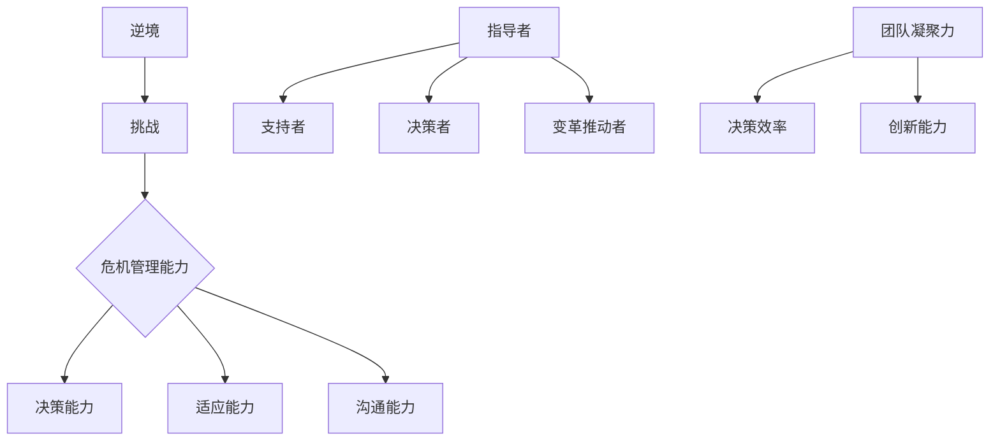

                 

## 引言

### 1.1 问题的提出

在当今快速变化的商业环境中，领导者面临着前所未有的挑战。经济全球化的加剧和技术的快速变革使得企业运营环境变得高度不确定，竞争愈发激烈。在这样的背景下，领导者不仅要维持团队的士气，还需要在压力之下做出快速而准确的决策。

#### 1.1.1 商业环境的快速变化
- **经济全球化加剧竞争**：全球市场的开放使得企业面临来自世界各地的竞争对手，这不仅增加了市场竞争的激烈程度，也要求企业领导者具备更广阔的视野和更高的管理能力。
- **技术变革带来的不确定性**：信息技术的迅猛发展，尤其是人工智能、大数据、云计算等新兴技术的广泛应用，对企业运营模式和管理方法提出了新的要求。技术的不确定性和快速迭代使得领导者必须具备前瞻性和适应性。

#### 1.1.2 领导者在逆境中的挑战
- **如何维持团队士气**：在逆境中，员工的情绪容易受到影响，领导者需要通过有效的沟通和激励来保持团队的士气和凝聚力。
- **如何快速做出正确决策**：逆境往往要求领导者能够快速分析局势，做出决策。这需要领导者具备敏锐的洞察力和果断的决策能力。

#### 1.1.3 逆境领导的重要性
- **企业生存的关键**：在逆境中，企业的生存和发展往往依赖于领导者的决策和行动。有效的逆境领导能够帮助企业找到出路，实现生存和增长。
- **领导者的成长契机**：逆境也是一个学习和成长的机会。通过应对逆境，领导者可以提升自身的管理能力，增强决策能力和领导力。

### 1.2 逆境领导学的意义

#### 1.2.1 逆境领导学的基本概念
- **逆境领导**：逆境领导是指在困难或不利环境中，领导者通过有效的策略和行动，引导团队克服挑战、实现目标的过程。
- **转危为机**：转危为机是指将逆境转化为机遇，通过积极的应对和调整，从危机中寻找机会和增长点。

#### 1.2.2 逆境领导学的研究价值
- **提高企业竞争力**：逆境领导学的研究可以帮助企业领导者更好地应对逆境，提升企业的竞争力和生存能力。
- **促进领导者个人成长**：通过研究和实践逆境领导学，领导者可以加深对管理原则和领导艺术的理解，提升自身的领导能力和职业素养。

#### 1.2.3 逆境领导学的应用领域
- **企业管理**：在企业管理中，逆境领导学可以指导领导者如何应对市场变化、技术挑战和内部困难，实现企业的稳定和发展。
- **公共事务管理**：在公共事务管理中，逆境领导学可以帮助政府部门和公共服务机构应对突发事件和危机，提升公共管理的效率和质量。
- **社会组织领导**：在非营利组织和社会组织中，逆境领导学可以帮助领导者应对资源短缺、政策变化和社会动荡等挑战，实现组织的目标和使命。

### 1.3 研究方法与框架

#### 1.3.1 研究方法
- **实证研究**：通过收集和分析实际案例和数据，验证逆境领导学的理论和效果。
- **案例分析**：选取具有代表性的案例，深入分析领导者如何在不同逆境中采取有效策略。
- **定性研究**：通过深度访谈和问卷调查等方法，了解领导者的内心体验和实际行为。

#### 1.3.2 研究框架
- **理论基础**：介绍领导理论的发展历程和主要流派，为后续的案例分析提供理论支撑。
- **案例解析**：分析不同类型逆境中的领导实践，总结成功经验和失败教训。
- **策略与方法**：提供具体的逆境领导策略和方法，指导实际操作。
- **个人成长**：探讨领导者在逆境中的个人成长路径和关键能力。

通过上述的引言部分，我们为整篇文章奠定了基调，明确了研究的背景、意义和应用领域，同时也为后续章节的内容提供了框架和指导。在接下来的章节中，我们将进一步深入探讨逆境领导学的理论基础、实战案例、策略和方法，以及领导者的个人成长路径。让我们一步一步地思考，逐步展开对逆境领导学的全面分析。让我们开始深入探讨吧！## 逆境领导的理论基础

### 第2章 领导理论的发展

#### 2.1 领导理论的起源

领导理论的发展经历了多个阶段，从最初的经典领导理论，到行为领导理论，再到后来的权变领导和现代领导理论。每一个阶段都对领导学的发展产生了深远的影响。

#### 2.1.1 经典领导理论

经典领导理论主要关注领导者的个人特质和能力。这类理论认为，领导者的某些特质如智慧、决断力、自信等是天生的，并且这些特质是领导者成功的关键。代表人物包括托马斯·霍普和费利普·希思。他们提出了一些著名的领导特质模型，例如“伟大领袖特质模型”和“决策风格模型”。

#### 2.1.2 行为领导理论

行为领导理论则从领导者的行为出发，研究领导者的行为模式对团队绩效的影响。这类理论认为，领导者的行为可以分为任务导向行为和关系导向行为。代表人物包括道格拉斯·麦克格雷格和弗雷德·卢森斯。麦克格雷格提出了“X理论和Y理论”，分别代表了权威型和参与型领导风格。卢森斯则提出了“领导行为四维度模型”，包括指导行为、支持行为、参与行为和成就导向行为。

#### 2.1.3 权变领导理论

权变领导理论认为，领导行为的效果取决于领导者的行为与情境之间的互动。代表人物包括费雷德里克·赫塞和肯尼斯·布兰查德。他们提出了“情境领导理论”，认为领导者的行为应该根据员工的成熟度进行调整。领导者的行为可以是指导型、支持型、参与型或委托型，具体取决于员工的成熟度。

#### 2.1.4 现代领导理论的发展

现代领导理论的发展体现在对领导行为的深层次理解上，包括对领导心理、领导伦理和领导变革的关注。现代领导理论强调领导者的内在素养和领导艺术，提出了一些新的领导概念，如共生领导、整合性领导和情境领导。

**共生领导**认为，领导者与追随者之间的关系应该是相互依存和协作的。领导者不仅要指导团队，还要与团队成员建立深厚的信任关系，共同实现目标。

**整合性领导**强调领导者的多元视角和综合能力。领导者需要具备跨学科的知识和技能，能够在复杂环境中进行有效的决策和领导。

**情境领导**认为，领导者的行为应该根据具体情境进行调整，以实现最佳效果。领导者需要具备灵活的领导风格，能够根据不同情境和团队成员的特点，采取不同的领导策略。

#### 2.1.5 领导理论的发展趋势

随着社会和科技的不断发展，领导理论也在不断演变。未来领导理论的发展趋势可能包括以下几个方面：

1. **数字化转型**：在数字化时代，领导者需要具备数字化思维和能力，能够引领企业进行数字化转型。
2. **全球视野**：全球化使得企业领导者需要具备跨文化的领导能力，能够管理多元化的团队。
3. **伦理领导**：随着社会对道德和伦理的关注日益增加，领导者需要具备高尚的道德品质，能够在商业实践中坚守伦理底线。
4. **可持续发展**：领导者需要关注企业的长期发展，推动可持续发展，实现经济、社会和环境的和谐共处。

通过上述对领导理论发展的分析，我们可以看到，领导理论从经典到现代，从个人特质到情境互动，从行为模式到心理和伦理，经历了不断的演进和完善。这些理论为我们理解领导行为、提升领导能力提供了宝贵的启示和指导。在接下来的章节中，我们将进一步探讨逆境与挑战的定义，以及逆境领导的核心概念，为深入理解逆境领导学打下基础。

### 第2章 逆境与挑战的定义

#### 2.2 逆境的定义

逆境，是指企业在运营过程中遭遇的各种不利环境、困难和挑战。这些逆境可能是外部的，如市场变化、经济衰退、政策调整；也可能是内部的，如管理不善、资源短缺、技术创新失败等。逆境的特点主要体现在以下几个方面：

- **不确定性**：逆境往往伴随着高度的不确定性，领导者难以准确预测和应对未来的变化。
- **复杂性**：逆境问题往往涉及多个方面，需要领导者综合考虑各种因素，进行复杂决策。
- **动态性**：逆境是一个动态变化的过程，领导者需要持续调整策略和行动，以应对不断变化的环境。

#### 2.2.1 逆境的特征

1. **环境变化快**：在快速变化的环境中，企业面临的外部压力增大，市场需求的快速变化、技术的迅猛发展，使得企业难以保持原有的竞争优势。
2. **资源限制**：逆境中，企业可能面临资源限制，如资金不足、人力短缺、技术瓶颈等，这些限制会显著影响企业的运营和发展。
3. **决策难度大**：在逆境中，领导者需要做出迅速而准确的决策，但高度不确定性和复杂性使得决策难度大大增加。

#### 2.2.2 逆境的影响

1. **团队士气受挫**：逆境往往会导致员工士气低落，失去信心，影响团队的工作效率和协作能力。
2. **企业经营风险增加**：逆境中的不确定性使得企业的经营风险增加，可能面临倒闭、破产等危机。
3. **领导者压力增大**：领导者需要承担更多的责任和压力，需要在压力下保持冷静和果断，做出正确的决策。

#### 2.2.3 挑战的定义

挑战，是指企业在逆境中需要应对的各种问题或难题。挑战的种类多样，可以是市场挑战、技术挑战、管理挑战，也可以是人力资源挑战等。挑战的特征主要体现在以下几个方面：

- **复杂性**：挑战往往涉及多个方面，需要综合考虑各种因素，进行多维度分析。
- **紧迫性**：挑战通常具有紧迫性，需要领导者迅速采取行动，否则可能错失机会或导致更大的损失。
- **不确定性**：挑战的结果具有高度不确定性，领导者难以准确预测和掌控挑战的发展。

#### 2.2.4 挑战的种类

1. **市场挑战**：市场环境的变化对企业提出新的要求，如市场需求的变化、竞争加剧等，企业需要调整市场策略以应对这些挑战。
2. **技术挑战**：技术的快速发展和创新对企业提出了新的要求，如技术创新、技术更新等，企业需要具备强大的技术实力以保持竞争力。
3. **管理挑战**：管理问题如组织结构、人力资源管理、财务管理等，都可能成为企业面临的挑战，需要领导者进行有效的管理和调整。
4. **人力资源挑战**：人力资源是企业最宝贵的资产，如何吸引、培养和留住人才是企业需要面对的重要挑战。

#### 2.2.5 逆境与挑战的关系

1. **逆境中挑战的应对**：逆境中的挑战需要领导者具备敏锐的洞察力和果断的决策能力。领导者需要快速识别挑战，制定有效的应对策略，以减轻逆境对企业的影响。
2. **挑战对逆境的影响**：挑战的存在和应对过程会对逆境的走向产生重要影响。有效的挑战应对可以缓解逆境，甚至转化为机遇；而挑战应对不当可能会导致逆境进一步恶化。

通过上述对逆境与挑战的定义和特征分析，我们可以看到，逆境和挑战是企业运营中不可避免的一部分。领导者需要具备应对逆境和挑战的能力，才能在复杂多变的环境中保持企业的生存和发展。在接下来的章节中，我们将进一步探讨逆境领导的核心概念，以及这些概念在实践中的应用。这将帮助我们更好地理解如何在逆境中实现有效的领导，转危为机，实现企业的持续发展。

### 第2章 逆境领导的核心概念

#### 2.3 逆境领导的概念

逆境领导是指在面临各种不利环境和挑战时，领导者通过一系列有效的策略和行动，引导团队克服困难，实现组织目标的过程。逆境领导不仅需要领导者具备坚定的意志和卓越的领导能力，还需要具备敏锐的洞察力和灵活的应变能力。

#### 2.3.1 逆境领导的特点

1. **危机管理能力**：逆境领导要求领导者具备危机管理能力，能够在突发事件和紧急情况下迅速做出反应，制定有效的应对策略。
2. **决策能力**：逆境领导要求领导者具备果断的决策能力，能够在不确定性和复杂性的环境中做出准确判断，采取合适的行动。
3. **适应能力**：逆境领导要求领导者具备适应能力，能够根据环境变化和挑战的性质，灵活调整领导策略和行动。
4. **沟通能力**：逆境领导要求领导者具备良好的沟通能力，能够与团队成员保持有效沟通，传达愿景和目标，增强团队的凝聚力。

#### 2.3.2 逆境领导者的角色

1. **指导者**：逆境领导者作为指导者，需要为团队提供明确的方向和目标，帮助团队成员理解挑战和机遇，激发他们的潜力。
2. **支持者**：逆境领导者作为支持者，需要关心团队成员的感受和需求，提供必要的支持和资源，帮助他们克服困难。
3. **决策者**：逆境领导者作为决策者，需要在不确定和复杂的环境中做出快速而准确的决策，确保团队行动的一致性和有效性。
4. **变革推动者**：逆境领导者作为变革推动者，需要推动组织进行必要的变革，以适应环境变化和挑战的要求。

#### 2.3.3 逆境领导的效果

1. **团队凝聚力**：逆境领导能够增强团队的凝聚力，通过共同面对挑战，团队成员之间的信任和合作得以加强。
2. **决策效率**：逆境领导能够提高决策效率，通过明确的目标和有效的沟通，领导者可以快速获取信息，做出准确判断，采取行动。
3. **创新能力**：逆境领导能够激发团队的创新能力，通过面对挑战，团队成员可以发掘新的解决方案，推动组织的技术创新和管理创新。

#### 2.3.4 核心概念联系图

为了更好地理解逆境领导的核心概念，我们可以通过一个Mermaid流程图来展示这些概念之间的关系。

通过这个联系图，我们可以清晰地看到逆境领导的核心概念如何相互联系和作用。危机管理能力、决策能力、适应能力和沟通能力是逆境领导的基础，这些能力共同作用于团队凝聚力、决策效率和创新能力，从而实现逆境领导的目标。

通过上述对逆境领导核心概念的分析，我们可以看到，逆境领导不仅是一种管理技能，更是一种领导艺术。领导者需要通过不断的实践和学习，提升自身的领导能力，才能在逆境中实现有效的领导，带领团队实现目标。在接下来的章节中，我们将通过具体的实战案例，进一步探讨逆境领导在实际中的应用和效果。这将帮助我们更好地理解逆境领导的核心概念，并为其在实际中的应用提供指导和借鉴。

### 第2章 逆境领导的核心概念（续）

#### 2.3.4 核心概念联系图

为了更好地理解逆境领导的核心概念，我们可以通过一个Mermaid流程图来展示这些概念之间的关系。

通过这个联系图，我们可以清晰地看到逆境领导的核心概念如何相互联系和作用。危机管理能力、决策能力、适应能力和沟通能力是逆境领导的基础，这些能力共同作用于团队凝聚力、决策效率和创新能力，从而实现逆境领导的目标。

#### 2.3.5 逆境领导的理论基础

逆境领导学的理论基础可以追溯到多个领导理论和心理学理论，以下是对这些理论的核心观点和它们在逆境领导中的应用的概述：

1. **情境领导理论**：由赫塞和布兰查德提出，强调领导者的行为应该根据员工的成熟度进行调整。在逆境中，领导者需要根据环境变化快速调整自己的领导风格，从指导型转变为支持型或参与型，以应对不同类型的挑战。

2. **路径—目标理论**：由罗伯特·豪斯提出，认为领导者的任务是设定清晰的目标，并帮助下属找到实现目标的路径。在逆境中，领导者需要明确团队的目标，提供必要的支持和资源，帮助下属克服困难。

3. **服务型领导理论**：由特雷西和帕特森提出，强调领导者应该关注团队成员的需求和成长。在逆境中，领导者需要更多地扮演支持者和指导者的角色，关心团队成员的情感和心理状态，提供必要的帮助。

4. **变革型领导理论**：由伯恩斯提出，认为领导者的作用是激发团队成员的内在动力，推动组织进行变革。在逆境中，领导者需要激发团队成员的积极性和创造力，推动组织适应新的环境和挑战。

5. **心理资本理论**：由塞尔吉奥·冈萨雷斯-马奇和安格斯·哈克提出，认为领导者的角色是培养团队成员的心理资本，包括希望、乐观、自我效能和韧性。在逆境中，领导者需要通过激励和培训，提升团队成员的心理资本，增强他们的逆境应对能力。

#### 2.3.6 核心概念应用案例

为了更直观地理解这些核心概念，我们可以通过一个实际案例来展示它们在逆境领导中的应用。

**案例背景**：某科技公司在全球经济衰退期间，面临市场需求下降、研发资金不足等挑战。公司领导层决定通过变革和调整来应对这些挑战。

**案例步骤**：

1. **危机管理能力**：公司CEO首先评估了公司面临的危机，确定了优先解决的关键问题，如削减成本、优化研发流程和开拓新市场。

2. **决策能力**：CEO迅速做出决策，关闭了成本高但利润低的业务线，同时加大对有潜力的新产品的研发投入。

3. **适应能力**：CEO意识到市场需求的变化，决定调整公司的市场策略，从原有的高端市场转向中低端市场，以满足更广泛的市场需求。

4. **沟通能力**：CEO通过内部邮件、会议和一对一交流，向全体员工传达了公司的战略调整和应对措施，确保团队成员了解公司的方向和目标。

5. **指导者角色**：CEO作为指导者，为团队成员提供了明确的方向和支持，帮助他们适应新的工作环境和职责。

6. **支持者角色**：CEO还作为支持者，关心团队成员的感受和需求，提供心理支持和工作资源，确保他们的工作顺利进行。

7. **变革推动者角色**：CEO推动了公司内部的变革，通过培训和工作流程优化，提高了团队的整体工作效率和创新能力。

**案例结果**：通过CEO的领导和调整，公司成功度过了经济衰退期，市场需求逐步回升，公司的研发能力和市场竞争力得到了显著提升。

通过这个案例，我们可以看到逆境领导的核心概念在实际应用中的具体体现。领导者需要具备危机管理能力、决策能力、适应能力和沟通能力，同时扮演指导者、支持者和变革推动者的角色，以带领团队克服逆境，实现组织目标。

通过上述对逆境领导核心概念的理论基础和应用案例的详细探讨，我们可以更好地理解逆境领导的关键要素和实践方法。在接下来的章节中，我们将进一步通过实战案例，深入分析逆境领导在实际中的应用，为读者提供更多的实战经验和启示。让我们继续深入探讨，共同探索逆境领导学的奥秘。

### 第3章 实战案例

#### 3.1 案例一：企业逆境中的领导策略

**案例背景**：
某全球知名科技公司在经历了一段高速增长期后，突然面临市场需求下降、产品竞争力减弱、内部管理混乱等多重挑战。公司股价大幅下跌，员工士气低落，客户流失严重，公司面临破产的风险。

**领导者的应对策略**：

1. **快速诊断问题**：公司CEO在意识到问题的严重性后，迅速组织了一个由高层管理人员组成的问题诊断团队，对公司的运营状况进行了全面评估。通过深入调查，确定了市场需求变化、产品创新滞后、内部管理松散是导致公司困境的主要原因。

2. **制定短期应对计划**：CEO制定了一个为期六个月的短期应对计划，主要包括削减成本、优化研发流程、改善客户关系和提高员工士气。具体措施包括：
   - **裁员和减薪**：为了减少运营成本，公司决定裁员10%，同时实施全员减薪，以减轻财务压力。
   - **研发优先级调整**：CEO重新评估了公司的产品线，将研发资源集中在最具市场潜力的产品上，同时加快新产品的上市速度。
   - **客户关系管理**：公司加强了客户关系管理，通过提高客户服务和响应速度，努力挽回流失的客户。

3. **中长期战略规划**：在短期应对计划的基础上，CEO制定了一个中长期战略规划，旨在提升公司的核心竞争力。具体措施包括：
   - **技术创新**：加大研发投入，推动技术自主创新，开发具有竞争力的新产品。
   - **市场拓展**：开拓新的市场，特别是新兴市场，以分散市场风险。
   - **人才培养**：实施人才发展计划，提升员工的技能和素质，建立一支高素质的团队。

4. **领导者的角色转变**：CEO在应对公司困境的过程中，角色从管理者转变为领导者。他通过沟通、激励和指导，增强团队的凝聚力，提升员工的工作积极性。同时，他积极倾听员工意见，鼓励创新思维，推动公司内部的变革。

**案例结果**：

经过CEO的一系列应对措施，公司在短期内实现了财务状况的稳定，员工士气有所提升，客户关系得到改善。中长期战略规划的实施，逐步提升了公司的核心竞争力。两年后，公司股价回升，市场竞争力显著增强，成功度过了危机。

**案例启示**：

1. **及时诊断问题**：在逆境中，领导者需要迅速诊断问题，找出根本原因，才能制定有效的应对策略。
2. **短期与中长期策略相结合**：短期应对措施可以缓解危机，中长期战略规划则可以为企业的长期发展提供方向和保障。
3. **领导者的角色转变**：领导者需要在逆境中扮演指导者、支持者和变革推动者的角色，通过有效的沟通和激励，带领团队走出困境。

#### 3.2 案例二：公共危机中的领导艺术

**案例背景**：
某国政府在一次重大自然灾害后，面临着严重的公共危机。灾害导致大量人口伤亡，基础设施严重破坏，救援物资短缺，社会秩序混乱。政府需要在极短的时间内做出反应，组织有效的救援和重建工作。

**领导者的应对策略**：

1. **紧急动员**：政府领导人立即召开紧急会议，动员所有相关部门和资源，成立灾害应急指挥部，确保救援工作的有序进行。

2. **信息透明**：政府通过媒体向公众发布灾情信息，及时公布救援进展，回应民众关切，维护社会稳定。

3. **协调资源**：政府协调军队、医疗队伍、志愿者组织等各方力量，确保救援物资和人力得到合理分配和充分利用。

4. **心理疏导**：政府组织心理援助团队，对受灾群众进行心理疏导，缓解他们的情绪压力。

5. **灾后重建**：政府制定灾后重建规划，确保灾区的住房、医疗、教育等基本生活条件尽快恢复。

**案例结果**：

通过政府的一系列应对措施，救援工作有序开展，灾区的基本生活秩序逐渐恢复。政府的高效领导和应急反应，赢得了民众的信任和支持，为国家社会稳定和经济恢复奠定了基础。

**案例启示**：

1. **紧急动员和快速响应**：在公共危机中，领导者需要迅速做出反应，组织有效的救援和重建工作，确保受灾群众的基本生活得到保障。
2. **信息透明和沟通**：及时公开信息，加强与民众的沟通，是维护社会稳定的重要手段。
3. **协调资源**：充分利用各种资源，实现资源的合理配置和有效利用，是危机应对的关键。
4. **心理疏导**：关注受灾群众的心理健康，提供心理支持和援助，是恢复社会秩序和重建家园的重要环节。

#### 3.3 案例三：社会动荡中的领导力展现

**案例背景**：
某国在经历了一场政治动荡后，社会秩序严重混乱，抗议活动频发，政府权威受到严重挑战。政府需要在动荡中稳定局势，恢复社会秩序。

**领导者的应对策略**：

1. **稳定局势**：政府领导人通过公开演讲和媒体沟通，呼吁民众保持冷静，避免暴力冲突，同时承诺通过改革解决民众的诉求。

2. **改革承诺**：政府宣布一系列改革措施，包括加强民主监督、提高政府透明度、改善民生等，以争取民众的支持。

3. **强化治安**：政府加强治安力量，确保社会秩序的稳定，同时加强对抗议活动的管理和控制。

4. **法律措施**：政府依法打击暴力犯罪和非法集会，维护社会秩序。

5. **经济支持**：政府提供经济援助，帮助受影响的企业和个人渡过难关，稳定经济环境。

**案例结果**：

通过政府的一系列措施，社会秩序逐步恢复，抗议活动减少，民众对政府的信任度有所提高。政府的改革承诺和行动，为国家的长期稳定和发展奠定了基础。

**案例启示**：

1. **稳定局势**：在动荡中，领导者需要迅速稳定局势，采取有效的措施防止暴力冲突和社会动荡的进一步恶化。
2. **改革承诺**：通过改革解决民众的诉求，是赢得民众支持的重要手段。
3. **强化治安**：加强治安力量，维护社会秩序，是恢复社会稳定的关键。
4. **法律措施**：依法打击犯罪和非法活动，维护社会秩序和法律的尊严。
5. **经济支持**：提供经济援助，帮助受影响的企业和个人渡过难关，是恢复经济和社会稳定的重要措施。

通过以上三个实战案例的分析，我们可以看到，在不同的逆境环境中，领导者需要采取不同的策略和行动。无论是企业中的逆境，还是公共危机或社会动荡，有效的领导都是解决问题的关键。在接下来的章节中，我们将进一步探讨如何具体实施逆境领导策略，以及领导者如何在逆境中实现个人成长。让我们继续深入探讨，共同探索逆境领导学的真谛。

### 第4章 转危为机的策略

#### 4.1 逆境识别与评估

在逆境中，领导者首先需要识别和评估当前所处的环境，以便制定有效的应对策略。以下是一系列步骤和工具，帮助领导者进行逆境识别与评估：

##### 4.1.1 逆境识别

1. **数据收集**：收集企业内外部的数据，如市场报告、财务报表、员工反馈等，以了解当前的经营状况和潜在风险。
2. **环境分析**：通过PESTLE（政治、经济、社会、技术、法律、环境）分析，了解外部环境的变化对企业可能带来的影响。
3. **SWOT分析**：对企业的优势（Strengths）、劣势（Weaknesses）、机会（Opportunities）和威胁（Threats）进行评估，识别企业面临的内外部挑战。
4. **关键问题识别**：通过头脑风暴或访谈，识别企业当前面临的主要问题和挑战。

##### 4.1.2 逆境评估

1. **影响评估**：对识别出的关键问题进行影响评估，确定每个问题对企业的长期和短期影响，以及可能的损失。
2. **优先级排序**：根据问题的严重程度和紧急程度，对问题进行优先级排序，确定哪些问题需要优先解决。
3. **资源评估**：评估企业当前可用的资源，包括财务资源、人力资源、技术资源等，以便制定合适的应对策略。

#### 4.2 转危为机的具体策略

一旦识别和评估了逆境，领导者需要制定具体的策略，将危机转化为机遇。以下是一些常见的策略：

##### 4.2.1 快速反应

1. **建立危机管理团队**：快速组建一个由关键部门和人员组成的危机管理团队，负责协调和指挥应对措施。
2. **制定应急预案**：制定详细的应急预案，包括危机响应流程、职责分配、应急资源调配等，确保在危机发生时能够迅速行动。
3. **快速决策**：在危机发生时，领导者需要迅速做出决策，采取紧急措施，以减轻危机的影响。

##### 4.2.2 调整战略方向

1. **市场定位调整**：根据市场变化，重新定位产品和服务，开拓新的市场领域。
2. **业务模式创新**：探索新的商业模式，如在线销售、合作经营等，以适应新的市场环境。
3. **产品和服务创新**：通过技术创新，开发新产品或改进现有产品，以提升市场竞争力。

##### 4.2.3 增强团队凝聚力

1. **沟通与激励**：通过定期的沟通和激励，增强团队成员的信心和士气，提高团队协作效率。
2. **培训与发展**：提供培训和发展机会，提升团队成员的技能和素质，增强团队的整体能力。
3. **企业文化建设**：塑造积极向上的企业文化，增强团队的凝聚力和归属感。

##### 4.2.4 拓展资源渠道

1. **内部资源优化**：通过内部资源重组和优化，提高资源利用效率，降低运营成本。
2. **外部资源整合**：与外部合作伙伴建立合作关系，共同应对危机，共享资源和信息。
3. **资金筹集**：通过多种途径筹集资金，如申请政府补贴、银行贷款、发行债券等，以支持企业的发展。

#### 4.3 策略实施的挑战与应对

在实际实施策略的过程中，领导者可能会遇到各种挑战，以下是一些常见的挑战及应对策略：

##### 4.3.1 挑战

1. **资源不足**：企业在应对危机时，可能面临资金、人力和技术等资源不足的问题。
2. **员工士气低落**：危机带来的压力和不确定性可能导致员工士气低落，影响工作效率。
3. **信息不透明**：在危机中，信息的不透明可能导致决策失误和行动不及时。
4. **法律和合规问题**：在应对危机时，企业需要遵守各种法律法规，避免违法行为。

##### 4.3.2 应对策略

1. **资源优化**：通过内部资源重组和外部资源整合，提高资源利用效率，确保关键资源得到优先保障。
2. **员工激励**：通过激励措施，如奖励、培训和发展机会，提高员工的工作积极性和士气。
3. **信息透明**：建立透明的信息沟通机制，确保信息的及时传递和公开，避免信息不对称和决策失误。
4. **法律合规**：在制定和实施策略时，严格遵守法律法规，确保企业的行为合法合规。

通过上述的转危为机策略，领导者可以在逆境中找到机遇，带领企业走出困境。在接下来的章节中，我们将探讨领导者在逆境中的个人成长路径，以及如何通过个人成长来提升领导能力。让我们继续深入探讨，共同探索逆境领导学的真谛。

### 第5章 领导者的个人成长

#### 5.1 领导者的自我认知

自我认知是领导者成长的第一步，也是最重要的一步。只有深入了解自己，领导者才能更好地应对逆境，发挥自己的潜力。

##### 5.1.1 自我认知的重要性

1. **认识自己的优点和不足**：领导者需要清楚地了解自己的优点和不足，这样可以在优势领域发挥更大的作用，同时积极改进自己的不足。
2. **提高自我效能**：通过自我认知，领导者可以增强自我效能感，即相信自己能够应对各种挑战，从而在面对逆境时更加自信和果断。

##### 5.1.2 自我认知的方法

1. **反思和总结**：通过反思过去的经历和总结经验，领导者可以更好地了解自己的行为和决策，识别成功和失败的根源。
2. **反馈和评估**：获取他人的反馈和评估，可以帮助领导者从不同的角度了解自己，发现潜在的问题和改进空间。
3. **心理测试和评估工具**：使用专业的心理测试和评估工具，如MBTI、DISC等，可以帮助领导者了解自己的个性特征和领导风格。

#### 5.2 领导者的情感管理

在逆境中，领导者需要具备良好的情感管理能力，以保持冷静和理智，同时激励和引导团队成员。

##### 5.2.1 情感管理的重要性

1. **应对压力**：逆境往往伴随着高度的压力，领导者需要通过有效的情感管理来应对压力，保持心理平衡。
2. **激励团队**：领导者需要通过情感管理，传达积极的信息和情感，激励团队成员克服困难，共同面对挑战。

##### 5.2.2 情感管理的方法

1. **自我情绪调节**：领导者可以通过冥想、运动、呼吸练习等方式，调节自己的情绪，保持冷静和理智。
2. **倾听和同理**：领导者需要倾听团队成员的感受和需求，表现出同理心，帮助他们缓解压力和不安。
3. **积极沟通**：通过积极的沟通，领导者可以传达信心和决心，增强团队的凝聚力和士气。

#### 5.3 领导者的持续成长

领导者的成长是一个持续的过程，需要不断学习和实践，以适应不断变化的环境和挑战。

##### 5.3.1 持续成长的重要性

1. **适应变化**：环境和技术的发展速度非常快，领导者需要持续学习，以适应新的变化和挑战。
2. **提升能力**：通过持续的学习和实践，领导者可以不断提升自己的管理能力和领导艺术，更好地应对各种逆境。

##### 5.3.2 持续成长的方法

1. **阅读和学习**：通过阅读专业书籍、参加培训课程和研讨会，领导者可以获取最新的知识和理论，提升自己的认知水平。
2. **实践和应用**：将学到的知识和理论应用到实际工作中，通过实践来检验和提升自己的能力。
3. **反思和总结**：通过定期反思和总结，领导者可以发现自己的不足和改进的方向，不断优化自己的领导方法和策略。

通过自我认知、情感管理和持续成长，领导者可以在逆境中不断成长和提升，带领团队走出困境，实现组织的长远发展。在接下来的章节中，我们将对全书内容进行总结，并探讨未来的研究方向。让我们继续深入探讨，共同探索逆境领导学的真谛。

### 第6章 总结与展望

#### 6.1 全书总结

本书围绕《逆境领导学：转危为机的管理智慧》这一主题，系统地探讨了逆境领导的理论基础、实战案例、转危为机的策略以及领导者的个人成长路径。通过以下关键点，我们可以对全书内容进行简要总结：

1. **背景与意义**：随着商业环境的不确定性和复杂性增加，领导者面临越来越多的挑战。逆境领导学提供了在困难环境中进行有效领导和管理的方法和策略，具有重要的现实意义。
2. **理论基础**：本书回顾了领导理论的发展历程，从经典领导理论到现代领导理论，探讨了领导行为与情境互动的关系，为理解逆境领导提供了理论基础。
3. **实战案例**：通过分析企业逆境中的领导策略、公共危机中的领导艺术以及社会动荡中的领导力展现，展示了逆境领导在现实中的应用和效果。
4. **转危为机的策略**：提出了逆境识别与评估的方法，以及具体实施转危为机策略的步骤，帮助领导者将危机转化为机遇。
5. **领导者的个人成长**：探讨了领导者的自我认知、情感管理和持续成长的重要性，为领导者在逆境中的个人成长提供了指导。

#### 6.2 展望未来

尽管本书为逆境领导学提供了系统的分析和指导，但这一领域仍然存在许多值得进一步研究和探索的方向：

1. **跨文化领导**：在全球化背景下，跨文化领导的重要性日益凸显。未来研究可以探讨如何在不同文化背景下进行有效的逆境领导。
2. **数字领导**：随着数字化转型的推进，领导者需要具备数字领导能力，以应对数字化环境中的挑战。未来的研究可以聚焦于数字领导理论和实践。
3. **可持续领导**：在可持续发展的趋势下，领导者需要关注企业的长期发展，推动可持续发展。未来的研究可以探讨如何在逆境中实现可持续领导。
4. **技术创新**：技术发展对领导行为和领导力提出了新的要求。未来的研究可以探讨如何利用技术创新来提升领导能力和管理效率。
5. **实证研究**：虽然本书包含了一些案例分析，但实证研究仍然不足。未来的研究可以通过大规模的实证研究，进一步验证和丰富逆境领导学的理论和实践。

通过不断的研究和探索，我们期待逆境领导学能够为领导者提供更全面、更深入的指导，帮助他们在复杂多变的商业环境中实现成功。让我们一起期待未来，继续探索逆境领导学的无限可能。

