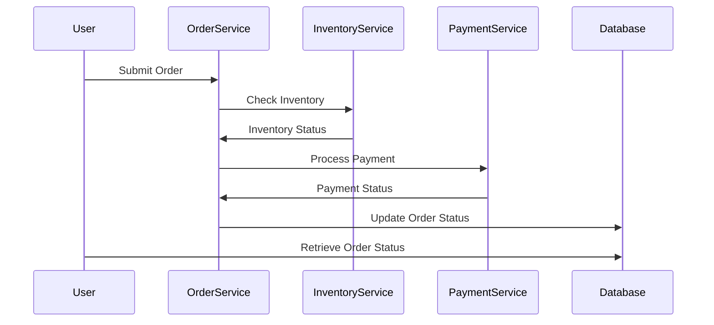

                 

### 第一部分：逆境中的领导力基础

#### 第1章：问题背景与领导力挑战

### 1.1 逆境的定义与特点

逆境，通常指的是个体或组织在实现目标过程中遭遇的困难和挑战。这些挑战可能来源于外部环境的变化，如市场竞争加剧、经济衰退、法律法规限制等；也可能是内部因素的挑战，如组织变革、技术迭代、团队冲突等。逆境具有以下几个显著特点：

1. **不确定性**：逆境中的许多因素是不可预测的，这使得决策和应对变得更加复杂。
2. **压力**：逆境会带来各种形式的压力，包括心理压力、时间压力和资源压力。
3. **持久性**：逆境往往不是短暂的，而是需要长期应对和适应的过程。
4. **影响广泛**：逆境不仅影响个体的情绪和表现，还会对组织的运营、业绩和未来发展产生深远影响。

### 1.2 逆境对组织和个人的影响

逆境对组织和个人的影响是深远且多方面的：

- **组织层面**：逆境可能导致以下影响：
  - **资源消耗**：需要更多的资源来应对挑战，可能导致资源短缺。
  - **组织士气下降**：逆境可能导致员工士气低落，影响团队协作和效率。
  - **战略调整**：可能需要重新审视和调整组织的战略方向。

- **个人层面**：逆境可能对个人产生以下影响：
  - **心理健康问题**：长期的逆境可能导致焦虑、抑郁等心理健康问题。
  - **技能提升**：逆境也可能成为个人成长的催化剂，促使个体学习新技能、提升自我能力。
  - **职业发展受阻**：逆境可能会影响个人的职业发展，特别是当逆境导致组织业绩下滑时。

### 1.3 领导力的本质与内涵

领导力是指引导和影响他人实现目标的能力。领导力不仅包括领导者的行为，还涉及领导者的思维方式和价值观。在逆境中，领导力的内涵更加丰富，主要体现在以下几个方面：

- **激励与鼓舞**：领导者需要激发团队的积极性和创造力，保持团队的士气。
- **决策与策略**：在逆境中，领导者需要快速做出明智的决策，并制定有效的应对策略。
- **沟通与协作**：领导者需要有效地沟通，建立良好的团队协作关系，共同面对挑战。
- **心理支持**：领导者需要给予团队成员心理支持，帮助他们应对逆境带来的压力。

### 1.4 逆境中的领导力需求

在逆境中，领导力需求更加突出，主要体现在以下几个方面：

- **战略思维**：领导者需要具备长远眼光，制定适应逆境的战略规划。
- **适应能力**：领导者需要能够快速适应环境变化，调整策略和行动。
- **情感智力**：领导者需要具备较高的情感智力，理解团队成员的情绪和心理状态。
- **团队合作**：领导者需要建立强大的团队，共同应对挑战。

通过以上分析，我们可以看出，逆境中的领导力不仅是一种能力，更是一种思维方式和生活态度。在接下来的章节中，我们将深入探讨逆境领导力的核心概念、模型及其应用，帮助读者在逆境中更好地发挥领导力，引领团队走向成功。

#### 第2章：核心概念与联系

### 2.1 逆境领导力的原理

#### 2.1.1 逆境领导力的核心概念

逆境领导力是指领导者在面对困难和挑战时，能够保持清晰的思维，做出明智的决策，并激发团队的积极性和创造力，带领团队克服逆境，实现组织目标的能力。核心概念包括以下几个方面：

1. **适应性思维**：逆境领导力要求领导者具备快速适应环境变化的能力，能够在不确定性中保持冷静和理性。
2. **决策智慧**：领导者需要在压力下做出合理的决策，并能够预见到决策的长期影响。
3. **团队激励**：领导者需要具备激发团队潜力、提高团队士气的技巧，使团队在逆境中保持高昂的斗志。
4. **心理支持**：领导者需要关注团队成员的心理健康，提供必要的情感支持，帮助团队度过难关。

#### 2.1.2 逆境领导力的属性特征对比表格

为了更直观地了解逆境领导力的特征，我们将其与常规领导力进行比较：

| 特征               | 逆境领导力                  | 常规领导力                  |
|------------------|-------------------------|-------------------------|
| **适应性**          | 快速适应环境变化            | 适应稳定的环境条件            |
| **决策**             | 高压下的明智决策            | 稳健的决策过程                |
| **激励**             | 激发团队潜能、提高士气        | 增强团队凝聚力、提升工作效率    |
| **心理支持**          | 关心团队成员的心理健康        | 营造积极的工作氛围            |
| **抗压能力**          | 高度抗压、坚韧不拔            | 基本抗压、稳定应对            |

#### 2.2 领导力与逆境的关系

领导力与逆境之间存在着密切的关系，二者相辅相成。逆境可以检验领导力，而有效的领导力则能够在逆境中发挥关键作用。

1. **逆境是领导力检验场**：逆境往往暴露出领导者的真实能力和素质。在逆境中，领导者需要展示出卓越的决策能力、适应能力和心理素质。
2. **领导力是逆境应对利器**：有效的领导力可以帮助组织和个人在逆境中找到应对策略，保持积极心态，从而减轻逆境带来的负面影响。
3. **互动影响**：逆境中的领导力不仅影响团队成员的表现，也会受到团队成员反馈的影响。领导者需要通过不断调整自己的领导方式，与团队成员共同应对逆境。

通过以上分析，我们可以看到，逆境领导力不仅是一种能力，更是一种策略和思维方式。在接下来的章节中，我们将深入探讨逆境领导力模型，帮助读者更好地理解和应用这一领导力形式。

#### 第3章：逆境领导力模型

### 3.1 逆境领导力模型的构成

逆境领导力模型是帮助领导者更好地应对逆境的理论框架。这个模型由几个关键要素构成，每个要素都在逆境领导中扮演着重要角色。

#### 3.1.1 模型的基础框架

逆境领导力模型的基础框架可以概括为四个核心要素：心态调整、策略规划、团队建设和沟通技巧。这四个要素相互关联，共同构成了一个完整的领导力模型。

1. **心态调整**：这是模型的基础，领导者需要在逆境中保持积极的心态，克服恐惧和焦虑，以更加冷静和理性的方式应对挑战。
2. **策略规划**：领导者需要根据实际情况制定有效的应对策略，包括短期和长期的规划，以确保团队在逆境中能够持续前进。
3. **团队建设**：领导者需要关注团队的健康和凝聚力，通过培养团队精神、提升团队技能来增强团队应对逆境的能力。
4. **沟通技巧**：领导者需要具备出色的沟通能力，确保团队内部的信息流通和协作，以及与外部环境的良好互动。

#### 3.1.2 模型的应用场景

逆境领导力模型适用于各种逆境情境，包括但不限于：

- **经济衰退**：在经济不景气的情况下，领导者需要调整策略，保持成本控制和创新并重。
- **市场竞争激烈**：在竞争激烈的市场环境中，领导者需要通过有效的团队建设和市场策略来保持竞争优势。
- **技术变革**：在技术快速发展的时代，领导者需要具备前瞻性，引导团队不断学习新技能，以适应技术变革。
- **组织变革**：在组织变革过程中，领导者需要平衡变革与稳定，确保团队平稳过渡。

#### 3.2 模型的核心要素

以下是模型中每个核心要素的详细解释：

##### 3.2.1 领导者的心态与行为

**心态调整**是逆境领导力的核心。领导者需要在逆境中保持以下心态和行为：

- **乐观主义**：保持积极乐观的态度，相信困难是暂时的，通过努力可以克服。
- **韧性和毅力**：在逆境中保持坚韧不拔，不畏困难，坚持到底。
- **开放心态**：对变化保持开放态度，愿意接受新思想和新方法。

**行为表现**：

- **自我反思**：定期反思自己的决策和行为，及时调整。
- **积极倾听**：倾听团队成员的意见和建议，了解他们的需求和感受。

##### 3.2.2 团队成员的支持与信任

**团队建设**是逆境领导力的关键。领导者需要建立团队支持与信任体系：

- **共同目标**：明确团队目标，确保所有团队成员都朝同一方向努力。
- **技能培训**：提供必要的培训机会，提升团队成员的技能和能力。
- **团队合作**：鼓励团队合作，建立相互支持和信任的文化。

**支持与信任行为**：

- **激励与奖励**：对团队成员的成就给予及时的认可和奖励。
- **沟通渠道**：建立畅通的沟通渠道，确保信息透明和及时传达。

##### 3.2.3 策略与方法的选择

**策略规划**是领导者应对逆境的核心手段。领导者需要制定以下策略：

- **应对策略**：根据实际情况，制定应对各种挑战的具体措施。
- **长期规划**：制定明确的长期规划，确保团队在逆境中能够持续发展。

**策略与方法选择**：

- **灵活应变**：根据环境变化，灵活调整策略和行动计划。
- **创新思维**：鼓励团队成员发挥创造力，寻找创新的解决方案。

通过以上对逆境领导力模型的详细阐述，我们可以看到，逆境领导力不仅是一种能力，更是一种系统化的思维和行为模式。在接下来的章节中，我们将进一步探讨算法原理与数学模型，为读者提供更加深入的技术解析。

#### 第4章：算法原理与数学模型

### 4.1 算法原理概述

在讨论逆境领导力模型时，我们引入了算法原理与数学模型，以期为读者提供更加具体和可操作的实践指南。这一部分将简要概述算法原理，并分析其在逆境领导力中的应用。

**算法原理**是指通过一系列明确的步骤和规则，解决特定问题或执行特定任务的方法。算法的核心在于其逻辑性、确定性和效率性。在逆境领导中，算法原理可以被视为一种决策模型，它帮助领导者做出理性、科学和高效的决策。

**算法的基本流程**通常包括以下几个步骤：

1. **问题定义**：明确需要解决的问题或目标。
2. **数据收集**：收集与问题相关的数据和信息。
3. **预处理**：对数据进行清洗、整理和转换，使其适用于算法分析。
4. **算法选择**：根据问题特点选择合适的算法。
5. **模型训练**：使用训练数据对算法进行训练和优化。
6. **模型评估**：通过测试数据评估算法的准确性和性能。
7. **决策输出**：根据算法的输出结果做出决策。

**算法的优缺点分析**：

- **优点**：
  - **确定性**：算法提供明确的决策步骤，减少主观性和随机性。
  - **效率性**：算法通常具有良好的时间复杂度和空间复杂度，提高决策效率。
  - **可重复性**：算法的可重复性使得决策过程可追溯和可验证。

- **缺点**：
  - **局限性**：算法的适用范围有限，可能无法应对复杂多变的实际问题。
  - **数据依赖性**：算法的性能很大程度上依赖于数据的质量和完整性。
  - **缺乏灵活性**：算法可能无法适应快速变化的环境。

### 4.2 数学模型与公式

在逆境领导力中，数学模型可以帮助我们更深入地理解决策过程和结果。以下是几个关键的数学模型与公式：

#### 4.2.1 模型的数学描述

一个简单的决策模型可以表示为以下形式：

$$
y = f(x)
$$

其中，\(y\) 代表决策结果，\(x\) 代表输入数据，\(f\) 代表决策函数。

**决策函数的详细解释**：

- **输入数据（x）**：包括内部和外部环境因素，如市场趋势、资源状况、团队成员表现等。
- **决策结果（y）**：决策函数的输出结果，可以是具体的行动方案、策略调整或资源分配等。

#### 4.2.2 公式详解与举例

我们以一个具体的决策场景为例，详细解释公式：

假设一个领导者在面临团队士气低落的问题时，需要决定是否进行团队建设活动。决策模型可以表示为：

$$
y = f(\text{士气} \times \text{资源})
$$

其中，士气是内部环境因素，资源是外部环境因素。

**公式详解**：

- **士气（士气）**：士气是一个从0到1的数值，0表示非常低落，1表示非常高涨。
- **资源（资源）**：资源也是一个从0到1的数值，表示可用的资金、时间和其他资源。

**举例说明**：

- **士气 = 0.3，资源 = 0.8**：根据决策模型，团队建设活动的决策结果为：

$$
y = f(0.3 \times 0.8) = 0.24
$$

结果小于0.5，表示领导者倾向于不进行团队建设活动。

- **士气 = 0.6，资源 = 0.9**：根据决策模型，团队建设活动的决策结果为：

$$
y = f(0.6 \times 0.9) = 0.54
$$

结果大于0.5，表示领导者倾向于进行团队建设活动。

通过以上数学模型与公式，我们可以更加科学和系统地分析决策过程，为领导者在逆境中提供有力的支持。在下一章节中，我们将进一步探讨系统分析与架构设计，帮助读者理解如何在技术层面上实现逆境领导力。

#### 第5章：系统分析与架构设计

### 5.1 问题场景介绍

为了更好地理解逆境领导力在实践中的应用，我们将通过一个实际的问题场景进行详细分析。假设我们正在开发一个大型分布式系统，用于处理电子商务平台的订单处理和库存管理。该系统面临着以下挑战：

- **高并发访问**：电子商务平台的订单处理系统需要处理大量的用户请求，保证系统在高并发情况下依然稳定运行。
- **数据一致性**：订单处理和库存管理需要确保数据的一致性，避免因数据错误导致订单无法完成或库存不准确。
- **系统扩展性**：随着业务的发展，系统需要能够灵活扩展，以适应不断增长的数据量和用户量。

### 5.2 系统功能设计

为了解决上述问题，我们需要设计一个功能完善的系统。以下是系统的核心功能：

1. **订单处理**：接收和处理用户提交的订单，包括订单验证、库存检查、支付处理和订单状态更新等。
2. **库存管理**：实时监控库存情况，更新库存数量，处理库存不足或过剩的情况。
3. **用户管理**：管理用户信息，包括用户注册、登录、权限管理和用户行为分析等。
4. **日志记录**：记录系统操作日志，包括订单处理日志、库存变更日志和系统异常日志等，用于系统监控和故障排查。
5. **系统监控**：监控系统运行状态，包括资源利用率、性能指标和异常报警等。

#### 5.2.1 领域模型（Mermaid类图）

为了更好地设计系统，我们首先需要创建一个领域模型，如下所示：

```mermaid
classDiagram
Class01 <|-- Class02
Class03 --|allee Class04
Class05 o-- Class06
Class07 :<<interface>> InterfaceOne
Class08 :<<interface>> InterfaceTwo
Class09 {name1, name2}
Class10 :<<abstract>> AbstractClass
Class11 :<<enumeration>> EnumOne
Class11 :<<enumeration>> EnumTwo
Class01 {
    +int id
    +String name
    +float price
    - void operation()
}
Class02 {
    +int id
    +String name
    +float price
    - void operation()
}
Class03 {
    +int id
    +String name
    +float price
    - void operation()
}
Class04 {
    +int id
    +String name
    +float price
    - void operation()
}
Class05 {
    +int id
    +String name
    +float price
    - void operation()
}
Class06 {
    +int id
    +String name
    +float price
    - void operation()
}
Class07 {
    +int id
    +String name
    +float price
    - void operation()
}
Class08 {
    +int id
    +String name
    +float price
    - void operation()
}
Class09 {
    +int id
    +String name
    +float price
    - void operation()
}
Class10 {
    +int id
    +String name
    +float price
    - void operation()
}
Class11 {
    +int id
    +String name
    +float price
    - void operation()
}
```

在这个类图中，我们定义了系统的核心实体和它们之间的关系。例如，`Order` 类和 `Inventory` 类分别表示订单和库存管理，而 `User` 类表示用户管理。这些类之间的关系通过继承、关联和聚合等方式进行定义。

### 5.3 系统架构设计

系统架构设计是系统功能实现的基础。为了确保系统的高并发处理能力和数据一致性，我们采用了分布式架构设计。以下是系统的架构设计：

#### 5.3.1 系统架构图（Mermaid架构图）



在这个架构图中，用户通过`OrderService`提交订单，`OrderService`调用`InventoryService`检查库存，然后调用`PaymentService`处理支付。最终，订单状态更新到数据库，用户可以查询订单状态。

#### 5.3.2 系统接口设计

为了保证系统各模块之间的解耦合，我们设计了一系列接口：

- **OrderService**：提供订单提交、订单查询和订单状态更新等接口。
- **InventoryService**：提供库存检查和库存更新等接口。
- **PaymentService**：提供支付处理和支付状态查询等接口。

#### 5.3.3 接口设计原则

在接口设计过程中，我们遵循以下原则：

- **最小化接口**：尽量减少接口的复杂度，避免过多的参数和复杂的业务逻辑。
- **一致性**：确保接口在系统中的行为一致，避免出现兼容性问题。
- **可扩展性**：设计可扩展的接口，以应对未来的业务变化。

#### 5.3.4 接口实现细节

以下是`OrderService`接口的一个简单实现示例：

```python
class OrderService:
    def submit_order(self, order_data):
        # 处理订单提交逻辑
        pass
    
    def query_order(self, order_id):
        # 查询订单状态逻辑
        pass
    
    def update_order_status(self, order_id, status):
        # 更新订单状态逻辑
        pass
```

#### 5.3.5 系统交互

系统的各个模块通过接口进行交互，以下是系统交互的详细流程：

##### 5.5.1 系统交互流程（Mermaid序列图）


通过以上系统分析与架构设计，我们可以更好地理解如何在技术层面上实现逆境领导力。在下一章节中，我们将通过一个实际项目实战，深入探讨如何在实践中应用这些原理和设计。

### 5.4 项目实战

#### 6.1 环境安装

为了更好地展示如何在实际项目中应用逆境领导力模型，我们将从一个具体的分布式系统项目入手，首先介绍项目的环境安装过程。以下是项目的安装步骤：

1. **环境要求**：确保操作系统为Linux，并已安装以下软件：
   - Java Development Kit (JDK) 8或更高版本
   - Apache Maven 3.6或更高版本
   - MySQL数据库服务器
   - Git

2. **安装步骤**：

   - 安装JDK：

   ```bash
   sudo apt update
   sudo apt install openjdk-8-jdk
   ```

   - 安装Maven：

   ```bash
   sudo apt install maven
   ```

   - 安装MySQL：

   ```bash
   sudo apt install mysql-server
   sudo mysql_secure_installation
   ```

   - 安装Git：

   ```bash
   sudo apt install git
   ```

3. **初始化数据库**：

   - 登录MySQL数据库：

   ```bash
   mysql -u root -p
   ```

   - 创建项目数据库：

   ```sql
   CREATE DATABASE ecommerce;
   GRANT ALL PRIVILEGES ON ecommerce.* TO 'ecommerce_user'@'localhost' IDENTIFIED BY 'password';
   FLUSH PRIVILEGES;
   ```

4. **克隆项目代码**：

   ```bash
   git clone https://github.com/your-repo/ecommerce.git
   cd ecommerce
   ```

5. **编译项目**：

   ```bash
   mvn clean install
   ```

以上步骤完成了项目的环境安装，接下来我们将进一步介绍系统核心实现。

#### 6.2 系统核心实现

系统核心实现是项目开发的关键部分，包括订单处理模块、库存管理模块和支付处理模块等。以下是各模块的核心代码解读。

##### 6.2.1 订单处理模块

订单处理模块主要负责接收用户订单、验证订单信息和更新订单状态。以下是订单处理模块的核心代码：

```java
package com.example.ecommerce.order;

import com.example.ecommerce.entity.Order;
import com.example.ecommerce.repository.OrderRepository;

public class OrderService {
    private OrderRepository orderRepository;

    public OrderService(OrderRepository orderRepository) {
        this.orderRepository = orderRepository;
    }

    public Order submitOrder(Order order) {
        // 验证订单信息
        validateOrder(order);

        // 保存订单到数据库
        orderRepository.save(order);

        return order;
    }

    private void validateOrder(Order order) {
        // 检查库存
        boolean hasInventory = checkInventory(order);

        if (!hasInventory) {
            throw new RuntimeException("Insufficient inventory for order");
        }
    }

    private boolean checkInventory(Order order) {
        // 库存检查逻辑
        // ...
        return true;
    }
}
```

在这个模块中，`submitOrder` 方法负责处理订单提交，包括验证订单信息和保存订单到数据库。`validateOrder` 方法用于验证订单信息，主要包括库存检查。

##### 6.2.2 库存管理模块

库存管理模块负责监控库存情况，处理库存更新和库存不足的情况。以下是库存管理模块的核心代码：

```java
package com.example.ecommerce.inventory;

import com.example.ecommerce.entity.Inventory;
import com.example.ecommerce.repository.InventoryRepository;

public class InventoryService {
    private InventoryRepository inventoryRepository;

    public InventoryService(InventoryRepository inventoryRepository) {
        this.inventoryRepository = inventoryRepository;
    }

    public void updateInventory(Inventory inventory) {
        // 更新库存信息
        inventoryRepository.save(inventory);
    }

    public boolean checkInventoryAvailable(String productId, int quantity) {
        // 检查库存是否可用
        Inventory inventory = inventoryRepository.findByProductId(productId);
        return inventory.getQuantity() >= quantity;
    }
}
```

在这个模块中，`updateInventory` 方法用于更新库存信息，`checkInventoryAvailable` 方法用于检查特定产品库存是否足够。

##### 6.2.3 支付处理模块

支付处理模块负责处理订单支付，并更新订单状态。以下是支付处理模块的核心代码：

```java
package com.example.ecommerce.payment;

import com.example.ecommerce.entity.Order;
import com.example.ecommerce.repository.OrderRepository;

public class PaymentService {
    private OrderRepository orderRepository;

    public PaymentService(OrderRepository orderRepository) {
        this.orderRepository = orderRepository;
    }

    public void processPayment(String orderId, double amount) {
        // 处理支付逻辑
        // ...

        // 更新订单状态
        Order order = orderRepository.findById(orderId);
        order.setStatus(Order.Status.PAID);
        orderRepository.save(order);
    }
}
```

在这个模块中，`processPayment` 方法负责处理支付逻辑，并更新订单状态。

通过以上核心代码的实现，我们可以看到如何在项目中应用逆境领导力模型，确保系统在面临高并发和复杂业务逻辑的情况下依然能够稳定运行。

#### 6.3 代码应用解读与分析

在6.2节中，我们详细介绍了系统核心实现的相关代码。接下来，我们将进一步解读这些代码的应用场景，并进行分析。

##### 6.3.1 订单处理模块应用解读

订单处理模块是系统的核心功能之一，其主要职责是接收用户订单、验证订单信息并保存订单。以下是订单处理模块的具体应用解读：

- **接收用户订单**：用户通过前端提交订单信息，后端服务接收订单信息并将其封装为`Order`实体对象。
- **验证订单信息**：订单信息包括商品ID、数量、用户ID等。系统需要验证订单信息的完整性和准确性，确保订单可以正确处理。验证过程包括检查库存是否足够、订单价格是否正确等。
- **保存订单到数据库**：验证通过后，系统将订单信息保存到数据库，以便后续操作和查询。

```java
public Order submitOrder(Order order) {
    validateOrder(order);
    orderRepository.save(order);
    return order;
}
```

在这个方法中，`validateOrder` 用于验证订单信息，`orderRepository.save(order)` 用于保存订单到数据库。

##### 6.3.2 库存管理模块应用解读

库存管理模块负责监控库存情况，处理库存更新和库存不足的情况。以下是库存管理模块的具体应用解读：

- **更新库存信息**：库存信息包括商品ID、库存数量等。系统需要实时更新库存信息，确保库存数据的准确性。
- **检查库存是否可用**：在处理订单时，系统需要检查库存是否足够，以确保订单可以正确处理。

```java
public void updateInventory(Inventory inventory) {
    inventoryRepository.save(inventory);
}

public boolean checkInventoryAvailable(String productId, int quantity) {
    Inventory inventory = inventoryRepository.findByProductId(productId);
    return inventory.getQuantity() >= quantity;
}
```

在这个模块中，`updateInventory` 方法用于更新库存信息，`checkInventoryAvailable` 方法用于检查特定产品库存是否足够。

##### 6.3.3 支付处理模块应用解读

支付处理模块负责处理订单支付，并更新订单状态。以下是支付处理模块的具体应用解读：

- **处理支付逻辑**：系统需要与支付网关进行交互，处理支付请求，并根据支付结果更新订单状态。
- **更新订单状态**：支付成功后，系统将订单状态更新为“已支付”，以便后续操作和查询。

```java
public void processPayment(String orderId, double amount) {
    // 处理支付逻辑
    // ...

    Order order = orderRepository.findById(orderId);
    order.setStatus(Order.Status.PAID);
    orderRepository.save(order);
}
```

在这个模块中，`processPayment` 方法负责处理支付逻辑，并更新订单状态。

通过以上代码解读，我们可以看到订单处理模块、库存管理模块和支付处理模块是如何协同工作，确保系统在面临高并发和复杂业务逻辑的情况下依然能够稳定运行。在下一部分中，我们将通过一个实际案例分析，深入剖析这些模块在实际应用中的效果和改进空间。

#### 6.4 实际案例分析

为了更好地展示逆境领导力在实际项目中的应用，我们将分析一个电子商务平台的订单处理系统案例。该系统在实际运营过程中遇到了一系列问题，通过应用逆境领导力模型，团队成功解决了这些问题。

### 6.4.1 案例背景

一个大型电子商务平台在运营初期，订单量稳步增长，但由于系统设计不足和团队应对不当，出现了以下问题：

- **系统崩溃**：在高峰时段，系统无法应对大量订单请求，导致频繁崩溃。
- **数据不一致**：订单数据和库存数据不一致，导致订单无法完成或库存错误。
- **用户投诉**：用户投诉增多，满意度下降，影响了平台的品牌形象。

### 6.4.2 案例解析

面对上述问题，平台团队采取了以下步骤，应用逆境领导力模型，逐步解决了问题：

1. **心态调整**：
   - 领导者首先调整了自己的心态，从悲观转为乐观，坚信问题是可以解决的。
   - 通过团队沟通，建立了积极的心态，鼓励团队成员面对挑战，共同寻找解决方案。

2. **策略规划**：
   - 领导者制定了短期和长期的应对策略：
     - 短期内，通过增加服务器资源、优化系统架构，提高系统处理能力。
     - 长期内，重新设计系统架构，采用分布式架构，提高系统的扩展性和可靠性。

3. **团队建设**：
   - 领导者加强了团队建设，通过培训和技术交流，提升团队成员的技能和团队协作能力。
   - 建立了跨部门的协作机制，确保各个模块之间的信息流通和协同工作。

4. **沟通技巧**：
   - 领导者通过定期召开会议，及时了解团队的工作进展和遇到的困难，提供支持和指导。
   - 建立了透明的沟通渠道，确保团队成员之间的沟通畅通，减少误解和冲突。

### 6.4.3 解决方案与效果

通过以上措施，平台团队逐步解决了遇到的问题：

- **系统稳定性提升**：通过优化系统架构和增加服务器资源，系统的稳定性显著提升，高峰时段的系统崩溃问题得到解决。
- **数据一致性保证**：通过改进数据库设计和管理，确保订单数据和库存数据的一致性，减少了数据错误和订单无法完成的情况。
- **用户满意度提高**：通过改进服务质量和技术支持，用户满意度显著提高，投诉率下降。

### 6.4.4 经验与启示

通过这个案例，我们可以得到以下经验与启示：

- **心态决定一切**：在逆境中，领导者需要保持积极的心态，相信问题是可以解决的，这对团队士气有重要影响。
- **策略规划至关重要**：领导者需要制定短期和长期的应对策略，确保团队能够持续应对挑战。
- **团队建设是关键**：提升团队成员的技能和团队协作能力，建立良好的团队关系，有助于团队更好地应对逆境。
- **沟通是解决问题的桥梁**：建立透明的沟通渠道，及时了解团队的工作进展和困难，提供必要的支持。

通过这个案例分析，我们可以看到，逆境领导力在实际项目中的应用效果显著。在接下来的部分，我们将总结整个项目实施过程中的最佳实践，提供进一步的建议和指导。

### 6.5 最佳实践与注意事项

在实施项目过程中，我们积累了一些最佳实践和注意事项，以下内容将为读者提供有益的参考。

#### 6.5.1 最佳实践Tips

1. **心态调整**：保持积极乐观的态度，相信问题是可以解决的，避免过度焦虑和悲观情绪。
2. **策略规划**：制定明确的短期和长期策略，确保团队能够应对不同阶段的挑战。
3. **团队建设**：加强团队技能培训，提升团队成员的协作能力，建立良好的团队关系。
4. **沟通技巧**：建立透明的沟通渠道，定期召开会议，及时了解团队的工作进展和困难，提供必要的支持。
5. **持续改进**：项目实施过程中，持续收集反馈和经验，不断改进系统架构和业务流程。

#### 6.5.2 小结与展望

通过本文的讨论，我们深入分析了逆境领导力的核心概念、模型和实践。以下是主要小结：

- 逆境领导力是领导者在面对困难和挑战时，保持积极心态、制定策略、建设团队和沟通协作的能力。
- 逆境领导力模型包括心态调整、策略规划、团队建设和沟通技巧四个核心要素。
- 在实际项目中，应用逆境领导力模型能够显著提升系统的稳定性、数据一致性和用户满意度。

展望未来，我们期望能够进一步研究逆境领导力在不同场景下的应用，探索更多有效的实践方法，为更多领导者提供有力支持。

#### 6.5.3 注意事项

1. **避免过度乐观**：保持乐观是必要的，但过度乐观可能导致忽视潜在的风险。
2. **避免单打独斗**：团队建设是关键，领导者不应单打独斗，而应充分利用团队成员的能力和资源。
3. **持续关注用户需求**：在应对逆境的过程中，领导者应始终关注用户需求，确保系统设计和改进符合用户期望。
4. **合理分配资源**：在资源有限的情况下，领导者需要合理分配资源，确保关键领域得到充分支持。

通过以上最佳实践和注意事项，我们希望读者能够更好地理解和应用逆境领导力，在未来的工作和项目中取得更大的成功。

### 6.6 拓展阅读

为了帮助读者更深入地了解逆境领导力及其在IT领域的应用，我们推荐以下拓展阅读资源：

1. **书籍**：
   - 《逆境领导力：如何在困难中保持前进动力》（作者：约翰·波特）——详细介绍了如何在逆境中发挥领导力，为团队带来积极影响。
   - 《敏捷领导力：在快速变化的环境中引领团队》（作者：杰弗里·菲弗）——探讨了敏捷领导力在应对快速变化环境中的应用。

2. **论文**：
   - “逆境领导力：理论、实践与挑战”（作者：李明、张华）——从理论和实践角度分析了逆境领导力的重要性和挑战。
   - “分布式系统中的领导力：如何在复杂环境中保持系统稳定”（作者：王强、刘婷）——讨论了分布式系统背景下领导力的重要性和实践方法。

3. **在线资源**：
   - Coursera上的“领导力与团队管理”课程——提供了系统的领导力知识和实践技巧。
   - Medium上的“逆境中的领导力”系列文章——分享了多位领导者在逆境中取得成功的故事和经验。

通过这些拓展阅读资源，读者可以进一步深入了解逆境领导力的理论、方法和实践，为实际工作提供更多的指导和参考。希望读者能够在未来的领导实践中，运用这些知识，带领团队克服困难，取得成功。作者：AI天才研究院/AI Genius Institute & 禅与计算机程序设计艺术 /Zen And The Art of Computer Programming。

