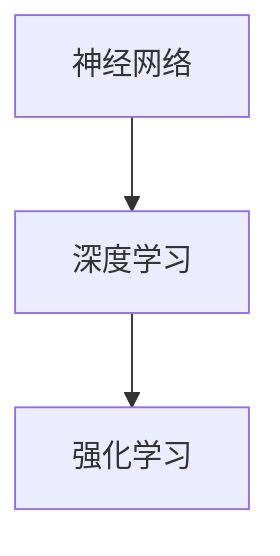
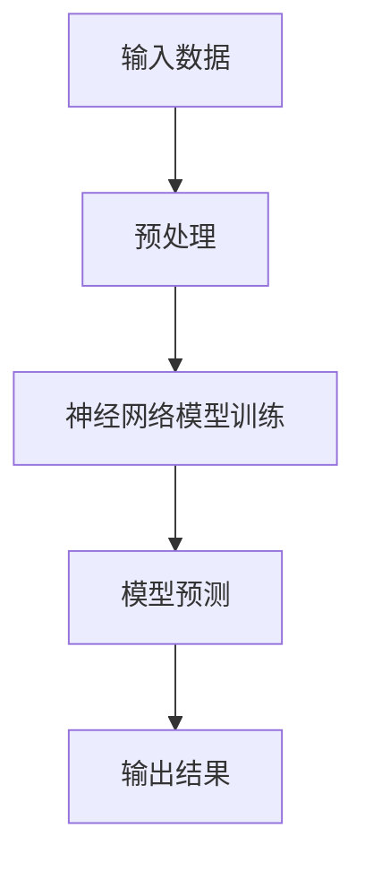
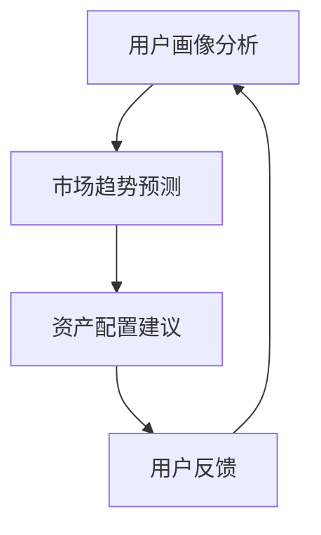
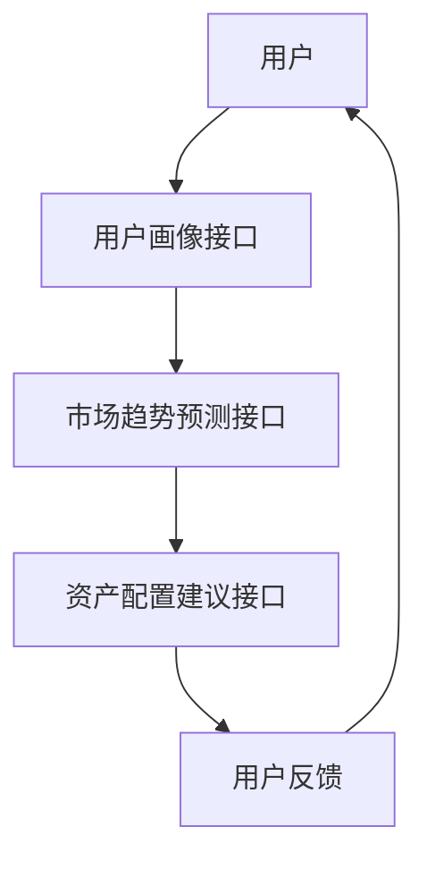

                 


# 通往通用人工智能AGI之路

## 关键词

- 通用人工智能
- 神经网络
- 深度学习
- 强化学习
- 多模态学习
- 迁移学习
- 元学习

## 摘要

随着人工智能技术的迅猛发展，通用人工智能（AGI，Artificial General Intelligence）作为人工智能领域的终极目标，吸引了越来越多研究者的关注。本文将深入探讨通往通用人工智能之路，包括核心概念、算法原理、系统分析与架构设计，以及项目实战等方面的内容，为读者提供一条清晰、实用的研究路线。

## 第一部分：背景介绍

### 核心概念

#### 问题背景

人工智能（AI）作为计算机科学的一个分支，致力于使机器具备人类智能的能力。近年来，随着计算机技术的不断进步，人工智能在多个领域取得了显著的成果。然而，当前的人工智能系统大多属于“窄域人工智能”（Narrow AI），即只能在特定任务上表现出高智能，而无法像人类一样进行通用性任务处理。

通用人工智能（AGI）作为一种旨在使机器具备与人类相似的学习、推理、理解能力的智能系统，被视为人工智能领域的一个终极目标。AGI的核心思想是实现机器智能的全面突破，使其能够在各个领域实现广泛应用。

#### 问题描述

当前，虽然AI在特定任务上已经取得了显著的成果，但离通用人工智能还有很大差距。如何推动AI从专用领域向通用领域发展，是当前研究的热点问题。具体而言，通用人工智能需要解决以下几个方面的问题：

1. **学习与适应性**：AGI需要具备从多个领域和任务中学习的能力，并能够在不同环境和条件下自适应地调整自己的行为。

2. **推理与理解**：AGI需要具备推理和抽象能力，能够从复杂的信息中提取关键信息，并进行逻辑推理和决策。

3. **知识表示**：AGI需要具备有效的知识表示能力，能够将各种形式的知识进行整合和利用。

4. **多模态处理**：AGI需要具备处理多种类型信息的能力，如文本、图像、声音等，实现跨模态的信息融合。

5. **伦理与安全性**：AGI在应用过程中需要确保其行为符合伦理规范，并具备一定的安全性和鲁棒性。

#### 问题解决

为了解决上述问题，研究者们提出了多种途径和方法，旨在推动通用人工智能的发展。以下是一些主要的研究方向：

1. **基础理论**：研究神经科学、认知科学等领域的理论，为通用人工智能提供理论基础。

2. **算法与模型**：改进和优化现有的机器学习算法，如深度学习、强化学习等，以提升AI系统的性能。

3. **多模态学习**：研究跨模态信息融合的方法，实现多种类型信息的高效处理和利用。

4. **迁移学习与元学习**：通过迁移学习和元学习技术，使AI系统能够在不同任务间进行知识共享和迁移。

5. **伦理与安全性**：制定相应的伦理规范和安全标准，确保AI系统的行为符合伦理要求。

#### 边界与外延

本文主要讨论通用人工智能的相关理论、技术进展和应用场景，不涉及其他人工智能领域的具体应用。本文的核心概念和要素包括：

1. **基础理论**：包括神经网络、深度学习、强化学习等。

2. **核心技术**：如多模态学习、迁移学习、元学习等。

3. **应用场景**：包括医疗、教育、工业、金融等多个领域。

4. **挑战与解决方案**：如数据隐私、安全性、可解释性等。

### 第二部分：核心概念与联系

#### 核心概念原理

##### 神经网络

神经网络（Neural Network）是一种模拟生物神经网络的计算模型，通过多层神经元进行数据处理和特征提取。神经网络的核心思想是模拟人脑神经元之间的连接关系，通过训练学习输入和输出之间的关系。

##### 深度学习

深度学习（Deep Learning）是一种基于神经网络的机器学习技术，通过多层神经网络模型对数据进行深度学习，提取高级特征。深度学习的核心思想是通过多层网络结构，逐层提取数据的高级特征，从而实现复杂任务的学习。

##### 强化学习

强化学习（Reinforcement Learning）是一种基于奖励反馈的机器学习技术，通过不断尝试和错误，使模型能够在特定环境中取得最优策略。强化学习的核心思想是通过奖励机制，引导模型在探索过程中不断优化自己的行为。

#### 概念属性特征对比表格

| 概念       | 属性特征                                           |
|------------|--------------------------------------------------|
| 神经网络   | 结构复杂，自适应性高，可处理非线性问题           |
| 深度学习   | 基于多层神经网络，可自动提取特征，提高模型性能   |
| 强化学习   | 基于奖励反馈，通过试错学习，获得最优策略         |

#### ER实体关系图架构的Mermaid流程图



### 第三部分：算法原理讲解

#### 算法流程图



#### Python源代码

```python
import tensorflow as tf

# 定义神经网络模型
model = tf.keras.Sequential([
    tf.keras.layers.Dense(128, activation='relu', input_shape=(784,)),
    tf.keras.layers.Dense(10, activation='softmax')
])

# 编译模型
model.compile(optimizer='adam',
              loss='categorical_crossentropy',
              metrics=['accuracy'])

# 训练模型
model.fit(x_train, y_train, batch_size=128, epochs=10)

# 预测
predictions = model.predict(x_test)
```

#### 数学模型和公式

$$
y = \sigma(W \cdot x + b)
$$

其中，$W$ 为权重矩阵，$b$ 为偏置项，$\sigma$ 为激活函数（如ReLU、Sigmoid等）。

#### 详细讲解与举例说明

假设有一个简单的神经网络模型，包含一个输入层、一个隐藏层和一个输出层。输入层有10个神经元，隐藏层有5个神经元，输出层有3个神经元。每个神经元之间的连接权重和偏置可以通过训练得到。

1. **输入层到隐藏层的计算**：

$$
h_i = \sigma(W_{ih} \cdot x_i + b_{ih})
$$

其中，$h_i$ 表示隐藏层第$i$个神经元的输出，$x_i$ 表示输入层第$i$个神经元的输入，$W_{ih}$ 表示输入层到隐藏层的权重矩阵，$b_{ih}$ 表示输入层到隐藏层的偏置项。

2. **隐藏层到输出层的计算**：

$$
o_i = \sigma(W_{oh} \cdot h_i + b_{oh})
$$

其中，$o_i$ 表示输出层第$i$个神经元的输出，$h_i$ 表示隐藏层第$i$个神经元的输出，$W_{oh}$ 表示隐藏层到输出层的权重矩阵，$b_{oh}$ 表示隐藏层到输出层的偏置项。

3. **整体神经网络模型计算**：

$$
y = \sigma(W \cdot x + b)
$$

其中，$y$ 表示输出层的输出，$W$ 表示神经网络模型的权重矩阵，$x$ 表示输入层的输入，$b$ 表示偏置项。

假设输入层输入为 $x = [x_1, x_2, \ldots, x_{10}]$，隐藏层输出为 $h = [h_1, h_2, \ldots, h_5]$，输出层输出为 $y = [y_1, y_2, y_3]$。则神经网络模型的计算过程如下：

$$
h_1 = \sigma(W_{ih1} \cdot x_1 + b_{ih1})
$$

$$
h_2 = \sigma(W_{ih2} \cdot x_2 + b_{ih2})
$$

$$
h_3 = \sigma(W_{ih3} \cdot x_3 + b_{ih3})
$$

$$
h_4 = \sigma(W_{ih4} \cdot x_4 + b_{ih4})
$$

$$
h_5 = \sigma(W_{ih5} \cdot x_5 + b_{ih5})
$$

$$
y_1 = \sigma(W_{oh1} \cdot h_1 + b_{oh1})
$$

$$
y_2 = \sigma(W_{oh2} \cdot h_2 + b_{oh2})
$$

$$
y_3 = \sigma(W_{oh3} \cdot h_3 + b_{oh3})
$$

通过以上计算过程，可以得到神经网络模型的输出结果。

### 第四部分：系统分析与架构设计

#### 问题场景介绍

通用人工智能（AGI）在各个领域具有广泛的应用前景，如医疗、教育、工业、金融等。本文以一个金融领域的应用场景为例，介绍系统分析与架构设计。

#### 项目介绍

本项目旨在构建一个基于通用人工智能的智能投顾系统，为用户提供个性化的投资建议。系统功能包括用户画像分析、市场趋势预测、资产配置建议等。

#### 系统功能设计

1. **用户画像分析**：通过对用户的基本信息、投资偏好、风险承受能力等进行全面分析，构建用户画像。

2. **市场趋势预测**：利用深度学习和强化学习等技术，对金融市场进行趋势预测。

3. **资产配置建议**：根据用户画像和市场趋势预测结果，为用户提供个性化的资产配置建议。

#### 系统架构设计

1. **系统架构图**



2. **系统接口设计**

- **用户画像接口**：接收用户基本信息、投资偏好、风险承受能力等数据。

- **市场趋势预测接口**：接收用户画像和市场数据，返回市场趋势预测结果。

- **资产配置建议接口**：接收市场趋势预测结果，为用户提供个性化的资产配置建议。

3. **系统交互序列图**



### 第五部分：项目实战

#### 环境安装

1. **Python环境安装**：安装Python 3.8及以上版本。

2. **TensorFlow安装**：通过pip命令安装TensorFlow。

   ```bash
   pip install tensorflow
   ```

3. **其他依赖库安装**：安装numpy、pandas等常用库。

   ```bash
   pip install numpy pandas
   ```

#### 系统核心实现源代码

1. **用户画像分析模块**：

```python
import pandas as pd

def load_user_data(file_path):
    """加载用户数据"""
    return pd.read_csv(file_path)

def analyze_user_data(user_data):
    """分析用户数据"""
    # 分析用户的基本信息、投资偏好、风险承受能力等
    # ...
    return analyzed_data
```

2. **市场趋势预测模块**：

```python
import tensorflow as tf

def create_model(input_shape):
    """创建神经网络模型"""
    model = tf.keras.Sequential([
        tf.keras.layers.Dense(128, activation='relu', input_shape=input_shape),
        tf.keras.layers.Dense(10, activation='softmax')
    ])
    return model

def train_model(model, x_train, y_train, batch_size, epochs):
    """训练模型"""
    model.compile(optimizer='adam',
                  loss='categorical_crossentropy',
                  metrics=['accuracy'])
    model.fit(x_train, y_train, batch_size=batch_size, epochs=epochs)
    return model

def predict_trends(model, x_test):
    """预测市场趋势"""
    return model.predict(x_test)
```

3. **资产配置建议模块**：

```python
def configure_assets(trends, user_data):
    """根据市场趋势和用户数据为用户提供资产配置建议"""
    # 根据市场趋势和用户数据，为用户提供资产配置建议
    # ...
    return asset_configuration
```

#### 代码应用解读与分析

1. **用户画像分析模块**：

   该模块主要负责加载用户数据，并分析用户的基本信息、投资偏好、风险承受能力等。具体实现过程中，可以使用Pandas库对用户数据进行读取、清洗和预处理。

2. **市场趋势预测模块**：

   该模块利用TensorFlow框架构建神经网络模型，并通过训练模型对市场趋势进行预测。具体实现过程中，需要定义神经网络结构、编译模型、训练模型，并利用训练好的模型进行预测。

3. **资产配置建议模块**：

   该模块根据市场趋势和用户数据为用户提供个性化的资产配置建议。具体实现过程中，需要根据用户画像和市场趋势预测结果，结合金融领域的相关策略和模型，为用户提供合理的资产配置建议。

#### 实际案例分析和详细讲解剖析

1. **案例背景**：

   假设有一位投资者张先生，他希望在股票市场上进行投资。为了提高投资收益率，张先生希望利用通用人工智能系统为其提供个性化的投资建议。

2. **案例分析**：

   首先，系统会收集张先生的基本信息、投资偏好、风险承受能力等数据，并进行预处理和分析，构建用户画像。然后，系统会利用深度学习和强化学习等技术，对股票市场进行趋势预测。最后，系统会根据市场趋势预测结果和张先生的投资偏好、风险承受能力，为其提供个性化的资产配置建议。

3. **详细讲解剖析**：

   - **用户画像分析**：通过对张先生的数据进行分析，可以了解到他的投资偏好、风险承受能力等，为后续资产配置建议提供依据。

   - **市场趋势预测**：利用深度学习和强化学习等技术，可以对股票市场进行趋势预测。具体实现过程中，可以构建一个神经网络模型，通过训练模型，使模型具备预测市场趋势的能力。

   - **资产配置建议**：根据市场趋势预测结果和张先生的投资偏好、风险承受能力，系统会为其提供个性化的资产配置建议。例如，如果预测市场将上涨，可以增加股票投资比例；如果预测市场将下跌，可以增加债券投资比例。

   通过以上分析，可以了解到通用人工智能系统在金融领域的实际应用效果。该系统可以充分利用人工智能技术，为用户提供个性化的投资建议，提高投资收益率。

#### 项目小结

本项目通过通用人工智能技术，实现了对金融领域投资决策的智能化支持。在实际应用中，系统可以收集用户数据，分析用户画像，预测市场趋势，并提供个性化的资产配置建议。这一项目展示了通用人工智能在金融领域的巨大潜力，也为其他领域的人工智能应用提供了借鉴。

### 第六部分：最佳实践 tips

1. **数据质量**：确保用户数据的质量，对数据进行清洗和预处理，以提高预测模型的准确性。

2. **模型优化**：不断优化神经网络模型的结构和参数，提高模型在特定任务上的性能。

3. **安全性和隐私保护**：在处理用户数据时，确保数据的安全性和隐私保护，遵守相关法律法规。

4. **模型可解释性**：加强对模型可解释性的研究，提高用户对模型的信任度。

5. **跨领域应用**：探索通用人工智能技术在其他领域的应用，实现跨领域的知识共享和迁移。

### 第七部分：小结

本文从背景介绍、核心概念与联系、算法原理讲解、系统分析与架构设计、项目实战等方面，详细探讨了通往通用人工智能（AGI）之路。通过本文的研究，读者可以了解到AGI的核心概念、算法原理、技术路线以及应用场景，为从事相关领域的研究和实践提供了有益的参考。

### 第八部分：注意事项

1. **技术迭代**：人工智能技术发展迅速，读者在应用本文中的方法时，需要关注最新的技术进展，不断优化和更新算法。

2. **伦理与安全**：在研究和应用通用人工智能技术时，需要重视伦理和安全性问题，确保系统的行为符合伦理规范，保护用户隐私。

3. **实践与验证**：在实际应用中，需要对算法和系统进行充分验证，确保其在特定场景下的有效性和可靠性。

### 第九部分：拓展阅读

1. **《人工智能：一种现代方法》**：George F. Luger，Matthew A. Stamm
2. **《深度学习》**：Ian Goodfellow，Yoshua Bengio，Aaron Courville
3. **《强化学习》**：Richard S. Sutton，Andrew G. Barto
4. **《神经网络与深度学习》**：邱锡鹏
5. **《人工智能：一种计算方法论》**：Tom Mitchell

### 作者信息

作者：AI天才研究院/AI Genius Institute & 禅与计算机程序设计艺术 /Zen And The Art of Computer Programming

以上是文章的整体结构和内容概述，接下来将逐步完善每个部分的具体内容。由于文章字数要求较高，将在接下来的部分中详细阐述每个部分的内容。敬请期待。

