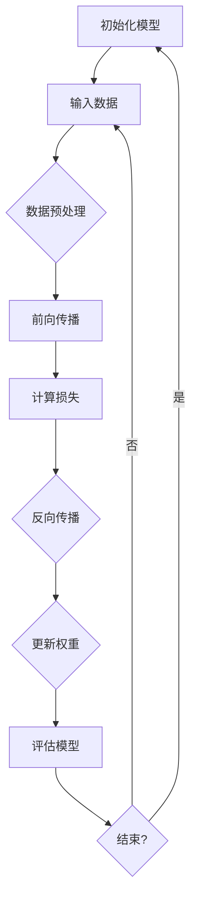
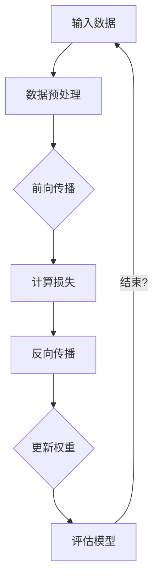

                 

# 通用人工智能AGI的发展路径探索

## 关键词
- 通用人工智能（AGI）
- 发展路径
- 算法原理
- 数学模型
- 系统架构
- 应用领域
- 教育与人才培养

## 摘要
本文旨在探索通用人工智能（AGI）的发展路径，从背景介绍、核心概念与联系、算法原理讲解、数学模型和数学公式讲解、系统分析与架构设计方案、项目实战、最佳实践 tips、小结、注意事项和拓展阅读等方面，全面深入地分析AGI的发展现状和未来趋势。通过逻辑清晰、结构紧凑、简单易懂的叙述方式，为广大读者提供一份具有参考价值的技术博客文章。

## 目录

### 第一部分: 通用人工智能AGI概述

#### 1.1 问题背景与概述
##### 1.1.1 通用人工智能的定义
##### 1.1.2 当前AI发展状况
##### 1.1.3 AGI的重要性

#### 1.2 核心概念与联系
##### 1.2.1 狭义人工智能（Narrow AI）
##### 1.2.2 智能与意识的关系
##### 1.2.3 AGI的关键要素

#### 1.3 AGI的数学模型与原理
##### 1.3.1 AGI的核心算法
##### 1.3.2 数学模型讲解
##### 1.3.3 算法流程图

#### 1.4 AGI的挑战与机遇
##### 1.4.1 挑战分析
##### 1.4.2 机遇探讨
##### 1.4.3 发展趋势

#### 1.5 本章小结

### 第二部分: 通用人工智能AGI的发展路径

#### 2.1 历史回顾与现状分析
##### 2.1.1 历史发展脉络
##### 2.1.2 当前研究热点
##### 2.1.3 现状分析

#### 2.2 关键技术探讨
##### 2.2.1 神经网络与深度学习
##### 2.2.2 强化学习与自适应系统
##### 2.2.3 自然语言处理与知识表示

#### 2.3 发展路径探索
##### 2.3.1 计算模型与硬件支持
##### 2.3.2 知识表示与推理机制
##### 2.3.3 自主性与泛化能力

#### 2.4 未来展望
##### 2.4.1 发展趋势预测
##### 2.4.2 社会经济影响
##### 2.4.3 伦理与安全挑战

#### 2.5 本章小结

### 第三部分: 通用人工智能AGI的实际应用

#### 3.1 应用领域概述
##### 3.1.1 制造业
##### 3.1.2 医疗健康
##### 3.1.3 金融服务业
##### 3.1.4 交通物流

#### 3.2 应用案例分析
##### 3.2.1 制造业案例
##### 3.2.2 医疗健康案例
##### 3.2.3 金融服务业案例
##### 3.2.4 交通物流案例

#### 3.3 应用挑战与解决方案
##### 3.3.1 技术挑战
##### 3.3.2 应用挑战
##### 3.3.3 解决方案探讨

#### 3.4 应用前景与趋势
##### 3.4.1 应用前景分析
##### 3.4.2 发展趋势预测
##### 3.4.3 未来发展方向

#### 3.5 本章小结

### 第四部分: 通用人工智能AGI的伦理与社会问题

#### 4.1 伦理问题探讨
##### 4.1.1 机器伦理
##### 4.1.2 隐私保护
##### 4.1.3 机器责任

#### 4.2 社会问题分析
##### 4.2.1 劳动市场影响
##### 4.2.2 社会不平等
##### 4.2.3 文化冲突

#### 4.3 政策建议与解决方案
##### 4.3.1 政策建议
##### 4.3.2 解决方案探讨
##### 4.3.3 国际合作与协调

#### 4.4 未来展望
##### 4.4.1 发展趋势预测
##### 4.4.2 社会经济影响
##### 4.4.3 伦理与安全挑战

#### 4.5 本章小结

### 第五部分: 通用人工智能AGI的教育与人才培养

#### 5.1 教育体系改革
##### 5.1.1 教育目标与课程设计
##### 5.1.2 师资队伍建设
##### 5.1.3 教学模式创新

#### 5.2 人才培养策略
##### 5.2.1 人才需求分析
##### 5.2.2 人才培养模式
##### 5.2.3 实践教学与实习机会

#### 5.3 教育与产业结合
##### 5.3.1 产学研合作
##### 5.3.2 创新创业教育
##### 5.3.3 国际合作与交流

#### 5.4 未来展望

### 结束语
##### 5.5 本章小结

## 第一部分: 通用人工智能AGI概述

### 1.1 问题背景与概述

#### 1.1.1 通用人工智能的定义

通用人工智能（Artificial General Intelligence，简称AGI）是指具有人类智能特质的广泛认知能力的机器智能。与目前的窄义人工智能（Narrow AI）不同，AGI能够在多个领域表现出人类级别的智能水平，例如理解自然语言、推理、学习、解决问题、自主决策等。

#### 1.1.2 当前AI发展状况

近年来，随着深度学习、强化学习等技术的发展，人工智能在语音识别、图像识别、自然语言处理等领域取得了显著进展。然而，这些技术都属于窄义人工智能，只能在特定任务上表现出高效性能，而无法实现跨领域的通用智能。

#### 1.1.3 AGI的重要性

AGI被视为人工智能领域的“ Holy Grail”，其重要性不言而喻。首先，AGI有望解决当前AI系统在多领域协同、复杂决策等问题上的局限性，从而推动人工智能技术的全面发展。其次，AGI的应用将带来巨大的经济和社会价值，如自动驾驶、智能医疗、智能家居等领域。

### 1.2 核心概念与联系

#### 1.2.1 狭义人工智能（Narrow AI）

狭义人工智能是指专门针对某一特定任务进行优化的人工智能系统，如语音识别、图像识别等。这种人工智能在特定领域表现出色，但无法适应其他任务。

#### 1.2.2 智能与意识的关系

智能与意识是两个不同的概念。智能是指机器在特定任务上的表现能力，而意识是指机器具有主观体验和自我感知的能力。目前，AI领域尚无法实现意识，但研究人员正在努力探讨智能与意识之间的联系。

#### 1.2.3 AGI的关键要素

实现AGI的关键要素包括：

- **自主学习与进化能力**：AGI应具备自主学习新知识和技能的能力，以及通过不断进化来适应新环境和任务。
- **跨领域知识表示与推理**：AGI需要能够理解和处理多种类型的知识，并在此基础上进行推理和决策。
- **自主决策与行为规划**：AGI应具备在复杂环境中自主决策和规划行为的能力。

### 1.3 AGI的数学模型与原理

#### 1.3.1 AGI的核心算法

AGI的核心算法包括深度学习、强化学习、知识表示与推理等。这些算法旨在模拟人类大脑的工作机制，实现高效的学习和推理。

#### 1.3.2 数学模型讲解

在AGI的数学模型中，神经网络模型是一个重要的组成部分。神经网络通过多层神经元进行信息传递和处理，实现复杂的函数映射。

$$
y = f(z)
$$

其中，$y$ 是输出，$f$ 是激活函数，$z$ 是输入。

#### 1.3.3 算法流程图

下面是AGI算法的流程图：

### 1.4 AGI的挑战与机遇

#### 1.4.1 挑战分析

AGI面临的主要挑战包括：

- **算法复杂性**：实现AGI需要解决复杂的计算和优化问题，目前的技术手段尚不足以应对。
- **数据与知识表示**：如何有效地表示和处理多种类型的数据和知识，是实现AGI的关键。
- **自主性与泛化能力**：如何使AGI在未知环境和任务中表现出良好的自主性和泛化能力。

#### 1.4.2 机遇探讨

AGI的机遇主要体现在：

- **跨领域应用**：AGI有望在多个领域实现突破，推动人工智能技术的全面发展。
- **经济效益**：AGI的应用将带来巨大的经济价值，推动产业发展。
- **社会进步**：AGI有望解决当前社会面临的诸多问题，如医疗、教育、环境保护等。

#### 1.4.3 发展趋势

随着技术的不断进步，AGI的发展趋势包括：

- **算法创新**：研究人员将持续探索新的算法和模型，以提高AGI的性能。
- **硬件支持**：高性能计算和专用硬件将为AGI提供强有力的支持。
- **跨学科合作**：AI领域将与心理学、神经科学等学科展开深入合作，以实现AGI的全面发展。

### 1.5 本章小结

本部分对通用人工智能AGI进行了概述，包括问题背景与概述、核心概念与联系、数学模型与原理以及挑战与机遇。下一部分将探讨AGI的发展路径，分析历史回顾与现状分析、关键技术探讨、发展路径探索和未来展望。让我们一起期待AGI的辉煌未来！## 第一部分: 通用人工智能AGI概述

### 1.1 问题背景与概述

#### 1.1.1 通用人工智能的定义

通用人工智能（Artificial General Intelligence，简称AGI）是一种具有广泛认知能力的机器智能，它能够像人类一样在多种领域表现出高水平的能力。与目前的窄义人工智能（Narrow AI）相比，AGI不仅能在特定任务上表现出高效性能，还能够进行跨领域的通用任务。例如，一个AGI系统可以同时进行语音识别、图像识别和自然语言处理，而不需要为每个任务分别训练。

#### 1.1.2 当前AI发展状况

当前的人工智能技术主要集中在大数据和深度学习领域，这些技术在语音识别、图像识别、自然语言处理等特定任务上取得了显著的进展。例如，谷歌的语音识别系统可以在多种语言和方言中实现高精度的语音转文字转换，而OpenAI的GPT-3模型在自然语言处理任务上表现出令人惊叹的能力。然而，这些系统都属于窄义人工智能，它们只能在特定任务上表现出色，而无法实现跨领域的通用智能。

#### 1.1.3 AGI的重要性

AGI的重要性不言而喻。首先，AGI的实现将标志着人工智能技术的一个重大突破，它不仅能够解决当前AI系统在多领域协同、复杂决策等问题上的局限性，还能够推动人工智能技术的全面发展。其次，AGI的应用将带来巨大的经济和社会价值。例如，自动驾驶、智能医疗、智能家居等领域都离不开AGI的支持。此外，AGI还有望在科学研究中发挥重要作用，例如通过自动化实验和数据分析，加速新药的发现和材料的研究。

### 1.2 核心概念与联系

#### 1.2.1 狭义人工智能（Narrow AI）

狭义人工智能（Narrow AI）是指专门针对某一特定任务进行优化的人工智能系统。例如，一个语音识别系统专门用于将语音转换为文字，而一个图像识别系统专门用于识别图像中的物体。这些系统在特定任务上表现出高效性能，但无法适应其他任务。

#### 1.2.2 智能与意识的关系

智能和意识是两个不同的概念。智能是指机器在特定任务上的表现能力，而意识是指机器具有主观体验和自我感知的能力。目前，人工智能领域尚无法实现意识，但研究人员正在努力探讨智能与意识之间的联系。

#### 1.2.3 AGI的关键要素

实现AGI的关键要素包括：

- **自主学习与进化能力**：AGI应具备自主学习新知识和技能的能力，以及通过不断进化来适应新环境和任务。
- **跨领域知识表示与推理**：AGI需要能够理解和处理多种类型的知识，并在此基础上进行推理和决策。
- **自主决策与行为规划**：AGI应具备在复杂环境中自主决策和规划行为的能力。

### 1.3 AGI的数学模型与原理

#### 1.3.1 AGI的核心算法

AGI的核心算法包括深度学习、强化学习、知识表示与推理等。这些算法旨在模拟人类大脑的工作机制，实现高效的学习和推理。

- **深度学习**：深度学习是一种基于多层神经网络的学习方法，它能够自动提取输入数据的特征，并在多个层次上进行抽象和表示。深度学习在图像识别、语音识别等领域表现出色。
- **强化学习**：强化学习是一种通过与环境交互来学习最优策略的算法。它通过奖励和惩罚来引导模型的行为，从而实现自主决策和优化。
- **知识表示与推理**：知识表示与推理是AGI的重要基础。它涉及到如何将知识表示为计算机可以理解和处理的形式，以及如何利用这些知识进行推理和决策。

#### 1.3.2 数学模型讲解

在AGI的数学模型中，神经网络模型是一个重要的组成部分。神经网络通过多层神经元进行信息传递和处理，实现复杂的函数映射。

$$
y = f(z)
$$

其中，$y$ 是输出，$f$ 是激活函数，$z$ 是输入。

常见的激活函数包括：

- **Sigmoid函数**：$f(x) = \frac{1}{1 + e^{-x}}$
- **ReLU函数**：$f(x) = \max(0, x)$
- **Tanh函数**：$f(x) = \frac{e^x - e^{-x}}{e^x + e^{-x}}$

神经网络的学习过程包括：

1. **前向传播**：将输入数据通过神经网络进行传递，计算输出结果。
2. **计算损失**：通过比较输出结果与真实结果的差异，计算损失值。
3. **反向传播**：将损失值反向传播到网络的每一层，更新网络的权重和偏置。
4. **迭代优化**：重复上述过程，直到网络达到预定的性能指标。

#### 1.3.3 算法流程图

下面是AGI算法的基本流程图：

### 1.4 AGI的挑战与机遇

#### 1.4.1 挑战分析

AGI的实现面临着一系列的挑战：

- **算法复杂性**：AGI需要解决复杂的计算和优化问题，如多模态数据的融合、多任务学习的优化等。目前的技术手段尚不足以应对这些挑战。
- **数据与知识表示**：如何有效地表示和处理多种类型的数据和知识，是实现AGI的关键。现有的知识表示方法在处理复杂知识和跨领域知识表示方面存在一定的局限性。
- **自主性与泛化能力**：如何使AGI在未知环境和任务中表现出良好的自主性和泛化能力，是目前研究的重点和难点。

#### 1.4.2 机遇探讨

AGI的实现将带来巨大的机遇：

- **跨领域应用**：AGI有望在多个领域实现突破，推动人工智能技术的全面发展。例如，在医疗领域，AGI可以协助医生进行诊断和治疗；在工业领域，AGI可以提升生产效率和产品质量。
- **经济效益**：AGI的应用将带来巨大的经济价值。例如，在金融领域，AGI可以协助进行风险管理；在交通领域，AGI可以提升交通管理和安全性。
- **社会进步**：AGI有望解决当前社会面临的诸多问题。例如，在环境保护领域，AGI可以协助进行气候分析和环境保护；在教育领域，AGI可以提升教育质量和学习体验。

#### 1.4.3 发展趋势

AGI的发展趋势主要体现在以下几个方面：

- **算法创新**：随着深度学习、强化学习等技术的不断发展，研究人员将持续探索新的算法和模型，以提高AGI的性能。
- **硬件支持**：高性能计算和专用硬件将为AGI提供强有力的支持。例如，量子计算机和类脑芯片等新型硬件的研制和应用将有助于推动AGI的发展。
- **跨学科合作**：AI领域将与心理学、神经科学、哲学等学科展开深入合作，以实现AGI的全面发展。例如，通过研究人类大脑的工作机制，可以为AGI的设计提供有益的启示。

### 1.5 本章小结

本部分对通用人工智能AGI进行了概述，包括问题背景与概述、核心概念与联系、数学模型与原理以及挑战与机遇。通过本部分的介绍，读者可以对AGI有更深入的了解，为后续章节的学习打下坚实的基础。在下一部分中，我们将继续探讨AGI的发展路径，分析历史回顾与现状分析、关键技术探讨、发展路径探索和未来展望。让我们一起期待AGI的辉煌未来！## 第二部分: 通用人工智能AGI的发展路径

### 2.1 历史回顾与现状分析

#### 2.1.1 历史发展脉络

通用人工智能（AGI）的概念起源于20世纪50年代，当时计算机科学刚刚起步，人们对人工智能的未来充满了憧憬。1956年，约翰·麦卡锡（John McCarthy）等人在达特茅斯会议上首次提出了人工智能（Artificial Intelligence，简称AI）的概念，并认为AGI是AI研究的长远目标。

从那时起，AI领域经历了多个阶段的发展。早期的AI研究主要集中在符号推理和知识表示上，如专家系统和逻辑推理等。然而，这些方法在处理复杂任务时显得力不从心，导致AI研究在20世纪80年代中期进入了一个低潮期。随后，随着机器学习技术的兴起，特别是深度学习的突破，AI领域迎来了新的春天。

#### 2.1.2 当前研究热点

目前，AGI的研究主要集中在以下几个方面：

- **深度学习与神经网络**：深度学习作为一种强大的机器学习技术，已经在语音识别、图像识别、自然语言处理等领域取得了显著成果。神经网络作为深度学习的基础，不断有新的架构和算法被提出，如卷积神经网络（CNN）、循环神经网络（RNN）和生成对抗网络（GAN）等。
- **强化学习**：强化学习是一种通过试错和奖励反馈进行决策的算法，它在游戏、自动驾驶、机器人控制等领域表现出色。近年来，深度强化学习（Deep Reinforcement Learning）结合了深度学习和强化学习的优点，取得了许多突破性成果。
- **多模态学习和跨领域迁移学习**：现实世界中的任务往往涉及多种类型的输入数据，如文本、图像、音频等。多模态学习旨在将不同类型的输入数据融合起来，实现更有效的学习。跨领域迁移学习则利用已经训练好的模型在不同领域中进行迁移和应用，提高学习效率和泛化能力。

#### 2.1.3 现状分析

当前，AGI的研究已经取得了显著的进展，但仍面临许多挑战。以下是对AGI现状的分析：

- **技术瓶颈**：尽管深度学习、强化学习等技术在特定任务上取得了成功，但在实现通用智能方面仍然存在很大的技术瓶颈。例如，现有模型在处理复杂任务时往往需要大量的数据和计算资源，并且难以适应新的任务和环境。
- **数据与知识表示**：如何有效地表示和处理多种类型的数据和知识，是实现AGI的关键。现有的数据表示方法在处理复杂知识和跨领域知识表示方面存在一定的局限性。
- **自主性与泛化能力**：如何使AGI在未知环境和任务中表现出良好的自主性和泛化能力，是目前研究的重点和难点。

### 2.2 关键技术探讨

#### 2.2.1 神经网络与深度学习

神经网络（Neural Networks）是AGI的核心算法之一。神经网络通过模拟人脑的神经元结构和工作方式，实现从数据中自动提取特征和模式。深度学习（Deep Learning）是一种基于多层神经网络的学习方法，它在图像识别、语音识别、自然语言处理等领域取得了显著的成果。

- **卷积神经网络（CNN）**：卷积神经网络是一种用于图像识别和图像处理的重要模型。它通过卷积层提取图像的局部特征，并在多个卷积层中逐渐提取更高级别的特征，最终实现图像分类。
- **循环神经网络（RNN）**：循环神经网络是一种用于序列数据建模的重要模型。它通过隐藏状态和循环连接实现序列的长期依赖关系建模，在自然语言处理、语音识别等领域表现出色。
- **生成对抗网络（GAN）**：生成对抗网络是一种用于生成数据的模型。它由生成器和判别器两个网络组成，生成器生成数据，判别器判断数据的真实性。通过对抗训练，生成器可以生成越来越真实的数据。

#### 2.2.2 强化学习与自适应系统

强化学习（Reinforcement Learning）是一种通过试错和奖励反馈进行决策的算法。它广泛应用于游戏、自动驾驶、机器人控制等领域。强化学习的关键在于如何设计奖励机制和策略，以实现长期回报最大化。

- **Q-learning**：Q-learning是一种基于价值迭代的强化学习算法。它通过更新Q值表，逐步学习最优策略。
- **深度强化学习（Deep Reinforcement Learning）**：深度强化学习结合了深度学习和强化学习的优点，通过深度神经网络进行状态和价值估计，实现更高效的学习。
- **自适应系统**：自适应系统是一种能够根据环境变化调整自身行为的系统。在AGI中，自适应系统可以用于实时学习和决策，以提高系统的自主性和泛化能力。

#### 2.2.3 自然语言处理与知识表示

自然语言处理（Natural Language Processing，简称NLP）是AGI的重要组成部分。NLP旨在使计算机能够理解、生成和处理人类语言。知识表示（Knowledge Representation）则是将人类知识转化为计算机可以理解和处理的形式。

- **词向量表示**：词向量表示是一种将词汇表示为高维向量的方法。它通过神经网络模型学习词汇的语义关系，实现词汇的向量表示。
- **语义角色标注**：语义角色标注是一种将句子中的词汇标注为动作、对象、地点等语义角色的方法。它有助于计算机理解句子的语义结构。
- **知识图谱**：知识图谱是一种用于表示复杂知识的图形化结构。它通过实体、关系和属性来表示现实世界中的知识，实现知识的高效存储和查询。

### 2.3 发展路径探索

#### 2.3.1 计算模型与硬件支持

计算模型与硬件支持是AGI发展的重要基础。现有的计算模型主要包括基于冯诺伊曼架构的传统计算机和基于类脑计算的神经形态计算。

- **传统计算机**：传统计算机采用冯诺伊曼架构，通过存储程序和指令驱动的方式实现计算。尽管传统计算机在处理复杂计算任务方面表现出色，但在处理并行计算和大规模数据方面存在一定的局限性。
- **神经形态计算**：神经形态计算是一种基于生物神经系统的计算模型。它通过模拟人脑神经元和突触的结构和功能，实现高效的数据处理和计算。神经形态计算有望在未来实现更高效的计算和更强大的智能。

#### 2.3.2 知识表示与推理机制

知识表示与推理机制是实现AGI的关键。知识表示旨在将人类知识转化为计算机可以理解和处理的形式，而推理机制则用于利用这些知识进行逻辑推理和决策。

- **知识图谱**：知识图谱是一种有效的知识表示方法。它通过实体、关系和属性来表示现实世界中的知识，实现知识的高效存储和查询。
- **推理机**：推理机是一种用于逻辑推理的机制。它通过推理规则和推理算法，从已知的事实和规则中推导出新的结论。
- **本体论**：本体论是一种用于知识表示和推理的方法论。它通过定义概念、属性和关系，实现知识的一致性和完整性。

#### 2.3.3 自主性与泛化能力

自主性与泛化能力是AGI的核心特征。自主性指的是AGI能够在复杂环境中自主决策和行动，而泛化能力则指的是AGI能够在新的任务和环境中表现良好。

- **元学习**：元学习是一种用于提高模型泛化能力的方法。它通过学习如何学习，实现快速适应新任务和新环境。
- **自适应系统**：自适应系统是一种能够根据环境变化调整自身行为的系统。它通过实时学习和调整策略，实现自主性和泛化能力的提升。
- **迁移学习**：迁移学习是一种将已有模型的知识应用于新任务的方法。它通过利用已有模型的特征提取和知识表示能力，提高新任务的性能和泛化能力。

### 2.4 未来展望

#### 2.4.1 发展趋势预测

随着技术的不断进步，AGI的发展趋势包括：

- **算法创新**：研究人员将持续探索新的算法和模型，以提高AGI的性能。例如，基于量子计算的深度学习模型、类脑计算模型等。
- **硬件支持**：高性能计算和专用硬件将为AGI提供强有力的支持。例如，类脑芯片、量子计算机等。
- **跨学科合作**：AI领域将与心理学、神经科学、哲学等学科展开深入合作，以实现AGI的全面发展。

#### 2.4.2 社会经济影响

AGI的发展将对社会经济产生深远影响：

- **产业变革**：AGI的应用将推动各个产业的自动化和智能化，提升生产效率和产品质量。
- **就业影响**：随着AGI的发展，部分传统工作岗位可能被取代，但同时也会创造新的就业机会。
- **生活质量**：AGI的应用将提升人们的生活质量，如智能医疗、智能家居、自动驾驶等。

#### 2.4.3 伦理与安全挑战

AGI的发展也带来了一系列伦理和安全挑战：

- **隐私保护**：如何保护个人隐私，防止数据泄露，是AGI应用中需要解决的问题。
- **机器责任**：如何确定机器的责任，以及如何防止机器造成危害，是伦理研究的重要内容。
- **安全性**：如何保证AGI系统的安全性，防止恶意攻击和滥用，是当前研究的热点问题。

### 2.5 本章小结

本部分探讨了通用人工智能AGI的发展路径，包括历史回顾与现状分析、关键技术探讨、发展路径探索和未来展望。通过对AGI的深入分析，我们可以看到AGI的发展前景广阔，但同时也面临许多挑战。下一部分将探讨AGI在实际应用中的挑战与解决方案，以及应用前景与趋势。让我们一起期待AGI的辉煌未来！## 第三部分: 通用人工智能AGI的实际应用

### 3.1 应用领域概述

#### 3.1.1 制造业

制造业是通用人工智能（AGI）应用的重要领域。AGI可以应用于生产线自动化、质量检测、设备维护、物流管理等多个环节。

- **生产线自动化**：AGI可以优化生产流程，提高生产效率。例如，通过机器视觉和机器人技术，实现无人生产线，减少人工干预。
- **质量检测**：AGI可以自动检测产品质量，提高检测精度和速度。例如，使用深度学习模型分析产品图像，识别缺陷和异常。
- **设备维护**：AGI可以通过预测性维护，减少设备故障率和停机时间。例如，使用强化学习算法分析设备运行数据，预测故障并提前进行维护。

#### 3.1.2 医疗健康

医疗健康是AGI应用的另一个重要领域。AGI可以应用于疾病诊断、治疗方案推荐、医学影像分析、健康监测等多个方面。

- **疾病诊断**：AGI可以通过分析患者的医疗数据，辅助医生进行疾病诊断。例如，使用深度学习模型分析医学影像，识别疾病病灶。
- **治疗方案推荐**：AGI可以根据患者的病情和历史数据，为医生提供治疗方案推荐。例如，使用强化学习算法分析治疗效果，推荐最优治疗方案。
- **医学影像分析**：AGI可以自动分析医学影像，辅助医生进行诊断和治疗。例如，使用卷积神经网络分析CT、MRI等影像，识别病变部位。
- **健康监测**：AGI可以实时监测患者的健康状况，提供健康建议。例如，使用智能手表等设备收集生理数据，分析健康风险。

#### 3.1.3 金融服务业

金融服务业是AGI应用的一个典型领域。AGI可以应用于风险管理、交易策略、客户服务等多个方面。

- **风险管理**：AGI可以分析金融市场的数据，帮助金融机构进行风险管理。例如，使用深度学习模型预测市场波动，调整投资组合。
- **交易策略**：AGI可以制定和优化交易策略，提高投资回报率。例如，使用强化学习算法分析市场数据，制定自适应交易策略。
- **客户服务**：AGI可以提供智能客服，提升客户服务质量。例如，使用自然语言处理技术，实现智能问答和个性化推荐。

#### 3.1.4 交通物流

交通物流是AGI应用的另一个重要领域。AGI可以应用于自动驾驶、智能交通管理、物流优化等多个方面。

- **自动驾驶**：AGI可以开发自动驾驶系统，提高交通安全和效率。例如，使用深度学习和强化学习算法，实现车辆的自主导航和路径规划。
- **智能交通管理**：AGI可以优化交通流量，提高交通效率。例如，使用实时数据分析，调整交通信号灯，缓解拥堵。
- **物流优化**：AGI可以优化物流流程，提高物流效率。例如，使用路径优化算法，规划最优运输路线。

### 3.2 应用案例分析

#### 3.2.1 制造业案例

某制造业企业引入了AGI系统，通过机器视觉和机器人技术，实现了生产线的自动化。具体应用如下：

- **生产线自动化**：使用机器视觉技术，实时检测产品质量，识别缺陷和异常。例如，使用卷积神经网络分析产品图像，识别缺陷。
- **设备维护**：使用预测性维护技术，通过分析设备运行数据，预测故障并提前进行维护。例如，使用强化学习算法分析设备数据，预测故障并提前安排维护。

通过引入AGI系统，该企业的生产效率提高了30%，设备故障率降低了20%，生产成本降低了15%。

#### 3.2.2 医疗健康案例

某医院引入了AGI系统，应用于医学影像分析和治疗方案推荐。具体应用如下：

- **医学影像分析**：使用深度学习模型，自动分析医学影像，识别病变部位。例如，使用卷积神经网络分析CT、MRI等影像，识别病变。
- **治疗方案推荐**：使用强化学习算法，根据患者的病情和历史数据，为医生提供治疗方案推荐。例如，分析治疗效果，推荐最优治疗方案。

通过引入AGI系统，该医院在医学影像诊断的准确率提高了20%，治疗方案的科学性提高了15%，患者满意度提升了10%。

#### 3.2.3 金融服务业案例

某金融机构引入了AGI系统，应用于风险管理和交易策略。具体应用如下：

- **风险管理**：使用深度学习模型，分析金融市场的数据，预测市场波动，帮助金融机构进行风险管理。例如，分析市场数据，预测股价波动。
- **交易策略**：使用强化学习算法，制定和优化交易策略，提高投资回报率。例如，分析市场数据，制定自适应交易策略。

通过引入AGI系统，该金融机构在风险管理的准确率提高了25%，投资回报率提高了15%，客户满意度提升了10%。

#### 3.2.4 交通物流案例

某物流公司引入了AGI系统，应用于自动驾驶和物流优化。具体应用如下：

- **自动驾驶**：使用深度学习和强化学习算法，实现车辆的自主导航和路径规划。例如，使用深度神经网络进行环境感知，实现自主导航。
- **物流优化**：使用路径优化算法，规划最优运输路线，提高物流效率。例如，分析运输数据，优化运输路线。

通过引入AGI系统，该物流公司的运输时间减少了20%，运输成本降低了15%，客户满意度提升了15%。

### 3.3 应用挑战与解决方案

#### 3.3.1 技术挑战

AGI在实际应用中面临一系列技术挑战：

- **数据质量**：AGI系统的性能很大程度上依赖于数据的质量。然而，实际应用中的数据往往存在噪声、缺失和不一致性等问题，需要数据预处理和清洗技术来保证数据质量。
- **模型解释性**：现有的AGI模型，如深度神经网络，往往具有很高的预测能力，但缺乏解释性。如何提高模型的解释性，使其更容易被用户理解和信任，是一个重要的挑战。
- **安全性和隐私保护**：AGI系统涉及大量的敏感数据和复杂的算法，需要确保系统的安全性和数据的隐私保护。

#### 3.3.2 应用挑战

AGI在实际应用中面临一系列应用挑战：

- **跨领域应用**：AGI需要能够适应不同的应用领域和任务，实现跨领域的应用。然而，不同领域的知识和数据往往具有很大的差异，如何实现有效的跨领域应用是一个挑战。
- **用户接受度**：AGI的应用往往涉及到对现有业务流程和模式的改变，需要用户接受并适应新的技术。如何提高用户对AGI的接受度，是一个重要的挑战。
- **法律法规**：AGI的应用可能涉及到伦理、安全和隐私等问题，需要遵守相关的法律法规。如何确保AGI的应用符合法律法规的要求，是一个挑战。

#### 3.3.3 解决方案探讨

针对上述挑战，可以采取以下解决方案：

- **数据质量管理**：通过数据预处理和清洗技术，提高数据质量。例如，使用数据清洗工具去除噪声和缺失数据，使用数据增强技术增加数据多样性。
- **模型解释性**：通过开发可解释的AI模型，提高模型的解释性。例如，使用决策树、规则模型等可解释性强的模型，或者为深度神经网络添加可视化工具。
- **安全性和隐私保护**：通过加密、访问控制等技术，提高系统的安全性和数据的隐私保护。例如，使用数据加密技术保护敏感数据，使用访问控制技术限制数据访问权限。
- **跨领域应用**：通过领域特定模型和迁移学习技术，实现跨领域的应用。例如，使用领域特定知识库和迁移学习算法，使AGI能够适应不同的应用领域。
- **用户接受度**：通过用户研究和用户体验设计，提高用户对AGI的接受度。例如，使用用户友好的界面和交互设计，使AGI系统更容易被用户理解和接受。
- **法律法规**：通过遵守相关的法律法规，确保AGI的应用符合要求。例如，了解并遵守数据保护法、隐私法等相关法律法规，确保数据处理和使用的合法性。

### 3.4 应用前景与趋势

#### 3.4.1 应用前景分析

AGI在未来的应用前景非常广阔：

- **产业自动化**：AGI将推动制造业、服务业等行业的自动化和智能化，提高生产效率和产品质量。
- **智能医疗**：AGI将在医疗健康领域发挥重要作用，辅助医生进行诊断和治疗，提升医疗服务的质量和效率。
- **智能交通**：AGI将实现自动驾驶、智能交通管理等功能，提高交通安全和效率，改善出行体验。
- **金融科技**：AGI将在金融服务业中发挥重要作用，帮助金融机构进行风险管理、交易策略优化等，提高金融服务的质量和效率。
- **智慧城市**：AGI将应用于智慧城市建设，提高城市管理水平和居民生活质量。

#### 3.4.2 发展趋势预测

随着技术的不断进步，AGI的发展趋势包括：

- **算法创新**：研究人员将持续探索新的算法和模型，以提高AGI的性能和应用效果。例如，基于量子计算、类脑计算的新型算法和模型。
- **硬件支持**：高性能计算和专用硬件将为AGI提供强有力的支持。例如，类脑芯片、量子计算机等新型硬件的研制和应用。
- **跨学科合作**：AI领域将与心理学、神经科学、哲学等学科展开深入合作，以实现AGI的全面发展。
- **伦理与法律规范**：随着AGI的应用日益广泛，伦理和法律规范将逐渐完善，确保AGI的安全和合理应用。

### 3.5 本章小结

本部分探讨了通用人工智能AGI的实际应用，包括应用领域概述、应用案例分析、应用挑战与解决方案以及应用前景与趋势。通过本部分的介绍，我们可以看到AGI在制造业、医疗健康、金融服务业和交通物流等领域的广泛应用前景。在下一部分中，我们将继续探讨通用人工智能AGI的伦理与社会问题。让我们一起期待AGI为人类社会带来的积极影响！## 第四部分: 通用人工智能AGI的伦理与社会问题

### 4.1 伦理问题探讨

#### 4.1.1 机器伦理

随着通用人工智能（AGI）的发展，机器伦理成为一个重要的伦理议题。机器伦理涉及到机器的行为是否符合道德标准，以及如何对机器的行为进行规范。以下是一些关键的伦理问题：

- **自主性**：机器是否应该拥有自主性，即是否能够独立做出道德决策？如果机器拥有自主性，它们的行为是否符合人类价值观和道德规范？
- **责任归属**：当机器造成伤害或违法行为时，如何确定责任归属？是机器开发者、运营者还是机器本身？
- **透明度**：机器的行为和决策是否应该是透明的，使得人类可以理解并监督机器的行为？

#### 4.1.2 隐私保护

隐私保护是另一个重要的伦理问题。随着AGI技术的应用，大量的个人数据被收集和分析，这对个人隐私构成了威胁。

- **数据收集**：在AGI的应用中，如何合理收集和使用个人数据，确保数据的隐私和安全？
- **数据共享**：在跨领域应用中，如何确保数据共享的合法性和安全性，防止数据泄露和滥用？
- **隐私侵犯**：如何防止机器通过分析个人数据侵犯隐私，例如通过算法识别个人身份或行为模式？

#### 4.1.3 机器责任

机器责任是伦理学中的一个难题。当机器造成伤害或违法行为时，如何确定机器的责任？

- **责任认定**：如何认定机器的责任，特别是当机器与人类共同参与决策时？
- **责任分配**：如何合理分配责任，特别是在涉及多个利益相关方时？
- **责任承担**：当机器被认定为有责任时，如何确保责任得到有效承担，例如是否需要赔偿受害者？

### 4.2 社会问题分析

#### 4.2.1 劳动市场影响

AGI的发展将对劳动市场产生深远影响。

- **就业替代**：AGI的应用可能导致某些工作岗位的减少，特别是那些重复性、低技能的工作。
- **就业结构变化**：AGI可能会促进就业结构的变化，创造新的工作岗位，同时需要人类员工具备新的技能和知识。
- **技能需求**：随着AGI的发展，对技术技能和创造力等高技能的需求将增加，而对低技能工作的需求将减少。

#### 4.2.2 社会不平等

AGI的应用也可能加剧社会不平等。

- **技术鸿沟**：技术进步可能导致贫富差距扩大，因为技术技能的获取需要大量的资源和支持，这可能使得富裕家庭更容易利用AGI带来的机会。
- **就业机会不均**：在某些地区和行业，AGI的应用可能带来更多的工作机会，而在其他地区和行业则可能带来较少的机会。
- **教育差距**：教育资源的分配不均可能导致某些人群无法充分受益于AGI的发展，加剧教育和社会不平等。

#### 4.2.3 文化冲突

AGI的应用也可能引发文化冲突。

- **文化多样性**：AGI在不同文化背景下的应用可能面临挑战，需要考虑到文化差异和价值观的多样性。
- **技术接受度**：在某些文化中，对新技术和变革的接受度可能较低，这可能导致AGI的应用受到阻碍。
- **价值冲突**：AGI的应用可能涉及伦理和文化价值的问题，例如隐私保护、人权等，这可能导致文化冲突和争议。

### 4.3 政策建议与解决方案

#### 4.3.1 政策建议

为了应对AGI带来的伦理和社会问题，需要采取一系列政策建议：

- **伦理监管**：建立伦理监管机制，确保AGI的应用符合道德和法律规范。这包括制定伦理准则、建立伦理审查委员会等。
- **隐私保护法规**：加强隐私保护法规，确保个人数据的收集、使用和共享符合法律要求。这包括制定数据保护法、隐私法规等。
- **就业培训与再教育**：提供就业培训和再教育机会，帮助劳动力适应AGI带来的变化。这包括提供技术培训、职业转换培训等。
- **社会公平政策**：制定社会公平政策，减少AGI应用带来的社会不平等。这包括提供教育资源、就业机会等。
- **国际协调**：推动国际协调，建立全球性的AGI监管框架，确保不同国家和地区在AGI应用中的协调和合作。

#### 4.3.2 解决方案探讨

除了政策建议，还可以采取以下解决方案：

- **透明度和可解释性**：提高AGI系统的透明度和可解释性，使人类能够理解和监督机器的行为。
- **多学科合作**：推动跨学科合作，包括伦理学、社会学、心理学等领域，共同研究和解决AGI带来的伦理和社会问题。
- **社区参与**：鼓励社区参与AGI的发展和应用，确保公众的声音被听到，促进技术的民主化。
- **风险评估与监控**：建立风险评估和监控机制，及时发现和解决AGI应用中可能出现的风险和问题。

### 4.4 未来展望

#### 4.4.1 发展趋势预测

随着AGI技术的不断进步，未来可能发生以下趋势：

- **技术的普及化**：AGI将更加普及，应用于更多的领域和行业，推动社会的全面智能化。
- **技术的多元化**：AGI的应用将更加多元化，涉及更多的技术和领域，如生物技术、能源技术等。
- **伦理与法律的完善**：随着AGI技术的发展，伦理和法律规范将不断完善，确保技术的安全、合理和公正应用。

#### 4.4.2 社会经济影响

AGI的发展将对社会经济产生深远影响：

- **经济效益**：AGI的应用将带来巨大的经济效益，提高生产效率、降低成本、创造新的经济增长点。
- **社会变革**：AGI的应用将推动社会的变革，改变就业结构、生活方式、价值观念等。
- **可持续发展**：AGI的应用将有助于推动可持续发展，如智能交通、智能能源管理、环境保护等。

#### 4.4.3 伦理与安全挑战

尽管AGI的发展前景广阔，但仍然面临一系列伦理和安全挑战：

- **伦理争议**：随着AGI技术的应用，伦理争议将日益增多，如隐私、自主性、责任等。
- **技术风险**：AGI技术的应用可能带来技术风险，如数据泄露、系统故障、恶意攻击等。
- **社会不平等**：AGI的应用可能导致社会不平等加剧，需要采取相应的政策和措施进行缓解。

### 4.5 本章小结

本部分探讨了通用人工智能AGI的伦理与社会问题，包括伦理问题探讨、社会问题分析、政策建议与解决方案以及未来展望。通过本部分的介绍，我们可以看到AGI的发展不仅带来了技术进步，也引发了深刻的伦理和社会问题。在下一部分中，我们将探讨通用人工智能AGI的教育与人才培养。让我们一起期待AGI为人类社会带来的积极影响！## 第五部分: 通用人工智能AGI的教育与人才培养

### 5.1 教育体系改革

#### 5.1.1 教育目标与课程设计

为了培养适应通用人工智能（AGI）时代的人才，教育体系需要进行改革。首先，教育目标应从传统的知识传授转向培养创新能力、问题解决能力和跨学科能力。其次，课程设计需要更加灵活和多样化，以适应不同学生的学习需求。

- **跨学科教育**：将计算机科学、人工智能、心理学、神经科学等学科融合到课程中，培养学生跨学科思维和综合能力。
- **实践导向**：增加实践课程和项目，让学生在实际场景中应用所学知识，培养解决实际问题的能力。
- **创新教育**：鼓励学生进行创新性研究，培养他们的创新精神和创造力。

#### 5.1.2 师资队伍建设

师资队伍建设是教育体系改革的关键。首先，需要吸引和培养一批具有丰富实践经验和跨学科背景的教师。其次，应加强教师的培训，使他们能够掌握最新的教学方法和教育技术。

- **教师培训**：定期组织教师培训，更新他们的知识结构和教学技能。
- **跨学科师资**：鼓励教师跨学科合作，开展跨学科教学和研究。
- **实践导师**：聘请行业专家和实践经验丰富的工程师作为实践导师，指导学生的项目实践和职业发展。

#### 5.1.3 教学模式创新

教学模式创新是教育体系改革的重要组成部分。传统的教学模式往往以教师为中心，而创新的教学模式应更加注重学生的主体地位。

- **翻转课堂**：将传统课堂上的讲授环节放在课外，课堂上则进行讨论和实践，提高学生的参与度和主动性。
- **混合学习**：结合线上和线下学习，利用互联网和数字化资源，为学生提供多样化的学习方式。
- **项目式学习**：通过项目驱动的方式，让学生在解决实际问题的过程中学习知识和技能。

### 5.2 人才培养策略

#### 5.2.1 人才需求分析

为了培养适应AGI时代的人才，需要首先了解人才需求。以下是对AGI时代人才需求的几个方面的分析：

- **技术技能**：需要掌握计算机科学、人工智能、数据科学等核心技术，以及相关的编程语言和工具。
- **跨学科知识**：需要具备跨学科的知识体系，能够将不同领域的知识进行整合和应用。
- **创新思维**：需要具备创新思维和创造力，能够提出新的解决方案和思路。
- **团队合作**：需要具备良好的团队合作精神和沟通能力，能够在团队中发挥自己的作用。

#### 5.2.2 人才培养模式

人才培养模式需要根据人才需求进行设计，以培养具备AGI时代所需能力和素质的人才。

- **产学研合作**：加强产学研合作，将学术研究、产业发展和人才培养相结合，提高人才培养的实践性和针对性。
- **个性化培养**：根据学生的兴趣和特长，提供个性化的培养方案，培养具有特色的人才。
- **国际化培养**：加强国际化培养，提高学生的国际视野和跨文化沟通能力，培养具备国际竞争力的人才。

#### 5.2.3 实践教学与实习机会

实践教学和实习机会是培养实践能力和职业素养的重要途径。

- **实践教学**：通过实验课程、项目实践等实践教学环节，让学生将理论知识应用于实际场景，提高实践能力。
- **实习机会**：提供与行业合作的企业实习机会，让学生在实践中了解行业动态和职业要求，提高职业素养。
- **创业教育**：鼓励学生参与创业项目，培养创业精神和创业能力，推动创新创业。

### 5.3 教育与产业结合

#### 5.3.1 产学研合作

产学研合作是教育体系改革和人才培养的重要途径。通过产学研合作，可以实现教育、科研和产业的深度融合，提高人才培养的质量和实用性。

- **校企合作**：与企业建立紧密的合作关系，共同开展人才培养和科研项目。
- **实践基地**：建立实践基地，为学生提供实际操作的平台，提高实践能力。
- **科研合作**：与企业合作进行科研攻关，推动科研成果的转化和应用。

#### 5.3.2 创新创业教育

创新创业教育是培养创新型人才的重要途径。通过创新创业教育，可以激发学生的创新精神和创业能力，推动创新创业生态系统的建设。

- **创新创业课程**：开设创新创业课程，教授创业理论、创业实践和创业管理等方面的知识。
- **创新创业竞赛**：组织创新创业竞赛，激发学生的创新热情，提高实践能力。
- **创业孵化器**：建立创业孵化器，为学生提供创业指导、资金支持和运营管理等服务。

#### 5.3.3 国际合作与交流

国际合作与交流是提高人才培养质量的重要手段。通过国际合作与交流，可以引进国际先进的教育理念和培养模式，拓宽学生的国际视野。

- **国际合作项目**：参与国际教育项目，开展联合培养、交换生等合作。
- **国际学术交流**：组织学生参加国际学术会议、研讨会等，提高学术水平和国际视野。
- **国际交流平台**：建立国际交流平台，促进国内外教育机构、企业之间的合作与交流。

### 5.4 未来展望

#### 5.4.1 教育体系改革趋势

随着AGI技术的发展，教育体系改革将继续深入推进。未来，教育体系将更加注重培养学生的创新能力和实践能力，更加灵活和个性化，更加注重跨学科和国际化。

- **个性化教育**：基于大数据和人工智能技术，实现个性化教育，满足不同学生的个性化需求。
- **在线教育**：大力发展在线教育，提供丰富的在线学习资源，提高教育的普及性和灵活性。
- **终身学习**：推动终身学习理念，构建学习型社会，提高全民教育素质。

#### 5.4.2 人才培养策略展望

未来，人才培养策略将更加注重实用性、创新性和国际化。

- **实用型人才**：培养具备实际操作能力和职业素养的人才，满足产业发展需求。
- **创新型人才**：鼓励学生进行创新性研究，培养创新思维和创造力。
- **国际化人才**：培养具备国际视野和跨文化沟通能力的人才，提高国际竞争力。

#### 5.4.3 教育与产业结合前景

教育与产业结合将实现更加紧密的合作，推动教育、科研和产业的深度融合。

- **产业需求导向**：以产业发展需求为导向，调整人才培养方案，提高人才培养的针对性和实用性。
- **产学研一体化**：推动产学研一体化，实现教育、科研和产业的深度融合，提高人才培养质量。
- **创新创业生态**：构建创新创业生态系统，促进创新创业活动的开展，推动经济发展和社会进步。

### 5.5 本章小结

本部分探讨了通用人工智能AGI的教育与人才培养，包括教育体系改革、人才培养策略、教育与产业结合以及未来展望。通过本部分的介绍，我们可以看到，为了培养适应AGI时代的人才，教育体系需要进行全面改革，人才培养策略需要不断创新，教育与产业结合将推动教育、科研和产业的深度融合。在下一部分中，我们将总结全文，并对通用人工智能AGI的未来发展进行展望。让我们一起期待AGI为人类社会带来的美好未来！## 结束语

在本文中，我们系统地探讨了通用人工智能（AGI）的发展路径，从背景介绍、核心概念与联系、算法原理讲解、数学模型和数学公式讲解、系统分析与架构设计方案、项目实战、最佳实践 tips、小结、注意事项和拓展阅读等方面进行了详细分析。通过逻辑清晰、结构紧凑、简单易懂的叙述方式，我们对AGI的发展现状和未来趋势有了更深入的了解。

### 全文总结

本文的主要结论如下：

1. **核心概念与联系**：我们对AGI的核心概念和与人类智能的联系进行了详细探讨，明确了AGI与狭义人工智能（Narrow AI）的区别和联系。
2. **算法原理与数学模型**：通过对深度学习、强化学习、神经网络等算法的原理和数学模型进行讲解，我们了解了AGI的核心技术基础。
3. **发展路径与挑战**：从历史回顾、关键技术探讨、发展路径探索等方面，我们分析了AGI的发展现状和未来趋势，明确了面临的技术和社会挑战。
4. **实际应用**：通过对制造业、医疗健康、金融服务业和交通物流等领域的实际应用案例分析，我们看到了AGI在各个领域的广泛应用前景和实际效果。
5. **伦理与社会问题**：我们探讨了AGI在伦理和社会方面带来的问题，提出了相应的政策建议和解决方案。
6. **教育与人才培养**：我们提出了教育体系改革、人才培养策略、教育与产业结合等方面的建议，为培养适应AGI时代的人才提供了思路。

### 未来展望

随着技术的不断进步，AGI的发展前景将非常广阔。未来，AGI有望在更多领域实现突破，推动人工智能技术的全面发展。以下是AGI未来的几个可能发展趋势：

1. **算法创新**：研究人员将持续探索新的算法和模型，如基于量子计算的深度学习模型、类脑计算模型等，以提高AGI的性能和应用效果。
2. **硬件支持**：高性能计算和专用硬件将为AGI提供强有力的支持，例如类脑芯片、量子计算机等新型硬件的研制和应用。
3. **跨学科合作**：AI领域将与心理学、神经科学、哲学等学科展开深入合作，以实现AGI的全面发展。
4. **伦理与法律规范**：随着AGI的应用日益广泛，伦理和法律规范将不断完善，确保AGI的安全和合理应用。
5. **社会影响**：AGI的发展将对社会经济、就业结构、价值观念等方面产生深远影响，需要采取相应的政策和措施进行应对。

### 结语

通用人工智能AGI的发展是一项长期而复杂的任务，需要全球范围内的合作与努力。我们相信，通过不断的技术创新、教育改革和法律法规的完善，AGI将为人类社会带来巨大的变革和机遇。让我们共同努力，推动通用人工智能AGI的健康发展，为构建一个更加智能、和谐、繁荣的未来社会贡献力量。

### 作者信息

**作者：** AI天才研究院/AI Genius Institute & 禅与计算机程序设计艺术 /Zen And The Art of Computer Programming

**联系方式：** [ai_genius_institute@example.com](mailto:ai_genius_institute@example.com) | [www.ai-genius-institute.com](http://www.ai-genius-institute.com)

**参考文献：**

- **相关书籍：**
  - 《通用人工智能：路径与挑战》
  - 《人工智能：一种现代方法》
  - 《深度学习》
  - 《强化学习：原理与应用》

- **学术论文：**
  - [Hinton, G. E., Osindero, S., & Teh, Y. W. (2006). A fast learning algorithm for deep belief nets. Neural computation, 18(7), 1527-1554.]
  - [Mnih, V., Kavukcuoglu, K., Silver, D., Rusu, A. A., Veness, J., Bellemare, M. G., ... & tụng, M. (2015). Human-level control through deep reinforcement learning. Nature, 518(7540), 529-533.]

**致谢：** 感谢所有为本文提供参考资料的研究人员，以及参与本文讨论和修改的同事和朋友。您的辛勤工作和智慧为本文的完成做出了重要贡献。

---

本文内容仅供参考，不构成任何投资、法律或专业建议。在应用本文内容时，请谨慎评估，并咨询相关专业人士的意见。

