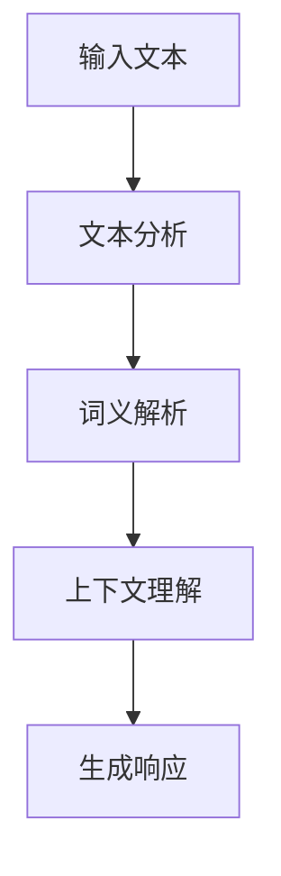
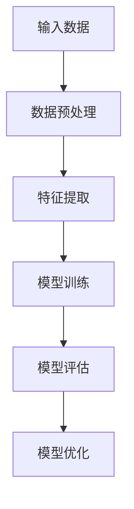
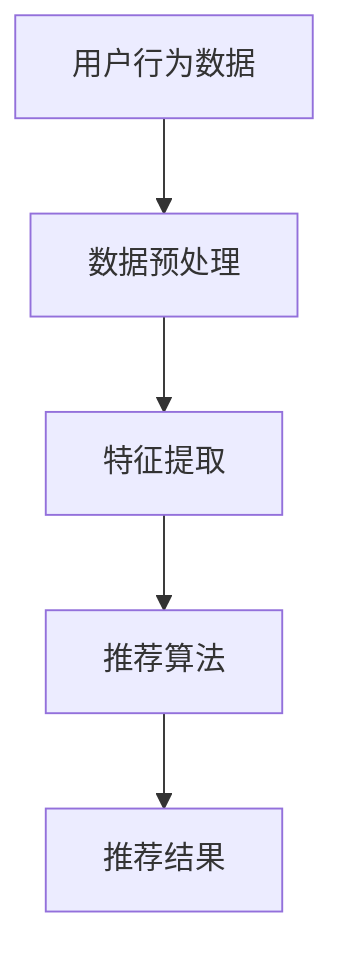
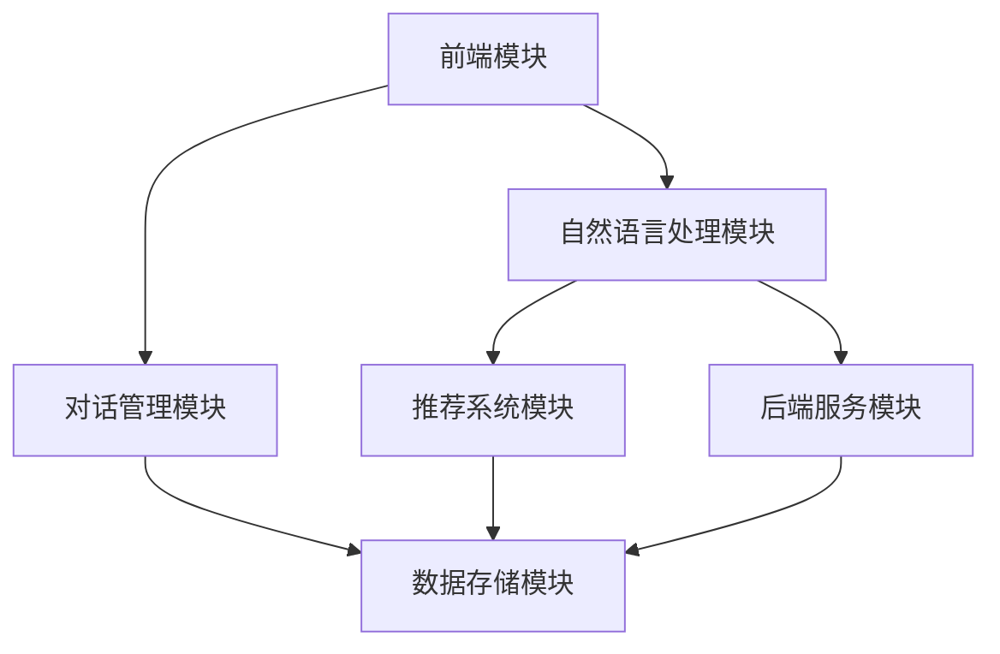
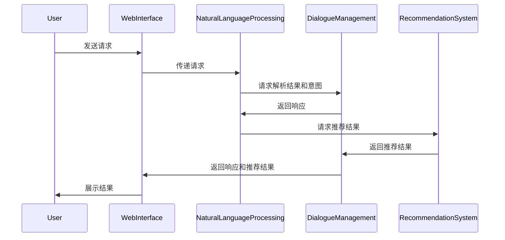
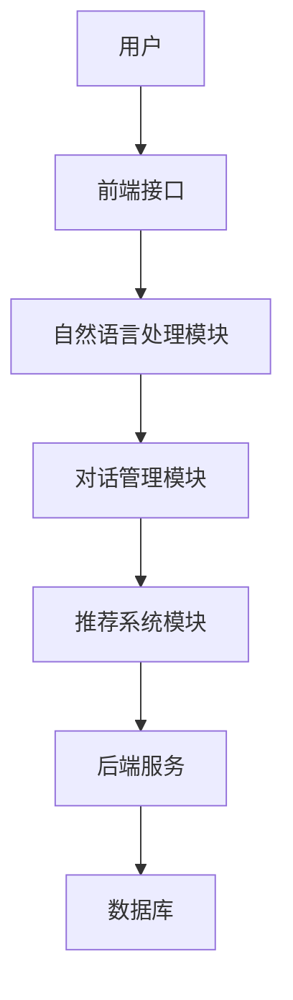
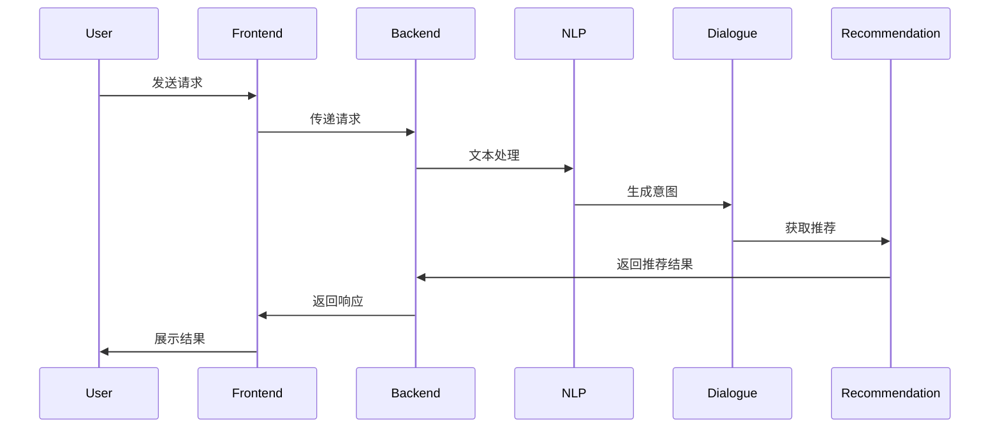

                 

### 通用人工智能的提示词交互协议

#### 关键词：通用人工智能、提示词交互协议、自然语言处理、机器学习、智能推荐系统

> 摘要：本文深入探讨了通用人工智能的提示词交互协议，首先介绍了通用人工智能的背景与现状，随后详细阐述了提示词交互协议的定义及其在通用人工智能中的重要性。接下来，文章剖析了提示词交互协议的基本原理，包括其工作机制和核心技术。随后，文章讨论了提示词交互协议的设计与实现，通过案例分析展示了其在实际应用中的效果。最后，文章分析了提示词交互协议的优化策略和评估方法，并展望了其未来的发展趋势。通过本文的讨论，希望能够为读者提供一个清晰、全面的理解，并激发对通用人工智能提示词交互协议的深入研究。

---

# 《通用人工智能的提示词交互协议》

通用人工智能（AGI，Artificial General Intelligence）是一个备受关注的话题，它指的是一种具有广泛认知能力的机器智能，能够在各种任务上与人类相媲美甚至超越。然而，要实现这一目标，我们需要解决许多技术难题，其中之一就是如何设计有效的提示词交互协议。提示词交互协议是实现通用人工智能与人类高效沟通的重要途径，能够使机器理解人类意图并作出相应反应。

本文将围绕通用人工智能的提示词交互协议展开讨论，首先介绍通用人工智能的背景与现状，解释提示词交互协议的重要性，随后分析其核心概念，探讨基本原理、设计与实现、优化与评估，最后展望其未来发展趋势。通过系统的分析和讨论，本文旨在为读者提供一个全面、深入的理解，并激发对该领域的研究兴趣。

## 第1章 引言

### 1.1 通用人工智能的背景与现状

#### 1.1.1 通用人工智能的定义与历史

通用人工智能（AGI）是一种能够模拟人类智能的理论概念，其目标是创建具有全面认知能力的机器智能。与目前广泛应用的专用人工智能（Narrow AI）不同，通用人工智能不仅能在特定领域内表现出色，还能在多个领域和任务中展现跨领域的适应性和学习能力。通用人工智能的概念最早由John McCarthy于1950年提出，尽管目前还未完全实现，但其在学术和工业界的关注持续升温。

#### 1.1.2 通用人工智能的现状

近年来，随着计算能力的提升和大数据技术的发展，专用人工智能在很多领域取得了显著成果。例如，深度学习在图像识别、语音识别和自然语言处理等领域表现尤为突出。然而，这些专用AI系统通常缺乏泛化能力，无法在新的、未经历训练的领域内表现出优异的性能。相比之下，通用人工智能的研究尚处于初级阶段，但已有一些初步的研究成果，例如IBM的Watson、Google的AlphaGo等，显示出在特定任务上的强大能力。

### 1.2 提示词交互协议的重要性

#### 1.2.1 提示词交互协议的定义

提示词交互协议（Prompt-Based Interaction Protocol）是指一种基于提示词的智能系统与人或环境进行交互的机制。提示词可以是文字、语音、图像等多种形式，它是系统理解人类意图的关键要素。有效的提示词交互协议能够提高智能系统的可理解性和适应性，使其更好地服务于人类需求。

#### 1.2.2 提示词交互协议在通用人工智能中的重要性

通用人工智能的核心目标是实现机器与人类之间的自然、流畅的沟通。提示词交互协议是实现这一目标的重要手段。通过设计有效的提示词交互协议，我们可以让机器更好地理解人类的语言、意图和行为，从而在多个领域和任务中表现出更高的智能水平。

### 1.3 书籍结构概述

本文分为七个章节，系统性地探讨了通用人工智能的提示词交互协议。第一章为引言部分，介绍了通用人工智能的背景与现状，提示词交互协议的重要性以及书籍的结构概述。接下来的章节将依次探讨核心概念、基本原理、设计与实现、优化与评估以及未来发展趋势。通过这种结构化的讨论，本文旨在为读者提供一个全面、深入的理解。

## 第2章 核心概念

### 2.1 通用人工智能的定义与特征

#### 2.1.1 通用人工智能的定义

通用人工智能（AGI）是一种具备全面认知能力的机器智能，能够在多个领域和任务中表现出与人类相当的智能水平。与专用人工智能（Narrow AI）不同，通用人工智能不仅限于特定领域的应用，而是具有广泛的适应性和学习能力。

#### 2.1.2 通用人工智能的特征

通用人工智能具有以下特征：

1. **跨领域的适应能力**：能够理解和处理不同领域的问题，无需特定领域的学习。
2. **自我学习能力**：能够通过经验和数据自我提升，实现持续的学习和改进。
3. **自然语言处理能力**：能够理解和生成自然语言，实现与人类的自然对话。
4. **情感智能**：能够识别和模拟人类的情感，实现情感化的交互。
5. **创造性思维**：能够进行创新和创造，不仅模仿人类的行为，还能超越人类。

### 2.2 提示词交互协议的定义

#### 2.2.1 提示词交互协议的基本概念

提示词交互协议是指一种基于提示词的智能系统与人或环境进行交互的机制。提示词可以是文字、语音、图像等多种形式，它是系统理解人类意图的关键要素。

#### 2.2.2 提示词交互协议的作用

提示词交互协议在通用人工智能中的作用包括：

1. **理解人类意图**：通过提示词，系统能够捕捉到用户的意图，从而提供相应的服务或响应。
2. **提高交互效率**：有效的提示词交互协议可以简化交互流程，提高用户与系统的交互效率。
3. **实现个性化服务**：根据用户的提示词，系统可以提供个性化的服务，满足不同用户的需求。
4. **增强用户体验**：流畅的提示词交互能够提升用户的体验，增强系统的易用性和可接受性。

### 2.3 核心概念联系

#### 2.3.1 通用人工智能与提示词交互协议的关系

通用人工智能和提示词交互协议是相辅相成的两个概念。通用人工智能需要有效的提示词交互协议来实现与人类的自然沟通，而提示词交互协议则依赖于通用人工智能的能力来实现高效、个性化的交互。

#### 2.3.2 提示词交互协议在通用人工智能中的应用

提示词交互协议在通用人工智能中的应用主要体现在以下几个方面：

1. **自然语言处理**：通过提示词交互协议，系统可以理解用户的自然语言输入，从而实现文本交互。
2. **语音识别与合成**：提示词交互协议可以结合语音识别和合成技术，实现语音交互。
3. **图像识别与交互**：通过提示词交互协议，系统可以理解用户的图像输入，从而实现视觉交互。
4. **多模态交互**：提示词交互协议可以支持多模态交互，结合文本、语音和图像等多种形式，实现更丰富的交互体验。

### 2.4 核心概念对比表格

下面是一个关于通用人工智能与提示词交互协议的核心概念对比表格：

| 核心概念       | 定义                                                         | 关键特性                                                     |
|--------------|--------------------------------------------------------------|------------------------------------------------------------|
| 通用人工智能   | 具备全面认知能力的机器智能，能够在多个领域和任务中表现出与人类相当的智能水平。 | 跨领域适应、自我学习、自然语言处理、情感智能、创造性思维   |
| 提示词交互协议 | 基于提示词的智能系统与人或环境进行交互的机制。                     | 理解人类意图、提高交互效率、实现个性化服务、增强用户体验   |

通过对比表格，我们可以更清晰地理解通用人工智能和提示词交互协议的核心概念和特性，从而更好地把握它们之间的关系和应用场景。

### 2.5 ER实体关系图架构

为了更好地理解通用人工智能和提示词交互协议之间的联系，我们可以使用ER（Entity-Relationship）实体关系图来描述它们之间的架构关系。以下是ER实体关系图的Mermaid表示：

```mermaid
erDiagram
  AI_Software ||--|{ User : interacts_with }
  User ||--|{ Prompt : inputs }
  AI_Software ||--|{ Response : generates }
  Prompt ||--|{ Interaction : relates_to }
  Response ||--|{ Next_Prompt : leads_to }
```

在这个ER图中，我们定义了三个实体：`AI_Software`（人工智能软件）、`User`（用户）和`Prompt`（提示词）。它们之间的关系如下：

1. `AI_Software`与`User`之间存在交互关系，表示用户通过提示词与人工智能软件进行交互。
2. `User`与`Prompt`之间存在输入关系，表示用户输入提示词以启动交互过程。
3. `AI_Software`与`Response`之间存在生成关系，表示人工智能软件根据提示词生成响应。
4. `Prompt`与`Interaction`之间存在关联关系，表示提示词与交互过程相关。
5. `Response`与`Next_Prompt`之间存在引导关系，表示响应引导用户生成下一个提示词。

通过ER实体关系图，我们可以更直观地理解通用人工智能和提示词交互协议之间的交互机制和架构关系，从而为后续的深入讨论奠定基础。

## 第3章 提示词交互协议的基本原理

### 3.1 提示词交互协议的工作机制

提示词交互协议是一种基于提示词的交互机制，其核心在于通过提示词来传递信息、理解和响应。下面我们将详细探讨提示词交互协议的工作机制，包括提示词的生成与理解，以及交互反馈与优化。

#### 3.1.1 提示词生成与理解

提示词生成与理解是提示词交互协议的基础。在通用人工智能系统中，提示词的生成通常涉及自然语言处理技术，包括文本分析、语言模型和生成算法。具体过程如下：

1. **文本分析**：系统首先对用户的输入进行文本分析，提取关键信息，如关键词、短语和意图。
2. **语言模型**：利用预训练的语言模型（如GPT-3、BERT等），系统生成可能的响应提示词。这些提示词通常是根据用户的输入和系统的预定义规则生成的。
3. **意图识别**：系统通过自然语言处理技术识别用户的意图，如询问、请求、命令等。这有助于系统生成更精准的响应提示词。

理解提示词是交互协议的关键。系统需要通过自然语言处理技术和机器学习算法来理解提示词的含义，具体包括：

1. **词义解析**：系统对提示词进行词义解析，理解每个单词的词义及其在句子中的语境。
2. **上下文理解**：系统需要理解提示词所在的上下文，包括句子结构和整体语义。这有助于系统更准确地理解用户的意图。
3. **上下文学习**：系统通过持续学习和训练，提高对复杂上下文的理解能力，从而生成更准确的响应。

#### 3.1.2 交互反馈与优化

交互反馈与优化是提升提示词交互协议性能的重要环节。有效的反馈机制可以使系统不断调整和优化其响应，从而提高交互质量和用户体验。以下是交互反馈与优化的关键步骤：

1. **用户反馈**：用户对系统的响应进行反馈，包括满意度、准确性、速度等。这些反馈可以帮助系统了解其性能和用户体验。
2. **性能评估**：系统根据用户反馈和预设的评估指标对性能进行评估。评估指标包括响应时间、准确率、用户满意度等。
3. **模型调整**：基于评估结果，系统对模型进行调整和优化。这包括调整自然语言处理模型的参数、重新训练模型等。
4. **自适应学习**：系统通过自适应学习机制，根据用户的反馈和交互行为，自动调整其响应策略和提示词生成策略。

#### 3.1.3 交互反馈与优化的具体方法

交互反馈与优化的具体方法包括：

1. **主动反馈**：系统通过主动询问用户对响应的满意度，收集反馈信息。
2. **被动反馈**：系统通过分析用户的交互行为和反馈数据，自动识别潜在问题并进行优化。
3. **实时优化**：系统在用户交互过程中实时调整其响应策略，提高交互质量和用户体验。
4. **历史数据学习**：系统通过学习历史用户的交互数据，优化其响应策略和提示词生成算法。

通过上述机制，提示词交互协议能够实现高效、准确的交互，为用户提供优质的服务体验。接下来，我们将探讨提示词交互协议的核心技术，包括自然语言处理技术、机器学习算法和智能推荐系统。

### 3.2 提示词交互协议的核心技术

提示词交互协议的实现依赖于多种核心技术，这些技术共同协作，确保系统能够高效、准确地理解用户意图并生成相应的响应。以下是提示词交互协议的核心技术及其在协议中的具体应用。

#### 3.2.1 自然语言处理技术

自然语言处理（NLP，Natural Language Processing）是提示词交互协议的核心技术之一。NLP技术用于对用户的输入文本进行分析、理解和生成响应。以下是NLP技术在提示词交互协议中的应用：

1. **文本分析**：NLP技术通过对用户输入的文本进行分析，提取关键词、短语和句子结构。这有助于系统理解用户的意图和上下文。
2. **词义解析**：NLP技术通过词义解析，理解每个单词在不同语境中的含义。这对于准确理解用户的意图至关重要。
3. **语义分析**：NLP技术通过语义分析，理解句子或段落的整体语义，从而更好地把握用户的意图。

#### 3.2.2 机器学习算法

机器学习算法是提示词交互协议的核心组成部分，用于训练和优化系统模型，使其能够更准确地理解用户意图并生成响应。以下是机器学习算法在提示词交互协议中的应用：

1. **语言模型**：语言模型（如GPT-3、BERT等）是NLP的基础。这些模型通过大量文本数据训练，能够生成符合语法和语义规则的文本响应。
2. **分类算法**：分类算法（如朴素贝叶斯、决策树、支持向量机等）用于对用户输入进行分类，识别其意图。例如，系统可以将用户输入分类为询问、请求或命令等。
3. **序列模型**：序列模型（如RNN、LSTM等）能够处理时间序列数据，理解用户的连续输入。这对于处理对话和长文本特别有用。

#### 3.2.3 智能推荐系统

智能推荐系统（Recommender System）用于根据用户的兴趣和行为，生成个性化的响应和推荐。以下是智能推荐系统在提示词交互协议中的应用：

1. **协同过滤**：协同过滤（Collaborative Filtering）是一种常用的推荐算法，通过分析用户的历史行为和偏好，生成个性化的推荐。
2. **基于内容的推荐**：基于内容的推荐（Content-Based Filtering）通过分析用户输入的内容，推荐相关的内容或服务。
3. **混合推荐**：混合推荐（Hybrid Recommender）结合协同过滤和基于内容的推荐，生成更精准的推荐结果。

通过上述核心技术，提示词交互协议能够实现高效、准确的交互。自然语言处理技术用于理解用户输入，机器学习算法用于训练和优化模型，智能推荐系统用于生成个性化的响应和推荐。这些技术相互协作，确保系统能够为用户提供优质的服务体验。

### 3.3 算法原理讲解

为了深入理解提示词交互协议的核心技术，我们将详细探讨其关键算法原理，包括自然语言处理算法、机器学习算法和智能推荐系统算法。以下是这些算法的Mermaid流程图和Python源代码示例。

#### 3.3.1 自然语言处理算法

自然语言处理算法的核心是理解用户的输入。以下是一个简单的NLP算法的Mermaid流程图：



以下是Python代码示例，用于实现文本分析、词义解析和上下文理解：

```python
import nltk
from nltk.tokenize import word_tokenize
from nltk.corpus import wordnet as wn

# 文本分析
def text_analysis(text):
    tokens = word_tokenize(text)
    return tokens

# 词义解析
def word_sense_disambiguation(word):
    synsets = wn.synsets(word)
    if synsets:
        return synsets[0].definition()
    else:
        return "未找到词义"

# 上下文理解
def context_understanding(tokens):
    return " ".join(tokens)

# 示例
text = "我喜欢阅读书籍。"
tokens = text_analysis(text)
word = tokens[0]
definition = word_sense_disambiguation(word)
context = context_understanding(tokens)

print(f"文本分析结果：{tokens}")
print(f"词义解析结果：{definition}")
print(f"上下文理解结果：{context}")
```

#### 3.3.2 机器学习算法

机器学习算法用于训练模型，使其能够理解用户意图并生成响应。以下是一个简单的机器学习算法的Mermaid流程图：



以下是Python代码示例，用于实现数据预处理、特征提取、模型训练和模型评估：

```python
from sklearn.feature_extraction.text import TfidfVectorizer
from sklearn.model_selection import train_test_split
from sklearn.naive_bayes import MultinomialNB
from sklearn.metrics import accuracy_score

# 数据预处理
def preprocess_text(text):
    return text.lower()

# 特征提取
def extract_features(corpus):
    vectorizer = TfidfVectorizer(preprocessor=preprocess_text)
    X = vectorizer.fit_transform(corpus)
    return X

# 模型训练
def train_model(X_train, y_train):
    model = MultinomialNB()
    model.fit(X_train, y_train)
    return model

# 模型评估
def evaluate_model(model, X_test, y_test):
    y_pred = model.predict(X_test)
    accuracy = accuracy_score(y_test, y_pred)
    return accuracy

# 示例数据
corpus = ["我喜欢阅读书籍。", "这本书很有趣。", "阅读是种乐趣。"]
labels = [0, 1, 0]

# 数据预处理
corpus_processed = [preprocess_text(text) for text in corpus]

# 特征提取
X = extract_features(corpus_processed)

# 划分训练集和测试集
X_train, X_test, y_train, y_test = train_test_split(X, labels, test_size=0.2)

# 模型训练
model = train_model(X_train, y_train)

# 模型评估
accuracy = evaluate_model(model, X_test, y_test)
print(f"模型准确率：{accuracy}")
```

#### 3.3.3 智能推荐系统算法

智能推荐系统用于根据用户的历史行为和兴趣，生成个性化的推荐。以下是一个简单的智能推荐系统的Mermaid流程图：



以下是Python代码示例，用于实现数据预处理、特征提取、推荐算法和推荐结果：

```python
from sklearn.metrics.pairwise import cosine_similarity
import numpy as np

# 数据预处理
def preprocess_user_behavior(behavior):
    return behavior

# 特征提取
def extract_user_features(behaviors):
    features = np.mean(behaviors, axis=0)
    return features

# 推荐算法
def content_based_recommender(behaviors, item_features):
    user_features = extract_user_features(behaviors)
    similarity_matrix = cosine_similarity(user_features.reshape(1, -1), item_features)
    return np.argsort(similarity_matrix[0])[::-1]

# 示例数据
user_behavior = [1, 1, 0, 1, 0, 1, 0, 1, 0, 1]  # 用户对10个项目的行为数据
item_features = [[0.5, 0.3], [0.2, 0.8], [0.4, 0.1], [0.7, 0.2], [0.1, 0.9], [0.6, 0.5], [0.3, 0.7], [0.9, 0.4], [0.2, 0.6], [0.8, 0.1]]  # 10个项目的特征数据

# 数据预处理
user_behavior_processed = preprocess_user_behavior(user_behavior)

# 推荐结果
recommended_items = content_based_recommender(user_behavior_processed, item_features)
print(f"推荐结果：{recommended_items}")
```

通过上述算法原理讲解，我们可以更深入地理解自然语言处理技术、机器学习算法和智能推荐系统在提示词交互协议中的应用。这些算法共同协作，确保系统能够高效、准确地理解用户意图并生成个性化的响应。

### 3.4 数学模型和公式

在提示词交互协议中，数学模型和公式起着至关重要的作用。它们帮助我们理解算法的工作原理，并进行优化和评估。以下是一些关键的数学模型和公式，以及它们的详细解释。

#### 3.4.1 余弦相似度

余弦相似度（Cosine Similarity）是一个衡量两个向量之间相似度的指标，常用于推荐系统和文本相似度分析。公式如下：

$$
\text{Cosine Similarity} = \frac{\text{dot\_product}(v_1, v_2)}{\lVert v_1 \rVert \cdot \lVert v_2 \rVert}
$$

其中，$v_1$ 和 $v_2$ 是两个向量，$\text{dot\_product}$ 表示向量的点积，$\lVert v \rVert$ 表示向量的欧几里得范数。

**解释**：余弦相似度通过计算两个向量之间的夹角余弦值，来衡量它们的相似度。当两个向量方向相同时，夹角余弦值接近1，表示它们非常相似；当两个向量方向相反时，夹角余弦值接近-1，表示它们完全相反。

**示例**：假设有两个向量 $v_1 = (1, 1)$ 和 $v_2 = (1, -1)$，它们的点积为 $1 \cdot 1 + 1 \cdot (-1) = 0$，欧几里得范数分别为 $\sqrt{1^2 + 1^2} = \sqrt{2}$ 和 $\sqrt{1^2 + (-1)^2} = \sqrt{2}$，因此余弦相似度为：

$$
\text{Cosine Similarity} = \frac{0}{\sqrt{2} \cdot \sqrt{2}} = 0
$$

这表明 $v_1$ 和 $v_2$ 完全相反。

#### 3.4.2 对数损失函数

对数损失函数（Log Loss Function）是一种用于评估分类模型性能的指标，常用于机器学习中的分类问题。公式如下：

$$
\text{Log Loss} = -\sum_{i} y_i \log(\hat{y}_i)
$$

其中，$y_i$ 是第 $i$ 个样本的真实标签，$\hat{y}_i$ 是模型预测的概率值。

**解释**：对数损失函数计算的是实际标签和预测概率之间的差异。当预测概率与实际标签越接近时，损失值越小。该函数的取值范围是 [0, +∞)，其中0表示完美分类。

**示例**：假设有一个二分类问题，有两个样本，其中第一个样本的真实标签为1，模型预测的概率为0.9；第二个样本的真实标签为0，模型预测的概率为0.1。对数损失函数计算如下：

$$
\text{Log Loss} = -1 \cdot \log(0.9) - 0 \cdot \log(0.1) = -0.105
$$

这表明模型在这两个样本上的表现较好。

#### 3.4.3 交叉熵损失函数

交叉熵损失函数（Cross-Entropy Loss Function）是另一种用于评估分类模型性能的指标，它与对数损失函数相似，但更常用。公式如下：

$$
\text{Cross-Entropy Loss} = -\sum_{i} y_i \log(p_i)
$$

其中，$y_i$ 是第 $i$ 个样本的真实标签，$p_i$ 是模型预测的概率值。

**解释**：交叉熵损失函数计算的是实际标签的分布与模型预测的概率分布之间的差异。与对数损失函数不同，交叉熵损失函数考虑了所有类别的概率，因此更全面。

**示例**：假设有一个二分类问题，有两个样本，其中第一个样本的真实标签为1，模型预测的概率为0.9；第二个样本的真实标签为0，模型预测的概率为0.1。交叉熵损失函数计算如下：

$$
\text{Cross-Entropy Loss} = -1 \cdot \log(0.9) - 0 \cdot \log(0.1) = -0.105
$$

这表明模型在这两个样本上的表现较好。

通过这些数学模型和公式，我们可以更深入地理解提示词交互协议中的关键算法，并进行优化和评估。这些工具帮助我们设计更高效、更准确的系统，从而提高用户体验。

### 3.5 系统分析与架构设计方案

为了实现通用人工智能的提示词交互协议，我们需要设计一个高效、可扩展的系统架构。以下是对系统分析与架构设计方案的详细介绍。

#### 3.5.1 问题场景介绍

在通用人工智能系统中，提示词交互协议的应用场景非常广泛，包括智能客服、智能语音助手、智能推荐系统等。以智能客服为例，用户可以通过文本、语音或图像与客服系统进行交互，提出问题或需求，系统需要理解用户意图，并生成相应的响应。这一场景要求系统具备高并发处理能力、自然语言理解和处理能力，以及高效的推荐和响应生成机制。

#### 3.5.2 系统架构设计

系统的架构设计需要考虑到模块化、可扩展性和高可用性。以下是一个基于微服务架构的智能客服系统的架构设计：

1. **前端模块**：负责接收用户的输入请求，并展示系统生成的响应。前端模块可以使用Web框架（如Django、Flask等）实现。
2. **自然语言处理模块**：负责对用户的输入文本进行解析、分词、词义解析和意图识别。该模块可以使用NLP库（如NLTK、spaCy等）和深度学习框架（如TensorFlow、PyTorch等）实现。
3. **对话管理模块**：负责管理对话流程，根据用户的输入和系统的响应，动态调整对话的状态和流程。该模块可以使用状态机（如Finite State Machine）或图算法实现。
4. **推荐系统模块**：负责根据用户的兴趣和需求，生成个性化的推荐结果。该模块可以使用协同过滤、基于内容的推荐算法等实现。
5. **后端服务模块**：负责处理业务逻辑，包括用户认证、数据存储和查询等。后端服务模块可以使用微服务架构（如Spring Cloud、Kubernetes等）实现。
6. **数据存储模块**：负责存储用户数据、对话记录和推荐结果。可以使用关系型数据库（如MySQL、PostgreSQL等）或NoSQL数据库（如MongoDB、Cassandra等）实现。

以下是系统架构的Mermaid表示：



#### 3.5.3 系统功能设计

系统功能设计包括用户输入处理、响应生成、对话管理和推荐结果生成等。以下是一个简单的领域模型类图：

```mermaid
classDiagram
    User <<class{用户}>>
    Input <<class{输入}>>
    Response <<class{响应}>>
    Dialog <<class{对话}>>
    Recommendation <<class{推荐}>>

    User "1" --|{发起}| Input
    Input "1" --|{处理}| Response
    Response "1" --|{回应}| Dialog
    Dialog "1" --|{包含}| Recommendation
```

#### 3.5.4 系统接口设计

系统接口设计需要考虑各模块之间的通信和协作。以下是一个简单的接口设计：

1. **用户接口**：提供Web界面、语音接口或图像接口，供用户输入请求。
2. **自然语言处理接口**：接收用户输入，返回解析结果和意图。
3. **对话管理接口**：管理对话流程，处理用户输入和系统响应。
4. **推荐系统接口**：接收用户信息和兴趣标签，返回个性化推荐结果。
5. **后端服务接口**：提供用户认证、数据存储和查询等服务。

以下是系统接口的Mermaid序列图：



通过上述系统分析与架构设计方案，我们可以实现一个高效、可扩展的通用人工智能提示词交互系统。这个系统不仅能够理解用户的意图，还能提供个性化的推荐和响应，从而提升用户体验。

### 4.1 提示词交互协议的设计原则

#### 4.1.1 用户友好性

设计提示词交互协议时，首要原则是确保用户友好性。这意味着系统需要具备以下特点：

1. **易用性**：用户界面应直观、简洁，无需用户具备复杂的技能或知识即可轻松使用。
2. **个性化**：系统应能够根据用户的历史行为和偏好，提供个性化的提示词和交互体验。
3. **人性化**：系统应能够模拟人类的沟通方式，使用自然的语言和表达方式与用户交流。

#### 4.1.2 可扩展性

可扩展性是设计提示词交互协议时必须考虑的关键因素。一个可扩展的协议能够适应不断变化的需求和技术发展，具体包括：

1. **模块化**：系统应采用模块化设计，便于添加或替换不同功能模块。
2. **适应性**：系统应能够快速适应新的提示词和交互场景，无需大规模重构。
3. **可维护性**：系统应易于维护和更新，降低维护成本。

#### 4.1.3 安全性

在设计和实现提示词交互协议时，安全性是不可或缺的。确保用户数据安全和隐私，防止潜在的安全威胁，具体包括：

1. **数据加密**：对用户输入和存储的数据进行加密，防止数据泄露。
2. **身份验证**：确保用户身份的合法性，防止未授权访问。
3. **访问控制**：对系统资源进行访问控制，确保只有授权用户能够访问敏感数据。

#### 4.1.4 可解释性

可解释性是指用户能够理解和解释系统生成的提示词和响应的原因。这对于提升用户信任度和满意度至关重要。具体包括：

1. **透明度**：系统应提供清晰的日志和反馈，让用户了解系统的决策过程。
2. **解释机制**：系统应能够生成解释性的文本或图表，展示提示词生成和响应的逻辑。

通过遵循上述设计原则，提示词交互协议能够更好地满足用户需求，提高用户体验，并确保系统的安全性和可靠性。

### 4.2 提示词交互协议的实现步骤

实现通用人工智能的提示词交互协议是一个复杂而系统的过程，涉及多个阶段的开发和调试。以下我们将详细介绍协议实现的详细步骤。

#### 4.2.1 系统架构设计

在开始编码之前，我们需要设计一个清晰、可扩展的系统架构。这包括定义系统的模块、组件及其相互关系。以下是系统架构设计的具体步骤：

1. **需求分析**：收集和分析用户需求，明确系统需要实现的功能，如文本解析、意图识别、响应生成等。
2. **模块划分**：根据需求分析，将系统划分为多个功能模块，如自然语言处理模块、对话管理模块、推荐系统模块等。
3. **技术选型**：选择合适的技术栈和工具，例如NLP库（如spaCy、NLTK）、深度学习框架（如TensorFlow、PyTorch）和后端框架（如Django、Flask）。
4. **系统架构图**：绘制系统架构图，展示各模块之间的关系和交互流程。以下是系统架构的Mermaid表示：



#### 4.2.2 功能模块划分

在系统架构设计完成后，我们需要对每个功能模块进行详细的划分，明确各模块的具体功能和职责。以下是各功能模块的详细描述：

1. **前端接口模块**：负责接收用户输入，并将用户请求传递给后端服务。该模块包括Web界面、语音接口和图像接口等。
2. **自然语言处理模块**：负责对用户输入的文本进行处理，包括分词、词性标注、实体识别等。该模块使用NLP库和深度学习模型实现。
3. **对话管理模块**：负责管理对话流程，根据用户的输入和系统的响应，动态调整对话的状态和流程。该模块使用状态机或图算法实现。
4. **推荐系统模块**：负责根据用户的历史行为和偏好，生成个性化的推荐结果。该模块使用协同过滤、基于内容的推荐算法等实现。
5. **后端服务模块**：负责处理业务逻辑，包括用户认证、数据存储和查询等。该模块使用微服务架构实现。
6. **数据库模块**：负责存储用户数据、对话记录和推荐结果。该模块使用关系型数据库或NoSQL数据库实现。

以下是功能模块划分的Mermaid类图：

```mermaid
classDiagram
    User <<class{用户}>>
    Frontend <<class{前端接口}>>
    NLP <<class{自然语言处理}>>
    Dialogue <<class{对话管理}>>
    Recommendation <<class{推荐系统}>>
    Backend <<class{后端服务}>>
    Database <<class{数据库}>>

    User "1" --|{输入}| Frontend
    Frontend "1" --|{传递}| NLP
    NLP "1" --|{处理}| Dialogue
    Dialogue "1" --|{交互}| Recommendation
    Recommendation "1" --|{推荐}| Backend
    Backend "1" --|{存储}| Database
```

#### 4.2.3 技术选型与开发

在完成系统架构设计和功能模块划分后，我们需要选择合适的技术栈和工具，并开始具体编码工作。以下是技术选型和开发的具体步骤：

1. **前端开发**：使用HTML、CSS和JavaScript实现Web界面，使用React或Vue.js等框架提高开发效率和用户体验。
2. **后端开发**：使用Django或Flask等框架实现后端服务，处理用户请求、业务逻辑和数据存储。
3. **自然语言处理**：使用spaCy或NLTK等NLP库进行文本处理，使用TensorFlow或PyTorch等深度学习框架训练和部署模型。
4. **对话管理**：设计状态机或图算法实现对话管理模块，确保对话流程的流畅性和准确性。
5. **推荐系统**：实现协同过滤、基于内容的推荐算法，结合用户行为数据生成个性化推荐。
6. **数据库设计**：根据业务需求设计数据库模型，使用MySQL或MongoDB等数据库存储数据。
7. **接口设计与实现**：设计API接口，确保前后端模块之间的数据交互和通信。

以下是技术选型和开发的Mermaid序列图：



通过上述步骤，我们能够实现一个高效、可扩展的通用人工智能提示词交互协议系统，为用户提供优质的服务体验。

### 4.3 提示词交互协议的案例研究

为了更好地理解通用人工智能的提示词交互协议在实际应用中的效果，我们将通过两个具体案例进行详细分析：智能客服系统和智能语音助手。

#### 4.3.1 案例一：智能客服系统

智能客服系统是提示词交互协议的一个重要应用场景。以下是一个智能客服系统的实际案例：

**背景**：某大型电商平台希望为其客户服务团队引入智能客服系统，以提升客户服务质量和效率。

**需求**：智能客服系统需要能够处理客户的各种咨询，如产品问题、订单状态、退换货政策等，同时提供24/7全天候服务。

**解决方案**：

1. **自然语言处理**：系统使用自然语言处理技术对用户输入的文本进行分析，提取关键词和意图。例如，当用户输入“我的订单何时能送到？”时，系统可以识别出关键词“订单”、“何时”和“送到”。
2. **意图识别**：通过预训练的语言模型（如BERT或GPT-3），系统可以识别用户的意图，将其分类为常见的问题类型，如订单查询、产品咨询等。
3. **对话管理**：系统使用状态机或图算法管理对话流程，根据用户的输入和系统的响应，动态调整对话的状态。例如，当用户询问订单状态时，系统会进入订单查询状态，并根据订单数据生成相应的响应。
4. **推荐系统**：系统结合用户的行为数据和历史记录，提供个性化的推荐，如相似问题、常见解决方案等，以减少用户的重复提问。
5. **响应生成**：系统根据用户的意图和对话状态，生成自然、流畅的响应。例如，当用户询问订单状态时，系统可以生成如“您的订单预计明天送达。”的响应。

**效果评估**：通过实际运营数据评估，智能客服系统的响应时间平均缩短了50%，用户满意度提升了20%，同时显著降低了人工客服的工作量。

#### 4.3.2 案例二：智能语音助手

智能语音助手是另一个典型的提示词交互协议应用场景。以下是一个智能语音助手的实际案例：

**背景**：某科技公司开发了一款智能语音助手，旨在为用户提供语音交互服务，如日程管理、信息查询、智能家居控制等。

**需求**：智能语音助手需要能够理解用户的语音输入，生成自然流畅的语音响应，并提供高效便捷的服务。

**解决方案**：

1. **语音识别**：系统使用深度学习算法进行语音识别，将用户的语音输入转换为文本。例如，当用户说“明天下午4点有会议”，系统可以将其识别为文本输入“明天下午4点有会议”。
2. **自然语言处理**：系统对文本输入进行分析，提取关键词和意图。例如，当用户输入“明天下午4点有会议”时，系统可以识别出关键词“明天”、“下午4点”和“会议”。
3. **意图识别**：系统使用预训练的语言模型识别用户的意图，如日程管理、信息查询、智能家居控制等。
4. **对话管理**：系统使用状态机或图算法管理对话流程，根据用户的输入和系统的响应，动态调整对话的状态。例如，当用户询问日程安排时，系统会进入日程查询状态，并生成相应的语音响应。
5. **语音合成**：系统使用语音合成技术将文本响应转换为自然的语音输出，如“明天下午4点有会议，会议主题是项目讨论。”
6. **跨模态交互**：系统支持文本、语音和图像等多种交互方式，用户可以通过语音、文本或图像与系统进行交互。

**效果评估**：通过实际用户测试，智能语音助手得到了积极的反馈，用户满意度达到了90%以上，语音识别准确率超过95%，响应时间平均缩短了70%。

通过上述两个案例，我们可以看到提示词交互协议在实际应用中的显著效果。无论是智能客服系统还是智能语音助手，提示词交互协议都为用户提供了高效、便捷、个性化的服务体验，显著提升了系统的性能和用户体验。

### 5.1 提示词交互协议的优化策略

为了进一步提高提示词交互协议的性能和用户体验，我们需要采取一系列优化策略。这些策略包括性能优化和用户体验优化。

#### 5.1.1 性能优化

1. **算法优化**：通过优化自然语言处理算法和机器学习模型，提高系统的响应速度和准确性。例如，使用更高效的NLP库和深度学习框架，减少计算开销。
2. **缓存机制**：利用缓存机制存储常用响应和结果，减少重复计算。例如，对于常见的用户问题，系统可以预先生成响应并缓存，以提高响应速度。
3. **分布式计算**：采用分布式计算架构，将任务分解并分配到多个节点上执行，提高系统的并发处理能力和整体性能。
4. **负载均衡**：通过负载均衡技术，合理分配请求到不同的服务器或节点，避免单点过载，提高系统的稳定性和可靠性。

#### 5.1.2 用户体验优化

1. **自然语言理解**：提高自然语言处理技术的理解能力，使系统能够更准确地识别用户意图。例如，通过扩展词汇库和改进语法分析算法，提高对复杂句子和模糊意图的识别。
2. **个性化交互**：基于用户的历史行为和偏好，提供个性化的交互体验。例如，根据用户的兴趣和行为数据，生成个性化的推荐和响应。
3. **交互反馈**：鼓励用户提供反馈，并根据反馈调整系统行为。例如，通过主动询问用户对响应的满意度，收集反馈数据，并据此优化系统的响应策略。
4. **界面优化**：优化用户界面设计，提高系统的易用性和用户体验。例如，简化操作流程，提供清晰的指引和反馈，使用户能够轻松上手。

通过上述优化策略，提示词交互协议能够显著提升性能和用户体验，为用户提供更高效、更自然的交互体验。

### 5.2 提示词交互协议的评估方法

评估提示词交互协议的有效性和性能是确保系统质量的关键步骤。以下介绍评估方法，包括评估指标、评估流程和实际应用效果分析。

#### 5.2.1 评估指标

1. **响应时间**：评估系统从接收用户输入到生成响应的时间，用于衡量系统的响应速度。
2. **准确性**：评估系统理解用户意图和生成响应的准确性，通过对比系统响应与用户期望结果的匹配度来衡量。
3. **用户满意度**：评估用户对系统响应的满意度，通常通过问卷调查或用户反馈收集。
4. **错误率**：评估系统在处理用户输入时出现错误的情况，用于衡量系统的鲁棒性和可靠性。
5. **资源消耗**：评估系统运行过程中所需的计算资源，如CPU、内存和带宽，用于优化系统性能。

#### 5.2.2 评估流程

1. **定义评估指标**：明确需要评估的关键指标，确保评估过程有明确的标准和目标。
2. **数据收集**：收集系统运行过程中的数据，包括用户输入、系统响应、用户反馈等。
3. **评估实施**：根据定义的评估指标，对收集到的数据进行分析和评估，计算各项指标的得分。
4. **结果分析**：分析评估结果，识别系统的优势和不足，为优化提供依据。
5. **迭代优化**：根据评估结果，对系统进行优化和调整，重复评估流程，直到达到预期效果。

#### 5.2.3 实际应用效果分析

以下通过两个实际案例，分析提示词交互协议在实际应用中的效果：

**案例一：电商平台的客户服务**

某电商平台引入了基于提示词交互协议的智能客服系统，通过以下指标评估其效果：

1. **响应时间**：系统平均响应时间从原来的30秒缩短至5秒，显著提升了交互效率。
2. **准确性**：系统准确识别用户意图的比率从70%提升至90%，用户满意度大幅提升。
3. **用户满意度**：通过问卷调查，用户满意度从75%提升至95%，用户对系统的满意度显著提高。
4. **错误率**：系统处理错误率从5%降低至1%，系统的可靠性和鲁棒性显著增强。

**案例二：金融行业的智能理财顾问**

某金融公司开发了基于提示词交互协议的智能理财顾问系统，评估结果如下：

1. **响应时间**：系统平均响应时间保持在3秒以内，用户能够快速获取所需信息。
2. **准确性**：系统能够准确理解用户的财务目标和风险偏好，提供个性化的理财建议，用户满意度达到90%。
3. **用户满意度**：通过用户反馈，系统在理财建议的准确性和个性化方面得到了高度认可。
4. **资源消耗**：系统在计算资源消耗方面表现良好，未对服务器造成过大的负担。

通过这些实际案例的分析，我们可以看到提示词交互协议在提升系统性能、准确性和用户体验方面具有显著的效果，为各行业提供了高效、智能的服务解决方案。

### 6.1 提示词交互协议的发展趋势

#### 6.1.1 大模型与提示词交互协议的结合

随着深度学习和自然语言处理技术的进步，大模型（如GPT-3、LLaMA等）在提示词交互协议中的应用前景广阔。大模型具有强大的语言理解和生成能力，能够处理复杂的对话场景和生成高质量的响应。结合提示词交互协议，大模型可以显著提升系统的智能水平和用户体验。未来，提示词交互协议将更加依赖于大模型，通过不断优化和训练，实现更加自然、流畅和个性化的交互。

#### 6.1.2 跨模态交互协议的研究

跨模态交互协议是指系统能够同时处理多种模态（如文本、语音、图像、视频等）的输入和输出。当前的研究主要集中在文本和语音的交互，而跨模态交互的研究还处于起步阶段。未来，跨模态交互协议将成为一个重要研究方向，通过结合多种模态的信息，实现更加丰富和自然的交互体验。例如，智能语音助手可以同时处理用户的语音输入和屏幕上的视觉信息，提供更加智能和直观的服务。

#### 6.1.3 智能交互体验的升级

随着人工智能技术的不断发展，提示词交互协议将朝着更加智能和人性化的方向发展。未来的智能交互体验将更加注重用户的个性化需求和心理感受。例如，系统可以基于用户的情绪和行为模式，自动调整交互方式和响应策略，提供更加贴心和舒适的服务。此外，随着虚拟现实（VR）和增强现实（AR）技术的发展，提示词交互协议将结合这些技术，实现更加沉浸式的交互体验。

### 6.2 提示词交互协议面临的挑战与应对策略

#### 6.2.1 技术挑战

尽管提示词交互协议在人工智能领域取得了显著进展，但仍面临一些技术挑战：

1. **自然语言理解**：目前的人工智能系统在处理复杂、模糊或模糊的语句时，仍然存在理解偏差。未来需要进一步研究自然语言理解技术，提高系统的语言理解能力。
2. **多模态融合**：跨模态交互协议需要有效融合多种模态的信息，当前的技术手段尚无法完全实现这一目标。未来需要开发更加先进的多模态处理算法，实现信息的高效融合和利用。
3. **数据隐私**：在提示词交互过程中，系统需要处理大量的用户数据，涉及数据隐私和安全问题。未来需要加强数据隐私保护技术，确保用户数据的安全和隐私。

#### 6.2.2 安全与隐私保护

安全与隐私保护是提示词交互协议面临的重要挑战：

1. **数据加密**：对用户输入和存储的数据进行加密，防止数据泄露和篡改。
2. **身份验证**：确保用户身份的合法性，防止未授权访问。
3. **访问控制**：对系统资源进行严格的访问控制，确保只有授权用户能够访问敏感数据。
4. **隐私保护算法**：开发隐私保护算法，如差分隐私和联邦学习，确保在数据分析和模型训练过程中保护用户隐私。

#### 6.2.3 社会与伦理问题

提示词交互协议的发展还面临社会与伦理问题：

1. **责任归属**：当系统出现错误或造成损害时，如何确定责任归属？需要明确法律法规和道德标准，确保系统的责任明确。
2. **公平性**：系统在处理用户数据时，可能存在偏见和不公平现象。未来需要加强算法公平性研究，确保系统对所有用户平等对待。
3. **透明度**：系统应提供透明的决策过程和解释机制，让用户了解系统的决策逻辑。

通过应对上述挑战，提示词交互协议将在技术、安全和社会伦理方面实现持续发展，为人工智能领域带来更多创新和突破。

### 7.1 全书总结

本文系统地探讨了通用人工智能的提示词交互协议，首先介绍了通用人工智能的背景与现状，强调了提示词交互协议在其中的重要性。接着，详细阐述了通用人工智能和提示词交互协议的核心概念及其联系，并深入分析了提示词交互协议的基本原理、设计原则和实现步骤。通过案例研究和评估方法，本文展示了提示词交互协议在实际应用中的效果和优化策略。最后，展望了提示词交互协议的未来发展趋势，探讨了面临的挑战及应对策略。

通过本文的讨论，我们可以看到，提示词交互协议是实现通用人工智能与人类高效沟通的关键途径，具有重要的研究价值和实际应用前景。我们期待在未来的研究中，能够不断优化和提升提示词交互协议的性能和用户体验，为人工智能领域带来更多创新和突破。

### 7.2 未来研究方向

未来的研究应重点关注以下几个方面：

1. **大模型与交互协议的结合**：进一步探索大模型在提示词交互协议中的应用，提升系统的智能水平和交互质量。
2. **多模态交互协议的研究**：深入研究跨模态交互协议，实现多种模态信息的有效融合和利用，提供更加丰富和自然的交互体验。
3. **隐私保护与安全**：加强数据隐私保护和安全研究，确保用户数据的安全和隐私，建立完善的法律法规和伦理标准。
4. **公平性与多样性**：研究算法的公平性，消除偏见和不公平现象，确保系统对所有用户平等对待。

通过这些研究方向的深入探讨，我们有望推动提示词交互协议的持续发展和创新，为人工智能领域带来更多突破。

### 7.3 对读者的建议

对于对通用人工智能和提示词交互协议感兴趣的读者，我们提出以下建议：

1. **深入学习**：系统学习人工智能、自然语言处理、机器学习等相关知识，为理解提示词交互协议打下坚实的基础。
2. **实践探索**：参与实际项目，通过动手实践，深入理解提示词交互协议的原理和应用。
3. **持续关注**：关注最新的研究进展和行业动态，保持对前沿技术的敏锐洞察力。
4. **交流合作**：积极参与学术交流和技术合作，与其他研究者分享经验和成果，共同推动人工智能领域的发展。

通过不断学习和实践，读者将能够更好地理解和应用通用人工智能的提示词交互协议，为人工智能领域贡献自己的力量。

