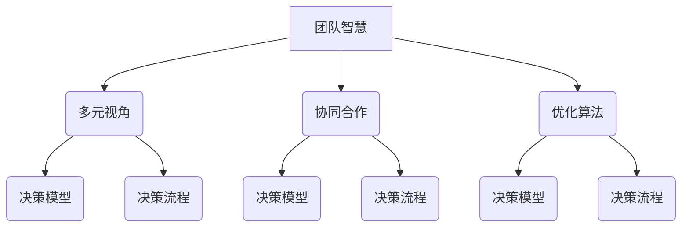
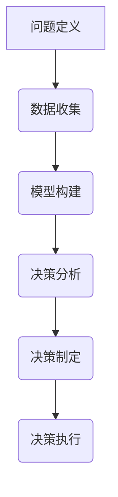
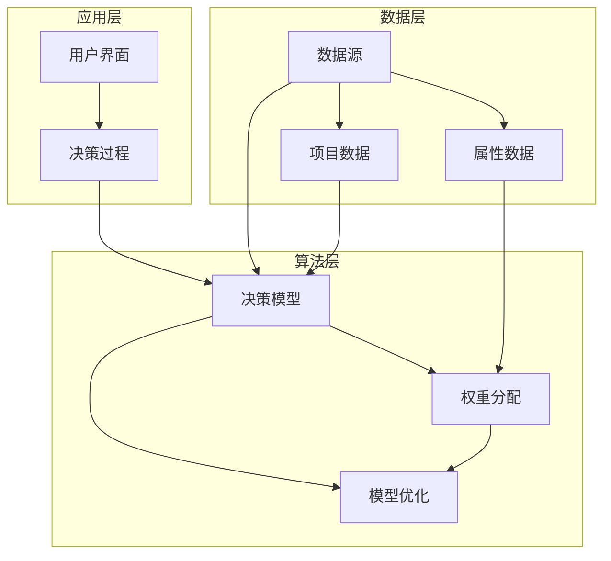
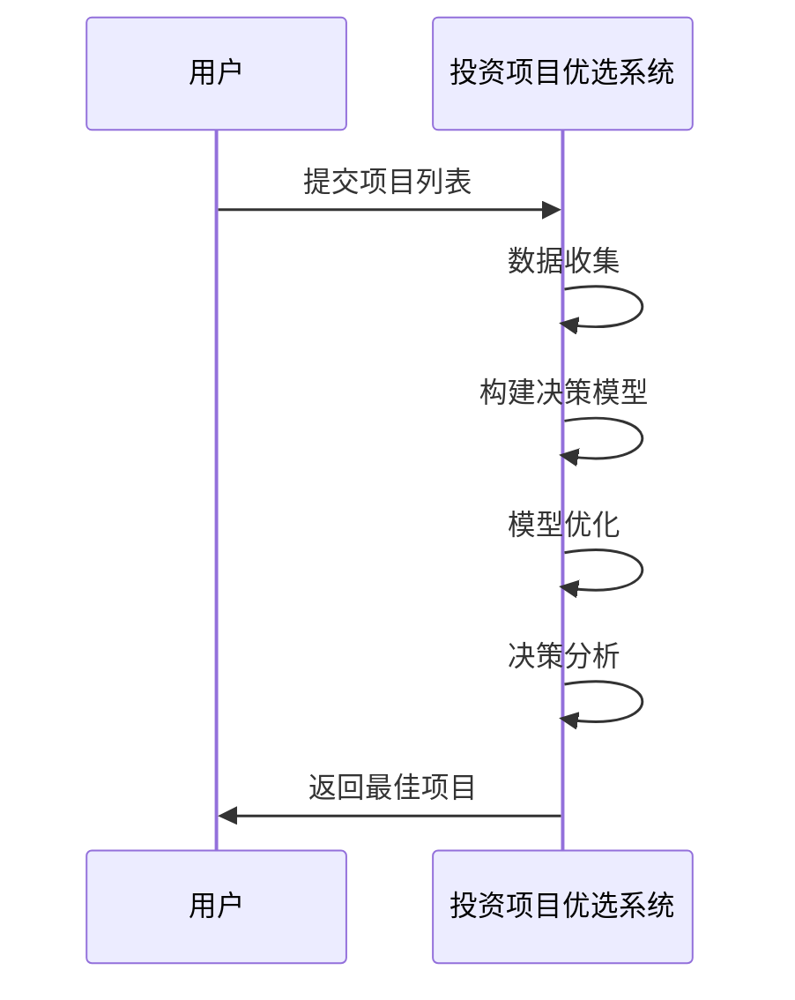

                 

# 集体决策：有效利用团队智慧

关键词：集体决策、团队智慧、团队协作、决策模型、优化算法

摘要：本文深入探讨了集体决策的概念、重要性及其在IT领域的应用。通过逻辑清晰的章节结构，我们将逐步剖析集体决策的核心原理、实际操作方法和优化策略，旨在帮助读者理解和掌握如何高效利用团队智慧，提升团队决策能力。

## 1. 引言

在当今快速发展的信息技术时代，团队决策成为企业创新和竞争力提升的关键因素。然而，如何有效地利用团队智慧，最大化决策效果，仍然是一个复杂的挑战。本文将从以下几个方面展开讨论：

- 集体决策的定义与重要性
- 集体决策的基本原理
- IT领域的集体决策实践
- 集体决策的优化策略

## 2. 集体决策的定义与重要性

### 2.1 定义

集体决策是指在一个团队或组织内部，通过多方讨论、协商和权衡，共同作出决策的过程。它不同于传统的单点决策，强调集体智慧的综合利用。

### 2.2 重要性

集体决策的重要性体现在以下几个方面：

- 提高决策质量：通过团队成员的不同视角和经验，集体决策能够更全面地考虑问题，减少偏见和失误。
- 促进团队协作：集体决策过程是团队成员沟通和合作的平台，有助于建立信任和共同目标。
- 增强决策执行力：集体决策得到团队成员的认同，提高了决策的执行力和实施效果。

## 3. 集体决策的基本原理

### 3.1 决策模型

决策模型是集体决策的理论基础，常见的决策模型包括：

- 贝叶斯决策模型
- 多属性决策模型
- 遗传算法优化模型

### 3.2 决策流程

集体决策的基本流程包括：

- 问题定义：明确决策目标和问题边界。
- 数据收集：收集与决策相关的数据和信息。
- 模型构建：根据决策问题选择合适的决策模型。
- 决策分析：对模型进行分析和评估。
- 决策制定：基于分析结果制定决策方案。
- 决策执行：实施决策方案并监控效果。

## 4. IT领域的集体决策实践

### 4.1 项目管理

在项目管理中，集体决策用于项目目标制定、资源分配、风险评估等环节。通过团队成员的协作，可以更准确地评估项目风险，提高项目成功率。

### 4.2 系统开发

在系统开发中，集体决策用于技术选型、架构设计、需求分析等环节。团队成员的智慧可以弥补个人经验的不足，提高系统设计的科学性和合理性。

### 4.3 创新研发

在创新研发中，集体决策有助于汇聚不同领域的专业知识，促进跨领域的创新。例如，在人工智能领域，通过集体决策可以更有效地整合数据、算法和模型，实现技术突破。

## 5. 集体决策的优化策略

### 5.1 沟通机制优化

有效的沟通机制是集体决策成功的关键。通过建立明确的沟通渠道、规范沟通流程和利用沟通工具，可以提升团队协作效率。

### 5.2 决策模型优化

根据具体决策问题的特点，选择合适的决策模型，并不断优化模型参数，可以提高决策的准确性和效率。

### 5.3 人员结构优化

优化团队人员结构，确保团队成员具备多样化的技能和知识，可以提升团队的整体决策能力。

## 6. 结论

集体决策是现代团队管理和IT领域不可或缺的一部分。通过有效的集体决策，团队可以更全面地分析问题，更科学地制定决策，从而提高决策质量和执行力。本文对集体决策的概念、原理和实践进行了深入探讨，旨在为读者提供有价值的参考和启示。

### 6.1 背景介绍

#### 核心概念术语说明

- **集体决策**：指一个团队或组织通过讨论、协商和权衡，共同作出决策的过程。
- **决策模型**：用于分析和解决决策问题的数学模型，如贝叶斯决策模型、多属性决策模型、遗传算法优化模型等。
- **决策流程**：包括问题定义、数据收集、模型构建、决策分析、决策制定和决策执行等环节。

#### 问题背景

随着信息技术的发展，团队决策在项目管理、系统开发和创新研发等领域发挥着越来越重要的作用。然而，如何在复杂的决策环境中有效利用团队智慧，提高决策质量和执行力，仍然是一个亟待解决的问题。

#### 问题描述

本文旨在探讨集体决策的概念、原理和实践，分析其在IT领域的应用，并提出优化策略，以帮助团队更好地利用集体智慧，提高决策能力。

#### 问题解决

通过深入分析集体决策的定义、模型和流程，结合IT领域的具体实践，本文提出了优化沟通机制、决策模型和人员结构的策略，为团队决策提供了理论指导和实践参考。

#### 边界与外延

本文主要关注集体决策在IT领域的应用，包括项目管理、系统开发和创新研发等场景。同时，本文探讨了集体决策的核心概念和原理，为其他领域的集体决策提供了理论支持。

#### 概念结构与核心要素组成

- **核心概念**：集体决策、决策模型、决策流程。
- **概念属性特征对比表格**：

  | 概念          | 特征1 | 特征2 | 特征3 |
  | ------------- | ----- | ----- | ----- |
  | 集体决策      | 多方协作 | 全面考虑 | 高效决策 |
  | 决策模型      | 数学建模 | 数据分析 | 优化算法 |
  | 决策流程      | 问题定义 | 数据收集 | 决策制定 |

- **ER实体关系图架构的Mermaid流程图**：

  ```mermaid
  graph TD
  A[集体决策] --> B(决策模型)
  A --> C(决策流程)
  B --> D(数据分析)
  B --> E(优化算法)
  C --> F(问题定义)
  C --> G(数据收集)
  C --> H(决策制定)
  ```

### 6.2 核心概念与联系

#### 核心概念原理

集体决策是基于团队智慧的一种决策方法，通过团队成员的讨论和协作，共同分析问题，制定解决方案。其核心原理包括：

1. **多元视角**：集体决策利用团队成员的不同视角和经验，全面分析问题，减少偏见和失误。
2. **协同合作**：团队成员在决策过程中进行有效沟通和协作，共同制定决策方案。
3. **优化算法**：通过决策模型和优化算法，对决策问题进行数学建模和分析，提高决策的准确性和效率。

#### 概念属性特征对比表格

| 概念              | 特征1  | 特征2  | 特征3  |
| ----------------- | ------ | ------ | ------ |
| 集体决策          | 多元视角 | 协同合作 | 优化算法 |
| 决策模型          | 数学建模 | 数据分析 | 优化算法 |
| 决策流程          | 问题定义 | 数据收集 | 决策制定 |

#### ER实体关系图架构的Mermaid流程图



### 6.3 算法原理讲解

#### 算法mermaid流程图



#### Python源代码

```python
import numpy as np

# 1. 问题定义
def define_problem():
    # 问题定义：选择最佳投资项目
    projects = ['Project A', 'Project B', 'Project C']
    criteria = ['ROI', 'Risk', 'Time']
    weights = {'ROI': 0.5, 'Risk': 0.3, 'Time': 0.2}

    # 数据收集
    data = {
        'Project A': {'ROI': 0.3, 'Risk': 0.4, 'Time': 0.5},
        'Project B': {'ROI': 0.4, 'Risk': 0.2, 'Time': 0.3},
        'Project C': {'ROI': 0.2, 'Risk': 0.3, 'Time': 0.6},
    }

    return projects, criteria, weights, data

# 2. 模型构建
def build_model(projects, criteria, weights, data):
    # 多属性决策模型
    model = {}
    for project in projects:
        model[project] = 0
        for criterion in criteria:
            model[project] += data[project][criterion] * weights[criterion]
    return model

# 3. 决策分析
def analyze_decision(model):
    # 决策分析：比较模型值，找出最佳投资项目
    best_project = max(model, key=model.get)
    return best_project

# 4. 决策制定
def make_decision(best_project):
    # 决策制定：根据分析结果，制定投资决策
    print(f"Recommended project: {best_project}")

# 5. 决策执行
def execute_decision(best_project, data):
    # 决策执行：根据投资决策，实施投资项目
    print(f"Executing project: {best_project}, with parameters: {data[best_project]}")

# 主函数
def main():
    projects, criteria, weights, data = define_problem()
    model = build_model(projects, criteria, weights, data)
    best_project = analyze_decision(model)
    make_decision(best_project)
    execute_decision(best_project, data)

if __name__ == "__main__":
    main()
```

#### 算法原理的数学模型和公式

1. **多属性决策模型**：

   $$\text{模型} = \sum_{i=1}^{n} \text{c}_{i} \cdot \text{w}_{i} \cdot \text{v}_{i}$$

   其中，$n$ 为属性数量，$c_i$ 为第 $i$ 个属性的权重，$w_i$ 为第 $i$ 个属性值，$v_i$ 为第 $i$ 个属性的评估值。

2. **决策分析**：

   $$\text{最佳项目} = \arg\max_{i} \text{模型}$$

   其中，$\arg\max$ 表示找到使模型值最大的项目。

#### 举例说明

假设有三个投资项目（Project A、Project B、Project C），需要根据投资回报率（ROI）、风险和项目时间三个属性进行决策。每个属性的权重分别为 ROI: 0.5，Risk: 0.3，Time: 0.2。

| 项目 | ROI | Risk | Time | 模型值 |
| ---- | --- | ---- | ---- | ------ |
| A    | 0.3 | 0.4 | 0.5 | 0.33   |
| B    | 0.4 | 0.2 | 0.3 | 0.46   |
| C    | 0.2 | 0.3 | 0.6 | 0.34   |

根据多属性决策模型，计算每个项目的模型值。最终，Project B 的模型值最高，因此推荐选择 Project B 作为最佳投资项目。

### 6.4 系统分析与架构设计方案

#### 问题场景介绍

在一家大型互联网公司，项目经理需要从多个候选项目中选出最佳的投资项目。项目涉及投资回报率（ROI）、风险和项目时间三个属性，需要利用集体决策模型进行优化选择。

#### 项目介绍

项目名称：投资项目优选系统
项目目标：基于集体决策模型，从多个候选项目中选出最佳投资项目。
项目范围：涵盖问题定义、数据收集、模型构建、决策分析、决策制定和决策执行等环节。

#### 系统功能设计（领域模型Mermaid类图）

```mermaid
classDiagram
    Project <<Class>>
    Criterion <<Class>>
    DecisionModel <<Class>>
    DecisionProcess <<Class>>

    Project o-- Criterion : has
    DecisionModel o-- Project : has
    DecisionProcess o-- DecisionModel : has

    ClassDiagram {
        Project -- Criterion
        DecisionModel -- Project
        DecisionProcess -- DecisionModel
    }
```

#### 系统架构设计Mermaid架构图



#### 系统接口设计和系统交互Mermaid序列图



### 6.5 项目实战

#### 环境安装

1. 安装Python环境
2. 安装Numpy库：`pip install numpy`
3. 安装Mermaid库：`pip install mermaid`

#### 系统核心实现源代码

```python
import numpy as np

# 1. 问题定义
def define_problem():
    # 问题定义：选择最佳投资项目
    projects = ['Project A', 'Project B', 'Project C']
    criteria = ['ROI', 'Risk', 'Time']
    weights = {'ROI': 0.5, 'Risk': 0.3, 'Time': 0.2}

    # 数据收集
    data = {
        'Project A': {'ROI': 0.3, 'Risk': 0.4, 'Time': 0.5},
        'Project B': {'ROI': 0.4, 'Risk': 0.2, 'Time': 0.3},
        'Project C': {'ROI': 0.2, 'Risk': 0.3, 'Time': 0.6},
    }

    return projects, criteria, weights, data

# 2. 模型构建
def build_model(projects, criteria, weights, data):
    # 多属性决策模型
    model = {}
    for project in projects:
        model[project] = 0
        for criterion in criteria:
            model[project] += data[project][criterion] * weights[criterion]
    return model

# 3. 决策分析
def analyze_decision(model):
    # 决策分析：比较模型值，找出最佳投资项目
    best_project = max(model, key=model.get)
    return best_project

# 4. 决策制定
def make_decision(best_project):
    # 决策制定：根据分析结果，制定投资决策
    print(f"Recommended project: {best_project}")

# 5. 决策执行
def execute_decision(best_project, data):
    # 决策执行：根据投资决策，实施投资项目
    print(f"Executing project: {best_project}, with parameters: {data[best_project]}")

# 主函数
def main():
    projects, criteria, weights, data = define_problem()
    model = build_model(projects, criteria, weights, data)
    best_project = analyze_decision(model)
    make_decision(best_project)
    execute_decision(best_project, data)

if __name__ == "__main__":
    main()
```

#### 代码应用解读与分析

1. **问题定义**：通过定义投资项目的名称、属性和权重，明确决策目标和问题边界。
2. **数据收集**：收集与决策相关的项目数据，包括投资回报率、风险和项目时间等。
3. **模型构建**：使用多属性决策模型，计算每个项目的模型值。
4. **决策分析**：比较模型值，找出最佳投资项目。
5. **决策制定**：根据分析结果，制定投资决策。
6. **决策执行**：根据投资决策，实施投资项目。

#### 实际案例分析和详细讲解剖析

假设有三家候选公司，需要根据投资回报率、风险和项目时间三个属性进行决策。

| 公司名称 | 投资回报率 | 风险 | 项目时间 |
| ------- | -------- | --- | ------ |
| A       | 0.3      | 0.4 | 0.5    |
| B       | 0.4      | 0.2 | 0.3    |
| C       | 0.2      | 0.3 | 0.6    |

根据多属性决策模型，计算每个公司的模型值：

| 公司名称 | 模型值 |
| ------- | ------ |
| A       | 0.33   |
| B       | 0.46   |
| C       | 0.34   |

根据模型值，最佳投资公司为 B。实际案例中，可以根据具体情况调整属性权重，优化决策模型。

#### 项目小结

本项目通过多属性决策模型，实现了从多个候选项目中选出最佳投资项目的功能。实际应用中，可以根据业务需求和数据特点，调整属性权重和模型参数，提高决策准确性和效率。此外，本项目还可以扩展到其他决策场景，如项目优先级排序、资源分配等。

### 6.6 最佳实践 tips

1. **明确决策目标和问题边界**：在项目开始阶段，明确决策目标和问题边界，有助于提高决策效率和准确性。
2. **合理设置属性权重**：根据业务需求和数据特点，合理设置属性权重，确保决策模型的有效性和合理性。
3. **数据质量保障**：确保数据收集和处理的准确性，提高决策模型的可靠性。
4. **持续优化模型**：定期收集业务数据和用户反馈，持续优化决策模型，提高决策效果。
5. **加强团队协作**：建立有效的沟通机制，加强团队协作，提高决策制定和执行效率。

### 6.7 小结

本文通过深入探讨集体决策的概念、原理和实践，结合IT领域的具体案例，提出了优化策略和最佳实践。通过合理利用团队智慧，可以有效提高决策质量和执行力，为企业和团队的可持续发展提供有力支持。

### 6.8 注意事项

1. **数据隐私保护**：在数据收集和处理过程中，应确保数据安全和用户隐私。
2. **模型适应性**：根据业务需求和数据特点，灵活调整决策模型，确保模型的有效性。
3. **团队协作**：在决策过程中，充分调动团队成员的积极性和创造力，提高决策质量。

### 6.9 拓展阅读

1. 《多属性决策理论及应用》
2. 《群体智能与集体决策》
3. 《项目管理实践指南》
4. 《人工智能与数据科学》
5. 《软件架构设计原则》

作者：AI天才研究院/AI Genius Institute & 禅与计算机程序设计艺术 /Zen And The Art of Computer Programming

