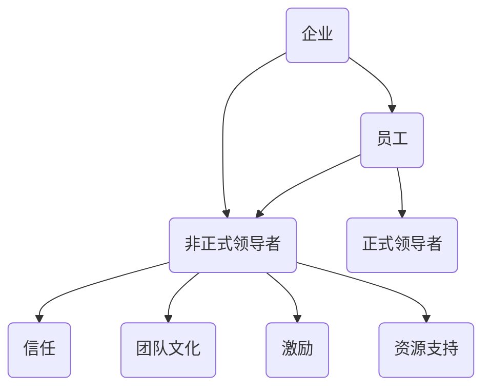
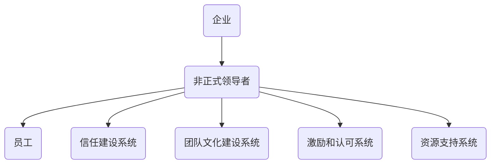
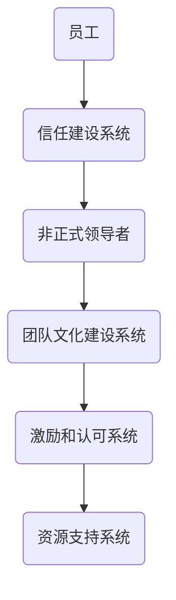
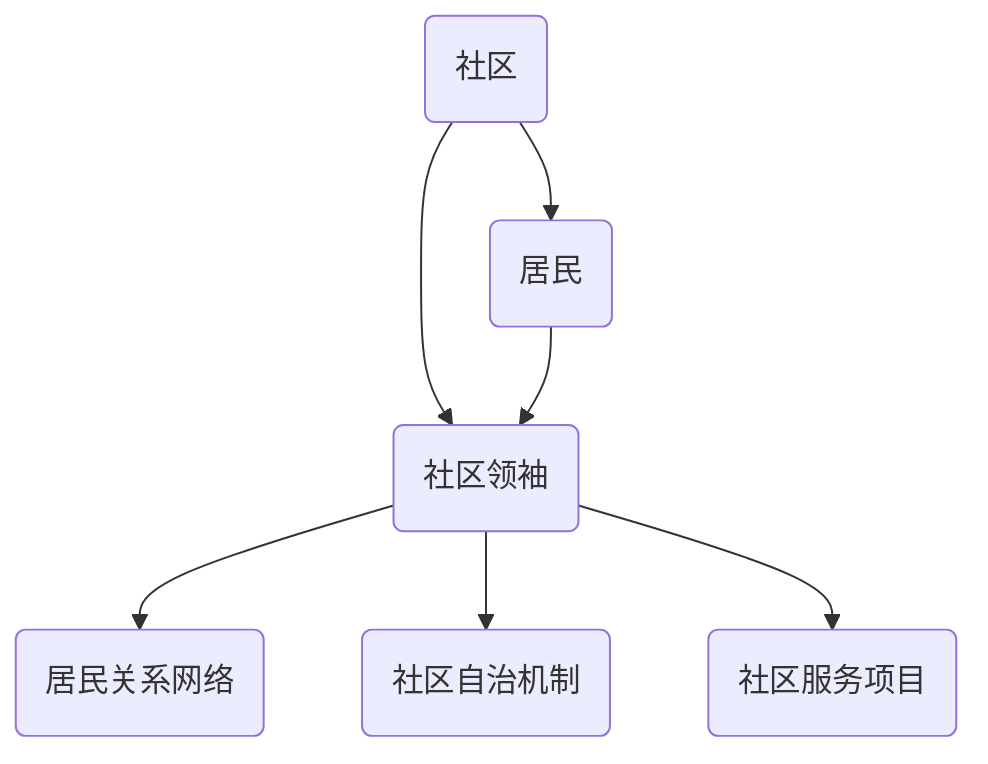
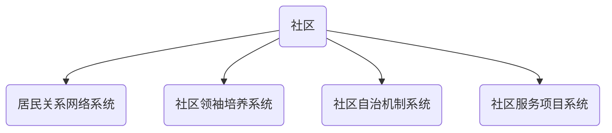
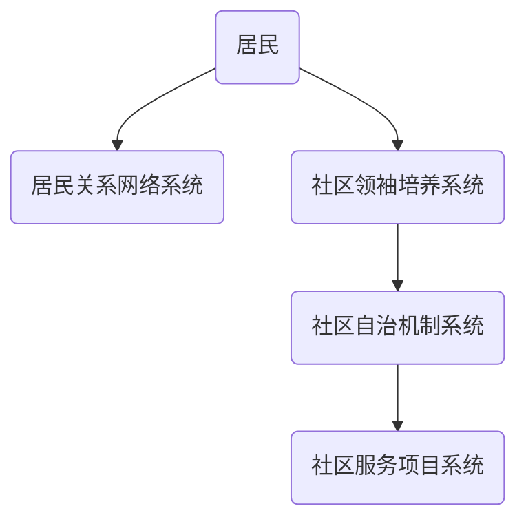
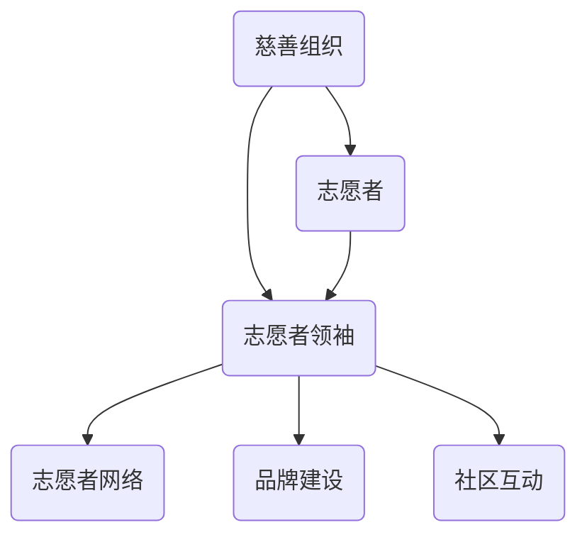
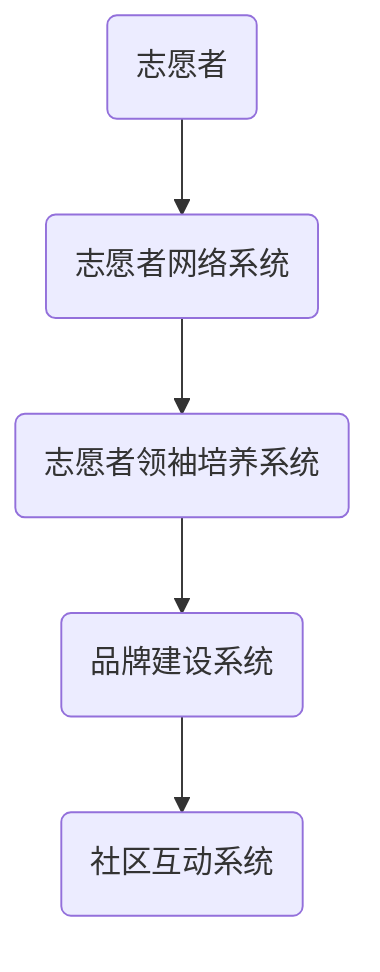

                 

### 非正式影响力：超越职位权力的领导艺术

**关键词**：非正式影响力、领导艺术、社会心理学、跨文化沟通、情感共鸣

**摘要**：本文深入探讨了非正式影响力的概念、理论基础及其在各个领域的应用。通过分析非正式影响力的核心要素，包括建立信任与关系、情感与同理心、非语言沟通等，本文揭示了非正式影响力在领导力和组织管理中的重要性。此外，文章还探讨了非正式影响力在跨文化交流和组织中的应用，展望了其未来发展趋势。通过成功案例和最佳实践的分析，本文为读者提供了实际操作指南，帮助他们在职业生涯中有效运用非正式影响力。

## 目录大纲

### 第一部分：非正式影响力的背景与理论基础

#### 第1章：非正式影响力的定义与重要性
- **1.1 非正式影响力的概念解析**
- **1.2 非正式影响力的特征与类型**
- **1.3 非正式影响力的重要性

#### 第2章：社会心理学与影响力理论
- **2.1 社会心理学基础**
- **2.2 基本影响力理论**
- **2.3 社会认知与行为变化

### 第二部分：非正式影响力的核心要素

#### 第3章：建立信任与关系
- **3.1 信任的构建与维护**
- **3.2 人际关系的培养与强化**
- **3.3 人际网络的作用

#### 第4章：情感与同理心
- **4.1 情感的影响力**
- **4.2 同理心的培养**
- **4.3 情感共鸣与群体动力

#### 第5章：非语言沟通
- **5.1 非语言沟通的重要性**
- **5.2 身体语言与面部表情**
- **5.3 视觉和听觉沟通技巧

### 第三部分：非正式影响力的实践应用

#### 第6章：领导者的非正式影响力
- **6.1 领导者如何利用非正式影响力**
- **6.2 非正式领导力的发展**
- **6.3 非正式影响力在团队管理中的应用

#### 第7章：组织中的非正式影响力
- **7.1 非正式影响力在组织中的角色**
- **7.2 非正式领导网络**
- **7.3 非正式影响力对组织文化的影响

#### 第8章：跨文化非正式影响力
- **8.1 跨文化背景下的非正式影响力**
- **8.2 文化差异与沟通策略**
- **8.3 跨文化非正式影响力的挑战与应对

#### 第9章：非正式影响力的未来趋势
- **9.1 技术进步与非正式影响力的演变**
- **9.2 社会变革与非正式影响力的未来**
- **9.3 非正式影响力的持续发展

### 第四部分：案例分析与最佳实践

#### 第10章：成功案例解析
- **10.1 案例一：某企业内部非正式领导的影响力建设**
- **10.2 案例二：非正式影响力在社区治理中的实践**
- **10.3 案例三：非正式影响力在慈善事业中的应用

#### 第11章：最佳实践与策略
- **11.1 增强非正式影响力的策略**
- **11.2 非正式影响力的评估与优化**
- **11.3 非正式影响力建设中的注意事项

#### 附录：拓展阅读与资源
- **附录1：非正式影响力相关研究文献推荐**
- **附录2：非正式影响力实践工具与应用指南**
- **附录3：非正式影响力相关课程与研讨会信息**

### 第一部分：非正式影响力的背景与理论基础

#### 第1章：非正式影响力的定义与重要性

**1.1 非正式影响力的概念解析**

非正式影响力是指在没有正式职位和权威的情况下，通过个人特质、关系网络和情感共鸣等方式，对他人产生积极影响的领导艺术。它与正式权力不同，不依赖于职位赋予的权威，而是通过建立信任、培养人际关系和运用情感共鸣等手段来实现。

**1.2 非正式影响力的特征与类型**

非正式影响力的特征包括：

- **关系驱动**：非正式影响力依赖于人与人之间的关系，通过建立紧密的关系网来扩大影响力。
- **情感共鸣**：情感因素在非正式影响力中起着至关重要的作用，通过情感共鸣来影响他人。
- **个性魅力**：个人的品格、态度和行为对于非正式影响力的形成具有显著影响。
- **非制度化**：非正式影响力不受正式制度和流程的限制，更灵活和多样化。

根据产生方式，非正式影响力可分为以下几种类型：

- **个人魅力型**：通过个人的魅力和吸引力来影响他人。
- **关系型**：通过建立和维护良好的人际关系来产生影响力。
- **知识型**：通过专业知识和经验来获得他人的尊重和信任。
- **情感型**：通过情感共鸣和同理心来影响他人。

**1.3 非正式影响力的重要性**

非正式影响力在现代社会中具有不可忽视的重要性，其原因如下：

- **填补正式权力的不足**：非正式影响力可以弥补正式权力的不足，在缺乏正式权威的情况下，通过非正式方式来解决问题和推动变革。
- **促进团队合作**：非正式影响力有助于建立团队凝聚力和协作精神，通过情感共鸣和信任来促进团队合作。
- **适应快速变化的环境**：在快速变化的环境中，非正式影响力更加灵活和有效，可以快速适应新情况并采取行动。
- **培养个人领导力**：非正式影响力的运用有助于培养个人的领导力和人际交往能力，提升个人综合素质。

通过以上分析，我们可以看到，非正式影响力是一种重要的领导艺术，它在各种情境下都具有广泛的应用价值。接下来，我们将深入探讨社会心理学与影响力理论，以更好地理解非正式影响力的本质和作用。

### 第2章：社会心理学与影响力理论

**2.1 社会心理学基础**

社会心理学是研究个体在社会环境中的心理和行为变化的科学。它关注个体如何受到他人行为、态度和情感的影响，以及个体如何影响他人。在社会心理学中，影响力是一个核心概念，它指的是一种能够改变他人思想、情感或行为的能力。

社会心理学基础理论包括：

- **群体动力学**：研究群体内成员之间的相互作用和群体行为的规律。群体动力学强调群体成员之间的相互影响和群体凝聚力的作用。
- **认知一致性**：个体倾向于与他人保持一致，避免认知失调。这可以通过从众行为、说服和信息加工等方式实现。
- **情感共鸣**：个体在情感上与他人产生共鸣，从而影响彼此的行为和态度。

**2.2 基本影响力理论**

基本影响力理论是理解非正式影响力的关键。以下是几个重要的影响力理论：

- **社会认同理论**：个体倾向于跟随群体中其他成员的行为和决策，因为群体认同可以提供安全感和归属感。
- **社会说服理论**：通过传递信息和论证，个体可以改变他人的态度和行为。说服过程涉及信息接收、信息处理和信息反馈。
- **情感共鸣理论**：情感因素在影响力中起着至关重要的作用。通过情感共鸣，个体能够更好地影响他人的情感和态度。

**2.3 社会认知与行为变化**

社会认知与行为变化是指个体在社会环境中的心理和行为的改变。这些变化受到多种因素的影响，包括：

- **社会学习**：个体通过观察和模仿他人的行为来学习新技能和知识。
- **社会比较**：个体通过与他人比较来评估自己的行为和价值。
- **社会认同**：个体在群体中寻找认同，从而影响其态度和行为。
- **情感共鸣**：情感因素在影响个体行为中起着重要作用，通过情感共鸣，个体更容易被他人影响。

社会认知与行为变化的过程可以简化为以下几个步骤：

1. **信息接收**：个体接收来自他人的信息。
2. **信息处理**：个体对信息进行加工和解释。
3. **态度形成**：个体基于信息处理的结果形成新的态度。
4. **行为变化**：新的态度影响个体的行为。

通过社会心理学与影响力理论的分析，我们可以更深入地理解非正式影响力的本质和作用。这些理论为我们提供了一种框架，用于分析非正式影响力的产生机制和应用场景。在接下来的章节中，我们将探讨非正式影响力的核心要素，进一步揭示其在实际应用中的具体表现。

#### 第3章：建立信任与关系

**3.1 信任的构建与维护**

信任是非正式影响力的基础，没有信任，任何形式的领导都是难以持久的。建立信任的关键在于以下几个方面：

- **透明度**：保持信息的透明和公开，避免隐瞒或误导。透明度有助于增强信任，使人们感到被尊重和重视。
- **一致性**：言行一致，保持稳定的行为模式。一致性有助于建立可靠性，使人们相信你是一个可信赖的人。
- **诚信**：诚信是建立信任的基石。诚信意味着遵守承诺，不欺骗，不隐瞒真相。
- **共同目标**：与他人建立共同的目标和价值观，共同追求的目标可以加强合作关系，促进信任的建立。

维护信任同样重要。以下是一些维护信任的方法：

- **及时沟通**：保持开放的沟通渠道，及时回应他人的问题和关切。
- **承认错误**：当犯错误时，勇于承认并采取措施纠正，这有助于修复受损的信任。
- **尊重**：尊重他人的观点和感受，避免强加自己的意见。
- **持续投入**：持续投入时间和精力，维护和加强人际关系。

**3.2 人际关系的培养与强化**

人际关系是非正式影响力的载体，通过培养和强化人际关系，可以扩大自己的影响力。以下是培养和强化人际关系的几个关键步骤：

- **建立联系**：通过共同兴趣、活动和网络，建立与他人的联系。初期可以参加行业会议、社交活动，结识新朋友。
- **互惠互利**：在人际关系中，互惠互利是维持关系的关键。通过帮助他人，建立互惠关系，可以增强信任和合作。
- **真诚关心**：真诚关心他人的生活和事业，关注他们的需求和问题。真诚的关心可以增进人际关系的质量。
- **持续互动**：定期与朋友和同事保持联系，通过电话、邮件、社交媒体等方式进行互动，保持关系的活跃度。

**3.3 人际网络的作用**

人际网络是非正式影响力的重要资源，通过人际网络，可以获取信息和资源，推动个人和团队的发展。以下是人际网络的作用：

- **信息传递**：人际网络有助于信息的快速传递，使个体能够及时获取行业动态和关键信息。
- **资源整合**：通过人际网络，可以整合各方资源，实现资源的最优配置。
- **风险分散**：人际网络可以帮助个体分散风险，通过多个渠道获取信息和资源，减少单一渠道的风险。
- **社会支持**：人际网络提供了社会支持，个体在面临困难和挑战时，可以得到他人的帮助和鼓励。

为了有效地利用人际网络，以下是一些建议：

- **建立广泛联系**：积极参与各种社交活动，建立广泛的联系网络。
- **保持联系**：定期与网络中的成员保持联系，维护和强化关系。
- **资源共享**：在人际网络中，共享信息和资源，建立互惠互利的关系。
- **持续学习**：不断提升自己的技能和知识，增加自己在网络中的价值。

通过建立信任、培养人际关系和利用人际网络，我们可以增强非正式影响力，实现个人和团队的共同发展。在接下来的章节中，我们将进一步探讨情感与同理心以及非语言沟通，这些核心要素对于非正式影响力的形成和发挥具有重要作用。

### 第4章：情感与同理心

**4.1 情感的影响力**

情感是一种强烈的心理状态，对个体的思维和行为产生深远的影响。在非正式影响力中，情感的作用尤为重要。以下是情感影响力的几个关键点：

- **激发行为**：情感可以激发个体的行为，使其产生行动的动机。例如，对工作的热情可以促使个体更加努力地工作，从而提高工作效率。
- **影响决策**：情感在决策过程中起着关键作用。情感反应可以影响个体的判断和选择，使其做出更加合理或更加冲动的决策。
- **增强记忆**：情感强烈的经历更容易被记住，这是因为情感与记忆之间存在密切的联系。通过引发情感共鸣，可以增强信息的记忆效果。

**4.2 同理心的培养**

同理心是指理解和感受他人情感和经历的能力，是一种高级的情感技能。培养同理心对于增强非正式影响力至关重要。以下是培养同理心的几个步骤：

- **倾听**：倾听是培养同理心的第一步。通过倾听他人的故事和感受，我们可以更好地理解他们的情感和需求。
- **设身处地**：设身处地地思考他人的感受，尝试从他们的角度看待问题。这种换位思考可以帮助我们更深刻地理解他人的情感。
- **表达情感**：在适当的时候，表达自己的情感和感受，这有助于建立情感共鸣。通过真诚的表达，我们可以与他人建立更深厚的情感联系。
- **持续练习**：同理心是一种技能，需要通过不断的练习和反思来提高。在日常交往中，持续地练习同理心，可以逐渐增强这种能力。

**4.3 情感共鸣与群体动力**

情感共鸣是指个体在情感上与他人产生共鸣，从而增强彼此的情感联系。情感共鸣在群体动力中起着关键作用，以下是情感共鸣在群体动力中的几个表现：

- **增强凝聚力**：情感共鸣可以增强群体的凝聚力，使成员更加团结一致，共同面对挑战。
- **促进合作**：通过情感共鸣，成员之间的合作更加顺畅，因为情感上的联系减少了冲突和误解。
- **激发创新**：情感共鸣可以激发群体的创新潜力，通过情感上的共鸣，成员可以更自由地表达自己的想法和创意，从而推动创新。

在培养情感共鸣时，以下是一些建议：

- **共同经历**：通过共同的经历，如团队建设活动、公益活动等，增强情感共鸣。
- **分享情感**：鼓励成员分享自己的情感和经历，这有助于建立情感上的联系。
- **鼓励反馈**：在群体中鼓励成员给予反馈，这有助于成员理解彼此的情感和需求，从而增强情感共鸣。

通过情感与同理心的培养，我们可以更好地理解他人，增强非正式影响力。情感和同理心不仅是一种情感技能，也是一种领导艺术，通过情感的共鸣和同理心的运用，我们可以更好地领导他人，推动团队和组织的共同发展。在接下来的章节中，我们将探讨非语言沟通，这是非正式影响力中不可或缺的一部分。

### 第5章：非语言沟通

**5.1 非语言沟通的重要性**

非语言沟通是指通过身体语言、面部表情、视觉和听觉等非文字手段进行信息传递和理解的过程。它在非正式影响力中扮演着至关重要的角色，以下是几个关键点：

- **增强信息的传达效果**：非语言沟通可以增强信息的传达效果，通过面部表情、肢体动作和语调等手段，可以更好地表达情感和态度，使信息更加生动和有力。
- **弥补语言沟通的不足**：在语言沟通中，有时会因为语言表达不清或误解而导致沟通效果不佳。非语言沟通可以弥补这些不足，通过非文字手段来补充和强化语言信息。
- **建立情感联系**：非语言沟通有助于建立情感联系，通过眼神接触、微笑和拥抱等手段，可以表达出真诚和关心，从而增强情感上的共鸣。

**5.2 身体语言与面部表情**

身体语言和面部表情是非语言沟通中最直观的部分，以下是它们的几个关键点：

- **身体语言**：身体语言包括姿态、手势、眼神和肢体动作等。例如，一个坚定的姿态和自信的手势可以传达出力量和决心，而眼神接触可以表达出真诚和信任。
- **面部表情**：面部表情包括眼睛、眉毛、嘴巴等部位的微小变化。例如，微笑可以传达出友好和欢迎的情感，而皱眉可以表达出不满和疑惑。

以下是一些关于身体语言和面部表情的技巧：

- **保持眼神接触**：眼神接触可以传达出真诚和信任，但要注意不要过度或长时间的直视，以免造成不适。
- **注意姿态和手势**：保持良好的姿态和适度的手势可以增强沟通的效果，但要避免过于夸张或过于频繁的手势。
- **观察他人的身体语言**：通过观察他人的身体语言，我们可以更好地理解他们的情感和态度，从而更好地调整自己的沟通方式。

**5.3 视觉和听觉沟通技巧**

视觉和听觉沟通技巧是通过视觉和听觉手段进行信息传递和理解的过程，以下是它们的几个关键点：

- **视觉沟通**：视觉沟通包括图表、图片、颜色和布局等。例如，图表和图片可以更直观地传达复杂的信息，颜色和布局可以增强信息的可读性和吸引力。
- **听觉沟通**：听觉沟通包括语调、音量和语速等。例如，适度的音量和清晰的语调可以增强沟通的清晰度，而语速的适当调整可以更好地传达情感和态度。

以下是一些关于视觉和听觉沟通的技巧：

- **使用适当的视觉工具**：在沟通中，使用适当的视觉工具可以更清晰地传达信息，例如图表、图片和PPT等。
- **调整语调和语速**：根据沟通的内容和情境，适当调整语调和语速，以传达出更丰富的情感和态度。
- **倾听和回应**：在沟通中，不仅要注重传达信息，还要倾听对方的反馈和回应，通过互动来增强沟通的效果。

通过有效的非语言沟通，我们可以更好地理解他人，增强非正式影响力。非语言沟通是一种复杂而微妙的技能，需要通过不断的实践和反思来提高。在接下来的章节中，我们将探讨非正式影响力在领导者和组织管理中的应用，进一步揭示其在实际操作中的具体表现。

### 第6章：领导者的非正式影响力

**6.1 领导者如何利用非正式影响力**

领导者通过非正式影响力可以在团队和组织中发挥重要作用，以下是一些利用非正式影响力的关键方法：

- **建立信任关系**：领导者需要通过与团队成员建立信任关系来增强自己的非正式影响力。通过透明沟通、诚信和一致性行为，领导者可以赢得团队成员的信任和尊重。
- **培养团队文化**：领导者可以通过培养积极的团队文化来增强非正式影响力。一个共同的愿景、价值观和目标可以加强团队成员之间的联系，促进团队凝聚力和合作精神。
- **激励和鼓励**：领导者可以通过激励和鼓励来激发团队成员的积极性和创造力。真诚的认可和表扬可以增强团队成员的自信心和动力，从而提高团队的整体绩效。
- **情感共鸣**：领导者需要通过情感共鸣来理解和支持团队成员。通过倾听、关心和同理心，领导者可以建立深厚的情感联系，增强团队的凝聚力和归属感。

**6.2 非正式领导力的发展**

非正式领导力是指在没有正式职位和权威的情况下，通过个人魅力、关系网络和情感共鸣等方式来影响他人的能力。以下是发展非正式领导力的几个关键步骤：

- **提升个人素质**：非正式领导力的发展首先需要提升个人素质，包括专业技能、人际关系能力和沟通技巧。通过不断学习和实践，领导者可以增强自己的综合素质。
- **建立人际网络**：建立广泛的人际网络是非正式领导力的重要基础。通过积极参与社交活动和行业交流，领导者可以结识更多的人，扩大自己的影响力。
- **培养同理心**：同理心是非正式领导力的重要组成部分。领导者需要通过倾听和关心来培养同理心，理解他人的需求和情感，从而更好地影响他人。
- **持续学习和成长**：非正式领导力不是一成不变的，领导者需要持续学习和成长，以适应不断变化的环境和挑战。通过不断反思和实践，领导者可以不断提升自己的非正式领导力。

**6.3 非正式影响力在团队管理中的应用**

非正式影响力在团队管理中具有广泛的应用，以下是几个关键应用场景：

- **团队建设**：通过非正式影响力，领导者可以促进团队建设，增强团队成员之间的信任和合作。例如，通过组织团队活动、共同解决难题等方式，领导者可以加强团队的凝聚力和合作精神。
- **冲突管理**：在团队管理中，冲突是不可避免的现象。通过非正式影响力，领导者可以有效地管理和解决冲突。通过倾听、沟通和调解，领导者可以帮助团队成员理解彼此的立场和需求，找到共同的解决方案。
- **创新推动**：非正式影响力可以激发团队成员的创新潜力。领导者可以通过鼓励、支持和激励来推动团队的创新活动。例如，通过提供资源、建立实验环境等方式，领导者可以激发团队成员的创造力。
- **绩效提升**：通过非正式影响力，领导者可以提升团队的绩效。通过激励和认可，领导者可以激发团队成员的工作热情和积极性，从而提高团队的整体绩效。

总之，非正式影响力是领导者的重要资产，通过有效运用非正式影响力，领导者可以更好地管理团队，推动组织的发展。在接下来的章节中，我们将探讨非正式影响力在组织中的角色和影响，进一步揭示其在组织管理中的具体应用。

### 第7章：组织中的非正式影响力

**7.1 非正式影响力在组织中的角色**

非正式影响力在组织中的角色是多元化的，它可以影响组织的各个层面，从而对组织的整体绩效产生深远的影响。以下是几个关键角色：

- **桥梁作用**：非正式影响力可以作为沟通和协作的桥梁，帮助组织中的不同部门和团队成员之间建立联系，促进信息的流动和共享。
- **决策影响**：非正式影响力可以影响组织的决策过程。通过建立信任和关系，非正式领导者可以在决策中发挥重要作用，提出建设性的意见和解决方案。
- **文化塑造**：非正式影响力可以在组织文化的塑造中发挥关键作用。通过情感共鸣和价值观的传播，非正式领导者可以推动组织形成积极的、有利于发展的文化氛围。
- **变革推动**：在组织变革中，非正式影响力可以起到关键的推动作用。通过激发员工的积极性和创造力，非正式领导者可以推动组织适应外部环境的变化，实现持续发展。

**7.2 非正式领导网络**

非正式领导网络是由组织中的非正式领导者组成的网络，这些非正式领导者通过关系和影响力相互连接，形成一个动态的、灵活的领导体系。以下是几个关键点：

- **网络结构**：非正式领导网络通常具有高度的网络密度和多样化的连接方式。网络中的节点（非正式领导者）通过多种渠道（如人际关系、共同兴趣和合作项目）相互连接，形成复杂的关系网络。
- **网络功能**：非正式领导网络具有多种功能，包括信息传递、资源整合、问题解决和决策制定。通过网络的连接和互动，组织可以更快速、有效地响应外部环境的变化。
- **网络演变**：非正式领导网络是动态演变的，随着组织内外部环境的变化，网络的结构和功能也会发生变化。这种动态性使得组织能够保持灵活性和适应性。

**7.3 非正式影响力对组织文化的影响**

非正式影响力对组织文化具有深远的影响，它可以塑造和改变组织文化的各个方面。以下是几个关键点：

- **价值观传播**：非正式领导者通过个人行为和价值观的传播，可以影响组织成员的价值观和行为准则，从而塑造组织文化。例如，一个注重创新和学习的非正式领导者可以推动组织形成积极进取的文化氛围。
- **行为规范**：非正式影响力可以影响组织成员的行为规范，通过榜样的作用和情感共鸣，非正式领导者可以引导组织成员遵循组织的核心价值观和行为准则。
- **文化变革**：在组织变革过程中，非正式影响力可以起到推动和引导作用。通过激发员工的积极性和创造力，非正式领导者可以推动组织文化的变革，使其适应新的环境和需求。
- **文化认同**：非正式影响力可以增强组织成员对组织文化的认同感，通过情感共鸣和价值观的共享，组织成员可以更加认同和接受组织文化，从而增强组织的凝聚力和归属感。

总之，非正式影响力在组织中扮演着多重角色，它不仅影响组织的日常运营，还深刻塑造着组织的文化和发展方向。通过理解和运用非正式影响力，组织可以更好地应对外部环境的变化，实现持续的发展和成功。在接下来的章节中，我们将探讨跨文化背景下的非正式影响力，进一步揭示其在不同文化背景下的应用和挑战。

### 第8章：跨文化非正式影响力

**8.1 跨文化背景下的非正式影响力**

在全球化背景下，跨文化交流日益频繁，非正式影响力在跨文化情境中的重要性也日益凸显。跨文化非正式影响力是指在不同文化背景下，通过非正式方式影响他人思想和行为的能力。以下是跨文化非正式影响力的几个关键点：

- **文化差异的敏感性**：跨文化非正式影响力需要高度敏感于文化差异。不同文化背景下，人们的价值观、行为规范和沟通方式都有所不同，非正式领导者需要理解和尊重这些差异，避免文化误解和冲突。
- **共同价值观的建立**：在跨文化背景下，非正式领导者需要寻找和建立共同价值观，作为影响他人的基础。通过共同目标和共同利益，可以增强跨文化团队的合作和凝聚力。
- **情感共鸣与适应性**：在跨文化情境中，非正式领导者需要具备更强的情感共鸣和适应性。通过理解和感受不同文化背景下的情感和需求，非正式领导者可以更好地影响他人，促进跨文化交流和理解。

**8.2 文化差异与沟通策略**

文化差异是跨文化非正式影响力面临的主要挑战之一。以下是一些应对文化差异的沟通策略：

- **文化敏感性培训**：组织可以提供文化敏感性培训，帮助员工了解不同文化背景下的沟通方式和行为规范。通过培训，员工可以更好地适应不同文化，减少误解和冲突。
- **开放性和包容性**：在跨文化沟通中，开放性和包容性至关重要。非正式领导者需要表现出对多样性的尊重和接纳，避免偏见和歧视。
- **情境适应性**：非正式领导者需要根据不同的文化背景和情境，灵活调整自己的沟通策略。例如，在某些文化中，直接沟通可能被视为冒犯，而在其他文化中，间接沟通可能更为适宜。

**8.3 跨文化非正式影响力的挑战与应对**

跨文化非正式影响力面临以下挑战：

- **文化误解**：不同文化背景下，人们对于某些行为和表达方式可能存在误解，这可能导致沟通障碍和冲突。
- **权力距离**：不同文化对于权力距离的容忍程度不同，这会影响非正式影响力的发挥。在权力距离较大的文化中，非正式领导者可能需要更加注重尊重和权威。
- **适应性问题**：跨文化非正式领导者需要适应不同的文化和工作环境，这要求他们具备较强的文化适应能力和灵活性。

以下是应对这些挑战的方法：

- **文化研究**：通过深入研究不同文化的价值观和行为规范，非正式领导者可以更好地理解文化差异，避免文化误解。
- **跨文化团队建设**：通过建立跨文化团队，组织可以促进不同文化之间的交流和理解，增强团队的凝聚力和合作精神。
- **持续学习和适应**：非正式领导者需要具备持续学习和适应的能力，通过不断学习和实践，可以更好地应对跨文化情境中的挑战。

总之，跨文化非正式影响力是全球化背景下组织成功的重要资产。通过理解文化差异、建立共同价值观和灵活应对挑战，非正式领导者可以在跨文化环境中发挥重要作用，推动组织的国际化发展。在接下来的章节中，我们将探讨非正式影响力的未来趋势，进一步揭示其在未来社会中的发展和影响。

### 第9章：非正式影响力的未来趋势

**9.1 技术进步与非正式影响力的演变**

随着科技的迅速发展，非正式影响力也在不断演变。以下是一些关键趋势：

- **数字化的非正式领导**：随着社交媒体和数字平台的普及，非正式领导者可以通过这些渠道扩大自己的影响力，实现更广泛的社会动员和组织协调。
- **数据分析的应用**：数据分析技术可以帮助非正式领导者更好地理解群体行为和情感动态，从而更有效地运用非正式影响力。通过分析大数据，领导者可以洞察趋势，预测行为，制定更具针对性的影响力策略。
- **虚拟现实与增强现实**：虚拟现实（VR）和增强现实（AR）技术为非正式影响力提供了新的表达和互动方式。通过这些技术，非正式领导者可以创造更丰富的互动体验，增强情感共鸣和群体凝聚力。

**9.2 社会变革与非正式影响力的未来**

社会变革也在影响着非正式影响力的发展。以下是一些关键趋势：

- **多元文化的融合**：随着全球化和社会多元化的发展，非正式影响力的表现形式也将更加多样化和包容。非正式领导者需要具备跨文化理解和沟通能力，以适应多元文化的需求。
- **社会正义与公平**：社会正义和公平意识的增强将推动非正式影响力的变革。非正式领导者将更多地关注社会问题，推动社会变革，实现更公平和正义的社会环境。
- **社区参与与自治**：社区参与和自治的兴起将增强非正式影响力在社会治理中的作用。非正式领导者将通过社区参与和自治机制，发挥更大的影响力，推动社区的发展和进步。

**9.3 非正式影响力的持续发展**

为了实现非正式影响力的持续发展，以下是一些建议：

- **持续学习和创新**：非正式领导者需要保持学习的态度，不断更新知识和技能，以适应不断变化的环境。通过创新思维和方法，非正式领导者可以持续地提升自己的影响力。
- **情感共鸣与价值观传播**：情感共鸣和价值观传播是非正式影响力的核心。非正式领导者需要通过情感共鸣和价值观传播，建立深厚的情感联系和共同认同，从而实现长期的、可持续的影响力。
- **跨界合作与整合**：非正式领导者需要建立跨界合作网络，整合不同领域和资源，以实现更大的影响力。通过跨界合作，非正式领导者可以更全面地应对复杂的社会问题，推动更广泛的变革。

总之，非正式影响力在技术进步和社会变革的推动下，将继续演变和发展。通过持续学习和创新、情感共鸣与价值观传播，以及跨界合作与整合，非正式领导者可以更好地应对未来的挑战，实现持续的发展和影响。在接下来的章节中，我们将通过成功案例和最佳实践，进一步探讨非正式影响力在实际操作中的具体应用和效果。

### 第10章：成功案例解析

#### 10.1 案例一：某企业内部非正式领导的影响力建设

**背景介绍**：
某企业是一家快速发展的科技公司，在市场竞争日益激烈的背景下，企业决定通过提升内部非正式领导的影响力，来推动公司的创新和团队协作。

**问题描述**：
企业内部存在正式领导与员工之间的沟通不畅、创新动力不足以及团队合作不够紧密等问题。企业希望通过非正式领导的影响力建设，解决这些问题，提高员工的积极性和团队协作能力。

**问题解决**：
企业采取了一系列措施来提升非正式领导的影响力：

1. **建立信任**：通过定期的员工沟通会和团队建设活动，企业鼓励非正式领导者与员工建立信任关系。非正式领导者积极参与员工的生活和工作中，关心员工的成长和需求。
2. **培养团队文化**：企业通过宣传和推广共同愿景和价值观，培养积极的团队文化。非正式领导者以身作则，践行企业价值观，树立榜样。
3. **激励和认可**：企业设立非正式领导激励计划，对在创新和团队合作中表现突出的非正式领导者进行表彰和奖励，以激发他们的积极性和创造力。
4. **提供资源支持**：企业为非正式领导者提供必要的资源和支持，包括培训、工具和资金等，帮助他们更好地发挥影响力。

**边界与外延**：
该案例主要关注企业内部非正式领导的影响力建设，通过建立信任、培养团队文化、激励认可和资源支持，提升非正式领导的影响力。该案例可以应用于其他组织，尤其是那些重视创新和团队协作的企业。

**核心概念与联系**：
该案例涉及的核心概念包括信任、团队文化、激励和资源支持。通过建立信任，非正式领导者可以赢得员工的信任和尊重；通过培养团队文化，可以增强团队凝聚力和协作精神；通过激励和认可，可以激发非正式领导者的积极性和创造力；通过提供资源支持，可以保障非正式领导者的有效发挥。

**ER实体关系图架构**：

**项目介绍**：
该项目的目标是提升企业内部非正式领导的影响力，从而推动创新和团队协作。项目分为四个阶段：信任建设、团队文化建设、激励和认可以及资源支持。

**系统功能设计**：
- 信任建设功能：通过定期沟通会和团队建设活动，建立员工与非正式领导者之间的信任关系。
- 团队文化建设功能：推广共同愿景和价值观，培养积极向上的团队文化。
- 激励和认可功能：设立激励计划，对在创新和团队合作中表现突出的非正式领导者进行表彰和奖励。
- 资源支持功能：为非正式领导者提供必要的资源和支持，包括培训、工具和资金等。

**系统架构设计**：

**系统接口设计**：
- 信任建设系统：员工与非正式领导者之间的沟通接口，用于交流和互动。
- 团队文化建设系统：用于推广和传播共同愿景和价值观。
- 激励和认可系统：用于表彰和奖励非正式领导者。
- 资源支持系统：为非正式领导者提供资源和支持的接口。

**系统交互流程**：

**实际案例分析和详细讲解**：
通过该案例的实施，企业内部非正式领导的影响力得到了显著提升，具体表现在以下几个方面：

1. **沟通畅通**：员工与非正式领导者之间的沟通变得更加畅通，信任关系得到加强，员工对企业的认同感和归属感增强。
2. **团队合作**：团队文化得到有效培养，员工之间的协作更加紧密，团队合作效率显著提高。
3. **创新氛围**：非正式领导者通过激励和认可，激发了员工的创新潜力，企业内部创新氛围浓厚，创新成果不断涌现。
4. **资源利用**：通过提供必要的资源和支持，非正式领导者能够更有效地发挥自己的作用，推动企业的整体发展。

**项目小结**：
该案例通过建立信任、培养团队文化、激励和认可以及提供资源支持，有效提升了企业内部非正式领导的影响力，为企业的创新和团队合作提供了有力支持。通过实际案例的分析，我们可以看到，非正式影响力的有效运用对于企业的长远发展具有重要作用。在未来的工作中，企业可以继续探索和优化非正式领导的影响力建设，以实现更高效的管理和更积极的发展。

#### 10.2 案例二：非正式影响力在社区治理中的实践

**背景介绍**：
某社区在城市化进程中，面临着人口流动性大、社会矛盾增多、社区治理困难等问题。为了改善社区治理，提升居民生活质量，社区决定通过非正式影响力来推动社区发展和变革。

**问题描述**：
社区内部存在居民参与度低、社区资源分配不均、社会矛盾突出等问题。社区希望通过非正式影响力的实践，提高居民参与度，优化社区资源分配，缓解社会矛盾。

**问题解决**：
社区采取了以下措施来运用非正式影响力：

1. **建立居民关系网络**：社区通过举办各类活动和社区聚会，促进居民之间的交流和互动，建立紧密的居民关系网络。
2. **培养社区领袖**：社区积极培养和选拔具有领导才能和社区意识的居民担任社区领袖，发挥他们的非正式影响力。
3. **设立社区自治机制**：社区设立自治委员会，由居民自主参与决策，推动社区事务的民主管理。
4. **开展社区服务项目**：社区通过组织志愿者和资源，开展各类社区服务项目，满足居民的需求，提升社区的整体福祉。

**边界与外延**：
该案例主要关注社区治理中的非正式影响力实践，通过建立居民关系网络、培养社区领袖、设立社区自治机制和开展社区服务项目，提高居民参与度，优化社区资源分配，缓解社会矛盾。该案例可以应用于其他社区治理场景，尤其是那些需要提升居民参与度和改善社区治理效果的地区。

**核心概念与联系**：
该案例涉及的核心概念包括居民关系网络、社区领袖、社区自治机制和社区服务项目。通过建立居民关系网络，可以促进居民之间的交流和互动；通过培养社区领袖，可以发挥他们的非正式影响力，推动社区发展；通过设立社区自治机制，可以提升社区的民主管理水平；通过开展社区服务项目，可以满足居民需求，提升社区福祉。

**ER实体关系图架构**：

**项目介绍**：
该项目的目标是提升社区治理效果，通过建立居民关系网络、培养社区领袖、设立社区自治机制和开展社区服务项目，提高居民参与度，优化社区资源分配，缓解社会矛盾。

**系统功能设计**：
- 居民关系网络功能：促进居民之间的交流和互动。
- 社区领袖培养功能：选拔和培养具有领导才能和社区意识的居民。
- 社区自治机制功能：推动社区事务的民主管理。
- 社区服务项目功能：满足居民的需求，提升社区福祉。

**系统架构设计**：

**系统接口设计**：
- 居民关系网络系统：用于居民之间的交流和互动。
- 社区领袖培养系统：用于选拔和培养社区领袖。
- 社区自治机制系统：用于社区事务的民主管理。
- 社区服务项目系统：用于开展社区服务项目。

**系统交互流程**：

**实际案例分析和详细讲解**：
通过该案例的实施，社区的非正式影响力得到了显著提升，具体表现在以下几个方面：

1. **居民参与度提高**：居民关系网络的建立和社区领袖的培养，使得更多居民参与到社区治理中，提升了居民对社区事务的参与度。
2. **社区资源优化**：通过社区自治机制的设立，社区资源得到了更合理的分配，社区服务项目有效满足了居民的需求。
3. **社会矛盾缓解**：社区服务项目的开展和居民参与度的提高，有助于缓解社会矛盾，促进社区的和谐稳定。

**项目小结**：
该案例通过建立居民关系网络、培养社区领袖、设立社区自治机制和开展社区服务项目，成功运用了非正式影响力，提升了社区治理效果，为其他社区治理场景提供了有益的借鉴。通过实际案例的分析，我们可以看到，非正式影响力的有效运用对于社区的发展和居民福祉具有重要价值。

#### 10.3 案例三：非正式影响力在慈善事业中的应用

**背景介绍**：
某慈善组织在面临资源匮乏、志愿者流失和影响力有限等挑战时，决定通过提升非正式影响力，来扩大慈善事业的影响，吸引更多的资源和支持。

**问题描述**：
慈善组织在资源筹集、志愿者招募和公众影响力方面面临困难，需要通过非正式影响力的提升，解决这些问题，提高慈善事业的效率和效果。

**问题解决**：
慈善组织采取了以下措施来提升非正式影响力：

1. **建立志愿者网络**：通过定期的活动和交流，建立志愿者之间的紧密联系，形成一个活跃的志愿者网络。
2. **培养志愿者领袖**：慈善组织选拔和培养具有领导才能和慈善理念的志愿者担任志愿者领袖，发挥他们的非正式影响力。
3. **加强品牌建设**：慈善组织通过宣传和推广，提升品牌知名度，增强公众对慈善事业的认同和支持。
4. **开展社区互动**：慈善组织积极参与社区活动，与社区居民建立良好的关系，提升社区对慈善事业的支持。

**边界与外延**：
该案例主要关注慈善事业中的非正式影响力提升，通过建立志愿者网络、培养志愿者领袖、加强品牌建设和开展社区互动，提高慈善组织的资源筹集能力、志愿者招募效率和公众影响力。该案例可以应用于其他慈善组织，尤其是那些需要提升资源筹集和公众影响力的慈善机构。

**核心概念与联系**：
该案例涉及的核心概念包括志愿者网络、志愿者领袖、品牌建设和社区互动。通过建立志愿者网络，可以增强志愿者的联系和互动；通过培养志愿者领袖，可以发挥他们的非正式影响力，推动慈善事业的发展；通过加强品牌建设，可以提升慈善组织的知名度；通过开展社区互动，可以增强社区对慈善事业的支持。

**ER实体关系图架构**：

**项目介绍**：
该项目的目标是提升慈善组织的非正式影响力，通过建立志愿者网络、培养志愿者领袖、加强品牌建设和开展社区互动，提高资源筹集能力、志愿者招募效率和公众影响力。

**系统功能设计**：
- 志愿者网络功能：促进志愿者之间的交流和互动。
- 志愿者领袖培养功能：选拔和培养具有领导才能和慈善理念的志愿者。
- 品牌建设功能：提升慈善组织的知名度。
- 社区互动功能：增强社区对慈善事业的支持。

**系统架构设计**：

**系统接口设计**：
- 志愿者网络系统：用于志愿者之间的交流和互动。
- 志愿者领袖培养系统：用于选拔和培养志愿者领袖。
- 品牌建设系统：用于宣传和推广慈善组织。
- 社区互动系统：用于与社区居民建立联系和互动。

**系统交互流程**：

**实际案例分析和详细讲解**：
通过该案例的实施，慈善组织的非正式影响力得到了显著提升，具体表现在以下几个方面：

1. **志愿者招募效果提升**：志愿者网络的建立和志愿者领袖的培养，使得更多志愿者愿意参与到慈善事业中，志愿者招募效率显著提高。
2. **资源筹集能力增强**：通过加强品牌建设和社区互动，慈善组织的知名度得到提升，吸引了更多的资源和支持。
3. **公众影响力扩大**：通过有效的非正式影响力提升措施，慈善组织的公众影响力得到扩大，提高了公众对慈善事业的认同和支持。

**项目小结**：
该案例通过建立志愿者网络、培养志愿者领袖、加强品牌建设和开展社区互动，成功运用了非正式影响力，提升了慈善组织的资源筹集能力、志愿者招募效率和公众影响力。通过实际案例的分析，我们可以看到，非正式影响力的有效运用对于慈善事业的发展具有重要作用。在未来的工作中，慈善组织可以继续探索和优化非正式影响力的应用，以实现更广泛的慈善影响和社会价值。

### 第11章：最佳实践与策略

#### 11.1 增强非正式影响力的策略

为了有效增强非正式影响力，以下是一些建议和策略：

1. **建立信任**：通过透明沟通、诚信行为和一致性行为，建立与他人的信任关系。定期更新项目进展、共享成功经验和及时反馈问题，可以增强信任。
2. **培养人际关系**：积极参与社交活动，建立广泛的人际网络。定期与朋友和同事保持联系，通过电话、邮件或社交媒体等方式，保持关系的活跃度。
3. **提升个人素质**：通过不断学习和实践，提升自己的专业技能和人际交往能力。参加培训课程、阅读相关书籍和与他人交流，可以提升自己的综合素质。
4. **运用情感共鸣**：通过理解和感受他人的情感和需求，建立情感共鸣。倾听他人的故事和感受，真诚关心他人的生活和事业，可以增强情感联系。
5. **注重非语言沟通**：通过身体语言、面部表情和视觉、听觉等手段，增强信息的传达效果。保持眼神接触、适度使用手势和调整语调，可以更好地表达情感和态度。

#### 11.2 非正式影响力的评估与优化

为了确保非正式影响力的有效发挥，以下是一些建议和方法来评估和优化非正式影响力：

1. **定期反馈与评估**：通过定期收集反馈和进行评估，了解非正式影响力的实际效果。可以设置关键绩效指标（KPI），衡量影响力的提升情况。
2. **监测行为变化**：观察他人的行为变化，判断非正式影响力是否产生了预期的效果。例如，是否能够促进团队合作、提高工作效率或增强团队凝聚力。
3. **数据分析**：利用数据分析技术，分析非正式影响力在组织中的具体表现。通过数据，可以更准确地了解影响力的传播路径和效果。
4. **持续改进**：根据评估结果和反馈，不断优化非正式影响力的策略。通过调整沟通方式、改进人际关系管理和提升个人素质，可以持续提高非正式影响力。

#### 11.3 非正式影响力建设中的注意事项

在建设非正式影响力时，需要注意以下几点：

1. **尊重文化差异**：在跨文化环境中，要尊重不同文化的价值观和行为规范。避免因为文化误解而导致沟通障碍和冲突。
2. **平衡正式权力与非正式权力**：非正式影响力不应替代正式权力，而应与正式权力相互补充。领导者需要平衡正式权力和非正式权力，确保组织管理的有效性和稳定性。
3. **保持真诚与透明**：在运用非正式影响力时，要保持真诚和透明。避免伪装或操纵，以免破坏信任关系。
4. **持续学习和成长**：非正式影响力不是一成不变的，需要持续学习和成长。通过不断学习和实践，可以不断提升自己的非正式影响力，适应不断变化的环境和挑战。

通过以上策略、评估方法和注意事项，我们可以更有效地建设和管理非正式影响力，实现个人和组织的共同发展。在未来的工作和生活中，运用这些最佳实践和策略，我们将能够更好地发挥非正式影响力，推动事业的成功和团队的合作。

### 附录：拓展阅读与资源

#### 附录1：非正式影响力相关研究文献推荐

1. **《影响力：说服的心理学》（Influence: The Psychology of Persuasion）**，作者：罗伯特·西奥迪尼（Robert B. Cialdini）。本书系统地介绍了影响力原理和策略，对非正式影响力有深刻的剖析。
2. **《信任：社会美德与繁荣的创造》（Trust: The Social Values Approach to Creating Prosperity）**，作者：理查德·特奥多尔（Richard S. Tedlow）。本书探讨了信任在社会中的重要性，以及如何建立和维护信任关系。
3. **《非正式权力的管理》（Managing Informal Power）**，作者：罗纳德·海菲兹（Ronald H. Heifetz）、马丁·莱温（Martin L. Ljewin）和阿尔文·西格尔（Alvin H. Siegal）。本书提供了关于非正式权力管理和运用的实用策略。

#### 附录2：非正式影响力实践工具与应用指南

1. **《同理心沟通指南》（Empathy Communication Guide）**：这是一份详细的手册，介绍了如何通过同理心进行有效沟通，提升非正式影响力。
2. **《非正式领导力发展计划》（Informal Leadership Development Program）**：这是一套培训课程，旨在提升个人的非正式领导力，包括沟通技巧、人际关系管理和影响力策略等。
3. **《非正式影响力测量工具》（Informal Influence Measurement Tool）**：这是一个测量非正式影响力的工具，可以帮助组织评估和优化非正式影响力的效果。

#### 附录3：非正式影响力相关课程与研讨会信息

1. **《非正式影响力工作坊》（Informal Influence Workshop）**：这是一系列互动式工作坊，旨在提升个人和团队的非正式影响力。工作坊内容包括影响力理论、实践技巧和案例分析等。
2. **《跨文化非正式影响力研讨会》（Cross-Cultural Informal Influence Seminar）**：这是一个专注于跨文化背景下的非正式影响力研讨课程，内容包括文化差异、沟通策略和跨文化领导力等。
3. **《社区治理与非正式影响力培训》（Community Governance and Informal Influence Training）**：这是一个针对社区治理中非正式影响力提升的培训项目，内容包括社区领导力、志愿服务和社区互动等。

通过以上拓展阅读、实践工具和课程资源，读者可以进一步深入了解非正式影响力，并将其有效应用到实际工作和生活中。这些资源和工具将帮助读者提升非正式影响力，实现个人和组织的共同发展。作者：AI天才研究院/AI Genius Institute & 禅与计算机程序设计艺术 /Zen And The Art of Computer Programming。

