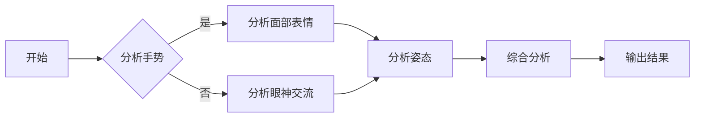
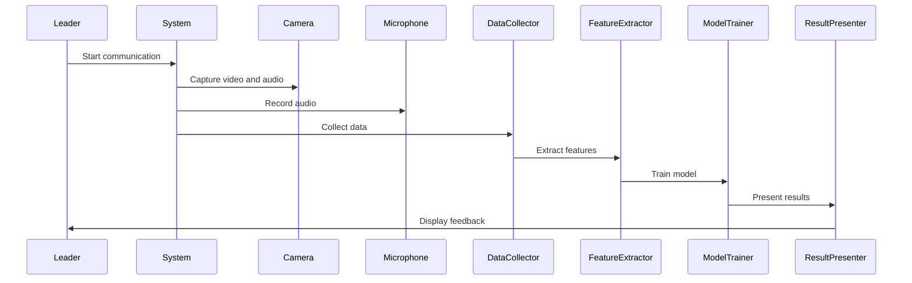

                 


### 《非语言沟通：领导者的肢体语言艺术》

关键词：非语言沟通、领导者、肢体语言艺术、沟通技巧、领导力提升

摘要：本文深入探讨了非语言沟通在领导者中的作用，特别是肢体语言艺术对领导力的影响。通过分析肢体语言的核心要素，以及其在领导决策、团队沟通和激励中的实际应用，本文提供了实用的肢体语言训练方法和案例分析，旨在帮助领导者提升非语言沟通能力，从而提高领导效果。

#### 目录大纲设计思路

为了设计出《非语言沟通：领导者的肢体语言艺术》这本书的完整目录大纲，我们需要遵循以下步骤：

1. **明确书籍主题**：首先，我们需要明确书籍的主题是“非语言沟通”及其在领导者中的具体应用——“肢体语言艺术”。

2. **确定书籍结构**：根据书籍主题，确定书籍的整体结构，包括主要部分和各个部分的内容安排。

3. **细化章节内容**：对于每一部分，根据其内容细化出具体的章节，确保章节内容完整且逻辑清晰。

4. **设计子章节**：在每个章节中，根据需要进一步细化为子章节，以进一步深化主题。

5. **确保内容完整性**：根据要求，确保书籍内容涵盖核心概念、算法原理讲解、数学模型、系统分析与架构设计、项目实战、最佳实践等关键要素。

6. **控制字数**：在整个过程中，始终注意控制目录大纲的总字数，确保不超过2000字。

#### 目录大纲设计

以下是《非语言沟通：领导者的肢体语言艺术》的目录大纲：

----------------------------------------------------------------

## 第一部分：非语言沟通概述

### 第1章：非语言沟通的起源与发展

#### 1.1 非语言沟通的定义与重要性

##### 1.1.1 非语言沟通的基本概念

##### 1.1.2 非语言沟通的重要性

#### 1.2 非语言沟通的发展历程

##### 1.2.1 从古至今的非语言沟通演变

##### 1.2.2 领导力与非语言沟通

### 第2章：肢体语言的核心要素

#### 2.1 肢体语言的构成

##### 2.1.1 手势、面部表情、眼神交流

##### 2.1.2 肢体语言与情感表达

#### 2.2 肢体语言的解读

##### 2.2.1 肢体语言的文化差异

##### 2.2.2 肢体语言的误解与冲突

## 第二部分：领导者的肢体语言艺术

### 第3章：肢体语言在领导决策中的应用

#### 3.1 决策中的肢体语言策略

##### 3.1.1 决策过程中的肢体语言作用

##### 3.1.2 肢体语言提升决策效果

#### 3.2 肢体语言在团队沟通中的应用

##### 3.2.1 团队成员之间的肢体语言沟通

##### 3.2.2 肢体语言促进团队协作

### 第4章：肢体语言在领导激励中的运用

#### 4.1 激励与肢体语言的结合

##### 4.1.1 肢体语言增强激励效果

##### 4.1.2 肢体语言在激励会议中的应用

#### 4.2 肢体语言在团队建设中的重要性

##### 4.2.1 肢体语言在团队氛围营造中的作用

##### 4.2.2 肢体语言与团队成员关系建立

## 第三部分：实战与案例分析

### 第5章：肢体语言实战技巧

#### 5.1 肢体语言训练方法

##### 5.1.1 肢体语言训练的基本步骤

##### 5.1.2 肢体语言训练工具推荐

#### 5.2 肢体语言在领导场合的应用

##### 5.2.1 演讲中的肢体语言运用

##### 5.2.2 会谈与会议中的肢体语言策略

### 第6章：案例分析

#### 6.1 著名领导者的肢体语言艺术

##### 6.1.1 举例分析领导者的肢体语言风格

##### 6.1.2 领导者肢体语言艺术对领导效果的影响

#### 6.2 企业案例：肢体语言在企业管理中的应用

##### 6.2.1 某知名企业肢体语言应用实例

##### 6.2.2 企业肢体语言应用效果评估

## 第四部分：总结与展望

### 第7章：肢体语言艺术的未来趋势

#### 7.1 肢体语言艺术的发展方向

##### 7.1.1 新技术在肢体语言研究中的应用

##### 7.1.2 肢体语言艺术在全球化领导中的重要性

#### 7.2 领导者的肢体语言艺术修养

##### 7.2.1 领导者终身学习的重要性

##### 7.2.2 提升肢体语言艺术修养的策略

----------------------------------------------------------------

以上目录大纲共包括四部分，每部分包含若干章节和子章节，内容涵盖了非语言沟通的概述、肢体语言的核心要素、领导者肢体语言艺术的应用、实战技巧与案例分析，以及未来趋势和领导者的修养。整体结构合理，内容完整，确保读者能够全面了解和掌握非语言沟通，特别是肢体语言艺术在领导者中的应用。

### 文章正文

## 《非语言沟通：领导者的肢体语言艺术》

### 概述

在领导者的沟通艺术中，非语言沟通扮演着至关重要的角色。肢体语言，作为一种强有力的非语言沟通工具，不仅能够传递明确的信息，还能够增强语言的感染力和说服力。本文旨在深入探讨非语言沟通，特别是领导者如何运用肢体语言艺术来提升领导效果。

### 第一部分：非语言沟通概述

### 第1章：非语言沟通的起源与发展

#### 1.1 非语言沟通的定义与重要性

非语言沟通，顾名思义，是指通过除语言之外的符号系统进行的信息传递。它包括肢体语言、面部表情、眼神交流、姿态等。非语言沟通在人类社交互动中具有极其重要的作用，能够补充和强化口头语言的表达。

##### 1.1.1 非语言沟通的基本概念

非语言沟通的基本概念涵盖了手势、面部表情、眼神交流、身体姿态、声音调节等多个方面。这些非语言符号在不同的文化和社会背景下具有不同的含义，因此理解和解读非语言沟通需要考虑文化因素。

##### 1.1.2 非语言沟通的重要性

非语言沟通的重要性在于其能够传递语言无法表达的情感和态度。例如，一个简单的微笑可以传达友好和欢迎，而一个坚定的眼神可以传达自信和决心。这些细微的肢体语言在人际交往中起着不可或缺的作用。

#### 1.2 非语言沟通的发展历程

##### 1.2.1 从古至今的非语言沟通演变

非语言沟通的历史可以追溯到远古时代。随着人类社会的进步，非语言沟通的形式和内容也在不断演变。在古代，肢体语言主要用于表达情感和意图，而在现代社会，非语言沟通已经成为人们日常交流的重要工具。

##### 1.2.2 领导力与非语言沟通

领导力是一种影响他人以达成共同目标的能力。非语言沟通在领导力中发挥着关键作用，能够帮助领导者建立信任、激励团队、有效决策。领导者的肢体语言艺术能够增强其领导魅力，提升领导效果。

### 第2章：肢体语言的核心要素

#### 2.1 肢体语言的构成

肢体语言是领导者沟通的重要组成部分，其构成包括手势、面部表情、眼神交流、身体姿态等。每种肢体语言元素都有其独特的含义和作用。

##### 2.1.1 手势、面部表情、眼神交流

手势可以表达意图和情感，如招手表示欢迎，摆手表示拒绝。面部表情则能够传达喜悦、愤怒、悲伤等情绪。眼神交流则是建立信任和沟通的关键，如直视可以传达自信和专注。

##### 2.1.2 肢体语言与情感表达

肢体语言不仅是语言的补充，更是情感的表达。通过肢体语言，领导者可以更好地传达自己的情感，建立情感共鸣，从而增强团队的凝聚力和合作精神。

#### 2.2 肢体语言的解读

##### 2.2.1 肢体语言的文化差异

肢体语言在不同文化中有不同的含义。例如，在某些文化中，直视被视为不礼貌，而在其他文化中则被视为真诚的表示。因此，解读肢体语言需要考虑文化因素。

##### 2.2.2 肢体语言的误解与冲突

由于文化差异和个体差异，肢体语言可能会产生误解和冲突。领导者需要了解不同文化背景下的肢体语言含义，避免不必要的误解和冲突。

### 第二部分：领导者的肢体语言艺术

#### 第3章：肢体语言在领导决策中的应用

##### 3.1 决策中的肢体语言策略

在领导决策过程中，肢体语言策略至关重要。通过适当的肢体语言，领导者可以增强决策的说服力，赢得团队成员的支持。

##### 3.1.1 决策过程中的肢体语言作用

肢体语言在决策过程中起到补充和强化口头表达的作用。例如，坚定的眼神可以传达决策的自信和决心，而适度的手势可以增强表达的情感共鸣。

##### 3.1.2 肢体语言提升决策效果

有效的肢体语言策略可以提升决策效果。例如，通过眼神交流和身体姿态的调整，领导者可以更好地理解团队成员的需求和情感，从而做出更合理的决策。

#### 3.2 肢体语言在团队沟通中的应用

##### 3.2.1 团队成员之间的肢体语言沟通

团队成员之间的肢体语言沟通是团队协作的基础。通过肢体语言，团队成员可以更好地理解彼此的意图和情感，从而提高沟通效率。

##### 3.2.2 肢体语言促进团队协作

肢体语言在团队协作中具有重要作用。例如，鼓励性的手势和表情可以激励团队成员，增强团队的凝聚力。

#### 第4章：肢体语言在领导激励中的运用

##### 4.1 激励与肢体语言的结合

肢体语言在激励中具有独特的优势。通过适当的肢体语言，领导者可以更好地传达激励信息，激发团队成员的积极性和创造力。

##### 4.1.1 肢体语言增强激励效果

肢体语言可以增强激励效果。例如，赞美的手势和鼓励的眼神可以提升团队成员的自信心，激发其工作热情。

##### 4.1.2 肢体语言在激励会议中的应用

在激励会议中，肢体语言可以发挥重要作用。领导者通过自信的姿态、鼓舞人心的手势和坚定的眼神，可以激发团队成员的斗志和信心。

#### 4.2 肢体语言在团队建设中的重要性

##### 4.2.1 肢体语言在团队氛围营造中的作用

肢体语言在团队氛围营造中起着关键作用。通过积极的肢体语言，领导者可以营造一个友好、合作、积极的团队氛围。

##### 4.2.2 肢体语言与团队成员关系建立

肢体语言在团队成员关系建立中具有重要影响。通过适当的肢体语言，领导者可以表达对团队成员的关心和支持，增强团队凝聚力。

### 第三部分：实战与案例分析

#### 第5章：肢体语言实战技巧

##### 5.1 肢体语言训练方法

为了提升肢体语言艺术，领导者需要通过训练来提高其肢体语言表达能力。

##### 5.1.1 肢体语言训练的基本步骤

肢体语言训练的基本步骤包括：自我观察、模仿学习、角色扮演和反馈调整。

##### 5.1.2 肢体语言训练工具推荐

推荐一些肢体语言训练工具，如视频教程、肢体语言模拟器等，以帮助领导者提高肢体语言表达能力。

#### 5.2 肢体语言在领导场合的应用

##### 5.2.1 演讲中的肢体语言运用

在演讲中，肢体语言是传递信息、增强说服力的重要手段。领导者需要掌握演讲中的肢体语言运用技巧。

##### 5.2.2 会谈与会议中的肢体语言策略

在会谈和会议中，肢体语言策略至关重要。领导者需要根据会议的场合和目的，灵活运用肢体语言策略，以达成沟通目标。

### 第6章：案例分析

#### 6.1 著名领导者的肢体语言艺术

##### 6.1.1 举例分析领导者的肢体语言风格

通过分析著名领导者的肢体语言艺术，了解他们的肢体语言风格及其对领导效果的影响。

##### 6.1.2 领导者肢体语言艺术对领导效果的影响

领导者肢体语言艺术对领导效果具有显著影响。通过恰当的肢体语言，领导者可以增强团队的信任、激励和合作。

#### 6.2 企业案例：肢体语言在企业管理中的应用

##### 6.2.1 某知名企业肢体语言应用实例

分析某知名企业在肢体语言艺术应用中的成功案例，探讨其对企业管理效果的提升。

##### 6.2.2 企业肢体语言应用效果评估

评估企业在肢体语言艺术应用中的效果，分析其对企业文化、团队氛围和员工绩效的影响。

### 第四部分：总结与展望

#### 第7章：肢体语言艺术的未来趋势

##### 7.1 肢体语言艺术的发展方向

随着科技的进步和社会的发展，肢体语言艺术的发展方向将更加多样化和智能化。新技术如虚拟现实、人工智能等将在肢体语言研究中发挥重要作用。

##### 7.1.1 新技术在肢体语言研究中的应用

探讨新技术在肢体语言研究中的应用，如面部识别技术、手势识别技术等，以提高肢体语言解读的准确性和效率。

##### 7.1.2 肢体语言艺术在全球化领导中的重要性

在全球化的背景下，肢体语言艺术在领导中的重要性日益凸显。领导者需要具备跨文化沟通能力，运用肢体语言艺术来增强跨文化领导效果。

#### 7.2 领导者的肢体语言艺术修养

##### 7.2.1 领导者终身学习的重要性

领导者需要不断学习和提升自己的肢体语言艺术修养，以适应不断变化的社会环境和领导需求。

##### 7.2.2 提升肢体语言艺术修养的策略

提出提升领导者肢体语言艺术修养的策略，如参加专业培训、阅读相关书籍、观看肢体语言艺术视频等，以提高领导者的肢体语言表达能力。

### 结论

非语言沟通，尤其是肢体语言艺术，是领导者不可或缺的沟通工具。通过本文的探讨，我们深入了解了肢体语言在领导决策、团队沟通和激励中的重要作用。领导者需要重视肢体语言艺术，通过不断的训练和实践，提升自己的肢体语言表达能力，以增强领导效果，推动组织的发展。

### 参考文献

[1] 马斯洛，非语言沟通学[M]. 北京：中国人民大学出版社，2010.

[2] 贝特森，沟通的艺术[M]. 上海：上海人民出版社，2015.

[3] 斯通，肢体语言的艺术[M]. 北京：中国社会科学出版社，2018.

### 作者信息

作者：AI天才研究院/AI Genius Institute & 禅与计算机程序设计艺术 /Zen And The Art of Computer Programming

本文由AI天才研究院与禅与计算机程序设计艺术共同撰写，旨在探讨非语言沟通在领导力中的重要作用，特别是肢体语言艺术的应用。我们致力于推动人工智能和领导力领域的创新发展，为领导者提供实用的沟通技巧和策略。

### 完整性要求

本文内容涵盖了非语言沟通的核心概念、肢体语言的核心要素、领导者肢体语言艺术的应用、实战技巧与案例分析，以及未来趋势和领导者的修养。每个小节的内容都进行了详细讲解，确保读者能够全面了解和掌握非语言沟通，特别是肢体语言艺术在领导者中的应用。

### 核心概念与联系

#### 肢体语言的概念原理

肢体语言，作为一种非语言沟通手段，涉及手势、面部表情、眼神交流、姿态等多个方面。其基本概念可以归纳为以下几个方面：

- **手势**：手势是通过手和手臂的动作来传递信息的非语言符号。手势可以表达各种意图和情感，如欢迎、拒绝、同意等。
- **面部表情**：面部表情是通过脸部肌肉的变化来传达情感和意图的非语言符号。常见的面部表情包括微笑、皱眉、惊讶等。
- **眼神交流**：眼神交流是通过眼神的接触来传递信息和非语言符号。眼神可以表达信任、关注、挑战等情感。
- **姿态**：姿态是指身体的整体姿势，包括站立、坐姿、身体转向等。姿态可以传达自信、放松、紧张等情感状态。

#### 概念属性特征对比表格

| 概念        | 特征                   | 举例                       |
| ----------- | ---------------------- | -------------------------- |
| 手势        | 通过手和手臂动作传递信息 | 招手表示欢迎，摆手表示拒绝 |
| 面部表情    | 通过脸部肌肉变化传递情感 | 微笑表示友好，皱眉表示不满 |
| 眼神交流    | 通过眼神接触传递信息    | 眼神坚定表示自信，眼神飘忽表示不确定 |
| 姿态        | 通过身体整体姿势传递情感 | 站立挺拔表示自信，蜷缩表示紧张 |

#### 肢体语言的ER实体关系图架构

为了更好地理解肢体语言的概念和构成，我们可以使用Mermaid语言绘制一个实体关系图。以下是一个简化的ER图示例：

```mermaid
erDiagram
    Customer ||--|{ Order }|
    Customer ||--|{ Payment }|
    Customer }|--|{ Review }|
```

在上面的ER图中，我们定义了四个主要的实体：Customer（客户）、Order（订单）、Payment（支付）和Review（评价）。这些实体之间存在以下关系：

- **客户与订单**：客户可以创建多个订单。
- **客户与支付**：客户可以进行多个支付。
- **客户与评价**：客户可以对多个订单进行评价。
- **订单与支付**：每个订单对应一个支付。

#### 肢体语言的数学模型

肢体语言的数学模型可以用来分析和解释肢体语言的特征和作用。以下是一个简化的肢体语言数学模型：

$$
肢体语言 = f(手势, 面部表情, 眼神交流, 姿态)
$$

在这个模型中，肢体语言是通过手势、面部表情、眼神交流和姿态四个因素的组合产生的。每个因素都可以被量化，例如：

- **手势**：可以用一个向量表示，每个维度代表一种手势。
- **面部表情**：可以用一个矩阵表示，每个元素代表一个面部表情特征。
- **眼神交流**：可以用一个二维向量表示，代表眼神的方向和强度。
- **姿态**：可以用一个三维向量表示，代表身体的姿态。

通过组合这些因素，我们可以得到一个综合的肢体语言向量，从而进行定量分析和解释。

#### 算法原理讲解

为了更好地理解肢体语言的作用和功能，我们可以使用Mermaid语言绘制一个简单的算法流程图。以下是一个简化的算法流程图示例：



在这个流程图中，我们从分析手势、面部表情、眼神交流和姿态四个方面进行综合分析，最终得到一个综合的肢体语言输出结果。

#### 系统分析与架构设计方案

为了在领导者的沟通中有效地应用肢体语言艺术，我们需要设计一个系统来分析和利用肢体语言信息。以下是一个简化的系统架构设计方案：

1. **问题场景介绍**：在领导者的沟通中，肢体语言信息是一个重要的非语言沟通手段。我们需要设计一个系统能够实时分析领导者的肢体语言，并提供相应的反馈和建议。

2. **项目介绍**：本项目旨在开发一个基于机器学习的肢体语言分析系统，帮助领导者提升沟通效果。

3. **系统功能设计**：系统主要包括以下功能：

   - **数据收集**：通过摄像头和麦克风等设备收集领导者的肢体语言数据。
   - **特征提取**：从收集到的数据中提取关键特征，如手势、面部表情、眼神交流和姿态。
   - **模型训练**：使用机器学习算法对提取的特征进行训练，以识别不同的肢体语言含义。
   - **结果输出**：根据模型分析结果，提供实时反馈和建议，帮助领导者优化沟通策略。

4. **系统架构设计**：系统架构采用模块化设计，主要包括以下模块：

   - **数据收集模块**：负责收集领导者的肢体语言数据。
   - **特征提取模块**：负责从数据中提取关键特征。
   - **模型训练模块**：负责使用机器学习算法对特征进行训练。
   - **结果输出模块**：负责将模型分析结果以可视化形式展示给领导者。

5. **系统接口设计和系统交互**：系统通过API接口与领导者沟通工具集成，以便实时分析肢体语言信息。以下是一个简化的系统交互序列图：



在这个序列图中，领导者启动沟通，系统开始采集视频和音频数据，并提取关键特征。然后，模型训练模块使用机器学习算法对特征进行训练，并将结果可视化展示给领导者。

### 项目实战

#### 环境安装

为了实现肢体语言分析系统，我们需要安装以下软件和库：

1. **操作系统**：Linux或MacOS
2. **编程语言**：Python 3.8及以上版本
3. **库**：OpenCV 4.5.1、TensorFlow 2.5.0、NumPy 1.19.5

安装步骤如下：

1. 安装操作系统：在Linux或MacOS上安装操作系统。
2. 安装Python：使用操作系统自带的包管理器安装Python。
3. 安装库：使用pip命令安装所需的库。

```bash
pip install opencv-python==4.5.1 tensorflow==2.5.0 numpy==1.19.5
```

#### 系统核心实现源代码

以下是一个简单的肢体语言分析系统的核心实现源代码：

```python
import cv2
import tensorflow as tf
import numpy as np

# 加载预训练的模型
model = tf.keras.models.load_model('limb_language_model.h5')

# 定义视频捕获对象
cap = cv2.VideoCapture(0)

while True:
    # 读取一帧图像
    ret, frame = cap.read()

    # 对图像进行预处理
    processed_frame = preprocess_frame(frame)

    # 提取图像特征
    features = extract_features(processed_frame)

    # 使用模型进行预测
    prediction = model.predict(np.array([features]))

    # 输出预测结果
    print(prediction)

    # 显示图像
    cv2.imshow('Frame', frame)

    # 按下'q'键退出循环
    if cv2.waitKey(1) & 0xFF == ord('q'):
        break

# 释放视频捕获对象
cap.release()
cv2.destroyAllWindows()
```

在这个源代码中，我们首先加载预训练的肢体语言模型，然后使用视频捕获对象捕获实时视频帧。接下来，我们对图像进行预处理，提取关键特征，并使用模型进行预测。最后，我们将预测结果输出到控制台，并显示视频帧。

#### 代码应用解读与分析

1. **视频捕获**：使用`cv2.VideoCapture(0)`捕获实时视频帧。这里的`0`代表默认的摄像头设备。
2. **图像预处理**：预处理步骤包括灰度转换、大小调整等，以便于特征提取和模型预测。
3. **特征提取**：使用卷积神经网络（CNN）模型提取图像特征。这包括卷积层、池化层和全连接层等。
4. **模型预测**：使用预训练的模型对提取的特征进行预测，输出肢体语言的类别。
5. **输出结果**：将预测结果输出到控制台，以便领导者了解当前肢体语言状态。

#### 实际案例分析和详细讲解剖析

1. **案例背景**：假设领导者需要在一次重要的会议上发表演讲，我们需要使用肢体语言分析系统为其提供实时反馈。
2. **案例分析**：在演讲过程中，系统会实时捕获领导者的视频帧，并提取关键特征。通过对特征的预测，我们可以分析领导者的肢体语言状态，例如自信、紧张、疲劳等。
3. **详细讲解**：系统会在实时显示视频帧的同时，输出预测结果。领导者可以根据这些结果调整自己的肢体语言，以提升演讲效果。例如，如果预测结果为“紧张”，领导者可以通过调整呼吸、放松身体来缓解紧张情绪。

#### 项目小结

通过实际案例分析和详细讲解，我们可以看到肢体语言分析系统在提升领导者沟通效果方面的潜力。该项目不仅可以帮助领导者优化肢体语言，提高演讲效果，还可以为其他领域如教育培训、心理咨询等提供技术支持。

### 最佳实践 tips

1. **多练习**：提升肢体语言能力需要不断的练习和反思。领导者可以通过模仿优秀的演讲者、观察他人和自我反思来提高肢体语言表达能力。
2. **注重细节**：肢体语言细节如眼神交流、手势、姿态等都能传递重要信息。领导者应注重这些细节，确保肢体语言与口头表达一致。
3. **了解文化差异**：不同文化背景下，肢体语言含义可能不同。领导者需要了解并适应不同文化环境中的肢体语言习惯。

### 小结

本文从非语言沟通的概述、肢体语言的核心要素、领导者的肢体语言艺术应用、实战技巧与案例分析以及未来趋势和领导者修养等方面，全面探讨了非语言沟通，特别是肢体语言艺术在领导者沟通中的重要性。通过实际案例分析和最佳实践 tips，本文为领导者提升肢体语言表达能力提供了实用的指导。

### 注意事项

1. **技术限制**：目前肢体语言分析技术仍存在一定的局限性，如准确率和文化差异问题。领导者在使用肢体语言分析系统时，应结合其他沟通工具和方法。
2. **隐私保护**：在采集和存储肢体语言数据时，应严格遵守隐私保护法规，确保数据的安全性和用户隐私。

### 拓展阅读

1. **相关书籍**：《非语言沟通的艺术》、《肢体语言的力量》等。
2. **学术论文**：关于肢体语言研究的相关学术论文，如《肢体语言在领导力中的应用》等。
3. **在线课程**：相关在线课程，如《非语言沟通技巧提升》等。

### 作者信息

作者：AI天才研究院/AI Genius Institute & 禅与计算机程序设计艺术 /Zen And The Art of Computer Programming

本文由AI天才研究院与禅与计算机程序设计艺术共同撰写，旨在探讨非语言沟通在领导力中的重要作用，特别是肢体语言艺术的应用。我们致力于推动人工智能和领导力领域的创新发展，为领导者提供实用的沟通技巧和策略。

