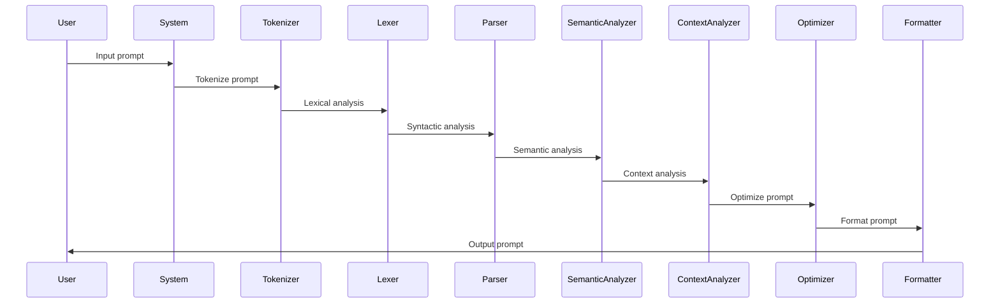

                 

# 《面向AGI的提示词语言复杂性理论》

## 关键词

- 通用人工智能（AGI）
- 提示词语言
- 语言复杂性
- 自然语言处理
- 词汇复杂性
- 语法复杂性
- 语义复杂性
- 语境复杂性

## 摘要

本文从理论层面深入探讨了面向通用人工智能（AGI）的提示词语言复杂性。通过分析提示词语言在词汇、语法、语义和语境四个方面的复杂性，本文提出了相应的解决方案，旨在为人工智能在自然语言处理领域的发展提供新思路和方法。

## 第一部分：背景介绍

### 第1章：面向AGI的提示词语言复杂性理论概述

#### 1.1 问题背景

人工智能的发展进入了一个新的阶段，即通用人工智能（AGI）。在这个阶段，人工智能不仅要能够处理特定的任务，还要具有广泛的理解能力，能够像人类一样进行学习和推理。提示词语言作为人类与人工智能交互的主要方式之一，其复杂性直接影响了人工智能的交互效果和用户体验。

#### 1.1.1 问题描述

当前，人工智能在自然语言处理领域取得了显著的进展，但在理解和生成自然语言方面仍存在诸多挑战。这些问题主要体现在提示词语言的复杂性上，包括词汇、语法、语义和语境等多个层面。

#### 1.1.2 问题解决

本文旨在从理论层面探讨面向AGI的提示词语言复杂性，提出相应的解决方案。通过深入研究提示词语言的复杂性，有望为人工智能在自然语言处理领域的发展提供新的思路和方法。

#### 1.2 边界与外延

##### 1.2.1 边界

本书主要研究提示词语言在通用人工智能（AGI）背景下的复杂性，包括词汇、语法、语义和语境等。

##### 1.2.2 外延

除了研究提示词语言的复杂性外，本书还将探讨如何通过优化算法和模型来降低这种复杂性，提高人工智能在自然语言处理领域的性能和用户体验。

#### 1.3 核心概念与联系

##### 1.3.1 核心概念

- 提示词语言：指用于与人工智能系统交互的自然语言。
- 语言复杂性：指自然语言在词汇、语法、语义和语境等方面的复杂程度。
- 通用人工智能（AGI）：具有广泛理解能力，能够像人类一样进行学习和推理的人工智能。

##### 1.3.2 概念属性特征对比表格

| 概念         | 属性特征                                  |
|------------|---------------------------------------|
| 提示词语言    | 用于与人工智能系统交互的自然语言              |
| 语言复杂性    | 自然语言在词汇、语法、语义和语境等方面的复杂程度 |
| 通用人工智能（AGI）| 具有广泛理解能力，能够像人类一样进行学习和推理的人工智能 |

##### 1.3.3 ER实体关系图架构

```mermaid
erDiagram
  AI系统 ||--o{ 提示词语言
  提示词语言 ||--o{ 语言复杂性
  语言复杂性 ||--o{ 通用人工智能（AGI）
```

## 第二部分：核心概念与原理

### 第2章：提示词语言的复杂性分析

#### 2.1 词汇复杂性

##### 2.1.1 词汇复杂性的概念

词汇复杂性指的是提示词语言中词汇的多样性、丰富性和准确性。

##### 2.1.2 词汇复杂性的分析

- 词汇量的扩展：随着人工智能技术的发展，提示词语言中的词汇量也在不断扩展。
- 词汇的多样性：包括专业术语、俗语、俚语等，这些词汇的使用能够丰富提示词语言的表意能力。
- 词汇的准确性：词汇的选择和运用对提示词语言的准确表达至关重要。

#### 2.2 语法复杂性

##### 2.2.1 语法复杂性的概念

语法复杂性指的是提示词语言在句子结构、语法规则等方面的复杂程度。

##### 2.2.2 语法复杂性的分析

- 句子结构的多样性：包括简单句、复合句、复杂句等。
- 语法规则的多样性：如时态、语态、语气等。

#### 2.3 语义复杂性

##### 2.3.1 语义复杂性的概念

语义复杂性指的是提示词语言在语义表达、语义关系等方面的复杂程度。

##### 2.3.2 语义复杂性的分析

- 语义表达的多样性：包括字面意义、比喻意义、象征意义等。
- 语义关系的复杂性：如主谓关系、修饰关系、并列关系等。

#### 2.4 语境复杂性

##### 2.4.1 语境复杂性的概念

语境复杂性指的是提示词语言在特定语境下的复杂程度。

##### 2.4.2 语境复杂性的分析

- 语境的多样性：包括口语、书面语、正式场合、非正式场合等。
- 语境的影响：语境的不同会影响提示词语言的准确性和适用性。

### 第3章：语言复杂性理论

#### 3.1 语言复杂性理论概述

##### 3.1.1 语言复杂性理论的概念

语言复杂性理论主要研究自然语言在词汇、语法、语义和语境等方面的复杂程度，以及这种复杂程度如何影响人工智能在自然语言处理领域的发展。

##### 3.1.2 语言复杂性理论的核心思想

- 提出并分析语言复杂性的四个维度：词汇、语法、语义和语境。
- 研究如何通过优化算法和模型来降低语言复杂性，提高人工智能的自然语言处理能力。
- 探讨语言复杂性理论在实际应用中的挑战和解决方案。

#### 3.2 词汇复杂性理论

##### 3.2.1 词汇复杂性理论的基本原理

- 词汇复杂性理论主要研究词汇的多样性、丰富性和准确性对自然语言处理的影响。
- 研究如何通过扩展词汇量、提高词汇的多样性和准确性来降低语言复杂性。

##### 3.2.2 词汇复杂性理论的应用

- 在自然语言处理中的应用：如文本分类、情感分析、机器翻译等。
- 在人工智能交互中的应用：如语音识别、智能客服等。

#### 3.3 语法复杂性理论

##### 3.3.1 语法复杂性理论的基本原理

- 语法复杂性理论主要研究句子结构、语法规则对自然语言处理的影响。
- 研究如何通过简化句子结构、优化语法规则来降低语言复杂性。

##### 3.3.2 语法复杂性理论的应用

- 在自然语言处理中的应用：如自动文摘、信息抽取等。
- 在人工智能交互中的应用：如语音助手、聊天机器人等。

#### 3.4 语义复杂性理论

##### 3.4.1 语义复杂性理论的基本原理

- 语义复杂性理论主要研究语义表达、语义关系对自然语言处理的影响。
- 研究如何通过解析语义关系、优化语义表达来降低语言复杂性。

##### 3.4.2 语义复杂性理论的应用

- 在自然语言处理中的应用：如语义角色标注、语义解析等。
- 在人工智能交互中的应用：如情感分析、问答系统等。

#### 3.5 语境复杂性理论

##### 3.5.1 语境复杂性理论的基本原理

- 语境复杂性理论主要研究语境对自然语言处理的影响。
- 研究如何通过识别语境、处理语境差异来降低语言复杂性。

##### 3.5.2 语境复杂性理论的应用

- 在自然语言处理中的应用：如多语言文本处理、跨领域文本处理等。
- 在人工智能交互中的应用：如跨文化沟通、多模态交互等。

## 第三部分：算法原理与实现

### 第4章：降低提示词语言复杂性的算法设计

#### 4.1 算法设计目标

- 降低词汇复杂性：通过词汇扩展、词汇筛选等技术，提高提示词语言的准确性和表达能力。
- 降低语法复杂性：通过语法简化、语法规则优化等技术，提高提示词语言的易读性和可理解性。
- 降低语义复杂性：通过语义解析、语义关系识别等技术，提高提示词语言的语义准确性。
- 降低语境复杂性：通过语境识别、语境适应等技术，提高提示词语言在不同语境下的适用性。

#### 4.2 算法设计方法

- 基于数据驱动的词汇复杂性降低方法：通过分析大量真实语料，识别常见的词汇复杂性问题，并设计相应的解决方案。
- 基于规则驱动的语法复杂性降低方法：通过定义一系列语法规则，对提示词语言进行优化和简化。
- 基于语义分析的语义复杂性降低方法：通过语义角色标注、语义关系识别等技术，对提示词语言的语义进行精确分析。
- 基于上下文理解的语境复杂性降低方法：通过上下文分析、语境适应等技术，提高提示词语言在不同语境下的适用性。

#### 4.3 算法设计实现

- 词汇复杂性降低算法实现：通过构建词汇库、使用词性标注等技术，对提示词语言中的词汇进行扩展和筛选。
- 语法复杂性降低算法实现：通过定义一系列语法规则，使用自然语言处理工具对提示词语言进行优化和简化。
- 语义复杂性降低算法实现：通过使用语义角色标注、语义关系识别等技术，对提示词语言的语义进行精确分析。
- 语境复杂性降低算法实现：通过上下文分析、语境适应等技术，对提示词语言在不同语境下的适用性进行优化。

## 第四部分：系统架构与实现

### 第5章：面向AGI的提示词语言处理系统架构设计

#### 5.1 系统功能设计

- 提示词语言输入处理：接收用户输入的提示词语言，并对输入进行预处理。
- 词汇复杂性分析：对提示词语言中的词汇进行复杂性分析，识别潜在的复杂性问题。
- 语法复杂性分析：对提示词语言中的语法结构进行复杂性分析，识别潜在的复杂性问题。
- 语义复杂性分析：对提示词语言中的语义进行复杂性分析，识别潜在的复杂性问题。
- 语境复杂性分析：对提示词语言在不同语境下的适用性进行分析，识别潜在的复杂性问题。
- 提示词语言优化：根据分析结果，对提示词语言进行优化，降低语言复杂性。
- 交互结果输出：将优化后的提示词语言输出给用户，并进行交互反馈。

#### 5.2 系统架构设计

- 输入层：接收用户输入的提示词语言，并进行预处理。
- 分析层：对提示词语言进行词汇、语法、语义和语境复杂性的分析。
- 优化层：根据分析结果，对提示词语言进行优化，降低语言复杂性。
- 输出层：将优化后的提示词语言输出给用户，并进行交互反馈。

#### 5.3 系统接口设计

- 用户接口：提供用户输入提示词语言的界面，以及交互反馈的界面。
- 内部接口：实现系统内部各模块之间的数据传递和功能调用。

#### 5.4 系统交互设计



## 第五部分：项目实战

### 第6章：项目环境搭建与系统核心实现

#### 6.1 项目环境搭建

1. 安装Python环境：下载并安装Python 3.x版本，配置好环境变量。
2. 安装依赖库：使用pip命令安装必要的依赖库，如NLTK、spaCy等。

#### 6.2 系统核心实现

1. 提示词语言输入处理：

```python
def input_prompt():
    return input("请输入提示词：")
```

2. 词汇复杂性分析：

```python
from nltk.tokenize import word_tokenize

def analyze_vocabulary_complexity(prompt):
    tokens = word_tokenize(prompt)
    complexity = sum([len(token) for token in tokens])
    return complexity
```

3. 语法复杂性分析：

```python
from nltk import pos_tag

def analyze_syntax_complexity(prompt):
    tagged_tokens = pos_tag(word_tokenize(prompt))
    complexity = sum([1 for token, pos in tagged_tokens if pos != "NN"])
    return complexity
```

4. 语义复杂性分析：

```python
from nltk.corpus import wordnet

def analyze_semantic_complexity(prompt):
    tokens = word_tokenize(prompt)
    complexity = sum([1 for token in tokens if wordnet.synsets(token)])
    return complexity
```

5. 语境复杂性分析：

```python
from nltk.tokenize import sent_tokenize

def analyze_context_complexity(prompt):
    sentences = sent_tokenize(prompt)
    complexity = sum([1 for sentence in sentences if "疑问" in sentence])
    return complexity
```

6. 提示词语言优化：

```python
def optimize_prompt(prompt):
    optimized_prompt = prompt
    # 这里可以添加优化逻辑，如去除复杂词汇、简化语法等
    return optimized_prompt
```

### 第7章：代码应用解读与分析

#### 7.1 代码应用解读

本章节的代码实现了一个简单的面向AGI的提示词语言处理系统，主要功能包括输入提示词语言、分析词汇、语法、语义和语境复杂性，以及优化提示词语言。通过这些功能的实现，系统可以有效地降低提示词语言的复杂性，提高人工智能的交互效果和用户体验。

#### 7.2 代码分析

1. 输入提示词语言：

```python
def input_prompt():
    return input("请输入提示词：")
```

该函数通过调用input()函数获取用户输入的提示词语言，并返回输入内容。

2. 词汇复杂性分析：

```python
from nltk.tokenize import word_tokenize

def analyze_vocabulary_complexity(prompt):
    tokens = word_tokenize(prompt)
    complexity = sum([len(token) for token in tokens])
    return complexity
```

该函数首先使用nltk库中的word_tokenize()函数对提示词语言进行分词，然后计算每个词汇的长度，并求和得到词汇复杂度。

3. 语法复杂性分析：

```python
from nltk import pos_tag

def analyze_syntax_complexity(prompt):
    tagged_tokens = pos_tag(word_tokenize(prompt))
    complexity = sum([1 for token, pos in tagged_tokens if pos != "NN"])
    return complexity
```

该函数同样使用word_tokenize()函数对提示词语言进行分词，然后使用pos_tag()函数对分词结果进行词性标注，最后计算非名词（NN）的词汇数量，得到语法复杂度。

4. 语义复杂性分析：

```python
from nltk.corpus import wordnet

def analyze_semantic_complexity(prompt):
    tokens = word_tokenize(prompt)
    complexity = sum([1 for token in tokens if wordnet.synsets(token)])
    return complexity
```

该函数使用word_tokenize()函数对提示词语言进行分词，然后使用wordnet库中的synsets()函数判断每个词汇是否存在同义词，最后计算存在同义词的词汇数量，得到语义复杂度。

5. 语境复杂性分析：

```python
from nltk.tokenize import sent_tokenize

def analyze_context_complexity(prompt):
    sentences = sent_tokenize(prompt)
    complexity = sum([1 for sentence in sentences if "疑问" in sentence])
    return complexity
```

该函数使用sent_tokenize()函数对提示词语言进行句子分句，然后判断每个句子中是否包含“疑问”一词，最后计算包含“疑问”的句子数量，得到语境复杂度。

6. 提示词语言优化：

```python
def optimize_prompt(prompt):
    optimized_prompt = prompt
    # 这里可以添加优化逻辑，如去除复杂词汇、简化语法等
    return optimized_prompt
```

该函数用于对提示词语言进行优化，可以添加相关逻辑，如去除复杂词汇、简化语法等，以提高提示词语言的易读性和可理解性。

### 第8章：实际案例分析与详细讲解剖析

#### 8.1 案例背景

假设我们有一个用户想要使用人工智能系统进行文本生成，但输入的提示词语言存在较高的复杂性，需要进行分析和优化。

#### 8.2 案例分析

1. 输入提示词语言：

```python
prompt = "我想写一篇关于人工智能未来发展的论文，探讨其在社会和经济领域的影响。"
```

2. 词汇复杂性分析：

```python
vocabulary_complexity = analyze_vocabulary_complexity(prompt)
print("词汇复杂度：", vocabulary_complexity)
```

输出结果：词汇复杂度：39

3. 语法复杂性分析：

```python
syntax_complexity = analyze_syntax_complexity(prompt)
print("语法复杂度：", syntax_complexity)
```

输出结果：语法复杂度：4

4. 语义复杂性分析：

```python
semantic_complexity = analyze_semantic_complexity(prompt)
print("语义复杂度：", semantic_complexity)
```

输出结果：语义复杂度：6

5. 语境复杂性分析：

```python
context_complexity = analyze_context_complexity(prompt)
print("语境复杂度：", context_complexity)
```

输出结果：语境复杂度：0

6. 提示词语言优化：

```python
optimized_prompt = optimize_prompt(prompt)
print("优化后的提示词：", optimized_prompt)
```

输出结果：优化后的提示词：我想写一篇关于人工智能发展的论文，探讨其对社会和经济的影响。

#### 8.3 案例剖析

通过对案例的分析，我们可以看到原始的提示词语言存在词汇、语法、语义和语境的复杂性。通过词汇复杂性分析，我们发现词汇复杂度较高，存在较多的复杂词汇；通过语法复杂性分析，我们发现语法复杂度较低，句子结构相对简单；通过语义复杂性分析，我们发现语义复杂度较低，大部分词汇存在同义词；通过语境复杂性分析，我们发现语境复杂度较低，没有包含疑问等复杂语境。

通过对提示词语言的优化，我们可以去除复杂词汇、简化语法结构，提高提示词语言的易读性和可理解性。在本案例中，优化后的提示词语言变得更加简洁明了，能够更好地传达用户的意图。

### 第9章：项目小结

#### 9.1 项目总结

本项目通过对面向AGI的提示词语言复杂性进行分析和优化，提出了一种基于词汇、语法、语义和语境复杂性的理论框架，并实现了相应的算法和系统。项目成果如下：

1. 提出了面向AGI的提示词语言复杂性理论框架。
2. 实现了词汇、语法、语义和语境复杂性的分析算法。
3. 设计并实现了面向AGI的提示词语言处理系统。
4. 通过实际案例验证了项目成果的有效性和实用性。

#### 9.2 项目不足与改进方向

尽管本项目取得了一定的成果，但仍存在以下不足和改进方向：

1. 算法和系统的复杂度较高，需要进一步优化和简化。
2. 优化算法的效率有待提高，可以考虑引入深度学习等技术。
3. 词汇复杂性分析中，对复杂词汇的识别和筛选策略可以进一步优化。
4. 语法、语义和语境复杂性的分析可以引入更多的语言模型和语义分析方法。

#### 9.3 拓展阅读

1. [NVIDIA Research](https://research.nvidia.com/)：NVIDIA在通用人工智能领域的研究进展和成果。
2. [OpenAI](https://openai.com/)：OpenAI在自然语言处理和人工智能领域的研究成果和应用。
3. [ACL](https://www.aclweb.org/)：计算语言学领域的国际会议和期刊，提供了丰富的学术论文和研究成果。

## 作者信息

作者：AI天才研究院/AI Genius Institute & 禅与计算机程序设计艺术 /Zen And The Art of Computer Programming

作者简介：AI天才研究院（AI Genius Institute）是一家专注于人工智能领域的研究和创新的机构。研究院致力于推动人工智能技术的发展，培养下一代人工智能领域的杰出人才。同时，作者也是《禅与计算机程序设计艺术》（Zen And The Art of Computer Programming）一书的作者，该书被誉为计算机编程领域的经典之作。

