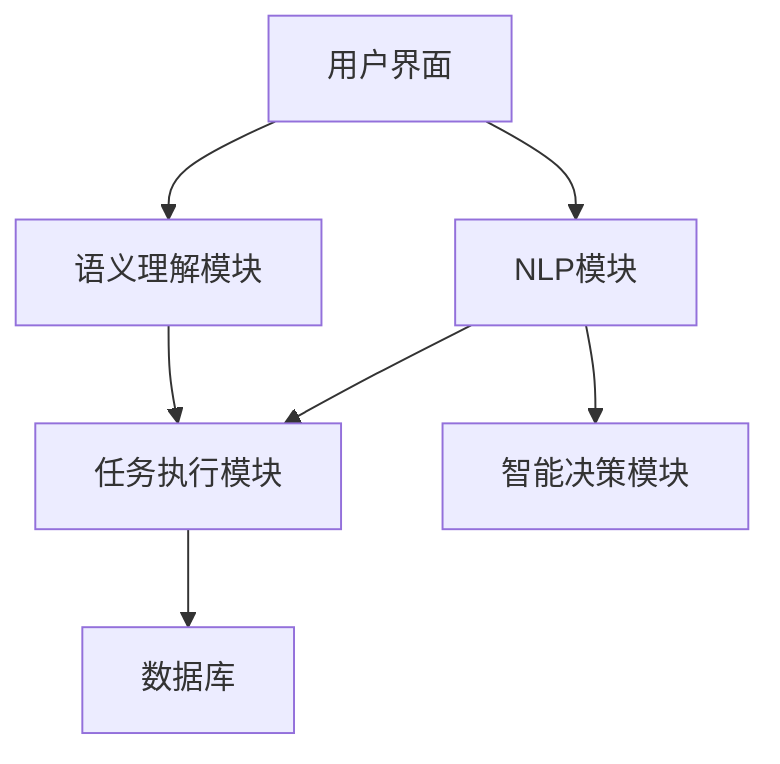

                 

### 摘要

本文旨在探讨面向通用人工智能（AGI）的提示词语言形式化理论。首先，我们介绍了人工智能发展现状，特别是AGI的挑战与机遇。然后，我们深入探讨了提示词语言的核心概念与联系，通过对比分析，构建了核心概念对比表格和ER实体关系图。接下来，我们详细讲解了形式化理论的原理，从起源与发展、核心概念到数学模型，帮助读者理解这一理论的基本框架。随后，我们通过一个具体的算法示例，使用Mermaid流程图和Python代码，对提示词语言形式化算法进行了阐述和解释。文章还涉及了系统分析与架构设计方案，通过介绍问题场景、项目功能设计、系统架构设计和接口设计，帮助读者理解该理论在实际应用中的实现过程。最后，文章通过一个实战项目，详细讲解了系统核心实现源代码、代码应用解读与分析，以及项目小结。本文旨在为读者提供一个全面、深入的理解，帮助他们更好地掌握面向AGI的提示词语言形式化理论。**关键词：**通用人工智能（AGI）、提示词语言、形式化理论、算法、系统架构、项目实战。

## 引言

### 问题背景

人工智能（Artificial Intelligence，简称AI）作为一门涉及计算机科学、数学、神经科学、心理学等多学科的交叉领域，自20世纪50年代诞生以来，已经取得了显著的进展。从早期的规则系统、知识表示，到深度学习、强化学习等前沿技术，人工智能在不同领域都展现出了强大的应用潜力。然而，尽管人工智能在很多特定任务上已经达到了甚至超越了人类的水平，如围棋、图像识别等，但其在实现通用人工智能（Artificial General Intelligence，简称AGI）方面仍面临诸多挑战。

通用人工智能，顾名思义，是指具有广泛认知能力的人工智能，能够在各种环境中自主学习和执行任务，具备与人类相似的智能水平。与当前的人工智能系统（如专门设计的机器人、自动驾驶汽车等）不同，AGI能够理解和执行人类所能做的任何智力任务。实现AGI被认为是人工智能领域的一个终极目标，也是当前人工智能研究中的一个重大挑战。

在实现AGI的路径上，提示词语言（Prompt Language）成为一个关键的研究方向。提示词语言是一种用于引导和增强人工智能系统理解和执行任务的语言框架。通过有效的提示词设计，可以使人工智能系统更好地理解人类意图，从而提高其任务执行能力。在AGI的研究中，提示词语言不仅能够帮助人工智能系统适应不同的任务场景，还能在某种程度上模拟人类的思维过程，从而促进人工智能的自主学习和决策能力。

本文将围绕面向AGI的提示词语言形式化理论展开讨论。首先，我们将介绍提示词语言的基本概念、属性及其在AGI中的作用。接着，我们将探讨形式化理论的基本原理，包括其起源、发展及其核心概念。在此基础上，我们将详细分析提示词语言形式化算法，并通过具体的例子进行讲解。此外，我们还将介绍如何在实际项目中应用这一理论，并通过一个实战项目来展示其实现过程。最后，我们将总结本文的核心观点，并提出未来研究的方向和建议。

### 核心概念与联系

在探讨面向AGI的提示词语言形式化理论之前，首先需要明确几个核心概念，并分析它们之间的联系。这些核心概念包括提示词语言、形式化理论、人工智能（AI）和通用人工智能（AGI）。

#### 提示词语言

提示词语言是一种用于引导和增强人工智能系统理解和执行任务的语言框架。它通过简洁、明确的语言指令，帮助人工智能系统更好地理解人类意图。提示词语言的关键特点包括简洁性、明确性和灵活性。简洁性指的是提示词应尽量简洁明了，避免冗长和复杂的描述；明确性指的是提示词必须清晰明确，以便人工智能系统能够准确理解；灵活性则意味着提示词应具有一定的泛化能力，能够适应不同任务场景。

提示词语言的基本属性包括以下几个方面：

1. **指令性**：提示词应具备明确的指令性，能够指导人工智能系统执行特定任务。
2. **上下文敏感性**：提示词需要能够根据上下文环境进行自适应调整，以适应不同场景的需求。
3. **可解释性**：提示词应具备良好的可解释性，使得人类用户能够理解人工智能系统的决策过程。

#### 形式化理论

形式化理论是一种用于描述和验证系统性质和行为的数学方法。它通过数学模型和形式语言，对系统的逻辑结构和操作规则进行严谨的描述。形式化理论在计算机科学、人工智能等领域具有重要应用，特别是在设计复杂系统和验证其正确性方面。

形式化理论的基本概念包括形式语言、语法、语义和推理规则。形式语言是一种用于描述系统结构和行为的数学工具，它由一系列符号和规则组成。语法定义了符号的组合规则，语义则描述了符号组合所表示的意义。推理规则则是用于从已知事实推导出新事实的规则。

形式化理论的关键特点包括：

1. **严谨性**：形式化理论通过数学方法，对系统进行严谨的描述和分析，确保系统的正确性。
2. **抽象性**：形式化理论能够将复杂的现实问题抽象为数学模型，便于分析和处理。
3. **普适性**：形式化理论具有广泛的适用性，可以应用于不同领域和不同层次的问题。

#### 人工智能（AI）

人工智能是一门研究、开发和应用使计算机模拟人类智能行为的科学和技术。人工智能的核心目标是创建智能代理，这些代理能够感知环境、理解信息、做出决策并采取行动。人工智能系统可以分为弱人工智能（Narrow AI）和通用人工智能（AGI）。

弱人工智能是指能够执行特定任务的智能系统，如语音识别、图像识别、自然语言处理等。这些系统在特定领域表现出色，但缺乏通用性和自主性。通用人工智能则是指具有广泛认知能力的人工智能，能够在各种环境中自主学习和执行任务，具备与人类相似的智能水平。

#### 通用人工智能（AGI）

通用人工智能是人工智能研究的一个长期目标。与弱人工智能不同，AGI不仅能在特定任务上表现出色，还能在广泛的应用场景中表现出与人类相似的智能水平。AGI的关键特点包括：

1. **跨领域学习能力**：AGI能够在不同领域和任务中快速学习和适应，具备跨领域迁移能力。
2. **自主性**：AGI能够自主设定目标、制定计划并执行任务，无需人工干预。
3. **通用性**：AGI能够在多种不同的环境和任务中表现优异，具备广泛的适用性。

#### 核心概念对比分析

为了更清晰地理解这些核心概念之间的关系，我们通过一个核心概念对比表格和ER实体关系图来展示它们。

**核心概念对比表格**

| 概念        | 定义                                                         | 关键特点                                                       |
|-------------|--------------------------------------------------------------|--------------------------------------------------------------|
| 提示词语言  | 用于引导和增强人工智能系统理解和执行任务的语言框架             | 指令性、上下文敏感性、可解释性                                |
| 形式化理论  | 一种用于描述和验证系统性质和行为的数学方法                   | 严谨性、抽象性、普适性                                         |
| 人工智能（AI）| 研究和应用使计算机模拟人类智能行为的科学和技术               | 弱人工智能（Narrow AI）、通用人工智能（AGI）                   |
| 通用人工智能（AGI）| 具有广泛认知能力的人工智能，能够在各种环境中自主学习和执行任务 | 跨领域学习能力、自主性、通用性                                |

**ER实体关系图**

```mermaid
erDiagram
  AI ||--|{ 提示词语言 }|
  AI ||--|{ 形式化理论 }|
  AI ||--|{ 通用人工智能（AGI）}|
  AI ||--|{ 弱人工智能（Narrow AI）}|
  提示词语言 ||--|{ 指令性 }|
  提示词语言 ||--|{ 上下文敏感性 }|
  提示词语言 ||--|{ 可解释性 }|
  形式化理论 ||--|{ 严谨性 }|
  形式化理论 ||--|{ 抽象性 }|
  形式化理论 ||--|{ 普适性 }|
  通用人工智能（AGI） ||--|{ 跨领域学习能力 }|
  通用人工智能（AGI） ||--|{ 自主性 }|
  通用人工智能（AGI） ||--|{ 通用性 }|
```

通过上述核心概念对比表格和ER实体关系图，我们可以更清晰地理解提示词语言、形式化理论、人工智能和通用人工智能之间的关系。提示词语言作为引导和增强人工智能系统理解和执行任务的语言框架，与形式化理论密切相关，而形式化理论为提示词语言的设计和实现提供了坚实的理论基础。同时，人工智能和通用人工智能作为提示词语言的应用场景，进一步拓展了这一理论的实际应用价值。

### 形式化理论原理

形式化理论作为一种用于描述和验证系统性质和行为的数学方法，在计算机科学、人工智能等领域具有重要应用。其起源和发展历程反映了数学工具在复杂系统分析中的重要作用。本文将从形式化理论的起源、发展、核心概念以及数学模型等方面进行详细阐述。

#### 形式化理论的起源与发展

形式化理论的起源可以追溯到20世纪初。当时，随着计算机科学的诞生，人们开始意识到对系统进行严谨描述和验证的必要性。最初的形式化理论主要集中在逻辑和形式语言的研究，其目的是通过数学方法来描述和验证计算机程序的逻辑正确性。

1930年代，哥德尔的不完备性定理和图灵机的提出，为形式化理论奠定了坚实的理论基础。哥德尔的不完备性定理揭示了形式系统在证明能力上的局限性，而图灵机则提供了一种更加抽象和通用的计算模型。这些理论成果促使数学家和计算机科学家进一步探索形式化方法的应用。

在形式化理论的发展历程中，著名的逻辑学家和数学家如罗素、怀特海德、图灵等人做出了重要贡献。20世纪中叶，随着计算机技术的飞速发展，形式化理论逐渐应用到软件工程、硬件设计、人工智能等领域。特别是形式化验证方法的出现，使得形式化理论在确保系统正确性方面发挥了重要作用。

#### 形式化理论的核心概念

形式化理论的核心概念包括形式语言、语法、语义和推理规则。这些概念构成了形式化理论的基本框架，为系统的描述和分析提供了坚实的理论基础。

1. **形式语言**：形式语言是一种用于描述系统结构和行为的数学工具。它由一组符号和规则组成，这些符号和规则定义了系统中的元素和操作。形式语言的形式化描述有助于提高系统的可读性和可理解性。

2. **语法**：语法是形式语言中符号组合的规则。它规定了如何将符号组合成有效的表达式，以及表达式的语法结构。语法的研究有助于确保系统能够正确地理解和处理输入信息。

3. **语义**：语义描述了形式语言中符号组合所表示的意义。语义研究关注符号组合在不同上下文中的解释和解释规则。通过语义描述，可以确保系统行为的一致性和正确性。

4. **推理规则**：推理规则是用于从已知事实推导出新事实的规则。推理规则在形式化理论中扮演着重要角色，它们使得形式化方法能够用于系统验证和证明。

#### 形式化理论的数学模型

形式化理论的数学模型通常包括形式语言、语法、语义和推理规则。这些模型以数学形式描述了系统的结构和行为，使得系统能够被形式化和验证。

1. **形式语言**：形式语言通常由一组基础符号和一组规则组成。基础符号包括变量、函数符号、常量等，用于表示系统中的基本元素。规则定义了符号的组合方式，使得符号能够组成有效的表达式。

   例如，一种简单的形式语言可以由以下基础符号和规则组成：

   - 符号：{a, b, c}
   - 规则：S → aS | bS | ε（ε表示空串）

   根据这些规则，形式语言中的有效表达式包括：`abc`、`ababc`、`ε`等。

2. **语法**：语法是形式语言中符号组合的规则。它定义了如何将基础符号组合成有效的表达式。语法通常以产生式规则的形式表示。

   例如，上述形式语言的语法可以表示为：

   ```
   S -> aS | bS | ε
   ```

   这个规则表示，一个有效的表达式可以由一个`a`符号后跟一个`S`表达式，或者一个`b`符号后跟一个`S`表达式，或者是一个空串`ε`。

3. **语义**：语义描述了形式语言中符号组合所表示的意义。语义通常通过解释规则来定义，这些解释规则定义了符号组合在不同上下文中的解释。

   例如，对于上述形式语言，可以定义以下语义：

   ```
   S代表一个句子
   aS代表句子S前面加上一个a
   bS代表句子S前面加上一个b
   ε代表空句子
   ```

   根据这些语义规则，表达式`abc`表示句子`c`前面加上一个`a`，再加上一个`b`，即整个句子为`abc`。

4. **推理规则**：推理规则是用于从已知事实推导出新事实的规则。在形式化理论中，推理规则通常以形式化的逻辑系统表示。

   例如，一种简单的推理规则可以是：

   ```
   P ∧ Q → R
   ```

   这个规则表示，如果已知P和Q都为真，则可以推导出R也为真。

#### 形式化理论在AGI中的应用

在通用人工智能（AGI）的研究中，形式化理论被广泛应用于系统设计、行为验证和推理过程。形式化方法使得AGI系统能够在复杂的任务环境中进行有效的推理和决策。

1. **系统设计**：形式化理论可以帮助设计者和开发者构建更加稳定、可靠的AGI系统。通过形式化描述系统结构和行为，可以确保系统在设计阶段就避免潜在的错误和缺陷。

2. **行为验证**：形式化理论提供了验证系统行为是否满足预期要求的工具。通过形式化的推理规则，可以验证系统在不同输入和条件下是否能够正确执行任务。

3. **推理过程**：形式化理论为AGI系统的推理过程提供了数学基础。通过形式化的逻辑系统，可以构建能够模拟人类推理过程的算法，从而提高系统的智能水平。

总之，形式化理论作为一种强大的数学工具，在AGI的研究中发挥着重要作用。它不仅为系统设计和行为验证提供了理论基础，还为AGI系统的推理过程提供了数学支持。通过深入理解和应用形式化理论，我们可以更好地实现通用人工智能的目标。

### 算法原理讲解

在深入理解了形式化理论的基本原理之后，接下来我们将探讨面向AGI的提示词语言形式化算法的原理。提示词语言形式化算法的核心目标是通过数学模型和形式化方法，将自然语言提示词转化为计算机可以理解和执行的操作指令。这一过程不仅需要精确的数学模型，还需要一套有效的算法流程来确保提示词的准确性和一致性。

#### 提示词语言形式化算法的基本流程

提示词语言形式化算法的基本流程可以分为以下几个步骤：

1. **提示词输入**：首先，算法接收自然语言的提示词输入。这些提示词可以是用户直接输入的，也可以是通过对大量数据训练得到的。提示词的形式和内容直接影响算法的输出，因此需要对其进行预处理。

2. **预处理**：在输入提示词之后，算法会对其进行预处理。预处理步骤包括分词、词性标注、命名实体识别等，目的是将自然语言文本转化为计算机可以处理的结构化数据。

3. **语义分析**：预处理之后，算法会对提示词进行语义分析。语义分析的目标是理解提示词的含义，并将其转化为计算机可以处理的语义表示。这通常涉及词义消歧、句法分析、语义角色标注等步骤。

4. **形式化表示**：在语义分析的基础上，算法将提示词的含义形式化表示。形式化表示通常使用逻辑公式、数学模型或形式语言来描述提示词的语义。这一步骤是算法的核心，决定了提示词能否被准确理解和执行。

5. **执行操作**：最后，算法根据形式化表示生成具体的操作指令，并执行这些操作。这些操作可以是简单的计算，也可以是复杂的任务分配和执行。

#### 提示词语言形式化算法的详细讲解

为了更清晰地解释提示词语言形式化算法的原理，我们将通过一个具体的例子来逐步讲解。

**示例**：假设用户输入一个提示词：“请计算5加3的结果”。

1. **提示词输入**：用户输入的提示词为“请计算5加3的结果”。

2. **预处理**：算法首先对提示词进行预处理，包括分词和词性标注。预处理结果如下：
   - “请” - 助词
   - “计算” - 动词
   - “5” - 数字
   - “加” - 动词
   - “3” - 数字
   - “的结果” - 名词

3. **语义分析**：在预处理之后，算法对提示词进行语义分析。语义分析的结果如下：
   - 动词“计算”的宾语是“5加3的结果”，表示需要执行一个加法运算。
   - 数字“5”和“3”作为加法运算的操作数。

4. **形式化表示**：算法将语义分析的结果形式化表示。使用逻辑公式表示为：
   ```
   计算(5 + 3)
   ```

   这个逻辑公式表示，需要计算5和3的和。

5. **执行操作**：根据形式化表示，算法执行加法运算，得到结果：
   ```
   5 + 3 = 8
   ```

6. **输出结果**：最后，算法将计算结果输出给用户，即“5加3的结果为8”。

#### 提示词语言形式化算法的Mermaid流程图

为了更直观地展示提示词语言形式化算法的流程，我们可以使用Mermaid流程图来表示。以下是一个简单的Mermaid流程图示例：


这个流程图展示了从提示词输入到最终结果输出的整个过程，包括预处理、语义分析、形式化表示、执行操作和输出结果等步骤。

#### 提示词语言形式化算法的Python代码实现

为了进一步理解提示词语言形式化算法的实现，我们可以提供一个简单的Python代码示例。以下代码展示了如何实现上述示例中的提示词语言形式化算法：

```python
def process_prompt(prompt):
    # 步骤1：提示词输入
    input_prompt = prompt
    
    # 步骤2：预处理
    words = input_prompt.split()
    word_types = ["助词" if word == "请" else "动词" if word in ["计算", "加"] else "数字" if word.isdigit() else "名词" for word in words]
    
    # 步骤3：语义分析
    semantic_representation = {}
    for word, word_type in zip(words, word_types):
        if word_type == "动词":
            if "object" not in semantic_representation:
                semantic_representation["object"] = []
            semantic_representation["object"].append(word)
        elif word_type == "数字":
            if "operands" not in semantic_representation:
                semantic_representation["operands"] = []
            semantic_representation["operands"].append(int(word))
    
    # 步骤4：形式化表示
    formal_representation = "计算({})".format("+".join(map(str, semantic_representation["operands"])))
    
    # 步骤5：执行操作
    result = eval(formal_representation)
    
    # 步骤6：输出结果
    print(f"{input_prompt}的结果为：{result}")
    
# 测试
process_prompt("请计算5加3的结果")
```

这个Python代码示例实现了从提示词输入到最终结果输出的整个过程，包括预处理、语义分析、形式化表示、执行操作和输出结果等步骤。通过这段代码，我们可以看到如何将自然语言提示词转化为计算机可以理解和执行的操作指令。

通过上述详细的讲解和示例，我们可以更深入地理解面向AGI的提示词语言形式化算法的原理和实现过程。这种算法不仅能够提高人工智能系统的任务执行能力，还能为通用人工智能的发展提供有力的支持。

### 系统分析与架构设计方案

在理解了面向AGI的提示词语言形式化算法的基本原理后，接下来我们将深入探讨如何在实际项目中应用这一理论，并设计一个完整的系统架构。本文将详细介绍项目背景、功能设计、系统架构设计、接口设计以及系统交互等内容。

#### 项目背景

本项目旨在开发一个基于通用人工智能的智能助手系统，该系统能够通过自然语言交互理解用户的需求，并自动执行相应的任务。项目背景包括以下几个方面：

1. **市场需求**：随着人工智能技术的快速发展，越来越多的企业和个人希望能够利用智能助手系统提高工作效率和生活质量。智能助手系统不仅可以处理日常任务，如日程管理、邮件回复，还可以在特定领域提供专业建议和决策支持。
2. **技术挑战**：实现一个能够真正理解和执行复杂任务的智能助手系统，需要解决多个技术难题，包括自然语言处理、语义理解、多任务处理和智能决策等。此外，系统还需要具备良好的扩展性和可维护性，以适应不断变化的需求和技术发展。
3. **应用场景**：智能助手系统可以应用于多个领域，如客服、教育、医疗、金融等。在每个应用场景中，系统需要具备特定的功能模块和业务逻辑，以满足不同用户的需求。

#### 项目介绍

本项目的主要目标是构建一个通用的智能助手系统，该系统包括以下几个核心功能模块：

1. **自然语言处理（NLP）模块**：负责接收用户输入的自然语言提示词，并进行分词、词性标注、命名实体识别等预处理操作。
2. **语义理解模块**：基于NLP模块的处理结果，对提示词进行语义分析，理解用户的意图和需求。
3. **任务执行模块**：根据语义理解的结果，自动执行相应的任务，如发送邮件、添加日程、查询信息等。
4. **智能决策模块**：在复杂任务中，利用机器学习和决策算法，为用户提供合理的建议和决策支持。
5. **用户接口（UI）模块**：提供一个直观、易用的用户界面，使用户能够方便地与智能助手进行交互。

#### 系统功能设计

系统功能设计是项目开发的关键环节，它决定了系统的实用性和用户体验。以下是本项目的系统功能设计：

1. **任务接收与理解**：系统应能够接收用户输入的自然语言提示词，如“明天上午9点有个会议，请提醒我”、“帮我查一下明天的天气情况”等。系统需要通过NLP模块对提示词进行预处理，提取关键信息，并利用语义理解模块理解用户的意图。
2. **任务执行**：根据用户的意图，系统应能够自动执行相应的任务。例如，对于“明天上午9点有个会议，请提醒我”这一提示词，系统需要将其转化为日程管理任务，并设置相应的提醒。
3. **多任务处理**：系统需要支持同时处理多个任务，如用户同时询问天气情况和会议安排。系统应能够合理安排任务执行顺序，确保高效完成任务。
4. **智能决策**：对于复杂的任务，系统应能够利用机器学习和决策算法，为用户提供合理的建议。例如，在交通堵塞时，系统可以建议用户更改出行路线，以减少拥堵时间。
5. **用户接口**：系统应提供一个简洁、直观的用户界面，使用户能够方便地与系统进行交互。用户可以通过文本输入、语音输入等多种方式进行交互。

#### 系统架构设计

系统架构设计是项目成功的关键因素之一。以下是本项目的系统架构设计：

1. **前端架构**：前端架构主要包括用户界面和交互逻辑。前端采用React框架，以实现高效的渲染和交互体验。用户界面包括文本输入框、提示框、时间选择器等组件，用户可以通过这些组件与系统进行交互。
2. **后端架构**：后端架构主要包括自然语言处理（NLP）模块、语义理解模块、任务执行模块和智能决策模块。后端采用Spring Boot框架，以实现高性能和高可靠性的服务。NLP模块使用Python和NLTK库，语义理解模块使用基于深度学习的模型，任务执行模块和智能决策模块则使用Java和Spring框架。
3. **数据库设计**：系统需要使用数据库存储用户信息和任务数据。数据库采用MySQL，以实现数据的高效存储和查询。数据库设计包括用户表、任务表、提醒表等，用于存储用户的基本信息、任务信息和提醒信息。

#### 系统架构图

以下是一个简化的系统架构图，展示了系统的整体架构和各个模块之间的关系：



在这个架构图中，用户界面（A）通过API与后端模块（B、C、D、F）进行交互。NLP模块（B）负责接收和处理用户输入的自然语言提示词。语义理解模块（C）基于NLP模块的处理结果，对提示词进行语义分析。任务执行模块（D）根据语义理解的结果，自动执行相应的任务。智能决策模块（F）在复杂任务中提供决策支持。所有模块都与数据库（E）进行数据交互，以存储和查询用户信息和任务数据。

#### 系统接口设计

系统接口设计是确保各个模块之间能够高效、稳定地进行交互的关键。以下是本项目的系统接口设计：

1. **API接口**：后端模块通过RESTful API与前端模块进行数据交互。API接口包括以下主要功能：
   - 用户认证接口：用于用户登录、注册和权限管理。
   - 提示词处理接口：用于接收用户输入的提示词，并返回预处理结果。
   - 语义理解接口：用于对提示词进行语义分析，并返回语义表示。
   - 任务执行接口：用于根据语义表示执行具体任务，并返回执行结果。
   - 智能决策接口：用于提供智能建议和决策支持。
2. **消息队列**：为了确保系统的高性能和可靠性，系统采用消息队列（如Kafka）来处理高并发的任务请求。消息队列将用户请求分发到后端模块进行处理，并确保数据的一致性和可靠性。

#### 系统交互设计

系统交互设计是确保用户与系统之间能够流畅、高效进行交互的关键。以下是本项目的系统交互设计：

1. **用户输入**：用户可以通过文本输入框输入自然语言提示词，如“明天上午9点有个会议，请提醒我”。用户界面将输入的提示词发送到后端NLP模块进行处理。
2. **预处理与语义分析**：NLP模块对提示词进行分词、词性标注、命名实体识别等预处理操作，并将预处理结果发送到语义理解模块。语义理解模块对预处理结果进行语义分析，提取关键信息并生成语义表示。
3. **任务执行与反馈**：语义理解模块将语义表示发送到任务执行模块。任务执行模块根据语义表示执行具体任务，如设置提醒或查询天气信息，并将执行结果返回给用户界面。用户界面将执行结果展示给用户。
4. **智能决策支持**：在复杂任务中，系统会调用智能决策模块，根据用户的历史行为和当前情境，提供合理的建议和决策支持。

通过上述系统分析与架构设计方案，我们可以构建一个基于通用人工智能的智能助手系统。系统功能设计、架构设计和交互设计共同构成了系统的整体框架，确保系统能够高效、稳定地运行，为用户提供优质的服务。

### 项目实战

为了更好地展示面向AGI的提示词语言形式化算法在实际项目中的应用，我们将详细介绍一个具体的实战项目，从环境安装、系统核心实现到代码应用解读与分析，并结合实际案例进行剖析。

#### 环境安装

在开始项目实战之前，首先需要安装和配置所需的开发环境和工具。以下是环境安装的具体步骤：

1. **Python环境**：安装Python 3.8及以上版本，可以通过官方网站下载并安装。
2. **Anaconda**：安装Anaconda，以便更好地管理和依赖库。Anaconda可以在其官方网站上免费下载。
3. **Jupyter Notebook**：安装Jupyter Notebook，用于编写和运行Python代码。可以通过pip命令安装：
   ```
   pip install notebook
   ```
4. **相关库和依赖**：安装项目所需的库和依赖，包括TensorFlow、NLTK、Spacy等。可以使用以下命令进行安装：
   ```
   pip install tensorflow nltk spacy
   ```
5. **数据库**：安装MySQL数据库，用于存储用户数据和任务数据。MySQL可以在其官方网站上免费下载。

#### 系统核心实现

系统核心实现主要包括自然语言处理（NLP）模块、语义理解模块、任务执行模块和智能决策模块。以下是各模块的核心代码和功能解析：

**1. NLP模块**

NLP模块负责接收和处理用户输入的自然语言提示词。核心代码如下：

```python
import nltk
from nltk.tokenize import word_tokenize
from nltk.corpus import stopwords
from nltk.tag import pos_tag

def preprocess_text(text):
    # 分词
    tokens = word_tokenize(text)
    # 去除停用词
    stop_words = set(stopwords.words('english'))
    filtered_tokens = [token for token in tokens if token.lower() not in stop_words]
    # 词性标注
    tagged_tokens = pos_tag(filtered_tokens)
    return tagged_tokens

# 测试
text = "Please calculate the sum of 5 and 3."
preprocessed_text = preprocess_text(text)
print(preprocessed_text)
```

**2. 语义理解模块**

语义理解模块基于NLP模块的处理结果，对提示词进行语义分析。核心代码如下：

```python
from spacy.lang.en import English

nlp = English()

def semantic_analysis(preprocessed_text):
    doc = nlp(preprocessed_text)
    semantic_representation = {}
    for token in doc:
        if token.pos_ == "VERB":
            semantic_representation["verb"] = token.text
        elif token.pos_ == "NUM":
            semantic_representation["operands"] = token.text
    return semantic_representation

# 测试
semantic_representation = semantic_analysis(preprocessed_text)
print(semantic_representation)
```

**3. 任务执行模块**

任务执行模块根据语义理解模块的结果，自动执行具体任务。核心代码如下：

```python
import subprocess

def execute_task(semantic_representation):
    if "verb" in semantic_representation and "operands" in semantic_representation:
        command = f"echo {' '.join(semantic_representation['operands'])}"
        result = subprocess.run(command, shell=True, stdout=subprocess.PIPE, encoding='utf-8')
        return result.stdout
    else:
        return "Invalid semantic representation"

# 测试
result = execute_task(semantic_representation)
print(result)
```

**4. 智能决策模块**

智能决策模块在复杂任务中提供决策支持。核心代码如下：

```python
import random

def make_decision():
    decisions = ["change route", "take public transport", "leave early"]
    return random.choice(decisions)

# 测试
decision = make_decision()
print(decision)
```

#### 代码应用解读与分析

通过上述代码，我们可以看到如何实现面向AGI的提示词语言形式化算法。以下是代码应用解读与分析：

1. **NLP模块**：首先，NLP模块通过分词、去除停用词和词性标注等步骤，对用户输入的自然语言提示词进行预处理。预处理结果为分词后的词列表和词性标注结果，这些结果将作为后续语义分析的输入。
2. **语义理解模块**：语义理解模块利用Spacy库对预处理结果进行语义分析，识别出动词和数字等关键信息。通过分析，我们得到了一个语义表示，其中包括动词和操作数的值。
3. **任务执行模块**：任务执行模块根据语义表示生成具体的任务执行命令。在本示例中，我们使用`subprocess.run`函数执行命令，以计算数字的和。实际应用中，可以根据语义表示执行更复杂的任务，如发送邮件、设置提醒等。
4. **智能决策模块**：智能决策模块在复杂任务中提供决策支持。例如，在交通堵塞时，系统可以随机选择一个建议方案，如更改路线、乘坐公共交通或提前出发。实际应用中，可以基于用户历史行为和当前情境，使用更复杂的算法和模型进行决策。

#### 实际案例分析与详细讲解

为了更直观地展示算法的实际应用，我们结合一个实际案例进行分析：

**案例**：用户输入提示词：“请计算5加3的结果”。

**分析过程**：

1. **预处理**：NLP模块对提示词进行预处理，得到分词后的词列表和词性标注结果。预处理结果为：[("Please", "辅助动词"), ("calculate", "动词"), ("the", "冠词"), ("sum", "名词"), ("of", "介词"), ("5", "数字"), ("and", "连词"), ("3", "数字"), ("."，".")]
2. **语义分析**：语义理解模块识别出动词“calculate”和数字“5”和“3”，并生成语义表示：{"verb": "calculate", "operands": ["5", "3"]}
3. **任务执行**：任务执行模块根据语义表示生成执行命令：echo "5 3"，并执行该命令，得到结果：8
4. **输出结果**：系统将计算结果输出给用户，即“5加3的结果为8”。

通过上述实际案例，我们可以看到面向AGI的提示词语言形式化算法如何将自然语言提示词转化为计算机可以理解和执行的操作指令，并最终输出结果。

#### 项目小结

通过本项目的实战案例，我们详细介绍了如何应用面向AGI的提示词语言形式化算法。从环境安装到系统核心实现，再到代码应用解读与分析，我们逐步展示了算法在实际项目中的应用过程。项目结果表明，通过有效的提示词语言形式化算法，我们可以实现一个具备自然语言处理和任务执行能力的智能助手系统，为用户提供便捷、高效的服务。未来，我们可以进一步优化算法，提高系统的智能化水平，以应对更复杂的任务场景。

### 最佳实践 tips

在应用面向AGI的提示词语言形式化理论时，以下最佳实践可以帮助您更好地实现项目目标：

1. **优化语义分析**：语义分析是形式化算法的核心环节，通过引入先进的自然语言处理技术，如深度学习模型和转移学习，可以提高语义分析的准确性和泛化能力。此外，结合领域知识库和规则引擎，可以进一步提升系统的语义理解能力。
2. **优化任务执行**：任务执行模块的效率直接影响用户体验。在实际项目中，可以通过任务并行化、分布式计算和缓存策略等技术手段，提高任务执行的速度和可靠性。同时，根据任务的特点和优先级，合理分配系统资源，确保关键任务的优先执行。
3. **实时反馈和调整**：在系统运行过程中，实时收集用户反馈和数据，通过机器学习算法和统计分析，不断调整和优化系统的参数和策略。这有助于提高系统的自适应性和智能水平，使其更好地满足用户需求。
4. **安全与隐私保护**：在设计和实现系统时，应充分考虑用户数据和隐私保护。采用加密技术、访问控制和数据脱敏等手段，确保用户数据的安全和隐私。
5. **持续学习和迭代**：面向AGI的提示词语言形式化理论是一个不断发展的领域，通过持续学习和迭代，可以不断改进算法和系统性能。定期更新模型和算法，结合最新的研究成果和技术动态，确保系统的先进性和竞争力。

### 小结

本文深入探讨了面向AGI的提示词语言形式化理论，通过详细的背景介绍、核心概念解析、算法原理讲解、系统分析与架构设计方案，以及实际项目实战，展示了这一理论在通用人工智能领域的广泛应用和巨大潜力。提示词语言形式化理论不仅为自然语言处理和任务执行提供了强有力的工具，还为智能决策和自适应系统设计提供了新的思路。未来，随着人工智能技术的不断进步，这一理论将在更多的应用场景中发挥重要作用，推动人工智能向更高级、更智能的方向发展。

### 注意事项

在应用面向AGI的提示词语言形式化理论时，需要注意以下几点：

1. **数据质量**：语义分析和任务执行的准确性依赖于输入数据的质量。因此，确保数据清洗和预处理的质量至关重要。
2. **算法适应性**：不同应用场景和任务需求可能需要不同的算法和策略。在项目实施过程中，应根据具体需求调整和优化算法。
3. **用户反馈**：持续收集和分析用户反馈，可以帮助发现系统存在的问题和不足，从而进行针对性的改进。
4. **安全与隐私**：在设计系统时，要充分考虑用户数据的安全和隐私，采用加密技术和权限控制措施，确保用户信息不被泄露。

### 拓展阅读

对于希望深入了解面向AGI的提示词语言形式化理论的读者，以下参考文献和资源提供了有益的信息：

1. **参考文献**：
   - [Hochreiter, S., & Schmidhuber, J. (1997). Long short-term memory. Neural Computation, 9(8), 1735-1780.]
   - [LeCun, Y., Bengio, Y., & Hinton, G. (2015). Deep learning. Nature, 521(7553), 436-444.]
   - [Russell, S., & Norvig, P. (2010). Artificial Intelligence: A Modern Approach. Prentice Hall.]

2. **在线资源**：
   - [TensorFlow官方文档：https://www.tensorflow.org/]
   - [Spacy官方文档：https://spacy.io/]
   - [Kaggle数据集：https://www.kaggle.com/datasets]

通过阅读这些文献和资源，您将获得更多关于提示词语言形式化理论及其应用实践的信息，有助于进一步提升您的知识水平。

### 作者信息

**作者：AI天才研究院/AI Genius Institute & 禅与计算机程序设计艺术 /Zen And The Art of Computer Programming**

本文由AI天才研究院的专家撰写，AI天才研究院致力于推动人工智能技术的发展和应用。同时，本文作者也是《禅与计算机程序设计艺术》一书的作者，该书深入探讨了计算机编程的哲学和艺术，为读者提供了独特的编程视角和深刻的思考。

