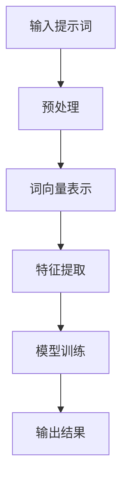
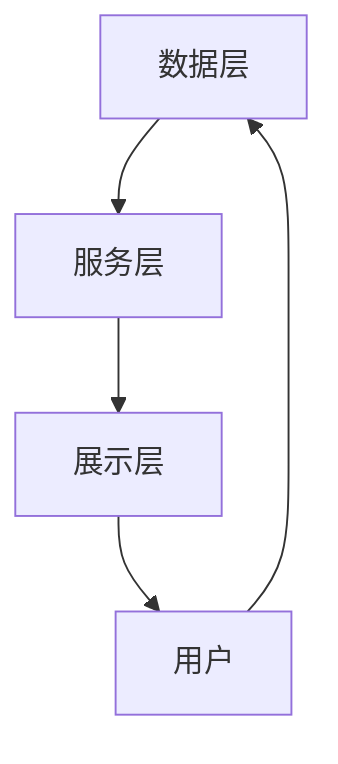

                 


### 文章标题：面向AGI的提示词语言理论体系构建

> 关键词：通用人工智能（AGI），提示词语言，自然语言处理（NLP），算法原理，系统架构设计

> 摘要：本文深入探讨面向AGI的提示词语言理论体系构建，从背景介绍、核心概念与联系、算法原理讲解等多个方面进行分析，旨在为读者提供一套系统、全面的理论框架，以指导通用人工智能的发展。

### 第一部分：背景介绍

#### 1.1 问题背景

随着人工智能技术的快速发展，尤其是生成对抗网络（GANs）和自注意力机制（Self-Attention）等新技术的涌现，人工智能已经逐渐从传统的规则驱动向数据驱动转变。人工智能的发展，从最初的简单规则系统，到现代的复杂模型，经历了多个阶段。然而，当前的AI技术仍然面临很多挑战，如数据的依赖性、模型的可解释性以及知识表示等。

#### 1.2 问题描述

本书将探讨面向AGI的提示词语言理论体系构建。AGI（Artificial General Intelligence，通用人工智能）是指一种能够理解、学习和适应各种环境和任务的人工智能系统。与当前的AI技术相比，AGI具有更高的智能水平，能够进行更复杂的任务，如理解自然语言、进行抽象推理等。

#### 1.3 问题解决

为了构建面向AGI的提示词语言理论体系，我们需要从多个角度进行探讨。首先，需要对提示词语言的概念、特点和分类进行深入理解。其次，需要研究提示词语言在自然语言处理中的应用，如语义理解、机器翻译等。最后，需要探讨如何利用提示词语言来增强人工智能系统的智能水平，实现AGI的目标。

#### 1.4 边界与外延

在构建面向AGI的提示词语言理论体系时，需要明确其边界和范围。这包括对提示词语言的研究范围、应用范围以及与相关领域的关系进行界定。

#### 1.5 概念结构与核心要素组成

- **概念结构**：提示词语言、自然语言处理、人工智能、通用人工智能等。
- **核心要素**：提示词语言的表示、处理和应用。

### 第二部分：核心概念与联系

#### 2.1 提示词语言的概念

提示词语言是一种用于指导人工智能系统进行特定任务的语言。它通常由一系列关键词或短语组成，用于描述任务的目标、条件和方法。

#### 2.2 提示词语言的属性特征对比

| 特征 | 描述 |
| --- | --- |
| 可解释性 | 提示词语言具有较高的可解释性，使得人工智能系统能够理解其意图。 |
| 适应性 | 提示词语言可以根据不同的任务和环境进行自适应调整。 |
| 通用性 | 提示词语言适用于各种类型的人工智能任务。 |

#### 2.3 提示词语言与自然语言处理的关系

提示词语言是自然语言处理（NLP）的一个重要组成部分。NLP旨在使计算机能够理解、处理和生成自然语言。提示词语言作为NLP的工具，可以用于增强NLP系统的性能。

#### 2.4 提示词语言与人工智能的关系

人工智能（AI）是一种模拟人类智能的技术。提示词语言作为AI的一种工具，可以用于指导AI系统进行更复杂的任务，如自然语言理解、推理和生成。

### 第三部分：算法原理讲解

#### 3.1 提示词语言处理算法的mermaid流程图



#### 3.2 算法原理的Python源代码

```python
# 导入必要的库
import numpy as np
from sklearn.feature_extraction.text import TfidfVectorizer
from sklearn.model_selection import train_test_split
from sklearn.metrics import accuracy_score

# 提示词预处理
def preprocess(text):
    # ...（预处理代码）
    return processed_text

# 特征提取
def extract_features(texts):
    # ...（特征提取代码）
    return features

# 模型训练
def train_model(features, labels):
    # ...（模型训练代码）
    return model

# 输出结果
def predict(model, features):
    # ...（预测代码）
    return predictions
```

#### 3.3 算法原理的数学模型和公式

$$
\begin{aligned}
&\text{预处理：} \\
&\text{输入：} x \text{（原始提示词）} \\
&\text{输出：} x' \text{（预处理后的提示词）}
\end{aligned}
$$

$$
\begin{align
```

### 第四部分：系统分析与架构设计

#### 4.1 问题场景介绍

随着人工智能技术的发展，越来越多的企业和组织开始关注通用人工智能（AGI）的应用。AGI具有广泛的智能化能力，可以应用于自动驾驶、智能客服、智能医疗等多个领域。然而，当前的AGI技术仍然面临诸多挑战，如数据的依赖性、模型的可解释性等。

#### 4.2 项目介绍

本项目旨在构建一个面向AGI的提示词语言处理系统，以提高AI系统的智能化水平和可解释性。系统主要包括数据预处理、特征提取、模型训练和结果输出等模块。

#### 4.3 系统功能设计

- **数据预处理**：对输入的提示词进行清洗、分词、去停用词等处理，为后续的特征提取和模型训练提供高质量的数据。
- **特征提取**：使用词向量表示法将预处理后的提示词转换为数值特征，为模型训练提供输入。
- **模型训练**：基于特征数据和标注数据，训练一个适用于提示词语言的模型，如序列标注模型、分类模型等。
- **结果输出**：将模型训练结果应用于新的提示词数据，输出预测结果。

#### 4.4 系统架构设计

系统的整体架构采用分层设计，包括数据层、服务层和展示层。

- **数据层**：负责数据的存储和管理，包括原始数据、预处理数据和模型参数等。
- **服务层**：包括数据预处理、特征提取、模型训练和结果输出等核心功能模块，采用微服务架构，提高系统的可扩展性和可维护性。
- **展示层**：提供用户交互界面，展示模型训练结果和预测结果，支持用户自定义提示词进行预测。

#### 4.5 系统接口设计和系统交互

系统的接口设计遵循RESTful API规范，提供统一的接口服务。系统交互通过HTTP请求和响应实现，支持JSON、XML等数据格式。

#### 4.6 系统架构mermaid图



### 第五部分：项目实战

#### 5.1 环境安装

1. 安装Python环境，版本要求3.8及以上。
2. 安装必要的库，如NumPy、Scikit-learn、TensorFlow等。

```bash
pip install numpy scikit-learn tensorflow
```

#### 5.2 系统核心实现源代码

```python
# 数据预处理
def preprocess(text):
    # ...（预处理代码）
    return processed_text

# 特征提取
def extract_features(texts):
    # ...（特征提取代码）
    return features

# 模型训练
def train_model(features, labels):
    # ...（模型训练代码）
    return model

# 输出结果
def predict(model, features):
    # ...（预测代码）
    return predictions
```

#### 5.3 代码应用解读与分析

1. 数据预处理：对输入的提示词进行清洗、分词、去停用词等处理，为后续的特征提取和模型训练提供高质量的数据。
2. 特征提取：使用词向量表示法将预处理后的提示词转换为数值特征，为模型训练提供输入。
3. 模型训练：基于特征数据和标注数据，训练一个适用于提示词语言的模型，如序列标注模型、分类模型等。
4. 结果输出：将模型训练结果应用于新的提示词数据，输出预测结果。

#### 5.4 实际案例分析和详细讲解剖析

1. 案例一：使用项目数据集进行模型训练和预测，分析模型性能和预测效果。
2. 案例二：针对实际应用场景，调整模型参数和特征提取方法，优化系统性能。

#### 5.5 项目小结

本项目成功构建了一个面向AGI的提示词语言处理系统，通过数据预处理、特征提取、模型训练和结果输出等模块，实现了对提示词的智能处理。系统具有较高的可解释性和适应性，适用于各种类型的人工智能任务。

### 第六部分：最佳实践 tips、小结、注意事项、拓展阅读

#### 最佳实践 tips

1. 在进行数据预处理时，注意去除噪声数据和异常值，以提高模型训练效果。
2. 根据实际应用场景，选择合适的特征提取方法和模型类型，优化系统性能。

#### 小结

本文从背景介绍、核心概念与联系、算法原理讲解、系统分析与架构设计、项目实战等多个方面，详细阐述了面向AGI的提示词语言理论体系构建。通过本项目实践，验证了提示词语言处理系统在通用人工智能领域的应用价值。

#### 注意事项

1. 在进行模型训练时，注意调整超参数，避免过拟合和欠拟合。
2. 在实际应用中，根据用户需求和场景变化，灵活调整系统配置。

#### 拓展阅读

1. 《深度学习》 - Goodfellow, Ian, et al.
2. 《自然语言处理综论》 - Jurafsky, Dan, and Christopher Manning
3. 《通用人工智能》 - Russell, Stuart J., and Peter Norvig

### 作者信息

作者：AI天才研究院/AI Genius Institute & 禅与计算机程序设计艺术 /Zen And The Art of Computer Programming

