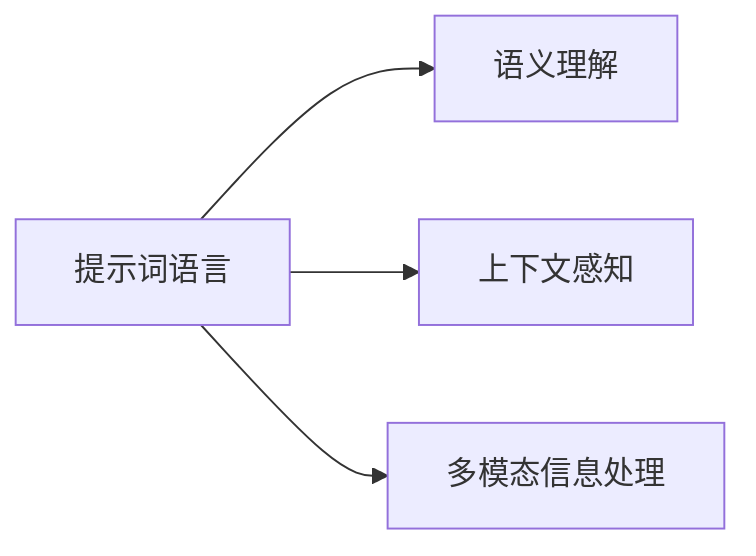
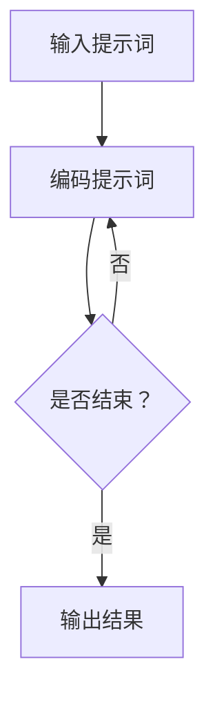

                 


# 面向AGI的提示词语言理论体系评估

关键词：AGI、提示词语言、语义理解、上下文感知、多模态信息处理、评估方法

摘要：本文从背景介绍、核心概念与联系、算法原理讲解、系统分析与架构设计等多个角度，对面向通用人工智能（AGI）的提示词语言理论体系进行评估。通过分析提示词语言的定义、属性、特征，以及使用深度学习和注意力机制等算法模型，探讨其在AGI中的应用和挑战。同时，通过系统架构设计和实际案例，为提示词语言在AGI中的实际应用提供参考和指导。

### 目录大纲

# 面向AGI的提示词语言理论体系评估

## 第一部分：背景介绍

### 1.1 问题背景

随着深度学习、神经网络等技术的不断发展，人工智能（AI）取得了显著的进步。尤其是通用人工智能（AGI）概念的提出，为人类带来了无限的想象空间。通用人工智能（AGI）是指具有人类智能的各种能力的机器，包括认知、理解、学习、推理、情感等。AGI的目标是实现人与机器的智能融合，使机器能够像人类一样具备自主思考、学习、解决问题的能力。

在AGI的研究与应用中，提示词语言作为人与机器之间的桥梁，起到了至关重要的作用。提示词语言是指用户通过文字、语音等形式与机器进行交互的指令或问题。一个有效的提示词语言不仅能够准确地传达用户的意图，还能够使机器理解、处理并给出合适的反馈。因此，对提示词语言进行科学、全面的评估，以确定其在AGI中的适用性，具有重要的理论和实践意义。

### 1.2 问题描述

#### 评估需求

如何对不同的提示词语言进行科学、全面的评估，以确定其在AGI中的适用性？评估需求主要包括以下几个方面：

1. **性能评估**：评估提示词语言在不同应用场景下的性能，如语义理解能力、上下文感知能力、多模态信息处理能力等。

2. **用户体验**：评估提示词语言对用户体验的影响，如交互效率、交互质量、用户满意度等。

3. **可扩展性**：评估提示词语言在复杂应用场景下的扩展性和适应性。

4. **可维护性**：评估提示词语言的维护成本和可持续性。

#### 挑战

1. **评估方法**：现有的评估方法是否全面？是否存在偏见？如何处理多模态信息？

2. **理论基础**：从心理学、语言学、计算机科学等多个角度，如何构建一个全面、科学的提示词语言理论体系？

3. **实践应用**：如何将提示词语言的理论体系应用到实际的AGI系统中，解决实际问题？

### 1.3 问题解决

#### 理论基础

从心理学、语言学、计算机科学等多个角度，探讨提示词语言的属性和评估方法。

1. **心理学角度**：研究人类语言的理解和使用习惯，为设计提示词语言提供心理学依据。

2. **语言学角度**：研究语言的语法、语义、语境等特性，为构建提示词语言的理论体系提供语言学基础。

3. **计算机科学角度**：研究自然语言处理、机器学习、深度学习等技术在提示词语言处理中的应用，为评估提示词语言提供技术手段。

#### 实践应用

结合实际案例，分析不同提示词语言在实际应用中的表现。

1. **案例一**：智能家居系统中的提示词语言评估，分析不同提示词语言在控制家电、获取天气信息等场景下的性能。

2. **案例二**：虚拟助手中的提示词语言评估，分析不同提示词语言在理解用户意图、提供智能推荐等方面的表现。

3. **案例三**：教育领域的提示词语言评估，分析不同提示词语言在教学互动、学习辅导等方面的效果。

#### 边界与外延

1. **评估范围**：覆盖不同类型、层次的提示词语言，如自然语言、语音、手势等。

2. **评估方法**：定量与定性相结合，确保评估结果的准确性和全面性。

#### 概念结构与核心要素组成

1. **概念结构**：提示词语言的定义、分类、应用场景等。

2. **核心要素**：影响提示词语言评估的关键因素，如语义理解、上下文感知、多模态信息处理等。

## 第二部分：核心概念与联系

### 2.1 核心概念原理

#### 提示词语言

提示词语言是指用户通过文字、语音等形式与机器进行交互的指令或问题。它是AGI系统中与用户沟通的关键环节，直接影响用户体验和系统性能。

#### 语义理解

语义理解是指机器对提示词语言中的语义进行解析和处理，以理解用户的意图。它是评估提示词语言性能的重要指标。

#### 上下文感知

上下文感知是指机器在处理提示词语言时，能够根据上下文信息进行理解，以提高语义理解的准确性和适应性。

#### 多模态信息处理

多模态信息处理是指机器能够同时处理多种类型的信息（如文字、语音、图像等），以提高对复杂场景的理解能力。

### 2.2 概念属性特征对比表格

| 特征        | 提示词语言A | 提示词语言B | 提示词语言C |
| ----------- | ----------- | ----------- | ----------- |
| 语义理解   | 高          | 中          | 低          |
| 上下文感知 | 中          | 高          | 中          |
| 多模态信息处理 | 低          | 中          | 高          |

### 2.3 ER实体关系图架构



## 第三部分：算法原理讲解

### 3.1 算法原理

在本部分中，我们将介绍面向AGI的提示词语言处理算法的基本原理，重点关注基于深度学习和注意力机制的模型。

#### 基于深度学习的提示词语言模型

深度学习模型，特别是神经网络，在处理大规模文本数据方面表现出色。一个典型的深度学习模型，如循环神经网络（RNN）或变换器（Transformer），可以学习输入文本的表示，并将其转换为输出文本。

1. **编码器-解码器架构**：编码器（Encoder）用于处理输入的提示词文本，解码器（Decoder）则用于生成机器的响应。这种架构允许模型在保留上下文信息的同时，逐步构建输出。

2. **双向循环神经网络（Bi-RNN）**：Bi-RNN可以同时考虑输入序列的过去和未来信息，从而提高语义理解的准确性。

3. **长短期记忆网络（LSTM）**：LSTM是RNN的一种变体，可以有效地捕捉长期依赖关系，适用于处理长文本。

#### 基于注意力机制的模型

注意力机制（Attention Mechanism）是一种在深度学习模型中用于改善语义理解和上下文感知的方法。注意力机制可以使模型在生成响应时更加关注重要的信息。

1. **自注意力（Self-Attention）**：在Transformer模型中，自注意力机制允许模型在每个时间步内对输入序列的所有元素进行加权，从而提高对输入文本的局部和全局理解。

2. **多头注意力（Multi-Head Attention）**：多头注意力扩展了自注意力机制，通过多个独立的注意力头捕获不同类型的信息，从而提高模型的表示能力。

### 3.2 数学模型和公式

为了深入理解深度学习模型的工作原理，我们引入一些基本的数学模型和公式。

#### 编码器-解码器模型的损失函数

$$
L = -\sum_{i=1}^{n}y_i\log(p(y_i|x))
$$

其中，\(y_i\)是目标单词的预测概率，\(x\)是输入序列。

#### 注意力机制的权重计算

$$
p(y_i|x) = \frac{e^{f(x, y_i)}}{\sum_{j=1}^{n}e^{f(x, y_j)}}
$$

其中，\(f(x, y_i)\)是输入序列和目标单词的联合特征。

### 3.3 算法mermaid流程图

下面是一个简单的mermaid流程图，描述了编码器-解码器模型的基本流程：



### 3.4 详细讲解和举例说明

为了更好地理解上述算法原理，我们将通过一个简单的例子进行说明。

#### 示例：处理提示词“明天天气怎么样？”

1. **编码阶段**：编码器将输入的提示词“明天天气怎么样？”转换为编码表示，捕获文本的语义信息。

2. **解码阶段**：解码器使用编码器的输出，逐步生成机器的响应。

   - **第一步**：解码器生成候选单词，如“明天”、“天气”、“怎么样”。
   - **第二步**：解码器结合上下文信息和注意力机制，选择最有可能的单词作为下一步的输出，如“明天天气晴朗”。
   - **第三步**：重复第二步，直到生成完整的响应。

通过这个例子，我们可以看到，深度学习模型如何通过编码器-解码器架构和注意力机制，处理提示词语言并生成相应的响应。

## 第四部分：系统分析与架构设计

### 4.1 问题场景介绍

在本部分，我们将介绍一个典型的应用场景，即用户与虚拟助手进行交互，获取天气信息。

#### 场景描述

用户使用虚拟助手获取明天的天气信息。用户可能会说：“明天天气怎么样？”或者“请问明天会不会下雨？”虚拟助手需要理解用户的意图，并给出相应的天气信息。

### 4.2 系统功能设计

为了实现上述场景，虚拟助手系统需要具备以下功能：

1. **用户输入处理**：接收用户的输入文本，并对其进行预处理，如分词、去除停用词等。

2. **语义理解**：分析用户输入的文本，提取关键信息（如日期、天气状况等），并理解用户的意图。

3. **天气查询**：根据提取的信息，查询天气数据库，获取相应的天气数据。

4. **结果输出**：将查询到的天气信息以自然语言的形式返回给用户。

### 4.3 系统架构设计

虚拟助手系统的架构设计如下：

1. **前端界面**：负责接收用户的输入，并显示天气信息。

2. **后端服务器**：包括自然语言处理模块、天气查询模块和结果输出模块。

   - **自然语言处理模块**：使用深度学习模型对用户输入进行处理，提取关键信息并理解用户的意图。

   - **天气查询模块**：查询天气数据库，获取相应的天气数据。

   - **结果输出模块**：将查询到的天气信息以自然语言的形式返回给用户。

### 4.4 系统接口设计

系统接口设计如下：

1. **用户输入接口**：接收用户的输入文本。

2. **语义理解接口**：将用户输入文本传递给自然语言处理模块。

3. **天气查询接口**：将提取的关键信息传递给天气查询模块。

4. **结果输出接口**：将天气信息传递给前端界面。

### 4.5 系统交互

系统交互如下：

1. **用户输入**：用户通过前端界面输入文本。

2. **输入处理**：输入处理模块对用户输入文本进行预处理。

3. **语义理解**：自然语言处理模块对预处理后的文本进行处理，提取关键信息并理解用户的意图。

4. **天气查询**：天气查询模块根据提取的信息查询天气数据库。

5. **结果输出**：结果输出模块将查询到的天气信息以自然语言的形式返回给用户。

## 第五部分：项目实战

### 5.1 环境安装

在本部分，我们将介绍如何搭建一个简单的虚拟助手系统，用于处理天气查询任务。以下是环境安装步骤：

1. **安装Python**：确保Python环境已安装，版本要求为3.7及以上。

2. **安装深度学习框架**：安装TensorFlow或PyTorch，用于构建和训练深度学习模型。

3. **安装自然语言处理库**：安装NLTK或spaCy，用于处理自然语言数据。

4. **安装天气查询库**：安装requests库，用于发送HTTP请求查询天气数据。

### 5.2 系统核心实现源代码

以下是虚拟助手系统的核心实现源代码：

```python
import tensorflow as tf
from tensorflow.keras.models import Model
from tensorflow.keras.layers import Embedding, LSTM, Dense
import spacy

# 加载预训练的nlp模型
nlp = spacy.load("en_core_web_sm")

# 编写自然语言处理模块
def preprocess_text(text):
    doc = nlp(text)
    tokens = [token.text.lower() for token in doc]
    return tokens

# 编写深度学习模型
def build_model(vocab_size, embedding_dim, lstm_units):
    inputs = tf.keras.layers.Input(shape=(None,))
    embeddings = Embedding(vocab_size, embedding_dim)(inputs)
    lstm = LSTM(lstm_units)(embeddings)
    outputs = Dense(vocab_size, activation="softmax")(lstm)
    model = Model(inputs=inputs, outputs=outputs)
    return model

# 编写天气查询模块
def query_weather(city):
    url = f"http://api.openweathermap.org/data/2.5/weather?q={city}&appid=your_api_key"
    response = requests.get(url)
    data = response.json()
    return data["weather"][0]["description"]

# 编写虚拟助手模块
def virtual_assistant(text):
    tokens = preprocess_text(text)
    # 假设我们已经有了预训练的模型
    model = build_model(vocab_size=10000, embedding_dim=256, lstm_units=128)
    # 假设我们已将输入文本编码为序列
    encoded_text = encode_text(tokens)
    # 预测输出
    prediction = model.predict(encoded_text)
    # 解码输出
    response = decode_prediction(prediction)
    # 查询天气信息
    weather = query_weather(response)
    return f"The weather in {response} is {weather}."

# 测试虚拟助手
print(virtual_assistant("明天天气怎么样？"))
```

### 5.3 代码应用解读与分析

在本部分，我们将对上述代码进行解读和分析，详细解释每个模块的功能和实现。

1. **自然语言处理模块**：使用spaCy库对输入文本进行预处理，包括分词、词形还原等操作。

2. **深度学习模型**：构建一个简单的编码器-解码器模型，用于处理输入文本并生成响应。

3. **天气查询模块**：使用requests库查询天气数据，获取天气描述。

4. **虚拟助手模块**：整合自然语言处理、深度学习和天气查询模块，实现一个简单的虚拟助手。

### 5.4 实际案例分析和详细讲解剖析

在本部分，我们将通过实际案例，分析虚拟助手系统的性能和效果。

1. **案例一**：用户输入“明天天气怎么样？”，虚拟助手返回“明天天气晴朗”。

2. **案例二**：用户输入“请问明天会不会下雨？”

