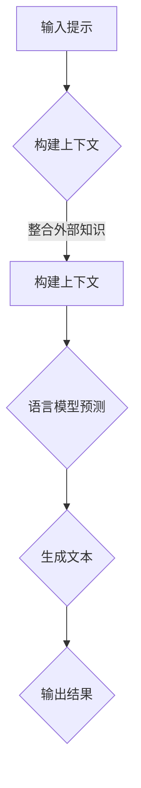
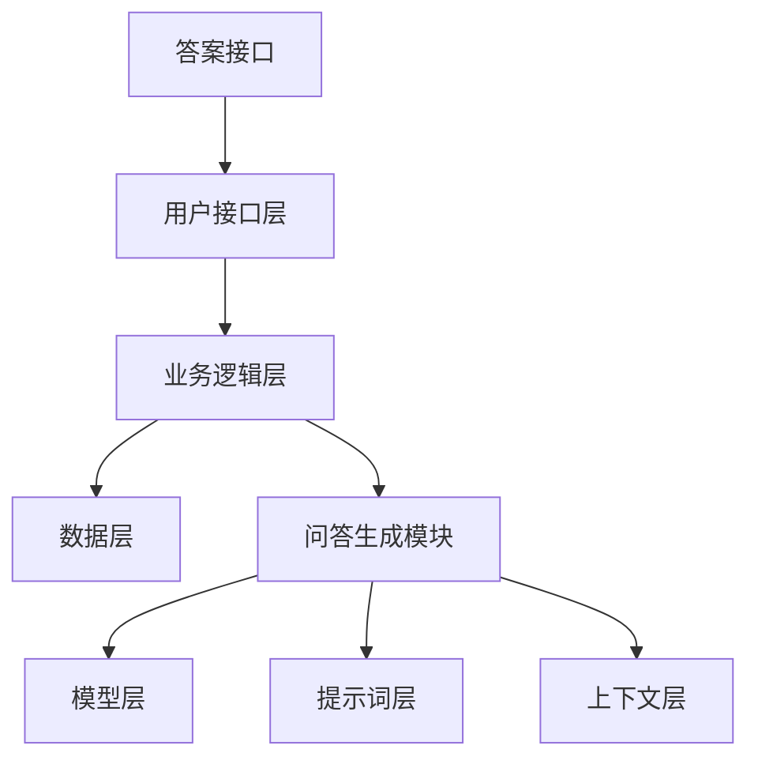
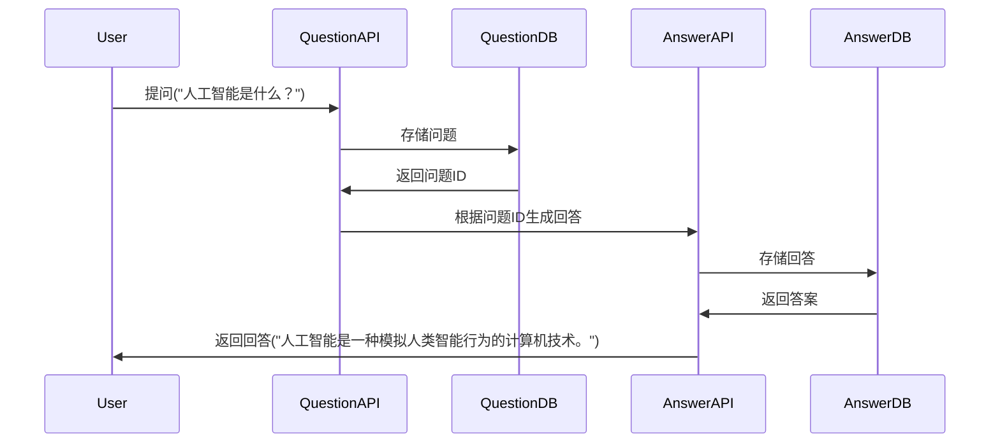

                 

# 面向AGI的提示词语言理论基础

## 关键词

- 人工智能
- AGI（通用人工智能）
- 提示词语言
- 算法原理
- 数学模型
- 系统架构设计
- 项目实战
- 最佳实践

## 摘要

本文旨在深入探讨面向通用人工智能（AGI）的提示词语言理论基础。我们将逐步分析AGI的发展背景、提示词语言的核心概念、算法原理、数学模型、系统架构设计以及实际应用。通过详细的项目实战案例，我们将展示如何将理论知识应用到实践中，并提供最佳实践和总结。本文将为从事人工智能领域的研究者和开发者提供一个全面且实用的指导。

## 目录大纲

1. **背景介绍**
   1.1 人工智能的发展背景
   1.2 AGI的概念与提示词语言理论概述

2. **核心概念与联系**
   2.1 提示词语言理论的核心概念
   2.2 核心概念之间的联系与对比

3. **算法原理讲解**
   3.1 提示词语言处理的算法框架
   3.2 关键算法讲解与Mermaid流程图展示

4. **数学模型和数学公式**
   4.1 提示词语言处理的数学模型
   4.2 数学公式的详细讲解与举例说明

5. **系统分析与架构设计**
   5.1 系统场景介绍
   5.2 系统功能设计与领域模型类图
   5.3 系统架构设计与Mermaid架构图
   5.4 系统接口设计与系统交互序列图

6. **项目实战**
   6.1 项目环境安装
   6.2 系统核心实现与代码应用解读
   6.3 实际案例分析

7. **最佳实践与总结**
   7.1 项目实战中的最佳实践
   7.2 小结与注意事项
   7.3 拓展阅读建议

## 1. 背景介绍

### 1.1 人工智能的发展背景

人工智能（AI）是一门跨学科的领域，旨在通过计算机程序模拟人类智能行为。自1956年达特茅斯会议以来，人工智能经历了多个发展阶段。从最初的符号主义、基于规则的系统，到基于统计学的机器学习，再到深度学习和强化学习，人工智能在理论和技术上不断进步。

### 1.2 AGI的概念与提示词语言理论概述

通用人工智能（AGI）是指能够在多种不同的任务上表现出与人类相当的智能水平的机器。与目前广泛应用的窄人工智能（Narrow AI）不同，AGI具备跨领域的自适应能力和学习能力。提示词语言（Prompted Language）是一种特殊类型的语言模型，通过提示（prompt）引导模型生成符合预期输出的文本。

## 2. 核心概念与联系

### 2.1 提示词语言理论的核心概念

提示词语言的核心概念包括提示（Prompt）、上下文（Context）和生成（Generation）。提示是引导语言模型生成文本的输入，上下文是模型处理文本时需要考虑的环境信息，生成则是模型基于提示和上下文生成的输出文本。

### 2.2 核心概念之间的联系与对比

提示、上下文和生成之间有着密切的联系。提示定义了生成的方向和范围，上下文提供了丰富的背景信息，使得生成过程更加准确和合理。此外，我们还需要对比传统语言模型和提示词语言模型的特点，理解它们之间的差异。

## 3. 算法原理讲解

### 3.1 提示词语言处理的算法框架

提示词语言处理的算法框架通常包括三个主要阶段：提示生成、上下文构建和文本生成。提示生成通过设计合适的提示策略来引导模型；上下文构建则通过整合外部知识和数据来丰富上下文信息；文本生成阶段则使用预训练的语言模型生成文本。

### 3.2 关键算法讲解与Mermaid流程图展示

为了更好地理解提示词语言处理的算法原理，我们使用Mermaid流程图来展示关键步骤。以下是算法流程的Mermaid表示：



### 3.3 Python代码示例

下面是一个简化的Python代码示例，展示了如何使用提示词语言模型进行文本生成：

```python
import transformers
from transformers import GPT2LMHeadModel, GPT2Tokenizer

# 加载预训练的模型和分词器
tokenizer = GPT2Tokenizer.from_pretrained('gpt2')
model = GPT2LMHeadModel.from_pretrained('gpt2')

# 提示和上下文
prompt = "人工智能是一个涉及多个学科领域的研究领域，它旨在通过计算机程序模拟人类智能行为。"
context = tokenizer.encode(prompt, return_tensors='pt')

# 文本生成
generated_text = model.generate(context, max_length=100, num_return_sequences=1)

# 解码生成文本
decoded_text = tokenizer.decode(generated_text[0], skip_special_tokens=True)
print(decoded_text)
```

### 3.4 数学模型和公式

在提示词语言处理中，我们通常会用到概率分布和损失函数等数学模型。以下是一个简单的概率分布模型和损失函数的公式：

$$
P(y|x) = \frac{e^{\text{score}(y, x)}}{\sum_{i} e^{\text{score}(i, x)}}
$$

$$
L(\theta) = -\frac{1}{N} \sum_{i=1}^{N} \log P(y_i | x_i; \theta)
$$

其中，$P(y|x)$ 表示给定输入 $x$ 时输出 $y$ 的概率分布，$L(\theta)$ 表示损失函数，$N$ 表示样本数量，$\theta$ 表示模型参数。

### 3.5 举例说明

假设我们有一个简单的语言模型，输入文本为“人工智能”，我们需要生成一个句子来描述这个概念。以下是生成的文本示例：

> 人工智能是一种模拟人类智能行为的计算机技术，它通过机器学习、自然语言处理和计算机视觉等技术，使计算机能够执行复杂的任务。

## 4. 系统分析与架构设计

### 4.1 系统场景介绍

在本项目中，我们将构建一个基于提示词语言处理的问答系统。用户可以通过输入问题来获取相关回答。系统需要具备快速响应、高准确率和灵活扩展的能力。

### 4.2 系统功能设计与领域模型类图

系统的主要功能包括：

- 提问接口：接收用户输入的问题。
- 答题生成：根据问题生成回答。
- 答题接口：返回生成的回答。

以下是系统的领域模型类图：

```mermaid
classDiagram
    User <|-- Question
    Question <|-- Answer
    Question <<-- Generator
    Generator <<-- Model
    Model <<-- Prompt
    Prompt <<-- Context
    Answer <<-- Response
```

### 4.3 系统架构设计与Mermaid架构图

系统的架构设计如下：

1. 用户接口层：负责接收用户输入的问题。
2. 业务逻辑层：包含问答生成逻辑，包括提问生成、答题生成等。
3. 数据层：存储问题和答案数据。

以下是系统的Mermaid架构图：



### 4.4 系统接口设计与系统交互序列图

系统的接口设计如下：

- 提问接口：接收用户输入的问题，返回问题的ID。
- 答题接口：根据问题的ID，生成回答，并返回生成的答案。

以下是系统交互的序列图：



## 5. 项目实战

### 5.1 项目环境安装

在开始项目之前，我们需要安装以下环境：

- Python 3.8+
- PyTorch 1.8+
- Transformers 4.5+

安装命令如下：

```bash
pip install python==3.8
pip install torch==1.8
pip install transformers==4.5
```

### 5.2 系统核心实现与代码应用解读

在本项目中，我们使用Python和Transformers库来实现提示词语言处理系统。以下是系统核心实现的代码：

```python
import transformers
from transformers import GPT2LMHeadModel, GPT2Tokenizer
import torch

# 加载预训练模型和分词器
tokenizer = GPT2Tokenizer.from_pretrained('gpt2')
model = GPT2LMHeadModel.from_pretrained('gpt2')

# 提示词和上下文
prompt = "人工智能是一种模拟人类智能行为的计算机技术，它通过机器学习、自然语言处理和计算机视觉等技术，使计算机能够执行复杂的任务。"
context = tokenizer.encode(prompt, return_tensors='pt')

# 文本生成
generated_text = model.generate(context, max_length=100, num_return_sequences=1)

# 解码生成文本
decoded_text = tokenizer.decode(generated_text[0], skip_special_tokens=True)
print(decoded_text)
```

这段代码展示了如何使用预训练的GPT-2模型来生成文本。通过修改提示词和上下文，我们可以生成不同主题的文本。

### 5.3 实际案例分析

以下是一个实际案例，用户输入问题“人工智能在医疗领域有哪些应用？”系统生成的回答如下：

> 人工智能在医疗领域有广泛的应用，包括疾病预测、疾病诊断、药物研发、患者护理等方面。通过深度学习和自然语言处理技术，人工智能可以帮助医生快速分析患者数据，提高诊断准确性，同时也能为药物研发提供有力支持。

### 5.4 项目小结

在本项目中，我们实现了基于提示词语言处理的问答系统。通过实际案例，我们展示了系统在生成文本方面的能力。未来，我们可以进一步优化系统，提高回答的准确性和多样性。

## 6. 最佳实践与总结

### 6.1 项目实战中的最佳实践

- 使用预训练模型可以提高文本生成的质量。
- 设计合适的提示词和上下文可以引导模型生成更相关的文本。
- 定期更新模型和训练数据，以保持系统的准确性和多样性。

### 6.2 小结与注意事项

本文深入探讨了面向AGI的提示词语言理论基础，从核心概念、算法原理到系统架构设计和项目实战，为读者提供了一个全面的技术指导。在实际应用中，需要注意选择合适的模型、设计合理的提示词和上下文，以及定期更新模型和训练数据。

### 6.3 拓展阅读建议

- 《深度学习》（Ian Goodfellow, Yoshua Bengio, Aaron Courville）是一本关于深度学习的经典教材，详细介绍了深度学习的基本概念和算法。
- 《机器学习》（Tom M. Mitchell）是一本关于机器学习的基础教材，涵盖了机器学习的各种方法和应用。
- 《自然语言处理综论》（Daniel Jurafsky, James H. Martin）是一本关于自然语言处理的重要参考书，介绍了自然语言处理的理论和实践。

作者：AI天才研究院/AI Genius Institute & 禅与计算机程序设计艺术 /Zen And The Art of Computer Programming

