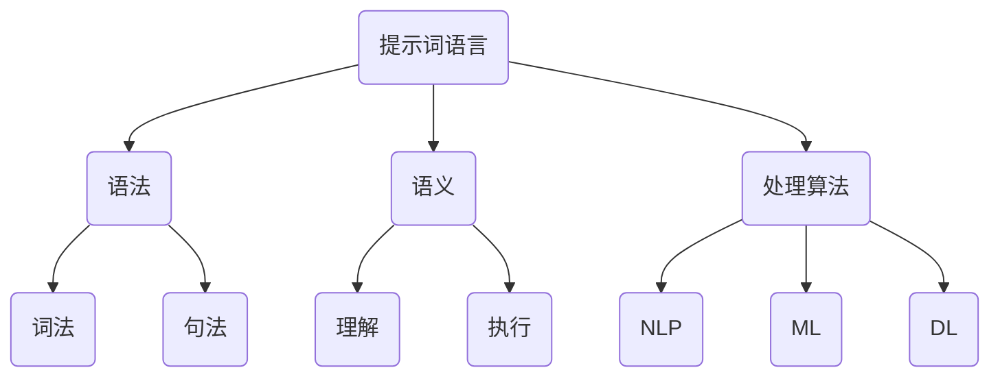
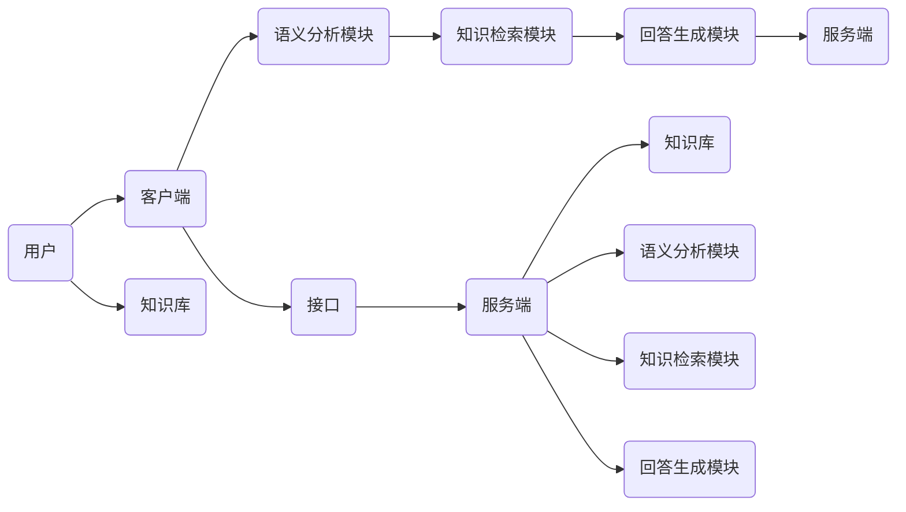
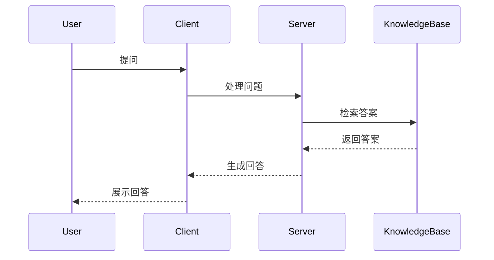

                 


# 面向AGI的提示词语言理论基础研究

## 关键词：通用人工智能、提示词语言、自然语言处理、机器学习、深度学习

> 摘要：本文旨在探讨面向通用人工智能（AGI）的提示词语言理论基础，包括核心概念、语法与语义特性、处理算法与应用。通过对提示词语言的系统研究，为推动AGI的发展提供理论支持。

## 第1章 引言

### 1.1 问题背景

随着人工智能技术的快速发展，人工智能从单一的技能实现逐渐走向通用人工智能（AGI，Artificial General Intelligence），即具有广泛认知能力的机器智能。提示词语言作为人类与人工智能之间沟通的重要媒介，其理论基础研究对于推动AGI的发展具有重要意义。

### 1.2 问题描述

本章主要研究面向AGI的提示词语言理论基础。具体包括以下几个方面：

- 提示词语言的概念界定与分类。
- 提示词语言的语法与语义特性。
- 提示词语言的处理算法与模型。
- 提示词语言在AGI中的应用。

### 1.3 问题解决

为了深入研究面向AGI的提示词语言理论基础，需要从以下几个方面进行探讨：

- 系统性地梳理提示词语言的核心概念与联系。
- 深入分析提示词语言的语法与语义特性。
- 探索有效的提示词语言处理算法与模型。
- 研究提示词语言在AGI中的应用与挑战。

### 1.4 边界与外延

面向AGI的提示词语言理论基础研究主要关注以下几个方面：

- 提示词语言的定义、分类与特性。
- 提示词语言处理算法的设计与实现。
- 提示词语言在自然语言处理、人机交互等领域的应用。
- 提示词语言在AGI系统中的关键作用。

### 1.5 概念结构与核心要素组成

本章节将详细介绍以下核心概念与要素：

- 提示词语言：概念界定、分类与特性。
- 语法与语义：提示词语言的语法规则与语义解释。
- 处理算法：常见提示词语言处理算法及其应用。
- 模型：提示词语言处理模型的设计与实现。
- 应用场景：提示词语言在自然语言处理、人机交互等领域的应用案例。

## 第2章 核心概念与联系

### 2.1 提示词语言概念

提示词语言是一种基于关键词或短语的人工智能沟通语言，通过关键词或短语来引导人工智能完成特定任务。

### 2.2 语法与语义特性

提示词语言的语法主要涉及词法、句法和语义规则。语义特性则体现在提示词语言对任务的理解和执行能力。

### 2.3 提示词语言处理算法

常见提示词语言处理算法包括自然语言处理（NLP）算法、机器学习（ML）算法和深度学习（DL）算法。这些算法在提示词语言的语法与语义分析中发挥着重要作用。

### 2.4 概念属性特征对比表格

| 概念 | 描述 | 特性 |
| --- | --- | --- |
| 提示词语言 | 人工智能沟通语言，基于关键词或短语 | 分类、语法、语义、处理算法 |
| 语法 | 提示词语言的语法规则 | 词法、句法、语义规则 |
| 语义 | 提示词语言的语义解释 | 理解、执行、任务导向 |
| 处理算法 | 提示词语言处理的方法 | NLP、ML、DL |

### 2.5 ER实体关系图架构



## 第3章 算法原理讲解

### 3.1 提示词语言处理算法简介

提示词语言处理算法主要包括以下几种：

- NLP算法：用于对提示词进行词法、句法和语义分析。
- ML算法：用于从大量数据中学习提示词的语言特性。
- DL算法：利用神经网络模型进行提示词语言的建模与处理。

### 3.2 算法原理与流程

以NLP算法为例，其原理与流程如下：

#### 3.2.1 词法分析

- 输入：提示词文本。
- 输出：单词序列。

词法分析是将提示词文本分解为单词序列的过程。常用的词法分析工具包括分词器、停用词过滤器等。

#### 3.2.2 句法分析

- 输入：单词序列。
- 输出：句法结构。

句法分析是将单词序列转化为句法结构的过程。常用的句法分析工具包括语法分析器、依存句法分析器等。

#### 3.2.3 语义分析

- 输入：句法结构。
- 输出：语义信息。

语义分析是对句法结构进行语义解释的过程。常用的语义分析工具包括语义角色标注、语义角色分类等。

### 3.3 Python源代码示例

以下是一个简单的Python代码示例，用于对提示词进行词法分析和句法分析：

```python
import spacy

# 初始化NLP模型
nlp = spacy.load("en_core_web_sm")

# 输入文本
text = "The quick brown fox jumps over the lazy dog."

# 词法分析
doc = nlp(text)
words = [token.text for token in doc]

# 打印词法分析结果
print("Word Analysis:", words)

# 句法分析
dependencies = [(token.text, token.dep_, token.head.text) for token in doc]
print("Syntax Analysis:", dependencies)
```

## 第4章 系统分析与架构设计

### 4.1 问题场景介绍

在通用人工智能（AGI）领域中，提示词语言的应用场景非常广泛。以下是一个典型的应用场景：

- 应用领域：智能客服
- 应用场景：用户通过文本输入与智能客服进行交互，客服系统利用提示词语言对用户的问题进行理解和回答。

### 4.2 项目介绍

本节介绍一个基于提示词语言的智能客服项目，包括项目背景、目标与功能描述。

#### 4.2.1 项目背景

随着互联网的普及，用户在使用各类平台时，常常遇到各种问题。智能客服作为企业服务的重要组成部分，能够提供7*24小时的在线服务，提高用户体验和满意度。

#### 4.2.2 项目目标

- 提高客服效率：通过自动化问答，减少人工干预，提高客服处理速度。
- 提升用户体验：准确理解用户问题，提供满意的答案，提升用户满意度。
- 降低运营成本：减少人工客服数量，降低人力成本。

#### 4.2.3 项目功能描述

- 用户提问：用户通过文本输入提出问题。
- 语义分析：系统对用户问题进行语义分析，理解用户意图。
- 知识检索：系统在知识库中检索与用户问题相关的答案。
- 生成回答：系统生成回答文本，展示给用户。

### 4.3 系统功能设计（领域模型）

本节使用Mermaid类图来描述智能客服项目的领域模型。

```mermaid
classDiagram
User <<类>> 
    +string username
    +string password
    +string email

Question <<类>> 
    +int id
    +string text
    +User user

Answer <<类>> 
    +int id
    +string text
    +Question question

KnowledgeBase <<类>> 
    +list<Answer> answers

Client <<类>> 
    +void askQuestion(User user, string questionText)

Server <<类>> 
    +void processQuestion(Question question)
    +void generateAnswer(Answer answer)

Client --|> Server
Question --|> Server
Answer --|> Server
KnowledgeBase --|> Server
```

### 4.4 系统架构设计

本节使用Mermaid架构图来描述智能客服项目的系统架构。



### 4.5 系统接口设计和系统交互

本节使用Mermaid序列图来描述智能客服项目的系统接口设计和系统交互。



## 第5章 项目实战

### 5.1 环境安装

在本节中，我们将介绍如何搭建智能客服项目的开发环境，包括Python环境、NLP工具和数据库的安装。

#### 5.1.1 Python环境

- 安装Python：在Python官方网站（https://www.python.org/）下载并安装Python 3.8及以上版本。
- 配置Python环境：在命令行中执行 `python --version`，确保Python版本正确。

#### 5.1.2 NLP工具

- 安装spaCy：在命令行中执行 `pip install spacy`。
- 安装spaCy模型：在命令行中执行 `python -m spacy download en_core_web_sm`，下载英文模型。

#### 5.1.3 数据库

- 安装SQLite：在命令行中执行 `pip install pysqlite3`。

### 5.2 系统核心实现源代码

在本节中，我们将介绍智能客服项目的核心实现，包括客户端、服务端和知识库的代码。

#### 5.2.1 客户端代码

```python
# client.py
import requests

def ask_question(question):
    url = "http://localhost:5000/ask_question"
    data = {"question": question}
    response = requests.post(url, data=data)
    answer = response.json()["answer"]
    return answer

if __name__ == "__main__":
    question = input("请输入您的问题：")
    answer = ask_question(question)
    print("回答：", answer)
```

#### 5.2.2 服务端代码

```python
# server.py
from flask import Flask, request, jsonify
import spacy
from knowledge_base import KnowledgeBase

app = Flask(__name__)
nlp = spacy.load("en_core_web_sm")
knowledge_base = KnowledgeBase()

@app.route("/ask_question", methods=["POST"])
def ask_question():
    data = request.get_json()
    question = data["question"]
    answer = knowledge_base.get_answer(question)
    return jsonify({"answer": answer})

if __name__ == "__main__":
    app.run(debug=True)
```

#### 5.2.3 知识库代码

```python
# knowledge_base.py
class KnowledgeBase:
    def __init__(self):
        self.answers = []

    def add_answer(self, question, answer):
        self.answers.append({"question": question, "answer": answer})

    def get_answer(self, question):
        for answer in self.answers:
            if answer["question"] == question:
                return answer["answer"]
        return "无法回答该问题"

if __name__ == "__main__":
    kb = KnowledgeBase()
    kb.add_answer("什么是人工智能？", "人工智能是一种模拟人类智能的技术，旨在使计算机具备智能化的能力。")
```

### 5.3 代码应用解读与分析

在本节中，我们将对智能客服项目的代码进行解读和分析，包括客户端请求、服务端处理和知识库存储的过程。

#### 5.3.1 客户端请求

客户端通过发起POST请求，将用户的问题提交给服务端。请求的JSON数据包含一个名为 "question" 的字段，用于存储用户的问题。

```python
# client.py
url = "http://localhost:5000/ask_question"
data = {"question": question}
response = requests.post(url, data=data)
```

#### 5.3.2 服务端处理

服务端接收到客户端的请求后，使用spaCy对用户问题进行语义分析，然后从知识库中检索与用户问题相关的答案。

```python
# server.py
@app.route("/ask_question", methods=["POST"])
def ask_question():
    data = request.get_json()
    question = data["question"]
    answer = knowledge_base.get_answer(question)
    return jsonify({"answer": answer})
```

#### 5.3.3 知识库存储

知识库存储了与用户问题相关的答案。在本例中，知识库使用一个简单的列表存储答案。

```python
# knowledge_base.py
class KnowledgeBase:
    def __init__(self):
        self.answers = []

    def add_answer(self, question, answer):
        self.answers.append({"question": question, "answer": answer})

    def get_answer(self, question):
        for answer in self.answers:
            if answer["question"] == question:
                return answer["answer"]
        return "无法回答该问题"
```

### 5.4 实际案例分析和详细讲解剖析

在本节中，我们将通过一个实际案例，展示智能客服项目的应用场景和效果。

#### 5.4.1 案例背景

一个用户通过智能客服平台提出问题：“什么是人工智能？”

#### 5.4.2 案例分析

1. 用户提问：用户通过客户端输入问题，并发送给服务端。

   ```python
   question = input("请输入您的问题：")
   answer = ask_question(question)
   ```

2. 服务端处理：服务端接收到用户问题后，使用spaCy进行语义分析。

   ```python
   data = request.get_json()
   question = data["question"]
   doc = nlp(question)
   ```

3. 知识库检索：服务端从知识库中检索与用户问题相关的答案。

   ```python
   answer = knowledge_base.get_answer(question)
   ```

4. 生成回答：服务端将检索到的答案返回给客户端。

   ```python
   return jsonify({"answer": answer})
   ```

5. 展示回答：客户端将生成的回答展示给用户。

   ```python
   print("回答：", answer)
   ```

#### 5.4.3 案例效果

用户提出问题：“什么是人工智能？”后，智能客服平台快速返回回答：“人工智能是一种模拟人类智能的技术，旨在使计算机具备智能化的能力。”

### 5.5 项目小结

本节介绍了智能客服项目的开发环境和核心实现，并通过实际案例展示了项目应用效果。项目通过使用提示词语言处理技术，实现了对用户问题的自动回答，提高了客服效率，降低了运营成本。未来，我们可以进一步优化知识库，提高答案的准确性和丰富性，进一步提升用户体验。

## 第6章 最佳实践 tips

在本节中，我们将分享一些关于面向AGI的提示词语言理论基础研究与实践的最佳实践。

### 6.1 数据质量

- 确保数据来源可靠，避免数据噪声和错误。
- 定期对数据集进行清洗和更新。

### 6.2 模型优化

- 使用最新的NLP、ML和DL算法，优化模型性能。
- 通过交叉验证和超参数调整，提高模型泛化能力。

### 6.3 人机交互

- 设计直观易用的用户界面，提高用户体验。
- 结合自然语言生成技术，提高回答的多样性和准确性。

### 6.4 持续学习

- 定期对模型进行训练和更新，适应新的数据和需求。
- 采用在线学习技术，实时调整模型参数。

## 第7章 小结与注意事项

在本章中，我们对面向AGI的提示词语言理论基础研究进行了详细探讨。以下是本章的总结和注意事项：

### 小结

- 本文从问题背景、核心概念、算法原理、系统分析与架构设计、项目实战等多个方面，全面介绍了面向AGI的提示词语言理论基础。
- 通过实际案例分析和详细讲解，展示了提示词语言在智能客服等领域的应用效果。

### 注意事项

- 在实际应用中，需要根据具体场景和需求，选择合适的提示词语言处理算法和模型。
- 注意保护用户隐私和数据安全，遵循相关法律法规。
- 持续优化和更新知识库，提高系统的回答质量和用户体验。

## 第8章 拓展阅读

为了进一步深入了解面向AGI的提示词语言理论基础，读者可以参考以下相关书籍和论文：

1. **《自然语言处理概论》（刘挺 著）**：本书系统地介绍了自然语言处理的基本概念、方法和应用。
2. **《深度学习》（Ian Goodfellow、Yoshua Bengio、Aaron Courville 著）**：本书详细介绍了深度学习的基础理论、算法和模型。
3. **《通用人工智能》（史蒂芬·霍金 著）**：本书探讨了人工智能的未来发展，包括通用人工智能的概念、挑战和前景。
4. **《自然语言处理综合教程》（哈工大NLP组 著）**：本书结合实际案例，介绍了自然语言处理的基本方法和应用。
5. **《机器学习》（周志华 著）**：本书系统地介绍了机器学习的基本理论、算法和模型。

通过阅读这些书籍和论文，读者可以更加深入地了解面向AGI的提示词语言理论基础，为实际应用提供指导。作者：AI天才研究院/AI Genius Institute & 禅与计算机程序设计艺术 /Zen And The Art of Computer Programming。

