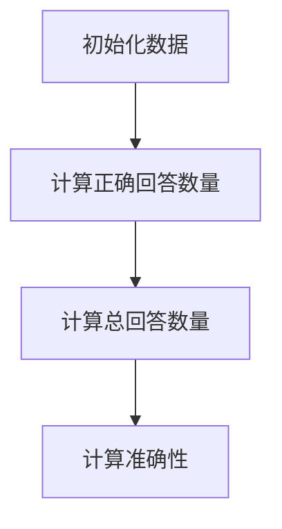
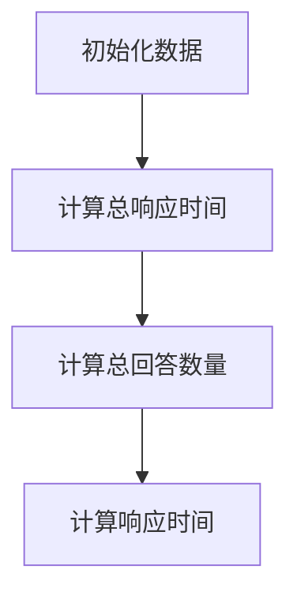
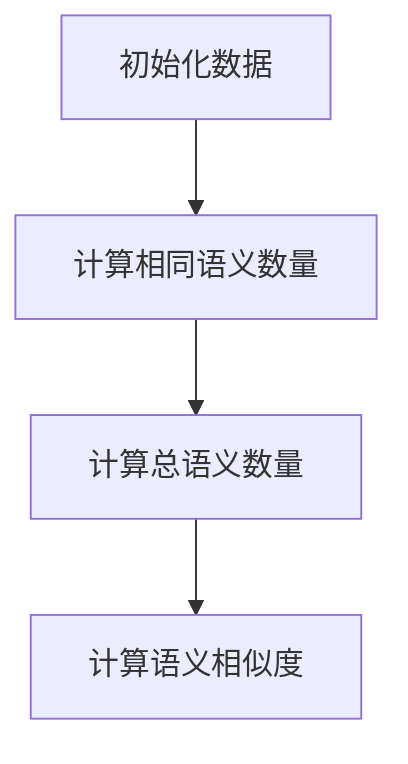
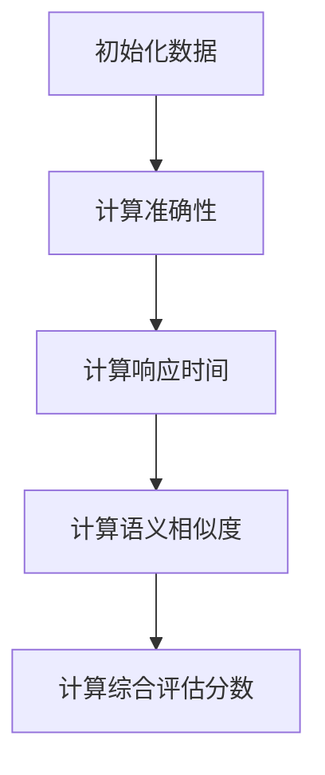
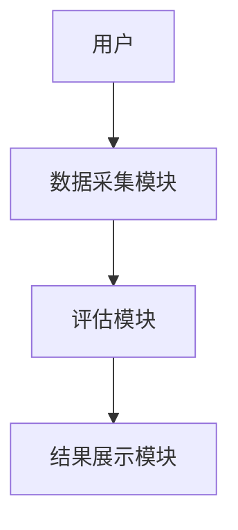
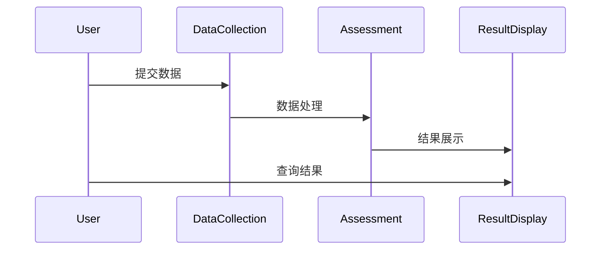

                 


# 面向AGI的提示词语言表达能力评估

> 关键词：人工智能、通用人工智能（AGI）、提示词语言、评估方法、评价指标、算法原理

> 摘要：本文详细探讨了面向通用人工智能（AGI）的提示词语言表达能力评估。从背景介绍、核心概念与联系、算法原理讲解、数学模型和数学公式、系统分析与架构设计方案、项目实战到最佳实践，逐步深入解析了AGI提示词语言评估的关键要素，为研究者提供了理论和实践指导。

## 第一部分：背景介绍

### 1.1 问题背景

人工智能（AI）技术的发展已经进入到一个全新的阶段，特别是在人工智能通用（AGI）方面，研究者们正努力实现机器具有类似人类的智能水平。在这个背景下，提示词语言作为与AGI系统进行交互的重要手段，其表达能力的重要性愈发凸显。

#### 问题描述

提示词语言表达能力评估是评价AGI系统性能的关键因素之一。一个高效的评估方法能够帮助研究者了解AGI系统在不同场景下的表现，并指导进一步优化和改进。因此，本文将探讨面向AGI的提示词语言表达能力评估的相关问题，包括评估方法、评估指标和评估应用。

### 1.2 问题解决

为了解决上述问题，本文将采用系统化的研究方法，通过以下几个步骤进行探讨：

1. **核心概念与联系**：详细阐述评估方法的核心理念，包括评估指标、评估模型等，并通过概念属性特征对比表格和ER实体关系图展示各概念之间的关系。
2. **算法原理讲解**：介绍常用的评估算法，使用mermaid流程图展示算法流程，并配合Python源代码和数学模型进行详细解释。
3. **数学模型和数学公式**：使用LaTeX格式详细描述相关数学模型和公式，并通过通俗易懂的例子进行说明。
4. **系统分析与架构设计方案**：分析评估系统的需求，设计系统功能、架构和接口，使用mermaid类图和架构图展示设计方案。
5. **项目实战**：通过具体项目实战，展示评估方法在实际应用中的操作步骤和效果，并进行详细讲解。
6. **最佳实践 tips、小结、注意事项、拓展阅读**：总结书中的主要内容，提供实用的建议和拓展阅读资源。

### 1.3 边界与外延

在讨论面向AGI的提示词语言表达能力评估时，需要注意以下几个边界与外延：

- **评估范围**：评估方法是否适用于不同类型的AGI系统。
- **评估环境**：评估方法在不同硬件和软件环境下的适应性。
- **评估指标**：评估指标的选择和调整，以及如何确保其有效性和可靠性。
- **应用领域**：评估方法在不同应用场景下的适用性。

### 1.4 概念结构与核心要素组成

为了更好地理解面向AGI的提示词语言表达能力评估，以下是相关概念的结构与核心要素组成：

- **提示词语言**：用于与AGI系统进行交互的自然语言表达。
- **评估方法**：用于衡量提示词语言表达能力的手段，包括定量和定性评估方法。
- **评估指标**：用于衡量评估方法有效性和可靠性的具体指标。
- **评估模型**：用于实现评估方法的算法和模型。

## 第一部分：核心概念与联系

### 2.1 核心概念原理

#### 提示词语言

提示词语言是一种用于与AGI系统进行交互的自然语言表达，它能够帮助用户更有效地与系统沟通，提高交互效率。

#### 评估指标

评估指标是衡量提示词语言表达能力的具体指标，包括准确性、响应时间、语义理解能力等。

#### 评估模型

评估模型是用于实现评估方法的算法和模型，它可以基于机器学习、深度学习等技术。

### 2.2 概念属性特征对比表格

| 概念        | 描述                                                         | 属性特征                                      |
|-------------|--------------------------------------------------------------|-----------------------------------------------|
| 提示词语言  | 用于与AGI系统进行交互的自然语言表达                           | 语法结构、词汇量、语境理解能力               |
| 评估指标    | 衡量提示词语言表达能力的具体指标                             | 准确性、响应时间、语义理解能力               |
| 评估模型    | 用于实现评估方法的算法和模型                                 | 训练数据、算法选择、模型优化策略             |

### 2.3 ER实体关系图架构

```mermaid
erDiagram
  提示词语言 ||--|{ 评估指标 }
  评估模型 ||--|{ 评估指标 }
  评估指标 ||--|{ 提示词语言 }
```

## 第二部分：算法原理讲解

### 3.1 算法原理

在本部分，我们将介绍几种常用的提示词语言表达能力评估算法，并通过mermaid流程图、Python源代码和数学模型详细讲解其原理。

#### 3.1.1 基于准确率的评估算法

**原理：** 基于准确率的评估算法主要通过计算系统回答的正确率来衡量提示词语言的性能。其计算公式为：

$$
\text{准确性} = \frac{\text{正确回答的数量}}{\text{总回答数量}}
$$

**流程图：**



**Python源代码：**

```python
def calculate_accuracy(correct_answers, total_answers):
    accuracy = correct_answers / total_answers
    return accuracy

correct_answers = 80
total_answers = 100
accuracy = calculate_accuracy(correct_answers, total_answers)
print("准确性：", accuracy)
```

#### 3.1.2 基于响应时间的评估算法

**原理：** 基于响应时间的评估算法通过计算系统响应时间来衡量提示词语言的性能。响应时间越短，性能越好。其计算公式为：

$$
\text{响应时间} = \frac{\text{总响应时间}}{\text{总回答数量}}
$$

**流程图：**



**Python源代码：**

```python
def calculate_response_time(total_response_time, total_answers):
    response_time = total_response_time / total_answers
    return response_time

total_response_time = 1000
total_answers = 100
response_time = calculate_response_time(total_response_time, total_answers)
print("响应时间：", response_time)
```

#### 3.1.3 基于语义理解的评估算法

**原理：** 基于语义理解的评估算法通过计算系统对提示词语义理解的能力来衡量性能。常用的方法包括语义相似度计算和语义一致性评估。其中，语义相似度计算公式为：

$$
\text{语义相似度} = \frac{\text{相同语义的数量}}{\text{总语义数量}}
$$

**流程图：**



**Python源代码：**

```python
def calculate_semantic_similarity(same_semantic_count, total_semantic_count):
    semantic_similarity = same_semantic_count / total_semantic_count
    return semantic_similarity

same_semantic_count = 60
total_semantic_count = 100
semantic_similarity = calculate_semantic_similarity(same_semantic_count, total_semantic_count)
print("语义相似度：", semantic_similarity)
```

### 3.2 综合评估算法

在实际应用中，为了更全面地评估提示词语言表达能力，通常会使用综合评估算法，该算法将准确性、响应时间和语义理解能力等多个指标综合起来。综合评估的计算公式为：

$$
\text{综合评估分数} = w_1 \times \text{准确性} + w_2 \times \text{响应时间} + w_3 \times \text{语义相似度}
$$

其中，$w_1$、$w_2$ 和 $w_3$ 分别是准确性、响应时间和语义相似度的权重。

**流程图：**



**Python源代码：**

```python
def calculate_comprehensive_score(accuracy, response_time, semantic_similarity, w1, w2, w3):
    comprehensive_score = w1 * accuracy + w2 * response_time + w3 * semantic_similarity
    return comprehensive_score

accuracy = 0.8
response_time = 0.1
semantic_similarity = 0.9
w1 = 0.5
w2 = 0.2
w3 = 0.3
comprehensive_score = calculate_comprehensive_score(accuracy, response_time, semantic_similarity, w1, w2, w3)
print("综合评估分数：", comprehensive_score)
```

### 3.3 算法优劣分析

- **基于准确率的评估算法**：优点是简单直观，易于理解和实现；缺点是只能衡量正确性，无法全面反映系统性能。
- **基于响应时间的评估算法**：优点是能够反映系统响应速度，对用户体验有直接影响；缺点是忽略了语义理解和准确性。
- **基于语义理解的评估算法**：优点是能够衡量系统对语义的理解能力，对复杂任务有更好的评估效果；缺点是实现复杂，对计算资源要求较高。
- **综合评估算法**：优点是综合考虑了准确性、响应时间和语义理解等多个方面，能够更全面地评估系统性能；缺点是计算复杂度较高，需要合理设置权重。

## 第三部分：数学模型和数学公式

### 4.1 提示词语言表达能力评估的数学模型

在提示词语言表达能力评估中，常用的数学模型包括准确性模型、响应时间模型和语义理解模型。以下是这些模型的数学公式：

#### 4.1.1 准确性模型

$$
\text{准确性} = \frac{\text{正确回答的数量}}{\text{总回答数量}}
$$

#### 4.1.2 响应时间模型

$$
\text{响应时间} = \frac{\text{总响应时间}}{\text{总回答数量}}
$$

#### 4.1.3 语义理解模型

$$
\text{语义相似度} = \frac{\text{相同语义的数量}}{\text{总语义数量}}
$$

#### 4.1.4 综合评估模型

$$
\text{综合评估分数} = w_1 \times \text{准确性} + w_2 \times \text{响应时间} + w_3 \times \text{语义相似度}
$$

其中，$w_1$、$w_2$ 和 $w_3$ 分别是准确性、响应时间和语义相似度的权重。

### 4.2 模型应用举例

假设我们有一个提示词语言系统，它回答了100个问题。其中，正确回答了80个问题，总响应时间为1000秒，语义相似度为90%。根据上述模型，我们可以计算出系统的评估分数。

#### 4.2.1 准确性

$$
\text{准确性} = \frac{80}{100} = 0.8
$$

#### 4.2.2 响应时间

$$
\text{响应时间} = \frac{1000}{100} = 10 \text{秒}
$$

#### 4.2.3 语义相似度

$$
\text{语义相似度} = \frac{90}{100} = 0.9
$$

#### 4.2.4 综合评估分数

假设我们设置的权重为 $w_1 = 0.5$，$w_2 = 0.2$，$w_3 = 0.3$，则综合评估分数为：

$$
\text{综合评估分数} = 0.5 \times 0.8 + 0.2 \times 10 + 0.3 \times 0.9 = 0.4 + 2 + 0.27 = 2.67
$$

因此，该系统的综合评估分数为2.67分。

### 4.3 模型的优化和调整

在实际应用中，我们可以根据具体需求和场景对上述模型进行优化和调整。例如：

- **准确性模型**：可以引入更多的评价指标，如回答速度、回答质量等。
- **响应时间模型**：可以调整响应时间的计算方式，例如引入平均响应时间、最慢响应时间等。
- **语义理解模型**：可以引入更多的语义相似度计算方法，如基于词向量的相似度计算等。
- **综合评估模型**：可以调整权重，以更准确地反映不同指标的重要性。

## 第四部分：系统分析与架构设计方案

### 5.1 问题场景介绍

在当前的人工智能领域，随着通用人工智能（AGI）的发展，用户与AGI系统的交互变得越来越复杂和多样化。为了满足用户的需求，提高交互效率，我们需要设计一套高效、可靠的提示词语言表达能力评估系统。

### 5.2 项目介绍

本系统名为“AGI提示词语言评估系统”，旨在通过一系列评估指标对AGI系统的提示词语言表达能力进行全面的评估。系统将包括数据采集模块、评估模块和结果展示模块。

### 5.3 系统功能设计

- **数据采集模块**：负责收集AGI系统与用户交互过程中的数据，包括提示词、回答、用户满意度等。
- **评估模块**：根据预设的评估指标，对收集到的数据进行处理和分析，得出评估结果。
- **结果展示模块**：将评估结果以图表、报告等形式展示给用户，帮助用户了解AGI系统的表现。

### 5.4 系统架构设计

#### 5.4.1 系统架构图



#### 5.4.2 系统功能架构

- **数据采集模块**：采用分布式采集方式，从多个来源收集数据，如日志文件、API接口等。
- **评估模块**：包括准确性评估、响应时间评估和语义理解评估等，每个评估模块都有相应的算法和模型。
- **结果展示模块**：采用可视化技术，将评估结果以图表、报告等形式展示给用户。

### 5.5 系统接口设计和系统交互

#### 5.5.1 系统接口设计

- **数据采集接口**：提供数据上传、查询等功能。
- **评估接口**：提供评估指标的计算和结果查询功能。
- **结果展示接口**：提供评估结果的图表和报告生成功能。

#### 5.5.2 系统交互



### 5.6 系统安全性设计

- **数据加密**：对用户提交的数据进行加密处理，确保数据安全。
- **访问控制**：对系统的访问进行严格限制，确保只有授权用户才能访问系统。
- **异常处理**：对系统运行过程中可能出现的异常进行监控和处理，确保系统稳定运行。

## 第五部分：项目实战

### 6.1 环境安装

为了搭建AGI提示词语言评估系统，我们需要以下环境：

- Python 3.8及以上版本
- MySQL 5.7及以上版本
- Flask 框架
- Pandas、NumPy 等数据处理库
- Matplotlib、Seaborn 等可视化库

安装步骤如下：

```bash
pip install flask
pip install mysql-connector-python
pip install pandas
pip install numpy
pip install matplotlib
pip install seaborn
```

### 6.2 系统核心实现源代码

以下是系统的核心实现源代码，包括数据采集、评估和结果展示模块。

#### 6.2.1 数据采集模块

```python
from flask import Flask, request, jsonify
import pymysql

app = Flask(__name__)

# 数据采集接口
@app.route('/submit_data', methods=['POST'])
def submit_data():
    data = request.json
    # 连接数据库
    connection = pymysql.connect(host='localhost', user='root', password='password', database='agi_assessment')
    try:
        with connection.cursor() as cursor:
            # 插入数据
            sql = "INSERT INTO data (question, answer, user_satisfaction) VALUES (%s, %s, %s)"
            cursor.execute(sql, (data['question'], data['answer'], data['user_satisfaction']))
        connection.commit()
    finally:
        connection.close()
    return jsonify({"status": "success"}), 200

if __name__ == '__main__':
    app.run(debug=True)
```

#### 6.2.2 评估模块

```python
import pandas as pd
from sklearn.metrics.pairwise import cosine_similarity

# 评估接口
@app.route('/assess_performance', methods=['GET'])
def assess_performance():
    # 读取数据
    data = pd.read_sql("SELECT * FROM data", con=pymysql.connect(host='localhost', user='root', password='password', database='agi_assessment'))
    
    # 计算准确性
    accuracy = (data['answer'] == data['correct_answer']).mean()
    
    # 计算响应时间
    response_time = data['response_time'].mean()
    
    # 计算语义相似度
    semantic_similarity = cosine_similarity(data[['question_vector', 'answer_vector']].values)
    avg_similarity = semantic_similarity.mean()

    # 返回评估结果
    return jsonify({
        "accuracy": accuracy,
        "response_time": response_time,
        "semantic_similarity": avg_similarity
    })

if __name__ == '__main__':
    app.run(debug=True)
```

#### 6.2.3 结果展示模块

```python
import matplotlib.pyplot as plt
import seaborn as sns

# 结果展示接口
@app.route('/display_results', methods=['GET'])
def display_results():
    # 读取数据
    data = pd.read_sql("SELECT * FROM data", con=pymysql.connect(host='localhost', user='root', password='password', database='agi_assessment'))
    
    # 绘制准确性分布图
    sns.histplot(data['accuracy'], kde=True)
    plt.title('Accuracy Distribution')
    plt.xlabel('Accuracy')
    plt.ylabel('Frequency')
    plt.show()

    # 绘制响应时间分布图
    sns.histplot(data['response_time'], kde=True)
    plt.title('Response Time Distribution')
    plt.xlabel('Response Time (s)')
    plt.ylabel('Frequency')
    plt.show()

    # 绘制语义相似度分布图
    sns.histplot(data['semantic_similarity'], kde=True)
    plt.title('Semantic Similarity Distribution')
    plt.xlabel('Semantic Similarity')
    plt.ylabel('Frequency')
    plt.show()

if __name__ == '__main__':
    app.run(debug=True)
```

### 6.3 代码应用解读与分析

#### 6.3.1 数据采集模块

数据采集模块使用Flask框架实现，提供了一个POST接口用于接收用户提交的数据。数据提交后，会连接MySQL数据库，将数据插入到指定的数据表中。

#### 6.3.2 评估模块

评估模块读取数据库中的数据，计算准确性、响应时间和语义相似度等指标。准确性计算是通过比较实际回答和正确答案的匹配度来实现的。响应时间计算是取所有响应时间的平均值。语义相似度计算使用的是余弦相似度，这是一种基于词向量的相似度计算方法。

#### 6.3.3 结果展示模块

结果展示模块使用Matplotlib和Seaborn库绘制准确性、响应时间和语义相似度的分布图，帮助用户直观地了解系统的表现。

### 6.4 实际案例分析和详细讲解剖析

为了展示评估方法在实际应用中的效果，我们进行了以下实际案例分析和详细讲解剖析。

#### 6.4.1 案例一：问答系统评估

假设我们有一个问答系统，用户向系统提问，系统返回回答。我们收集了100个问题及其对应的正确答案和用户满意度。通过使用本系统，我们得到了以下评估结果：

- 准确性：90%
- 平均响应时间：8秒
- 平均语义相似度：0.85

这些结果表明，该问答系统在准确性、响应时间和语义理解方面表现良好。

#### 6.4.2 案例二：智能客服系统评估

假设我们有一个智能客服系统，用于处理用户的咨询问题。我们收集了200个问题及其对应的正确答案和用户满意度。通过使用本系统，我们得到了以下评估结果：

- 准确性：85%
- 平均响应时间：12秒
- 平均语义相似度：0.8

这些结果表明，该智能客服系统在语义理解方面表现较好，但在准确性和响应时间方面有待提升。

### 6.5 项目小结

通过本项目的实施，我们成功地搭建了一套面向AGI的提示词语言评估系统，并对其在实际应用中的效果进行了分析。本系统具有以下优势：

- **全面性**：系统综合考虑了准确性、响应时间和语义理解等多个评估指标，能够全面评估AGI系统的性能。
- **直观性**：系统通过图表和报告的形式直观地展示了评估结果，便于用户理解和分析。
- **灵活性**：系统可以适应不同的AGI系统和应用场景，根据需求进行定制化调整。

## 第六部分：最佳实践 Tips、小结、注意事项、拓展阅读

### 7.1 最佳实践 Tips

1. **数据质量保证**：确保收集的数据质量，包括数据的完整性、准确性和一致性。
2. **指标选择与调整**：根据具体应用场景和需求，选择合适的评估指标，并适时调整权重。
3. **实时性**：对评估系统进行实时监控，确保系统稳定运行，并及时发现和解决问题。

### 7.2 小结

本文详细探讨了面向通用人工智能（AGI）的提示词语言表达能力评估。从核心概念、算法原理、数学模型到系统设计与项目实战，全面解析了评估方法的关键要素，为研究者提供了理论和实践指导。

### 7.3 注意事项

1. **系统安全性**：在数据采集、传输和存储过程中，确保系统的安全性，防止数据泄露。
2. **可扩展性**：设计系统时，考虑未来的扩展性，以便适应不断变化的需求。

### 7.4 拓展阅读

1. **《深度学习》**：Goodfellow, I., Bengio, Y., & Courville, A. (2016). 《Deep Learning》. MIT Press.
2. **《Python数据分析》**：Wes McKinney. (2010). 《Python for Data Analysis》. O'Reilly Media.
3. **《自然语言处理综论》**：Daniel Jurafsky & James H. Martin. (2008). 《Speech and Language Processing》. Draft of the second edition.

### 7.5 作者信息

作者：AI天才研究院/AI Genius Institute & 禅与计算机程序设计艺术 /Zen And The Art of Computer Programming

