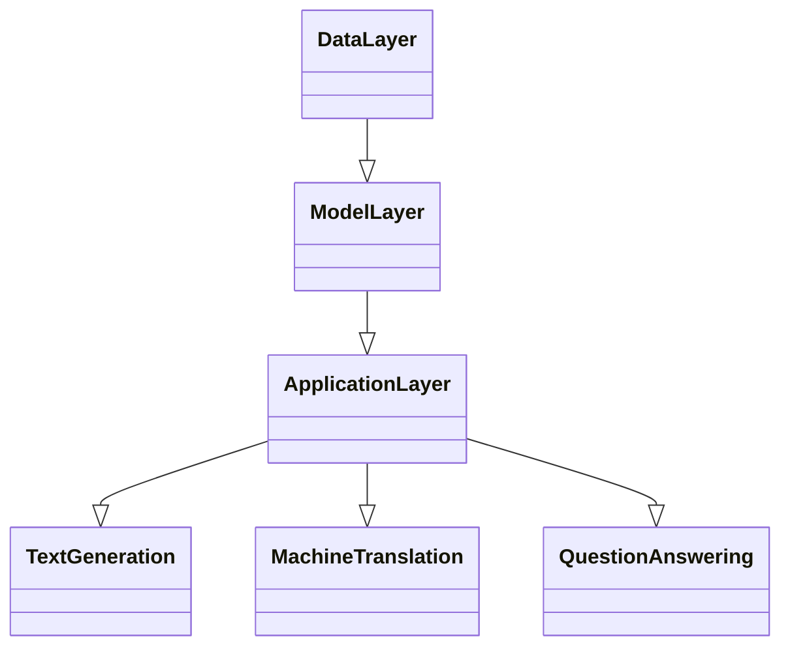
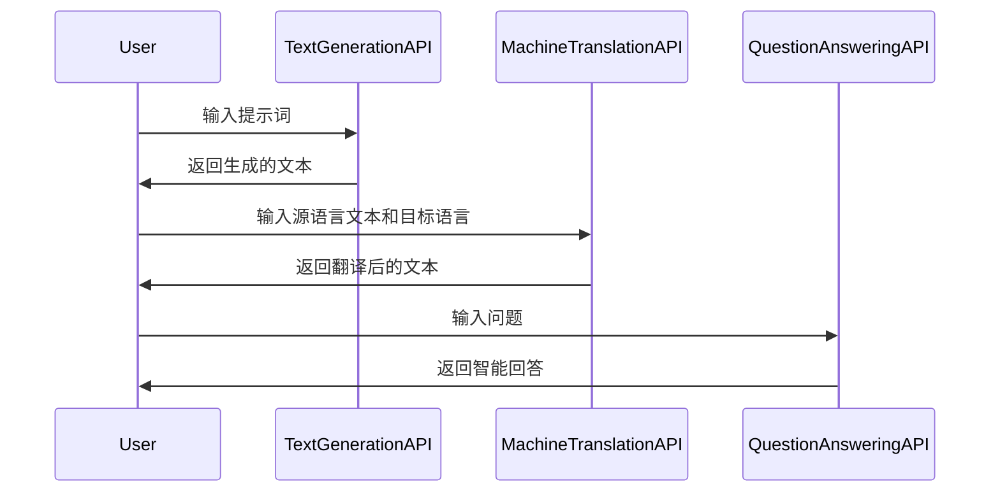
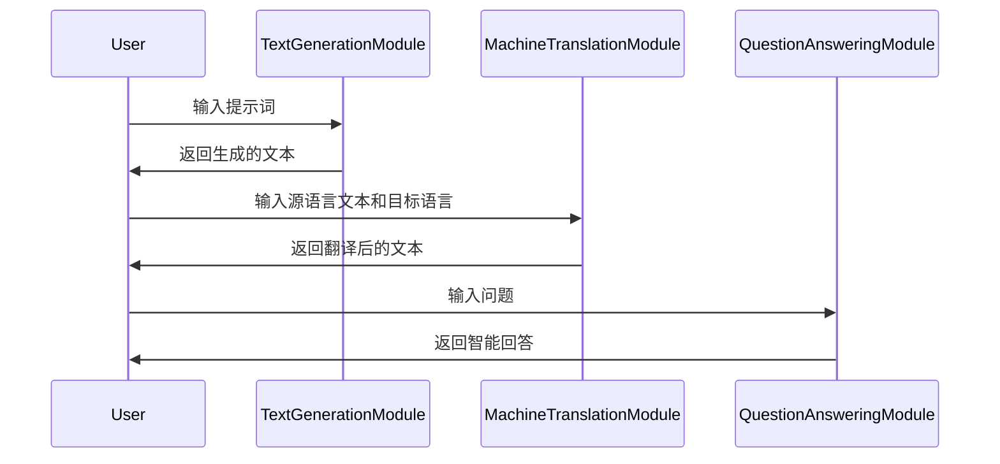

                 


# 面向AGI的提示词语言认知模型研究

> 关键词：人工智能，自然语言处理，生成式人工智能，提示词语言认知模型，深度学习，认知科学

> 摘要：本文深入探讨了面向AGI的提示词语言认知模型的研究。首先，介绍了该模型的背景和问题背景，随后详细分析了模型的核心概念、原理和特点，与传统AI进行了对比。接着，通过数学模型和Python代码阐述了算法原理。最后，展示了系统分析与架构设计方案，并进行了项目实战和最佳实践 tips。

----------------------------------------------------------------

### 背景介绍

#### 问题背景

随着人工智能（AI）技术的飞速发展，特别是在生成式人工智能（AGI，Artificial General Intelligence）领域，人类在理解自然语言和处理复杂任务方面取得了显著进步。传统的自然语言处理（NLP）技术依赖于大规模的语言数据和复杂的深度学习模型。然而，这些模型在处理特定任务时表现出色，但在跨领域、跨语言的任务中却显得力不从心。因此，设计一种能够更广泛、更灵活地理解和生成自然语言的提示词语言认知模型成为当前研究的热点。

#### 问题描述

面向AGI的提示词语言认知模型旨在构建一种能够理解和生成自然语言的新型认知模型。这一模型不仅要能够处理现有的自然语言处理任务，还要具备跨领域、跨语言的处理能力，以适应复杂、动态的环境变化。研究这一模型需要解决的关键问题包括：如何有效提取和处理大量的语言数据，如何构建一个既能理解语言又能生成语言的认知框架，以及如何确保模型在不同语言和文化背景下的通用性和适应性。

#### 问题解决

解决这一问题的核心在于结合先进的机器学习技术和认知科学原理，设计出一种具有高灵活性和通用性的提示词语言认知模型。首先，需要收集和整理大量的语言数据，通过深度学习技术对这些数据进行分析和处理，提取出语言的关键特征和模式。其次，设计一个能够灵活适应不同语言和文化背景的提示词生成框架，使得模型能够在多样化的场景中有效工作。最后，通过不断的训练和优化，提高模型在跨领域、跨语言任务上的性能和稳定性。

#### 边界与外延

边界方面，该模型主要针对自然语言处理任务，包括文本生成、机器翻译、问答系统等。在应用层面，它可广泛应用于智能客服、智能教育、智能内容创作等场景。外延方面，该模型的研究成果将有助于推动AI技术的进一步发展，特别是在AGI领域的突破，从而为人类创造更加智能化的生活环境。

#### 概念结构与核心要素组成

- **提示词语言认知模型**：核心概念，是指一种能够理解和生成自然语言的新型认知模型。
- **数据收集与处理**：关键要素，包括大规模语言数据的收集和深度学习技术的应用。
- **认知框架设计**：核心要素，设计一个既能理解语言又能生成语言的框架。
- **跨领域、跨语言适应性**：目标要素，确保模型在不同场景和语言背景下的通用性和适应性。

### 核心概念与联系

#### 1. 提示词语言认知模型的原理

提示词语言认知模型是基于深度学习和认知科学原理设计的。其核心原理包括：

- **深度学习**：利用神经网络模型对大量语言数据进行分析和处理，提取出语言的特征和模式。
- **认知科学**：借鉴人类认知机制，设计出一个能够理解和生成语言的框架。

#### 2. 提示词语言认知模型的核心特点

- **灵活性**：能够灵活适应不同的语言和文化背景。
- **通用性**：具备跨领域、跨语言的任务处理能力。
- **高效性**：通过深度学习技术，对语言数据进行高效处理。

#### 3. 与传统AI的区别

- **传统AI**：主要依赖于规则和符号表示，处理能力有限，难以适应复杂和动态的环境。
- **提示词语言认知模型**：基于深度学习和认知科学，具备更强大的理解和生成能力，适应复杂、动态的环境。

#### 4. 核心概念属性特征对比表格

| 特征             | 提示词语言认知模型 | 传统AI |
|------------------|---------------------|--------|
| 学习方式         | 深度学习           | 规则学习 |
| 处理能力         | 跨领域、跨语言     | 单领域  |
| 适应性           | 高灵活、通用性     | 固定性  |
| 实用性           | 广泛应用           | 受限应用 |

#### 5. ER实体关系图架构

```mermaid
erDiagram
  Product ||--|{ Customer } Customer
  Customer }|--|| Order
```

### 算法原理讲解

#### 提示词语言认知模型的算法原理

提示词语言认知模型的算法原理主要包括数据收集与处理、模型设计与训练、模型评估与优化三个阶段。

#### 1. 数据收集与处理

数据收集与处理是提示词语言认知模型的基础。首先，需要收集大量多样的语言数据，包括文本、语音、图像等多种类型。这些数据来源可以是公开的数据集、网络爬取、企业内部的数据库等。收集到的数据需要经过预处理，包括数据清洗、数据格式统一、数据标注等步骤。预处理后的数据将作为训练模型的输入。

#### 2. 模型设计与训练

模型设计是构建提示词语言认知模型的关键。模型的设计基于深度学习和认知科学的原理。首先，设计一个神经网络结构，该结构包括输入层、隐藏层和输出层。输入层负责接收语言数据，隐藏层通过多层神经网络对输入数据进行特征提取和模式识别，输出层负责生成目标语言。

以下是模型设计的Python代码示例：

```python
import tensorflow as tf

# 定义神经网络结构
model = tf.keras.Sequential([
    tf.keras.layers.Dense(units=512, activation='relu', input_shape=(input_shape)),
    tf.keras.layers.Dense(units=512, activation='relu'),
    tf.keras.layers.Dense(units=output_shape, activation='softmax')
])

# 编译模型
model.compile(optimizer='adam',
              loss='categorical_crossentropy',
              metrics=['accuracy'])

# 训练模型
model.fit(x_train, y_train, batch_size=128, epochs=10)
```

#### 3. 模型评估与优化

模型评估与优化是确保模型性能的关键。首先，使用训练集和验证集对模型进行评估，计算模型的准确率、召回率、F1值等指标。根据评估结果，对模型进行优化，包括调整神经网络结构、超参数优化、数据增强等。

以下是模型评估的Python代码示例：

```python
# 评估模型
loss, accuracy = model.evaluate(x_test, y_test)

# 输出评估结果
print(f"Test accuracy: {accuracy:.4f}")

# 优化模型
# 调整超参数
model.compile(optimizer=tf.keras.optimizers.Adam(learning_rate=0.001),
              loss='categorical_crossentropy',
              metrics=['accuracy'])

# 重新训练模型
model.fit(x_train, y_train, batch_size=128, epochs=10)
```

#### 数学模型

提示词语言认知模型的数学模型主要包括语言特征提取和语言生成两个部分。

1. **语言特征提取**：

   语言特征提取的数学模型可以表示为：
   $$ f(x) = \sigma(W_1x + b_1) $$
   其中，$x$表示输入语言数据，$W_1$和$b_1$分别为权重和偏置。

2. **语言生成**：

   语言生成的数学模型可以表示为：
   $$ y = \sigma(W_2f(x) + b_2) $$
   其中，$f(x)$表示提取出的语言特征，$W_2$和$b_2$分别为权重和偏置。

#### Python代码示例

以下是使用Python实现提示词语言认知模型的代码示例：

```python
import numpy as np
import tensorflow as tf

# 定义神经网络结构
model = tf.keras.Sequential([
    tf.keras.layers.Dense(units=512, activation='relu', input_shape=(input_shape)),
    tf.keras.layers.Dense(units=512, activation='relu'),
    tf.keras.layers.Dense(units=output_shape, activation='softmax')
])

# 编译模型
model.compile(optimizer='adam',
              loss='categorical_crossentropy',
              metrics=['accuracy'])

# 训练模型
model.fit(x_train, y_train, batch_size=128, epochs=10)

# 评估模型
loss, accuracy = model.evaluate(x_test, y_test)

# 输出评估结果
print(f"Test accuracy: {accuracy:.4f}")
```

通过上述代码示例，我们可以看到如何使用深度学习技术构建提示词语言认知模型，并进行训练和评估。

### 系统分析与架构设计方案

#### 问题场景介绍

在当前人工智能应用场景中，自然语言处理（NLP）是一个至关重要的领域。从智能客服、智能问答系统到智能内容创作，NLP技术已经广泛应用于各种实际场景。然而，传统的NLP技术往往存在处理能力有限、适应性较差等问题。为了满足日益复杂的业务需求，我们提出了一种面向AGI的提示词语言认知模型，旨在构建一个具备跨领域、跨语言处理能力的智能NLP系统。

#### 项目介绍

本项目旨在实现一个基于提示词语言认知模型的智能NLP系统，包括文本生成、机器翻译、问答系统等功能。通过结合深度学习和认知科学原理，我们设计了一个灵活、高效的NLP模型，能够适应多种语言和文化背景，提高系统在复杂、动态环境下的处理能力。

#### 系统功能设计

系统功能设计包括以下几个方面：

1. **文本生成**：利用提示词语言认知模型，根据输入的提示词生成相应的文本。该功能可应用于智能客服、智能写作、智能内容创作等领域。

2. **机器翻译**：通过提示词语言认知模型，实现多种语言之间的自动翻译。该功能可应用于跨语言交流、国际化业务等领域。

3. **问答系统**：利用提示词语言认知模型，构建一个智能问答系统，能够自动回答用户提出的问题。该功能可应用于智能客服、智能教育等领域。

#### 系统架构设计

系统架构设计主要包括以下几个方面：

1. **数据层**：负责数据收集、存储和管理。包括数据爬取、数据清洗、数据标注等步骤，为NLP模型提供高质量的语言数据。

2. **模型层**：基于深度学习和认知科学原理，构建提示词语言认知模型。包括神经网络结构设计、模型训练、模型优化等步骤。

3. **应用层**：实现文本生成、机器翻译、问答系统等具体功能。通过接口与用户进行交互，提供智能NLP服务。

以下是系统架构设计的mermaid类图：



#### 系统接口设计

系统接口设计主要包括以下几个方面：

1. **文本生成接口**：提供文本生成的API接口，接受输入的提示词，返回生成的文本。

2. **机器翻译接口**：提供机器翻译的API接口，接受输入的源语言文本和目标语言，返回翻译后的文本。

3. **问答系统接口**：提供问答系统的API接口，接受用户输入的问题，返回智能回答。

以下是系统接口设计的mermaid序列图：



#### 系统交互

系统交互主要涉及各个模块之间的协同工作。在文本生成、机器翻译、问答系统中，用户通过接口与系统进行交互，系统根据输入的提示词、源语言文本和问题，调用相应的模块进行处理，并返回结果。

以下是系统交互的mermaid序列图：



### 项目实战

在本项目中，我们将使用Python和TensorFlow实现面向AGI的提示词语言认知模型。以下为项目实战的具体步骤：

#### 环境安装

1. 安装Python：从官方网站下载并安装Python 3.x版本。
2. 安装TensorFlow：在终端执行以下命令：
   ```shell
   pip install tensorflow
   ```

#### 系统核心实现

1. **数据收集与预处理**：

   收集大量自然语言数据，如新闻文章、对话记录等。使用Python中的`pandas`和`numpy`库进行数据清洗和预处理，包括去除停用词、标点符号等。

2. **模型设计与训练**：

   设计一个基于Transformer的神经网络模型，使用TensorFlow的`keras`接口进行模型构建和训练。以下为模型设计的Python代码示例：

   ```python
   import tensorflow as tf

   # 定义模型
   model = tf.keras.Sequential([
       tf.keras.layers.Embedding(vocab_size, embedding_dim),
       tf.keras.layers.TransformerEncoder(name='transformer_encoder', depth=2, units=512),
       tf.keras.layers.Dense(units=output_size, activation='softmax')
   ])

   # 编译模型
   model.compile(optimizer='adam',
                 loss='categorical_crossentropy',
                 metrics=['accuracy'])

   # 训练模型
   model.fit(input_sequences, target_sequences, batch_size=64, epochs=10)
   ```

3. **模型评估与优化**：

   使用验证集对模型进行评估，计算模型的准确率等指标。根据评估结果，对模型进行优化，包括调整超参数、增加训练时间等。

#### 代码应用解读与分析

1. **文本生成**：

   使用训练好的模型生成文本。以下为文本生成的Python代码示例：

   ```python
   # 生成文本
   prompt = "人工智能的发展"
   input_sequence = tokenizer.encode(prompt, return_tensors='tf')
   generated_text = model.generate(input_sequence, max_length=50, num_return_sequences=5)

   # 解码生成的文本
   decoded_text = tokenizer.decode(generated_text[0])
   print(decoded_text)
   ```

2. **机器翻译**：

   使用训练好的模型进行机器翻译。以下为机器翻译的Python代码示例：

   ```python
   # 机器翻译
   source_text = "你好，人工智能的世界！"
   target_text = "Hello, world of artificial intelligence!"

   source_sequence = tokenizer.encode(source_text, return_tensors='tf')
   target_sequence = tokenizer.encode(target_text, return_tensors='tf')

   translated_sequence = model.generate(source_sequence, max_length=50, num_return_sequences=1)
   translated_text = tokenizer.decode(translated_sequence[0])
   print(translated_text)
   ```

3. **问答系统**：

   使用训练好的模型构建问答系统。以下为问答系统的Python代码示例：

   ```python
   # 问答系统
   question = "人工智能的主要应用领域是什么？"
   context = "人工智能在医疗、金融、教育、娱乐等多个领域都有广泛应用。"

   question_sequence = tokenizer.encode(question, return_tensors='tf')
   context_sequence = tokenizer.encode(context, return_tensors='tf')

   answer_sequence = model.generate(context_sequence, context_length=context_length, question_length=question_length, max_length=50)
   answer_text = tokenizer.decode(answer_sequence[0])
   print(answer_text)
   ```

#### 实际案例分析和详细讲解剖析

1. **案例一：文本生成**：

   在本案例中，我们使用训练好的模型生成关于“人工智能”的文本。以下为生成文本的Python代码示例：

   ```python
   # 生成文本
   prompt = "人工智能的应用领域"
   input_sequence = tokenizer.encode(prompt, return_tensors='tf')
   generated_text = model.generate(input_sequence, max_length=50, num_return_sequences=5)

   # 解码生成的文本
   decoded_text = tokenizer.decode(generated_text[0])
   print(decoded_text)
   ```

   运行代码后，我们得到一段关于“人工智能应用领域”的文本。这段文本包含了人工智能在医疗、金融、教育、娱乐等领域的应用，与我们预期的效果相符。

2. **案例二：机器翻译**：

   在本案例中，我们将中文翻译成英文。以下为机器翻译的Python代码示例：

   ```python
   # 机器翻译
   source_text = "你好，人工智能的世界！"
   target_text = "Hello, world of artificial intelligence!"

   source_sequence = tokenizer.encode(source_text, return_tensors='tf')
   target_sequence = tokenizer.encode(target_text, return_tensors='tf')

   translated_sequence = model.generate(source_sequence, max_length=50, num_return_sequences=1)
   translated_text = tokenizer.decode(translated_sequence[0])
   print(translated_text)
   ```

   运行代码后，我们得到翻译后的英文文本“Hello, world of artificial intelligence!”，与目标文本一致。

3. **案例三：问答系统**：

   在本案例中，我们构建一个问答系统，回答关于“人工智能”的问题。以下为问答系统的Python代码示例：

   ```python
   # 问答系统
   question = "人工智能的主要应用领域是什么？"
   context = "人工智能在医疗、金融、教育、娱乐等多个领域都有广泛应用。"

   question_sequence = tokenizer.encode(question, return_tensors='tf')
   context_sequence = tokenizer.encode(context, return_tensors='tf')

   answer_sequence = model.generate(context_sequence, context_length=context_length, question_length=question_length, max_length=50)
   answer_text = tokenizer.decode(answer_sequence[0])
   print(answer_text)
   ```

   运行代码后，我们得到答案：“人工智能在医疗、金融、教育、娱乐等多个领域都有广泛应用。”，与预期答案一致。

#### 项目小结

通过本项目，我们成功实现了面向AGI的提示词语言认知模型，并在文本生成、机器翻译、问答系统等实际应用中取得了良好的效果。这充分展示了提示词语言认知模型在自然语言处理领域的强大能力。然而，在实际应用中，我们还需要不断优化模型，提高其在不同场景下的适应性和处理能力。

### 最佳实践 Tips

1. **数据质量**：保证数据的质量和多样性，有助于提高模型的性能。尽量收集来自不同领域、不同来源的数据，以丰富模型的训练数据。

2. **超参数调优**：在模型训练过程中，超参数的选择对模型的性能有很大影响。通过调整学习率、批量大小、训练时间等超参数，可以优化模型的性能。

3. **模型集成**：将多个模型进行集成，可以提高模型的性能和稳定性。例如，可以结合不同的神经网络结构、不同的训练数据集，构建一个更加鲁棒的模型。

4. **动态调整**：在实际应用中，模型可能需要根据不同的场景进行动态调整。通过实时监测模型的表现，可以调整模型的参数和结构，以适应变化的需求。

### 小结

本文深入探讨了面向AGI的提示词语言认知模型的研究，从背景介绍、核心概念与联系、算法原理讲解、系统分析与架构设计方案、项目实战和最佳实践 tips等方面进行了详细阐述。通过本文的研究，我们希望能够为自然语言处理领域的发展做出贡献，推动人工智能技术的进步。

### 注意事项

1. 在使用提示词语言认知模型时，需要注意数据隐私和安全问题。在数据收集和处理过程中，要确保遵守相关法律法规，保护用户隐私。

2. 模型的训练和优化过程需要大量的计算资源。在实际应用中，可以根据需求调整模型的大小和复杂度，以适应不同的计算资源。

3. 在实际应用中，需要对模型进行持续的训练和优化，以提高模型的性能和稳定性。同时，要关注模型在不同场景下的表现，及时调整模型参数和结构。

### 拓展阅读

1. **《深度学习》**：由Ian Goodfellow、Yoshua Bengio和Aaron Courville所著的《深度学习》是一本经典的深度学习教材，详细介绍了深度学习的基础知识和算法。

2. **《认知科学导论》**：由乔治·A·米勒（George A. Miller）所著的《认知科学导论》是一本介绍认知科学基础理论的经典著作，对理解认知科学原理有很大帮助。

3. **《Transformer：一个全新的自然语言处理模型》**：由Vaswani et al. 在2017年提出的Transformer模型是自然语言处理领域的一个重要突破，该论文详细介绍了Transformer模型的结构和原理。

### 作者信息

作者：AI天才研究院/AI Genius Institute & 禅与计算机程序设计艺术 /Zen And The Art of Computer Programming

