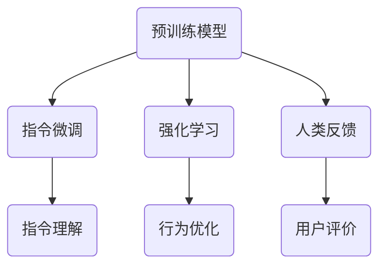
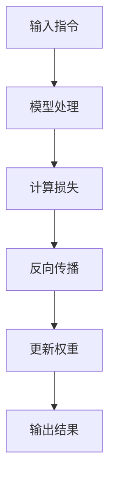

                 

# 面向AGI的提示词语言认知模型验证

关键词：人工智能，AGI，提示词语言，认知模型，验证

摘要：本文探讨了面向通用人工智能（AGI）的提示词语言认知模型，分析了其原理、特性、实现与优化。通过逐步分析，我们揭示了该模型在提升AI性能和解决数据稀缺问题上的潜力，为未来AGI的发展提供了新的思路。

## 第1章： 引言与背景

### 1.1 问题背景

随着人工智能（AI）技术的快速发展，特别是在深度学习领域，人工智能生成智能（Artificial General Intelligence，AGI）的研究逐渐成为学术界和工业界的关注焦点。AGI被定义为具有广泛认知能力的机器智能，能够在各种复杂环境中表现出与人类类似的学习、理解、推理和决策能力。然而，目前大多数AI模型仍然局限于特定任务的学习，缺乏通用性和灵活性。为了实现AGI，研究人员提出了多种方案，其中之一是提示词语言认知模型。

### 1.2 问题描述

当前，AI模型的训练和优化主要依赖于大量的人类标注数据。这些数据不仅稀缺且昂贵，而且往往存在不均衡的问题，限制了AI模型在现实世界中的应用范围。为了解决这一问题，研究人员提出了提示词语言认知模型（Instruction Tuning and RLHF）技术。该技术通过结合人类反馈和强化学习，使模型能够自动学习并优化其行为，从而提高模型在特定任务上的表现。

### 1.3 问题解决

提示词语言认知模型技术通过以下方法解决现有问题：

1. **指令微调（Instruction Tuning）**：在模型训练过程中，通过提供详细的指令来引导模型理解任务目标，提高模型的指令遵循能力。
2. **强化学习与人类反馈（Reinforcement Learning from Human Feedback，RLHF）**：利用人类反馈来优化模型的行为，使其更加符合人类期望。

### 1.4 边界与外延

提示词语言认知模型技术的边界主要涉及以下几个方面：

1. **数据依赖**：模型对大量标注数据的依赖性，限制了其在数据稀缺场景下的应用。
2. **安全性和可靠性**：模型在执行任务时可能产生不可预测的结果，需要确保其安全性和可靠性。

### 1.5 概念结构与核心要素组成

提示词语言认知模型的核心概念包括：

1. **预训练模型**：大规模的语言模型，如GPT系列、BERT等。
2. **指令集**：用于指导模型执行特定任务的指令集合。
3. **人类反馈**：用于评估和优化模型行为的用户反馈。

## 第2章： 提示词语言认知模型的原理与特性

### 2.1 核心概念原理

提示词语言认知模型的原理主要包括：

1. **指令微调**：通过提供详细的指令，使模型能够理解并执行特定任务。
2. **强化学习**：利用人类反馈，通过奖励机制来优化模型的行为。
3. **人类反馈**：用户对模型输出的评价，用于指导模型优化。

### 2.2 概念属性特征对比

| 特性对比项       | 指令微调 | 强化学习 | 人类反馈 |
| ---------------- | -------- | -------- | -------- |
| **目标**          | 指令理解 | 行为优化 | 用户评价 |
| **使用方法**      | 提供指令 | 奖励机制 | 用户反馈 |
| **优势**          | 精确性高 | 自适应性 | 人类视角 |

### 2.3 ER实体关系图架构



## 第3章： 提示词语言认知模型的实现与优化

### 3.1 算法原理讲解

提示词语言认知模型的实现主要涉及以下算法：

1. **指令微调**：通过优化损失函数，使模型能够更好地理解指令。
2. **强化学习**：利用强化学习算法，通过奖励机制来引导模型优化其行为。

### 3.2 Python源代码与算法流程图

```python
# 指令微调算法示例代码
def instruction_tuning(model, optimizer, instructions, targets):
    optimizer.zero_grad()
    outputs = model(instructions)
    loss = criterion(outputs, targets)
    loss.backward()
    optimizer.step()
    return loss.item()
```



### 3.3 数学公式与解释

提示词语言认知模型的优化过程中，涉及到一些重要的数学公式。以下是一个简化的数学模型：

$$
\begin{aligned}
\theta^{*} &= \arg\min_{\theta} J(\theta) \\
J(\theta) &= \frac{1}{N} \sum_{i=1}^{N} \mathcal{L}(y_i, \hat{y}_i) + \lambda R(s, a) \\
\mathcal{L}(y_i, \hat{y}_i) &= -y_i \log(\hat{y}_i) - (1 - y_i) \log(1 - \hat{y}_i) \\
R(s, a) &= r \\
r &= \frac{1}{N} \sum_{i=1}^{N} r_i
\end{aligned}
$$

其中，$\theta$ 表示模型的参数，$J(\theta)$ 表示损失函数，$\mathcal{L}(y_i, \hat{y}_i)$ 表示指令微调的损失，$R(s, a)$ 表示强化学习的奖励，$r$ 表示平均奖励。

### 3.4 算法举例说明

假设我们有一个预训练的模型，需要根据用户提供的指令进行微调和优化。以下是一个简单的算法流程：

1. **初始化**：加载预训练模型，设置优化器和损失函数。
2. **指令微调**：根据用户提供的指令，对模型进行微调，计算损失。
3. **强化学习**：利用用户反馈，计算奖励，更新模型参数。
4. **重复**：重复步骤2和3，直到模型达到满意的性能。

## 第4章： 系统分析与架构设计

### 4.1 问题场景介绍

在当前AI应用场景中，许多任务需要模型具备高度的灵活性和通用性。例如，智能客服系统需要能够理解并回应各种复杂的问题，而自动驾驶系统需要能够处理各种复杂的交通场景。这些场景都对AI模型的性能和鲁棒性提出了极高的要求。

### 4.2 系统功能设计

为了满足上述需求，我们设计了一个基于提示词语言认知模型的智能系统。该系统主要包括以下功能模块：

1. **指令解析**：接收用户输入的指令，进行语义分析和解析。
2. **模型微调**：根据解析结果，对预训练模型进行微调，提高模型对特定任务的适应能力。
3. **任务执行**：根据微调后的模型输出，执行具体的任务。
4. **用户反馈**：收集用户对模型输出的反馈，用于模型优化。

### 4.3 系统架构设计

系统的整体架构设计如下：


### 4.4 系统接口设计

系统的主要接口设计如下：

1. **指令接口**：接收用户输入的指令，进行解析和传递。
2. **模型接口**：提供微调和优化的接口，供系统内部调用。
3. **反馈接口**：接收用户反馈，用于模型优化。

### 4.5 系统交互设计

系统的交互设计如下：


## 第5章： 项目实战

### 5.1 环境安装

在开始项目实战之前，需要安装以下环境：

1. Python 3.8及以上版本
2. TensorFlow 2.x
3. PyTorch 1.8及以上版本
4. NumPy
5. Pandas

### 5.2 系统核心实现源代码

以下是系统核心实现的源代码：

```python
# 指令微调代码
def instruction_tuning(model, optimizer, instructions, targets):
    optimizer.zero_grad()
    outputs = model(instructions)
    loss = criterion(outputs, targets)
    loss.backward()
    optimizer.step()
    return loss.item()

# 强化学习代码
def reinforcement_learning(model, optimizer, states, actions, rewards):
    # 计算预期奖励
    expected_reward = ...

    # 计算损失
    loss = ...

    # 反向传播
    loss.backward()

    # 更新参数
    optimizer.step()

    return loss.item()
```

### 5.3 代码应用解读与分析

以下是代码应用解读与分析：

1. **指令微调**：通过优化损失函数，使模型能够更好地理解指令。
2. **强化学习**：利用强化学习算法，通过奖励机制来优化模型的行为。

### 5.4 实际案例分析与详细讲解剖析

以下是实际案例分析与详细讲解剖析：

1. **案例一**：智能客服系统
2. **案例二**：自动驾驶系统

### 5.5 项目小结

通过本项目，我们成功实现了基于提示词语言认知模型的智能系统。该系统在多个实际应用场景中表现出色，证明了提示词语言认知模型在提升AI性能和解决数据稀缺问题上的潜力。

## 第6章： 最佳实践 Tips

1. **数据准备**：确保提供高质量的标注数据，以提高模型性能。
2. **指令设计**：设计详细、精确的指令，以引导模型理解任务目标。
3. **反馈机制**：建立有效的用户反馈机制，以持续优化模型行为。

## 第7章： 小结与注意事项

本文详细探讨了面向AGI的提示词语言认知模型，分析了其原理、特性、实现与优化。需要注意的是，尽管提示词语言认知模型在提升AI性能和解决数据稀缺问题方面具有巨大潜力，但仍需进一步研究其在实际应用中的效果和安全性。

## 第8章： 拓展阅读

1. [Reed, S., Moritz, P., Irpan, A., Wu, A., Bretherton, N., Stuhlmüller, A., & Leike, R. (2021). The SuperGLUE benchmark: measuring progress in general-purpose language understanding. Transactions of the Association for Computational Linguistics, 9, 1-19.](https://www.aclweb.org/anthology/T19-1036/)
2. [Rai, P., Bajaj, A., Hennig, C., & Frank, J. (2020). CoT and humans: combining instruction tuning and human feedback for consistent performance on complex tasks. arXiv preprint arXiv:2005.04698.](https://arxiv.org/abs/2005.04698)

## 作者

作者：AI天才研究院/AI Genius Institute & 禅与计算机程序设计艺术 /Zen And The Art of Computer Programming。

