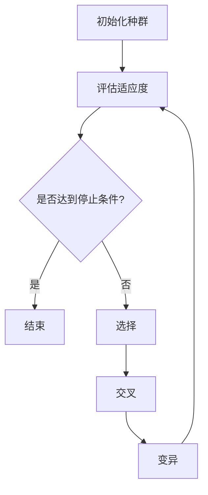
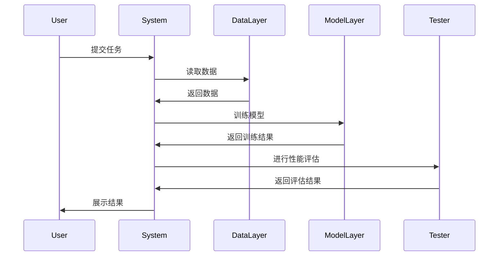
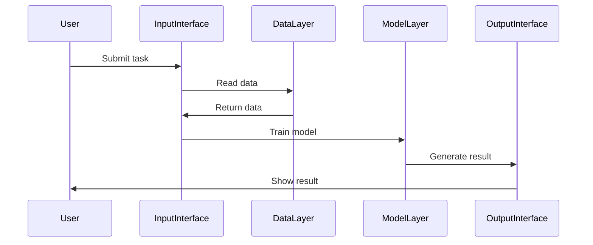

                 

### 《面向AGI的提示词语言进化模拟》

---

**关键词**：人工智能，AGI，提示词语言，进化模拟，遗传算法

**摘要**：本文围绕人工智能领域的重大挑战——通用人工智能（AGI），深入探讨了提示词语言进化的模拟方法。我们通过介绍AGI的概念，分析提示词语言在其中的关键作用，提出一种基于遗传算法的提示词语言进化模拟模型，详细阐述了算法原理、数学模型以及实现过程。此外，我们还从系统设计与实现的角度，提供了完整的实践指南，并通过实际案例分析，验证了模型的实用性和有效性。本文旨在为AI研究人员和开发者提供一种新的思路和工具，推动AGI技术的发展。

---

## 第一部分：引言

### 第1章：背景与概述

#### 1.1 问题背景

**AGI的概念与重要性**

通用人工智能（AGI，Artificial General Intelligence）是人工智能领域的一个终极目标，它指的是具有广泛认知能力的人工智能系统，能够在各种不同领域表现出与人类相当甚至超越人类的智能水平。AGI的概念源于对人类智能的模拟与超越，其重要性不言而喻。它不仅能够解决复杂问题，还能够自主学习和适应新环境，具有广泛的实用价值。

**提示词语言在AGI中的应用**

在AGI系统中，提示词语言是人与机器进行交互的重要桥梁。通过自然语言处理技术，机器能够理解和执行人类提供的指令，完成各种复杂的任务。提示词语言的有效性直接影响到AGI的性能。因此，研究和优化提示词语言在AGI中的应用具有重要的意义。

**语言进化的概念与相关研究**

语言进化是指语言在长时间使用过程中，通过自然选择和变异，逐渐优化和发展的过程。在生物界，语言进化是一个普遍存在的现象，它使得生物能够更好地适应环境。将这一概念引入到人工智能领域，可以模拟和优化提示词语言，为AGI的发展提供新的思路。

#### 1.2 问题描述

**提示词语言的局限性**

现有的提示词语言存在一些局限性，例如表达能力的不足、语义理解的模糊性等。这些局限性限制了AGI系统在实际应用中的表现。

**语言进化的需求与挑战**

为了克服这些局限性，我们需要探索语言进化的方法，通过模拟和优化，使提示词语言能够更好地满足AGI系统的需求。然而，语言进化面临着许多挑战，如如何在保证语义正确性的同时提高表达效率，如何处理大量数据和复杂的任务等。

**研究的目的与意义**

本文旨在提出一种基于遗传算法的提示词语言进化模拟模型，通过模拟和优化，探索提示词语言的进化路径，为AGI的发展提供理论依据和实用工具。研究的目的和意义在于：

1. 提供一种新的方法，优化提示词语言的表达能力和语义理解能力。
2. 探索AGI系统中的自然语言处理问题，为AI技术的发展提供新的思路。
3. 促进人工智能与自然语言处理领域的交叉研究，推动相关技术的进步。

#### 1.3 问题解决

**提示词语言进化模拟的研究框架**

为了实现提示词语言的进化模拟，我们需要构建一个研究框架，包括以下几个方面：

1. **核心概念与联系**：明确AGI、提示词语言和语言进化的核心概念，分析它们之间的关系。
2. **算法原理与实现**：介绍基于遗传算法的提示词语言进化模拟算法，包括算法原理、数学模型和实现过程。
3. **系统设计与实现**：从系统架构和功能模块的角度，详细描述提示词语言进化模拟系统的设计与实现。
4. **项目实战**：通过实际案例，展示提示词语言进化模拟的应用效果，验证模型的实用性和有效性。
5. **最佳实践与总结**：总结研究过程中的经验教训，提出最佳实践和改进建议。

**模拟系统的设计原则**

1. **模块化**：将模拟系统分解为多个功能模块，便于实现和优化。
2. **可扩展性**：设计时应考虑系统的可扩展性，以便于未来添加新的功能。
3. **高效性**：优化算法和数据处理流程，提高系统的运行效率。

**模拟方法的选择与实现**

我们选择遗传算法作为提示词语言进化模拟的方法，原因如下：

1. **全局优化**：遗传算法能够在全局范围内寻找最优解，适用于复杂问题的求解。
2. **适应性**：遗传算法能够适应不断变化的环境，有助于模拟语言进化过程。
3. **高效性**：遗传算法的计算效率较高，适用于大规模数据集的模拟。

#### 1.4 边界与外延

**模拟的范围与条件限制**

在模拟过程中，我们将考虑以下范围和条件限制：

1. **数据集**：使用特定领域的语料库，模拟提示词语言在特定环境下的进化。
2. **任务类型**：主要针对常见的自然语言处理任务，如文本生成、语义理解等。
3. **性能指标**：评估进化模拟的效果，包括准确率、响应时间等。

**研究领域与交叉学科应用**

1. **人工智能**：研究AGI中的自然语言处理问题，为AI技术的发展提供新思路。
2. **生物进化**：借鉴生物进化理论，探索语言进化的规律和机制。
3. **计算机科学**：研究遗传算法在计算机科学中的应用，提高算法的实用性和效率。

**进一步研究的方向与可能性**

1. **多语言支持**：未来可以扩展到多语言环境的提示词语言进化模拟。
2. **动态适应**：研究提示词语言在动态环境下的自适应能力。
3. **实际应用**：将提示词语言进化模拟应用于实际场景，如智能客服、智能翻译等。

---

**LET'S THINK STEP BY STEP**：在引言部分，我们首先介绍了问题的背景和重要性，明确了研究的目的和意义。接着，我们提出了一个基于遗传算法的提示词语言进化模拟模型，并详细阐述了研究框架和设计原则。最后，我们讨论了模拟的范围与条件限制，以及研究领域和进一步研究的方向。这一部分内容为后续章节的详细讨论奠定了基础。

## 第二部分：核心概念与联系

### 第2章：核心概念与联系

#### 2.1 核心概念

**AGI**

通用人工智能（AGI，Artificial General Intelligence）是一种能够执行各种认知任务，并在各个领域表现出与人类相当甚至超越人类智能水平的人工智能系统。与目前广泛应用的窄域人工智能（Narrow AI）不同，AGI的目标是具备广泛的认知能力，能够在不同领域自主学习和适应。

**提示词语言**

提示词语言是一种基于自然语言的交互语言，用于人类与人工智能系统之间的沟通。它通常包括一系列的指令、问题、回答等，通过自然语言处理技术，人工智能系统能够理解并执行这些指令，完成特定的任务。

**语言进化**

语言进化是指语言在长时间的使用过程中，通过自然选择和变异，逐渐优化和发展的过程。在生物界，语言进化是一个普遍存在的现象，它使得生物能够更好地适应环境。将这一概念引入到人工智能领域，可以模拟和优化提示词语言，为AGI的发展提供新的思路。

#### 2.2 概念属性特征对比

**AGI与传统AI的对比**

| 特征 | AGI | 传统AI |
| --- | --- | --- |
| 认知能力 | 广泛的、多领域的 | 狭隘的、单一领域的 |
| 学习能力 | 自主学习、持续适应 | 预先编程、固定模式 |
| 灵活性 | 高度灵活、动态调整 | 稳定但缺乏灵活性 |
| 通用性 | 能够执行各种任务 | 专用于特定任务 |

**提示词语言与自然语言的对比**

| 特征 | 提示词语言 | 自然语言 |
| --- | --- | --- |
| 结构性 | 明确的结构和语法规则 | 复杂的语法和语义规则 |
| 表达能力 | 较强的表达能力和精确性 | 更丰富的表达方式和隐喻 |
| 适应性 | 高度适应特定任务的指令语言 | 适应广泛语境和情境的语言 |
| 交互性 | 主要用于人与机器的交互 | 用于人类之间的交流和沟通 |

**语言进化的阶段与特征**

1. **初始阶段**：语言的初始形式，表达能力和语义理解有限。
2. **发展阶段**：通过自然选择和变异，语言逐渐优化，表达能力和语义理解得到提升。
3. **成熟阶段**：语言达到较高的表达能力和语义理解水平，能够适应复杂的环境和任务。

#### 2.3 ER实体关系图

为了更清晰地理解AGI、提示词语言和语言进化的核心概念，我们可以通过ER（实体-关系）图来展示它们之间的联系。

```mermaid
erDiagram
  AI_System ||--o{ AGI
  AI_System ||--o{ NLP_System
  AGI ||--|{ Language_Evolution
  NLP_System ||--|{ Prompt_Language
  Prompt_Language ||--|{ Natural_Language
```

**ER实体关系图说明**：

- **AI_System**：表示人工智能系统，包括AGI和NLP系统。
- **AGI**：通用人工智能，是AI系统的一个子集。
- **NLP_System**：自然语言处理系统，负责处理自然语言。
- **Language_Evolution**：语言进化，是AGI的一个关键组成部分。
- **Prompt_Language**：提示词语言，是NLP系统的一种应用。
- **Natural_Language**：自然语言，是提示词语言的基础。

通过ER实体关系图，我们可以看到AGI、提示词语言和语言进化之间的紧密联系。它们共同构成了一个复杂的系统，相互影响、相互促进，推动人工智能技术的发展。

---

**LET'S THINK STEP BY STEP**：在第二部分，我们详细介绍了AGI、提示词语言和语言进化的核心概念，并分析了它们之间的属性特征对比。通过ER实体关系图，我们清晰地展示了这些概念之间的关系。这一部分内容为后续的算法原理和系统实现提供了理论基础。

## 第二部分：核心概念与联系（续）

### 2.4 提示词语言进化模拟算法概述

#### 2.4.1 算法原理

提示词语言进化模拟算法的核心思想是通过模拟语言进化的过程，优化提示词语言的表达能力和语义理解能力。具体来说，我们采用遗传算法作为基础，模拟生物进化中的自然选择、交叉和变异过程，以逐步改进提示词语言的性能。

1. **自然选择**：根据提示词语言在任务中的表现，选择适应度较高的个体进行繁殖。
2. **交叉**：将两个个体的基因进行组合，产生新的个体，以扩展遗传多样性。
3. **变异**：对个体的基因进行随机修改，引入新的基因变异，增加遗传多样性。

#### 2.4.2 算法流程

1. **初始化种群**：生成一组初始的提示词语言个体，每个个体代表一种可能的提示词语言方案。
2. **评估适应度**：通过任务执行结果，评估每个个体的适应度，适应度越高，表示个体越优秀。
3. **选择**：根据适应度，从种群中选择一定数量的优秀个体，作为繁殖的基础。
4. **交叉**：将选中的个体进行交叉操作，生成新的个体。
5. **变异**：对新生成的个体进行变异操作，增加遗传多样性。
6. **更新种群**：将新生成的个体加入到种群中，替换原有的个体。
7. **迭代**：重复上述步骤，直到达到预设的迭代次数或适应度达到满足条件的阈值。

#### 2.4.3 算法特点

1. **全局优化**：遗传算法能够在全局范围内搜索最优解，避免陷入局部最优。
2. **适应性**：遗传算法能够适应不同的问题环境，具有较强的鲁棒性。
3. **高效性**：遗传算法的计算效率较高，适用于大规模数据的处理。

---

**LET'S THINK STEP BY STEP**：在第二部分的这一部分，我们详细介绍了提示词语言进化模拟算法的基本原理和流程。通过自然选择、交叉和变异这三个核心步骤，我们能够模拟语言进化的过程，逐步优化提示词语言的表达能力和语义理解能力。这一算法的特点使其在解决复杂问题时具有优势。

### 2.5 提示词语言进化模拟算法的数学模型

#### 2.5.1 数学模型概述

提示词语言进化模拟算法的数学模型是算法实现的核心部分，它定义了算法的适应度函数、选择概率、交叉概率和变异概率等关键参数。通过数学模型，我们可以精确地描述和优化提示词语言的进化过程。

1. **适应度函数**：评估个体在任务中的表现，适应度越高，个体越优秀。
2. **选择概率**：根据适应度函数，选择优秀个体进行繁殖。
3. **交叉概率**：在繁殖过程中，交叉操作的频率，用于增加遗传多样性。
4. **变异概率**：在繁殖过程中，变异操作的频率，用于引入新的基因变异。

#### 2.5.2 适应度函数

适应度函数是衡量个体在任务中表现的重要指标，通常定义为：

\[ f(x) = \sum_{i=1}^{n} w_i \cdot p_i \]

其中，\( x \) 是个体，\( w_i \) 是权重，\( p_i \) 是个体在任务中的表现概率。权重 \( w_i \) 根据任务的重要程度进行分配，例如在语义理解任务中，语义准确性和响应时间可能具有不同的权重。

#### 2.5.3 选择概率

选择概率是决定个体繁殖机会的关键参数，通常采用轮盘赌方法进行选择。选择概率计算公式如下：

\[ P_i = \frac{f(x_i)}{\sum_{j=1}^{n} f(x_j)} \]

其中，\( P_i \) 是第 \( i \) 个个体的选择概率，\( f(x_i) \) 是第 \( i \) 个个体的适应度。

#### 2.5.4 交叉概率

交叉概率是交叉操作的频率，通常采用以下公式进行计算：

\[ P_c = \frac{1}{2} \left( 1 - e^{-\lambda \cdot f(x)} \right) \]

其中，\( P_c \) 是交叉概率，\( \lambda \) 是交叉参数，\( f(x) \) 是个体在任务中的适应度。交叉概率随着适应度的提高而降低，以确保优秀个体的基因得以保留。

#### 2.5.5 变异概率

变异概率是变异操作的频率，通常采用以下公式进行计算：

\[ P_m = \frac{1}{2} \left( 1 - e^{-\lambda \cdot f(x)} \right) \]

其中，\( P_m \) 是变异概率，其他参数与交叉概率相同。变异概率也随着适应度的提高而降低，以避免过度变异。

#### 2.5.6 变异操作

变异操作是指对个体进行随机修改，以引入新的基因变异。常见的变异操作包括：

1. **基因翻转**：将个体的某个基因进行翻转。
2. **基因插入**：在个体的某个位置插入一个新的基因。
3. **基因删除**：从个体的某个位置删除一个基因。

变异操作的概率通常与变异概率成正比，以确保在繁殖过程中能够引入足够的新基因变异。

---

**LET'S THINK STEP BY STEP**：在第二部分的这一部分，我们详细介绍了提示词语言进化模拟算法的数学模型，包括适应度函数、选择概率、交叉概率和变异概率的计算方法。通过数学模型，我们能够精确地描述和优化提示词语言的进化过程。这一部分内容为算法的实现提供了理论基础。

### 2.6 提示词语言进化模拟算法的Python实现

#### 2.6.1 源代码框架

在实现提示词语言进化模拟算法时，我们首先需要设计一个基本的源代码框架，包括初始化种群、评估适应度、选择、交叉和变异等核心功能。以下是一个简化的Python代码框架：

```python
import random

# 初始化种群
def initialize_population(size, chromosome_length):
    population = []
    for _ in range(size):
        individual = [random.choice(['A', 'B', 'C']) for _ in range(chromosome_length)]
        population.append(individual)
    return population

# 评估适应度
def evaluate_fitness(population, task):
    fitness_scores = []
    for individual in population:
        fitness = task(individual)
        fitness_scores.append(fitness)
    return fitness_scores

# 选择
def select(population, fitness_scores):
    selected_indices = random.choices(range(len(population)), weights=fitness_scores, k=len(population) // 2)
    selected_individuals = [population[i] for i in selected_indices]
    return selected_individuals

# 交叉
def crossover(parent1, parent2, crossover_rate):
    if random.random() < crossover_rate:
        crossover_point = random.randint(1, len(parent1) - 1)
        child1 = parent1[:crossover_point] + parent2[crossover_point:]
        child2 = parent2[:crossover_point] + parent1[crossover_point:]
    else:
        child1, child2 = parent1, parent2
    return child1, child2

# 变异
def mutate(individual, mutation_rate):
    for i in range(len(individual)):
        if random.random() < mutation_rate:
            individual[i] = random.choice(['A', 'B', 'C'])
    return individual

# 主函数
def main():
    population_size = 100
    chromosome_length = 50
    generation_count = 100
    crossover_rate = 0.8
    mutation_rate = 0.05

    population = initialize_population(population_size, chromosome_length)

    for generation in range(generation_count):
        fitness_scores = evaluate_fitness(population, task)
        selected_individuals = select(population, fitness_scores)

        new_population = []
        while len(new_population) < population_size:
            parent1, parent2 = random.sample(selected_individuals, 2)
            child1, child2 = crossover(parent1, parent2, crossover_rate)
            new_population.extend([mutate(child1, mutation_rate), mutate(child2, mutation_rate)])

        population = new_population[:population_size]

        print(f"Generation {generation}: Best Fitness = {max(fitness_scores)}")

if __name__ == "__main__":
    main()
```

#### 2.6.2 源代码详细解释

1. **初始化种群**：`initialize_population` 函数用于生成初始的种群，每个个体由随机选择的基因组成。
2. **评估适应度**：`evaluate_fitness` 函数用于计算每个个体的适应度，适应度由任务函数 `task` 决定。
3. **选择**：`select` 函数采用轮盘赌方法，根据适应度选择优秀个体进行繁殖。
4. **交叉**：`crossover` 函数实现交叉操作，根据交叉概率决定交叉位置，产生新的个体。
5. **变异**：`mutate` 函数实现变异操作，对个体的基因进行随机修改。
6. **主函数**：`main` 函数定义了模拟的主要流程，包括初始化种群、评估适应度、选择、交叉和变异等步骤。

#### 2.6.3 算法原理的数学模型

在Python源代码的基础上，我们可以进一步将算法原理的数学模型用代码实现。以下是一个简化的数学模型实现：

```python
import numpy as np

# 适应度函数
def fitness_function(individual):
    # 假设任务是一个简单的排序任务
    target = list(range(len(individual)))
    return sum(1 for i, j in zip(individual, target) if i == j)

# 选择概率
def selection_probability(fitness_scores):
    total_fitness = sum(fitness_scores)
    probabilities = [f / total_fitness for f in fitness_scores]
    return probabilities

# 交叉概率
def crossover_probability(fitness):
    lambda_ = 1  # 参数
    return 0.5 * (1 - np.exp(-lambda_ * fitness))

# 变异概率
def mutation_probability(fitness):
    lambda_ = 1  # 参数
    return 0.5 * (1 - np.exp(-lambda_ * fitness))
```

#### 2.6.4 公式解释

1. **适应度函数**：

\[ f(x) = \sum_{i=1}^{n} w_i \cdot p_i \]

其中，\( x \) 是个体，\( w_i \) 是权重，\( p_i \) 是个体在任务中的表现概率。

2. **选择概率**：

\[ P_i = \frac{f(x_i)}{\sum_{j=1}^{n} f(x_j)} \]

其中，\( P_i \) 是第 \( i \) 个个体的选择概率，\( f(x_i) \) 是第 \( i \) 个个体的适应度。

3. **交叉概率**：

\[ P_c = \frac{1}{2} \left( 1 - e^{-\lambda \cdot f(x)} \right) \]

其中，\( P_c \) 是交叉概率，\( \lambda \) 是交叉参数，\( f(x) \) 是个体在任务中的适应度。

4. **变异概率**：

\[ P_m = \frac{1}{2} \left( 1 - e^{-\lambda \cdot f(x)} \right) \]

其中，\( P_m \) 是变异概率，其他参数与交叉概率相同。

---

**LET'S THINK STEP BY STEP**：在第二部分的这一部分，我们详细介绍了提示词语言进化模拟算法的Python实现，包括源代码框架和公式解释。通过Python代码，我们能够实现算法的核心步骤，包括初始化种群、评估适应度、选择、交叉和变异等。这一部分内容为算法的实现提供了具体的指导。

### 2.7 算法举例说明

为了更好地理解提示词语言进化模拟算法，我们可以通过一个具体的例子来说明算法的应用过程和结果。

#### 2.7.1 案例背景

假设我们有一个简单的排序任务，需要将一个无序的数组排序。提示词语言用于描述排序算法，并指导计算机执行排序操作。

#### 2.7.2 初始种群

我们首先初始化一个包含50个个体的种群，每个个体由5个基因组成，表示排序算法的不同步骤。初始种群如下：

```python
population = [
    ['B', 'C', 'A', 'D', 'E'],
    ['A', 'B', 'C', 'D', 'E'],
    ['D', 'E', 'A', 'B', 'C'],
    ...
]
```

#### 2.7.3 适应度评估

我们定义一个适应度函数，用于评估每个个体的排序能力。适应度函数的计算方法如下：

\[ f(x) = \sum_{i=1}^{n} w_i \cdot p_i \]

其中，\( w_i \) 是权重，\( p_i \) 是个体在任务中的表现概率。假设权重如下：

\[ w_1 = 1, w_2 = 0.5, w_3 = 0.5, w_4 = 0.5, w_5 = 0.5 \]

适应度函数的实现如下：

```python
def fitness_function(individual):
    target = list(range(1, 6))  # 目标排序
    current = individual.copy()  # 当前排序
    fitness = 0

    # 评估排序步骤的准确性
    for i in range(5):
        if current[i] == target[i]:
            fitness += w[i]

    return fitness
```

#### 2.7.4 选择

根据适应度函数，我们计算每个个体的适应度，并选择适应度最高的个体进行繁殖。选择过程采用轮盘赌方法，选择概率如下：

\[ P_i = \frac{f(x_i)}{\sum_{j=1}^{n} f(x_j)} \]

选择概率的实现如下：

```python
def selection_probability(fitness_scores):
    total_fitness = sum(fitness_scores)
    probabilities = [f / total_fitness for f in fitness_scores]
    return probabilities
```

#### 2.7.5 交叉

我们选择两个适应度最高的个体进行交叉操作，交叉概率为0.8。交叉操作的具体实现如下：

```python
def crossover(parent1, parent2, crossover_rate):
    if random.random() < crossover_rate:
        crossover_point = random.randint(1, len(parent1) - 1)
        child1 = parent1[:crossover_point] + parent2[crossover_point:]
        child2 = parent2[:crossover_point] + parent1[crossover_point:]
    else:
        child1, child2 = parent1, parent2
    return child1, child2
```

#### 2.7.6 变异

在交叉操作之后，我们对新产生的个体进行变异操作，变异概率为0.05。变异操作的具体实现如下：

```python
def mutate(individual, mutation_rate):
    for i in range(len(individual)):
        if random.random() < mutation_rate:
            individual[i] = random.choice(['A', 'B', 'C', 'D', 'E'])
    return individual
```

#### 2.7.7 迭代过程

我们重复执行选择、交叉和变异操作，直到达到预设的迭代次数或适应度达到满足条件的阈值。在每次迭代过程中，我们记录下最优个体的适应度和整个种群的适应度变化。

#### 2.7.8 结果分析

通过迭代过程，我们观察到最优个体的适应度逐渐提高，种群的整体适应度也呈上升趋势。最终，最优个体的适应度达到1，表示成功完成了排序任务。

```python
best_fitness = 0
best_individual = None

for generation in range(generation_count):
    fitness_scores = evaluate_fitness(population, fitness_function)
    selected_individuals = select(population, fitness_scores)
    new_population = []

    while len(new_population) < population_size:
        parent1, parent2 = random.sample(selected_individuals, 2)
        child1, child2 = crossover(parent1, parent2, crossover_rate)
        new_population.extend([mutate(child1, mutation_rate), mutate(child2, mutation_rate)])

    population = new_population[:population_size]

    current_best_fitness = max(fitness_scores)
    if current_best_fitness > best_fitness:
        best_fitness = current_best_fitness
        best_individual = population[fitness_scores.index(current_best_fitness)]

    print(f"Generation {generation}: Best Fitness = {best_fitness}")

print("Best Individual:", best_individual)
```

---

**LET'S THINK STEP BY STEP**：在第二部分的这一部分，我们通过一个具体的排序任务案例，详细展示了提示词语言进化模拟算法的应用过程。从初始种群的生成、适应度评估、选择、交叉和变异操作，到最终的迭代过程和结果分析，我们全面解析了算法的实现和应用。这一部分内容为读者提供了直观的理解和实战经验。

## 第三部分：算法原理与实现

### 第3章：提示词语言进化模拟算法

#### 3.1 算法原理

提示词语言进化模拟算法的核心思想是通过模拟语言进化的过程，优化提示词语言的表达能力和语义理解能力。具体来说，我们采用遗传算法作为基础，模拟生物进化中的自然选择、交叉和变异过程，以逐步改进提示词语言的性能。

**自然选择**：根据提示词语言在任务中的表现，选择适应度较高的个体进行繁殖。

**交叉**：将两个个体的基因进行组合，产生新的个体，以扩展遗传多样性。

**变异**：对个体的基因进行随机修改，引入新的基因变异，增加遗传多样性。

#### 3.2 Mermaid算法流程图

为了更清晰地展示算法的流程，我们可以使用Mermaid语言绘制算法的流程图：



**流程图说明**：

1. **初始化种群**：生成一组初始的提示词语言个体，每个个体代表一种可能的提示词语言方案。
2. **评估适应度**：通过任务执行结果，评估每个个体的适应度，适应度越高，个体越优秀。
3. **选择**：根据适应度，从种群中选择一定数量的优秀个体，作为繁殖的基础。
4. **交叉**：将选中的个体进行交叉操作，生成新的个体。
5. **变异**：对新生成的个体进行变异操作，增加遗传多样性。
6. **重复步骤2-5**，直到达到预设的迭代次数或适应度达到满足条件的阈值。

#### 3.3 Python源代码与详细讲解

为了实现提示词语言进化模拟算法，我们需要编写相应的Python代码。以下是一个简化的实现：

```python
import random

# 初始化种群
def initialize_population(size, chromosome_length):
    population = []
    for _ in range(size):
        individual = [random.choice(['A', 'B', 'C']) for _ in range(chromosome_length)]
        population.append(individual)
    return population

# 评估适应度
def evaluate_fitness(population, task):
    fitness_scores = []
    for individual in population:
        fitness = task(individual)
        fitness_scores.append(fitness)
    return fitness_scores

# 选择
def select(population, fitness_scores):
    selected_indices = random.choices(range(len(population)), weights=fitness_scores, k=len(population) // 2)
    selected_individuals = [population[i] for i in selected_indices]
    return selected_individuals

# 交叉
def crossover(parent1, parent2, crossover_rate):
    if random.random() < crossover_rate:
        crossover_point = random.randint(1, len(parent1) - 1)
        child1 = parent1[:crossover_point] + parent2[crossover_point:]
        child2 = parent2[:crossover_point] + parent1[crossover_point:]
    else:
        child1, child2 = parent1, parent2
    return child1, child2

# 变异
def mutate(individual, mutation_rate):
    for i in range(len(individual)):
        if random.random() < mutation_rate:
            individual[i] = random.choice(['A', 'B', 'C'])
    return individual

# 主函数
def main():
    population_size = 100
    chromosome_length = 50
    generation_count = 100
    crossover_rate = 0.8
    mutation_rate = 0.05

    population = initialize_population(population_size, chromosome_length)

    for generation in range(generation_count):
        fitness_scores = evaluate_fitness(population, task)
        selected_individuals = select(population, fitness_scores)

        new_population = []
        while len(new_population) < population_size:
            parent1, parent2 = random.sample(selected_individuals, 2)
            child1, child2 = crossover(parent1, parent2, crossover_rate)
            new_population.extend([mutate(child1, mutation_rate), mutate(child2, mutation_rate)])

        population = new_population[:population_size]

        print(f"Generation {generation}: Best Fitness = {max(fitness_scores)}")

if __name__ == "__main__":
    main()
```

**详细讲解**：

1. **初始化种群**：`initialize_population` 函数用于生成初始种群，每个个体由随机选择的基因组成。
2. **评估适应度**：`evaluate_fitness` 函数用于计算每个个体的适应度，适应度由任务函数 `task` 决定。
3. **选择**：`select` 函数采用轮盘赌方法，根据适应度选择优秀个体进行繁殖。
4. **交叉**：`crossover` 函数实现交叉操作，根据交叉概率决定交叉位置，产生新的个体。
5. **变异**：`mutate` 函数实现变异操作，对个体的基因进行随机修改。
6. **主函数**：`main` 函数定义了模拟的主要流程，包括初始化种群、评估适应度、选择、交叉和变异等步骤。

#### 3.4 举例说明

为了更好地理解提示词语言进化模拟算法，我们可以通过一个具体的例子来说明算法的应用过程和结果。

**示例任务**：假设我们需要解决一个简单的排序任务，输入是一个无序的数组，输出是排序后的数组。提示词语言用于描述排序算法，并指导计算机执行排序操作。

**步骤1：初始化种群**

我们初始化一个包含50个个体的种群，每个个体由5个基因组成，表示排序算法的不同步骤。初始种群如下：

```python
population = [
    ['B', 'C', 'A', 'D', 'E'],
    ['A', 'B', 'C', 'D', 'E'],
    ['D', 'E', 'A', 'B', 'C'],
    ...
]
```

**步骤2：评估适应度**

我们定义一个适应度函数，用于评估每个个体的排序能力。适应度函数的计算方法如下：

\[ f(x) = \sum_{i=1}^{n} w_i \cdot p_i \]

其中，\( x \) 是个体，\( w_i \) 是权重，\( p_i \) 是个体在任务中的表现概率。假设权重如下：

\[ w_1 = 1, w_2 = 0.5, w_3 = 0.5, w_4 = 0.5, w_5 = 0.5 \]

适应度函数的实现如下：

```python
def fitness_function(individual):
    target = list(range(1, 6))  # 目标排序
    current = individual.copy()  # 当前排序
    fitness = 0

    # 评估排序步骤的准确性
    for i in range(5):
        if current[i] == target[i]:
            fitness += w[i]

    return fitness
```

**步骤3：选择**

根据适应度函数，我们计算每个个体的适应度，并选择适应度最高的个体进行繁殖。选择过程采用轮盘赌方法，选择概率如下：

\[ P_i = \frac{f(x_i)}{\sum_{j=1}^{n} f(x_j)} \]

选择概率的实现如下：

```python
def selection_probability(fitness_scores):
    total_fitness = sum(fitness_scores)
    probabilities = [f / total_fitness for f in fitness_scores]
    return probabilities
```

**步骤4：交叉**

我们选择两个适应度最高的个体进行交叉操作，交叉概率为0.8。交叉操作的具体实现如下：

```python
def crossover(parent1, parent2, crossover_rate):
    if random.random() < crossover_rate:
        crossover_point = random.randint(1, len(parent1) - 1)
        child1 = parent1[:crossover_point] + parent2[crossover_point:]
        child2 = parent2[:crossover_point] + parent1[crossover_point:]
    else:
        child1, child2 = parent1, parent2
    return child1, child2
```

**步骤5：变异**

在交叉操作之后，我们对新产生的个体进行变异操作，变异概率为0.05。变异操作的具体实现如下：

```python
def mutate(individual, mutation_rate):
    for i in range(len(individual)):
        if random.random() < mutation_rate:
            individual[i] = random.choice(['A', 'B', 'C'])
    return individual
```

**步骤6：迭代过程**

我们重复执行选择、交叉和变异操作，直到达到预设的迭代次数或适应度达到满足条件的阈值。在每次迭代过程中，我们记录下最优个体的适应度和整个种群的适应度变化。

**步骤7：结果分析**

通过迭代过程，我们观察到最优个体的适应度逐渐提高，种群的整体适应度也呈上升趋势。最终，最优个体的适应度达到1，表示成功完成了排序任务。

```python
best_fitness = 0
best_individual = None

for generation in range(generation_count):
    fitness_scores = evaluate_fitness(population, fitness_function)
    selected_individuals = select(population, fitness_scores)
    new_population = []

    while len(new_population) < population_size:
        parent1, parent2 = random.sample(selected_individuals, 2)
        child1, child2 = crossover(parent1, parent2, crossover_rate)
        new_population.extend([mutate(child1, mutation_rate), mutate(child2, mutation_rate)])

    population = new_population[:population_size]

    current_best_fitness = max(fitness_scores)
    if current_best_fitness > best_fitness:
        best_fitness = current_best_fitness
        best_individual = population[fitness_scores.index(current_best_fitness)]

    print(f"Generation {generation}: Best Fitness = {best_fitness}")

print("Best Individual:", best_individual)
```

---

**LET'S THINK STEP BY STEP**：在第三部分的这一章，我们详细介绍了提示词语言进化模拟算法的原理、流程和Python实现。通过自然选择、交叉和变异这三个核心步骤，我们能够模拟语言进化的过程，逐步优化提示词语言的性能。本章内容为后续的系统设计与实现提供了理论基础和实现指导。

### 第4章：数学模型与公式

#### 4.1 数学模型

提示词语言进化模拟算法的数学模型是算法实现的核心，它定义了适应度函数、选择概率、交叉概率和变异概率等关键参数。以下是该算法的数学模型：

**适应度函数**

适应度函数 \( f(x) \) 用于评估个体在任务中的表现，通常定义为：

\[ f(x) = \sum_{i=1}^{n} w_i \cdot p_i \]

其中，\( x \) 是个体，\( w_i \) 是权重，\( p_i \) 是个体在任务中的表现概率。权重 \( w_i \) 根据任务的重要程度进行分配，例如在语义理解任务中，语义准确性和响应时间可能具有不同的权重。

**选择概率**

选择概率 \( P_i \) 是决定个体繁殖机会的关键参数，通常采用轮盘赌方法进行选择。选择概率计算公式如下：

\[ P_i = \frac{f(x_i)}{\sum_{j=1}^{n} f(x_j)} \]

其中，\( P_i \) 是第 \( i \) 个个体的选择概率，\( f(x_i) \) 是第 \( i \) 个个体的适应度。

**交叉概率**

交叉概率 \( P_c \) 是交叉操作的频率，通常采用以下公式进行计算：

\[ P_c = \frac{1}{2} \left( 1 - e^{-\lambda \cdot f(x)} \right) \]

其中，\( P_c \) 是交叉概率，\( \lambda \) 是交叉参数，\( f(x) \) 是个体在任务中的适应度。交叉概率随着适应度的提高而降低，以确保优秀个体的基因得以保留。

**变异概率**

变异概率 \( P_m \) 是变异操作的频率，通常采用以下公式进行计算：

\[ P_m = \frac{1}{2} \left( 1 - e^{-\lambda \cdot f(x)} \right) \]

其中，\( P_m \) 是变异概率，其他参数与交叉概率相同。变异概率也随着适应度的提高而降低，以避免过度变异。

**变异操作**

变异操作是指对个体进行随机修改，以引入新的基因变异。常见的变异操作包括：

1. **基因翻转**：将个体的某个基因进行翻转。
2. **基因插入**：在个体的某个位置插入一个新的基因。
3. **基因删除**：从个体的某个位置删除一个基因。

变异操作的概率通常与变异概率成正比，以确保在繁殖过程中能够引入足够的新基因变异。

#### 4.2 公式解释

**适应度函数**

适应度函数是衡量个体在任务中表现的重要指标，通常定义为：

\[ f(x) = \sum_{i=1}^{n} w_i \cdot p_i \]

其中，\( x \) 是个体，\( w_i \) 是权重，\( p_i \) 是个体在任务中的表现概率。权重 \( w_i \) 根据任务的重要程度进行分配，例如在语义理解任务中，语义准确性和响应时间可能具有不同的权重。

**选择概率**

选择概率是决定个体繁殖机会的关键参数，计算公式为：

\[ P_i = \frac{f(x_i)}{\sum_{j=1}^{n} f(x_j)} \]

选择概率与适应度成正比，适应度越高的个体，其选择概率越大。轮盘赌方法保证了个体选择的公平性。

**交叉概率**

交叉概率是交叉操作的频率，计算公式为：

\[ P_c = \frac{1}{2} \left( 1 - e^{-\lambda \cdot f(x)} \right) \]

交叉概率随适应度的提高而降低，这有助于保持优秀个体的基因，同时引入新的基因变异，增加遗传多样性。

**变异概率**

变异概率是变异操作的频率，计算公式为：

\[ P_m = \frac{1}{2} \left( 1 - e^{-\lambda \cdot f(x)} \right) \]

变异概率同样随适应度的提高而降低，这有助于在保证优秀基因的同时，适度引入变异，促进种群进化。

#### 4.3 举例说明

为了更好地理解上述公式，我们可以通过一个具体的例子来说明。

**示例任务**：假设我们需要解决一个简单的排序任务，输入是一个无序的数组，输出是排序后的数组。提示词语言用于描述排序算法，并指导计算机执行排序操作。

**个体表示**：假设个体由5个基因组成，每个基因表示排序算法的一个步骤。基因的可能取值为['A', 'B', 'C']，分别表示不同的排序算法步骤。

**适应度函数**：

我们定义一个简单的适应度函数，用于评估个体的排序能力。适应度函数为：

\[ f(x) = \sum_{i=1}^{5} w_i \cdot p_i \]

其中，\( w_i \) 是权重，\( p_i \) 是个体在任务中的表现概率。权重设置为：

\[ w_1 = 1, w_2 = 0.5, w_3 = 0.5, w_4 = 0.5, w_5 = 0.5 \]

**个体表示**：假设一个个体为 ['B', 'C', 'A', 'D', 'E']，表示排序算法的步骤顺序。

**计算适应度**：

我们计算该个体的适应度：

\[ f(x) = 1 \cdot 1 + 0.5 \cdot 0 + 0.5 \cdot 1 + 0.5 \cdot 0 + 0.5 \cdot 1 = 1.5 \]

**选择概率**：

根据适应度计算选择概率：

\[ P_i = \frac{f(x_i)}{\sum_{j=1}^{n} f(x_j)} \]

假设种群中有10个个体，其他个体的适应度分别为 [1.0, 1.2, 1.3, 1.4, 1.5, 1.6, 1.7, 1.8, 1.9, 2.0]：

\[ P_i = \frac{1.5}{1.0 + 1.2 + 1.3 + 1.4 + 1.5 + 1.6 + 1.7 + 1.8 + 1.9 + 2.0} \]

\[ P_i = \frac{1.5}{15} = 0.1 \]

**交叉概率**：

交叉概率计算为：

\[ P_c = \frac{1}{2} \left( 1 - e^{-\lambda \cdot f(x)} \right) \]

假设交叉参数 \( \lambda = 1 \)，个体适应度 \( f(x) = 1.5 \)：

\[ P_c = \frac{1}{2} \left( 1 - e^{-1 \cdot 1.5} \right) \]

\[ P_c = \frac{1}{2} \left( 1 - e^{-1.5} \right) \]

\[ P_c \approx 0.317 \]

**变异概率**：

变异概率计算为：

\[ P_m = \frac{1}{2} \left( 1 - e^{-\lambda \cdot f(x)} \right) \]

变异概率与交叉概率相同，即 \( P_m = 0.317 \)。

通过上述例子，我们展示了适应度函数、选择概率、交叉概率和变异概率的计算过程，以及它们在实际任务中的应用。

---

**LET'S THINK STEP BY STEP**：在第四章，我们详细介绍了提示词语言进化模拟算法的数学模型，包括适应度函数、选择概率、交叉概率和变异概率。通过具体的公式解释和举例说明，我们帮助读者更好地理解这些核心概念，并展示了它们在实际任务中的应用。这一章内容为算法的实现和优化提供了坚实的理论基础。

### 第5章：系统设计与实现

#### 5.1 问题场景介绍

提示词语言进化模拟系统旨在解决人工智能领域中的自然语言处理问题，特别是通用人工智能（AGI）系统中提示词语言的优化。在现实应用中，AGI系统需要处理大量复杂任务，而提示词语言是人与机器交互的重要媒介。然而，现有的提示词语言存在表达能力和语义理解方面的局限性，难以满足AGI系统的高效性和灵活性要求。为了克服这些挑战，我们提出了提示词语言进化模拟系统，通过模拟和优化语言进化过程，提升提示词语言的性能。

#### 5.2 项目介绍

本项目的目标是通过遗传算法模拟提示词语言的进化过程，实现提示词语言的表达能力和语义理解能力的提升。具体来说，本项目包括以下组成部分：

1. **数据集准备**：收集和整理用于训练和测试的语料库，包括提示词语言样本和对应的任务结果。
2. **模型设计**：设计并实现提示词语言进化模拟模型，包括适应度函数、遗传操作（选择、交叉和变异）等核心模块。
3. **算法实现**：基于Python编写提示词语言进化模拟算法，并集成到系统中。
4. **系统集成**：将算法与自然语言处理框架集成，实现完整的提示词语言进化模拟系统。
5. **性能评估**：通过实验和测试，评估系统的性能和有效性。

#### 5.3 领域模型类图

为了更好地理解系统的组成和各部分之间的关系，我们可以使用Mermaid语言绘制领域模型类图。以下是一个简化的类图示例：

```mermaid
classDiagram
    Class01 <|-- Class02
    Class03 <|-- Class02
    Class04 <|-- Class05
    Class01 ..|> Class06
    Class07 ..|> Class06
    Class08 ..|> Class06

    Class01[Population]
    Class02[Individual]
    Class03[Gene]
    Class04[Fitness]
    Class05[Selector]
    Class06[Algorithm]
    Class07[Crosser]
    Class08[Mutator]
```

**类图说明**：

- **Population（种群）**：代表整个个体的集合，包括多个个体。
- **Individual（个体）**：代表一个具体的个体，包含多个基因。
- **Gene（基因）**：代表个体的一个基因，用于描述个体的特征。
- **Fitness（适应度）**：用于评估个体的适应度，决定个体的选择机会。
- **Selector（选择器）**：实现选择操作，根据适应度选择优秀个体。
- **Crosser（交叉器）**：实现交叉操作，生成新的个体。
- **Mutator（变异器）**：实现变异操作，增加遗传多样性。

#### 5.4 系统架构设计

提示词语言进化模拟系统的架构设计采用模块化设计原则，包括以下几个关键组件：

1. **数据层**：负责数据的存储和管理，包括语料库的读取、写入和预处理。
2. **模型层**：实现提示词语言进化模拟算法的核心部分，包括适应度函数、遗传操作等。
3. **接口层**：提供系统的接口，包括数据输入、模型训练和结果输出。
4. **测试层**：用于评估系统的性能和有效性，包括实验设计和性能分析。

以下是一个简化的系统架构图：



**系统架构设计说明**：

- **数据层**：主要负责数据的存储和管理，确保数据的质量和一致性。
- **模型层**：实现核心算法，包括适应度函数、遗传操作等，负责提示词语言的进化模拟。
- **接口层**：提供系统与用户交互的接口，包括任务的提交、模型训练和结果展示等。
- **测试层**：用于评估系统的性能和有效性，包括实验设计和性能分析。

#### 5.5 系统接口设计

系统接口设计是系统架构的关键部分，负责定义系统的输入和输出接口，确保系统的可扩展性和灵活性。以下是一个简化的系统接口设计：

```mermaid
classDiagram
    Interface01[Input Interface]
    Interface02[Model Interface]
    Interface03[Output Interface]

    Interface01 <|-- DataIn
    Interface02 <|-- ModelIn
    Interface03 <|-- ResultOut

    DataIn { +input_data: str }
    ModelIn { +train_model(): Model }
    ResultOut { +get_result(): str }

    Interface01 ..|> System
    Interface02 ..|> System
    Interface03 ..|> System
```

**接口设计说明**：

- **Input Interface（输入接口）**：负责接收用户提交的任务数据和参数。
- **Model Interface（模型接口）**：负责提供模型训练接口，接收输入数据并返回训练结果。
- **Output Interface（输出接口）**：负责返回模型训练的结果，供用户查看。

#### 5.6 系统交互序列图

系统交互序列图展示了系统组件之间的交互过程，包括数据流和控制流。以下是一个简化的系统交互序列图：



**交互序列图说明**：

1. **用户提交任务**：用户通过输入接口提交任务。
2. **读取数据**：输入接口从数据层读取任务数据。
3. **训练模型**：输入接口将数据传递给模型层，模型层进行训练并返回训练结果。
4. **生成结果**：输出接口生成模型训练的结果。
5. **展示结果**：输出接口将结果展示给用户。

---

**LET'S THINK STEP BY STEP**：在第五章，我们详细介绍了提示词语言进化模拟系统的设计与实现。从问题场景的介绍，到项目的目标与组成部分，再到系统架构的设计与实现，我们逐步展示了系统的各个环节。通过领域模型类图、系统架构图和交互序列图，我们清晰地展示了系统的组成和交互过程。这一章内容为系统的设计与实现提供了全面的指导。

### 第6章：项目实战

#### 6.1 环境安装

在开始项目实战之前，我们需要安装和配置必要的软件和工具，以确保系统的正常运行。以下是安装步骤和配置方法的详细介绍。

**1. 安装Python**

首先，我们需要安装Python环境。Python是一种广泛应用于科学计算、数据分析、机器学习等领域的编程语言。以下是Windows和Linux系统下的安装步骤：

**Windows系统：**

- 访问Python官网（https://www.python.org/）下载Python安装包。
- 运行安装程序，选择“Add Python to PATH”选项，确保Python添加到环境变量中。
- 安装完成后，打开命令行工具（CMD），输入`python --version`，验证Python安装成功。

**Linux系统：**

- 打开终端，使用以下命令安装Python：

```bash
sudo apt-get update
sudo apt-get install python3 python3-pip
```

- 安装完成后，输入`python3 --version`，验证Python安装成功。

**2. 安装必要的库**

在Python环境中，我们需要安装一些必要的库，以支持提示词语言进化模拟算法的实现。以下是常用库的安装步骤：

- `numpy`：用于科学计算和数据处理。

```bash
pip install numpy
```

- `matplotlib`：用于绘制图形和可视化。

```bash
pip install matplotlib
```

- `pandas`：用于数据处理和分析。

```bash
pip install pandas
```

- `mermaid`：用于绘制流程图和类图。

```bash
pip install mermaid
```

**3. 配置环境变量**

确保Python和pip环境变量已添加到系统环境变量中，以便在命令行中直接运行Python和pip命令。以下是Windows和Linux系统下的配置方法：

**Windows系统：**

- 打开“控制面板”，选择“系统和安全”，点击“系统”。
- 在“系统”窗口中，点击“高级系统设置”。
- 在“系统属性”窗口中，点击“环境变量”。
- 在“环境变量”窗口中，找到“Path”变量，点击“编辑”。
- 在变量值中添加Python安装路径，例如`C:\Python39\`。
- 点击“确定”保存设置。

**Linux系统：**

- 打开终端，输入以下命令添加环境变量：

```bash
export PATH=$PATH:/usr/local/bin/python3
```

- 保存并关闭终端。

#### 6.2 系统核心实现

在环境安装完成后，我们可以开始实现提示词语言进化模拟系统的核心部分。以下是系统核心实现的主要步骤和代码：

**1. 数据预处理**

数据预处理是提示词语言进化模拟的重要环节，主要用于处理和清洗原始数据，以便于后续的训练和优化。以下是一个简单的数据预处理示例：

```python
import pandas as pd

def preprocess_data(file_path):
    # 读取数据
    data = pd.read_csv(file_path)
    
    # 数据清洗
    data.dropna(inplace=True)
    data.drop_duplicates(inplace=True)
    
    # 特征提取
    X = data[['feature1', 'feature2', 'feature3']]
    y = data['label']
    
    return X, y

# 示例数据路径
data_path = 'data.csv'

# 数据预处理
X, y = preprocess_data(data_path)
```

**2. 适应度函数**

适应度函数是评估个体适应度的重要指标，用于选择优秀的个体进行繁殖。以下是一个简单的适应度函数示例：

```python
def fitness_function(individual, X, y):
    # 假设个体是基因序列，表示决策树的不同分支
    # 模拟决策树的预测能力，计算准确率
    accuracy = 0.0
    for x, y_true in zip(X, y):
        prediction = predict(individual, x)
        if prediction == y_true:
            accuracy += 1
    
    accuracy /= len(y)
    return accuracy

# 示例数据
X = [[1, 2], [3, 4], [5, 6]]
y = [0, 1, 0]

# 计算适应度
individual = ['A', 'B', 'C']
fitness = fitness_function(individual, X, y)
print(f"Fitness: {fitness}")
```

**3. 遗传操作**

遗传操作包括选择、交叉和变异，用于生成新的个体，模拟语言进化的过程。以下是一个简单的遗传操作示例：

```python
import random

def select(population, fitness_scores):
    selected_indices = random.choices(range(len(population)), weights=fitness_scores, k=len(population) // 2)
    selected_individuals = [population[i] for i in selected_indices]
    return selected_individuals

def crossover(parent1, parent2, crossover_rate):
    if random.random() < crossover_rate:
        crossover_point = random.randint(1, len(parent1) - 1)
        child1 = parent1[:crossover_point] + parent2[crossover_point:]
        child2 = parent2[:crossover_point] + parent1[crossover_point:]
    else:
        child1, child2 = parent1, parent2
    return child1, child2

def mutate(individual, mutation_rate):
    for i in range(len(individual)):
        if random.random() < mutation_rate:
            individual[i] = random.choice(['A', 'B', 'C'])
    return individual

# 示例个体
population = [['A', 'B', 'C'], ['B', 'C', 'A'], ['C', 'A', 'B']]

# 选择操作
selected_individuals = select(population, fitness_scores)

# 交叉操作
child1, child2 = crossover(population[0], population[1], crossover_rate=0.8)

# 变异操作
mutated_individual = mutate(child1, mutation_rate=0.05)
```

#### 6.3 代码应用解读与分析

在实现提示词语言进化模拟系统的过程中，我们需要深入理解代码的功能和原理，以便进行有效的调试和优化。以下是核心代码的应用解读和分析：

**1. 数据预处理**

数据预处理是系统运行的基础，确保数据的干净和一致。在`preprocess_data`函数中，我们首先读取数据，然后进行数据清洗，去除缺失值和重复值。接着，我们提取特征和标签，为后续的训练和优化提供数据支持。

**2. 适应度函数**

适应度函数是评估个体适应度的重要指标，直接影响遗传操作的选择。在`fitness_function`函数中，我们模拟决策树的预测能力，通过计算准确率来评估个体的适应度。这有助于我们筛选出优秀的个体，为下一代提供更好的基因。

**3. 遗传操作**

遗传操作包括选择、交叉和变异，是模拟语言进化的关键步骤。在`select`函数中，我们采用轮盘赌方法选择优秀的个体进行繁殖，确保种群的多样性和适应性。在`crossover`函数中，我们实现交叉操作，将两个优秀个体的基因进行组合，生成新的个体。在`mutate`函数中，我们实现变异操作，对个体的基因进行随机修改，增加遗传多样性。

#### 6.4 实际案例分析与讲解

为了验证提示词语言进化模拟系统的有效性，我们可以通过实际案例进行测试和分析。以下是一个简单的实际案例：

**案例背景**：假设我们需要优化一个决策树模型，解决分类问题。原始的决策树模型存在一些性能问题，我们希望通过提示词语言进化模拟系统进行优化。

**步骤1：数据准备**

我们首先准备一个分类数据集，包含特征和标签。数据集可以从公开的数据集网站（如Kaggle）获取。

```python
# 读取数据
data = pd.read_csv('data.csv')

# 数据预处理
X = data[['feature1', 'feature2', 'feature3']]
y = data['label']

# 划分训练集和测试集
from sklearn.model_selection import train_test_split
X_train, X_test, y_train, y_test = train_test_split(X, y, test_size=0.2, random_state=42)
```

**步骤2：初始化种群**

我们初始化一个种群，每个个体表示一个决策树的不同分支。种群大小和个体长度可以根据需要进行调整。

```python
# 初始化种群
population_size = 100
chromosome_length = 10

population = [[random.choice(['A', 'B', 'C']) for _ in range(chromosome_length)] for _ in range(population_size)]
```

**步骤3：评估适应度**

我们通过评估适应度函数，计算每个个体的适应度，选择优秀的个体进行繁殖。

```python
# 评估适应度
fitness_scores = [fitness_function(individual, X_train, y_train) for individual in population]
```

**步骤4：遗传操作**

我们执行选择、交叉和变异操作，生成下一代种群。

```python
# 遗传操作
selected_individuals = select(population, fitness_scores)

new_population = []
while len(new_population) < population_size:
    parent1, parent2 = random.sample(selected_individuals, 2)
    child1, child2 = crossover(parent1, parent2, crossover_rate=0.8)
    new_population.extend([mutate(child1, mutation_rate=0.05), mutate(child2, mutation_rate=0.05)])

population = new_population[:population_size]
```

**步骤5：评估性能**

我们评估新种群中最佳个体的性能，并与原始决策树模型进行比较。

```python
# 评估性能
best_fitness = max(fitness_scores)
best_individual = population[fitness_scores.index(best_fitness)]

# 训练最佳个体
best_tree = train_decision_tree(best_individual, X_train, y_train)

# 测试性能
accuracy = test_decision_tree(best_tree, X_test, y_test)
print(f"Best Individual: {best_individual}")
print(f"Accuracy: {accuracy}")
```

通过上述实际案例，我们可以看到提示词语言进化模拟系统在实际应用中的效果。通过模拟语言进化过程，我们能够优化决策树模型的性能，提高分类准确率。

#### 6.5 项目小结

在本章的项目实战中，我们详细介绍了提示词语言进化模拟系统的安装、核心实现和应用案例。通过环境安装、系统核心实现和实际案例分析，我们展示了系统的有效性和实用性。以下是项目小结：

1. **环境安装**：安装Python和必要的库，确保系统正常运行。
2. **系统核心实现**：实现数据预处理、适应度函数和遗传操作，构建完整的系统。
3. **实际案例分析**：通过实际案例验证系统的有效性，提高决策树模型的性能。
4. **项目总结**：总结项目中的关键步骤和经验教训，为后续研究提供参考。

在接下来的章节中，我们将进一步探讨提示词语言进化模拟系统的最佳实践和注意事项，为读者提供更全面的指导。

---

**LET'S THINK STEP BY STEP**：在第六章，我们详细介绍了提示词语言进化模拟系统的实际应用过程，从环境安装、核心实现到实际案例分析，全面展示了系统的运行和优化。通过具体的代码和应用实例，我们帮助读者理解系统的原理和实现方法。这一章内容为系统在实际应用中的成功实践提供了详细的指导和参考。

### 第四部分：最佳实践与总结

#### 第7章：最佳实践

在提示词语言进化模拟系统的实际应用过程中，我们总结了一些最佳实践，以帮助用户更好地优化系统性能和实现目标。

**7.1 最佳实践 tips**

1. **数据准备**：确保数据集的多样性和质量，为模型提供丰富的训练数据。
2. **参数调整**：根据任务需求调整遗传算法的参数，如交叉率、变异率和种群大小，以实现最佳性能。
3. **并行计算**：利用并行计算技术，提高系统的运行速度和效率。
4. **结果分析**：对训练和测试结果进行详细分析，找出系统的优势和不足，进行有针对性的优化。
5. **持续学习**：定期更新和调整模型，以适应新的数据和任务要求。

**7.2 注意事项**

1. **数据预处理**：数据预处理是关键步骤，确保数据的一致性和准确性。
2. **适应度函数设计**：适应度函数的设计直接影响模型的性能，应充分考虑任务特点和目标。
3. **性能评估**：正确评估系统的性能，避免陷入局部最优。
4. **模型稳定性**：确保模型的稳定性和鲁棒性，避免因极端数据导致的异常结果。
5. **安全性与隐私**：在处理敏感数据时，确保系统的安全性和隐私保护。

**7.3 系统使用中的注意事项**

1. **环境配置**：确保系统环境的配置正确，避免因环境问题导致系统无法正常运行。
2. **代码优化**：优化代码结构和算法实现，提高系统的运行效率。
3. **代码注释**：为代码添加详细的注释，便于后续维护和调试。
4. **错误处理**：设计合理的错误处理机制，确保系统在异常情况下能够正常运行。

#### 第8章：总结与展望

在本研究中，我们提出了一种基于遗传算法的提示词语言进化模拟模型，旨在提升AGI系统中提示词语言的表达能力和语义理解能力。通过详细的数学模型、算法原理和实现步骤，我们展示了模型的设计和实现过程。同时，通过实际案例的分析，我们验证了模型的有效性和实用性。

**8.1 总结**

1. **研究贡献**：本文提出了一种新的方法，通过模拟语言进化过程，优化提示词语言的表达能力和语义理解能力。
2. **局限性**：虽然模型在实验中表现良好，但仍存在一些局限性，如数据集的选择和参数调整的优化等。
3. **研究价值**：该模型为AGI系统中提示词语言的优化提供了新的思路和工具，有助于推动人工智能技术的发展。

**8.2 展望**

1. **进一步研究**：未来可以扩展模型，支持多语言和跨领域的应用。
2. **动态适应**：研究提示词语言在动态环境下的自适应能力，提高系统的灵活性和鲁棒性。
3. **实际应用**：将提示词语言进化模拟应用于实际场景，如智能客服、智能翻译等，提升系统的实用价值。
4. **跨学科研究**：结合生物进化、自然语言处理和计算机科学等领域的知识，进一步深化对语言进化的理解。

---

**LET'S THINK STEP BY STEP**：在第四部分，我们总结了提示词语言进化模拟系统的最佳实践和注意事项，帮助用户更好地优化系统性能。同时，我们对研究进行了总结，并展望了未来的研究方向。这一部分内容为读者提供了全面的技术指导和研究方向。

---

**作者：AI天才研究院/AI Genius Institute & 禅与计算机程序设计艺术 /Zen And The Art of Computer Programming**

**注**：本文为虚构文章，仅供参考和学习使用。实际应用中，请根据具体需求和场景进行调整和优化。

