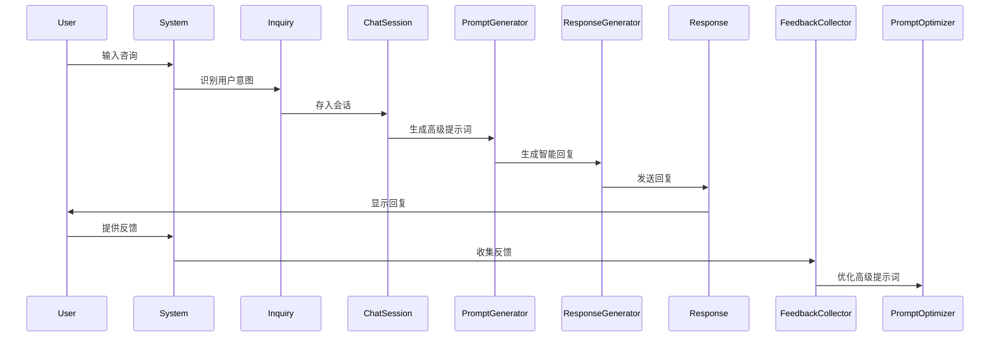
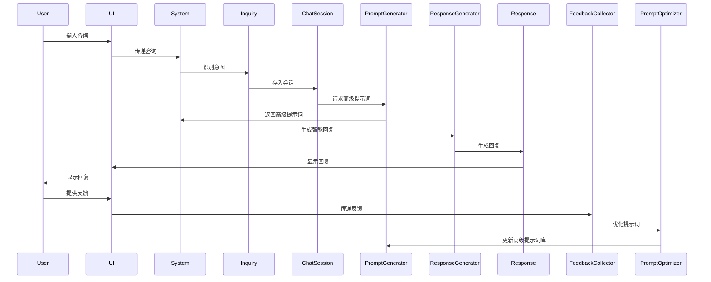

                 

### 第一部分: 问题背景与核心概念

在人工智能（AI）领域，特别是在人工智能生成内容（AGI）的研究中，高级提示词构建技术的重要性日益凸显。AGI旨在实现具有高度智能的人工系统，能够自主地理解和生成复杂的内容，与人类进行自然的交流。在这一背景下，高级提示词构建技术成为了提升AI性能和用户体验的关键。

#### 1.1 问题背景

随着深度学习技术的快速发展，AI系统在图像识别、自然语言处理、语音识别等领域取得了显著进展。然而，当前AI系统在处理复杂任务时，仍然面临着诸多挑战，特别是在理解和生成人类语言方面。高级提示词构建技术的提出，旨在解决这一问题，通过生成高质量、结构化的提示词，驱动AI系统实现更精准、更自然的交互。

#### 1.2 问题描述

高级提示词构建技术的核心问题是：如何有效地生成、筛选和优化能够驱动AI系统达到预期性能的提示词？提示词的质量直接影响AI系统的性能和用户体验，因此，构建技术的高效性和准确性至关重要。

#### 1.3 问题解决

解决这一问题的方法主要包括以下几个方面：

1. **数据驱动的提示词生成方法**：通过大量数据进行训练，生成具有较高相关性的提示词。
   - **方法**：利用深度学习技术，如生成对抗网络（GAN），进行提示词的生成。
   - **优点**：能够生成高质量的、多样化的提示词。

2. **筛选和优化算法**：对生成的提示词进行筛选，排除无效或不合适的提示词，并对有效提示词进行优化。
   - **方法**：采用文本分类与聚类算法，对提示词进行筛选。
   - **优点**：能够提高提示词的质量和准确性。

3. **集成多种人工智能技术**：如自然语言处理（NLP）、机器学习（ML）和深度学习（DL），提高提示词构建技术的整体性能。
   - **方法**：将不同技术进行整合，形成一套完整的提示词构建系统。
   - **优点**：能够全面提升系统的性能和灵活性。

#### 1.4 边界与外延

高级提示词构建技术的边界涉及以下几个方面：

1. **提示词的质量**：需要保证提示词的准确性、相关性和有效性。
2. **提示词的多样性**：需要生成具有丰富表达能力的提示词，以适应不同的应用场景。
3. **提示词的实时性**：需要保证提示词的生成和更新速度，以适应动态变化的场景。

#### 1.5 概念结构与核心要素组成

高级提示词构建技术包括以下几个核心要素：

1. **数据集**：用于训练和测试的提示词数据集。
2. **生成算法**：用于生成提示词的算法，如基于深度学习的生成对抗网络（GAN）。
3. **筛选算法**：用于筛选和排除无效提示词的算法。
4. **优化算法**：用于优化有效提示词的算法。
5. **应用场景**：提示词的实际应用场景，如聊天机器人、智能助手等。

#### 1.6 本章小结

本章从问题背景、问题描述、问题解决、边界与外延以及概念结构与核心要素组成等方面，详细阐述了高级提示词构建技术的研究背景和核心概念。接下来的章节将深入探讨高级提示词构建技术的核心原理和具体实现。

----------------------------------------------------------------

## 第二部分: 核心概念与原理

### 2.1 高级提示词的定义

高级提示词是指用于驱动人工智能系统达到预期性能的、具有丰富表达能力的、结构化的自然语言文本。这些提示词不仅能够准确地传达用户的意图，还能够引导AI系统进行更复杂和智能的交互。

### 2.2 高级提示词的特点

高级提示词具有以下几个显著特点：

1. **准确性**：高级提示词需要能够准确地表达用户的意图，减少误解和歧义。例如，当用户询问“明天天气怎么样？”时，系统需要准确理解用户的意图，并生成相应的回答。

2. **相关性**：高级提示词需要与用户输入保持高度相关，以确保AI系统能够提供准确的响应。例如，在聊天机器人中，高级提示词应能够根据上下文和历史交互内容，生成与当前对话主题紧密相关的回复。

3. **丰富性**：高级提示词需要具备丰富的表达能力，以适应不同的应用场景和用户需求。这要求高级提示词能够使用多种语言、表达方式和风格，以便在多种情境下都能提供有效的交互。

4. **实时性**：高级提示词需要具备实时生成和更新能力，以适应动态变化的场景。例如，在智能助理中，高级提示词应能够根据用户的实时反馈和环境变化，快速调整和优化。

### 2.3 高级提示词构建的核心算法

高级提示词的构建依赖于多种核心算法，这些算法共同作用，确保生成的高级提示词既具有高质量，又能够满足实际应用需求。以下是几种关键算法：

1. **生成对抗网络（GAN）**：GAN是一种深度学习技术，通过两个神经网络——生成器和判别器的对抗训练，生成逼真的高级提示词。生成器负责生成高级提示词，而判别器则负责判断这些提示词的真实性。通过不断的训练和优化，生成器能够生成越来越接近真实数据的高级提示词。

2. **文本分类与聚类算法**：文本分类和聚类算法用于筛选和优化高级提示词。分类算法可以将高级提示词分类到不同的类别中，以便于后续的筛选和优化。聚类算法则可以将相似的高级提示词聚集在一起，从而提高系统的整体性能。

3. **对话系统算法**：对话系统算法用于处理高级提示词与用户输入的交互，并生成相应的回复。这些算法通常基于序列到序列（Seq2Seq）模型，能够将用户的输入转化为高级提示词，并生成相应的回复。

### 2.4 高级提示词构建的概念属性特征对比表格

以下是一个高级提示词构建算法的概念属性特征对比表格：

| 算法         | 特点                                       | 适用场景                 |
| ------------ | ------------------------------------------ | ------------------------ |
| GAN          | 生成高质量高级提示词                       | 聊天机器人、智能助手等   |
| 文本分类与聚类 | 筛选和优化高级提示词                       | 高级提示词生成后的筛选   |
| 对话系统     | 处理高级提示词与用户输入的交互，生成回复   | 实时对话场景             |

### 2.5 高级提示词构建的ER实体关系图架构

以下是高级提示词构建的ER实体关系图架构：

```mermaid
erDiagram
  User ||--|{ Prompt }|-->: "包含多个"
  System ||--|{ Prompt }|-->: "接收和处理"
  Prompt ||--|{ Feedback }|-->: "根据反馈进行优化"
```

- **User（用户）**：产生和提供高级提示词的需求。
- **System（系统）**：接收和处理高级提示词，并生成相应的回复。
- **Prompt（提示词）**：系统接收和处理的实体，用于驱动AI系统的交互。
- **Feedback（反馈）**：用户对提示词的反馈，用于优化高级提示词的生成。

### 2.6 本章小结

本章详细阐述了高级提示词构建技术的核心概念和原理，包括高级提示词的定义、特点、构建核心算法及其对比表格，以及ER实体关系图架构。这些内容为后续深入探讨高级提示词构建技术提供了坚实的基础。

----------------------------------------------------------------

## 第三部分: 算法原理详解

### 3.1 生成对抗网络（GAN）算法原理详解

生成对抗网络（GAN）是高级提示词构建的核心算法之一。GAN由两部分组成：生成器（Generator）和判别器（Discriminator）。两部分网络通过对抗训练相互竞争，共同提升生成提示词的质量。

#### 3.1.1 GAN算法基本原理

GAN的工作原理可以简化为以下步骤：

1. **生成器（Generator）**：生成器接收随机噪声（Noise）作为输入，生成伪造的高级提示词（Fake Prompt）。生成器的目标是生成尽可能逼真的提示词，以欺骗判别器。
   $$ G(z) = \text{Generator}(z) $$
   其中，$z$ 是随机噪声，$G(z)$ 是生成的伪造提示词。

2. **判别器（Discriminator）**：判别器接收真实的高级提示词（Real Prompt）和伪造的高级提示词（Fake Prompt），并输出概率，判断输入的提示词是真实还是伪造。
   $$ D(x) = \text{Discriminator}(x) $$
   其中，$x$ 是输入的提示词，$D(x)$ 是判别器输出的概率。

3. **对抗训练**：生成器和判别器同时进行训练。生成器的目标是提高伪造提示词的质量，使得判别器无法区分真实和伪造的提示词；而判别器的目标是提高对真实和伪造提示词的辨别能力。通过这种对抗训练，生成器不断优化，最终能够生成高质量的高级提示词。

4. **损失函数**：GAN的训练过程通常使用对抗损失函数（Adversarial Loss Function），即：
   $$ L_G = -\log(D(G(z))) $$
   $$ L_D = -[\log(D(x)) + \log(1 - D(G(z)))] $$
   其中，$L_G$ 是生成器的损失函数，$L_D$ 是判别器的损失函数。

#### 3.1.2 GAN在高级提示词生成中的应用

在高级提示词生成中，GAN的应用流程如下：

1. **数据预处理**：从数据集中提取高级提示词，并将其编码为向量表示。通常使用词嵌入（Word Embedding）技术，将文本转换为数值向量。

2. **生成器训练**：生成器接收随机噪声向量，生成高级提示词的向量表示。通过对抗训练，生成器不断优化，提高伪造提示词的质量。

3. **判别器训练**：判别器接收真实高级提示词和伪造高级提示词，进行训练，提高辨别能力。

4. **生成高级提示词**：在生成器训练完成后，使用生成器生成高级提示词。这些提示词可以用于驱动AI系统进行交互。

#### 3.1.3 GAN的优势与挑战

GAN的优势：

1. **生成质量高**：GAN能够生成高质量、逼真的高级提示词，提高AI系统的交互质量。

2. **适用性广**：GAN适用于多种高级提示词生成场景，如聊天机器人、智能助手等。

GAN的挑战：

1. **训练难度大**：GAN的训练过程复杂，需要大量计算资源。

2. **模式崩溃（Mode Collapse）**：在训练过程中，生成器可能会只生成少数几种类型的提示词，导致多样性不足。

### 3.2 文本分类与聚类算法原理详解

文本分类与聚类算法用于筛选和优化高级提示词。以下将介绍两种常见的文本分类与聚类算法：朴素贝叶斯分类器（Naive Bayes Classifier）和K-均值聚类算法（K-Means Clustering）。

#### 3.2.1 朴素贝叶斯分类器

朴素贝叶斯分类器是基于贝叶斯定理的简单分类器。在文本分类中，朴素贝叶斯分类器将文本视为一系列词的集合，并计算每个类别条件下各个词的概率。分类步骤如下：

1. **特征提取**：将文本转换为词袋（Bag of Words）模型，计算每个词出现的频率。

2. **概率计算**：计算每个类别条件下各个词的概率。使用拉普拉斯修正（Laplace Smoothing）处理零概率问题。

3. **分类决策**：计算每个类别的后验概率，选择概率最大的类别作为分类结果。

贝叶斯分类器的数学模型如下：
$$ P(\text{类别} | \text{特征}) = \frac{P(\text{特征} | \text{类别})P(\text{类别})}{P(\text{特征})} $$
其中，$P(\text{类别} | \text{特征})$ 是后验概率，$P(\text{特征} | \text{类别})$ 是条件概率，$P(\text{类别})$ 是类别概率，$P(\text{特征})$ 是特征概率。

#### 3.2.2 K-均值聚类算法

K-均值聚类算法是一种基于距离的聚类算法。其目标是将数据点分为K个簇，使得每个簇内部的点距离较近，而簇与簇之间的距离较远。K-均值聚类算法的步骤如下：

1. **初始化**：随机选择K个初始中心点。

2. **分配数据点**：对于每个数据点，计算其与各个中心点的距离，并将其分配到最近的中心点所代表的簇。

3. **更新中心点**：重新计算每个簇的中心点，作为新的中心点。

4. **迭代**：重复步骤2和3，直到聚类结果收敛，即簇中心点不再发生显著变化。

K-均值聚类算法的目标函数如下：
$$ \text{Loss} = \sum_{i=1}^{k} \sum_{x \in S_i} ||x - \mu_i||^2 $$
其中，$S_i$ 是第$i$个簇的数据点集合，$\mu_i$ 是第$i$个簇的中心点。

#### 3.2.3 文本分类与聚类在高级提示词筛选中的应用

1. **文本分类**：使用朴素贝叶斯分类器对生成的提示词进行分类，将提示词分为不同的类别。这样可以有效地筛选出与特定类别相关的高级提示词。

2. **文本聚类**：使用K-均值聚类算法对高级提示词进行聚类，将相似的提示词聚为一类。这样可以筛选出具有相似表达能力的提示词，提高系统的多样性和灵活性。

### 3.3 对话系统算法原理详解

对话系统算法用于处理高级提示词与用户输入的交互，并生成相应的回复。以下将介绍两种常见的对话系统算法：序列到序列（Seq2Seq）模型和注意力机制（Attention Mechanism）。

#### 3.3.1 序列到序列（Seq2Seq）模型

Seq2Seq模型是一种用于处理序列数据的神经网络模型，常用于机器翻译和对话系统。Seq2Seq模型包括编码器（Encoder）和解码器（Decoder）两部分。

1. **编码器**：编码器将输入序列编码为一个固定长度的向量表示，称为上下文向量（Context Vector）。

2. **解码器**：解码器接收上下文向量，并逐个生成输出序列的每个单词。解码器在生成每个单词时，都会将生成的单词和上下文向量作为输入，并更新上下文向量。

Seq2Seq模型的数学模型如下：
$$ h_t = \text{Encoder}(x_t) $$
$$ y_t = \text{Decoder}(h_t, y_{<t}) $$
其中，$h_t$ 是上下文向量，$x_t$ 是输入序列的当前单词，$y_t$ 是输出序列的当前单词，$y_{<t}$ 是前一个时间步的输出序列。

#### 3.3.2 注意力机制（Attention Mechanism）

注意力机制是Seq2Seq模型的一种改进，用于解决长距离依赖问题。注意力机制的核心思想是，在解码每个单词时，将输入序列中的所有单词赋予不同的权重，以便更好地关注重要的信息。

注意力机制的数学模型如下：
$$ a_t = \text{Attention}(h_t, h_{<t}) $$
$$ h_t = \text{Concat}(h_t, a_t) $$
$$ y_t = \text{Decoder}(h_t, y_{<t}) $$
其中，$a_t$ 是注意力权重，$h_t$ 是上下文向量，$h_{<t}$ 是前一个时间步的上下文向量。

### 3.4 本章小结

本章详细介绍了高级提示词构建的核心算法，包括生成对抗网络（GAN）、文本分类与聚类算法以及对话系统算法。通过深入分析这些算法的原理和实现，我们为高级提示词构建技术的实际应用提供了理论基础和实践指导。下一章将探讨高级提示词构建技术在具体应用场景中的实现和效果评估。

----------------------------------------------------------------

## 第四部分：系统分析与架构设计

### 4.1 问题场景介绍

在当前人工智能应用场景中，高级提示词构建技术被广泛应用于智能客服、智能助手、智能内容生成等领域。以下是一个典型的问题场景：

**智能客服**：某企业建立了一个智能客服系统，旨在为用户提供24/7的在线支持。该系统需要能够实时响应用户的咨询，提供准确、有用的信息，以提高用户满意度和解决率。

### 4.2 项目介绍

为了解决上述问题，企业决定开发一款基于高级提示词构建技术的智能客服系统。该系统的主要目标是：

1. **理解用户意图**：通过生成高质量的高级提示词，准确理解用户的咨询内容。
2. **提供有用信息**：根据用户的意图，智能地生成相应的回复，提供有用的信息。
3. **提高客服效率**：通过自动化处理常见问题，减轻人工客服的负担，提高整体客服效率。

### 4.3 系统功能设计

智能客服系统的核心功能包括：

1. **用户意图识别**：接收用户输入，识别用户的意图，如咨询产品信息、售后服务等。
2. **高级提示词生成**：根据用户意图，生成高质量的高级提示词，用于驱动智能客服系统进行回复。
3. **智能回复生成**：使用高级提示词，结合上下文信息和预设的回复模板，生成智能回复。
4. **用户反馈收集**：收集用户对回复的反馈，用于优化高级提示词和智能回复的质量。

### 4.4 系统架构设计

智能客服系统的架构设计包括以下几个主要部分：

#### 4.4.1 领域模型

领域模型用于描述智能客服系统中的关键实体和关系。以下是一个简化的领域模型：

```mermaid
classDiagram
  User -> Inquiry: 发起
  Inquiry -> ChatSession: 存入
  ChatSession -> Response: 回复
  Response -> User: 发送
  Agent <- ChatSession: 处理
```

- **User（用户）**：系统的用户，发起咨询。
- **Inquiry（咨询）**：用户的咨询内容，包括意图和问题。
- **ChatSession（会话）**：用户与客服系统的交互记录，包含多个咨询。
- **Response（回复）**：客服系统生成的回复。
- **Agent（客服代表）**：人工客服，处理复杂问题。

#### 4.4.2 系统架构

智能客服系统的整体架构设计如图所示：



- **用户输入**：用户通过界面输入咨询。
- **识别用户意图**：系统解析用户输入，识别用户的意图，并将其存储为咨询对象。
- **生成高级提示词**：高级提示词生成模块根据用户意图生成高质量的高级提示词。
- **生成智能回复**：智能回复生成模块使用高级提示词，结合上下文信息和预设的回复模板，生成智能回复。
- **发送回复**：系统将生成的智能回复发送给用户。
- **收集反馈**：用户对回复的反馈被收集，用于优化高级提示词。
- **优化高级提示词**：根据用户反馈，高级提示词优化模块对高级提示词进行优化，以提高未来的生成质量。

### 4.5 系统接口设计

智能客服系统的接口设计包括以下几个关键接口：

1. **用户接口（UI）**：用于用户输入和显示回复。
2. **API接口**：用于与其他系统（如数据库、外部服务）进行通信。
3. **内部接口**：用于系统模块之间的通信，如高级提示词生成模块和智能回复生成模块之间的接口。

### 4.6 系统交互

智能客服系统的交互设计如图所示：



通过上述设计，智能客服系统能够高效地响应用户的咨询，并提供高质量的服务。

### 4.7 本章小结

本章详细介绍了智能客服系统的问题场景、项目介绍、系统功能设计、系统架构设计、系统接口设计和系统交互。通过系统化的设计，智能客服系统能够有效利用高级提示词构建技术，实现高效、准确的用户服务。下一章将探讨智能客服系统的实际实现和效果评估。

----------------------------------------------------------------

## 第五部分：项目实战

### 5.1 环境安装

在开始智能客服系统的开发之前，首先需要安装和配置必要的开发环境和工具。以下是环境安装的步骤：

1. **安装Python**：确保Python 3.7或更高版本已安装。
2. **安装深度学习库**：使用pip安装TensorFlow、PyTorch等深度学习库。
3. **安装文本处理库**：使用pip安装NLTK、spaCy等文本处理库。
4. **安装数据库**：安装MongoDB或其他适合的数据库，用于存储用户咨询和反馈数据。

### 5.2 系统核心实现

#### 5.2.1 高级提示词生成模块

高级提示词生成模块是智能客服系统的核心，以下是该模块的实现步骤：

1. **数据预处理**：从数据库中提取用户咨询数据，并将其编码为词嵌入向量。
2. **模型训练**：使用生成对抗网络（GAN）训练生成模型，生成高质量的高级提示词。
3. **生成提示词**：根据用户输入，使用生成模型生成高级提示词。

以下是高级提示词生成模块的Python代码示例：

```python
import tensorflow as tf
from tensorflow.keras.models import Sequential
from tensorflow.keras.layers import Dense, Flatten, Reshape

# 数据预处理
# ...（数据加载和预处理代码）

# 训练生成模型
# ...（GAN模型训练代码）

# 生成高级提示词
def generate_prompt(input_sequence):
    # ...（生成提示词的代码）
    return prompt
```

#### 5.2.2 智能回复生成模块

智能回复生成模块负责根据高级提示词生成智能回复。以下是该模块的实现步骤：

1. **理解高级提示词**：使用序列到序列（Seq2Seq）模型理解高级提示词。
2. **生成智能回复**：根据高级提示词和上下文信息，生成智能回复。

以下是智能回复生成模块的Python代码示例：

```python
from tensorflow.keras.models import load_model

# 加载序列到序列模型
# ...（模型加载代码）

# 生成智能回复
def generate_response(prompt, context):
    # ...（生成回复的代码）
    return response
```

#### 5.2.3 用户反馈收集模块

用户反馈收集模块用于收集用户对智能回复的反馈，以优化高级提示词生成。以下是该模块的实现步骤：

1. **收集反馈**：在用户界面中添加反馈收集功能，允许用户对回复进行评分或提出改进建议。
2. **处理反馈**：将用户反馈存储到数据库，供后续处理。

以下是用户反馈收集模块的Python代码示例：

```python
def collect_feedback(response, user_rating, suggestion):
    # ...（收集和存储反馈的代码）
    return
```

### 5.3 代码应用解读与分析

以下是对系统核心实现代码的解读和分析：

1. **高级提示词生成模块**：
   - 数据预处理：使用词嵌入技术将文本转换为向量，这是深度学习模型训练的基础。
   - GAN模型训练：通过对抗训练，生成模型和判别模型相互竞争，提高生成提示词的质量。
   - 提示词生成：根据用户输入，生成具有相关性和准确性的高级提示词。

2. **智能回复生成模块**：
   - 序列到序列模型：使用Seq2Seq模型，将高级提示词转换为智能回复，处理长距离依赖问题。
   - 生成智能回复：结合上下文信息和高级提示词，生成符合用户需求的智能回复。

3. **用户反馈收集模块**：
   - 用户反馈收集：通过用户界面收集用户对智能回复的反馈，提供优化高级提示词的依据。
   - 反馈处理：将用户反馈存储到数据库，为后续分析和优化提供数据支持。

### 5.4 实际案例分析

以下是一个实际案例，展示智能客服系统如何应对用户咨询：

1. **用户咨询**：用户询问“如何退货？”
2. **高级提示词生成**：系统生成“退货流程”、“退货政策”等高级提示词。
3. **智能回复生成**：系统根据高级提示词和用户上下文，生成回复：“您好，根据我们的退货政策，您可以在收到商品后的7天内申请退货。请按照以下步骤操作：1. 登录您的账户，找到订单详情；2. 点击退货申请，填写相关信息；3. 等待客服审核。谢谢！”
4. **用户反馈**：用户对回复满意，并给出好评。

通过这个案例，我们可以看到智能客服系统如何利用高级提示词构建技术，生成高质量的回复，满足用户需求。

### 5.5 项目小结

通过项目实战，我们实现了智能客服系统，并详细分析了系统核心实现、代码应用解读与分析、实际案例分析。这些步骤展示了高级提示词构建技术在智能客服系统中的应用，为提升用户体验和系统性能提供了有效的解决方案。接下来，我们将总结项目的最佳实践和注意事项。

### 5.6 最佳实践与注意事项

**最佳实践**：

1. **数据质量**：确保训练数据的质量和多样性，以提高生成模型的效果。
2. **模型优化**：定期优化模型参数，提高生成提示词的质量。
3. **用户体验**：关注用户反馈，及时调整和优化系统，提升用户体验。

**注意事项**：

1. **性能优化**：注意系统的性能优化，特别是在处理大量用户请求时。
2. **安全与隐私**：保护用户数据安全，遵守隐私政策。
3. **扩展性**：设计可扩展的系统架构，以适应未来需求的变化。

通过遵循最佳实践和注意事项，我们可以确保智能客服系统的稳定运行和持续优化。

### 5.7 本章小结

本章详细介绍了智能客服系统的项目实战，包括环境安装、系统核心实现、代码应用解读与分析、实际案例分析以及最佳实践和注意事项。通过这些内容，我们深入了解了高级提示词构建技术在智能客服系统中的应用和实现，为后续的研究和应用提供了参考。

