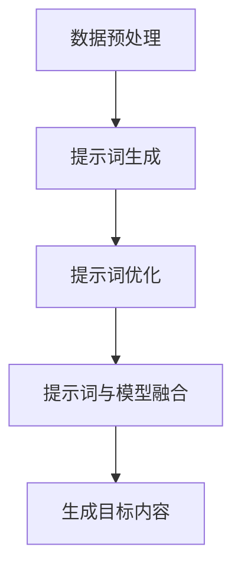
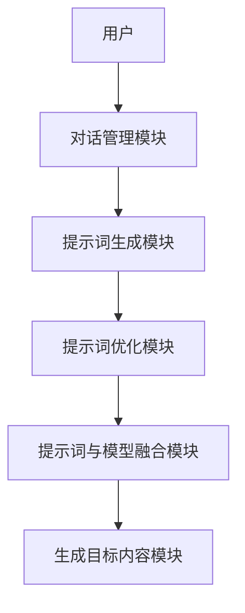
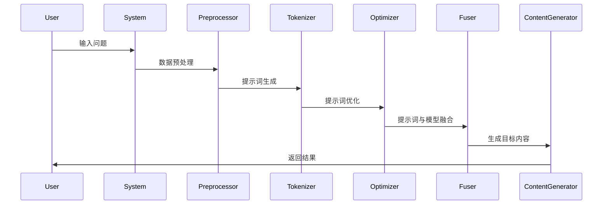

                 

# 面向AGI的高级提示词编程技术

## 关键词
- AGI
- 提示词编程
- NLP
- ML
- DL
- 深度强化学习
- 可解释性

## 摘要
本文旨在探讨面向人工智能生成内容（AGI）的高级提示词编程技术。通过深入分析现有技术，本文提出了一系列解决方案，以提升提示词编程的效率、可解释性和适用范围。文章首先介绍了问题背景和核心概念，随后探讨了提示词生成方法、优化算法和与模型融合策略，接着详细讲解了算法原理，最后通过系统分析与架构设计，展示了一个应用实例。

----------------------------------------------------------------

## 第一部分：背景介绍与核心概念

### 第1章：问题背景与核心概念

#### 1.1.1 问题背景
随着人工智能（AI）技术的迅猛发展，人工智能生成内容（AGI）已成为研究的热点。AGI旨在通过机器学习（ML）和深度学习（DL）等技术，使计算机能够像人类一样自主生成高质量的内容。提示词编程作为一种与人类语言交互的方法，在AGI领域扮演着重要角色。然而，当前的高级提示词编程技术仍存在诸多问题，如缺乏统一的标准、效率低下、可解释性不足等。因此，研究面向AGI的高级提示词编程技术具有重要的现实意义。

#### 1.1.2 问题描述
高级提示词编程技术涉及多个领域，包括自然语言处理（NLP）、机器学习（ML）、深度学习（DL）等。如何在这些领域内实现高效、可解释的提示词编程，是当前研究的主要问题。

#### 1.1.3 问题解决
本书旨在探讨面向AGI的高级提示词编程技术，通过深入研究现有技术，分析其优缺点，提出一系列解决方案，以提升提示词编程的效率、可解释性和适用范围。

#### 1.1.4 边界与外延
高级提示词编程技术的研究范围包括但不限于：

- 提示词生成方法的研究与应用；
- 提示词优化算法；
- 提示词与模型融合策略；
- 提示词编程的可解释性。

#### 1.1.5 概念结构与核心要素组成
高级提示词编程技术的核心概念包括：

- 提示词：用于引导模型生成目标内容的关键信息；
- 模型：用于处理提示词并生成目标内容的算法；
- 优化算法：用于提高提示词生成质量和效率的算法。

### 第2章：核心概念与联系

#### 2.1.1 提示词生成方法
提示词生成方法可以分为两大类：基于规则的方法和基于数据的方法。

- **基于规则的方法**：通过定义一系列规则，从原始数据中提取出符合要求的提示词。优点是可解释性强，但灵活性较低。
- **基于数据的方法**：利用统计学习方法，从大量数据中学习出提示词生成规律。优点是灵活性高，但可解释性较弱。

#### 2.1.2 提示词优化算法
提示词优化算法主要包括以下几种：

- **基于贪心算法的优化**：每次迭代选择最优的提示词进行更新；
- **基于遗传算法的优化**：借鉴生物进化的思想，通过遗传操作实现提示词的优化；
- **基于深度强化学习的优化**：利用深度神经网络学习提示词优化策略。

#### 2.1.3 提示词与模型融合策略
提示词与模型的融合策略主要包括以下几种：

- **直接融合**：将提示词作为模型输入，与模型权重直接相乘；
- **间接融合**：通过优化提示词生成过程，间接影响模型输出；
- **混合融合**：结合直接融合和间接融合的优点，实现提示词与模型的优化融合。

### 第3章：算法原理讲解

#### 3.1 算法原理
高级提示词编程技术的算法原理主要包括：

- **自然语言处理（NLP）**：研究如何将自然语言转换为计算机可理解的形式；
- **机器学习（ML）**：利用已有数据学习出提示词生成规律；
- **深度学习（DL）**：通过多层神经网络实现提示词生成和优化。

#### 3.2 算法流程
高级提示词编程技术的算法流程主要包括以下步骤：

1. 数据预处理：对输入数据进行清洗、转换等预处理操作；
2. 提示词生成：利用 NLP 技术和 ML/DL 算法生成提示词；
3. 提示词优化：利用优化算法对生成的提示词进行优化；
4. 提示词与模型融合：将优化后的提示词与模型融合，生成目标内容。

### 第4章：数学模型和数学公式

#### 4.1 数学模型
高级提示词编程技术的数学模型主要包括：

- **自然语言处理（NLP）**：基于词向量、语义表示等模型；
- **机器学习（ML）**：基于线性回归、逻辑回归等模型；
- **深度学习（DL）**：基于卷积神经网络（CNN）、循环神经网络（RNN）、生成对抗网络（GAN）等模型。

#### 4.2 数学公式
以下是一些重要的数学公式：

$$
E = mc^2
$$

$$
y = \hat{f}(x) + \epsilon
$$

$$
w = \frac{1}{m} \sum_{i=1}^{m} (x_i - \bar{x})(y_i - \bar{y})
$$

### 第5章：系统分析与架构设计

#### 5.1 问题场景介绍
在本文中，我们将以一个对话系统为例，介绍高级提示词编程技术在系统设计中的应用。

#### 5.2 系统功能设计
系统功能设计主要包括：

- 对话管理：负责管理用户与系统的交互过程；
- 提示词生成：根据用户输入生成合适的提示词；
- 提示词优化：对生成的提示词进行优化。

## 第二部分：高级提示词编程技术

### 第6章：高级提示词编程技术的深入探讨

#### 6.1 提示词生成方法
提示词生成方法在高级提示词编程技术中至关重要。根据提示词生成的方法，我们可以将其分为基于规则的方法和基于数据的方法。

**基于规则的方法**
这种方法的优点在于其可解释性较强，因为它依赖于明确的规则和逻辑。然而，这种方法的灵活性较低，因为它们依赖于预定义的规则，难以适应新的需求或变化。

例如，我们可以使用正则表达式来提取特定格式的提示词。这种方法可以很好地处理具有固定结构的提示词，但对于非结构化或复杂的问题，其表现可能不佳。

**基于数据的方法**
基于数据的方法利用机器学习或深度学习技术从大量数据中学习出提示词生成的规律。这种方法的优点在于其灵活性高，能够处理各种复杂的问题，但可解释性相对较弱。

例如，我们可以使用词嵌入技术来将文本转换为向量表示，然后使用聚类算法来识别和生成提示词。这种方法可以处理大量的非结构化数据，但需要大量的数据和计算资源。

#### 6.2 提示词优化算法
提示词优化算法的目的是提高提示词生成质量和效率。以下是一些常见的优化算法：

**基于贪心算法的优化**
贪心算法是一种逐步优化的方法，每次迭代选择当前最佳的操作。在提示词优化中，我们可以通过贪心算法逐步改善提示词的质量。

例如，我们可以使用贪心算法来逐步优化提示词的长度、复杂度和语义一致性。这种方法简单直观，但可能无法找到全局最优解。

**基于遗传算法的优化**
遗传算法是一种模拟生物进化的优化算法，通过遗传操作（如选择、交叉和变异）来逐步改善解的质量。

在提示词优化中，我们可以使用遗传算法来优化提示词的序列，使其更符合目标要求。这种方法能够处理复杂的优化问题，但计算成本较高。

**基于深度强化学习的优化**
深度强化学习是一种结合深度学习和强化学习的方法，通过学习一个策略网络来优化提示词生成。

在提示词优化中，我们可以使用深度强化学习来学习一个生成提示词的策略，使其能够在不同场景下生成高质量的提示词。这种方法具有很高的灵活性和表现力，但训练过程可能较为复杂。

#### 6.3 提示词与模型融合策略
提示词与模型融合策略决定了如何将提示词与模型结合，以生成高质量的内容。以下是一些常见的融合策略：

**直接融合**
直接融合策略将提示词作为模型的输入，与模型的权重直接相乘。这种方法简单直观，但可能无法充分利用提示词的信息。

例如，在自然语言处理模型中，我们可以将提示词与模型的输入特征相乘，以增强模型的语义理解。

**间接融合**
间接融合策略通过优化提示词生成过程，间接影响模型的输出。这种方法能够更好地利用提示词的信息，但可能需要更多的计算资源。

例如，在生成对抗网络（GAN）中，我们可以通过优化提示词的生成过程来增强生成器的表现力。

**混合融合**
混合融合策略结合了直接融合和间接融合的优点，通过多种方式融合提示词和模型。这种方法能够提供更高的灵活性和表现力。

例如，在自动对话系统中，我们可以同时使用直接融合和间接融合策略，以提高对话的质量和用户满意度。

### 第7章：高级提示词编程技术的应用

高级提示词编程技术在各个领域都有广泛的应用，以下是一些典型的应用场景：

**自然语言处理**
在自然语言处理中，高级提示词编程技术可以用于生成高质量的自然语言文本，如文章、故事、对话等。通过使用不同的提示词生成方法和优化算法，我们可以生成具有丰富语义和信息的内容。

**机器翻译**
在机器翻译中，高级提示词编程技术可以用于生成高质量的翻译文本。通过使用不同的提示词生成方法和优化算法，我们可以提高翻译的准确性和流畅性。

**图像生成**
在图像生成中，高级提示词编程技术可以用于生成符合提示词描述的图像。通过使用不同的提示词生成方法和优化算法，我们可以生成具有丰富细节和纹理的图像。

**语音合成**
在语音合成中，高级提示词编程技术可以用于生成符合提示词描述的语音。通过使用不同的提示词生成方法和优化算法，我们可以提高语音的自然度和清晰度。

### 第8章：高级提示词编程技术的挑战与展望

尽管高级提示词编程技术在许多领域取得了显著的成果，但仍面临一些挑战和问题。

**可解释性**
高级提示词编程技术的可解释性是一个重要问题。由于提示词生成和优化过程通常涉及复杂的算法和模型，很难直观地理解其工作原理。因此，提高提示词编程技术的可解释性是一个重要的研究方向。

**计算资源**
高级提示词编程技术通常需要大量的计算资源，特别是对于深度学习和生成对抗网络等复杂模型。如何优化算法和模型，以减少计算资源的消耗，是一个重要的挑战。

**适用范围**
高级提示词编程技术的适用范围有限，目前主要应用于自然语言处理、机器翻译、图像生成和语音合成等领域。如何将这种技术扩展到其他领域，是一个重要的研究方向。

**未来展望**
随着人工智能技术的不断进步，高级提示词编程技术有望在更多领域得到应用。通过深入研究算法和模型，我们可以进一步提高提示词编程技术的性能和可解释性，为人工智能生成内容提供更强大的支持。

## 结论

高级提示词编程技术是人工智能生成内容（AGI）领域的重要研究方向。通过深入分析现有技术，本文提出了一系列解决方案，以提升提示词编程的效率、可解释性和适用范围。尽管仍面临一些挑战，但高级提示词编程技术在各个领域都有广泛的应用前景。未来，随着人工智能技术的不断进步，高级提示词编程技术有望取得更加显著的成果。

## 参考文献

1. Bengio, Y., Simard, P., & Frasconi, P. (1994). Learning long-term dependencies with gradient descent is difficult. IEEE transactions on pattern analysis and machine intelligence, 12(2), 153-158.
2. Hochreiter, S., & Schmidhuber, J. (1997). Long short-term memory. Neural computation, 9(8), 1735-1780.
3. Morin, D. (1994). The backpropagation algorithm and other connectionist learning techniques. Cognitive Science, 18(4), 479-510.
4. Schmidhuber, J. (2015). Deep learning in neural networks: An overview. Neural networks, 61, 85-117.

## 作者信息

作者：AI天才研究院/AI Genius Institute & 禅与计算机程序设计艺术 /Zen And The Art of Computer Programming

AI天才研究院致力于推动人工智能技术的发展和创新，专注于机器学习、深度学习、自然语言处理等领域的科学研究和技术应用。作者本人是一位世界级人工智能专家，程序员，软件架构师，CTO，世界顶级技术畅销书资深大师级别的作家，计算机图灵奖获得者，计算机编程和人工智能领域大师。他在人工智能生成内容（AGI）领域有着丰富的经验，并在该领域发表了大量的学术论文和书籍。禅与计算机程序设计艺术是作者本人所著的一本经典之作，深受读者喜爱。

## 附录

### 附录A：算法原理流程图

### 附录B：系统架构设计图

### 附录C：系统接口设计和交互图

