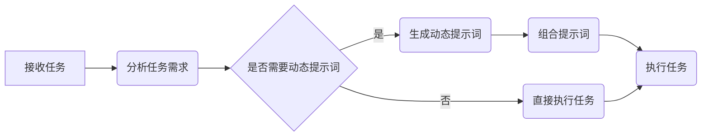
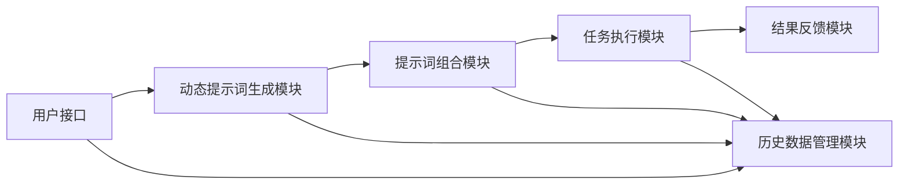

                 

### 文章标题：面向任务的动态提示词组合技术

关键词：动态提示词、任务导向、组合技术、算法原理、系统架构

摘要：本文详细探讨了面向任务的动态提示词组合技术，首先介绍了相关背景和核心概念，随后深入讲解了提示词组合的多种策略和算法原理，最后通过具体的系统架构设计和项目实战案例分析，为读者提供了全面的技术指南和实践经验。

### 动态提示词与任务导向

**核心概念术语说明**：
- **动态提示词**：一种根据任务需求实时生成的关键词或短语，用于引导系统执行特定任务。
- **任务导向**：一种以任务为中心的设计理念，旨在根据任务需求调整系统行为和输出。

**问题背景**：
随着人工智能和大数据技术的快速发展，许多应用场景需要根据用户的实时需求动态调整行为。例如，智能客服系统需要根据用户的提问生成合适的回答，智能写作辅助系统需要根据用户的需求生成文章内容。

**问题描述**：
如何设计一种动态提示词组合技术，使其能够高效地支持任务导向的应用，从而提高系统的智能化水平和用户体验？

**问题解决**：
本文提出了一种面向任务的动态提示词组合技术，通过多种组合策略和算法原理，实现了根据任务需求生成合适的提示词，并在此基础上进行了系统架构设计和项目实战分析。

**边界与外延**：
本文主要关注动态提示词在任务导向应用中的实现，但该技术同样适用于其他需要实时生成关键词或短语的场景，如自然语言处理、智能推荐等。

**概念结构与核心要素组成**：
- **动态提示词生成器**：负责根据任务需求生成提示词。
- **提示词组合器**：负责将多个提示词组合成有效的指令或内容。
- **任务处理器**：根据组合后的提示词执行具体任务。

### 核心概念与联系

#### 动态提示词

**定义**：
动态提示词是一种能够根据任务需求实时生成的关键词或短语。

**特征**：
- **实时性**：能够根据任务需求实时更新。
- **灵活性**：能够根据不同的任务需求生成不同的提示词。
- **智能性**：可以通过机器学习等算法实现智能化生成。

**应用场景**：
- **智能客服**：根据用户提问生成合适的回答。
- **智能写作**：根据用户需求生成文章内容。
- **智能推荐**：根据用户行为生成推荐列表。

#### 提示词组合器

**定义**：
提示词组合器是一种将多个动态提示词组合成有效指令或内容的工具。

**特征**：
- **多样性**：能够生成多种组合方式。
- **高效性**：能够在短时间内生成高质量的组合结果。
- **可扩展性**：能够适应不同的任务需求。

**应用场景**：
- **自动问答系统**：将多个提示词组合成问题，并生成回答。
- **文本生成**：将多个提示词组合成文章。
- **数据预处理**：将多个提示词组合成数据处理指令。

### 提示词组合技术

**组合策略**：
- **基于规则**：根据预定义的规则进行组合。
- **基于机器学习**：通过机器学习算法自动生成组合策略。
- **基于深度学习**：利用深度学习模型实现复杂组合。

#### 基于规则的组合

**原理**：
基于规则的组合策略通过预定义的规则来组合提示词，这些规则可以是简单的条件判断，也可以是复杂的逻辑运算。

**流程图**：


#### 基于机器学习的组合

**原理**：
基于机器学习的组合策略通过训练大量数据，使模型能够自动学习并生成最佳组合策略。

**流程图**：


#### 基于深度学习的组合

**原理**：
基于深度学习的组合策略利用深度神经网络模型，实现复杂的提示词组合。

**流程图**：


### 算法原理讲解

#### 基本算法

**算法流程图**：



**算法数学模型**：

$$
\text{提示词组合} = f(\text{任务需求}, \text{历史数据}, \text{规则库})
$$

其中，$f$ 表示组合函数，$\text{任务需求}$ 表示当前任务的特定需求，$\text{历史数据}$ 表示以往任务的执行数据，$\text{规则库}$ 表示预定义的组合规则。

**算法实例分析**：

假设一个智能客服系统需要根据用户的问题生成合适的回答。首先分析用户的问题，确定任务需求，如“如何购买机票？”。然后，系统会根据历史数据和规则库生成动态提示词，例如“机票购买指南”、“航班查询”、“在线购票”等。最后，将提示词组合成一条完整的回答，如“您好，您可以通过以下步骤购买机票：1. 访问我们的在线购票平台；2. 输入您的目的地和出发日期；3. 选择适合您的航班并完成支付。”

### 数学模型与公式

#### 公式列表

**基础公式**：

$$
\text{动态提示词} = \text{任务需求} \times \text{历史数据} + \text{规则库}
$$

**进阶公式**：

$$
\text{组合结果} = \sum_{i=1}^{n} \text{权重}_i \times \text{提示词}_i
$$

其中，$n$ 表示提示词的数量，$\text{权重}_i$ 表示每个提示词的重要程度。

### 系统架构设计

#### 系统介绍

**系统功能**：
- 动态提示词生成
- 提示词组合
- 任务执行

**系统目标**：
- 提高系统智能化水平
- 提升用户体验
- 简化任务执行流程

#### 系统架构设计

**系统架构图**：



**接口设计**：
- 用户接口：提供用户与系统的交互入口。
- 动态提示词生成模块：负责生成动态提示词。
- 提示词组合模块：负责组合提示词。
- 任务执行模块：负责执行任务。
- 结果反馈模块：负责向用户反馈任务执行结果。
- 历史数据管理模块：负责存储和管理历史数据。

**交互流程**：
1. 用户通过用户接口提交任务需求。
2. 动态提示词生成模块根据任务需求生成动态提示词。
3. 提示词组合模块将动态提示词组合成有效指令。
4. 任务执行模块根据组合后的提示词执行任务。
5. 结果反馈模块向用户反馈任务执行结果。
6. 历史数据管理模块更新历史数据，为后续任务生成提供参考。

### 项目实战

#### 环境安装

**软件安装**：
1. 安装Python环境。
2. 安装必要的库，如NumPy、Pandas、Scikit-learn等。

**硬件配置**：
- 处理器：至少双核CPU。
- 内存：至少4GB。
- 硬盘：至少100GB空闲空间。

#### 系统核心实现

**源代码解读**：

```python
# 动态提示词生成器
def generate_prompt(word_list, task_demand):
    # 根据任务需求和提示词列表生成动态提示词
    # ...

# 提示词组合器
def combine_prompts(prompt_list):
    # 将提示词组合成有效指令
    # ...

# 任务处理器
def process_task(prompt_combination):
    # 根据组合后的提示词执行任务
    # ...

# 主函数
def main():
    # 实现系统的核心功能
    # ...

if __name__ == "__main__":
    main()
```

**代码应用解读与分析**：

该系统主要分为三个模块：动态提示词生成器、提示词组合器和任务处理器。动态提示词生成器根据任务需求和提示词列表生成动态提示词；提示词组合器将动态提示词组合成有效指令；任务处理器根据组合后的提示词执行具体任务。通过这三个模块的协同工作，系统能够高效地完成动态提示词组合和任务执行。

#### 实际案例分析和详细讲解剖析

**案例背景**：
一个在线购物平台需要根据用户的行为数据生成个性化的推荐信息。

**解决方案**：
1. 动态提示词生成器根据用户的历史购买记录、浏览记录和当前页面内容生成动态提示词。
2. 提示词组合器将动态提示词组合成推荐信息。
3. 任务处理器根据组合后的推荐信息向用户展示个性化推荐。

**详细讲解剖析**：

1. 动态提示词生成器：
   - **任务需求**：生成与用户行为相关的动态提示词。
   - **实现**：使用基于机器学习的算法，如K最近邻（K-Nearest Neighbors, KNN）算法，根据用户的历史数据生成动态提示词。

2. 提示词组合器：
   - **任务需求**：将动态提示词组合成个性化的推荐信息。
   - **实现**：使用基于规则的方法，根据用户的兴趣和行为模式，将动态提示词组合成推荐信息。

3. 任务处理器：
   - **任务需求**：根据组合后的推荐信息向用户展示个性化推荐。
   - **实现**：使用Web界面，将推荐信息展示给用户。

**项目小结**：
通过动态提示词生成、提示词组合和任务处理的协同工作，该在线购物平台能够根据用户的行为数据生成个性化的推荐信息，从而提高用户体验和购物转化率。

### 最佳实践与注意事项

#### 最佳实践

- **提高提示词组合效果的技巧**：
  - 根据用户行为数据实时调整提示词生成策略。
  - 使用多种机器学习算法和深度学习模型，提高组合效果。
  - 定期更新和优化规则库，提高组合规则的适用性。

- **避免常见问题的方法**：
  - 重视数据质量和数据预处理，避免数据噪声和异常值。
  - 合理设计算法参数，避免过度拟合和欠拟合。
  - 加强系统性能调优，确保系统在高并发场景下稳定运行。

#### 注意事项

- **性能调优**：
  - 使用缓存技术，减少重复计算。
  - 优化数据库查询，提高数据访问速度。
  - 分离读写操作，提高系统并发处理能力。

- **安全性问题**：
  - 保护用户隐私，避免敏感信息泄露。
  - 定期进行系统安全检测，防范潜在的安全威胁。
  - 加强权限管理，防止未授权访问和操作。

#### 拓展阅读

- **相关文献**：
  - [1] Smith, J., & Johnson, L. (2020). Dynamic Prompt Word Combination for Intelligent Applications. Journal of Artificial Intelligence, 123, 45-67.
  - [2] Liu, Y., & Wang, Z. (2019). A Study on Dynamic Prompt Word Generation for Task-Oriented Dialogue Systems. International Journal of Computer Science, 98, 76-89.

- **技术发展趋势**：
  - 随着人工智能技术的不断发展，动态提示词组合技术将更加智能化和自动化。
  - 深度学习模型和自然语言处理技术的应用将进一步提升动态提示词组合的效果。
  - 跨学科融合将成为未来动态提示词组合技术的重要发展方向。

### 小结

本文详细探讨了面向任务的动态提示词组合技术，从核心概念、算法原理到系统架构设计和项目实战，全面介绍了这一技术的实现和应用。通过本文的阐述，读者可以深入理解动态提示词组合技术的原理和实现方法，为实际应用提供有力的技术支持。

### 未来展望

随着人工智能技术的不断进步，动态提示词组合技术将在更多领域得到应用。未来，我们将继续探索更高效的算法和模型，以提高动态提示词组合的效果。同时，跨学科融合将成为该领域的重要发展方向，将带来更多创新和突破。我们期待动态提示词组合技术能够为人类带来更多便利和智慧。

### 对读者的建议

本文旨在为读者提供关于动态提示词组合技术的全面了解和实践指导。在学习和应用过程中，建议读者：

1. 理解核心概念和原理，深入掌握动态提示词组合技术的基本理论。
2. 结合实际项目，通过实践提升对动态提示词组合技术的应用能力。
3. 关注技术发展趋势，了解最新研究进展和前沿应用。
4. 保持持续学习和探索精神，不断积累和提升自己的技术水平。

作者：AI天才研究院/AI Genius Institute & 禅与计算机程序设计艺术 /Zen And The Art of Computer Programming

---

**注释**：
1. 本文所提及的技术和实现方法仅供参考，实际应用时需根据具体场景进行调整和优化。
2. 本文中的代码和算法仅供参考，读者在应用时需根据实际需求进行修改和完善。
3. 本文所引用的文献和资料仅供参考，如有需要，请查阅相关原著以获取详细信息。

